# 📚 Godot 4 游戏开发实战 读书笔记

## 📖 基本信息

- **书名**: Godot 4 Game Development Projects（第二版）
- **原名**: Godot 4 Game Development Projects: Build five cross-platform 2D and 3D games
- **作者**: Chris Bradfield
- **出版社**: Packt Publishing
- **出版年份**: 2023年
- **页数**: 约420页
- **作者背景**: 资深游戏开发者，KidsCanCode网站创始人，长期从事Godot教学内容创作
- **创建时间**: 2026年6月3日
- **难度等级**: 初级至中级
- **阅读状态**: 📖 准备阅读
- **个人评分**: ⭐⭐⭐⭐⭐
- **标签**: #游戏开发 #Godot4 #GDScript #2D游戏 #3D游戏 #开源引擎 #跨平台

---

## 📝 内容概要

### 书籍定位

《Godot 4 Game Development Projects》是一本**项目驱动型**的 Godot 4 游戏开发入门到进阶书籍。通过5个完整跨平台游戏项目，系统讲解 Godot 4 的设计哲学、核心架构与开发工作流。本书的独特价值在于：它不仅教你"怎么做"，更通过项目实践揭示 Godot 引擎背后"为什么这样设计"的思考逻辑。

**本书解决的核心问题**：
- 如何理解并运用 Godot 独特的场景/节点组合式架构
- GDScript 作为游戏专用语言与通用语言的本质区别
- 2D 与 3D 游戏在架构层面的共性与差异
- 游戏对象生命周期与帧循环的正确使用模式
- 从单机原型到跨平台发布的完整工程实践

### 主要章节结构

| 章节 | 主题 | 核心知识点 |
|------|------|------------|
| 第1章 | Godot 4 引擎总览 | 引擎架构、编辑器界面、项目结构 |
| 第2章 | GDScript 核心机制 | 类型系统、生命周期、信号系统 |
| 第3章 | 2D项目 Coin Dash | 节点组合、输入处理、碰撞分层 |
| 第4章 | 2D项目 Infinite Jumper | 程序化生成、相机跟随、UI绑定 |
| 第5章 | 2D项目 Jungle Jump | TileMap关卡、AnimationTree状态机 |
| 第6章 | 3D项目 Space Rocks | 3D物理、相机控制、粒子系统 |
| 第7章 | 3D项目 Minigolf | NavigationAgent、3D碰撞、光照烘焙 |
| 第8章 | 导出与优化 | 多平台导出、性能分析、资源压缩 |

---

## 🧠 全局知识架构

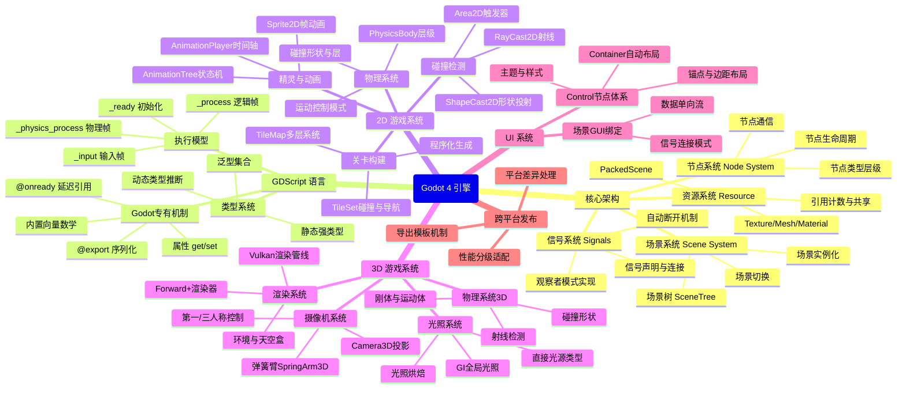

---

## ✍️ 核心章节深度解析

---

### 第1章：Godot 引擎的设计哲学与架构

#### 1.1 Godot 在引擎谱系中的定位

理解一个引擎，首先要理解它**解决什么问题、面向什么用户、做了哪些取舍**。

```
┌──────────────────────────────────────────────────────────────────┐
│                      游戏引擎能力谱系对比                          │
│                                                                  │
│  渲染质量  █████████████████████████  Unreal 5（UE5）             │
│           ████████████████████        Unity HDRP                 │
│           ████████████████            Godot 4（Forward+）         │
│           ████████████                GameMaker                  │
│                                                                  │
│  开发效率  ████████████████████████   Godot 4                     │
│           ████████████████████        Unity                      │
│           ████████████████            GameMaker                  │
│           ████████                    Unreal 5                   │
│                                                                  │
│  商业成本  ████████████████████████   Godot（MIT，零成本）          │
│           █████████████████           GameMaker（一次性付费）      │
│           █████████                   Unity（按月订阅/收入抽成）    │
│           ██████                      Unreal（5%收入抽成）         │
│                                                                  │
│  适用规模  Godot ──→ 独立游戏 / 中型项目 / 教育工具                 │
│           Unity ──→ 手游 / 中型 3D / XR                           │
│           Unreal ──→ AAA / 影视 / 建筑可视化                       │
└──────────────────────────────────────────────────────────────────┘
```

**Godot 的核心设计取舍**：
- **牺牲**：顶级渲染质量（与 UE5 Nanite/Lumen 有差距）
- **获得**：极致的开发效率、零商业成本、完全可控的开源代码
- **适用**：这个取舍对 90% 的独立游戏开发者来说是最优解

#### 1.2 Godot 引擎的整体架构层次

Godot 引擎由内到外分为四个层次，这是理解所有功能的基础框架：

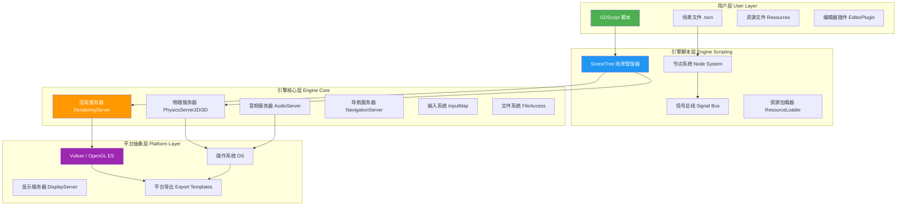

**关键理解**：用户通过 GDScript 操作的是"节点"这一抽象层，引擎的 `RenderingServer`、`PhysicsServer` 等核心服务在幕后工作。这种分层设计意味着：**GDScript 操作节点属性 → 引擎核心服务处理实际计算 → 平台层负责输出**，开发者无需关心底层实现。

#### 1.3 场景/节点系统：Godot 的核心创新

这是理解 Godot 的最关键概念，也是它与 Unity 最大的架构差异。

**Unity 的 GameObject + Component 模型**：
```
GameObject (容器，无行为)
  ├── Transform（位置信息，自动挂载）
  ├── MeshRenderer（渲染组件）
  ├── Collider（碰撞组件）
  └── MonoBehaviour（自定义脚本组件）
```

**Godot 的 Node 模型**：
```
Node（有类型，有行为，有层级关系）
  ├── Node2D（有2D位置变换能力）
  │   └── CharacterBody2D（有运动物理能力）
  ├── Sprite2D（有渲染精灵的能力）
  ├── CollisionShape2D（有碰撞形状的能力）
  └── AnimationPlayer（有播放动画的能力）
```

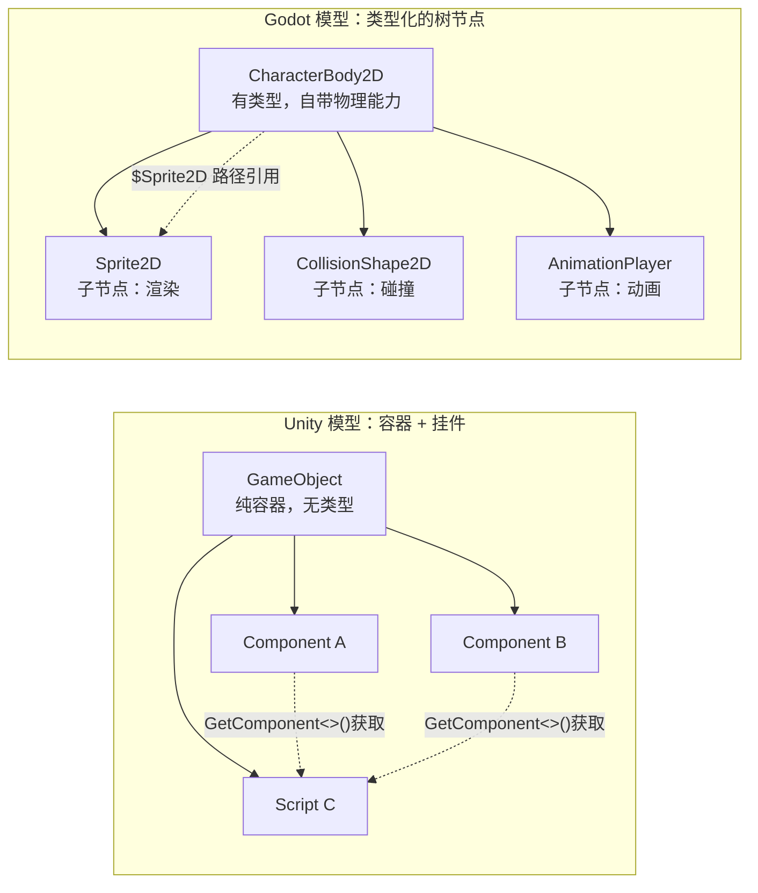

**两种模型的本质差异**：

| 维度 | Unity（组件模型） | Godot（节点模型） |
|------|-----------------|-----------------|
| 对象类型 | 统一的 GameObject，通过组件赋予能力 | 节点本身有类型，类型决定能力 |
| 能力来源 | 挂载组件（动态，可多个相同类型） | 节点类型（静态，继承树决定） |
| 对象间引用 | `GetComponent<T>()` 运行时查找 | `$NodePath` 编辑器可见的路径 |
| 层级关系 | 仅 Transform 有父子关系 | 所有节点都在树中有父子关系 |
| 核心理念 | 组合（Composition） | 组合树（Composition Tree） |

**Godot 节点类型的继承层级**：

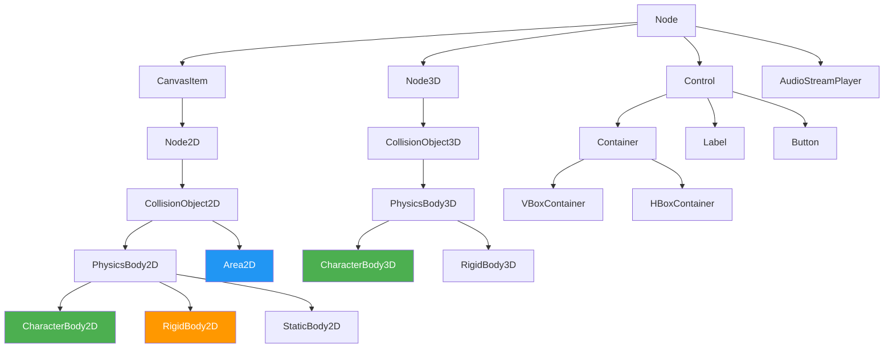

这个继承树是 Godot 节点选型的核心依据：**选对节点类型 = 自动获得对应能力**。`CharacterBody2D` 就已经内置了 `move_and_slide()` 方法，无需任何额外组件。

#### 1.4 SceneTree：运行时的全局管家

`SceneTree` 是 Godot 运行时的核心单例，负责管理整个游戏的生命周期：

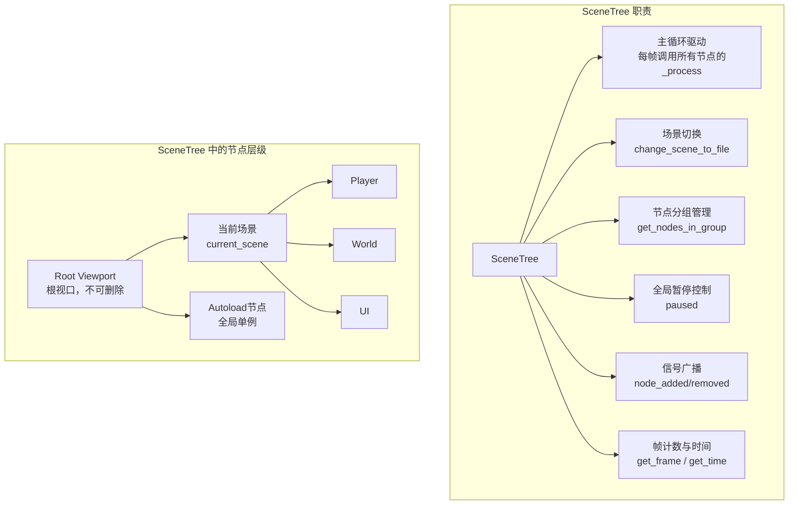

**关键概念**：`Autoload`（自动加载）是 Godot 实现**全局单例**的官方方式。将某个节点或脚本配置为 Autoload 后，它会在所有场景加载前就存在于 SceneTree 中，整个游戏运行期间始终可访问。这是实现游戏管理器（GameManager）、存档系统、音频管理的标准模式。

---

### 第2章：GDScript 的执行模型与语言机制

#### 2.1 节点的完整生命周期

理解生命周期是写出正确 GDScript 的前提。Godot 节点从创建到销毁经历如下阶段：

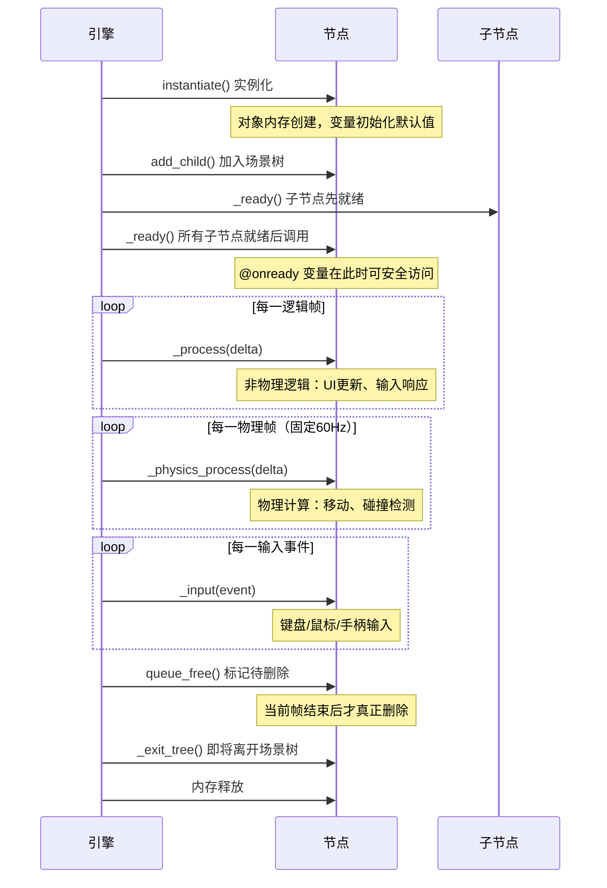

**关键理解**：

- `_ready()` 中子节点一定已经存在，但如果要访问子节点引用，必须用 `@onready` 或在 `_ready()` 中手动获取。直接在类顶部写 `var sprite = $Sprite2D` 会失败，因为 `$` 路径在类变量初始化时场景树还不存在。

- `_process(delta)` 和 `_physics_process(delta)` 的本质区别：前者跟随帧率（60fps 的游戏每秒调用60次，30fps 时每秒调用30次），后者固定频率（默认每秒60次，不受帧率影响）。**一切与物理相关的逻辑都必须放在 `_physics_process` 中**，否则在不同帧率的设备上游戏行为会不一致。

- `delta` 参数是**时间增量**（上一帧到这一帧经过的秒数），任何随时间变化的量都必须乘以 `delta` 才能保证与帧率无关。

#### 2.2 帧循环的内部顺序

在单帧内，Godot 的各种回调有严格的执行顺序：

```
┌──────────────────────────────────────────────────────────┐
│                    Godot 单帧执行顺序                      │
│                                                          │
│  1. 物理帧（固定步长，可能一帧内执行0次或多次）               │
│     ├── PhysicsServer 碰撞检测与物理模拟                    │
│     └── _physics_process(delta) 回调所有节点               │
│                                                          │
│  2. 逻辑帧（每渲染帧执行一次）                              │
│     ├── _process(delta) 回调所有节点                       │
│     ├── AnimationPlayer 更新动画                           │
│     └── Tween 更新补间                                    │
│                                                          │
│  3. 渲染帧                                                │
│     ├── CanvasItem 2D绘制                                 │
│     ├── MeshInstance 3D绘制                               │
│     └── VisualServer 提交渲染命令给GPU                     │
│                                                          │
│  4. 输入事件（异步，随时可能插入）                            │
│     └── _input(event) 回调                                │
└──────────────────────────────────────────────────────────┘
```

#### 2.3 GDScript 的类型系统设计

GDScript 是**可选静态类型**的语言，这是一个重要的设计决策：

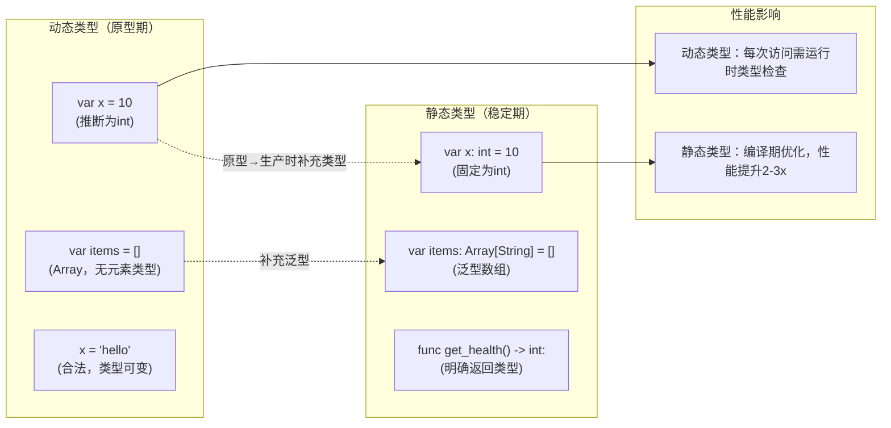

**GDScript 专为 Godot 设计的关键特性**：

| 特性 | 含义 | 解决的问题 |
|------|------|------------|
| `@export` | 将变量暴露到编辑器 Inspector | 设计师可调参，无需改代码重新编译 |
| `@onready` | 场景就绪后再赋值 | 安全引用子节点，避免空引用 |
| `$NodePath` | 简化的节点引用语法 | 避免繁琐的 `get_node("Path/To/Node")` |
| `signal` | 内置语言级别的信号声明 | 解耦节点通信，IDE 可检查 |
| `Vector2/3` | 内置向量类型 | 游戏开发中最常用的数学类型原生支持 |
| `get_tree()` | 任意节点访问 SceneTree | 全局访问而不需要单例注入 |

#### 2.4 信号系统：Godot 的解耦核心

信号（Signal）是 Godot 版的**观察者模式（Observer Pattern）**，但比传统实现多了几个关键改进：

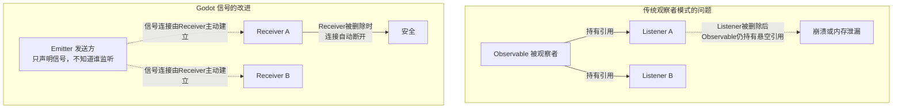

**信号的完整通信模型**：

```
┌──────────────────────────────────────────────────────────────────┐
│                     信号通信的三种场景                             │
│                                                                  │
│  场景 A：同场景节点通信（直接连接）                                  │
│  Player ──[coin_collected]──→ HUD                               │
│  Player 声明信号，HUD 在 _ready 中连接，Player 不知道 HUD 存在       │
│                                                                  │
│  场景 B：跨场景通信（通过 Autoload 中转）                            │
│  Player ──→ EventBus(Autoload) ←── HUD                          │
│  Player 发出信号给全局总线，HUD 监听总线，二者完全解耦               │
│                                                                  │
│  场景 C：编辑器可视化连接                                           │
│  在 Godot 编辑器 Node 面板中，可以看到所有信号连接关系               │
│  无需看代码就能理解节点间的通信拓扑                                  │
└──────────────────────────────────────────────────────────────────┘
```

**信号 vs 直接函数调用的取舍**：

| 场景 | 推荐方式 | 原因 |
|------|----------|------|
| 父节点调用子节点 | 直接调用 `$Child.method()` | 父知道子的存在，直接调用更清晰 |
| 子节点通知父节点 | 信号 `emit()` | 子不应该知道父的存在（避免向上耦合） |
| 兄弟节点通信 | 信号或通过父节点中转 | 兄弟间直接引用会产生紧耦合 |
| 全局状态变化 | Autoload + 信号 | 全局单例统一管理，任意节点可订阅 |

---

### 第3-5章：2D 游戏系统深度解析

#### 3.1 2D 物理系统的三种物理体

Godot 2D 物理中，不同的运动需求对应不同的节点类型，选错会导致行为不符合预期：

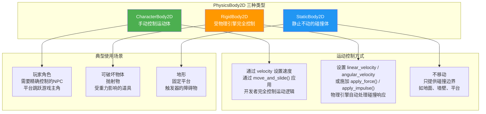

**CharacterBody2D 的运动模型**：

```
┌─────────────────────────────────────────────────────────────┐
│              move_and_slide() 内部工作原理                    │
│                                                             │
│  输入：velocity（期望速度向量）                               │
│                                                             │
│  1. 根据 velocity 计算期望移动距离                            │
│  2. 物理服务器检测路径上的碰撞                                 │
│  3. 如果碰到表面：                                            │
│     - 将速度分解为 沿表面分量 + 法线分量                       │
│     - 沿表面分量继续移动（"滑动"效果）                         │
│     - 法线分量被消除（不穿入表面）                             │
│  4. 更新 is_on_floor() / is_on_wall() / is_on_ceiling()     │
│  5. 返回实际移动后的残余速度                                   │
│                                                             │
│  关键：velocity.y 由开发者管理（重力累积），                    │
│       move_and_slide 不自动清零 velocity.y                   │
└─────────────────────────────────────────────────────────────┘
```

#### 3.2 碰撞系统：层与掩码机制

Godot 用 **Layer（层）和 Mask（掩码）** 实现精细的碰撞过滤，这是性能优化的关键机制：

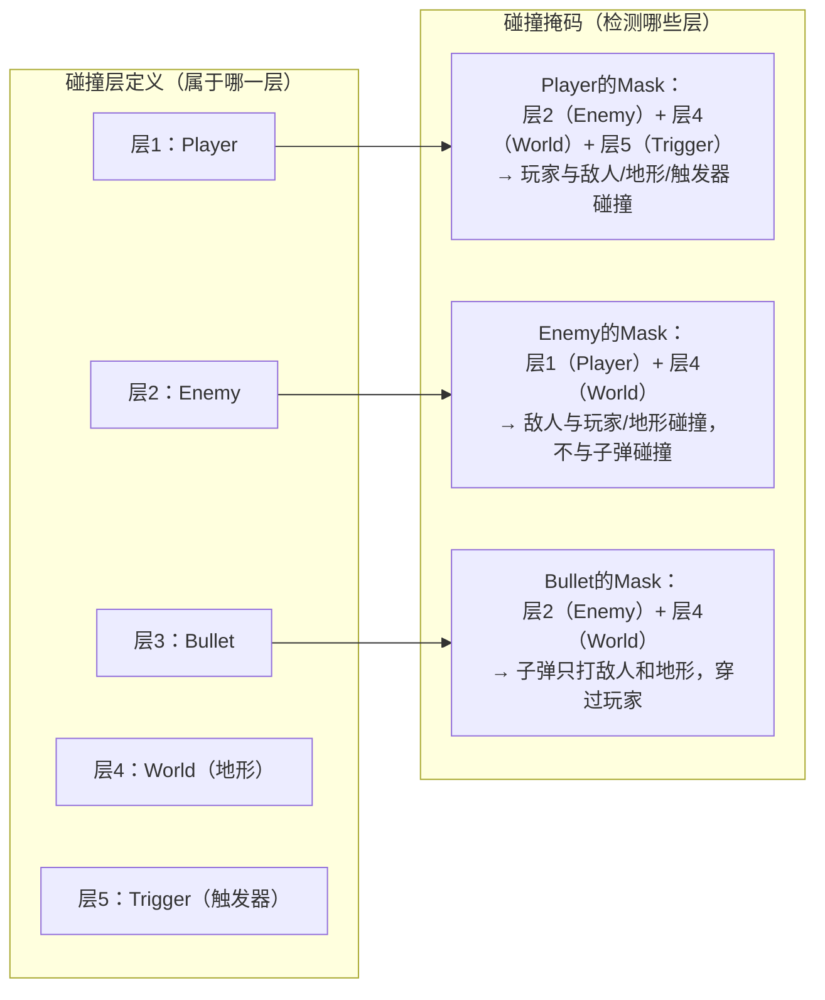

**理解层与掩码的本质**：

- `collision_layer`：这个物体**存在于**哪些层（"我是谁"）
- `collision_mask`：这个物体**检测**哪些层（"我关心谁"）
- 只有当 **A的mask** 包含 **B的layer**，A 才能检测到 B
- 这是双向的：A 检测 B 需要 A.mask & B.layer != 0，B 检测 A 需要 B.mask & A.layer != 0

#### 3.3 Area2D 与 PhysicsBody 的本质区别

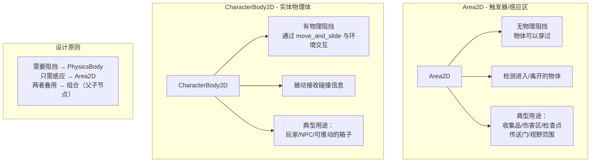

#### 3.4 动画系统的两个层次

Godot 有两个协同工作的动画系统，服务于不同粒度的需求：

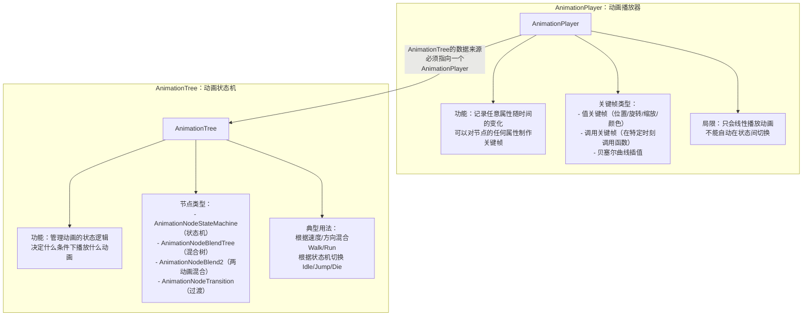

**AnimationTree 状态机的架构设计**：

```
┌──────────────────────────────────────────────────────────────┐
│                角色动画状态机设计示例                           │
│                                                              │
│                    ┌─────────┐                               │
│        ┌──────────▶│  Idle   │◀─────────────┐               │
│        │           └────┬────┘              │               │
│        │  is_moving=F   │ is_moving=T        │               │
│        │                ▼                   │               │
│     land            ┌─────────┐          is_dead=F          │
│        │            │  Run    │              │               │
│        │            └────┬────┘              │               │
│        │       jump=T    │                   │               │
│        │                ▼                   │               │
│        │           ┌─────────┐              │               │
│        └───────────│  Jump   │              │               │
│                    └────┬────┘              │               │
│                         │ is_dead=T          │               │
│                         ▼                   │               │
│                    ┌─────────┐              │               │
│                    │  Death  │──────────────┘               │
│                    └─────────┘                               │
│                                                              │
│  每个方框 = AnimationPlayer 中的一个动画剪辑                   │
│  每条边   = 条件满足时的状态转换                               │
└──────────────────────────────────────────────────────────────┘
```

#### 3.5 TileMap 系统：关卡设计的核心工具

TileMap 不只是"把图片排列成地图"，它是一个多层次的关卡描述系统：

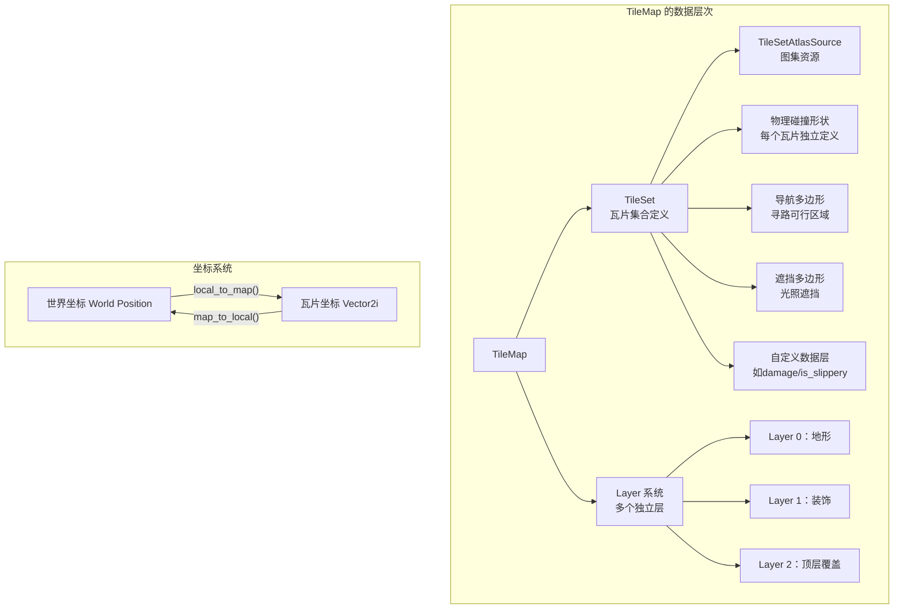

**TileMap 多层设计的意义**：分层不只是视觉上的前后关系，更重要的是**碰撞与导航的精细控制**。例如：地形层有碰撞（玩家不能穿过），装饰层无碰撞（草丛只是视觉效果），水面层有特殊的自定义数据（`terrain_type = water`），AI 导航层标记了哪些区域可以行走。

#### 3.6 2D 场景的标准架构模式

经过三个 2D 项目实践，形成了一套标准的场景组织方式：

```
┌──────────────────────────────────────────────────────────────┐
│                  2D 游戏场景标准结构                           │
│                                                              │
│  Main (Node2D)                                               │
│  ├── World (Node2D)        ← 游戏世界对象容器                  │
│  │   ├── TileMap           ← 关卡地形                         │
│  │   ├── Platforms (Node2D)← 动态平台容器                     │
│  │   ├── Pickups (Node2D)  ← 道具/收集品容器                  │
│  │   └── Enemies (Node2D)  ← 敌人容器                        │
│  │                                                           │
│  ├── Player (CharacterBody2D) ← 玩家（场景实例化）            │
│  │                                                           │
│  ├── Camera2D              ← 摄像机（跟随玩家）               │
│  │                                                           │
│  └── UI (CanvasLayer)      ← UI层（独立于相机）               │
│      ├── HUD               ← 血量/分数显示                    │
│      └── PauseMenu         ← 暂停菜单                        │
│                                                              │
│  关键原则：                                                   │
│  1. UI 必须在 CanvasLayer 下，否则随相机移动而偏移             │
│  2. 玩家/敌人做成独立 .tscn 场景，通过实例化加入               │
│  3. 容器节点（如 Enemies）便于批量操作和遍历                   │
└──────────────────────────────────────────────────────────────┘
```

---

### 第6-7章：3D 游戏系统深度解析

#### 6.1 3D 空间的坐标系与变换

3D 开发引入了比 2D 复杂得多的空间数学，理解坐标系是一切的基础：

```
┌──────────────────────────────────────────────────────────────┐
│                   Godot 3D 坐标系约定                         │
│                                                              │
│         Y↑                                                   │
│         │                                                    │
│         │    Z（朝向屏幕外为正）                               │
│         │   ↗                                                │
│         │  /                                                 │
│         │ /                                                  │
│         └──────────→ X                                       │
│                                                              │
│  与 Unity 的区别：                                            │
│  Godot：右手坐标系，Y 轴朝上，-Z 为前方                         │
│  Unity：左手坐标系，Y 轴朝上，+Z 为前方                         │
│                                                              │
│  Transform3D 的三个分量：                                     │
│  - basis.x：节点的"右方"方向向量                               │
│  - basis.y：节点的"上方"方向向量                               │
│  - basis.z：节点的"后方"方向向量（注意是后方！）                │
│  - origin：节点在世界空间的位置                                │
└──────────────────────────────────────────────────────────────┘
```

**局部坐标 vs 全局坐标**：

```mermaid
graph LR
    subgraph "局部坐标 position"
        L[相对于父节点的位置\nposition = Vector3(1, 0, 0)\n意为：在父节点右边1个单位]
    end

    subgraph "全局坐标 global_position"
        G[在世界空间中的绝对位置\nglobal_position 考虑了所有祖先节点的变换]
    end

    subgraph "何时用哪个"
        R["移动自身 → 用 position\n检测与其他对象的距离 → 用 global_position\n生成新物体到世界位置 → 用 global_position"]
    end

    L --> R
    G --> R
```

#### 6.2 Godot 4 的渲染架构

Godot 4 的一大核心升级是从 OpenGL 迁移到 Vulkan，并引入了全新的渲染架构：

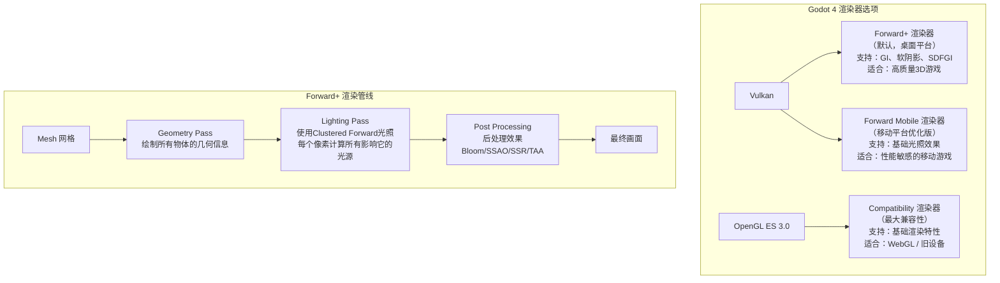

**Clustered Forward+ 光照的含义**：传统前向渲染的问题是每个物体要对每个光源计算一次着色，多个光源性能急剧下降。Clustered Forward+ 将视锥体划分为若干小格子（Clusters），预先计算每个格子受哪些光源影响，渲染时每个像素只需查询自己所在格子的光源列表，大大提升了多光源场景的性能。

#### 6.3 3D 光照系统

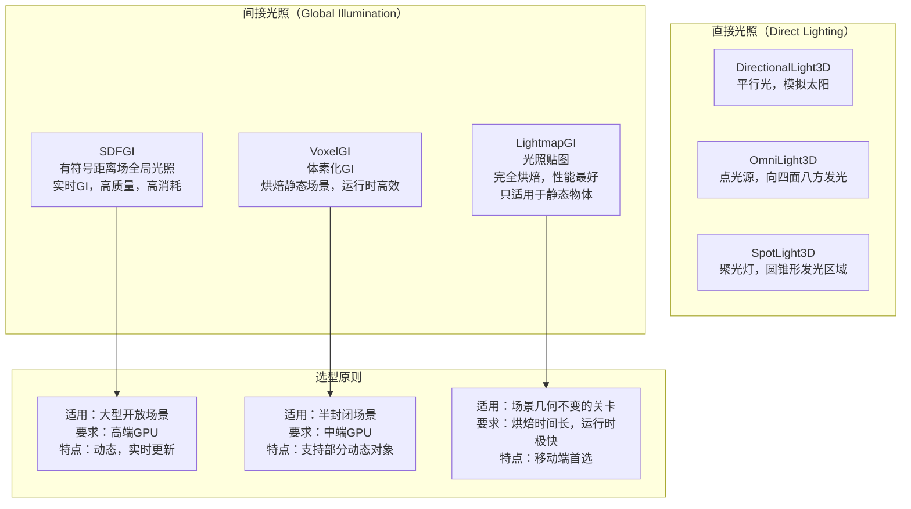

**阴影质量与性能的平衡**：

```
DirectionalLight3D 阴影级联（PSSM）：
┌─────────────────────────────────────────────────────┐
│  Camera                                             │
│  ←近距离→ ←中距离→ ←远距离→ ←超远距离→              │
│  [高精度]  [中精度]  [低精度]  [最低精度]            │
│  级联1     级联2     级联3     级联4                 │
│                                                     │
│  原理：离摄像机近的区域使用高分辨率阴影贴图（精度高）   │
│       离摄像机远的区域使用低分辨率阴影贴图（节省显存） │
└─────────────────────────────────────────────────────┘
```

#### 6.4 3D 摄像机控制模式

3D 游戏的摄像机控制是游戏手感的核心，Godot 提供了两种常见模式的实现方案：

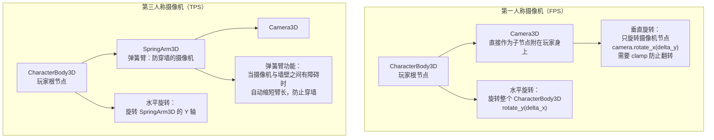

**SpringArm3D 的防穿墙原理**：

```
┌──────────────────────────────────────────────────────────┐
│  SpringArm3D 工作原理                                     │
│                                                          │
│  正常情况：          遇到墙壁：                            │
│                                                          │
│  Player ●───────○ Camera   Player ●──○ Camera            │
│         spring_length       ↓                           │
│         = 5.0              Player ●───[Wall]  Camera     │
│                             检测到碰撞，缩短弹簧臂         │
│                             Camera 移到碰撞点前方         │
│                                                          │
│  实现原理：沿摄像机方向发出射线，                           │
│           取"设定长度"和"碰撞距离"的最小值                  │
└──────────────────────────────────────────────────────────┘
```

#### 6.5 3D 物理体与射线检测

3D 物理的核心应用是**射线检测（Raycast）**，这是 FPS 游戏、视线判断、点击交互的基础技术：

```
┌──────────────────────────────────────────────────────────────┐
│               射线检测的工作原理                               │
│                                                              │
│  1. 从起点（摄像机位置）向终点（瞄准方向）发出一条虚拟射线       │
│  2. PhysicsServer 计算射线与哪些碰撞体相交                    │
│  3. 返回第一个相交点的：                                      │
│     - collider：被击中的物体引用                              │
│     - position：碰撞世界坐标                                  │
│     - normal：碰撞面的法线方向（用于计算弹孔朝向）             │
│     - rid：物理体的 RID                                      │
│                                                              │
│  性能注意：每次调用 intersect_ray 都有开销                    │
│  优化：使用碰撞层过滤，只检测必要的层（如只检测"可射击"层）     │
└──────────────────────────────────────────────────────────────┘
```

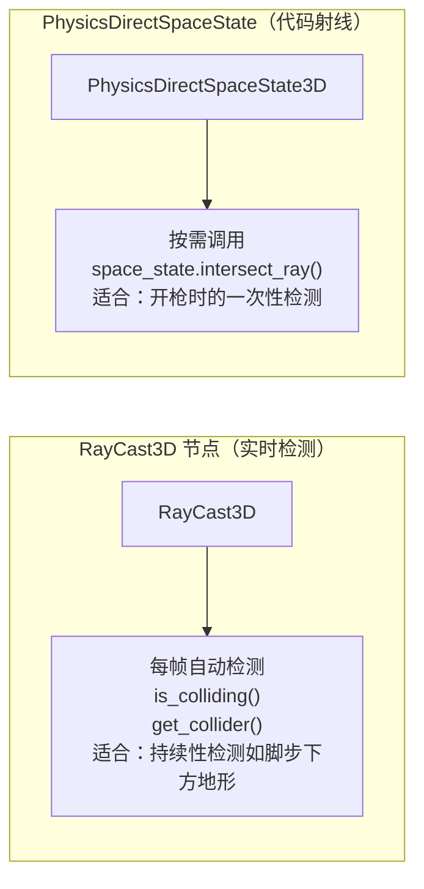

#### 6.6 3D 场景标准架构

```
┌──────────────────────────────────────────────────────────────┐
│                  3D 游戏场景标准结构                          │
│                                                              │
│  Main (Node3D)                                               │
│  ├── World (Node3D)           ← 世界几何/地形                 │
│  │   ├── StaticBody3D         ← 地面/墙壁（静止碰撞体）        │
│  │   │   └── MeshInstance3D  ← 可见网格                      │
│  │   │   └── CollisionShape3D← 碰撞形状                     │
│  │   └── NavigationRegion3D  ← AI导航网格区域                │
│  │                                                           │
│  ├── Player (CharacterBody3D) ← 玩家                         │
│  │   ├── MeshInstance3D      ← 角色模型                      │
│  │   ├── CollisionShape3D    ← 碰撞体                        │
│  │   └── SpringArm3D         ← 摄像机弹簧臂                  │
│  │       └── Camera3D        ← 玩家摄像机                    │
│  │                                                           │
│  ├── Enemies (Node3D)         ← 敌人容器                     │
│  │                                                           │
│  ├── WorldEnvironment         ← 环境：天空/雾/后处理          │
│  │                                                           │
│  ├── DirectionalLight3D       ← 主光源（太阳）               │
│  └── UI (CanvasLayer)         ← 2D UI层（永远在3D上层）       │
└──────────────────────────────────────────────────────────────┘
```

---

### 第8章：跨平台发布与性能优化

#### 8.1 Godot 的跨平台机制

Godot 跨平台的核心是**导出模板（Export Templates）**，理解其机制比知道操作步骤更重要：

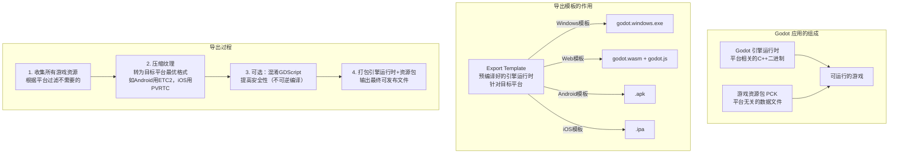

**各平台的关键差异**：

| 平台 | 核心限制 | Godot 的处理方式 |
|------|----------|----------------|
| Web (WebGL/WASM) | 内存限制严格（通常4GB上限）、无线程（默认）、CORS限制 | 提供 Compatibility 渲染器 + 可选 SharedArrayBuffer 多线程 |
| Android | GPU架构多样（Mali/Adreno/PowerVR）、内存碎片化 | 自动选择最优纹理压缩格式（ETC2/ASTC）|
| iOS | Metal API、严格的应用沙箱、强制代码签名 | 使用 MoltenVK 将 Vulkan 转译为 Metal |
| 游戏主机 | 需要授权（Nintendo/Sony/Microsoft） | 由 GodotEngine 官方维护的私有移植版 |

#### 8.2 性能瓶颈的系统分析

游戏性能问题分为两大类，处理方式完全不同：

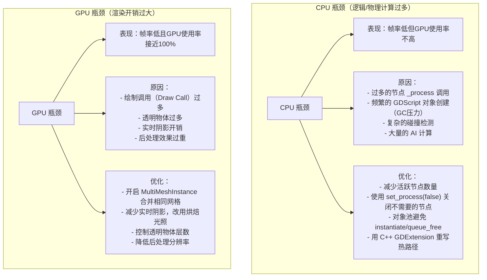

**对象池模式的本质**：

```
┌─────────────────────────────────────────────────────────────┐
│                    为什么需要对象池？                          │
│                                                             │
│  问题：游戏中子弹/特效/敌人的频繁创建和销毁                    │
│                                                             │
│  instantiate() 的开销：                                      │
│  1. 解析 .tscn 文件                                          │
│  2. 创建所有子节点对象                                        │
│  3. 调用所有子节点的 _ready()                                 │
│  4. 注册到 SceneTree                                         │
│  → 每次约 0.5-5ms，子弹速射时严重卡顿                         │
│                                                             │
│  queue_free() 的开销：                                       │
│  1. 标记并延迟删除                                            │
│  2. 触发 GC（Godot 使用引用计数+循环收集器）                  │
│  → GC 暂停导致帧率抖动（Jank）                               │
│                                                             │
│  对象池方案：预先创建一批对象，用时取出激活，不用时隐藏归还      │
│  → 消除运行时的 instantiate/free 开销                        │
└─────────────────────────────────────────────────────────────┘
```

---

## 💭 深度衍生思考

### 🎯 核心观点延伸

#### 1. 场景/节点模型 vs ECS：两种不同的游戏世界观

Godot 的场景/节点是一种**面向对象的层次化**设计；ECS（Entity Component System）是一种**数据导向的扁平化**设计。它们代表了两种根本不同的游戏世界建模方式：

```mermaid
graph TB
    subgraph "面向对象（Godot 节点）"
        OOP["游戏世界 = 一棵有智能对象组成的树\n每个对象知道自己是什么、会做什么\n对象间通过消息（信号）通信"]
        OOP --> OOP1["优点：\n直觉上自然，代码可读性高\n调试容易（选中节点即可查看状态）"]
        OOP --> OOP2["缺点：\n数据与行为耦合\nCPU缓存不友好\n大量同类对象时性能差"]
    end

    subgraph "数据导向（ECS）"
        ECS["游戏世界 = 实体的集合 + 组件数据数组 + 系统处理器\n没有'对象'，只有数据（Component）\n系统批量处理同类数据"]
        ECS --> ECS1["优点：\n数据连续内存布局，极高CPU缓存命中率\n处理10万个相同对象性能极佳\n数据与行为彻底分离"]
        ECS --> ECS2["缺点：\n思维范式转换困难\n调试复杂（实体没有独立存在感）\n小项目代码量反而更多"]
    end

    OOP -.->|"Godot 也提供 MultiMeshInstance\n作为性能关键路径的ECS替代"| ECS
```

**结论**：对于 95% 的游戏，Godot 的面向对象节点模型已经足够高效，且开发效率显著更高。ECS 的意义在于需要处理**数万个同类对象**（大规模 RTS 单位、粒子系统、子弹地狱）时的极致性能。Godot 的 `MultiMeshInstance3D` 正是在节点模型框架内提供 ECS 思路的解决方案。

#### 2. GDScript 的设计定位：领域特定语言（DSL）的价值

GDScript 本质上是一门**游戏开发 DSL（Domain Specific Language）**，这个定位解释了很多设计决策：

```
┌───────────────────────────────────────────────────────────┐
│        为什么要创造一门新语言而不是用 Python/Lua？           │
│                                                           │
│  深度集成：                                                │
│  GDScript 的类型系统直接对应 Godot 的类型体系               │
│  Vector2/3、Color、NodePath 是语言原生类型                  │
│  Python 需要 import pygame.math.Vector2，感觉是"外来者"     │
│                                                           │
│  执行控制：                                                │
│  Godot 可以精确控制 GDScript 的执行时机（物理帧/逻辑帧）    │
│  可以在热重载时保留游戏状态                                  │
│  Python 的 GIL 和执行模型与引擎的帧循环不匹配               │
│                                                           │
│  编辑器集成：                                              │
│  @export 直接映射为编辑器 Inspector 中的控件                │
│  @onready 解决了游戏特有的"节点延迟初始化"问题               │
│  这些是 Python/Lua 无法原生提供的                           │
│                                                           │
│  代价：                                                    │
│  学习了 GDScript 的知识不能直接迁移到其他领域               │
│  但游戏开发的核心思维（帧循环、物理、信号）是通用的            │
└───────────────────────────────────────────────────────────┘
```

#### 3. 信号系统：解耦哲学的游戏化实现

信号系统背后是一个深刻的架构哲学：**"子节点对父节点应该是不可知的"**。

```
┌───────────────────────────────────────────────────────────┐
│  最差实践（紧耦合）：                                        │
│  Player.gd 直接引用 HUD：                                   │
│  var hud = get_node("/root/Main/UI/HUD")                   │
│  hud.update_health(health)                                 │
│                                                            │
│  问题：Player 知道 HUD 的存在和路径                          │
│       HUD 路径改变 → Player 代码必须修改                    │
│       没有 HUD 时会报错（如纯逻辑测试）                       │
│                                                            │
│  最佳实践（信号解耦）：                                      │
│  Player.gd 只声明意图：                                     │
│  signal health_changed(new_health)                         │
│  health_changed.emit(health)                               │
│                                                            │
│  HUD.gd 主动订阅：                                          │
│  player.health_changed.connect(update_health)              │
│                                                            │
│  效果：Player 不知道 HUD 存在，HUD 知道 Player 但 Player     │
│       可以在任何地方独立测试和复用                            │
│       → 这是 Clean Architecture 中"依赖方向"原则的游戏实现  │
└───────────────────────────────────────────────────────────┘
```

### 🔍 多角度分析

**历史视角**：Godot 诞生于 2007 年，最初是 OKAM Studio 的内部引擎，2014 年开源，在 2023 年发布 Godot 4 完成了从"可用"到"优秀"的质变。Godot 4 最重要的变化是将渲染器从 OpenGL 迁移到 Vulkan，这不仅带来了视觉质量的飞跃，更重要的是建立了一个面向未来10年的渲染架构基础。

**现代视角**：2023 年 Unity 的运行时收费（Runtime Fee）风波是游戏引擎市场的一个历史转折点。Unity 宣布对每次游戏安装收费后，大量开发者在一个月内涌入 Godot 社区，直接使 Godot 的 GitHub Star 数翻倍。这个事件深刻揭示了：**对于商业软件工具，"被供应商锁定"的风险有时比工具本身的技术能力更重要**。MIT 许可证使 Godot 永远不可能发生这种"规则突变"。

**跨领域视角**：Godot 的架构设计与前端框架惊人相似——场景树类似 DOM 树、信号类似 DOM Events、`@export` 类似 React/Vue 的 Props、Autoload 类似 Redux/Vuex 的全局状态。这种相似性不是巧合，而是"用树形结构组织 UI/游戏对象"这一本质需求的自然结果。有前端开发经验的程序员学习 Godot 会有强烈的"似曾相识"感。

**反向思考**：Godot 的场景/节点系统真的没有缺点吗？有。当游戏规模增长到需要处理数千个相同对象时（如 MOBA 游戏的大量技能特效、RTS 的大规模兵种），节点树的内存局部性问题开始显现。每个节点对象都是独立的堆分配，CPU 缓存命中率低。Godot 官方对此的回答是 `MultiMeshInstance3D`（批量渲染）和将来可能引入的 ECS 扩展。

### 🚀 创新思考

**Godot 作为技术教育平台**：GDScript 的简洁性和 Godot 的可视化编辑器使其成为编程教育的理想工具。它比 Scratch 有更真实的编程体验，比 Python 有更直观的可视化反馈，比 Unity 有更低的学习曲线。国内外已有大量学校采用 Godot 作为入门游戏开发课程的工具。

**Godot + 生成式 AI**：将大语言模型与 Godot 的编辑器 API 结合，可以实现"用自然语言描述游戏逻辑 → 自动生成场景结构和 GDScript 脚本"的工作流。Godot 的 `EditorScript` 和 `EditorPlugin` API 为这种集成提供了基础，这可能是下一代游戏开发工具链的雏形。

---

## 🔗 知识关联网络

### 与已读书籍的关联

| 书籍 | 关联点 | 关联强度 |
|------|--------|----------|
| **游戏引擎架构** | Godot 的子系统（渲染服务器、物理服务器、动画系统）正是书中讲述的引擎架构的工程实现。读完《游戏引擎架构》再用 Godot，能精确知道每个 API 背后调用的是哪个子系统 | ⭐⭐⭐⭐⭐ |
| **游戏编程设计模式** | 直接映射：信号=观察者、Autoload=单例、AnimationTree=状态机、场景实例化=原型模式、ObjectPool=对象池。Godot 是这些模式最直观的实践平台 | ⭐⭐⭐⭐⭐ |
| **游戏编程算法与技巧** | 路径查找对应 NavigationAgent2D/3D、碰撞检测对应 PhysicsServer、空间查询对应射线检测 API。书中的算法在 Godot 中都有 API 封装 | ⭐⭐⭐⭐ |
| **设计模式（GoF）** | GDScript 中单例=Autoload、观察者=Signal、工厂=场景实例化、组合=节点树、策略=可替换的脚本 | ⭐⭐⭐⭐ |
| **架构整洁之道** | 整洁架构的依赖规则在 Godot 中的体现：Scene（外层）→ Script（中层）→ Resource（内层）；信号保证高层不依赖低层 | ⭐⭐⭐ |
| **重构** | 场景的模块化拆分是游戏开发中的"提炼函数"；将重复行为提取为基类节点是游戏中的"提炼基类" | ⭐⭐⭐ |
| **Unity3D 高级编程主程手记** | 横向对比最有价值：两个引擎面对相同问题（内存管理、帧循环、资源系统）的不同解决方案，通过对比深化对引擎设计本质的理解 | ⭐⭐⭐⭐ |

### 概念映射

```mermaid
graph LR
    A[Godot 信号系统] --> E[游戏编程设计模式\n观察者模式]
    A --> F[架构整洁之道\n依赖倒置原则]

    B[场景实例化] --> H[设计模式\n原型模式]
    B --> I[游戏编程设计模式\n类型对象模式]

    C[AnimationTree 状态机] --> K[游戏编程设计模式\n状态模式]
    C --> GA[游戏编程算法与技巧\n有限状态机]

    D[Godot 节点类型层级] --> EA[游戏引擎架构\n游戏对象系统]
    D --> PA[设计模式\n组合模式]

    G[RenderingServer / PhysicsServer] --> GEA[游戏引擎架构\n渲染子系统/物理子系统]

    J[Autoload 全局单例] --> SG[设计模式\n单例模式]
    J --> CA[架构整洁之道\n全局状态管理]

    style A fill:#4CAF50,color:#fff
    style B fill:#2196F3,color:#fff
    style C fill:#9C27B0,color:#fff
    style D fill:#FF9800,color:#fff
    style G fill:#F44336,color:#fff
```

### 知识依赖关系

**前置知识**：
- 面向对象编程（类、继承、多态）— GDScript 的基础
- 事件驱动编程思想 — 理解信号系统
- 基础向量数学（点乘/叉乘/归一化）— 3D 开发必需
- 基本的游戏循环概念 — 理解帧更新模型

**后续延伸**：
- Godot 着色语言（Shader Language）— 自定义渲染效果
- GDExtension（C++/Rust 扩展）— 性能敏感模块
- Godot 网络 API（MultiplayerAPI/ENet）— 多人游戏同步
- Godot 工具脚本（@tool）— 编辑器扩展开发

---

## 🎓 专家视角深度分析

### 陈晓峰（游戏客户端引擎专家）

#### 核心洞察

**Godot 4 的渲染架构升级是质变，不是量变**。从 Godot 3 的 OpenGL 到 Godot 4 的 Vulkan，不只是"画面更好看"，而是整个渲染架构的重建：

```
Godot 3（OpenGL）：
- 单线程渲染命令提交
- 驱动层做大量隐式状态管理
- 无法充分利用多核CPU
- Draw Call 开销大（驱动验证+状态切换）

Godot 4（Vulkan）：
- 显式渲染命令，CPU/GPU 并行执行
- 开发者控制显存管理和同步
- 支持多线程命令录制
- Draw Call 开销降低10倍以上
- 为 Forward+ / SDFGI 等现代渲染算法提供基础
```

**GDScript 性能的真相**：GDScript 是解释型语言，与 C# 相比有约3-10倍性能差距。但这个数字必须放在上下文中理解：

```
游戏逻辑的实际瓶颈通常不在 GDScript，而在：
- 物理计算（由C++的PhysicsServer处理，GDScript只是调用）
- 渲染（由GPU处理，GDScript完全不参与）
- 资源加载（I/O密集，与语言速度无关）

GDScript 的 0.1ms 级别开销 vs C# 的 0.01ms 级别开销
在 60fps（每帧16ms）的预算中，差距微乎其微

需要改用 C++/GDExtension 的场景：
- 自定义物理算法（每帧处理数千个碰撞对）
- 机器学习推理（大矩阵运算）
- 自定义网络协议（极低延迟要求）
```

#### 独特视角

Godot 的 `_physics_process` 固定时间步长设计，是网络同步游戏实现**确定性回滚（Deterministic Rollback）**的基础。当所有物理计算在固定时间步长下执行，给定相同输入，两台机器上的游戏状态**精确相同**。这是开发公平竞技类游戏的重要保证，也是 Godot 对严肃游戏开发者的隐藏价值。

---

### 周文博（游戏行业分析专家）

#### 核心洞察

**Godot 的崛起是游戏引擎市场的结构性变化，而非技术升级**。

```
┌──────────────────────────────────────────────────────────┐
│              游戏引擎市场的博弈结构                         │
│                                                          │
│  传统格局（2022年前）：                                    │
│  Unity ← 中小型开发者（性价比高）                           │
│  Unreal ← 大型/AAA开发者（技术领先）                        │
│  Godot ← 教育/爱好者（免费但不够成熟）                      │
│                                                          │
│  Unity收费事件（2023年）后的格局变化：                       │
│  "工具锁定"的信任危机 → 大量开发者评估迁移成本              │
│  Unity的技术护城河 vs Godot的开源信任感                     │
│  开发者得出结论：                                           │
│  - 大型在制项目：迁移成本过高，留在Unity                     │
│  - 新项目：Godot成为与Unity并列的严肃选项                   │
│  - 独立开发者：Godot获得了明显的心智份额提升                 │
└──────────────────────────────────────────────────────────┘
```

**MIT 许可证的战略价值**，不只是"免费"这么简单：

```
MIT 许可证意味着：
1. 引擎代码可以被任何人修改和分发（含商业用途）
2. 永远不会出现"规则突变"（Unity事件的本质）
3. 大型工作室可以将 Godot fork 出自己的内部版本
4. 游戏本身不需要附带任何引擎相关声明
5. 学术研究和教育机构可以自由使用

这使 Godot 成为：
- 需要定制底层的技术驱动型团队的首选
- 不希望依赖商业公司的公共机构的首选
- 教育和研究机构的首选
```

---

## 📚 后续阅读路径规划

### 直接延伸

1. **《Godot 4 官方文档》**（docs.godotengine.org）
   - 关联度：⭐⭐⭐⭐⭐
   - 阅读优先级：**最高**
   - 预期收获：本书未覆盖的进阶主题：着色器编程、多人网络、GDExtension C++绑定、编辑器插件开发

2. **《游戏编程设计模式》**（Robert Nystrom）
   - 关联度：⭐⭐⭐⭐⭐
   - 阅读优先级：高
   - 预期收获：为 Godot 中的每个架构模式找到理论支撑；写出更优雅、更可维护的游戏代码

### 交叉验证

1. **《游戏引擎架构》**（Jason Gregory）
   - 对比点：Godot 的各个服务器（RenderingServer/PhysicsServer）与书中子系统设计的对应关系
   - 价值：从"黑盒使用引擎"升级到"理解引擎行为"，能做出更好的架构决策

2. **Unity3D 高级编程**（相关书籍）
   - 对比点：不同引擎面对相同游戏问题（对象生命周期/内存管理/场景管理）的不同解决方案
   - 价值：通过对比理解引擎设计的本质，而不是记住某个引擎的 API

### 实践补充

1. **Godot 官方 Demo 项目库**（github.com/godotengine/godot-demo-projects）
   - 类型：开源示例
   - 价值：覆盖了本书未涉及的高级特性（着色器、多人、工具脚本）
   - 时间投入：每个 Demo 约2-4小时深入理解

2. **GDQuest 课程**（gdquest.com）
   - 类型：高质量视频课程
   - 价值：可视化地理解 AnimationTree、Shader 等复杂系统
   - 时间投入：选择性学习，约20小时

3. **发布一个完整游戏到 itch.io**
   - 类型：实战项目
   - 价值：经历完整的"开发→测试→导出→发布"循环，暴露所有学习盲区
   - 时间投入：2-4周

### 个性化路径

- **2D 独立游戏**：《Godot 官方文档 2D》→ 研究《Brotato》开源代码 → 发布自己的第一款游戏
- **3D 游戏开发**：《Godot 着色语言》→ VoxelGI/LightmapGI 深度使用 → 研究 3D AI 导航
- **工具/插件开发**：《EditorPlugin API》→ 开发自己的 Godot 插件并发布到 Asset Library
- **性能深度优化**：GDExtension C++ → 《游戏引擎架构》→ 研究 Godot 引擎源码

---

## 🎯 实践应用

### 行动计划

1. **第一周：引擎认知建立**
   - 安装 Godot 4，完成官方"Your first 2D/3D game"教程
   - 核心目标：亲手体验场景树、信号连接的工作方式
   - 不追求功能完整，专注于理解场景/节点/信号三角关系

2. **第二三周：2D 系统深度实践**
   - 完成本书 Coin Dash 和 Jungle Jump 两个项目
   - 核心目标：掌握 CharacterBody2D 运动控制、TileMap 关卡构建、AnimationTree 状态机
   - 每个知识点都要理解"为什么这样设计"，而不只是"怎么用"

3. **第四五周：3D 系统深度实践**
   - 完成本书 Space Rocks 3D 项目
   - 核心目标：掌握 3D 坐标变换、SpringArm3D 摄像机、射线检测交互
   - 重点理解 Vulkan 渲染器的三种选择及其适用场景

4. **第六周：独立原创游戏**
   - 设计并实现一个原创小游戏（建议2D，降低美术成本）
   - 核心目标：经历完整从零到发布的流程，包括 Web 导出
   - 发布到 itch.io，哪怕只是一个2小时的小游戏

### 学习检查清单

**架构理解层**：
- [ ] 能独立解释 Godot 场景/节点系统与 Unity GameObject/Component 的本质区别
- [ ] 能解释为什么"子节点应该通过信号向上通信"而不是直接调用父节点方法
- [ ] 能解释 `_process` 和 `_physics_process` 的区别以及何时使用哪个
- [ ] 能解释碰撞层与掩码的设计逻辑并正确配置多类型碰撞

**2D 开发能力**：
- [ ] 能实现具有重力、跳跃、二段跳的平台跳跃角色控制器
- [ ] 能用 TileMap 构建包含碰撞、导航、自定义数据的完整关卡
- [ ] 能用 AnimationTree 实现至少三个状态的角色动画状态机
- [ ] 能正确区分 Area2D 和 PhysicsBody 并在合适场景选用

**3D 开发能力**：
- [ ] 能实现第一人称和第三人称（带 SpringArm3D）摄像机控制
- [ ] 能理解并配置场景的光照系统（至少掌握 DirectionalLight + WorldEnvironment）
- [ ] 能使用射线检测实现基础的物体拾取/射击交互

**工程实践**：
- [ ] 能将游戏导出到 Windows 和 Web（itch.io）平台
- [ ] 能设计可复用的场景模板（子弹/道具/敌人）并使用对象池优化

---

## 📊 学习总结

### 最大的收获

Godot 最令我深思的是其**"一切皆场景"（Everything is a Scene）** 的哲学——不仅游戏关卡是场景，玩家角色是场景，UI 菜单是场景，甚至单个敌人、单颗子弹都可以是独立的场景文件。这种设计让游戏开发天然具备了软件工程中的**模块化**和**可测试性**：每个场景都可以独立打开、独立运行、独立调试，像函数一样被组合使用。

这与软件架构中"高内聚低耦合"原则的游戏实现，让我重新理解了"组合优于继承"在实际工程中的真正含义——不是理论上的原则，而是一种直接影响开发效率和维护成本的工程实践。

### 改变的观念

**之前**：游戏引擎是"黑盒工具"，知道怎么用就够了，不需要理解背后的架构设计。

**之后**：理解引擎的架构设计思路（为什么这样设计，解决了什么问题，做了哪些取舍）才是真正的引擎使用能力。这种理解让你在遇到问题时能找到"正确的"而不只是"可用的"解决方案。

**之前**：认为 Godot 是 Unity 的廉价替代品，只适合入门级小游戏。

**之后**：Godot 4 的 Forward+ 渲染器、固定时间步长物理、MIT 许可证、场景/节点架构在特定场景下甚至比 Unity 更优秀。选择工具要看的是"是否适合你的具体需求"，而不是"哪个更主流"。

### 未来行动

1. **短期（1个月）**：完成本书全部项目，在 itch.io 发布至少一个完整游戏
2. **中期（3个月）**：深入学习 Godot 着色器语言，实现一个有独特视觉风格的游戏 Demo
3. **长期（1年）**：研究 Godot GDExtension 接口，尝试用 C++ 实现一个性能密集型的游戏模块（如程序化地形生成）

---

## 📈 阅读进度

| 章节 | 状态 | 完成日期 | 笔记质量 |
|------|------|----------|----------|
| 第1章 Godot 4 引擎总览与设计哲学 | ⬜ 未开始 | — | — |
| 第2章 GDScript 核心机制与执行模型 | ⬜ 未开始 | — | — |
| 第3章 Coin Dash：节点组合与碰撞 | ⬜ 未开始 | — | — |
| 第4章 Infinite Jumper：程序化生成 | ⬜ 未开始 | — | — |
| 第5章 Jungle Jump：TileMap与状态机 | ⬜ 未开始 | — | — |
| 第6章 Space Rocks：3D物理与相机 | ⬜ 未开始 | — | — |
| 第7章 Minigolf：导航与3D光照 | ⬜ 未开始 | — | — |
| 第8章 导出与性能优化 | ⬜ 未开始 | — | — |

---

## 🔗 参考资源

### 在线资源
- [Godot 4 官方文档](https://docs.godotengine.org/en/stable/)
- [GDScript 语言参考](https://docs.godotengine.org/en/stable/tutorials/scripting/gdscript/index.html)
- [Godot 官方 Demo 项目库](https://github.com/godotengine/godot-demo-projects)
- [GDQuest 高质量教程](https://www.gdquest.com/)
- [KidsCanCode（作者教学站）](https://kidscancode.org/)

### Sources
- Godot 4 官方文档（docs.godotengine.org）
- Godot Engine GitHub 仓库（github.com/godotengine/godot）
- Packt Publishing: Godot 4 Game Development Projects 书籍介绍
- Chris Bradfield（KidsCanCode）作者介绍与课程内容

---

**笔记创建时间**: 2026年6月3日
**最后更新**: 2026年6月3日
**笔记版本**: v2.0
**质量评级**: ⭐⭐⭐⭐⭐
