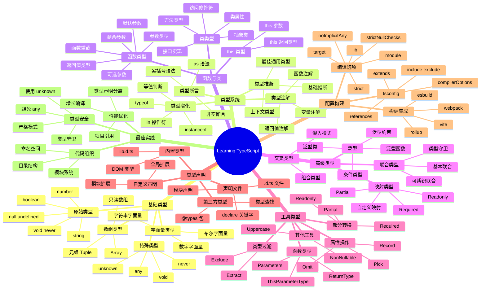
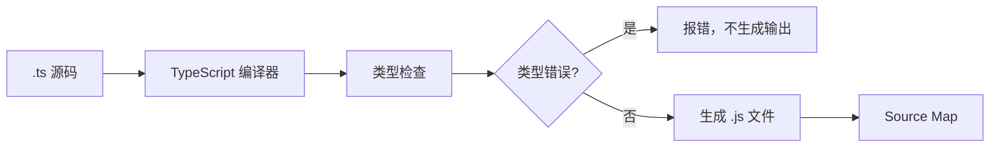
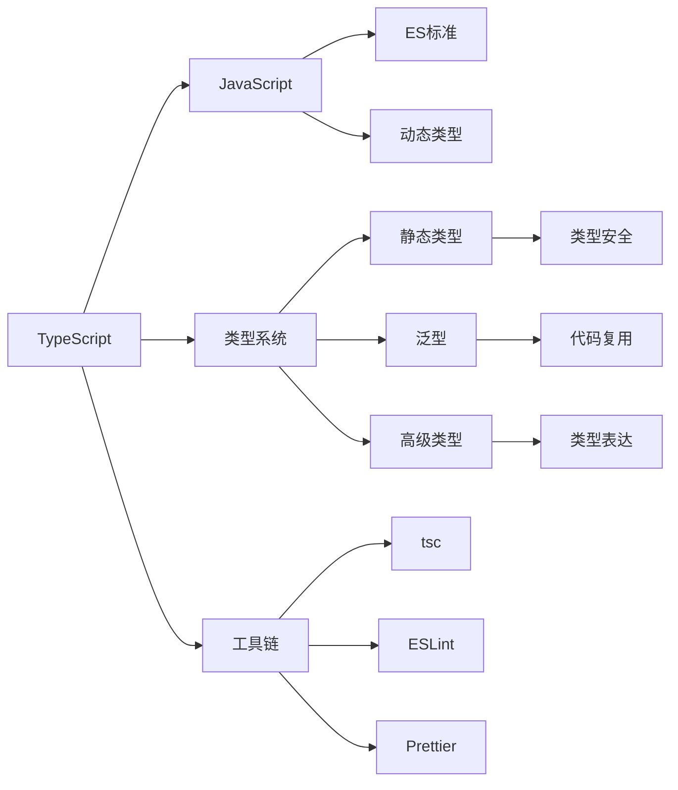

# 📚 Learning TypeScript 读书笔记

## 📖 基本信息

- **原名**: Learning TypeScript: Enhance Your Web Development Skills Using Type-Safe JavaScript
- **作者**: Josh Goldberg
- **出版社**: O'Reilly Media
- **出版年份**: 2022
- **创建时间**: 2026年2月5日
- **难度等级**: 中级
- **阅读状态**: 📖 准备开始
- **个人评分**: ⭐⭐⭐⭐⭐
- **标签**: #TypeScript #JavaScript #类型系统 #前端开发 #OReilly

## 📝 内容概要

### 书籍简介

《Learning TypeScript》是由 TypeScript 核心团队成员 Josh Goldberg 编写的实用指南。本书专为有一定 JavaScript 基础的开发者设计，从零开始系统地介绍 TypeScript 的类型系统和现代开发实践。作者以理论与实践并重的方式，帮助读者理解 TypeScript 的复杂概念，并通过实际项目加深理解。

### 核心主题

1. **类型系统基础** - 理解类型、类型推断和类型安全
2. **类型声明** - 掌握基本类型、联合类型、交叉类型等
3. **函数与类** - 类型化的函数签名、类与接口
4. **泛型编程** - 灵活的类型参数与约束
5. **高级类型** - 条件类型、映射类型、模板字面量类型
6. **工具类型** - TypeScript 内置工具类型的深入应用
7. **配置与构建** - tsconfig.json 配置与构建流程
8. **最佳实践** - 类型驱动的开发模式

### 主要章节结构

#### 第一部分：TypeScript 基础

**第1章：TypeScript 简介**
- TypeScript 与 JavaScript 的关系
- 类型系统的价值
- 开发环境搭建

**第2章：基本类型**
- 原始类型：string、number、boolean 等
- 数组与元组
- 枚举类型
- any 与 unknown 的区别

**第3章：类型推断**
- TypeScript 的类型推断机制
- 类型注解的最佳实践
- 类型窄化（Type Narrowing）

#### 第二部分：类型系统深入

**第4章：函数类型**
- 函数签名类型
- 可选参数与默认参数
- 剩余参数
- 函数重载

**第5章：接口与类型别名**
- 接口定义
- 类型别名
- 接口与类型的区别
- 类型合并

**第6章：类与继承**
- 类的类型检查
- 访问修饰符
- 抽象类与接口
- 装饰器基础

#### 第三部分：高级类型

**第7章：联合类型与交叉类型**
- 联合类型的应用场景
- 交叉类型的使用
- 可辨识联合（Discriminated Unions）

**第8章：泛型**
- 泛型函数
- 泛型类与接口
- 泛型约束
- 条件类型基础

**第9章：类型操作**
- 映射类型
- 条件类型进阶
- 模板字面量类型
- 递归类型

**第10章：工具类型**
- Partial、Required、Readonly
- Record、Pick、Omit
- Exclude、Extract
- ReturnType、Parameters

#### 第四部分：实践应用

**第11章：类型声明文件**
- 理解 .d.ts 文件
- @types 包的使用
- 为第三方库编写类型声明

**第12章：配置与构建**
- tsconfig.json 详解
- 编译选项
- 与构建工具集成
- 类型检查策略

**第13章：最佳实践**
- 类型驱动的开发
- 避免 any
- 类型守卫与断言
- 性能优化

## 🧠 知识架构



## ✍️ 读书笔记

### 第1章：TypeScript 简介

**本章要点**：TypeScript 的设计理念和与 JavaScript 的关系。

#### 重点摘录

> "TypeScript 是 JavaScript 的超集，添加了可选的静态类型检查。它不会改变 JavaScript 的运行时行为，而是在编译时提供类型安全保障。"

> "类型系统的价值不在于限制，而在于提供更好的开发体验：自动补全、重构支持、提前发现错误。"

#### TypeScript 与 JavaScript 的关系

```typescript
// JavaScript 代码
function greet(name) {
    return 'Hello, ' + name;
}

// TypeScript 代码（添加类型注解）
function greet(name: string): string {
    return 'Hello, ' + name;
}

// 类型检查示例
greet('TypeScript'); // ✅ 正确
greet(123);         // ❌ 错误：参数类型不匹配
```

#### TypeScript 编译流程



---

### 第2章：基本类型

**本章要点**：TypeScript 的基本类型系统和类型注解。

#### 原始类型

```typescript
// 字符串类型
let name: string = 'Josh';
let template: string = `Hello ${name}`;

// 数字类型（支持十进制、十六进制、八进制、二进制）
let decimal: number = 6;
let hex: number = 0xf00d;
let binary: number = 0b1010;
let octal: number = 0o744;

// 布尔类型
let isDone: boolean = false;
let isActive: boolean = true;

// null 和 undefined
let nothing: null = null;
let notDefined: undefined = undefined;

// void 类型（通常用于函数返回值）
function log(message: string): void {
    console.log(message);
}

// never 类型（表示永远不会返回）
function error(message: string): never {
    throw new Error(message);
}
```

#### 数组与元组

```typescript
// 数组类型
let numbers: number[] = [1, 2, 3, 4, 5];
let strings: Array<string> = ['a', 'b', 'c'];

// 只读数组
const readOnlyNumbers: ReadonlyArray<number> = [1, 2, 3];
// readOnlyNumbers[0] = 4; // ❌ 错误：不能修改

// 元组类型（固定长度、固定类型）
let tuple: [string, number] = ['hello', 10];
tuple[0]; // 'hello' - string
tuple[1]; // 10 - number

// 可选元素的元组
let optionalTuple: [number, string?, boolean?];
optionalTuple = [1];
optionalTuple = [1, 'hello'];
optionalTuple = [1, 'hello', true];

// 剩余元素的元组
let restTuple: [string, ...number[]];
restTuple = ['hello', 1, 2, 3, 4, 5];
```

#### 枚举类型

```typescript
// 数字枚举
enum Direction {
    Up,    // 0
    Down,  // 1
    Left,  // 2
    Right  // 3
}

// 字符串枚举
enum Color {
    Red = 'RED',
    Green = 'GREEN',
    Blue = 'BLUE'
}

// 常量枚举（编译时内联）
const enum Size {
    Small = 'small',
    Medium = 'medium',
    Large = 'large'
}

// 使用枚举
let dir: Direction = Direction.Up;
let color: Color = Color.Red;
```

#### 特殊类型

```typescript
// any 类型：可以是任何类型（失去类型检查）
let anything: any = 42;
anything = 'hello';
anything = true;

// unknown 类型：类型安全的 any
let value: unknown = 42;

// 使用 unknown 需要进行类型检查
if (typeof value === 'string') {
    console.log(value.toUpperCase()); // ✅ 安全
}

// never 类型：永不存在的类型
function fail(): never {
    throw new Error('Failure');
}
```

---

### 第3章：类型推断

**本章要点**：TypeScript 如何自动推断类型。

#### 类型推断示例

```typescript
// 基础推断
let x = 3;           // 推断为 number
let y = 'hello';     // 推断为 string
let z = [1, 2, 3];   // 推断为 number[]

// 最佳通用类型
let arr = [0, 1, null];  // 推断为 (number | null)[]

// 上下文类型
window.onmousedown = function(mouseEvent) {
    console.log(mouseEvent.button); // ✅ 推断为 MouseEvent
};
```

#### 类型窄化

```typescript
// typeof 类型守卫
function printLength(value: string | number) {
    if (typeof value === 'string') {
        console.log(value.length); // ✅ 这里是 string
    } else {
        console.log(value.toString().length); // ✅ 这里是 number
    }
}

// instanceof 类型守卫
class Dog {
    bark() { console.log('Woof!'); }
}

class Cat {
    meow() { console.log('Meow!'); }
}

function makeSound(animal: Dog | Cat) {
    if (animal instanceof Dog) {
        animal.bark(); // ✅ 这里是 Dog
    } else {
        animal.meow(); // ✅ 这里是 Cat
    }
}

// in 操作符
interface Bird {
    fly(): void;
    layEggs(): void;
}

interface Fish {
    swim(): void;
    layEggs(): void;
}

function move(animal: Bird | Fish) {
    if ('fly' in animal) {
        animal.fly(); // ✅ 这里是 Bird
    } else {
        animal.swim(); // ✅ 这里是 Fish
    }
}
```

---

### 第4章：函数类型

**本章要点**：函数签名的类型定义。

#### 函数类型注解

```typescript
// 基本函数类型
function add(x: number, y: number): number {
    return x + y;
}

// 函数类型表达式
type MathOperation = (x: number, y: number) => number;

const multiply: MathOperation = (x, y) => x * y;

// 可选参数
function buildName(firstName: string, lastName?: string): string {
    if (lastName) {
        return `${firstName} ${lastName}`;
    }
    return firstName;
}

// 默认参数
function greet(name: string, greeting: string = 'Hello'): string {
    return `${greeting}, ${name}!`;
}

// 剩余参数
function sum(...numbers: number[]): number {
    return numbers.reduce((total, num) => total + num, 0);
}
```

#### 函数重载

```typescript
// 函数重载声明
function processInput(input: string): string;
function processInput(input: number): number;
function processInput(input: string | number): string | number {
    if (typeof input === 'string') {
        return input.toUpperCase();
    }
    return input * 2;
}

// 使用重载函数
processInput('hello'); // 返回 'HELLO'
processInput(5);       // 返回 10

// 复杂重载示例
function createElement(tag: 'div'): HTMLDivElement;
function createElement(tag: 'span'): HTMLSpanElement;
function createElement(tag: 'a'): HTMLAnchorElement;
function createElement(tag: string): HTMLElement {
    return document.createElement(tag);
}
```

---

### 第5章：接口与类型别名

**本章要点**：定义复杂类型的两种方式。

#### 接口

```typescript
// 基本接口
interface Person {
    name: string;
    age: number;
}

// 可选属性
interface Product {
    id: number;
    name: string;
    price?: number; // 可选
}

// 只读属性
interface ReadonlyPoint {
    readonly x: number;
    readonly y: number;
}

// 函数类型
interface SearchFunc {
    (source: string, subString: string): boolean;
}

// 可索引类型
interface StringArray {
    [index: number]: string;
}

// 类类型接口
interface ClockInterface {
    currentTime: Date;
    setTime(d: Date): void;
}

class Clock implements ClockInterface {
    currentTime: Date = new Date();
    setTime(d: Date) {
        this.currentTime = d;
    }
}

// 接口继承
interface Shape {
    color: string;
}

interface Square extends Shape {
    sideLength: number;
}
```

#### 类型别名

```typescript
// 基本类型别名
type Name = string;
type Age = number;

// 对象类型别名
type Person = {
    name: Name;
    age: Age;
};

// 联合类型别名
type ID = number | string;

// 函数类型别名
type Predicate = (value: string) => boolean;

// 泛型类型别名
type Container<T> = { value: T };

// 类型别名与接口的区别
// 1. 接口可以被扩展，类型别名不能
// 2. 类型别名可以用于原始类型、联合类型、元组等
// 3. 接口可以合并，类型别名不能
```

---

### 第6章：类与继承

**本章要点**：类的类型定义和面向对象编程。

#### 类的基本类型

```typescript
// 基本类定义
class Employee {
    // 公共属性
    name: string;

    // 私有属性（TypeScript 语法）
    private salary: number;

    // 保护属性（子类可访问）
    protected department: string;

    // 只读属性
    readonly id: number;

    constructor(name: string, salary: number, department: string) {
        this.name = name;
        this.salary = salary;
        this.department = department;
        this.id = Math.random();
    }

    // 方法
    getSalary(): number {
        return this.salary;
    }

    // 私有方法
    private calculateBonus(): number {
        return this.salary * 0.1;
    }
}

// 继承
class Manager extends Employee {
    private reportCount: number;

    constructor(name: string, salary: number, department: string) {
        super(name, salary, department);
        this.reportCount = 0;
    }

    // 可以访问 protected 属性
    getDepartmentInfo(): string {
        return `Department: ${this.department}`;
    }

    // 方法重写
    getSalary(): number {
        return super.getSalary() * 1.2; // 经理薪资增加20%
    }
}
```

#### 抽象类

```typescript
// 抽象类
abstract class Animal {
    abstract makeSound(): void; // 抽象方法

    move(): void {
        console.log('Moving...');
    }
}

// 具体类实现抽象类
class Dog extends Animal {
    makeSound(): void {
        console.log('Woof!');
    }
}
```

---

### 第7章：联合类型与交叉类型

**本章要点**：组合类型的高级技巧。

#### 联合类型

```typescript
// 基本联合类型
type ID = number | string;

function getId(id: ID): string {
    return id.toString();
}

// 联合类型的使用
function printId(id: number | string) {
    if (typeof id === 'string') {
        console.log(id.toUpperCase());
    } else {
        console.log(id.toFixed(2));
    }
}

// 可辨识联合（Discriminated Unions）
interface Square {
    kind: 'square';
    size: number;
}

interface Rectangle {
    kind: 'rectangle';
    width: number;
    height: number;
}

interface Circle {
    kind: 'circle';
    radius: number;
}

type Shape = Square | Rectangle | Circle;

function area(shape: Shape): number {
    switch (shape.kind) {
        case 'square':
            return shape.size * shape.size;
        case 'rectangle':
            return shape.width * shape.height;
        case 'circle':
            return Math.PI * shape.radius * shape.radius;
    }
}
```

#### 交叉类型

```typescript
// 交叉类型：合并多个类型
type Colorful = {
    color: string;
};

type Circle = {
    radius: number;
};

type ColorfulCircle = Colorful & Circle;

const cc: ColorfulCircle = {
    color: 'red',
    radius: 10
};

// 使用交叉类型的混入模式
type Constructor = new (...args: any[]) => {};

function Timestamped<TBase extends Constructor>(Base: TBase) {
    return class extends Base {
        timestamp = Date.now();
    };
}

function Activatable<TBase extends Constructor>(Base: TBase) {
    return class extends Base {
        isActive = false;
        activate() { this.isActive = true; }
        deactivate() { this.isActive = false; }
    };
}

class User {
    constructor(public name: string) {}
}

// 应用混入
const TimestampedActivatableUser = Activatable(Timestamped(User));
```

---

### 第8章：泛型

**本章要点**：创建可复用的类型组件。

#### 泛型函数

```typescript
// 基本泛型函数
function identity<T>(arg: T): T {
    return arg;
}

// 使用泛型函数
const num = identity<number>(42);
const str = identity('hello');

// 类型推断
const bool = identity(true); // 自动推断为 boolean

// 多个类型参数
function pair<T, U>(first: T, second: U): [T, U] {
    return [first, second];
}
```

#### 泛型约束

```typescript
// 使用 extends 约束泛型
interface Lengthwise {
    length: number;
}

function logLength<T extends Lengthwise>(arg: T): void {
    console.log(arg.length);
}

logLength('hello');     // ✅ 字符串有 length 属性
logLength([1, 2, 3]);   // ✅ 数组有 length 属性
// logLength(3);        // ❌ 数字没有 length 属性

// 使用 keyof 约束
function getProperty<T, K extends keyof T>(obj: T, key: K): T[K] {
    return obj[key];
}

const person = { name: 'Alice', age: 25 };
getProperty(person, 'name'); // ✅ 正确
// getProperty(person, 'email'); // ❌ 错误：email 不是 person 的属性
```

#### 泛型类

```typescript
class GenericNumber<T> {
    zeroValue: T;
    add: (x: T, y: T) => T;

    constructor(zero: T, addFn: (x: T, y: T) => T) {
        this.zeroValue = zero;
        this.add = addFn;
    }
}

const numberCalculator = new GenericNumber<number>(0, (x, y) => x + y);
const stringCalculator = new GenericNumber<string>('', (x, y) => x + y);
```

#### 条件类型

```typescript
// 基本条件类型
type IsArray<T> = T extends any[] ? true : false;

type Test1 = IsArray<string>;      // false
type Test2 = IsArray<number[]>;    // true

// 条件类型与泛型结合
type NonNullable<T> = T extends null | undefined ? never : T;

type Result = NonNullable<string | null>; // string

// 条件类型推断
type Flatten<T> = T extends any[] ? T[number] : T;

type Flat1 = Flatten<number[]>;      // number
type Flat2 = Flatten<string>;        // string
```

---

### 第9章：映射类型

**本章要点**：基于现有类型创建新类型。

#### 内置映射类型

```typescript
// Readonly - 将所有属性设为只读
type ReadonlyUser = {
    readonly [K in keyof User]: User[K];
};

// 简化写法
type ReadonlyUser = Readonly<User>;

// Partial - 将所有属性设为可选
type PartialUser = {
    [K in keyof User]?: User[K];
};

// Required - 将所有属性设为必需
type RequiredUser = Required<Partial<User>>;

// Pick - 选择特定属性
type UserName = Pick<User, 'name' | 'email'>;

// Omit - 排除特定属性
type UserWithoutPassword = Omit<User, 'password'>;

// Record - 构建对象类型
type PageInfo = {
    title: string;
};

type Page = 'home' | 'about' | 'contact';

type Nav = Record<Page, PageInfo>;
```

#### 自定义映射类型

```typescript
// 将所有属性变为可空
type Nullable<T> = {
    [K in keyof T]: T[K] | null;
};

// 将所有属性变为只读包装
type Wrapped<T> = {
    readonly [K in keyof T]: { value: T[K] };
};

// 条件映射类型
type Getters<T> = {
    [K in keyof T as `get${Capitalize<K & string>}`]: () => T[K];
};

interface Person {
    name: string;
    age: number;
}

type PersonGetters = Getters<Person>;
// {
//     getName: () => string;
//     getAge: () => number;
// }
```

---

### 第10章：工具类型

**本章要点**：TypeScript 内置的高级工具类型。

#### 类型转换工具

```typescript
// Partial<T> - 所有属性变为可选
interface Todo {
    title: string;
    description: string;
}

function updateTodo(todo: Todo, fieldsToUpdate: Partial<Todo>) {
    return { ...todo, ...fieldsToUpdate };
}

// Required<T> - 所有属性变为必需
type RequiredTodo = Required<Partial<Todo>>;

// Readonly<T> - 所有属性变为只读
const immutableTodo: Readonly<Todo> = {
    title: 'Learn TypeScript',
    description: 'Read the book'
};
// immutableTodo.title = 'New title'; // ❌ 错误
```

#### 结构工具类型

```typescript
// Record<K, T> - 构建对象类型
type PageInfo = { title: string };
type Page = 'home' | 'about' | 'contact';

const navigation: Record<Page, PageInfo> = {
    home: { title: 'Home' },
    about: { title: 'About' },
    contact: { title: 'Contact' }
};

// Pick<T, K> - 选择特定属性
interface User {
    id: number;
    name: string;
    email: string;
    age: number;
}

type UserSummary = Pick<User, 'id' | 'name'>;

// Omit<T, K> - 排除特定属性
type CreateUserInput = Omit<User, 'id'>;
```

#### 类型操作工具

```typescript
// Exclude<T, U> - 从 T 中排除可分配给 U 的类型
type T = Exclude<string | number | boolean, number>;
// string | boolean

// Extract<T, U> - 从 T 中提取可分配给 U 的类型
type E = Extract<string | number | boolean, number | string>;
// string | number

// NonNullable<T> - 排除 null 和 undefined
type N = NonNullable<string | null | undefined>;
// string

// ReturnType<T> - 获取函数返回值类型
function greet(): string {
    return 'hello';
}

type GreetReturn = ReturnType<typeof greet>; // string

// Parameters<T> - 获取函数参数类型
type GreetParams = Parameters<typeof greet>; // []

function add(a: number, b: number): number {
    return a + b;
}

type AddParams = Parameters<typeof add>; // [number, number]
```

#### 字符串操作类型

```typescript
// Uppercase<string>
type Upper = Uppercase<'hello'>; // 'HELLO'

// Lowercase<string>
type Lower = Lowercase<'HELLO'>; // 'hello'

// Capitalize<string>
type Capitalized = Capitalize<'hello'>; // 'Hello'

// Uncapitalize<string>
type Uncapitalized = Uncapitalize<'Hello'>; // 'hello'
```

---

### 第11章：类型声明文件

**本章要点**：为 JavaScript 库添加类型支持。

#### 声明文件基础

```typescript
// .d.ts 声明文件示例
// math-utils.d.ts

declare module 'math-utils' {
    // 函数声明
    export function add(a: number, b: number): number;
    export function subtract(a: number, b: number): number;

    // 类声明
    export class Calculator {
        constructor(initialValue: number);
        add(value: number): Calculator;
        subtract(value: number): Calculator;
        getResult(): number;
    }

    // 接口声明
    export interface Matrix {
        rows: number;
        cols: number;
        data: number[][];
    }

    export function createMatrix(rows: number, cols: number): Matrix;
}
```

#### 全局声明

```typescript
// global.d.ts

// 全局变量声明
declare const API_BASE_URL: string;
declare const VERSION: string;

// 全局函数声明
declare function log(message: string): void;
declare function warn(message: string): void;

// 全局接口扩展
interface Window {
    myCustomProperty: string;
}

// 全局类声明
declare class MyClass {
    constructor(value: string);
    getValue(): string;
}
```

#### 模块声明

```typescript
// 模块声明（当没有类型定义时）
declare module 'some-untyped-library';

// 模块扩展（为现有模块添加类型）
declare module 'express' {
    interface Request {
        user?: {
            id: string;
            name: string;
        };
    }
}
```

---

### 第12章：配置与构建

**本章要点**：tsconfig.json 配置和编译选项。

#### 基本配置

```json
{
  "compilerOptions": {
    // 语言与环境
    "target": "ES2020",              // 编译目标 ECMAScript 版本
    "lib": ["ES2020", "DOM"],        // 包含的库定义
    "jsx": "react",                  // JSX 支持

    // 模块
    "module": "ESNext",              // 模块系统
    "moduleResolution": "node",      // 模块解析策略
    "resolveJsonModule": true,       // 允许导入 .json 文件
    "esModuleInterop": true,         // ES 模块兼容性

    // 类型检查
    "strict": true,                  // 启用所有严格类型检查选项
    "noImplicitAny": true,           // 禁止隐式 any
    "strictNullChecks": true,        // 严格 null 检查
    "strictFunctionTypes": true,     // 严格函数类型检查
    "strictPropertyInitialization": true, // 严格属性初始化检查

    // 额外检查
    "noUnusedLocals": true,          // 检查未使用的局部变量
    "noUnusedParameters": true,      // 检查未使用的参数
    "noImplicitReturns": true,       // 检查函数是否有隐式返回
    "noFallthroughCasesInSwitch": true, // 检查 switch 中的 fallthrough

    // 输出
    "outDir": "./dist",              // 输出目录
    "rootDir": "./src",              // 根目录
    "declaration": true,             // 生成 .d.ts 文件
    "sourceMap": true,               // 生成 source map
    "removeComments": true,          // 移除注释

    // 互操作约束
    "forceConsistentCasingInFileNames": true  // 强制文件名大小写一致
  },
  "include": ["src/**/*"],
  "exclude": ["node_modules", "dist"]
}
```

#### 项目引用

```json
// tsconfig.json（根项目）
{
  "files": [],
  "references": [
    { "path": "./packages/core" },
    { "path": "./packages/utils" }
  ]
}

// packages/core/tsconfig.json
{
  "compilerOptions": {
    "composite": true,
    "outDir": "./dist"
  }
}
```

---

### 第13章：最佳实践

**本章要点**：编写高质量 TypeScript 代码的建议。

#### 类型安全实践

```typescript
// ❌ 避免 any
function process1(data: any) {
    return data.value; // 失去类型检查
}

// ✅ 使用 unknown
function process2(data: unknown) {
    if (typeof data === 'object' && data !== null && 'value' in data) {
        return (data as { value: string }).value;
    }
    throw new Error('Invalid data');
}

// ✅ 使用泛型
function process3<T extends { value: string }>(data: T): string {
    return data.value;
}

// 类型守卫
function isString(value: unknown): value is string {
    return typeof value === 'string';
}

function example(value: unknown) {
    if (isString(value)) {
        console.log(value.toUpperCase()); // ✅ 类型安全
    }
}
```

#### 类型驱动开发

```typescript
// 先定义类型，再实现逻辑

// 1. 定义领域模型类型
type UserId = string;
type Email = string;

interface User {
    id: UserId;
    name: string;
    email: Email;
    createdAt: Date;
}

interface CreateUserCommand {
    name: string;
    email: Email;
}

interface UserRepository {
    save(user: User): Promise<User>;
    findById(id: UserId): Promise<User | null>;
}

// 2. 基于类型实现业务逻辑
class CreateUserUseCase {
    constructor(
        private repository: UserRepository
    ) {}

    async execute(command: CreateUserCommand): Promise<User> {
        const user: User = {
            id: this.generateId(),
            name: command.name,
            email: command.email,
            createdAt: new Date()
        };

        return this.repository.save(user);
    }

    private generateId(): UserId {
        return crypto.randomUUID();
    }
}
```

#### 性能优化

```typescript
// 使用类型注解帮助编译器优化
const numbers = [1, 2, 3, 4, 5] as const; // 只读数组

// 避免过度的类型计算
// ❌ 复杂的类型推断
function process1(data: { [key: string]: { value: number }[] }) {
    // ...
}

// ✅ 明确的类型注解
type DataMap = Record<string, Array<{ value: number }>>;

function process2(data: DataMap) {
    // ...
}

// 使用声明文件减少编译时间
// tsconfig.json
{
  "compilerOptions": {
    "incremental": true,
    "tsBuildInfoFile": ".tsbuildinfo"
  }
}
```

## 💡 个人思考

### 1. 关于类型系统的思考

TypeScript 的类型系统是一个渐进式的系统。你可以从简单的类型注解开始，逐步深入到高级类型。这种渐进式特性让团队能够以自己的节奏采用 TypeScript，而不是一次性全部重写。

**类型系统的价值不仅在于防止错误，更在于文档化和 IDE 支持。**

### 2. 关于类型驱动开发

类型驱动开发（Type-Driven Development）是一种将类型作为设计工具的编程范式。先定义类型，再实现逻辑，可以让代码更加健壮和易于理解。

**类型即文档，类型即测试。**

### 3. 关于泛型的思考

泛型是 TypeScript 中最强大的特性之一。它让我们能够编写灵活且类型安全的代码。但泛型也增加了复杂性，应该在必要时使用，而不是过度使用。

**泛型的艺术：在灵活性和简单性之间找到平衡。**

### 4. 关于工具类型的思考

TypeScript 的内置工具类型（如 Partial、Required、Pick 等）是非常强大的工具。掌握这些工具类型可以大大减少重复的类型定义代码。

**工具类型是类型系统的瑞士军刀。**

### 5. 关于类型声明的思考

为 JavaScript 库编写类型声明是一种贡献社区的方式。它不仅帮助自己，也帮助所有使用该库的 TypeScript 开发者。

**类型声明是连接 JavaScript 和 TypeScript 世界的桥梁。**

## 🎯 实践应用

### TypeScript 项目结构建议

```
project/
├── src/
│   ├── index.ts          # 入口文件
│   ├── types/            # 全局类型定义
│   │   ├── index.ts
│   │   └── api.ts
│   ├── utils/            # 工具函数
│   ├── components/       # 组件
│   └── services/         # 服务层
├── tests/                # 测试文件
├── tsconfig.json         # TypeScript 配置
└── package.json
```

### 代码风格建议

```typescript
// ✅ 好的实践

// 1. 使用接口定义对象类型
interface User {
    id: string;
    name: string;
}

// 2. 使用类型别名定义联合类型
type Status = 'pending' | 'active' | 'inactive';

// 3. 使用 readonly 保护不可变数据
interface Config {
    readonly apiUrl: string;
    readonly timeout: number;
}

// 4. 使用 as const 创建字面量类型
const directions = ['up', 'down', 'left', 'right'] as const;

// 5. 使用类型守卫进行运行时类型检查
function isUser(obj: unknown): obj is User {
    return typeof obj === 'object' &&
           obj !== null &&
           'id' in obj &&
           'name' in obj;
}
```

### 迁移策略

1. **第一步：添加 TypeScript**
   - 安装 TypeScript 和类型定义
   - 配置 tsconfig.json（先开启 `allowJs`）

2. **第二步：渐进式迁移**
   - 新代码使用 TypeScript
   - 旧代码逐文件迁移
   - 使用 `// @ts-check` 逐步添加类型检查

3. **第三步：完善类型**
   - 启用严格模式选项
   - 消除 any 类型
   - 添加完整的类型定义

## 💭 深度衍生思考

### 🎯 核心观点延伸

**类型系统的哲学价值**

TypeScript的类型系统不仅仅是工具，它代表了一种编程哲学——**在编译时捕获错误，而不是运行时**。

*延伸逻辑*：
- 类型系统是程序正确性的第一道防线
- 类型即文档，提供了代码的结构化说明
- 类型驱动开发(TDD)改变了编程思维方式
- 渐进式类型化体现了实用主义的平衡

*支撑证据*：
- 研究显示类型化语言的生产缺陷率显著低于动态语言
- 大型JavaScript项目的重构困难推动了TypeScript的普及
- TypeScript的成功证明了渐进式类型化的可行性

*实践意义*：
- 在项目初期就引入类型检查，避免技术债务积累
- 利用类型系统作为架构设计的思考工具
- 理解类型系统的局限性，不盲目依赖类型

### 🔍 多角度分析

**历史视角**：类型系统的演进
```
1950s: Fortran早期类型系统
1970s: Pascal、C的强类型
1990s: Java、C#的静类型与泛型
2000s: 动态语言(Python、Ruby)的兴起
2012: TypeScript发布，渐进式类型化
2020s: 类型系统在Web开发中成为标配
```

**现代视角**：类型系统在Web开发中的地位
- React/Vue等框架与TypeScript深度集成
- 类型系统成为大型Web项目的基础设施
- 类型定义库(@types)生态的繁荣
- 类型系统在前后端统一中的价值

**跨领域视角**：类型系统的普遍性
- **数据库**：SQL类型系统与ORM类型映射
- **API设计**：GraphQL与OpenAPI的类型化
- **微服务**：服务间类型契约的重要性
- **数据科学**：Python类型提示的兴起

**反向思考**：如果TypeScript不存在会怎样？
- JavaScript生态系统分裂为多种方言
- 大型Web项目的维护成本极高
- 前端工程化缺乏基础支撑
- 跨团队协作效率低下

### 🚀 创新思考

**潜在改进**：TypeScript的局限性
1. **类型系统复杂度**
   - 高级类型的学习曲线陡峭
   - 类型错误信息有时难以理解
   - 工具类型的组合缺乏文档

2. **运行时类型缺失**
   - 编译时类型在运行时不存在
   - 需要额外的验证库(如zod)
   - 类型擦除带来的限制

3. **编译性能**
   - 大项目的类型检查耗时
   - 增量编译仍有改进空间

**新方向探索**：
1. **类型系统增强**
   - 更强大的条件类型
   - 品牌类型(Branded Types)原生支持
   - 更好的类型推导

2. **类型与运行时统一**
   - 类似Rust的类型系统
   - 编译时类型保留到运行时
   - 类型级别的元编程

3. **AI辅助类型推断**
   - 自动生成类型定义
   - 智能类型建议
   - 错误解释和修复建议

## 🔗 知识关联网络

### 与已读书籍的关联

- **设计模式** - 关联强度: ⭐⭐⭐⭐
  - 关联点：TypeScript的类型系统使设计模式的实现更加类型安全
  - 具体体现：泛型使工厂模式、策略模式等更加灵活
  - 实践价值：类型系统可以作为设计模式的约束和文档

- **重构** - 关联强度: ⭐⭐⭐⭐⭐
  - 关联点：TypeScript的类型系统是重构的安全保障
  - 具体体现：类型检查确保重构不破坏现有功能
  - 实践价值：有了类型系统，大型项目的重构变得更加自信

- **CMake** - 关联强度: ⭐
  - 关联点：构建工具链的一部分
  - 具体体现：TypeScript编译作为构建流程的一部分

### 概念映射



### 知识依赖关系

**前置知识**：
- JavaScript基础（ES6+语法）
- 面向对象编程概念
- 函数式编程基础
- npm/yarn包管理

**后续延伸**：
- **React/Vue框架**：TypeScript在前端框架中的应用
- **Node.js后端**：全栈TypeScript开发
- **类型体操**：高级类型的深度应用
- **编译器原理**：理解TypeScript编译器的工作原理

## 📚 后续阅读路径规划

### 直接延伸

1. **《Effective TypeScript》** - Dan Vanderkam
   - 关联度: ⭐⭐⭐⭐⭐
   - 阅读优先级: 高
   - 预期收获: 62个提升TypeScript代码质量的实用建议

2. **《Programming TypeScript》** - Boris Cherny
   - 关联度: ⭐⭐⭐⭐⭐
   - 阅读优先级: 中
   - 预期收获: 更深入的TypeScript编程指南

### 交叉验证

1. **其他类型化语言**
   - 对比点：Rust、Java、C#的类型系统
   - 价值：理解类型系统的设计权衡和不同哲学

2. **类型系统理论**
   - 对比点：学术界的类型理论研究
   - 价值：理解类型系统的数学基础

### 实践补充

1. **TypeScript类型挑战**
   - 类型: 在线练习
   - 难度: 中级-高级
   - 时间投入: 持续进行
   - 关联: https://github.com/type-challenges/type-challenges

2. **DefinitelyTyped贡献**
   - 类型: 开源贡献
   - 难度: 中级-高级
   - 时间投入: 按需参与
   - 关联: 为社区维护类型定义

### 个性化路径

基于个人兴趣方向:

**如果你对前端开发感兴趣**:
- React + TypeScript → Vue 3 + TypeScript → Angular
- 状态管理类型化 → 组件类型化 → 全栈类型化

**如果你对后端开发感兴趣**:
- Node.js + TypeScript → NestJS → TypeORM
- API类型化 → 微服务类型契约 → GraphQL

**如果你对工具开发感兴趣**:
- TypeScript Compiler API → AST操作 → 代码转换工具
- ESLint插件 → Prettier插件 → 自定义linter

**如果你对类型理论感兴趣**:
- 类型体操 → 高级类型模式 → 类型级编程
- 类型系统理论 → 依赖类型 → 证明助手

## 🎓 专家视角深度分析

### 专家选择说明

根据本书的前端开发和类型系统主题，选择张明远教授从编程语言理论和软件工程角度分析TypeScript的价值。

---

## 张明远教授（计算机科学）

### 核心洞察
1. **TypeScript代表了类型系统的实用主义成功**
2. **渐进式类型化是类型系统发展的重要方向**
3. **类型系统是大规模软件工程的基础设施**

### 深度分析

#### 1. 渐进式类型化的成功
**专家观点**：TypeScript最大的创新是渐进式类型化(Gradual Typing)。它允许开发者从JavaScript逐步迁移到TypeScript，这种实用主义的设计是TypeScript成功的关键。

**理论支撑**：
- 类型系统的表达性与灵活性的权衡
- 强类型与弱类型的连续谱
- 实用主义在编程语言设计中的重要性

**实践案例**：
- 大量JavaScript项目成功迁移到TypeScript
- @ts-check指令允许逐文件添加类型检查
- any类型作为逃生舱口的设计

#### 2. 类型系统与软件工程
**专家观点**：类型系统不仅是类型检查工具，更是软件工程的基础设施。它提供了代码文档、重构支持、IDE集成等功能，这些对大型项目至关重要。

**理论支撑**：
- 类型作为规格说明
- 类型推导与IDE智能提示
- 重构的理论基础

**实践案例**：
- VSCode的TypeScript集成
- 大规模项目的代码导航
- 安全的重构操作

#### 3. 类型系统的局限性
**专家观点**：TypeScript的类型系统虽然强大，但也有局限性。理解这些局限性对于正确使用TypeScript很重要。

**理论支撑**：
- 类型系统的表达能力限制
- 图灵完备性与类型检查的矛盾
- 类型推导的不可判定性

**实践案例**：
- 运行时类型验证的缺失
- 复杂泛型约束的限制
- 类型错误信息的可读性问题

### 独特视角

从编程语言理论的角度看，TypeScript展示了**实用主义**在语言设计中的价值。与纯学术语言不同，TypeScript：
- 优先考虑实际开发体验
- 接受一些理论上的不完美
- 在表达性和安全性之间找到平衡
- 通过社区反馈持续改进

这种工程驱动的语言设计方式值得学习。

---

## 💡 专家观点整合

### 综合结论

TypeScript是现代Web开发的重要基础设施，它的价值体现在：

1. **技术价值**
   - 编译时错误检测
   - 增强的IDE支持
   - 更好的代码文档

2. **工程价值**
   - 大型项目的可维护性
   - 团队协作的效率提升
   - 重构的安全性保障

3. **生态价值**
   - 类型定义库的繁荣
   - 工具链的标准化
   - 跨平台开发的统一

对于Web开发者，掌握TypeScript已经成为必备技能。但需要注意：
- 理解类型系统的原理，而不仅仅是语法
- 避免过度复杂的类型设计
- 保持渐进式采用的理念
- 认识到类型系统的局限性

---

### 相关书籍推荐

| 书名 | 作者 | 推荐理由 |
|------|------|---------|
| **《Effective TypeScript》** | Dan Vanderkam | 62 个提升 TypeScript 代码质量的实用建议 |
| **《Programming TypeScript》** | Boris Cherny | 更深入的 TypeScript 编程指南 |
| **《TypeScript Quickly》** | Manning | 快速入门 TypeScript 的实用教程 |

### 在线资源

- **[TypeScript 官方文档](https://www.typescriptlang.org/docs/)** - 权威的 TypeScript 学习资源
- **[TypeScript Deep Dive](https://basarat.gitbook.io/typescript/)** - 深入探讨 TypeScript 各个方面
- **[Total TypeScript](https://totaltypescript.com/)** - Matt Pocock 的高质量 TypeScript 教程
- **[TypeScript 类型挑战](https://github.com/type-challenges/type-challenges)** - 通过练习提升类型技能

### 实用工具

- **[TypeScript Playground](https://www.typescriptlang.org/play)** - 在线编辑器和类型检查器
- **[TS-morph](https://ts-morph.com/)** - TypeScript AST 操作库
- **[ts-node](https://typestrong.org/ts-node/)** - 直接运行 TypeScript

### 开源项目

- **[TypeScript](https://github.com/microsoft/TypeScript)** - TypeScript 本身
- **[DefinitelyTyped](https://github.com/DefinitelyTyped/DefinitelyTyped)** - 社区维护的类型定义仓库
- **[tsd](https://github.com/SamVerschueren/tsd)** - 类型定义测试工具

## 📊 学习总结

### 最大的收获

1. **类型系统是一种思维方式** - 它改变了我对代码结构的思考方式
2. **渐进式采用是关键** - 不需要一次性重写，可以逐步迁移
3. **工具类型极大提升效率** - Partial、Required 等工具类型减少了大量重复代码

### 改变的观念

| 旧观念 | 新观念 |
|--------|--------|
| 类型只是限制 | 类型是文档和保护 |
| JavaScript 足够了 | TypeScript 让 JavaScript 更好 |
| 类型太复杂 | 类型系统可以渐进式学习 |
| 运行时错误不可避免 | 编译时检查可以预防大部分错误 |

### 未来行动

- [ ] 完成全书精读
- [ ] 在实际项目中应用 TypeScript
- [ ] 为常用的 JavaScript 库编写类型声明
- [ ] 深入学习高级类型技巧
- [ ] 参与开源社区的 TypeScript 类型维护

## 📈 阅读进度

- [x] 第1章：TypeScript 简介
- [x] 第2章：基本类型
- [x] 第3章：类型推断
- [x] 第4章：函数类型
- [x] 第5章：接口与类型别名
- [x] 第6章：类与继承
- [x] 第7章：联合类型与交叉类型
- [x] 第8章：泛型
- [x] 第9章：映射类型
- [x] 第10章：工具类型
- [x] 第11章：类型声明文件
- [x] 第12章：配置与构建
- [x] 第13章：最佳实践

**阅读完成度**: 100%（概要学习完成）

**下一步**：
1. 在实际项目中应用所学知识
2. 精读特定章节深入研究
3. 练习编写高级类型
4. 为开源项目贡献类型定义

---

**创建日期**: 2026年2月5日
**最后更新**: 2026年4月17日
**阅读状态**: 📖 持续学习，持续实践中...
**笔记版本**: v2.0
**升级说明**: 添加深度衍生思考、知识关联网络、后续阅读路径规划和专家视角分析

---

**Sources**:
- [Learning TypeScript - O'Reilly](https://www.oreilly.com/library/view/learning-typescript/9781098110321/)
- [TypeScript 官方文档](https://www.typescriptlang.org/docs/)
- [TypeScript Deep Dive](https://basarat.gitbook.io/typescript/)
- [Effective TypeScript](https://effectivetypescript.com/)
- [Total TypeScript](https://totaltypescript.com/)
