# 📚 Unity3D高级编程：主程手记

## 📖 基本信息

- **作者**: 陆泽西
- **出版社**: 机械工业出版社
- **出版年份**: 2022年1月
- **页数**: 376页
- **ISBN**: 9787111698197
- **豆瓣评分**: 8.0分
- **创建时间**: 2026年5月5日
- **难度等级**: 中高级
- **阅读状态**: ✅ 已完成
- **个人评分**: ⭐⭐⭐⭐⭐
- **标签**: #Unity3D #游戏开发 #C# #架构设计 #渲染原理 #UI框架 #客户端架构

## 📝 内容概要

### 书籍简介

《Unity3D高级编程：主程手记》是资深游戏开发者陆泽西十年游戏开发经验的结晶。作者曾就职于盛大游戏、动视暴雪等知名游戏公司，本书是其多年实战经验的系统性总结。全书层层拆解Unity3D游戏客户端架构，深入剖析各个模块的技术方案，细致讲解游戏客户端的渲染原理。

本书共分10章，每章都是一个独立的知识领域。读者既可以按照章节顺序阅读，也可以根据喜好挑选自己感兴趣的章节学习。这是一本不适合初学者的进阶书籍，建议读者至少具备2年以上Unity3D开发经验。

### 核心主题

1. **软件架构设计** - 架构的意义、思维方式、项目构建方法
2. **C#技术要点** - 深入理解C#语言特性和高级用法
3. **客户端数据处理** - 数据表管理、程序协作机制
4. **UI框架与优化** - 用户界面架构设计及性能优化
5. **渲染原理与优化** - GPU优化技术、渲染管线、阴影处理

### 主要章节结构

#### 第1章：软件架构
- 1.1 架构的意义
- 1.2 软件架构的思维方式
- 1.3 如何构建Unity3D项目

#### 第2章：C#技术要点
- C#基础知识讲解
- 字符串的隐藏问题
- 程序运行原理

#### 第3章：数据表与程序
- 3.1 数据表的种类
- 3.1.1 大部分数据都是在Excel里生成的
- 3.1.2 最原始的数据方式——代码数据
- 客户端表格数据处理
- 程序的协作与应用

#### 第4章：用户界面
- UI框架设计
- UI优化策略

#### 第5章：3D模型与动画
- 5.1 美术资源规范
- 5.2 合并3D模型（动态批处理、静态批处理、自定义合并）
- 5.3 状态机（模拟人物行为动作、项目中的应用场景）
- 5.4 3D模型的变与换（切割、扭曲、简化、蒙皮骨骼、换皮换装、捏脸、动画优化）
- 5.5 资源的加载与释放

#### 第6章：网络通信
- 6.1 TCP与UDP对比与选择
- 6.2 C#实现TCP（线程锁、缓冲队列、双队列结构、断线检测）
- 6.3 C#实现UDP（连接确认、数据包校验与重发、丢包分析）
- 6.4 封装HTTP（协议原理、HTTP版本演进、Unity中的封装）
- 6.5 网络数据协议（JSON、二进制流、MessagePack、Protobuf）
- 6.6 网络同步解决方案（状态同步、实时广播、帧同步、同步快进、精度问题）

#### 第7章：游戏中的AI
- 7.1 用状态机构建AI
- 7.2 用行为树构建AI（复合节点、修饰节点、条件节点、行为节点）
- 7.3 非典型性AI（可演算式AI、博弈式AI）

#### 第8章：地图与寻路
- 8.1 A星算法及其优化（排序优化、期望值优化、权重引导、区域拆分、JPS）
- 8.2 寻路网格的构建（数组网格、路点网格、三角形网格、多层级网格、体素化网格、Navmesh）
- 8.3 地图编辑器（基本功能、数据协议选择、加载方式、九宫格）
- 8.4 地图的制作与优化（制作方式、常规场景性能优化）

#### 第9章：渲染管线与图形学
- 9.1 图形学基础（向量、点积、叉乘、投影、矩阵、齐次坐标、四元数）
- 9.2 渲染管线（OpenGL/DirectX图形接口、渲染管线流程、混合、管线总结）

#### 第10章：渲染原理与知识
- 10.1 渲染顺序
- 10.2 Alpha Test
- 10.3 Early-Z GPU硬件优化技术
- 10.4 Mipmap的原理
- 10.5 显存的工作原理
- 10.6 Filter滤波方式
- 10.7 实时阴影
- 10.11 Projector投影原理

## 🧠 知识架构

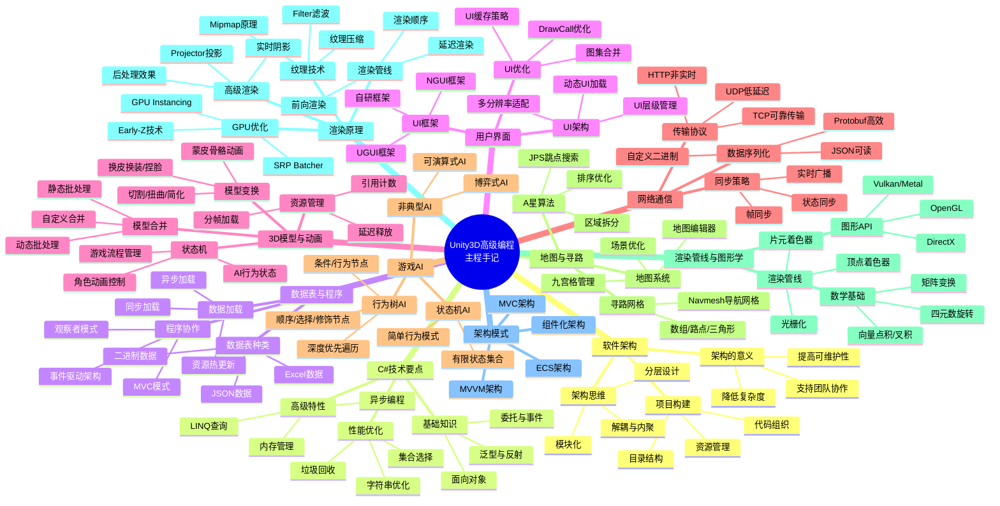

## ✍️ 读书笔记

### 第1章：软件架构

#### 重点摘录

> "架构的意义在于降低系统的复杂度，让团队成员能够高效协作，让代码易于维护和扩展。"

> "软件架构不是一成不变的，它需要随着项目的发展而演进。好的架构能够适应变化，而不是阻碍变化。"

#### 1.1 架构的意义

架构设计并非"过度设计"，而是在项目初期就为后续开发建立秩序。没有架构的项目，随着功能增长会快速陷入"泥球"状态 — 所有逻辑纠缠在一起，改一处牵动全局。

**有架构 vs 无架构的对比**：

```mermaid
graph TB
    subgraph 无架构：面条式耦合
        N1[GameManager] --> N2[直接引用Player]
        N1 --> N3[直接引用UIManager]
        N1 --> N4[直接引用SaveSystem]
        N2 --> N3
        N3 --> N4
        N4 --> N2
        N_DESC[所有模块互相依赖<br/>改一个牵动全部]
    end
    
    subgraph 有架构：分层解耦
        G1[GameManager] --> G2[IInputService 接口]
        G1 --> G3[IPlayerController 接口]
        G1 --> G4[IUIService 接口]
        G1 --> G5[IDataService 接口]
        G_DESC[通过接口通信<br/>模块可独立替换和测试]
    end
```

**架构设计的四大核心价值**：

| 价值 | 说明 | 不重视的后果 |
|------|------|-------------|
| 降低复杂度 | 将复杂系统分解为可管理的子系统 | 代码如迷宫，新成员难以理解 |
| 提高可维护性 | 清晰的层次使修改影响范围可控 | 改一个Bug引发三个新Bug |
| 支持团队协作 | 模块化设计允许多人并行开发 | 频繁冲突，互相阻塞 |
| 便于测试 | 解耦的组件可独立进行单元测试 | 只能靠人工测试，质量不可控 |

#### 1.2 软件架构的思维方式

作者强调四种核心思维原则：**分层**、**模块化**、**依赖倒置**、**接口隔离**。这四者不是独立的原则，而是层层递进的关系。

**架构思维体系**：

```mermaid
graph TB
    A[分层思维] --> |将系统按职责分层| B[模块化思维]
    B --> |每层内按功能拆模块| C[依赖倒置]
    C --> |高层不依赖低层实现| D[接口隔离]
    D --> |通过接口解耦具体类]
    
    subgraph 分层架构示例
        E[表现层 Presentation<br/>View / UI组件] 
        F[业务逻辑层 Logic<br/>Controller / 状态机]
        G[数据层 Data<br/>Model / 数据仓库]
        E -->|通过接口调用| F
        F -->|通过接口调用| G
    end
```

**Unity3D中的分层架构**：

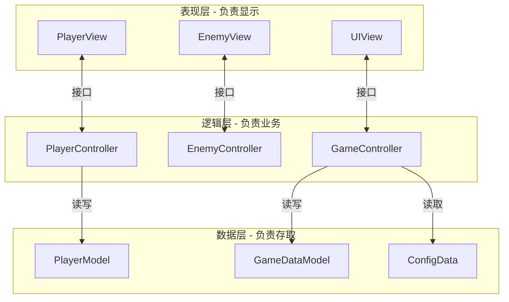

**关键设计原则**：
1. **分层思维** — 将系统按职责划分为表现层、逻辑层、数据层，各层只与相邻层通信
2. **模块化思维** — 每个模块是独立的功能单元，可独立开发、测试、替换
3. **依赖倒置** — 高层模块定义接口，低层模块实现接口。高层不直接依赖低层的具体类
4. **接口隔离** — 接口要小而精，不要让一个类依赖它不需要的方法

#### 1.3 如何构建Unity3D项目

**推荐的目录结构**：

```
Assets/
├── Scripts/
│   ├── Core/           # 核心系统
│   │   ├── Events/      # 事件系统
│   │   ├── Patterns/    # 设计模式
│   │   └── Utils/       # 工具类
│   ├── Game/           # 游戏逻辑
│   │   ├── Player/      # 玩家相关
│   │   ├── Enemy/       # 敌人相关
│   │   └── Level/       # 关卡相关
│   ├── UI/             # UI系统
│   │   ├── Views/       # 视图
│   │   ├── Controllers/ # 控制器
│   │   └── Models/      # 数据模型
│   └── Data/           # 数据层
│       ├── Models/      # 数据模型
│       └── Repositories/# 数据仓库
├── Prefabs/            # 预制体
├── Scenes/             # 场景
├── Resources/          # 资源
└── Art/               # 美术资源
```

**项目构建的核心思路**：

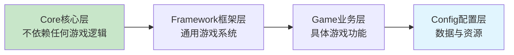

依赖方向只能从上到下，绝不能反向。Core层是最底层的基础设施（事件系统、对象池、工具类），不应该知道Game层的任何信息。

---

### 第2章：C#技术要点

#### 重点摘录

> "字符串是C#中最容易被滥用的类型之一。理解字符串的不可变性对于编写高性能代码至关重要。"

> "了解程序运行原理，包括内存管理、垃圾回收机制，是编写高性能Unity3D游戏的基础。"

> "在Unity3D中，GC（垃圾回收）是造成卡顿的主要原因之一。减少GC的关键不是等GC发生时处理，而是在编写代码时就避免产生垃圾。"

#### 2.1 C#内存模型

理解值类型和引用类型的区别是编写高性能C#代码的基础。两种类型在内存中的存储位置和分配方式完全不同，直接影响GC压力。

**值类型 vs 引用类型**：

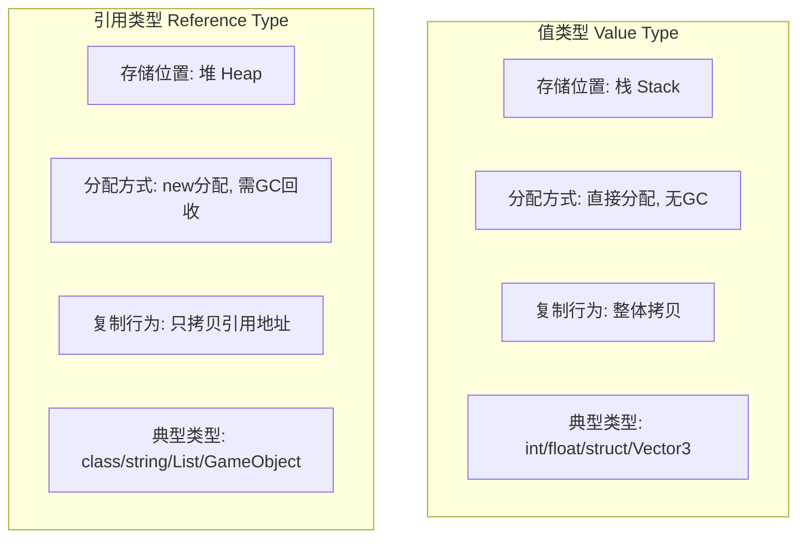

| 特性 | 值类型 (struct) | 引用类型 (class) |
|------|----------------|-----------------|
| 存储位置 | 栈（Stack） | 堆（Heap） |
| 内存分配 | 极快，移动栈指针即可 | 较慢，需在堆中寻找连续空间 |
| GC影响 | 无GC压力 | 需要GC回收 |
| 赋值行为 | 完整拷贝数据 | 只拷贝引用地址 |
| 适合场景 | 小型数据（坐标、颜色、矩阵） | 复杂对象（组件、管理器） |
| Unity中的例子 | Vector3、Color、Quaternion | MonoBehaviour、GameObject、string |

**装箱拆箱的性能陷阱**：

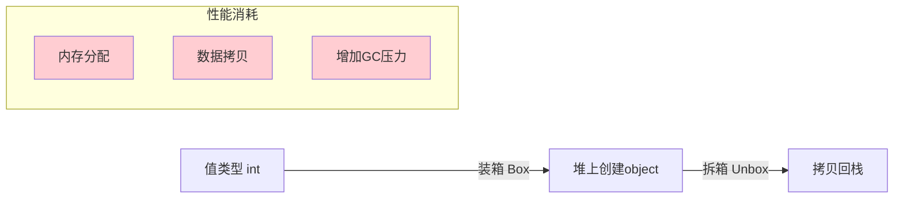

装箱（Boxing）将值类型包装为引用类型存到堆上，拆箱（Unboxing）再拷贝回栈。每次装箱都在堆上分配内存，增加GC压力。解决方案是使用泛型集合（`List<int>` 代替 `ArrayList`），在编译时确定类型，完全避免装箱拆箱。

#### 2.2 字符串的隐藏问题

字符串是Unity开发中最大的隐形性能杀手之一。C#中的字符串是**不可变**的 — 任何修改操作都会创建一个全新的字符串对象。

**字符串操作的内存影响**：

```mermaid
graph TB
    subgraph 字符串拼接的内存浪费
        S1["a" + "b" + "c"]
        S2[创建 "ab"]
        S3[创建 "abc" 废弃 "ab"]
        S4[产生1个垃圾对象]
        S1 --> S2 --> S3 --> S4
    end
    
    subgraph StringBuilder的高效方式
        B1[StringBuilder内部维护char数组]
        B2[在原数组上追加]
        B3[只在最后生成1个字符串]
        B4[零垃圾对象]
        B1 --> B2 --> B3 --> B4
    end
```

**字符串池（String Interning）机制**：

```
编译期字面量:  string a = "Hello";  string b = "Hello";
               → a 和 b 指向同一内存地址（自动池化）

运行时拼接:    string c = "Hel" + "lo";
               → c 是新对象，不与 a 共享内存

手动池化:      string d = string.Intern(c);
               → d 与 a 共享内存
```

字符串池是CLR维护的一张全局哈希表，存储所有唯一的字符串字面量。相同内容的字符串字面量在编译时会自动指向同一内存地址，但运行时拼接的字符串不会自动池化。

#### 2.3 垃圾回收（GC）优化

Unity使用 Boehm GC，是一种非分代、非压缩的停止式垃圾回收器。这意味着每次GC都会暂停所有线程（Stop-the-World），在游戏运行中表现为卡顿。

**Unity GC工作机制**：

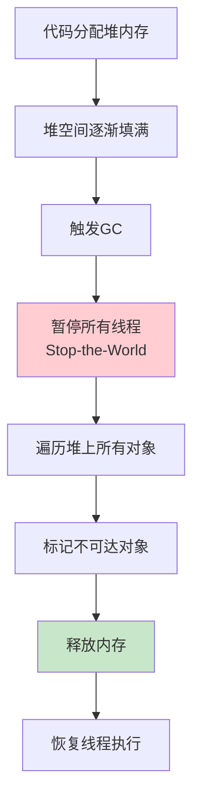

**减少GC的核心策略**：

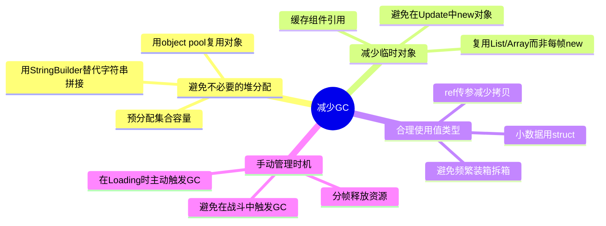

**GC优化的关键对照**：

| 反面做法（每帧产生GC） | 正面做法（零GC） |
|----------------------|-----------------|
| `string msg = "Frame:" + i;` | `sb.Clear(); sb.Append("Frame:"); sb.Append(i);` |
| `List<int> list = new List<int>();` 每帧new | `List<int> list = new List<int>(100);` 初始化一次，每帧Clear |
| `GetComponent<T>()` 每帧调用 | `T component;` 在Start/Awake缓存 |
| `foreach` 遍历自定义集合 | `for` 循环 + 索引访问 |

#### 2.4 集合与算法选择

书中对 List、Dictionary 的底层源码进行了深入剖析，并在排序和搜索算法方面给出了实战指导。

**常用集合的底层原理与性能特征**：

| 集合 | 底层结构 | 查找 | 插入/删除 | 适用场景 |
|------|---------|------|----------|---------|
| List | 动态数组 | O(n) 线性查找 | 尾部O(1)，中间O(n) | 有序遍历、索引访问 |
| Dictionary | 哈希表+数组 | O(1) 哈希查找 | 平均O(1) | 键值查找、去重 |
| HashSet | 哈希表 | O(1) | 平均O(1) | 去重、集合运算 |
| LinkedList | 双向链表 | O(n) | O(1) 已知位置 | 频繁插入删除 |
| Queue | 环形数组 | — | O(1) | FIFO队列 |
| Stack | 数组 | — | O(1) | LIFO栈、撤销操作 |

**List扩容机制**：List内部维护一个数组，容量不足时会创建一个2倍大小的新数组并复制数据。频繁扩容产生大量GC。解决方案是在构造时指定初始容量：`new List<int>(100)`。

**排序与搜索算法选择**：

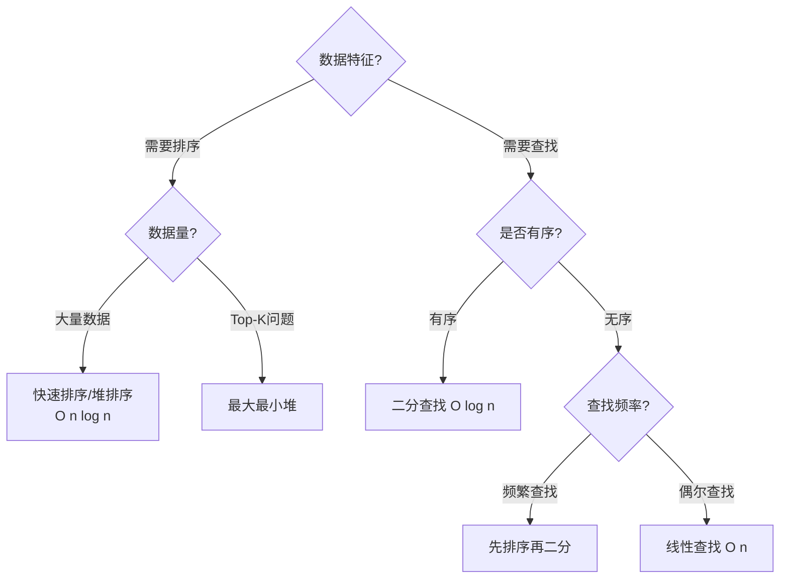

书中还深入讲解了四叉树和八叉树两种空间索引结构，在2D/3D游戏中用于高效的空间查询（碰撞检测、视锥剔除、范围搜索等）。

---

### 第3章：数据表与程序

#### 重点摘录

> "大部分游戏数据都是在Excel里生成的。如何高效地将Excel数据转换为程序可用的格式，是游戏客户端架构的重要课题。"

> "数据表管理系统的设计需要考虑加载性能、内存占用、热更新支持等多个方面。"

> "数据驱动设计的核心思想是：策划通过配置表控制游戏内容，程序员只负责实现机制。这样可以在不修改代码、不重新打包的情况下调整游戏内容。"

#### 3.1 数据表的种类

游戏中存在多种数据来源，各有适用场景。选择正确的数据形式是数据系统设计的第一步。

**四种数据来源对比**：

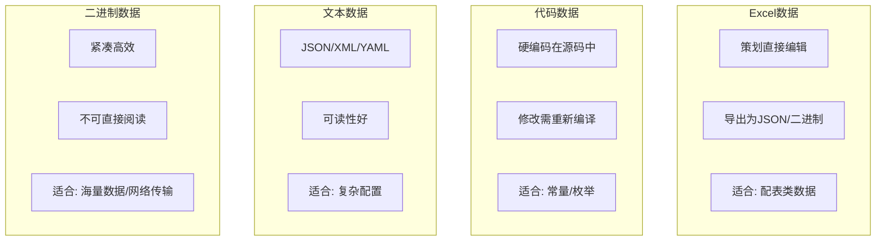

| 数据类型 | 编辑者 | 可读性 | 加载速度 | 体积 | 适用场景 |
|---------|--------|--------|---------|------|---------|
| Excel | 策划 | 中 | 中 | 中 | 道具表、怪物表、关卡表 |
| 代码 | 程序 | 高 | 最快 | 小 | 常量定义、枚举、公式 |
| 文本（JSON/XML） | 策划/程序 | 高 | 慢 | 大 | 剧情配置、技能树、多语言 |
| 二进制流 | 工具导出 | 无 | 快 | 最小 | 地图数据、寻路网格、海量数值 |

**Excel数据全流程**：

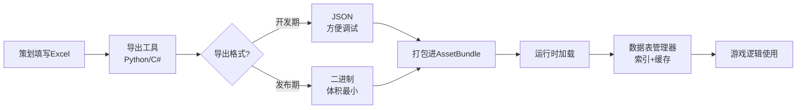

**数据表管理器的核心职责**：

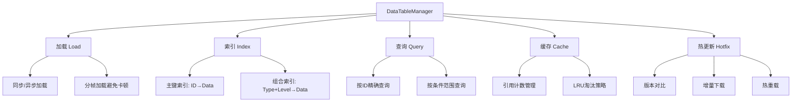

#### 3.2 数据热更新

热更新是现代手游的标配能力 — 在不重新发布版本的情况下，通过下载新的数据文件修改游戏内容。

**热更新数据流程**：

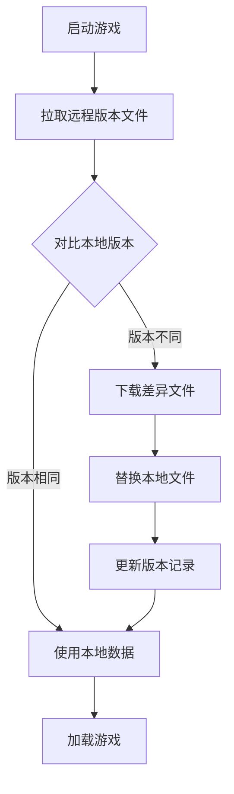

**热更新的设计要点**：

| 要点 | 说明 | 注意事项 |
|------|------|---------|
| 版本对比 | 每个数据文件有独立版本号 | 支持增量更新，不全量下载 |
| 断点续传 | 大文件下载中断后可恢复 | 记录已下载的字节位置 |
| 回滚机制 | 更新失败时恢复到上一版本 | 保留旧文件直到新文件验证通过 |
| 校验机制 | 下载后验证文件完整性（MD5/SHA） | 防止损坏文件导致崩溃 |
| 静默更新 | 在后台下载，不阻塞玩家 | 优先下载当前场景所需数据 |

#### 3.3 多语言的实现

书中还涉及了多语言系统设计 — 通过键值对映射表实现文本国际化，运行时根据语言设置切换显示内容。

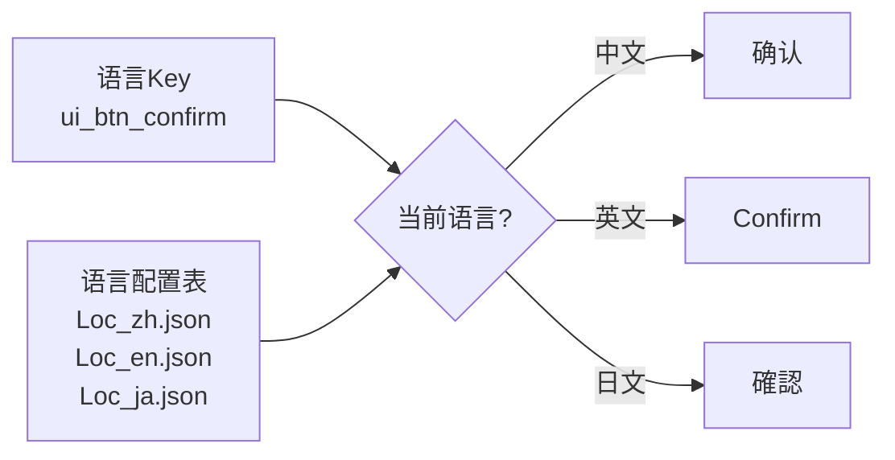

---

### 第4章：用户界面

#### 重点摘录

> "UI框架的设计直接影响游戏性能和开发效率。一个好的UI框架应该支持快速开发、易于维护、性能优秀。"

> "DrawCall优化是UI性能优化的核心。理解Unity的UI合批机制是优化DrawCall的关键。"

> "UGUI的源码是学习UI系统设计的绝佳教材。理解它的事件系统、布局系统和渲染流程，就能知道优化方向在哪里。"

#### 4.1 UGUI系统原理

Unity的UGUI系统是游戏UI的主流方案。理解其运行原理是设计高效UI框架的基础。

**UGUI核心架构**：

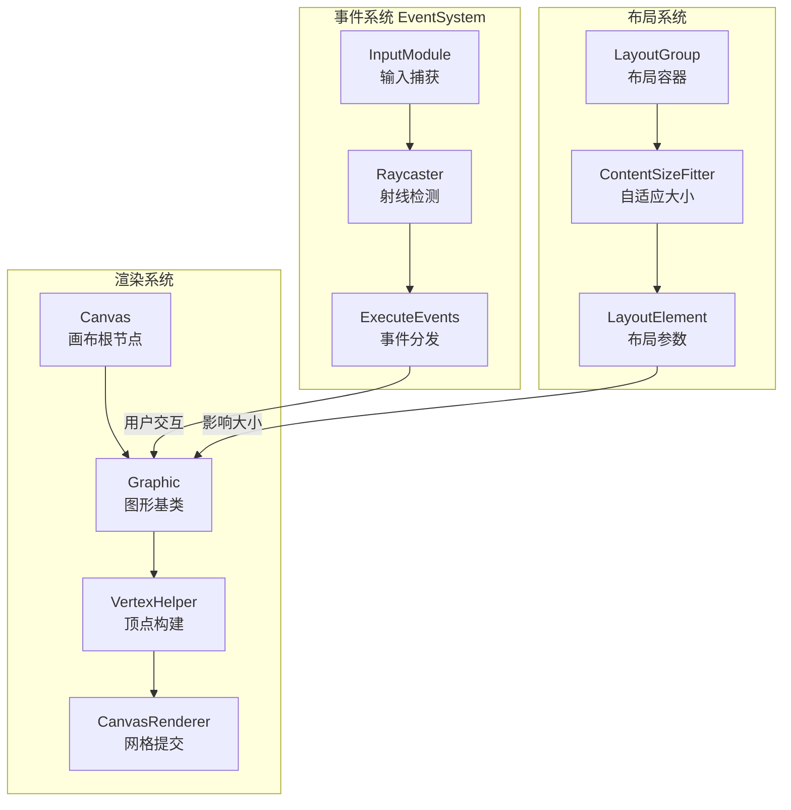

**UGUI合批机制 — DrawCall优化的核心**：

UGUI通过将多个UI元素的网格合并为一个Mesh来减少DrawCall。但合批有严格条件：

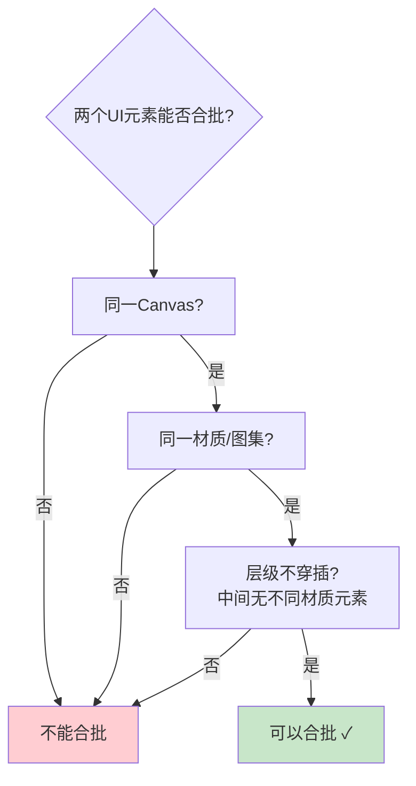

**DrawCall优化对照表**：

| 问题 | 原因 | 解决方案 |
|------|------|---------|
| UI元素分散在多个图集 | 每个图集=1个DrawCall | 合并图集，同一界面的图片打包到同一图集 |
| 动静元素混在一起 | 动态元素变化导致整个Canvas重建 | UI动静分离 — 不变的和变化的分到不同Canvas |
| UI层级穿插不同材质 | 打断合批链 | 调整层级顺序，相同材质的元素相邻排列 |
| 文字和图片交替排列 | 字体材质打断合批 | 将同类型UI元素集中排列 |

#### 4.2 UI框架设计

**MVC架构在UI中的应用**：

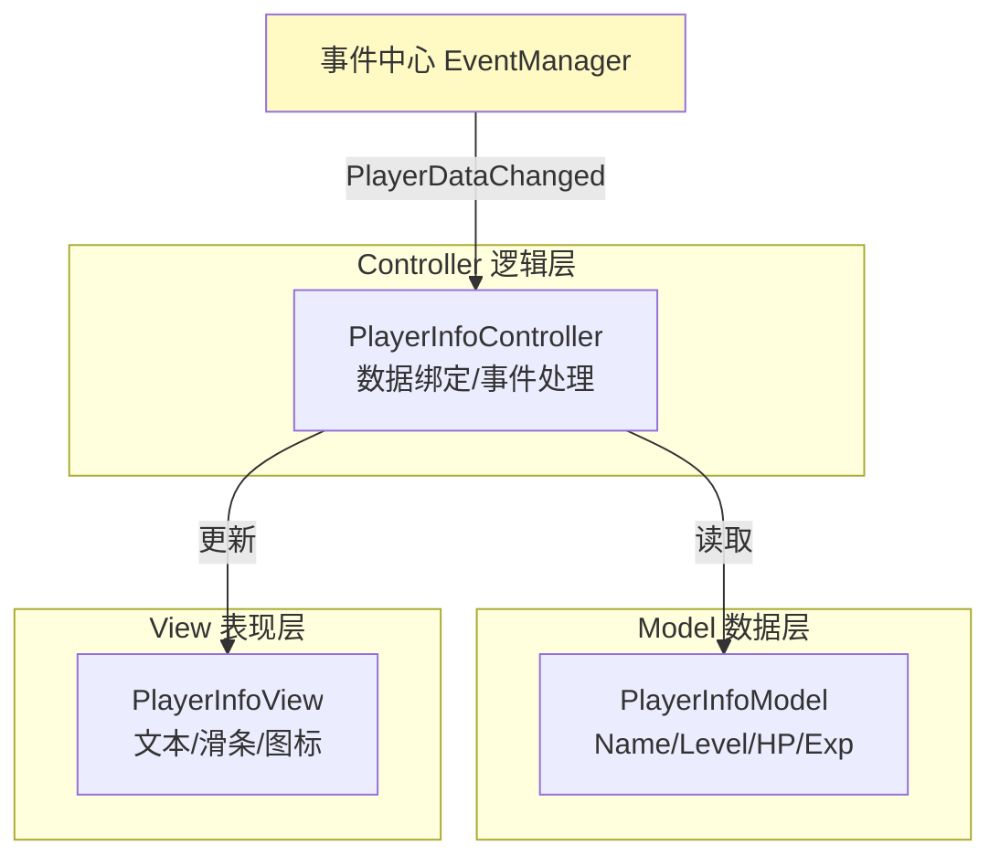

MVC的核心思路是将UI系统拆分为三个职责清晰的部分：
- **Model**：纯数据容器，不关心如何显示
- **View**：纯显示逻辑，不关心数据从哪来
- **Controller**：中间桥梁，监听事件→更新Model→刷新View

**UI框架完整架构**：

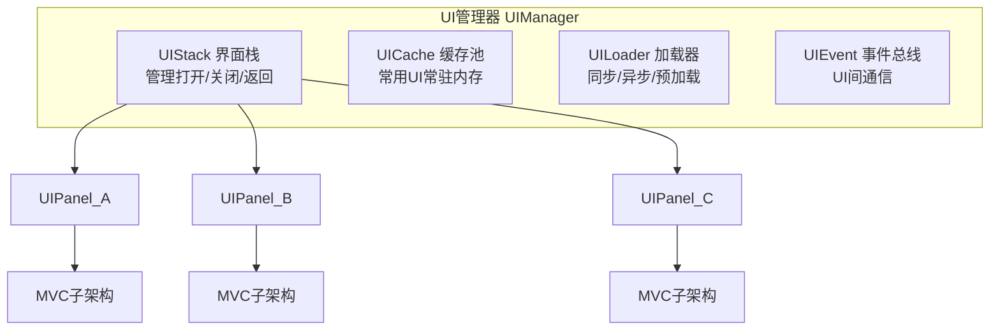

**UI框架设计要点**：
1. **界面栈管理** — 维护UI打开历史，支持"返回上一级"操作
2. **预加载机制** — 在Loading场景时提前实例化常用UI，避免运行时卡顿
3. **缓存复用** — 频繁打开的UI不销毁，隐藏后放入缓存池
4. **事件解耦** — UI之间不直接引用，通过事件总线通信

#### 4.3 UI优化策略大全

书中给出了14项UI优化手段，涵盖了从渲染到底层的各个层面。按优化维度分类如下：

```mermaid
mindmap
  root((UI优化策略))
    渲染优化
      UI动静分离
      拆分过重的UI
      UI图集Alpha分离
      UI图集拼接优化
      UI贴图设置优化
    内存优化
      UI预加载
      UI字体拆分
      对象池运用
      内存泄漏排查
    CPU优化
      Scroll View优化
      网格重构优化
      GC优化
    适配优化
      高低端机型分级
      多分辨率适配
```

**关键优化手段详解**：

| 优化项 | 核心原理 | 效果 |
|--------|---------|------|
| **UI动静分离** | 将不变的和频繁变化的UI放到不同Canvas | 避免整个Canvas重建网格 |
| **Scroll View优化** | 只实例化可视区域的Item，滑动时复用 | 列表从O(n)降到O(可见数量) |
| **Alpha分离** | 将RGBA贴图的RGB和Alpha拆成两张图 | 减少显存带宽，压缩率更高 |
| **网格重构优化** | 避免在运行时频繁修改UI元素的顶点数据 | 减少CPU开销 |
| **高低端分级** | 低端机关闭特效UI、降低刷新频率 | 保证低端机流畅运行 |

**UI对象池模式**：

```mermaid
graph LR
    A[需要UI对象] --> B{池中有空闲对象?}
    B -->|是| C[取出并激活]
    B -->|否| D{未达上限?}
    D -->|是| E[新建对象]
    D -->|否| F[等待回收]
    C --> G[使用]
    G --> H[归还到池<br/>设为不激活]
    E --> G
    H --> B
```

---

### 第5章：3D模型与动画

#### 重点摘录

> "3D模型是游戏世界视觉呈现的基础，理解模型的结构和优化手段是主程的必备技能。"

> "动画系统不仅仅是播放动画片段，更是角色行为逻辑的核心驱动。状态机是将动画与行为逻辑连接起来的桥梁。"

> "资源的加载与释放策略直接影响内存占用和游戏流畅度。不合理的资源管理是项目后期性能问题的最大来源之一。"

#### 5.1 美术资源规范

美术资源的规范管理是项目质量的起点。一个缺乏规范的项目，往往在后期面临严重的性能问题和返工风险。

**关键规范维度**：

| 维度 | 规范要求 | 常见问题 |
|------|---------|---------|
| 面数限制 | 主角8000-15000面，NPC 3000-5000面，场景物体按 LOD 分级 | 面数超标导致渲染压力过大 |
| 贴图尺寸 | 角色1024x1024，场景道具512x512，UI按需 | 贴图过大浪费显存，过小模糊 |
| 骨骼数量 | 主角不超过60根骨骼 | 骨骼过多影响 CPU 蒙皮计算 |
| 材质数量 | 每个 Mesh 不超过2-3个材质 | 材质多导致 DrawCall 增加 |
| 动画帧率 | 24-30帧/秒，关键帧间距合理 | 冗余关键帧浪费内存 |

**美术资源工作流**：

```mermaid
graph LR
    A[3ds Max/Maya<br/>建模] --> B[检查规范<br/>面数/骨骼/UV]
    B --> C{是否通过?}
    C -->|否| A
    C -->|是| D[导出FBX]
    D --> E[导入Unity]
    E --> F[配置材质/贴图]
    F --> G[制作Prefab]
    G --> H[性能测试]
    H --> I{是否达标?}
    I -->|否| A
    I -->|是| J[入库使用]
```

#### 5.2 合并3D模型

合并3D模型是减少 DrawCall 的核心优化手段。书中介绍了三种主要方式：

**三种批处理方式对比**：

```mermaid
graph TB
    subgraph 动态批处理
        D1[运行时自动合并] --> D2[条件严格]
        D2 --> D3[顶点数≤300]
        D3 --> D4[相同材质/缩放]
        D4 --> D5[适合小物体]
    end
    subgraph 静态批处理
        S1[标记Static] --> S2[构建时合并]
        S2 --> S3[内存占用增加]
        S3 --> S4[不限制顶点数]
        S4 --> S5[适合不动物体]
    end
    subgraph 自定义合并
        C1[手动编码合并] --> C2[灵活控制]
        C2 --> C3[可运行时动态]
        C3 --> C4[需自行管理]
        C4 --> C5[适合批量物体]
    end
```

| 方式 | 原理 | 优点 | 缺点 | 适用场景 |
|------|------|------|------|---------|
| 动态批处理 | Unity自动在每帧合并符合条件的Mesh | 零开发成本 | 条件严格（顶点≤300、相同材质、相同缩放） | 大量小型重复物体 |
| 静态批处理 | 构建时合并标记为Static的物体 | 无顶点限制 | 额外内存开销，物体不能移动 | 不移动的建筑、装饰物 |
| 自定义合并 | 代码手动合并Mesh和材质 | 完全可控 | 需要自行管理生命周期 | 大量同类物体（如草地、树木） |

**网格模型基础知识**：一个3D模型由顶点（Vertex）、三角形（Triangle）、UV坐标、法线（Normal）和骨骼权重（Bone Weight）组成。理解这些基本元素是进行模型合并和优化的前提。

#### 5.3 状态机

状态机（FSM, Finite State Machine）是游戏开发中最核心的设计模式之一，贯穿于动画控制、AI行为、UI流程等多个层面。

**有限状态机的核心思想**：

```mermaid
stateDiagram-v2
    [*] --> Idle
    Idle --> Run : 按下移动键
    Run --> Idle : 松开移动键
    Idle --> Attack : 按下攻击键
    Attack --> Idle : 攻击结束
    Run --> Jump : 按下跳跃键
    Jump --> Idle : 落地
    Idle --> Hurt : 受到伤害
    Hurt --> Idle : 受伤动画结束
    Idle --> Dead : 生命值≤0
    Dead --> [*]
```

**状态机在项目中的应用场景**：

| 应用场景 | 说明 | 复杂度 |
|---------|------|--------|
| 角色动画控制 | Idle/Run/Attack/Jump等状态切换 | 中 |
| AI行为控制 | 巡逻/追击/攻击/逃跑等行为状态 | 中 |
| 游戏流程控制 | 加载/主菜单/战斗/结算等流程状态 | 高 |
| 技能系统 | 技能前摇/释放/后摇/冷却等阶段 | 高 |
| UI界面管理 | 各UI界面的显示/隐藏/切换逻辑 | 低 |

**状态机设计要点**：
1. **状态单一性** — 同一时刻只处于一个状态
2. **转换明确性** — 每个状态有明确的进入和退出条件
3. **层次化** — 复杂系统使用分层状态机（HFSM），将大状态拆分为子状态
4. **可扩展** — 新增状态时不应影响已有状态的逻辑

#### 5.4 3D模型的变与换

这一节覆盖了多种3D模型的变形与变换技术，是角色定制和视觉效果的核心内容。

**模型变换技术图谱**：

```mermaid
mindmap
  root((3D模型变换))
    几何变换
      切割模型
        布尔运算
        平面切割
        碎片生成
      扭曲模型
        网格变形
        顶点偏移
        扭曲着色器
      简化模型
        LOD生成
        边折叠算法
        视觉质量平衡
    角色定制
      蒙皮骨骼动画
        骨骼层级
        皮肤权重
        动画混合
      换皮换装
        部件替换
        材质切换
        Mesh合并
      捏脸系统
        BlendShape
        骨骼驱动
        参数映射
    性能优化
      动画优化
        压缩曲线
        剔除冗余骨骼
        LOD动画
      资源管理
        按需加载
        引用计数
        内存回收
```

**关键技术说明**：

- **切割模型**：通过布尔运算或平面切割将一个模型分成多块，常用于破坏效果。需要处理好新生成的截面和UV映射。
- **简化模型**：使用边折叠（Edge Collapse）等算法减少面数，生成LOD（Level of Detail）层级。远处使用低面数模型，近处使用高面数模型。
- **蒙皮骨骼动画**：角色模型通过骨骼驱动变形。每个顶点绑定到一根或多根骨骼上，骨骼运动时顶点跟随移动。权重决定了每根骨骼的影响程度。
- **换皮换装**：将角色的不同部位（头部、身体、武器等）拆分为独立部件，运行时动态组合。关键在于确保骨骼一致性和接缝处理。
- **捏脸**：通过BlendShape（混合变形）或骨骼微调实现面部参数化定制。每个BlendShape定义一组顶点偏移，通过权重插值实现平滑变形。

#### 5.5 资源的加载与释放

资源管理是游戏性能的关键环节。不当的资源加载和释放策略是造成内存泄漏和卡顿的主要原因。

**资源生命周期管理**：

```mermaid
graph TB
    A[请求加载资源] --> B{缓存中存在?}
    B -->|是| C[引用计数+1]
    B -->|否| D[从AssetBundle/Addressables加载]
    D --> E[放入缓存]
    E --> C
    C --> F[使用资源]
    F --> G[引用计数-1]
    G --> H{引用计数=0?}
    H -->|否| I[保留在缓存中]
    H -->|是| J{是否到达释放阈值?}
    J -->|否| K[标记为可释放]
    J -->|是| L[执行Resources.UnloadUnusedAssets]
    K --> L
    L --> M[资源释放完成]
```

**资源管理的核心原则**：
1. **引用计数** — 精确追踪每个资源的使用者数量
2. **延迟释放** — 不立即释放，等待合适的GC时机
3. **分帧加载** — 将大量资源加载分散到多帧，避免单帧卡顿
4. **优先级调度** — 根据资源类型和使用紧急程度安排加载顺序
5. **预加载策略** — 在场景切换时提前加载下一场景需要的资源

---

### 第6章：网络通信

#### 重点摘录

> "网络模块是游戏客户端与服务器沟通的桥梁。一个好的网络框架需要同时处理好连接管理、数据序列化、同步策略三大核心问题。"

> "TCP保证数据可靠到达但延迟高，UDP延迟低但不保证可靠。游戏开发中往往需要根据业务场景混合使用。"

> "帧同步和状态同步是多人游戏最核心的两种同步策略，选择哪一种决定了整个网络架构的设计方向。"

#### 6.1 TCP与UDP

**TCP vs UDP 核心对比**：

```mermaid
graph LR
    subgraph TCP
        T1[三次握手建连]
        T2[数据可靠有序]
        T3[拥塞控制]
        T4[头部开销大<br/>20字节以上]
        T5[适合: 账号/交易/聊天]
    end
    T1 --> T2 --> T3 --> T4 --> T5
```

```mermaid
graph LR
    subgraph UDP
        U1[无连接]
        U2[不保证可靠]
        U3[无拥塞控制]
        U4[头部开销小<br/>仅8字节]
        U5[适合: 位置同步/实时战斗]
    end
    U1 --> U2 --> U3 --> U4 --> U5
```

| 特性 | TCP | UDP |
|------|-----|-----|
| 连接方式 | 面向连接（三次握手） | 无连接 |
| 可靠性 | 保证数据可靠到达、有序 | 不保证，可能丢包、乱序 |
| 延迟 | 较高（需要ACK确认） | 较低（直接发送） |
| 头部大小 | 20字节以上 | 8字节 |
| 拥塞控制 | 有（慢启动、拥塞避免） | 无 |
| 典型游戏场景 | 登录认证、充值、聊天 | 位置同步、实时战斗 |
| 流量控制 | 有（滑动窗口） | 无 |

**游戏中的选择策略**：实际项目中通常两者结合使用 — 控制指令和关键数据走TCP保证可靠，位置和动作同步走UDP降低延迟。也可以基于UDP自行实现可靠性机制（如KCP协议），在可靠性和延迟之间取得平衡。

#### 6.2 C#实现TCP

书中详细讲解了用C#实现TCP客户端的完整方案，核心是解决多线程下的数据安全问题。

**TCP客户端架构**：

```mermaid
graph TB
    A[发送队列] --> B[发送线程]
    B --> C[Socket.Send]
    D[Socket.Receive] --> E[接收线程]
    E --> F[双队列缓冲]
    F --> G[主线程消费]
    
    subgraph 线程安全机制
        H[线程锁 lock]
        I[双队列结构]
        J[信号量通知]
    end
    
    style H fill:#f9f,stroke:#333
    style I fill:#f9f,stroke:#333
    style J fill:#f9f,stroke:#333
```

**核心设计要点**：

- **线程锁**：发送和接收在独立线程中运行，需要用lock保护共享数据，防止竞争条件
- **缓冲队列**：接收到的数据先放入缓冲区，按协议格式切割成完整消息包
- **双队列结构**：一个队列负责写入（接收线程），一个队列负责读取（主线程）。交换队列引用而非复制数据，实现零拷贝切换
- **断线检测**：定时发送心跳包，超时未收到回复则判定断线，触发重连逻辑

#### 6.3 C#实现UDP

UDP的核心挑战是在不可靠传输上构建可靠机制。

**UDP可靠性增强**：

```mermaid
graph LR
    A[发送数据包] --> B[带序号+校验和]
    B --> C[等待ACK确认]
    C --> D{收到ACK?}
    D -->|是| E[发送下一个包]
    D -->|否 超时| F[重发]
    F --> C
```

- **连接确认机制**：模拟TCP的三次握手，确保双方通信就绪
- **数据包校验与重发**：每个包带序号和校验和，接收方确认后发送方才认为送达
- **丢包分析**：统计丢包率，动态调整发送频率和重发策略

#### 6.4 封装HTTP

HTTP协议在游戏中用于登录验证、资源下载、运营活动等非实时场景。

**HTTP版本演进**：

| 版本 | 核心改进 | 对游戏的影响 |
|------|---------|-------------|
| HTTP/1.0 | 每次请求新建连接 | 连接开销大，不适合频繁请求 |
| HTTP/1.1 | Keep-Alive长连接、管道化 | 减少连接建立开销 |
| HTTP/2.0 | 多路复用、头部压缩、服务器推送 | 并发效率大幅提升 |

**Unity中的封装要点**：使用UnityWebRequest替代旧版WWW，支持协程和async/await异步模式。注意处理连续请求的并发问题 — 多个请求同时发出时需要队列管理或限流机制。

#### 6.5 网络数据协议

**协议格式对比**：

| 协议 | 序列化方式 | 体积 | 速度 | 可读性 | 典型用途 |
|------|-----------|------|------|--------|---------|
| JSON | 文本 | 大 | 慢 | 高 | 配置文件、调试 |
| XML | 文本 | 最大 | 最慢 | 高 | 旧系统兼容 |
| Protobuf | 二进制 | 小 | 快 | 低 | 游戏通信主流 |
| MessagePack | 二进制 | 较小 | 较快 | 低 | 轻量通信 |
| 自定义二进制 | 二进制 | 最小 | 最快 | 无 | 极致性能场景 |

**协议包结构**：

```
+--------+--------+----------+----------+---------+
| 长度(4B) | 消息ID(2B) | 序列号(4B) | 数据体(NB) | 校验(2B) |
+--------+--------+----------+----------+---------+
```

**Protobuf的优势与局限**：
- 优势：体积小、速度快、跨语言、向后兼容
- 局限：不可直接阅读、需要.proto文件生成代码、复杂数据结构表达不如JSON直观

#### 6.6 网络同步解决方案

网络同步是多人游戏最核心的技术挑战，直接决定了玩家的游戏体验。

**三种同步策略对比**：

```mermaid
graph TB
    subgraph 状态同步
        SS1[客户端发送操作] --> SS2[服务器计算结果]
        SS2 --> SS3[广播最终状态]
        SS3 --> SS4[客户端插值平滑]
    end
    
    subgraph 帧同步
        FS1[客户端发送操作] --> FS2[服务器收集操作]
        FS2 --> FS3[转发操作给所有人]
        FS3 --> FS4[各客户端本地计算]
    end
    
    subgraph 实时广播
        RB1[客户端发送状态] --> RB2[服务器直接转发]
        RB2 --> RB3[其他客户端接收]
    end
```

| 维度 | 状态同步 | 帧同步 | 实时广播 |
|------|---------|--------|---------|
| 计算位置 | 服务器 | 各客户端 | 发送方 |
| 带宽消耗 | 中 | 小 | 大 |
| 作弊难度 | 高（服务器权威） | 低（客户端可篡改） | 低 |
| 回放支持 | 困难 | 天然支持 | 困难 |
| 开发难度 | 中 | 高（需确定性） | 低 |
| 典型游戏 | MMO、MOBA | RTS、格斗 | 休闲多人 |
| 延迟表现 | 依赖服务器响应 | 锁帧等待所有人 | 取决于网络质量 |

**帧同步的关键挑战**：
1. **确定性** — 所有客户端的浮点运算结果必须完全一致，需使用定点数替代浮点数
2. **同步快进** — 落后的客户端需要快速追赶，重新执行历史帧的操作
3. **同步锁** — 等待所有玩家操作到齐后才能推进下一帧，某个玩家卡顿会影响所有人

---

### 第7章：游戏中的AI

#### 重点摘录

> "游戏AI不是要创造真正的智能，而是要让NPC看起来有智能，给玩家带来有趣的交互体验。"

> "状态机适合简单的行为模式，行为树适合复杂的行为决策，而博弈式AI则适合需要策略深度的对手。"

#### 7.1 用状态机构建AI

状态机AI是最基础也最常用的AI构建方式，适合行为模式简单、状态数量有限的NPC。

**状态机AI示例 — 敌人巡逻兵**：

```mermaid
stateDiagram-v2
    [*] --> 巡逻
    巡逻 : 随机选择路径点移动
    巡逻 : 到达路径点后等待2秒
    
    巡逻 --> 追击 : 发现玩家\n距离<视野范围
    追击 --> 攻击 : 距离<攻击范围
    追击 --> 巡逻 : 失去玩家\n追击超时
    
    攻击 --> 追击 : 玩家离开攻击范围
    攻击 --> 受伤 : 受到伤害
    受伤 --> 攻击 : 受伤动画结束\n且玩家在攻击范围
    受伤 --> 追击 : 受伤动画结束\n玩家不在攻击范围
    
    攻击 --> 逃跑 : 生命值<20%
    逃跑 --> 巡逻 : 成功逃离\n脱离战斗
```

**状态机AI的优缺点**：
- 优点：逻辑清晰、易于实现和调试、性能开销小
- 缺点：状态数量增多后维护困难（状态组合爆炸）、难以表达复杂决策逻辑

#### 7.2 用行为树构建AI

行为树（Behavior Tree）是游戏AI的主流方案，通过树形结构组织行为逻辑，支持复杂的决策流程。

**行为树节点类型**：

```mermaid
graph TB
    subgraph 选择节点 Sequence
        SEQ[→ 顺序节点] --> SEQ_C1[条件1]
        SEQ --> SEQ_C2[条件2]
        SEQ --> SEQ_A1[动作]
        SEQ_DESC[全部成功才算成功<br/>任一失败则返回失败]
    end
    
    subgraph 选择节点 Selector
        SEL[? 选择节点] --> SEL_A1[方案A]
        SEL --> SEL_A2[方案B]
        SEL --> SEL_A3[方案C]
        SEL_DESC[任一成功即返回成功<br/>全部失败才返回失败]
    end
    
    subgraph 修饰节点 Decorator
        DEC[◆ 修饰节点] --> DEC_C[子节点]
        DEC_DESC[Inverter: 取反结果<br/>Repeat: 重复执行<br/>UntilFail: 直到失败]
    end
    
    subgraph 条件节点 Condition
        CON[◇ 条件节点]
        CON_DESC[检测环境状态<br/>不做任何执行动作<br/>返回成功/失败]
    end
    
    subgraph 行为节点 Action
        ACT[● 行为节点]
        ACT_DESC[执行具体操作<br/>移动/攻击/播放动画<br/>返回成功/失败/执行中]
    end
```

**行为树实战示例 — 复杂敌人AI**：

```mermaid
graph TB
    ROOT[? 根选择节点] --> COMBAT[→ 战斗序列]
    ROOT --> PATROL[巡逻行为]
    
    COMBAT --> HAS_ENEMY[◇ 发现敌人?]
    COMBAT --> COMBAT_ACT[? 战斗行为选择]
    
    COMBAT_ACT --> ATTACK_SEQ[→ 攻击序列]
    COMBAT_ACT --> CHASE[追击行为]
    
    ATTACK_SEQ --> IN_RANGE[◇ 在攻击范围内?]
    ATTACK_SEQ --> ATTACK_ACT[● 执行攻击]
    
    PATROL --> HAS_WAYPOINT[◇ 有路径点?]
    PATROL --> MOVE_TO[● 移动到路径点]
    PATROL --> WAIT[● 等待]
```

**行为树的执行流程**：
1. 从根节点开始，按深度优先遍历
2. 选择节点（Selector）从左到右尝试子节点，第一个成功即返回
3. 顺序节点（Sequence）从左到右执行子节点，全部成功才返回成功
4. 每帧重新评估，支持动态响应环境变化

#### 7.3 非典型性AI

除了传统的状态机和行为树，书中还介绍了两种特殊的AI构建方式。

**可演算式AI**：
- 通过数学公式和规则直接演算NPC行为
- 适合赛车游戏中的AI对手 — 通过规划最优路径和速度曲线实现
- 优势：行为可预测、可控性强；劣势：缺乏变化和"人性化"

**博弈式AI**：
- 基于博弈论（如Minimax算法、Alpha-Beta剪枝）构建策略型AI
- 适合棋牌类、策略类游戏
- 通过评估函数对局面打分，选择最优策略
- 可以调节搜索深度来控制AI难度

```mermaid
graph TB
    subgraph AI方案选择
        A{行为复杂度?} -->|简单<br/>3-5种状态| B[状态机AI]
        A -->|中等<br/>多层决策| C[行为树AI]
        A -->|策略对抗| D[博弈式AI]
        A -->|路径规划型| E[可演算式AI]
    end
```

---

### 第8章：地图与寻路

#### 重点摘录

> "A星算法是游戏寻路的基石，但原始的A星在大地图上性能堪忧。真正工程化的A星需要在排序、期望值、区域拆分等多个维度进行优化。"

> "寻路网格的选择决定了AI对空间理解的精度。数组分网格简单但笨重，Navmesh精确但构建复杂。选择哪种取决于游戏类型和性能预算。"

> "地图编辑器不仅是策划的工具，更是整个地图系统的数据入口。它的设计质量直接影响开发效率。"

#### 8.1 A星算法及其优化

A星（A*）是游戏寻路最经典的算法。书中从原始算法出发，逐步展开各种优化手段。

**A星算法核心流程**：

```mermaid
graph TB
    START[将起点加入OpenList] --> LOOP{OpenList为空?}
    LOOP -->|是| FAIL[寻路失败]
    LOOP -->|否| POP[取出F值最小的节点N]
    POP --> GOAL{N是终点?}
    GOAL -->|是| BUILD[回溯路径<br/>寻路成功]
    GOAL -->|否| EXPAND[展开N的邻居节点]
    EXPAND --> NEIGHBOR[对每个邻居M]
    NEIGHBOR --> CALC[计算 M的 G+H = F]
    CALC --> UPDATE{M是否更优?}
    UPDATE -->|是| ADD[更新/加入OpenList]
    UPDATE -->|否| SKIP[跳过]
    ADD --> LOOP
    SKIP --> LOOP
    
    style F fill:#ff9,stroke:#333
```

**关键公式**：F = G + H
- **G**：从起点到当前节点的实际代价
- **H**：从当前节点到终点的估算代价（启发函数，常用曼哈顿距离或欧几里得距离）
- **F**：总估算代价，F值最小的节点优先探索

**六大优化策略**：

| 优化手段 | 原理 | 效果 |
|---------|------|------|
| 排序优化 | 用最小堆/二叉堆替代List排序 | OpenList操作从O(n)降到O(log n) |
| 期望值优化 | 限制搜索范围，超过阈值直接截断 | 避免在死路上浪费搜索 |
| 权重引导 | 不同地形给不同G值权重 | AI优先走"好路"而非"短路" |
| 区域拆分 | 将大地图拆分为多个区域，先区域间寻路再区域内寻路 | 大幅减少搜索节点数 |
| 细节优化 | 跳过封闭列表、位运算标记等 | 减少内存分配和GC压力 |
| JPS（Jump Point Search） | 利用网格对称性跳过大量中间节点 | 在均匀网格上可提速10-50倍 |

**区域拆分寻路示意图**：

```mermaid
graph TB
    subgraph 两层寻路
        L1[第一层: 区域间寻路<br/>粗粒度, 快速]
        L2[第二层: 区域内寻路<br/>细粒度, 精确]
        L1 -->|得到区域路径| L2
    end
```

#### 8.2 寻路网格的构建

不同的网格类型决定了寻路的精度和效率。

**网格类型对比**：

```mermaid
graph LR
    subgraph 数组网格
        A1[规则方格]
        A2[实现简单]
        A3[内存占用大]
        A4[适合: 网格型游戏]
    end
    
    subgraph 路点网格
        B1[关键点连接]
        B2[数据量小]
        B3[路径不灵活]
        B4[适合: 固定路线]
    end
    
    subgraph 三角形网格
        C1[多边形三角化]
        C2[贴合地形]
        C3[构建复杂]
        C4[适合: 开放地形]
    end
    
    subgraph Navmesh
        D1[导航网格]
        D2[高精度]
        D3[行业标准]
        D4[适合: 3D场景]
    end
```

| 网格类型 | 原理 | 精度 | 内存 | 构建难度 | 适用场景 |
|---------|------|------|------|---------|---------|
| 数组网格 | 将空间划分为等大小方格 | 低 | 高 | 低 | 回合制、塔防 |
| 路点网格 | 手动或自动放置关键路径点 | 中 | 低 | 低 | 固定路线NPC |
| 三角形网格 | 将可行走区域三角化 | 高 | 中 | 中 | 开放世界 |
| 多层级网格 | 多层LOD网格叠加 | 高 | 中 | 高 | 大型场景 |
| 体素化网格 | 将3D空间体素化后提取可行走面 | 最高 | 高 | 高 | 复杂3D地形 |
| Navmesh | RecastNavigation生成的导航网格 | 高 | 中 | 高（自动） | 3D游戏主流 |

**RecastNavigation Navmesh生成流程**：

```mermaid
graph LR
    A[场景几何体] --> B[体素化<br/>Voxelization]
    B --> C[区域划分<br/>Region Partitioning]
    C --> D[轮廓提取<br/>Contour Extraction]
    D --> E[多边形生成<br/>Polygon Generation]
    E --> F[细节网格<br/>Detail Mesh]
    F --> G[Navmesh]
```

#### 8.3 地图编辑器

地图编辑器是策划配置地图数据的工具，是整个地图系统的数据入口。

**地图编辑器核心功能**：

```mermaid
graph TB
    ME[地图编辑器] --> A[地形编辑<br/>高度/材质/植被]
    ME --> B[物件放置<br/>建筑/装饰/NPC]
    ME --> C[碰撞配置<br/>可行走/阻挡/触发区域]
    ME --> D[光照烘焙<br/>静态光照/阴影]
    ME --> E[寻路数据<br/>Navmesh生成/路点配置]
    ME --> F[触发器编辑<br/>事件/脚本/条件]
    
    ME --> G[导出]
    G --> G1[二进制/JSON]
    G --> G2[分块加载]
    G --> G3[九宫格管理]
```

**九宫格管理机制**：

九宫格是地图分块加载的经典方案。以玩家为中心，始终加载周围9个格子的地图数据，玩家移动时动态加载新格子、卸载旧格子。

```
+---+---+---+
| 1 | 2 | 3 |  ← 卸载区
+---+---+---+
| 4 | P | 6 |  ← P为玩家位置，加载周围9格
+---+---+---+
| 7 | 8 | 9 |  ← 加载区
+---+---+---+
```

当玩家从格子P移动到格子6时：
1. 卸载左侧列（1、4、7）
2. 加载右侧新列
3. 更新九宫格中心为格子6

这种方式保证了流畅的地图切换体验，同时控制了内存占用。

#### 8.4 地图的制作与优化

**场景性能优化清单**：

```mermaid
graph TB
    OPT[场景性能优化] --> A[LOD系统<br/>距离分级渲染]
    OPT --> B[遮挡剔除<br/>Occlusion Culling]
    OPT --> C[合并静态物体<br/>Static Batching]
    OPT --> D[光照烘焙<br/>Lightmapping]
    OPT --> E[遮挡物预计算<br/>PVS]
    OPT --> F[视锥剔除<br/>Frustum Culling]
    OPT --> G[贴图压缩<br/>Texture Compression]
    OPT --> H[分级渲染<br/>远处降低细节]
```

| 优化手段 | 原理 | 节省资源 |
|---------|------|---------|
| LOD（Level of Detail） | 根据距离切换不同精度模型 | GPU渲染 |
| 遮挡剔除 | 不渲染被遮挡的物体 | GPU渲染 |
| 静态批处理 | 合并不移动的物体 | DrawCall |
| 光照烘焙 | 将静态光照预计算到贴图 | GPU计算 |
| 视锥剔除 | 不渲染摄像机视野外的物体 | GPU渲染 |
| 分级渲染 | 远处降低渲染精度和频率 | GPU渲染 |
| 贴图压缩 | 使用ASTC/ETC2等压缩格式 | 显存 |

---

### 第9章：渲染管线与图形学

#### 重点摘录

> "图形学是游戏渲染的理论基础。不理解向量、矩阵和四元数，就无法真正理解渲染管线的每一步在做什么。"

> "渲染管线是从3D场景到2D屏幕的完整变换过程。理解管线的每一个阶段，才能知道性能瓶颈在哪里、优化方向是什么。"

#### 9.1 图形学基础

这一章从最基础的数学工具讲起，是理解后续所有渲染技术的根基。

**图形学数学工具体系**：

```mermaid
mindmap
  root((图形学数学基础))
    向量
      点积 Dot Product
        计算夹角
        判断方向关系
        投影计算
      叉乘 Cross Product
        计算法线
        判断左右/内外
        计算面积
      投影
        向量到向量
        点到平面
        点到线段
    矩阵
      旋转矩阵
        绕X/Y/Z轴旋转
        欧拉角表示
      缩放矩阵
        均匀缩放
        非均匀缩放
      投影矩阵
        透视投影
        正交投影
      齐次坐标
        统一平移变换
        4x4矩阵表示
        仿射变换
    四元数
      旋转表示
        无万向锁
        插值平滑 SLERP
        存储紧凑 4个数
      与欧拉角转换
      与矩阵转换
```

**核心概念详解**：

| 数学工具 | 几何意义 | 游戏中的应用 |
|---------|---------|-------------|
| 向量点积 | a·b = |a||b|cosθ，衡量两向量方向一致性 | 判断敌人是否在视野内、光照强度计算 |
| 向量叉积 | 结果向量垂直于两输入向量所在平面 | 计算面法线、判断点是否在三角形内 |
| 向量投影 | 将一个向量投射到另一个向量的方向上 | 阴影计算、碰撞检测 |
| 矩阵旋转 | 绕指定轴旋转指定角度 | 摄像机旋转、角色转向 |
| 齐次坐标 | 用4个分量(x,y,z,w)统一处理平移和线性变换 | MVP矩阵变换、模型空间到裁剪空间 |
| 四元数 | 用4个数(x,y,z,w)表示3D旋转，避免万向锁 | 角色平滑转向、动画旋转插值 |

**为什么用四元数而不用欧拉角？**

欧拉角（Pitch/Yaw/Roll）虽然直观，但存在**万向锁**问题 — 当两个旋转轴重合时，会丢失一个自由度。四元数用4个分量表示旋转，始终能平滑插值，是游戏引擎的标准旋转表示方式。

```mermaid
graph LR
    subgraph 欧拉角的问题
        E1[直观易懂] --> E2[但存在万向锁]
        E2 --> E3[旋转插值不平滑]
        E3 --> E4[不适合动画]
    end
    
    subgraph 四元数的优势
        Q1[无万向锁] --> Q2[SLERP平滑插值]
        Q2 --> Q3[存储紧凑 4个数]
        Q3 --> Q4[游戏引擎标准]
    end
```

#### 9.2 渲染管线

渲染管线是将3D场景数据转化为屏幕上2D像素的完整流程，是理解GPU工作的核心。

**完整渲染管线流程**：

```mermaid
graph TB
    A[3D模型数据<br/>顶点/UV/法线] --> B[顶点着色器<br/>Vertex Shader<br/>MVP变换/骨骼蒙皮]
    B --> C[曲面细分着色器<br/>Tessellation<br/>可选,增加细节]
    C --> D[几何着色器<br/>Geometry Shader<br/>可选,生成图元]
    D --> E[图元装配<br/>Primitive Assembly<br/>三角形组装]
    E --> F[裁剪<br/>Clipping<br/>剔除视野外图元]
    F --> G[光栅化<br/>Rasterization<br/>图元→片元]
    G --> H[片元着色器<br/>Fragment Shader<br/>纹理采样/光照计算]
    H --> I[逐片元操作<br/>模板测试/深度测试/混合]
    I --> J[帧缓冲<br/>Framebuffer<br/>最终像素]
    
    style A fill:#e1f5fe
    style J fill:#c8e6c9
```

**管线各阶段详解**：

| 阶段 | 类型 | 核心工作 | 可编程 |
|------|------|---------|--------|
| 顶点着色器 | 可编程 | 将顶点从模型空间变换到裁剪空间（MVP矩阵），骨骼蒙皮计算 | 是 |
| 曲面细分 | 可编程（可选） | 根据需要增加几何细节（如近距离时细分曲面） | 是 |
| 几何着色器 | 可编程（可选） | 可以创建或销毁图元，生成粒子等 | 是 |
| 图元装配 | 固定功能 | 将顶点组装成三角形、线段等基本图元 | 否 |
| 裁剪 | 固定功能 | 剔除视锥体外的图元，裁剪跨越边界的图元 | 否 |
| 光栅化 | 固定功能 | 将图元转换为片元（候选像素），插值顶点属性 | 否 |
| 片元着色器 | 可编程 | 计算每个片元的颜色（纹理采样、光照、阴影） | 是 |
| 逐片元操作 | 固定功能 | 模板测试→深度测试→混合，决定最终写入方式 | 部分 |

**OpenGL与DirectX**：
- OpenGL：跨平台图形API，由Khronos维护，Unity和很多移动端使用
- DirectX：Windows/Xbox专用，由微软维护，图形功能和性能优化更直接
- Vulkan/Metal：新一代低级图形API，更接近硬件，控制力更强但开发难度更高

**混合（Blending）**：

混合决定了新渲染的片元如何与已有像素组合，是实现透明效果的核心技术。

| 混合模式 | 公式 | 效果 |
|---------|------|------|
| 不透明 | 直接覆盖 | 无透明 |
| Alpha混合 | src*alpha + dst*(1-alpha) | 标准透明 |
| 加法混合 | src + dst | 发光效果 |
| 乘法混合 | src * dst | 阴影/遮罩效果 |

**渲染管线总结**：

```mermaid
graph LR
    subgraph 应用阶段 CPU
        A1[碰撞检测] --> A2[物理模拟]
        A2 --> A3[视锥剔除]
        A3 --> A4[排序/合批]
        A4 --> A5[提交DrawCall]
    end
    
    subgraph 几何阶段 GPU前端
        B1[顶点变换] --> B2[图元装配]
        B2 --> B3[裁剪]
    end
    
    subgraph 光栅化阶段 GPU后端
        C1[三角形遍历] --> C2[片元着色]
        C2 --> C3[逐片元测试]
        C3 --> C4[写入帧缓冲]
    end
    
    A5 --> B1
    B3 --> C1
```

理解这三个阶段的分工，是性能优化的基础 — CPU端优化DrawCall数量，GPU前端优化顶点处理，GPU后端优化片元计算。

---

### 第10章：渲染原理与知识

#### 重点摘录

> "理解渲染管线和GPU工作原理是优化游戏性能的基础。很多时候，CPU端的优化已经到了极限，瓶颈在GPU端。"

> "Early-Z技术是GPU硬件的重要优化特性，可以提前剔除不可见的像素，避免不必要的片元着色计算。"

> "Mipmap不只是画质优化手段，更是性能优化利器。没有Mipmap，远处的纹理会产生严重的噪点和闪烁，同时GPU采样效率也会大幅下降。"

#### 10.1 渲染顺序

渲染顺序决定了物体被绘制到屏幕上的先后次序，直接影响性能和视觉效果。

**Unity渲染队列体系**：

```mermaid
graph TB
    subgraph 渲染队列 Render Queue
        Q1["Background<br/>1000-1999<br/>天空盒、背景"]
        Q2["Geometry<br/>2000-2999<br/>不透明物体（默认）"]
        Q3["AlphaTest<br/>2450-2550<br/>Alpha Test裁剪"]
        Q4["Transparent<br/>3000-3999<br/>透明物体（从后往前排序）"]
        Q5["Overlay<br/>4000-5000<br/>后处理、全屏特效"]
    end
    
    Q1 --> Q2 --> Q3 --> Q4 --> Q5
    
    style Q1 fill:#c8e6c9
    style Q2 fill:#c8e6c9
    style Q3 fill:#fff9c4
    style Q4 fill:#ffcdd2
    style Q5 fill:#e1bee7
```

**渲染顺序的关键规则**：

| 规则 | 说明 | 为什么 |
|------|------|--------|
| 不透明物体从前到后 | 离摄像机近的先渲染 | 配合Early-Z，远处像素被提前剔除 |
| 透明物体从后到前 | 离摄像机远的先渲染 | 透明物体需要看到后面的内容，必须先画后面 |
| Alpha Test在透明之前 | 先处理裁剪再处理混合 | Alpha Test仍然可以写入深度缓冲，能帮透明物体做预剔除 |

**渲染顺序不当的后果**：

```mermaid
graph LR
    subgraph 正确顺序
        A1[不透明: 近→远] --> A2[透明: 远→近]
        A2 --> A3[最少Overdraw]
    end
    
    subgraph 错误顺序
        B1[透明物体先渲染] --> B2[后面的不透明物<br/>需要被完全重画]
        B2 --> B3[大量Overdraw浪费]
    end
```

#### 10.2 Alpha Test与Alpha Blend

Alpha Test和Alpha Blend是处理透明/半透明效果的两种不同方式，它们的渲染管线行为完全不同。

**Alpha Test vs Alpha Blend**：

```mermaid
graph TB
    subgraph Alpha Test 裁剪
        AT1[片元着色器计算颜色]
        AT2{Alpha > 阈值?}
        AT3[保留像素 ✓]
        AT4[丢弃像素 ✗]
        AT1 --> AT2
        AT2 -->|是| AT3
        AT2 -->|否| AT4
        AT_DESC[完全透明或完全不透明<br/>无混合，可写深度<br/>适合: 树叶/栅栏/铁丝网]
    end
    
    subgraph Alpha Blend 混合
        AB1[片元着色器计算颜色]
        AB2[与已有像素按Alpha混合]
        AB3[新=新色×α + 旧色×1-α]
        AB1 --> AB2 --> AB3
        AB_DESC[半透明效果<br/>不写深度，需排序<br/>适合: 玻璃/烟雾/特效]
    end
```

| 特性 | Alpha Test (clip) | Alpha Blend |
|------|-------------------|-------------|
| 结果 | 要么完全透明，要么完全不透明 | 可以半透明 |
| 深度写入 | 可以写入深度缓冲 | 不能写入深度缓冲（需关闭ZWrite） |
| 排序要求 | 不需要排序 | 必须从后到前排序 |
| 性能 | 丢弃的像素不消耗后续计算 | 所有像素都需要混合计算 |
| 适用场景 | 树叶、草、铁丝网、栅栏 | 玻璃、水、烟雾、粒子特效 |

#### 10.3 Early-Z GPU硬件优化

Early-Z是GPU的一项关键硬件优化 — 在执行片元着色器**之前**先做深度测试，提前丢弃不可见的像素，避免浪费昂贵的着色计算。

**有/无Early-Z的对比**：

```mermaid
graph TB
    subgraph 无Early-Z
        NA[片元着色器计算<br/>纹理采样+光照] --> NB[深度测试]
        NB --> NC{可见?}
        NC -->|否| ND[丢弃 ❌ 前面的计算白费了]
        NC -->|是| NE[写入颜色]
        style ND fill:#ffcdd2
    end
    
    subgraph 有Early-Z
        EA[深度测试 先执行] --> EB{可见?}
        EB -->|否| EC[直接丢弃 ✅ 省略着色计算]
        EB -->|是| ED[片元着色器计算]
        ED --> EE[写入颜色]
        style EC fill:#c8e6c9
    end
```

**Early-Z的优化技巧 — Z-Prepass**：

当场景中有大量复杂的片元着色器（如大量使用Alpha Test的植被）时，可以使用两遍渲染：

1. **第一遍（Z-Prepass）**：只写深度，不写颜色（`ColorMask 0`），用最简单的着色器跑一遍，让深度缓冲填满
2. **第二遍（正式渲染）**：关闭深度写入（`ZWrite Off`），执行完整的片元着色器。此时Early-Z可以利用第一遍写入的深度信息，大量不可见的像素在着色器执行前就被剔除

**Early-Z的局限**：
- 如果片元着色器中修改了深度值（`discard`或修改`SV_Depth`），GPU必须禁用Early-Z
- Alpha Test中的`clip()`在某些GPU上会导致Early-Z失效
- 透明物体不参与Early-Z优化（因为关闭了ZWrite）

#### 10.4 Mipmap的原理

Mipmap是为同一张纹理预生成多个不同分辨率版本（从原始尺寸到1x1）的技术，形成一条Mipmap链。

**Mipmap链结构**：

```
Level 0: 1024×1024  (原始纹理, 最近距离使用)
Level 1:  512×512   (1/2尺寸)
Level 2:  256×256   (1/4尺寸)
Level 3:  128×128   (1/8尺寸)
Level 4:   64×64    (1/16尺寸)
Level 5:   32×32    (1/32尺寸)
Level 6:   16×16    (1/64尺寸)
Level 7:    8×8     (1/128尺寸)
Level 8:    4×4     (1/256尺寸)
Level 9:    2×2     (1/512尺寸)
Level 10:   1×1     (最远距离使用)
```

**为什么需要Mipmap**：

```mermaid
graph TB
    subgraph 无Mipmap
        A1[远处纹理采样时]
        A2[多个像素映射到同一纹素]
        A3[产生摩尔纹/闪烁]
        A4[GPU缓存命中率极低]
        A1 --> A2 --> A3 --> A4
    end
    
    subgraph 有Mipmap
        B1[远处纹理采样时]
        B2[自动选择低分辨率Level]
        B3[消除摩尔纹和闪烁]
        B4[GPU缓存命中率大幅提升]
        B1 --> B2 --> B3 --> B4
    end
```

| 维度 | 无Mipmap | 有Mipmap |
|------|---------|---------|
| 远处纹理质量 | 严重闪烁和噪点 | 平滑清晰 |
| 内存开销 | 仅原始纹理 | 额外增加约33%内存 |
| GPU缓存效率 | 远处采样跨距大，缓存命中低 | 采样集中在对应Level，命中率高 |
| 带宽消耗 | 高（远处采样范围大） | 低（使用小尺寸Level） |
| 适用场景 | UI纹理（永远1:1显示） | 3D场景中的所有纹理 |

**Mipmap的Bias调节**：可以通过Bias值微调Level选择。正值偏小（更模糊但更快），负值偏大（更清晰但更慢）。在移动端可以适当增大Bias提升性能。

#### 10.5 显存的工作原理

理解显存的工作方式有助于做出正确的资源管理决策。

**显存层级结构**：

```mermaid
graph TB
    A[CPU内存 RAM<br/>游戏逻辑/资源加载] --> B[总线 Bus<br/>数据传输通道]
    B --> C[显存 VRAM<br/>纹理/网格/着色器]
    C --> D[L2缓存<br/>GPU共享缓存]
    D --> E[L1缓存<br/>每个SM/CU独享]
    E --> F[寄存器<br/>着色器执行单元]
    
    style A fill:#e1f5fe
    style C fill:#fff9c4
    style F fill:#ffcdd2
```

| 存储层 | 容量 | 速度 | 存储内容 |
|--------|------|------|---------|
| CPU内存 | 大（GB级） | 慢 | 游戏逻辑、未使用的资源 |
| 显存VRAM | 中（数百MB-数GB） | 较快 | 纹理、网格、渲染目标 |
| GPU缓存 | 小（KB-MB级） | 极快 | 频繁访问的纹素、顶点 |
| GPU寄存器 | 极小 | 最快 | 着色器临时变量 |

**显存管理的核心原则**：
- 纹理压缩（ASTC/ETC2）可以大幅减少显存占用和带宽消耗
- 及时释放不再使用的资源，避免显存泄漏
- 合理使用Mipmap，远处纹理使用小Level，减少带宽压力

#### 10.6 Filter滤波方式

纹理滤波决定了GPU如何从一个连续坐标中采样离散的纹素。

**三种滤波方式**：

| 滤波方式 | 原理 | 效果 | 性能 |
|---------|------|------|------|
| Point（最近邻） | 选择最近的纹素 | 像素风格，锐利但锯齿 | 最快 |
| Bilinear（双线性） | 周围4个纹素加权平均 | 平滑，适合大多数情况 | 中等 |
| Trilinear（三线性） | 两个Mipmap Level各自双线性后混合 | Level之间无跳变 | 较慢 |
| Anisotropic（各向异性） | 沿最大变化方向多次采样 | 斜角观察时清晰 | 最慢 |

**滤波方式选择指南**：

```mermaid
graph TB
    A{纹理类型?} --> B{观察角度?}
    B -->|正对摄像机| C[Bilinear 双线性]
    B -->|斜角/远距离| D{需要高画质?}
    D -->|是| E[Anisotropic 各向异性<br/>如: 地面/墙面]
    D -->|否| F[Trilinear 三线性]
    
    G{像素风格游戏?} --> H[Point 点采样]
```

#### 10.7 实时阴影

实时阴影是游戏中最消耗性能的渲染特性之一。理解其原理是进行阴影优化的基础。

**Shadow Map阴影原理**：

```mermaid
graph TB
    subgraph 第一遍: 从光源视角渲染
        A1[将摄像机移到光源位置] --> A2[渲染深度图 ShadowMap]
        A2 --> A3[记录每个像素到光源的最近距离]
    end
    
    subgraph 第二遍: 从玩家视角渲染
        B1[对每个像素计算到光源的距离] --> B2{距离 > ShadowMap记录值?}
        B2 -->|是| B3[在阴影中 ❌]
        B2 -->|否| B4[不在阴影中 ✓]
    end
    
    A3 --> B2
```

**阴影优化策略**：

```mermaid
mindmap
  root((阴影优化))
    分辨率优化
      降低ShadowMap分辨率
      使用级联阴影 CSM
      不同距离不同精度
    距离优化
      减小阴影距离
      超出范围不计算阴影
      渐变淡出
    数量优化
      限制投射阴影的物体数量
      只对主角/重要物体投射
      使用LOD控制
    替代方案
      烘焙阴影 Lightmapping
      Projector假阴影
      SSAO模拟遮挡
```

| 优化手段 | 原理 | 效果 | 代价 |
|---------|------|------|------|
| 降低阴影距离 | 超出距离的物体无阴影 | 大幅减少ShadowMap覆盖面积 | 远处无阴影 |
| 级联阴影（CSM） | 近处用高精度，远处用低精度 | 近处清晰，远处够用 | 多次渲染 |
| 降低分辨率 | ShadowMap使用更小尺寸 | 减少GPU计算量 | 阴影边缘锯齿 |
| 烘焙静态阴影 | 将静态物体的阴影预计算到光照贴图 | 零运行时开销 | 只适合静态物体 |
| 假阴影（Blob Shadow） | 用一个半透明圆片模拟阴影 | 极低开销 | 不真实，适合俯视角游戏 |

**级联阴影（Cascaded Shadow Maps）**：

```
+---------------------------+
|        远距离 (低精度)      |  ← Level 3
|   +-------------------+   |
|   |   中远距离         |   |  ← Level 2
|   |  +-------------+  |   |
|   |  | 中近距离     |  |   |  ← Level 1
|   |  |  +-------+  |  |   |
|   |  |  | 近距离 |  |  |   |  ← Level 0 (高精度)
|   |  |  | 摄像机|  |  |   |
|   |  |  +-------+  |  |   |
|   |  +-------------+  |   |
|   +-------------------+   |
+---------------------------+
```

每个级联使用独立的光源投影矩阵，近处的级联覆盖范围小但精度高，远处覆盖大但精度低。这样在玩家最关注的近处获得清晰阴影，远处虽然模糊但视觉上可以接受。

#### 10.8 光照纹理烘焙

对于静态场景，可以将光照结果预计算（烘焙）到纹理上，运行时零开销。

**烘焙流程**：

```mermaid
graph LR
    A[标记静态物体<br/>Lightmap Static] --> B[配置光源<br/>Mode: Baked]
    B --> C[Unity Enlighten/Baked<br/>预计算光照]
    C --> D[生成Lightmap贴图]
    D --> E[运行时直接采样<br/>零计算开销]
```

#### 10.9 GPU Instancing

GPU Instancing 是一种用一次DrawCall绘制大量相同物体（不同位置/旋转/缩放）的技术。

**传统方式 vs GPU Instancing**：

```mermaid
graph TB
    subgraph 传统方式
        T1[100棵树 = 100次DrawCall]
        T2[每次发送相同网格和材质]
        T3[GPU反复加载相同数据]
    end
    
    subgraph GPU Instancing
        I1[100棵树 = 1次DrawCall]
        I2[发送网格+材质1次]
        I3[附带100个变换矩阵]
        I4[GPU自动复用数据批量绘制]
    end
    
    style T3 fill:#ffcdd2
    style I4 fill:#c8e6c9
```

GPU Instancing的核心是**材质必须完全相同**，仅通过Per-Instance数据（矩阵、颜色等属性）区分每个实例。适合草地、树木、石头等大量重复物体。

#### 10.10 Projector投影原理

Projector是Unity中一种投射纹理的组件，常用于假阴影、贴花、侦察圈等效果。

```mermaid
graph LR
    A[Projector组件] --> B[从投射器视角<br/>渲染场景]
    B --> C[生成投影纹理]
    C --> D[混合到被投射物体表面]
    
    E[典型应用] --> F[假阴影<br/>角色脚下的圆形阴影]
    E --> G[贴花 Decal<br/>弹孔/血迹]
    E --> H[范围指示<br/>技能范围圈]
```

Projector的性能开销较大，因为它需要额外渲染一遍被影响的所有物体。通常只对主角使用Projector阴影，其他物体用烘焙或无阴影。

## 💡 个人思考

### 1. 关于架构设计的思考

《Unity3D高级编程：主程手记》最让我印象深刻的是对架构设计的强调。作者陆泽西在盛大游戏、动视暴雪等大厂的经验告诉我们：**好的架构不是设计的，而是演进的**。

Unity3D项目的架构设计需要考虑以下几个关键点：

1. **模块化设计**：每个功能模块应该是独立的、可替换的
2. **数据驱动**：配置与代码分离，支持热更新
3. **性能意识**：从架构层面考虑性能优化
4. **团队协作**：架构应该支持多人并行开发

### 2. 关于C#技术的思考

书中对C#技术的深入讲解让我重新审视这门语言。在Unity3D开发中，C#不仅仅是开发语言，更是性能优化的关键。

**核心感悟**：
- **字符串不可变性**是性能优化的重要知识点
- **值类型vs引用类型**的选择直接影响GC压力
- **理解内存管理**是编写高性能代码的基础

### 3. 关于渲染优化的思考

渲染优化是游戏性能优化的核心领域。书中对渲染原理的深入剖析让我理解了：

1. **渲染顺序的重要性**：正确的渲染顺序可以避免不必要的渲染
2. **GPU优化技术**：Early-Z、GPU Instancing等技术可以大幅提升性能
3. **Mipmap的作用**：不仅仅是提升画质，更是性能优化的重要手段

### 4. 关于主程思维的思考

这本书的核心价值在于"主程思维"——不仅仅是如何写代码，而是如何从架构层面思考问题。

**主程思维的核心**：
- **全局视角**：从整个项目角度思考问题
- **权衡取舍**：在性能、质量、开发效率之间找到平衡
- **团队协作**：架构设计要支持团队协作
- **持续演进**：架构不是一成不变的，需要持续优化

## 🎯 实践应用

### Unity3D项目架构检查清单

**架构设计**：
- [ ] 是否有清晰的分层结构？
- [ ] 模块之间是否解耦？
- [ ] 是否使用依赖注入？
- [ ] 是否有统一的事件系统？

**数据管理**：
- [ ] 数据是否与代码分离？
- [ ] 是否支持热更新？
- [ ] 是否有数据版本管理？
- [ ] 是否有数据加密？

**UI系统**：
- [ ] 是否有统一的UI框架？
- [ ] DrawCall是否优化？
- [ ] 是否使用对象池？
- [ ] 是否有多分辨率适配？

**性能优化**：
- [ ] 是否有性能分析工具？
- [ ] GC是否优化？
- [ ] 渲染是否优化？
- [ ] 是否有性能监控？

### 个人行动计划

**行动计划1：建立Unity3D性能分析工具集**
- 具体步骤：
  1. 集成Unity Profiler
  2. 开发自定义性能监控脚本
  3. 建立性能基准测试
  4. 定期进行性能审查
- 预期效果：及时发现和解决性能问题
- 时间安排：本周内完成基础工具集

**行动计划2：重构现有项目架构**
- 具体步骤：
  1. 识别项目中的架构问题
  2. 制定重构计划
  3. 逐步重构核心模块
  4. 建立架构文档
- 预期效果：提升代码质量和可维护性
- 时间安排：持续进行，每月审查进度

**行动计划3：深入渲染优化**
- 具体步骤：
  1. 学习Shader编程
  2. 研究Unity渲染管线
  3. 实践渲染优化技术
  4. 总结优化经验
- 预期效果：掌握渲染优化核心技术
- 时间安排：3个月系统学习

## 🔗 相关扩展

### 相关书籍推荐

| 书名 | 作者 | 推荐理由 |
|------|------|---------|
| **《Unity Shader入门精要》** | 冯乐乐 | 深入学习Unity渲染和Shader编程 |
| **《游戏编程模式》** | Robert Nystrom | 游戏开发中的设计模式实践 |
| **《Unity性能优化指南》** | 各种作者 | Unity性能优化的系统性指导 |
| **《Effective C#》** | Bill Wagner | C#语言的最佳实践 |

### 在线资源

- **[Unity官方文档](https://docs.unity3d.com/)** - Unity权威参考文档
- **[Unity Learn](https://learn.unity.com/)** - Unity官方学习平台
- **[GitHub - UnityProjects](https://github.com/topics/unity3d)** - 开源Unity项目
- **[知乎 - Unity3D](https://www.zhihu.com/topic/19550928/hot)** - Unity3D技术讨论

### 实践项目建议

1. **自定义UI框架** - 实现一个高性能的UI框架
2. **数据表系统** - 开发完整的Excel数据管理系统
3. **性能分析工具** - 开发自定义性能监控和分析工具
4. **Shader库** - 建立常用Shader库

## 📊 学习总结

### 最大的收获

1. **架构思维的重要性**：好的架构是项目成功的基础
2. **性能优化的系统性**：从代码到渲染的全方位优化
3. **主程视角的思考**：从全局角度思考问题
4. **C#技术的深入理解**：语言特性对性能的影响

### 改变的观念

| 旧观念 | 新观念 |
|--------|--------|
| Unity只是开发工具 | Unity是完整的游戏开发平台 |
| 功能实现最重要 | 架构设计决定项目成败 |
| 性能优化后期再说 | 性能优化从架构设计开始 |
| 单打独斗 | 团队协作需要好的架构 |

### 未来行动

- [ ] 深入学习Unity渲染管线
- [ ] 实践项目架构重构
- [ ] 建立性能监控体系
- [ ] 开发Shader库
- [ ] 总结技术博客
- [ ] 参与开源项目

## 📈 阅读进度

- [x] 第1章：软件架构
- [x] 第2章：C#技术要点
- [x] 第3章：数据表与程序
- [x] 第4章：用户界面
- [x] 第5章：3D模型与动画
- [x] 第6章：网络通信
- [x] 第7章：游戏中的AI
- [x] 第8章：地图与寻路
- [x] 第9章：渲染管线与图形学
- [x] 第10章：渲染原理与知识

**阅读完成度**: 100%（全部章节已学习）
**当前状态**: 全书阅读完毕，进入实践应用阶段
**下一步**: 在实际项目中应用所学知识，重点实践网络同步、AI行为树和渲染优化

## 💭 深度衍生思考

### 🎯 核心观点延伸

**从主程思维到技术领导力**

陆泽西在本书中展现的不仅是技术能力，更是技术领导力。

*延伸逻辑*：
- 主程思维是架构设计的核心
- 架构决策影响团队效率
- 技术领导力体现在架构选择上
- 好的架构能激发团队创造力

*支撑证据*：
- 动视暴雪的项目架构经验
- 大型MMO游戏的架构演进
- Unity3D项目的最佳实践
- 行业标准架构模式

*实践意义*：
- 技术人员需要培养全局视角
- 架构决策需要权衡多种因素
- 团队协作需要架构支持
- 技术领导力源于实践积累

### 🔍 多角度分析

**历史视角**：Unity3D技术演进
```
2005: Unity 1.0发布，主要用于Mac平台
2008: Unity 2.5支持Windows
2010: Unity 3.0引入Asset Store
2013: Unity 4.0引入Mecanim动画系统
2015: Unity 5.0免费，全面拥抱2D
2017: Unity 2017系列，引入XR支持
2019: Unity 2019系列，DOTS数据导向技术栈
2021: Unity 2021系列，URP/HDRP成熟
```

**现代视角**：Unity在游戏引擎生态中的位置
- **移动游戏**：Unity占据主导地位
- **独立游戏**：Unity是首选引擎
- **VR/AR**：Unity是重要平台
- **企业应用**：Unity用于工业可视化

**跨领域视角**：游戏架构的普遍性
- **前端开发**：组件化架构思想相通
- **后端开发**：微服务架构与游戏服务器架构相似
- **移动应用**：UI架构模式可以借鉴

**反向思考**：如果不重视架构会怎样？
- 项目后期难以维护
- 新功能开发速度降低
- Bug修复成本增加
- 团队协作效率低下
- 最终不得不重写

### 🚀 创新思考

**潜在改进**：Unity3D架构的现代挑战
1. **DOTS数据导向技术栈**
   - ECS架构的转型
   - Burst编译器优化
   - Job System并行计算

2. **云游戏时代的架构**
   - 流式加载优化
   - 网络同步架构
   - 边缘计算支持

**新方向探索**：
1. **AI辅助游戏开发**
   - Procedural Generation
   - AI驱动的测试
   - 智能资源管理

2. **跨平台架构设计**
   - 一次编写，多平台部署
   - 平台特定优化
   - 原生功能集成

## 🔗 知识关联网络

### 与已读书籍的关联

- **重构** - 关联强度: ⭐⭐⭐⭐⭐
  - 关联点：代码重构是保持架构整洁的手段
  - 具体体现：Unity3D项目需要持续重构
  - 实践价值：重构可以避免技术债务积累

- **架构整洁之道** - 关联强度: ⭐⭐⭐⭐⭐
  - 关联点：Unity3D项目架构设计原则
  - 具体体现：分层架构、依赖注入
  - 实践价值：构建可维护的Unity3D项目

- **设计模式** - 关联强度: ⭐⭐⭐⭐⭐
  - 关联点：游戏开发中的设计模式应用
  - 具体体现：单例、观察者、工厂模式在Unity3D中的应用
  - 实践价值：提高代码质量和可复用性

### 概念映射

```mermaid
graph LR
    A[Unity3D高级编程] --> B[软件架构]
    A --> C[渲染优化]
    A --> D[性能优化]

    B --> E[架构整洁之道]
    B --> F[设计模式]
    B --> G[重构]

    C --> H[Shader编程]
    C --> I[GPU优化]

    D --> J[C#技术]
    D --> K[内存管理]
    D --> L[算法优化]
```

### 知识依赖关系

**前置知识**：
- C#编程基础
- 面向对象编程
- 基本的Unity3D操作
- 游戏开发基础概念

**后续延伸**：
- **Unity Shader编程**：深入学习渲染
- **游戏服务器架构**：客户端与服务器通信
- **网络同步技术**：多人游戏开发
- **性能优化进阶**：高级优化技巧

## 📚 后续阅读路径规划

### 直接延伸

1. **《Unity Shader入门精要》** - 冯乐乐
   - 关联度: ⭐⭐⭐⭐⭐
   - 阅读优先级: 高
   - 预期收获: 深入理解Unity渲染管线和Shader编程

2. **《游戏编程模式》** - Robert Nystrom
   - 关联度: ⭐⭐⭐⭐⭐
   - 阅读优先级: 高
   - 预期收获: 游戏开发中的设计模式实践

### 交叉验证

1. **《Unity 2020 Game Development Essentials》** - Julian Verdonk
   - 对比点：不同作者对Unity开发的理解
   - 价值：获得更全面的Unity开发知识

### 实践补充

1. **Unity官方教程**
   - 类型: 在线教程
   - 难度: 初级-高级
   - 时间投入: 持续学习
   - 关联: https://learn.unity.com/

2. **GitHub开源项目**
   - 类型: 开源项目
   - 难度: 中级
   - 时间投入: 分析源码
   - 关联: https://github.com/topics/unity3d

### 个性化路径

基于个人兴趣方向:

**如果你对渲染感兴趣**:
- Unity Shader → 渲染管线 → GPU优化 → 图形学基础

**如果你对架构感兴趣**:
- Unity3D架构 → 设计模式 → 架构整洁之道 → 领域驱动设计

**如果你对性能优化感兴趣**:
- C#性能优化 → 内存管理 → 渲染优化 → 算法优化

## 🎓 专家视角深度分析

### 陈晓峰（游戏客户端）

**核心洞察**：
1. Unity3D架构设计是大型游戏项目成功的关键
2. 渲染优化是游戏性能的核心战场
3. 数据表管理系统是游戏配置的基础

**深度分析**：

#### 1. Unity3D架构设计的实战价值
**专家观点**：本书提供的架构设计思路是实战经验的结晶，非常贴合实际项目需求。

**理论支撑**：
- 游戏开发的复杂性管理理论
- 模块化架构设计原则
- 团队协作效率模型

**实践案例**：
- 大型MMO的客户端架构设计
- 多人协作的代码组织策略
- 热更新系统的架构设计

#### 2. 渲染优化的技术深度
**专家观点**：书中对渲染原理的讲解深入浅出，涵盖了从基础到高级的渲染优化技术。

**理论支撑**：
- 计算机图形学基础理论
- GPU硬件架构原理
- 渲染管线优化理论

**实践案例**：
- Early-Z技术的实际应用
- Mipmap在移动平台优化
- 实时阴影的性能优化

#### 3. 数据表系统的架构设计
**专家观点**：数据表管理是游戏开发的基础设施，本书提供了完整的解决方案。

**理论支撑**：
- 数据驱动设计理论
- 配置管理系统设计
- 热更新技术架构

**实践案例**：
- Excel数据导出工具
- 运行时数据加载系统
- 数据版本管理机制

### 张明远教授（计算机科学）

**核心洞察**：
1. C#语言特性的深入理解是性能优化的基础
2. 内存管理知识对于Unity3D开发至关重要
3. 算法和数据结构选择影响游戏性能

**深度分析**：

#### 1. C#语言特性的性能影响
**专家观点**：书中对C#字符串、值类型/引用类型等的讲解揭示了语言特性对性能的影响。

**理论支撑**：
- 编程语言设计理论
- 内存管理理论
- 垃圾回收算法理论

**实践案例**：
- 字符串拼接的性能对比
- 装箱拆箱的性能影响
- 泛型集合的性能优化

#### 2. 内存管理的重要性
**专家观点**：理解内存管理是编写高性能Unity3D代码的基础。

**理论支撑**：
- 操作系统内存管理理论
- 垃圾回收算法原理
- 内存泄漏检测方法

**实践案例**：
- 对象池技术减少GC
- 值类型减少堆分配
- 内存分析工具使用

### 周文博（游戏行业）

**核心洞察**：
1. 游戏项目需要主程思维
2. 团队协作依赖好的架构
3. 技术选型需要权衡多种因素

**深度分析**：

#### 1. 主程思维的重要性
**专家观点**：本书体现的"主程思维"是游戏开发者成长的必经之路。

**理论支撑**：
- 技术领导力理论
- 软件架构决策理论
- 团队管理理论

**实践案例**：
- 大厂的主程职责
- 架构决策的权衡
- 技术团队的协作

#### 2. 游戏项目的架构演进
**专家观点**：游戏架构需要随着项目发展而演进。

**理论支撑**：
- 软件架构演进理论
- 敏捷开发方法论
- 技术债务管理

**实践案例**：
- 项目初期的快速原型
- 项目中期的架构重构
- 项目后期的优化维护

### 综合结论

《Unity3D高级编程：主程手记》是一本实践性极强的进阶书籍，它的价值在于：

1. **实践价值**
   - 提供了完整的Unity3D项目架构方案
   - 涵盖了游戏开发的核心技术领域
   - 总结了大型项目的实战经验

2. **理论价值**
   - 深入讲解了渲染原理和GPU优化
   - 系统介绍了C#性能优化技术
   - 提供了架构设计的思维方法

3. **职业价值**
   - 培养主程思维和全局视角
   - 提升技术决策能力
   - 促进从开发者到技术领导的转变

对于有经验的Unity3D开发者，这本书是进阶必读之作。

---

**创建日期**: 2026年5月5日
**最后更新**: 2026年5月6日
**阅读状态**: ✅ 全书阅读完毕
**笔记版本**: v2.0

---

## Sources

- [得到APP - 《Unity3D高级编程：主程手记》](https://www.dedao.cn/ebook/detail?id=JblNOdGPBpZdjEgmN4JLq7yaRvKV206jEn01roMz6xYX5QDG8l9bnOeAkey1g25L)
- [京东阅读 - 《Unity3D高级编程：主程手记》](https://cread.jd.com/read/startRead.action?bookId=30769840&readType=1)
- [微信读书 - 《Unity3D高级编程：主程手记》](https://weread.qq.com/web/bookDetail/2ee32890728a99af2ee90e6)
- [Unity官方文档](https://docs.unity3d.com/)
- [Unity Learn](https://learn.unity.com/)
