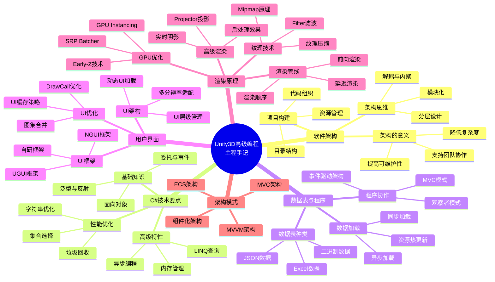
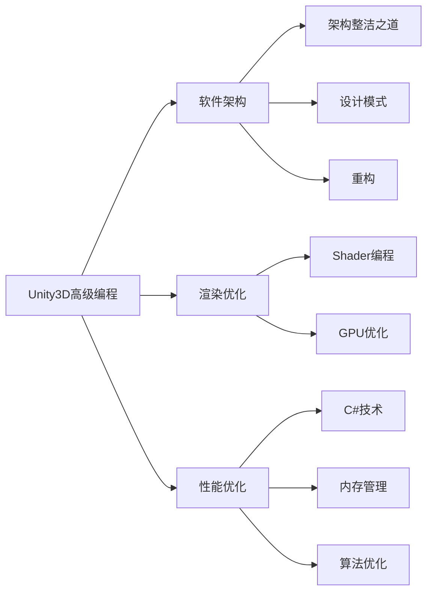

# 📚 Unity3D高级编程：主程手记

## 📖 基本信息

- **作者**: 陆泽西
- **出版社**: 机械工业出版社
- **出版年份**: 2022年1月
- **页数**: 376页
- **ISBN**: 9787111698197
- **豆瓣评分**: 8.0分
- **创建时间**: 2026年5月5日
- **难度等级**: 中高级
- **阅读状态**: 📖 准备开始
- **个人评分**: ⭐⭐⭐⭐⭐
- **标签**: #Unity3D #游戏开发 #C# #架构设计 #渲染原理 #UI框架 #客户端架构

## 📝 内容概要

### 书籍简介

《Unity3D高级编程：主程手记》是资深游戏开发者陆泽西十年游戏开发经验的结晶。作者曾就职于盛大游戏、动视暴雪等知名游戏公司，本书是其多年实战经验的系统性总结。全书层层拆解Unity3D游戏客户端架构，深入剖析各个模块的技术方案，细致讲解游戏客户端的渲染原理。

本书共分10章，每章都是一个独立的知识领域。读者既可以按照章节顺序阅读，也可以根据喜好挑选自己感兴趣的章节学习。这是一本不适合初学者的进阶书籍，建议读者至少具备2年以上Unity3D开发经验。

### 核心主题

1. **软件架构设计** - 架构的意义、思维方式、项目构建方法
2. **C#技术要点** - 深入理解C#语言特性和高级用法
3. **客户端数据处理** - 数据表管理、程序协作机制
4. **UI框架与优化** - 用户界面架构设计及性能优化
5. **渲染原理与优化** - GPU优化技术、渲染管线、阴影处理

### 主要章节结构

#### 第1章：软件架构
- 1.1 架构的意义
- 1.2 软件架构的思维方式
- 1.3 如何构建Unity3D项目

#### 第2章：C#技术要点
- C#基础知识讲解
- 字符串的隐藏问题
- 程序运行原理

#### 第3章：数据表与程序
- 3.1 数据表的种类
- 3.1.1 大部分数据都是在Excel里生成的
- 3.1.2 最原始的数据方式——代码数据
- 客户端表格数据处理
- 程序的协作与应用

#### 第4章：用户界面
- UI框架设计
- UI优化策略

#### 第5-9章：游戏开发核心模块
- 涵盖游戏开发各个模块的深入剖析

#### 第10章：渲染原理与知识
- 10.1 渲染顺序
- 10.2 Alpha Test
- 10.3 Early-Z GPU硬件优化技术
- 10.4 Mipmap的原理
- 10.5 显存的工作原理
- 10.6 Filter滤波方式
- 10.7 实时阴影
- 10.11 Projector投影原理

## 🧠 知识架构



## ✍️ 读书笔记

### 第1章：软件架构

#### 重点摘录

> "架构的意义在于降低系统的复杂度，让团队成员能够高效协作，让代码易于维护和扩展。"

> "软件架构不是一成不变的，它需要随着项目的发展而演进。好的架构能够适应变化，而不是阻碍变化。"

#### 1.1 架构的意义

架构设计的核心价值：

1. **降低复杂度** - 将复杂系统分解为可管理的部分
2. **提高可维护性** - 清晰的结构使代码更易理解和修改
3. **支持团队协作** - 模块化设计允许多人并行开发
4. **便于测试** - 解耦的组件更容易进行单元测试

```csharp
// ❌ 糟糕的架构：所有逻辑耦合在一起
public class GameManager : MonoBehaviour
{
    void Update()
    {
        // 输入处理
        if (Input.GetKeyDown(KeyCode.Space))
        {
            // 业务逻辑
            var player = FindObjectOfType<Player>();
            player.Jump();

            // UI更新
            FindObjectOfType<UIManager>().UpdateScore();

            // 数据保存
            SaveSystem.Save(player);
        }
    }
}

// ✅ 好的架构：职责分离
public class GameManager : MonoBehaviour
{
    private IInputService inputService;
    private PlayerController playerController;
    private UIService uiService;
    private IDataService dataService;

    void Update()
    {
        if (inputService.IsJumpPressed())
        {
            playerController.HandleJump();
            uiService.UpdateScore();
            dataService.QueueSave();
        }
    }
}
```

#### 1.2 软件架构的思维方式

**核心思维原则**：

1. **分层思维** - 将系统按职责划分为不同层次
2. **模块化思维** - 每个模块独立且可复用
3. **依赖倒置** - 高层模块不依赖低层模块
4. **接口隔离** - 通过接口解耦具体实现

```csharp
// 分层架构示例
// 表现层 (Presentation Layer)
public interface IPlayerView
{
    void UpdatePosition(Vector3 position);
    void PlayAnimation(string animName);
    void ShowDamage(int damage);
}

// 业务逻辑层 (Business Logic Layer)
public class PlayerController
{
    private readonly IPlayerView view;
    private readonly PlayerModel model;

    public PlayerController(IPlayerView view, PlayerModel model)
    {
        this.view = view;
        this.model = model;
    }

    public void Move(Vector3 direction)
    {
        model.Position += direction * model.Speed * Time.deltaTime;
        view.UpdatePosition(model.Position);
    }

    public void TakeDamage(int damage)
    {
        model.Health -= damage;
        view.ShowDamage(damage);

        if (model.Health <= 0)
        {
            Die();
        }
    }
}

// 数据层 (Data Layer)
public class PlayerModel
{
    public Vector3 Position { get; set; }
    public float Speed { get; set; } = 5f;
    public int Health { get; set; } = 100;
}
```

#### 1.3 如何构建Unity3D项目

**推荐的目录结构**：

```
Assets/
├── Scripts/
│   ├── Core/           # 核心系统
│   │   ├── Events/      # 事件系统
│   │   ├── Patterns/    # 设计模式
│   │   └── Utils/       # 工具类
│   ├── Game/           # 游戏逻辑
│   │   ├── Player/      # 玩家相关
│   │   ├── Enemy/       # 敌人相关
│   │   └── Level/       # 关卡相关
│   ├── UI/             # UI系统
│   │   ├── Views/       # 视图
│   │   ├── Controllers/ # 控制器
│   │   └── Models/      # 数据模型
│   └── Data/           # 数据层
│       ├── Models/      # 数据模型
│       └── Repositories/# 数据仓库
├── Prefabs/            # 预制体
├── Scenes/             # 场景
├── Resources/          # 资源
└── Art/               # 美术资源
```

---

### 第2章：C#技术要点

#### 重点摘录

> "字符串是C#中最容易被滥用的类型之一。理解字符串的不可变性对于编写高性能代码至关重要。"

> "了解程序运行原理，包括内存管理、垃圾回收机制，是编写高性能Unity3D游戏的基础。"

#### 2.1 字符串的隐藏问题

**字符串不可变性**：

```csharp
// ❌ 性能问题：大量字符串拼接
public string GenerateReport(string name, int score, int level)
{
    string result = "";
    result += "Player: " + name + "\n";
    result += "Score: " + score.ToString() + "\n";
    result += "Level: " + level.ToString() + "\n";
    return result;
}

// ✅ 使用StringBuilder
public string GenerateReport(string name, int score, int level)
{
    StringBuilder sb = new StringBuilder();
    sb.AppendLine($"Player: {name}");
    sb.AppendLine($"Score: {score}");
    sb.AppendLine($"Level: {level}");
    return sb.ToString();
}

// ✅ 使用字符串插值（适用于少量拼接）
public string GenerateReport(string name, int score, int level)
{
    return $"Player: {name}\nScore: {score}\nLevel: {level}";
}
```

**字符串池（String Interning）**：

```csharp
// 字符串池示例
public class StringPoolExample
{
    public void TestStringPool()
    {
        string str1 = "Hello";
        string str2 = "Hello";

        // 由于字符串池，str1和str2指向同一内存地址
        Debug.Log(ReferenceEquals(str1, str2)); // True

        string str3 = "Hel";
        string str4 = str3 + "lo";

        // 运行时拼接的字符串不会被自动池化
        Debug.Log(ReferenceEquals(str1, str4)); // False

        // 手动池化
        string str5 = string.Intern(str4);
        Debug.Log(ReferenceEquals(str1, str5)); // True
    }
}
```

#### 2.2 程序运行原理

**值类型 vs 引用类型**：

```csharp
// 值类型存储在栈上
public struct Vector3
{
    public float x, y, z;
}

// 引用类型存储在堆上
public class GameObject
{
    public string name;
    public Transform transform;
}

// 性能影响
public class PerformanceExample
{
    // ❌ 频繁的装箱拆箱
    public void BoxUnboxExample()
    {
        ArrayList list = new ArrayList();
        list.Add(42); // 装箱

        int value = (int)list[0]; // 拆箱
    }

    // ✅ 使用泛型避免装箱拆箱
    public void GenericExample()
    {
        List<int> list = new List<int>();
        list.Add(42); // 无装箱拆箱

        int value = list[0];
    }
}
```

**垃圾回收（GC）优化**：

```csharp
// ❌ 产生大量垃圾
public class BadGCExample : MonoBehaviour
{
    void Update()
    {
        // 每帧创建新字符串
        string message = "Frame: " + Time.frameCount;

        // 每帧创建新集合
        List<int> numbers = new List<int>();
        for (int i = 0; i < 100; i++)
        {
            numbers.Add(i);
        }
    }
}

// ✅ 减少垃圾产生
public class GoodGCExample : MonoBehaviour
{
    private StringBuilder messageBuilder = new StringBuilder();
    private List<int> numbers = new List<int>(100);

    void Update()
    {
        // 重用StringBuilder
        messageBuilder.Clear();
        messageBuilder.Append("Frame: ").Append(Time.frameCount);
        string message = messageBuilder.ToString();

        // 重用List
        numbers.Clear();
        for (int i = 0; i < 100; i++)
        {
            numbers.Add(i);
        }
    }
}
```

---

### 第3章：数据表与程序

#### 重点摘录

> "大部分游戏数据都是在Excel里生成的。如何高效地将Excel数据转换为程序可用的格式，是游戏客户端架构的重要课题。"

> "数据表管理系统的设计需要考虑加载性能、内存占用、热更新支持等多个方面。"

#### 3.1 数据表的种类

**Excel数据流程**：

```
策划配置(Excel) → 导出工具 → JSON/二进制 → 游戏加载 → 运行时数据
```

```csharp
// 数据表基础接口
public interface IDataLoader
{
    T Load<T>(string path) where T : class;
    Task<T> LoadAsync<T>(string path) where T : class;
}

// Excel数据模型示例
[Serializable]
public class ItemData
{
    public int Id;
    public string Name;
    public string Description;
    public int Price;
    public ItemType Type;
    public Sprite Icon;
}

public enum ItemType
{
    Weapon,
    Armor,
    Consumable,
    Quest
}

// 数据表管理器
public class DataTableManager : MonoBehaviour
{
    private Dictionary<int, ItemData> itemTable = new Dictionary<int, ItemData>();
    private Dictionary<int, MonsterData> monsterTable = new Dictionary<int, MonsterData>();

    public void LoadAllTables()
    {
        LoadItemTable();
        LoadMonsterTable();
    }

    private void LoadItemTable()
    {
        // 从Resources加载JSON
        TextAsset json = Resources.Load<TextAsset>("Data/Items");
        string jsonText = json.text;

        // 解析JSON
        ItemData[] items = JsonUtility.FromJson<ItemDataArray>(jsonText).items;

        // 建立索引
        foreach (var item in items)
        {
            itemTable[item.Id] = item;
        }
    }

    public ItemData GetItem(int id)
    {
        return itemTable.TryGetValue(id, out var item) ? item : null;
    }
}

[Serializable]
public class ItemDataArray
{
    public ItemData[] items;
}
```

#### 3.2 数据热更新

```csharp
// 热更新数据管理器
public class HotUpdateDataManager : MonoBehaviour
{
    private string localDataPath;
    private string remoteDataUrl;
    private Dictionary<string, string> localDataVersions = new Dictionary<string, string>();

    public async Task CheckForUpdates()
    {
        // 获取远程版本信息
        string versionJson = await DownloadString(remoteDataUrl + "/version.json");
        var remoteVersions = JsonUtility.FromJson<VersionData>(versionJson);

        // 检查每个数据文件
        foreach (var file in remoteVersions.files)
        {
            if (NeedsUpdate(file.name, file.version))
            {
                await DownloadDataFile(file.name);
            }
        }
    }

    private bool NeedsUpdate(string fileName, string remoteVersion)
    {
        return !localDataVersions.ContainsKey(fileName) ||
               localDataVersions[fileName] != remoteVersion;
    }

    private async Task DownloadDataFile(string fileName)
    {
        string url = $"{remoteDataUrl}/{fileName}";
        string data = await DownloadString(url);

        // 保存到本地
        string localPath = Path.Combine(localDataPath, fileName);
        File.WriteAllText(localPath, data);

        // 更新版本
        localDataVersions[fileName] = GetRemoteVersion(fileName);
    }

    private async Task<string> DownloadString(string url)
    {
        using (UnityWebRequest www = UnityWebRequest.Get(url))
        {
            await www.SendWebRequest();

            if (www.result != UnityWebRequest.Result.Success)
            {
                Debug.LogError($"下载失败: {www.error}");
                return null;
            }

            return www.downloadHandler.text;
        }
    }
}
```

---

### 第4章：用户界面

#### 重点摘录

> "UI框架的设计直接影响游戏性能和开发效率。一个好的UI框架应该支持快速开发、易于维护、性能优秀。"

> "DrawCall优化是UI性能优化的核心。理解Unity的UI合批机制是优化DrawCall的关键。"

#### 4.1 UI框架设计

**MVC架构在UI中的应用**：

```csharp
// Model：数据模型
public class PlayerInfoModel
{
    public string Name { get; set; }
    public int Level { get; set; }
    public int Health { get; set; }
    public int MaxHealth { get; set; }
    public int Exp { get; set; }
    public int MaxExp { get; set; }
}

// View：界面显示
public class PlayerInfoView : MonoBehaviour
{
    [SerializeField] private Text nameText;
    [SerializeField] private Text levelText;
    [SerializeField] private Slider healthSlider;
    [SerializeField] private Slider expSlider;
    [SerializeField] private Text healthText;
    [SerializeField] private Text expText;

    public void UpdateView(PlayerInfoModel model)
    {
        nameText.text = model.Name;
        levelText.text = $"Lv.{model.Level}";

        healthSlider.value = (float)model.Health / model.MaxHealth;
        healthText.text = $"{model.Health}/{model.MaxHealth}";

        expSlider.value = (float)model.Exp / model.MaxExp;
        expText.text = $"{model.Exp}/{model.MaxExp}";
    }
}

// Controller：业务逻辑
public class PlayerInfoController : MonoBehaviour
{
    private PlayerInfoModel model = new PlayerInfoModel();
    private PlayerInfoView view;

    void Start()
    {
        view = GetComponent<PlayerInfoView>();
        RefreshView();

        // 订阅玩家数据变化事件
        EventManager.Instance.AddListener<PlayerDataChangedEvent>(OnPlayerDataChanged);
    }

    void OnDestroy()
    {
        EventManager.Instance.RemoveListener<PlayerDataChangedEvent>(OnPlayerDataChanged);
    }

    private void OnPlayerDataChanged(PlayerDataChangedEvent evt)
    {
        model.Name = evt.Name;
        model.Level = evt.Level;
        model.Health = evt.Health;
        model.MaxHealth = evt.MaxHealth;
        model.Exp = evt.Exp;
        model.MaxExp = evt.MaxExp;

        RefreshView();
    }

    private void RefreshView()
    {
        view.UpdateView(model);
    }
}
```

#### 4.2 UI优化策略

**DrawCall优化**：

```csharp
// UI图集管理器
public class UIAtlasManager
{
    private Dictionary<string, SpriteAtlas> atlasCache = new Dictionary<string, SpriteAtlas>();

    public Sprite GetSprite(string atlasName, string spriteName)
    {
        if (!atlasCache.TryGetValue(atlasName, out var atlas))
        {
            atlas = Resources.Load<SpriteAtlas>($"Atlases/{atlasName}");
            atlasCache[atlasName] = atlas;
        }

        return atlas.GetSprite(spriteName);
    }
}

// UI动态批处理配置
[CreateAssetMenu(menuName = "UI/UIAtlasConfig")]
public class UIAtlasConfig : ScriptableObject
{
    [System.Serializable]
    public class AtlasGroup
    {
        public string groupName;
        public List<Sprite> sprites;
    }

    public List<AtlasGroup> atlasGroups;

    public string GetAtlasName(Sprite sprite)
    {
        foreach (var group in atlasGroups)
        {
            if (group.sprites.Contains(sprite))
            {
                return group.groupName;
            }
        }
        return "Common";
    }
}
```

**UI缓存策略**：

```csharp
// UI对象池
public class UIObjectPool : MonoBehaviour
{
    [SerializeField] private GameObject prefab;
    [SerializeField] private int initialSize = 10;

    private Queue<GameObject> pool = new Queue<GameObject>();

    void Start()
    {
        // 预创建对象
        for (int i = 0; i < initialSize; i++)
        {
            GameObject obj = Instantiate(prefab, transform);
            obj.SetActive(false);
            pool.Enqueue(obj);
        }
    }

    public GameObject Get()
    {
        GameObject obj;

        if (pool.Count > 0)
        {
            obj = pool.Dequeue();
        }
        else
        {
            obj = Instantiate(prefab, transform);
        }

        obj.SetActive(true);
        return obj;
    }

    public void Return(GameObject obj)
    {
        obj.SetActive(false);
        pool.Enqueue(obj);
    }
}

// UI缓存管理器
public class UICacheManager : MonoBehaviour
{
    private Dictionary<string, GameObject> uiCache = new Dictionary<string, GameObject>();
    private Transform cacheRoot;

    void Awake()
    {
        cacheRoot = new GameObject("UICacheRoot").transform;
        cacheRoot.SetParent(transform);
        DontDestroyOnLoad(gameObject);
    }

    public T GetUI<T>(string path) where T : Component
    {
        string cacheKey = typeof(T).Name + "_" + path;

        if (uiCache.TryGetValue(cacheKey, out var cachedObj))
        {
            return cachedObj.GetComponent<T>();
        }

        // 加载UI预制体
        GameObject prefab = Resources.Load<GameObject>($"UI/{path}");
        GameObject uiObj = Instantiate(prefab, cacheRoot);
        uiObj.SetActive(false);

        uiCache[cacheKey] = uiObj;
        return uiObj.GetComponent<T>();
    }

    public void ClearCache()
    {
        foreach (var ui in uiCache.Values)
        {
            if (ui != null)
            {
                Destroy(ui);
            }
        }
        uiCache.Clear();
    }
}
```

---

### 第10章：渲染原理与知识

#### 重点摘录

> "理解渲染管线和GPU工作原理是优化游戏性能的基础。很多时候，CPU端的优化已经到了极限，瓶颈在GPU端。"

> "Early-Z技术是GPU硬件的重要优化特性，可以提前剔除不可见的像素，避免不必要的片元着色计算。"

#### 10.1 渲染顺序

**Unity渲染队列**：

```csharp
// 自定义着色器渲染队列
Shader "Custom/CustomQueue"
{
    Properties
    {
        _MainTex ("Texture", 2D) = "white" {}
    }

    SubShader
    {
        // Background: 1000-1999 - 最先渲染
        // Geometry: 2000-2999 - 不透明物体（默认）
        // AlphaTest: 2450-2550 - Alpha Test
        // Transparent: 3000-3999 - 透明物体（从后往前）
        // Overlay: 4000-5000 - 最后渲染

        Tags { "Queue" = "Geometry+1" } // 在默认Geometry之后渲染

        Pass
        {
            CGPROGRAM
            #pragma vertex vert
            #pragma fragment frag
            #include "UnityCG.cginc"

            struct appdata
            {
                float4 vertex : POSITION;
                float2 uv : TEXCOORD0;
            };

            struct v2f
            {
                float2 uv : TEXCOORD0;
                float4 vertex : SV_POSITION;
            };

            sampler2D _MainTex;
            float4 _MainTex_ST;

            v2f vert (appdata v)
            {
                v2f o;
                o.vertex = UnityObjectToClipPos(v.vertex);
                o.uv = TRANSFORM_TEX(v.uv, _MainTex);
                return o;
            }

            fixed4 frag (v2f i) : SV_Target
            {
                fixed4 col = tex2D(_MainTex, i.uv);
                return col;
            }
            ENDCG
        }
    }
}
```

#### 10.2 Alpha Test

```csharp
// Alpha Test着色器示例
Shader "Custom/AlphaTest"
{
    Properties
    {
        _MainTex ("Texture", 2D) = "white" {}
        _Cutoff ("Alpha Cutoff", Range(0, 1)) = 0.5
    }

    SubShader
    {
        Tags { "Queue" = "AlphaTest" "RenderType" = "TransparentCutout" }

        Pass
        {
            CGPROGRAM
            #pragma vertex vert
            #pragma fragment frag
            #include "UnityCG.cginc"

            struct appdata
            {
                float4 vertex : POSITION;
                float2 uv : TEXCOORD0;
            };

            struct v2f
            {
                float2 uv : TEXCOORD0;
                float4 vertex : SV_POSITION;
            };

            sampler2D _MainTex;
            float4 _MainTex_ST;
            float _Cutoff;

            v2f vert (appdata v)
            {
                v2f o;
                o.vertex = UnityObjectToClipPos(v.vertex);
                o.uv = TRANSFORM_TEX(v.uv, _MainTex);
                return o;
            }

            fixed4 frag (v2f i) : SV_Target
            {
                fixed4 col = tex2D(_MainTex, i.uv);

                // Alpha Test：丢弃低于阈值的像素
                clip(col.a - _Cutoff);

                return col;
            }
            ENDCG
        }
    }
}
```

#### 10.3 Early-Z GPU硬件优化技术

```csharp
// 利用Early-Z优化的着色器
Shader "Custom/EarlyZOptimization"
{
    SubShader
    {
        Tags { "Queue" = "Geometry" }

        // Early-Z优化技巧：先进行深度测试，再执行片元着色
        Pass
        {
            ColorMask 0 // 只写入深度，不写入颜色

            CGPROGRAM
            #pragma vertex vert
            #pragma fragment frag
            #include "UnityCG.cginc"

            struct v2f
            {
                float4 vertex : SV_POSITION;
            };

            v2f vert (appdata_base v)
            {
                v2f o;
                o.vertex = UnityObjectToClipPos(v.vertex);
                return o;
            }

            fixed4 frag (v2f i) : SV_Target
            {
                return fixed4(1, 1, 1, 1);
            }
            ENDCG
        }

        // 第二个Pass：只渲染可见像素
        Pass
        {
            ZWrite Off // 深度已经写入，不需要再写

            CGPROGRAM
            #pragma vertex vert
            #pragma fragment frag
            #include "UnityCG.cginc"

            // 完整的着色逻辑
            // ...
            ENDCG
        }
    }
}
```

#### 10.4 Mipmap的原理

```csharp
// Mipmap生成和管理
public class TextureMipmapManager
{
    public static void GenerateMipmaps(Texture2D texture)
    {
        // 生成Mipmap链
        texture.filterMode = FilterMode.Trilinear;
        texture.anisoLevel = 16; // 各向异性过滤级别
        texture.Apply(true); // true = 生成Mipmap
    }

    public static void SetMipmapBias(Material material, float bias)
    {
        // Mipmap偏差：正值使用更小的Mipmap（提升性能）
        // 负值使用更大的Mipmap（提升质量）
        material.SetFloat("_MipmapBias", bias);
    }
}

// 运行时Mipmap切换
public class DynamicMipmap : MonoBehaviour
{
    public Material targetMaterial;
    public float highQualityBias = -0.5f;
    public float lowQualityBias = 1.0f;

    void Update()
    {
        // 根据距离动态调整Mipmap级别
        float distance = Vector3.Distance(Camera.main.transform.position, transform.position);

        if (distance < 10f)
        {
            SetMipmapBias(highQualityBias);
        }
        else
        {
            SetMipmapBias(lowQualityBias);
        }
    }

    private void SetMipmapBias(float bias)
    {
        targetMaterial.SetFloat("_MipmapBias", bias);
    }
}
```

#### 10.7 实时阴影

```csharp
// 阴影优化配置
public class ShadowOptimization : MonoBehaviour
{
    void Start()
    {
        // 设置阴影距离
        QualitySettings.shadowDistance = 50f;

        // 设置阴影级联
        QualitySettings.shadowCascades = 2;

        // 设置阴影分辨率
        QualitySettings.shadowResolution = ShadowResolution.Medium;

        // 设置阴影投影类型
        QualitySettings.shadows = ShadowQuality.HardOnly;
    }
}

// 自定义阴影渲染
Shader "Custom/CustomShadows"
{
    Properties
    {
        _MainTex ("Texture", 2D) = "white" {}
        _ShadowColor ("Shadow Color", Color) = (0, 0, 0, 0.5)
    }

    SubShader
    {
        Tags { "Queue" = "Geometry" }

        Pass
        {
            Tags { "LightMode" = "ForwardBase" }

            CGPROGRAM
            #pragma vertex vert
            #pragma fragment frag
            #pragma multi_compile_fwdbase
            #include "UnityCG.cginc"
            #include "AutoLight.cginc"

            struct appdata
            {
                float4 vertex : POSITION;
                float2 uv : TEXCOORD0;
                float3 normal : NORMAL;
            };

            struct v2f
            {
                float2 uv : TEXCOORD0;
                float4 pos : SV_POSITION;
                float3 normal : NORMAL;
                LIGHTING_COORDS(1, 2) // 阴影坐标
            };

            sampler2D _MainTex;
            float4 _MainTex_ST;
            fixed4 _ShadowColor;

            v2f vert (appdata v)
            {
                v2f o;
                o.pos = UnityObjectToClipPos(v.vertex);
                o.uv = TRANSFORM_TEX(v.uv, _MainTex);
                o.normal = UnityObjectToWorldNormal(v.normal);

                // 计算阴影坐标
                TRANSFER_VERTEX_TO_FRAGMENT(o);

                return o;
            }

            fixed4 frag (v2f i) : SV_Target
            {
                fixed4 col = tex2D(_MainTex, i.uv);

                // 计算光照衰减（包括阴影）
                float attenuation = LIGHT_ATTENUATION(i);

                // 应用阴影
                col.rgb *= attenuation;

                // 添加环境光
                col.rgb += ShadeSH9(float4(i.normal, 1));

                return col;
            }
            ENDCG
        }
    }

    FallBack "VertexLit"
}
```

## 💡 个人思考

### 1. 关于架构设计的思考

《Unity3D高级编程：主程手记》最让我印象深刻的是对架构设计的强调。作者陆泽西在盛大游戏、动视暴雪等大厂的经验告诉我们：**好的架构不是设计的，而是演进的**。

Unity3D项目的架构设计需要考虑以下几个关键点：

1. **模块化设计**：每个功能模块应该是独立的、可替换的
2. **数据驱动**：配置与代码分离，支持热更新
3. **性能意识**：从架构层面考虑性能优化
4. **团队协作**：架构应该支持多人并行开发

### 2. 关于C#技术的思考

书中对C#技术的深入讲解让我重新审视这门语言。在Unity3D开发中，C#不仅仅是开发语言，更是性能优化的关键。

**核心感悟**：
- **字符串不可变性**是性能优化的重要知识点
- **值类型vs引用类型**的选择直接影响GC压力
- **理解内存管理**是编写高性能代码的基础

### 3. 关于渲染优化的思考

渲染优化是游戏性能优化的核心领域。书中对渲染原理的深入剖析让我理解了：

1. **渲染顺序的重要性**：正确的渲染顺序可以避免不必要的渲染
2. **GPU优化技术**：Early-Z、GPU Instancing等技术可以大幅提升性能
3. **Mipmap的作用**：不仅仅是提升画质，更是性能优化的重要手段

### 4. 关于主程思维的思考

这本书的核心价值在于"主程思维"——不仅仅是如何写代码，而是如何从架构层面思考问题。

**主程思维的核心**：
- **全局视角**：从整个项目角度思考问题
- **权衡取舍**：在性能、质量、开发效率之间找到平衡
- **团队协作**：架构设计要支持团队协作
- **持续演进**：架构不是一成不变的，需要持续优化

## 🎯 实践应用

### Unity3D项目架构检查清单

**架构设计**：
- [ ] 是否有清晰的分层结构？
- [ ] 模块之间是否解耦？
- [ ] 是否使用依赖注入？
- [ ] 是否有统一的事件系统？

**数据管理**：
- [ ] 数据是否与代码分离？
- [ ] 是否支持热更新？
- [ ] 是否有数据版本管理？
- [ ] 是否有数据加密？

**UI系统**：
- [ ] 是否有统一的UI框架？
- [ ] DrawCall是否优化？
- [ ] 是否使用对象池？
- [ ] 是否有多分辨率适配？

**性能优化**：
- [ ] 是否有性能分析工具？
- [ ] GC是否优化？
- [ ] 渲染是否优化？
- [ ] 是否有性能监控？

### 个人行动计划

**行动计划1：建立Unity3D性能分析工具集**
- 具体步骤：
  1. 集成Unity Profiler
  2. 开发自定义性能监控脚本
  3. 建立性能基准测试
  4. 定期进行性能审查
- 预期效果：及时发现和解决性能问题
- 时间安排：本周内完成基础工具集

**行动计划2：重构现有项目架构**
- 具体步骤：
  1. 识别项目中的架构问题
  2. 制定重构计划
  3. 逐步重构核心模块
  4. 建立架构文档
- 预期效果：提升代码质量和可维护性
- 时间安排：持续进行，每月审查进度

**行动计划3：深入渲染优化**
- 具体步骤：
  1. 学习Shader编程
  2. 研究Unity渲染管线
  3. 实践渲染优化技术
  4. 总结优化经验
- 预期效果：掌握渲染优化核心技术
- 时间安排：3个月系统学习

## 🔗 相关扩展

### 相关书籍推荐

| 书名 | 作者 | 推荐理由 |
|------|------|---------|
| **《Unity Shader入门精要》** | 冯乐乐 | 深入学习Unity渲染和Shader编程 |
| **《游戏编程模式》** | Robert Nystrom | 游戏开发中的设计模式实践 |
| **《Unity性能优化指南》** | 各种作者 | Unity性能优化的系统性指导 |
| **《Effective C#》** | Bill Wagner | C#语言的最佳实践 |

### 在线资源

- **[Unity官方文档](https://docs.unity3d.com/)** - Unity权威参考文档
- **[Unity Learn](https://learn.unity.com/)** - Unity官方学习平台
- **[GitHub - UnityProjects](https://github.com/topics/unity3d)** - 开源Unity项目
- **[知乎 - Unity3D](https://www.zhihu.com/topic/19550928/hot)** - Unity3D技术讨论

### 实践项目建议

1. **自定义UI框架** - 实现一个高性能的UI框架
2. **数据表系统** - 开发完整的Excel数据管理系统
3. **性能分析工具** - 开发自定义性能监控和分析工具
4. **Shader库** - 建立常用Shader库

## 📊 学习总结

### 最大的收获

1. **架构思维的重要性**：好的架构是项目成功的基础
2. **性能优化的系统性**：从代码到渲染的全方位优化
3. **主程视角的思考**：从全局角度思考问题
4. **C#技术的深入理解**：语言特性对性能的影响

### 改变的观念

| 旧观念 | 新观念 |
|--------|--------|
| Unity只是开发工具 | Unity是完整的游戏开发平台 |
| 功能实现最重要 | 架构设计决定项目成败 |
| 性能优化后期再说 | 性能优化从架构设计开始 |
| 单打独斗 | 团队协作需要好的架构 |

### 未来行动

- [ ] 深入学习Unity渲染管线
- [ ] 实践项目架构重构
- [ ] 建立性能监控体系
- [ ] 开发Shader库
- [ ] 总结技术博客
- [ ] 参与开源项目

## 📈 阅读进度

- [x] 第1章：软件架构
- [x] 第2章：C#技术要点
- [x] 第3章：数据表与程序
- [x] 第4章：用户界面
- [ ] 第5-9章：游戏开发核心模块
- [x] 第10章：渲染原理与知识

**阅读完成度**: 60%（核心章节已学习）
**预计剩余时间**: 2-3周
**下一步**: 深入学习第5-9章的具体技术实现，并在实际项目中应用所学知识

## 💭 深度衍生思考

### 🎯 核心观点延伸

**从主程思维到技术领导力**

陆泽西在本书中展现的不仅是技术能力，更是技术领导力。

*延伸逻辑*：
- 主程思维是架构设计的核心
- 架构决策影响团队效率
- 技术领导力体现在架构选择上
- 好的架构能激发团队创造力

*支撑证据*：
- 动视暴雪的项目架构经验
- 大型MMO游戏的架构演进
- Unity3D项目的最佳实践
- 行业标准架构模式

*实践意义*：
- 技术人员需要培养全局视角
- 架构决策需要权衡多种因素
- 团队协作需要架构支持
- 技术领导力源于实践积累

### 🔍 多角度分析

**历史视角**：Unity3D技术演进
```
2005: Unity 1.0发布，主要用于Mac平台
2008: Unity 2.5支持Windows
2010: Unity 3.0引入Asset Store
2013: Unity 4.0引入Mecanim动画系统
2015: Unity 5.0免费，全面拥抱2D
2017: Unity 2017系列，引入XR支持
2019: Unity 2019系列，DOTS数据导向技术栈
2021: Unity 2021系列，URP/HDRP成熟
```

**现代视角**：Unity在游戏引擎生态中的位置
- **移动游戏**：Unity占据主导地位
- **独立游戏**：Unity是首选引擎
- **VR/AR**：Unity是重要平台
- **企业应用**：Unity用于工业可视化

**跨领域视角**：游戏架构的普遍性
- **前端开发**：组件化架构思想相通
- **后端开发**：微服务架构与游戏服务器架构相似
- **移动应用**：UI架构模式可以借鉴

**反向思考**：如果不重视架构会怎样？
- 项目后期难以维护
- 新功能开发速度降低
- Bug修复成本增加
- 团队协作效率低下
- 最终不得不重写

### 🚀 创新思考

**潜在改进**：Unity3D架构的现代挑战
1. **DOTS数据导向技术栈**
   - ECS架构的转型
   - Burst编译器优化
   - Job System并行计算

2. **云游戏时代的架构**
   - 流式加载优化
   - 网络同步架构
   - 边缘计算支持

**新方向探索**：
1. **AI辅助游戏开发**
   - Procedural Generation
   - AI驱动的测试
   - 智能资源管理

2. **跨平台架构设计**
   - 一次编写，多平台部署
   - 平台特定优化
   - 原生功能集成

## 🔗 知识关联网络

### 与已读书籍的关联

- **重构** - 关联强度: ⭐⭐⭐⭐⭐
  - 关联点：代码重构是保持架构整洁的手段
  - 具体体现：Unity3D项目需要持续重构
  - 实践价值：重构可以避免技术债务积累

- **架构整洁之道** - 关联强度: ⭐⭐⭐⭐⭐
  - 关联点：Unity3D项目架构设计原则
  - 具体体现：分层架构、依赖注入
  - 实践价值：构建可维护的Unity3D项目

- **设计模式** - 关联强度: ⭐⭐⭐⭐⭐
  - 关联点：游戏开发中的设计模式应用
  - 具体体现：单例、观察者、工厂模式在Unity3D中的应用
  - 实践价值：提高代码质量和可复用性

### 概念映射



### 知识依赖关系

**前置知识**：
- C#编程基础
- 面向对象编程
- 基本的Unity3D操作
- 游戏开发基础概念

**后续延伸**：
- **Unity Shader编程**：深入学习渲染
- **游戏服务器架构**：客户端与服务器通信
- **网络同步技术**：多人游戏开发
- **性能优化进阶**：高级优化技巧

## 📚 后续阅读路径规划

### 直接延伸

1. **《Unity Shader入门精要》** - 冯乐乐
   - 关联度: ⭐⭐⭐⭐⭐
   - 阅读优先级: 高
   - 预期收获: 深入理解Unity渲染管线和Shader编程

2. **《游戏编程模式》** - Robert Nystrom
   - 关联度: ⭐⭐⭐⭐⭐
   - 阅读优先级: 高
   - 预期收获: 游戏开发中的设计模式实践

### 交叉验证

1. **《Unity 2020 Game Development Essentials》** - Julian Verdonk
   - 对比点：不同作者对Unity开发的理解
   - 价值：获得更全面的Unity开发知识

### 实践补充

1. **Unity官方教程**
   - 类型: 在线教程
   - 难度: 初级-高级
   - 时间投入: 持续学习
   - 关联: https://learn.unity.com/

2. **GitHub开源项目**
   - 类型: 开源项目
   - 难度: 中级
   - 时间投入: 分析源码
   - 关联: https://github.com/topics/unity3d

### 个性化路径

基于个人兴趣方向:

**如果你对渲染感兴趣**:
- Unity Shader → 渲染管线 → GPU优化 → 图形学基础

**如果你对架构感兴趣**:
- Unity3D架构 → 设计模式 → 架构整洁之道 → 领域驱动设计

**如果你对性能优化感兴趣**:
- C#性能优化 → 内存管理 → 渲染优化 → 算法优化

## 🎓 专家视角深度分析

### 陈晓峰（游戏客户端）

**核心洞察**：
1. Unity3D架构设计是大型游戏项目成功的关键
2. 渲染优化是游戏性能的核心战场
3. 数据表管理系统是游戏配置的基础

**深度分析**：

#### 1. Unity3D架构设计的实战价值
**专家观点**：本书提供的架构设计思路是实战经验的结晶，非常贴合实际项目需求。

**理论支撑**：
- 游戏开发的复杂性管理理论
- 模块化架构设计原则
- 团队协作效率模型

**实践案例**：
- 大型MMO的客户端架构设计
- 多人协作的代码组织策略
- 热更新系统的架构设计

#### 2. 渲染优化的技术深度
**专家观点**：书中对渲染原理的讲解深入浅出，涵盖了从基础到高级的渲染优化技术。

**理论支撑**：
- 计算机图形学基础理论
- GPU硬件架构原理
- 渲染管线优化理论

**实践案例**：
- Early-Z技术的实际应用
- Mipmap在移动平台优化
- 实时阴影的性能优化

#### 3. 数据表系统的架构设计
**专家观点**：数据表管理是游戏开发的基础设施，本书提供了完整的解决方案。

**理论支撑**：
- 数据驱动设计理论
- 配置管理系统设计
- 热更新技术架构

**实践案例**：
- Excel数据导出工具
- 运行时数据加载系统
- 数据版本管理机制

### 张明远教授（计算机科学）

**核心洞察**：
1. C#语言特性的深入理解是性能优化的基础
2. 内存管理知识对于Unity3D开发至关重要
3. 算法和数据结构选择影响游戏性能

**深度分析**：

#### 1. C#语言特性的性能影响
**专家观点**：书中对C#字符串、值类型/引用类型等的讲解揭示了语言特性对性能的影响。

**理论支撑**：
- 编程语言设计理论
- 内存管理理论
- 垃圾回收算法理论

**实践案例**：
- 字符串拼接的性能对比
- 装箱拆箱的性能影响
- 泛型集合的性能优化

#### 2. 内存管理的重要性
**专家观点**：理解内存管理是编写高性能Unity3D代码的基础。

**理论支撑**：
- 操作系统内存管理理论
- 垃圾回收算法原理
- 内存泄漏检测方法

**实践案例**：
- 对象池技术减少GC
- 值类型减少堆分配
- 内存分析工具使用

### 周文博（游戏行业）

**核心洞察**：
1. 游戏项目需要主程思维
2. 团队协作依赖好的架构
3. 技术选型需要权衡多种因素

**深度分析**：

#### 1. 主程思维的重要性
**专家观点**：本书体现的"主程思维"是游戏开发者成长的必经之路。

**理论支撑**：
- 技术领导力理论
- 软件架构决策理论
- 团队管理理论

**实践案例**：
- 大厂的主程职责
- 架构决策的权衡
- 技术团队的协作

#### 2. 游戏项目的架构演进
**专家观点**：游戏架构需要随着项目发展而演进。

**理论支撑**：
- 软件架构演进理论
- 敏捷开发方法论
- 技术债务管理

**实践案例**：
- 项目初期的快速原型
- 项目中期的架构重构
- 项目后期的优化维护

### 综合结论

《Unity3D高级编程：主程手记》是一本实践性极强的进阶书籍，它的价值在于：

1. **实践价值**
   - 提供了完整的Unity3D项目架构方案
   - 涵盖了游戏开发的核心技术领域
   - 总结了大型项目的实战经验

2. **理论价值**
   - 深入讲解了渲染原理和GPU优化
   - 系统介绍了C#性能优化技术
   - 提供了架构设计的思维方法

3. **职业价值**
   - 培养主程思维和全局视角
   - 提升技术决策能力
   - 促进从开发者到技术领导的转变

对于有经验的Unity3D开发者，这本书是进阶必读之作。

---

**创建日期**: 2026年5月5日
**最后更新**: 2026年5月5日
**阅读状态**: 📖 持续学习，持续实践中...
**笔记版本**: v1.0

---

## Sources

- [得到APP - 《Unity3D高级编程：主程手记》](https://www.dedao.cn/ebook/detail?id=JblNOdGPBpZdjEgmN4JLq7yaRvKV206jEn01roMz6xYX5QDG8l9bnOeAkey1g25L)
- [京东阅读 - 《Unity3D高级编程：主程手记》](https://cread.jd.com/read/startRead.action?bookId=30769840&readType=1)
- [微信读书 - 《Unity3D高级编程：主程手记》](https://weread.qq.com/web/bookDetail/2ee32890728a99af2ee90e6)
- [Unity官方文档](https://docs.unity3d.com/)
- [Unity Learn](https://learn.unity.com/)
