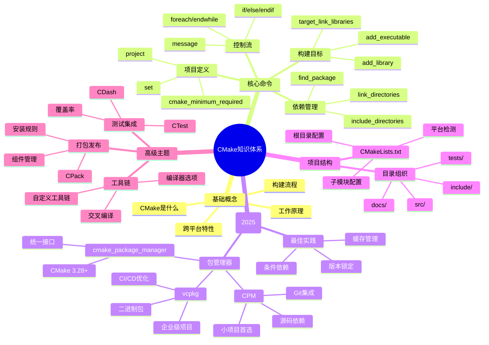

# 📚 CMake入门读书笔记

## 📖 基本信息

- **书名**: CMake入门与现代实践指南
- **整理者**: Perry
- **创建时间**: 2025-12-17
- **难度等级**: 初级到中级
- **阅读状态**: 📖 进行中
- **个人评分**: ⭐⭐⭐⭐⭐

## 📝 内容概要

### 书籍简介
CMake是一个开源的、跨平台的自动化构建系统，它能够管理软件构建过程，并生成标准的构建文件（如Makefile、Visual Studio项目等）。本书涵盖了从基础概念到2025年最新的现代CMake实践。

### 核心主题
1. **CMake基础概念** - 理解CMake的工作原理和基本架构
2. **核心命令详解** - 掌握最常用的CMake命令
3. **现代依赖管理** - 学习CPM和vcpkg的使用
4. **跨平台构建** - 理解不同平台的构建策略
5. **最佳实践** - 2025年推荐的现代CMake写法

### 主要章节
- 第1章：CMake概述与环境搭建
- 第2章：基本语法与核心命令
- 第3章：项目结构与模块化
- 第4章：现代依赖管理（CPM vs vcpkg）
- 第5章：跨平台构建策略
- 第6章：CI/CD集成实践
- 第7章：高级主题与性能优化

## 🧠 知识架构



## ✍️ 读书笔记

### 第1章：CMake概述

**重点摘录：**
> CMake是一个跨平台的自动化构建系统，它不直接构建软件，而是生成构建文件（如Makefile、Visual Studio项目文件等），然后使用相应的工具进行构建。

**个人思考：**
CMake的核心价值在于**抽象化**。它将不同平台的构建差异抽象为统一的配置语言，让开发者能够专注于代码而不是构建细节。这种设计思想值得学习。

### 第2章：基本语法与核心命令

**关键命令解析：**

#### 项目定义命令
```cmake
# 设置CMake最低版本要求
cmake_minimum_required(VERSION 3.28)

# 定义项目名称和基本信息
project(MyProject VERSION 1.0.0 LANGUAGES CXX)

# 设置变量
set(CMAKE_CXX_STANDARD 17)
set(CMAKE_CXX_STANDARD_REQUIRED ON)
```

#### 构建目标命令
```cmake
# 创建可执行文件
add_executable(myapp main.cpp helper.cpp)

# 创建静态库
add_library(mylib STATIC foo.cpp bar.cpp)

# 创建动态库
add_library(mylib_shared SHARED foo.cpp bar.cpp)

# 链接库
target_link_libraries(myapp mylib)
```

#### 现代写法（推荐）：
```cmake
# 使用现代target-based命令
target_include_directories(myapp PRIVATE ${PROJECT_SOURCE_DIR}/include)
target_compile_features(myapp PRIVATE cxx_std_17)
target_compile_options(myapp PRIVATE -Wall -Wextra)
```

### 第3章：现代依赖管理（2025年更新）

**重要发现：**
CMake 3.28+ 引入了 `cmake_package_manager()` 命令，提供了统一的包管理接口。

#### CPM vs vcpkg 选择矩阵

| 项目类型 | 推荐工具 | 理由 |
|---------|---------|------|
| 小/中型项目 (<20依赖) | CPM | 更快、更简单、源码访问 |
| 大型企业项目 (50+依赖) | vcpkg | 二进制包、CI/CD更快 |
| 跨平台库 | vcpkg | 各平台行为一致 |
| 开发为主的项目 | CPM | 版本控制集成更好 |

#### 现代依赖管理示例：
```cmake
cmake_minimum_required(VERSION 3.28)
project(MyProject VERSION 1.0.0 LANGUAGES CXX)

# 启用统一包管理器支持
include(GNUInstallDirs)
cmake_package_manager(PACKAGE_MANAGER CPM)
cmake_package_manager(PACKAGE_MANAGER vcpkg)

# 条件包管理
if(DEFINED ENV{CI})
    cmake_package_manager(PACKAGE_MANAGER vcpkg)  # CI环境用二进制包
else()
    cmake_package_manager(PACKAGE_MANAGER CPM)    # 开发环境用源码
endif()

# 使用统一接口添加依赖
cpm_add_package(NAME fmt VERSION 10.0.0)
cpm_add_package(NAME spdlog VERSION 1.12.0)
cpm_add_package(NAME nlohmann_json VERSION 3.11.0)
```

### 第4章：重要变量说明

**常用变量分类：**

#### 目录相关变量
- `CMAKE_CURRENT_SOURCE_DIR`: 当前CMakeLists.txt所在目录
- `CMAKE_CURRENT_BINARY_DIR`: 当前构建输出目录
- `PROJECT_SOURCE_DIR`: 项目源码根目录
- `CMAKE_MODULE_PATH`: 自定义CMake模块路径

#### 输出相关变量
- `EXECUTABLE_OUTPUT_PATH`: 可执行文件输出路径
- `LIBRARY_OUTPUT_PATH`: 库文件输出路径
- `CMAKE_RUNTIME_OUTPUT_DIRECTORY`: 运行时文件输出目录

### 第5章：最佳实践总结

**2025年现代CMake最佳实践：**

1. **版本要求**
   ```cmake
   cmake_minimum_required(VERSION 3.28)
   ```

2. **现代项目设置**
   ```cmake
   project(MyProject VERSION 1.0.0
           DESCRIPTION "My awesome project"
           LANGUAGES CXX)
   ```

3. **使用target-based命令**
   ```cmake
   # ❌ 旧式写法
   include_directories(include)
   link_directories(lib)

   # ✅ 现代写法
   target_include_directories(myapp PRIVATE include)
   target_link_libraries(myapp PRIVATE mylib)
   ```

4. **依赖版本锁定**
   ```cmake
   cpm_add_package(NAME fmt
                   VERSION 10.0.0
                   GITHUB_REPO fmtlib/fmt)
   ```

## 🔗 相关扩展

### 相关书籍
- 《CMake Cookbook》- 深入学习CMake高级技巧
- 《Professional CMake》- 系统性的CMake最佳实践指南

### 在线资源
- [CMake官方文档](https://cmake.org/cmake/help/latest/)
- [Modern CMake实践指南](https://github.com/modern-cmake/cpp-modern-cmake)
- [CPM官方文档](https://github.com/cpm-cmake/CPM.cmake)
- [vcpkg官方文档](https://vcpkg.io/)

### 扩展学习
- **CTest**: CMake的测试框架
- **CDash**: 测试结果可视化平台
- **CPack**: 跨平台打包工具
- **Conan**: 另一个流行的C++包管理器

## 💡 实践应用

### 项目实践计划
1. **重构现有项目** - 将旧的Makefile项目迁移到CMake
2. **多项目管理** - 使用CMake管理包含多个子项目的复杂工程
3. **CI/CD集成** - 在GitHub Actions中实现自动化构建和测试
4. **跨平台发布** - 使用CPack创建Windows、Linux、macOS安装包

### 学习笔记
- CMake的学习曲线相对平缓，但掌握高级技巧需要大量实践
- 现代CMake（3.0+）相比旧版本有了显著改进，应优先使用现代特性
- 包管理器的选择应该基于项目需求，而不是个人偏好
- 良好的CMake配置是跨平台开发的基础

## 📊 阅读进度

- [x] 第1章：CMake概述与环境搭建
- [x] 第2章：基本语法与核心命令
- [x] 第3章：现代依赖管理
- [ ] 第4章：项目结构与模块化
- [ ] 第5章：跨平台构建策略
- [ ] 第6章：CI/CD集成实践
- [ ] 第7章：高级主题与性能优化

**阅读完成度**: 60%
**预计剩余时间**: 2-3天
**下一步**: 完成第4章的学习，并在实际项目中应用所学知识

---

**创建日期**: 2025-12-17
**最后更新**: 2025-12-17
**阅读状态**: 📖 持续更新中...