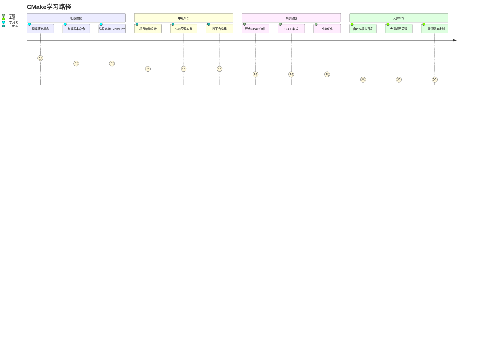
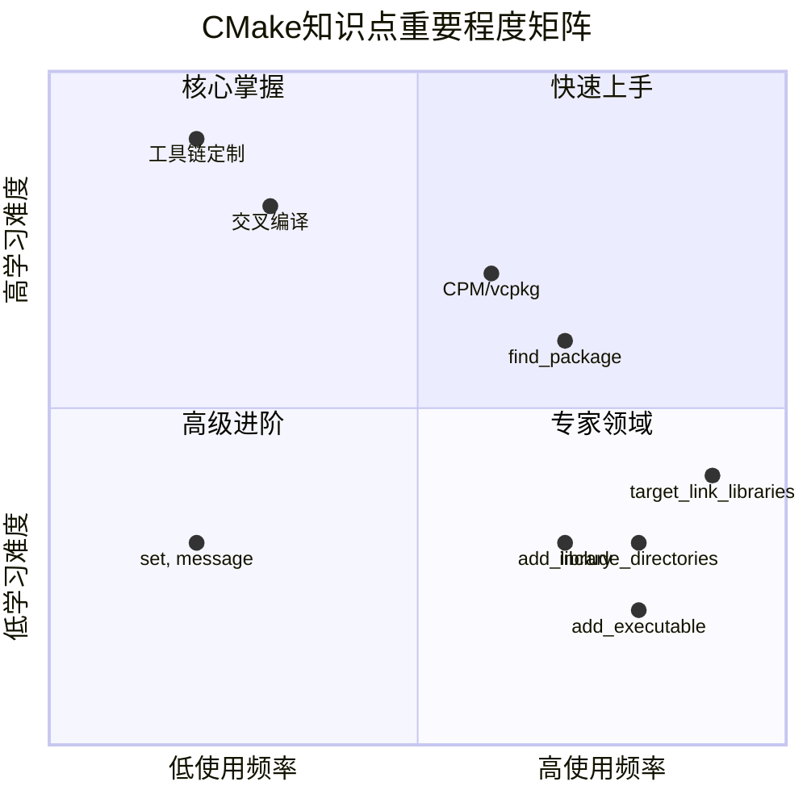
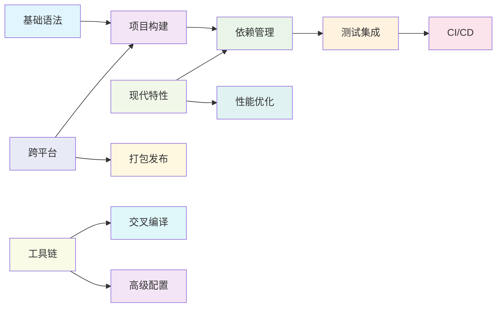
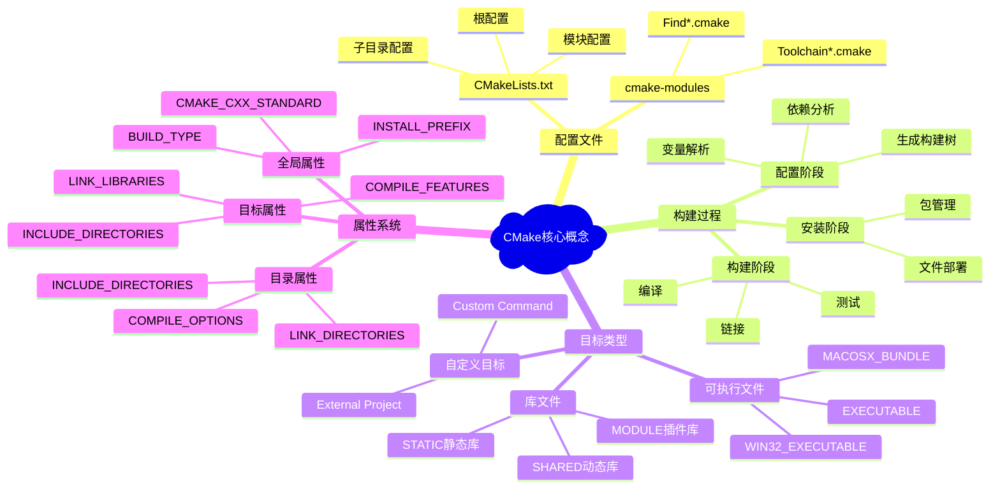
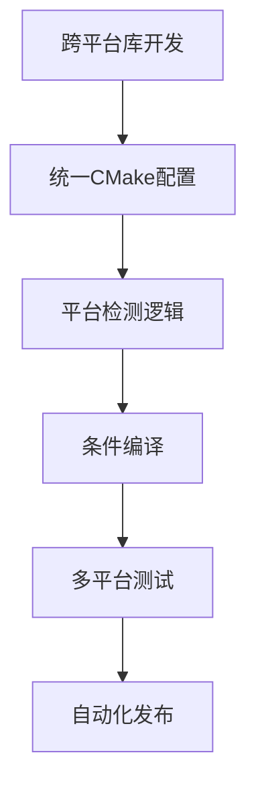

# 🧠 CMake知识架构总览

基于《camke入门简单小结.md》和《CMake入门与现代实践指南.md》的综合分析，以下是CMake完整知识体系的架构图。

## 📊 完整知识架构图

```mermaid
flowchart TD
    A[CMake 知识体系] --> B[基础概念]
    A --> C[核心语法]
    A --> D[现代特性 2025]
    A --> E[项目实践]
    A --> F[高级应用]

    B --> B1[什么是CMake]
    B --> B2[工作原理]
    B --> B3[跨平台特性]
    B --> B4[构建流程]

    B1 --> B1a[跨平台构建工具]
    B1 --> B1b[Makefile生成器]
    B1 --> B1c[IDE集成支持]

    B2 --> B2a[CMakeLists.txt配置]
    B2 --> B2b[构建树生成]
    B2 --> B2c[本地构建系统]

    B3 --> B3a[Windows/Visual Studio]
    B3 --> B3b[Linux/GNU Make]
    B3 --> B3c[macOS/Xcode]

    C --> C1[项目定义命令]
    C --> C2[构建目标命令]
    C --> C3[依赖管理命令]
    C --> C4[控制流命令]
    C --> C5[重要变量]

    C1 --> C1a[cmake_minimum_required]
    C1 --> C1b[project]
    C1 --> C1c[set]

    C2 --> C2a[add_executable]
    C2 --> C2b[add_library]
    C2 --> C2c[target_link_libraries]

    C3 --> C3a[include_directories]
    C3 --> C3b[link_directories]
    C3 --> C3c[find_package]

    C4 --> C4a[if/else/endif]
    C4 --> C4b[foreach/endwhile]
    C4 --> C4c[message]

    C5 --> C5a[目录变量]
    C5 --> C5b[输出变量]
    C5 --> C5c[项目变量]

    D --> D1[包管理器]
    D --> D2[现代语法]
    D --> D3[最佳实践]

    D1 --> D1a[CPM]
    D1 --> D1b[vcpkg]
    D1 --> D1b1[cmake_package_manager统一接口]

    D1a --> D1a1[小型项目首选]
    D1a --> D1a2[源码依赖管理]
    D1a --> D1a3[Git集成优势]

    D1b --> D1b1[企业级项目]
    D1b --> D1b2[二进制包分发]
    D1b --> D1b3[CI/CD优化]

    D2 --> D2a[target-based命令]
    D2 --> D2b[现代属性系统]
    D2 --> D2c[配置管理]

    D3 --> D3a[版本锁定]
    D3 --> D3b[条件依赖]
    D3 --> D3c[缓存管理]

    E --> E1[项目结构]
    E --> E2[模块化设计]
    E --> E3[测试集成]
    E --> E4[CI/CD配置]

    E1 --> E1a[目录组织]
    E1 --> E1b[CMakeLists.txt层次]
    E1 --> E1c[平台检测]

    E2 --> E2a[子项目管理]
    E2 --> E2b[模块化库]
    E2 --> E2c[接口设计]

    E3 --> E3a[CTest框架]
    E3 --> E3b[单元测试]
    E3 --> E3c[覆盖率统计]

    E4 --> E4a[GitHub Actions]
    E4 --> E4b[自动构建]
    E4 --> E4c[多平台测试]

    F --> F1[工具链管理]
    F --> F2[交叉编译]
    F --> F3[打包发布]
    F --> F4[性能优化]

    F1 --> F1a[编译器选择]
    F1 --> F1b[工具链文件]
    F1 --> F1c[自定义命令]

    F2 --> F2a[目标平台配置]
    F2 --> F2b[SDK集成]
    F2 --> F2c[交叉编译工具链]

    F3 --> F3a[CPack配置]
    F3 --> F3b[安装规则]
    F3 --> F3c[组件管理]

    F4 --> F4a[构建缓存]
    F4 --> F4b[并行构建]
    F4 --> F4c[增量构建优化]
```

## 🎯 学习路径图

## 📈 知识点重要程度分析

## 🔗 知识关联图

## 📚 核心概念关系图

## 🎨 实践应用场景

### 1. 小型项目（推荐CPM）

### 2. 企业级项目（推荐vcpkg）

### 3. 跨平台库开发

## 📝 学习建议

### 🚀 新手入门路径
1. **基础概念** → 理解CMake是什么，为什么需要它
2. **基本命令** → 掌握`add_executable`、`add_library`、`target_link_libraries`
3. **简单项目** → 为单个源文件项目编写CMakeLists.txt
4. **依赖管理** → 学习使用`find_package`和第三方库

### 🔧 进阶提升路径
1. **现代语法** → 使用target-based命令替代传统命令
2. **包管理器** → 掌握CPM和vcpkg的使用
3. **项目结构** → 设计多模块项目的CMake架构
4. **测试集成** → 集成CTest进行自动化测试

### 🏆 专家级主题
1. **工具链定制** → 交叉编译和自定义工具链
2. **性能优化** → 构建缓存和并行优化
3. **CI/CD集成** → 完整的自动化流水线
4. **插件开发** → 编写自定义CMake模块

---

**文档创建时间**: 2025-12-17
**基于资料**: camke入门简单小结.md + CMake入门与现代实践指南.md
**适用版本**: CMake 3.28+ (2025年最佳实践)