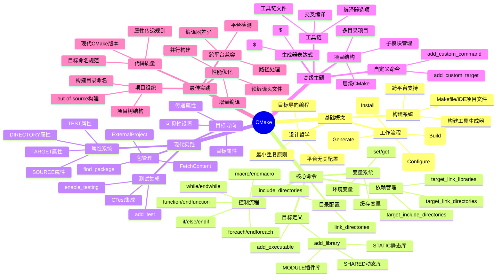
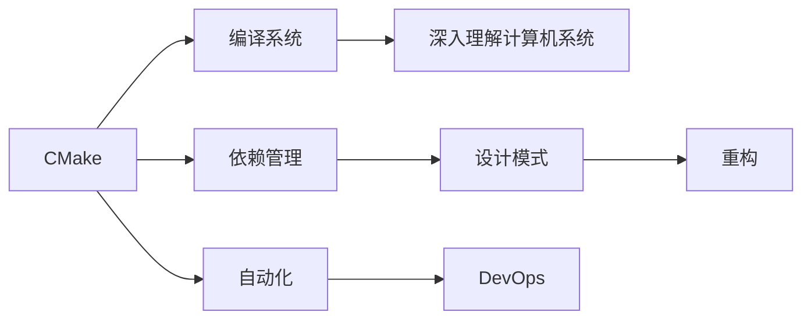

# 📚 CMake 入门与现代实践指南

## 📖 基本信息

- **原名**: CMake 入门与现代实践指南
- **主题**: 构建系统、跨平台开发、自动化工具
- **相关技术**: C/C++、跨平台开发、构建工具链
- **创建时间**: 2026年3月
- **升级时间**: 2026年4月17日
- **难度等级**: 初级-中级
- **阅读状态**: ✅ 已完成
- **个人评分**: ⭐⭐⭐⭐
- **标签**: #构建系统 #CMake #跨平台开发 #自动化 #工具链

## 📝 内容概要

### 书籍简介

CMake 是一个跨平台的自动化构建系统，它使用平台无关的配置文件来生成特定平台的原生构建工具文件。作为现代C/C++开发的事实标准构建工具，CMake 广泛应用于开源项目和企业级软件开发中。本指南从实际应用角度出发，系统介绍了CMake的核心概念、常用命令和最佳实践。

### 核心主题

1. **CMake基础概念** - 理解CMake的工作原理和设计哲学
2. **核心命令详解** - 掌握项目配置、目标定义、依赖管理等关键命令
3. **现代CMake实践** - 学习目标导向的现代CMake编程范式
4. **跨平台构建** - 实现一次编写，多平台编译的能力
5. **构建系统架构** - 理解大型项目的CMake架构设计

### 主要章节结构

#### 第一部分：CMake基础
- CMake概述与工作原理
- 基本语法和变量系统
- 项目配置与构建流程

#### 第二部分：核心命令
- 目标定义（add_executable、add_library）
- 依赖管理（target_link_libraries）
- 目录配置（include_directories、link_directories）
- 控制流程（if、foreach）

#### 第三部分：现代实践
- 目标导向的CMake编程
- 属性系统与传递属性
- 包管理和依赖查找
- 测试集成

## 🧠 知识架构



## ✍️ 读书笔记

### 第1章：CMake概述

#### 什么是CMake

CMake是一个跨平台的构建系统生成工具，其核心价值在于：

**设计目标**：
- **跨平台性**：一次编写CMake配置，可在Windows、Linux、macOS等平台生成对应的构建文件
- **工具链无关**：支持生成Makefile、Ninja、Visual Studio项目、Xcode项目等多种构建文件
- **层次化**：支持大型项目的多层级构建配置

**工作原理**：
```
CMakeLists.txt → [CMake配置] → 构建文件 → [构建工具] → 可执行文件
                    ↓
            Makefile/VS项目/Xcode项目
```

**与Make的区别**：
- Make是构建工具，直接执行编译
- CMake是构建系统生成器，生成构建文件

#### CMake的优势

1. **解决Makefile的痛点**
   - Makefile依赖特定平台和工具链
   - 编写复杂Makefile工作量大
   - 依赖关系管理容易出错

2. **现代C/C++开发标准**
   - 主流开源项目首选（OpenCV、Boost、LLVM等）
   - IDE集成良好（CLion、Visual Studio）
   - 包管理器支持（vcpkg、Conan）

3. **开发效率提升**
   - 简化跨平台开发流程
   - 自动化依赖管理
   - 集成测试和部署

### 第2章：核心命令详解

#### add_executable - 定义可执行目标

**基本语法**：
```cmake
add_executable(myapp main.cpp helper.cpp utils.cpp)
```

**使用场景**：
- 创建应用程序可执行文件
- 生成命令行工具
- 构建测试程序

**最佳实践**：
```cmake
# 使用目标名称作为变量前缀
add_executable(my_app
    src/main.cpp
    src/helper.cpp
    src/utils.cpp
)

# 为目标设置属性
set_target_properties(my_app PROPERTIES
    CXX_STANDARD 17
    CXX_STANDARD_REQUIRED ON
)
```

#### add_library - 定义库目标

**基本语法**：
```cmake
# 静态库
add_library(mylib STATIC foo.cpp bar.cpp)

# 动态库
add_library(mylib SHARED foo.cpp bar.cpp)

# 接口库（仅用于传递属性）
add_library(mylib INTERFACE)
```

**库类型选择指南**：
- **STATIC**：编译时链接，生成.a/.lib文件
- **SHARED**：运行时链接，生成.so/.dll文件
- **MODULE**：插件库，运行时动态加载
- **INTERFACE**：不生成编译产物，仅用于属性传递

**现代实践**：
```cmake
# 创建库并导出符号
add_library(mylib
    src/lib.cpp
    src/internal.cpp
)

# 设置可见性
target_compile_definitions(mylib PRIVATE
    MYLIB_EXPORTS  # Windows导出符号
)

# 安装配置
install(TARGETS mylib
    LIBRARY DESTINATION lib
    ARCHIVE DESTINATION lib
    RUNTIME DESTINATION bin
)
```

#### target_link_libraries - 链接库

**基本用法**：
```cmake
target_link_libraries(myapp PRIVATE mylib)
```

**可见性关键字**（现代CMake重要特性）：
```cmake
target_link_libraries(myapp
    PRIVATE   lib1      # 仅myapp可见
    PUBLIC    lib2      # myapp和依赖myapp的目标可见
    INTERFACE lib3      # 仅依赖myapp的目标可见
)
```

**使用场景对比**：
- **PRIVATE**：实现细节，不对外暴露
- **PUBLIC**：API的一部分，需要传递给使用者
- **INTERFACE**：纯接口库，无源文件

#### include_directories - 包含目录

**传统方式（不推荐）**：
```cmake
include_directories(/path/to/include)
# 影响所有后续目标，不符合现代CMake理念
```

**现代方式（推荐）**：
```cmake
target_include_directories(myapp
    PRIVATE /path/to/internal/include
    PUBLIC  /path/to/api/include
)
```

**最佳实践**：
```cmake
# 使用生成器表达式
target_include_directories(myapp
    PRIVATE
        $<BUILD_INTERFACE:${CMAKE_CURRENT_SOURCE_DIR}/include>
        $<INSTALL_INTERFACE:include>
)
```

#### 变量与控制流程

**变量操作**：
```cmake
# 设置变量
set(MY_VAR "value")

# 列表操作
set(MY_LIST item1 item2 item3)
list(APPEND MY_LIST item4)

# 缓存变量
set(MY_CACHE_VAR "value" CACHE STRING "Description")
```

**条件判断**：
```cmake
if(MY_VAR STREQUAL "value")
    # do something
elseif(MY_VAR MATCHES "regex")
    # do something else
else()
    # default
endif()
```

**循环**：
```cmake
# foreach循环
foreach(item IN LISTS MY_LIST)
    message(STATUS "Processing ${item}")
endforeach()

# while循环
while(counter LESS 10)
    # do something
    math(EXPR counter "${counter} + 1")
endwhile()
```

### 第3章：现代CMake实践

#### 目标导向编程

**核心理念**：以目标为中心组织构建配置，而非全局变量

**对比示例**：

*传统方式（旧式）*：
```cmake
# 全局设置，影响所有目标
include_directories(/path/to/include)
add_definitions(-DSOME_DEFINE)
add_executable(app1 main.cpp)
add_executable(app2 main.cpp)
```

*现代方式（推荐）*：
```cmake
# 每个目标独立配置
add_executable(app1 main.cpp)
target_include_directories(app1 PRIVATE /path/to/include)
target_compile_definitions(app1 PRIVATE SOME_DEFINE)

add_executable(app2 main.cpp)
target_include_directories(app2 PRIVATE /other/path/include)
```

#### 属性传递系统

**传递性规则**：
```cmake
# 库A定义公共包含目录
add_library(libA src/a.cpp)
target_include_directories(libA PUBLIC
    $<BUILD_INTERFACE:${CMAKE_CURRENT_SOURCE_DIR}/include>
)

# 可执行文件链接libA
add_executable(app main.cpp)
target_link_libraries(app PRIVATE libA)
# app自动获得libA的PUBLIC包含目录
```

**实际应用场景**：
```cmake
# 创建一个库，自动传递依赖
add_library(mylib
    src/lib.cpp
)
target_include_directories(mylib PUBLIC
    $<BUILD_INTERFACE:${CMAKE_CURRENT_SOURCE_DIR}/include>
    $<INSTALL_INTERFACE:include>
)
target_link_libraries(mylib PUBLIC
    some_dependency  # 传递给使用者
)

# 使用者只需链接mylib
add_executable(app main.cpp)
target_link_libraries(app PRIVATE mylib)
# 自动获得mylib的include目录和依赖
```

#### 包管理与依赖查找

**find_package使用**：
```cmake
# 查找已安装的包
find_package(OpenSSL REQUIRED)
find_package(Boost 1.70 REQUIRED COMPONENTS filesystem system)

# 链接找到的库
target_link_libraries(myapp PRIVATE OpenSSL::SSL OpenSSL::Crypto)
target_link_libraries(myapp PRIVATE Boost::filesystem Boost::system)
```

**FetchContent（现代CMake 3.14+）**：
```cmake
include(FetchContent)

# 下载并配置依赖
FetchContent_Declare(
    json
    GIT_REPOSITORY https://github.com/nlohmann/json.git
    GIT_TAG v3.11.2
)

FetchContent_MakeAvailable(json)

# 使用下载的库
target_link_libraries(myapp PRIVATE nlohmann_json::nlohmann_json)
```

#### 测试集成

**基本测试配置**：
```cmake
# 启用测试
enable_testing()

# 添加测试
add_executable(test_main tests/test_main.cpp)
target_link_libraries(test_main PRIVATE mylib gtest_main)

add_test(NAME basic_tests COMMAND test_main)

# 更复杂的测试
add_test(NAME test_with_args
    COMMAND test_main --gtest_filter=MyTestSuite.*
)
```

## 💡 个人思考

### 关于构建系统的思考

**从手工到自动化的演进**：
早期的软件开发依赖手工编写Makefile，开发者需要深入了解每个平台的构建工具差异。CMake的出现标志着构建系统的标准化和自动化，这反映了软件工程的发展趋势：**将重复性劳动自动化，让开发者专注于业务逻辑**。

**构建系统的重要性**：
在大型项目中，构建系统的质量直接影响开发效率和代码质量。一个好的构建系统应该：
- **快速**：支持并行构建和增量编译
- **可靠**：一致的构建结果，可重现的构建过程
- **灵活**：易于配置和扩展
- **标准化**：遵循行业最佳实践

### 现代CMake的设计哲学

**目标导向 vs 全局变量**：
现代CMake强调以目标为中心，每个目标独立配置自己的属性。这种设计理念与现代软件工程的模块化思想一致：**高内聚、低耦合**。

**属性传递的智慧**：
PUBLIC/PRIVATE/INTERFACE三个关键字提供了精细的控制，让开发者明确表达意图。这种设计体现了**最小权限原则**：只暴露必要的接口，隐藏实现细节。

### 跨平台开发的挑战

**一次编写，多处编译的理想与现实**：
CMake的口号是"Write once, run everywhere"，但实际应用中仍需处理平台差异：
- **路径分隔符**：Windows使用`\`，Unix使用`/`
- **编译器差异**：MSVC vs GCC/Clang的语法和特性差异
- **库文件命名**：.lib/.a/.so/.dll等不同后缀

**最佳实践**：
- 使用CMake的生成器表达式处理平台差异
- 充分测试目标平台
- 保持CMake版本更新，使用现代特性

## 🎯 实践应用

### 行动计划1：升级现有项目到现代CMake

**目标**：将传统CMake项目升级到现代CMake实践

**具体步骤**：
1. **提升CMake最低版本要求**
   ```cmake
   cmake_minimum_required(VERSION 3.15)
   ```

2. **使用目标导向命令**
   - 替换`include_directories`为`target_include_directories`
   - 替换`add_definitions`为`target_compile_definitions`
   - 使用`target_link_libraries`的可见性关键字

3. **导入目标替代传统变量**
   ```cmake
   # 旧方式
   find_package(OpenSSL REQUIRED)
   include_directories(${OPENSSL_INCLUDE_DIR})
   target_link_libraries(myapp ${OPENSSL_LIBRARIES})
   
   # 新方式
   find_package(OpenSSL REQUIRED)
   target_link_libraries(myapp PRIVATE OpenSSL::SSL)
   ```

4. **使用FetchContent管理依赖**
   - 将手动下载的依赖改为FetchContent
   - 统一依赖管理方式

**预期效果**：
- 更清晰的依赖关系
- 更好的构建性能
- 更容易维护

**时间安排**：
- 第一周：学习和理解现代CMake特性
- 第二周：在实验项目上实践
- 第三周：应用到实际项目

### 行动计划2：建立项目的CMake最佳实践

**目标**：为团队建立统一的CMake规范

**具体内容**：
1. **项目结构规范**
   ```
   project/
   ├── CMakeLists.txt           # 根CMake文件
   ├── cmake/                   # CMake辅助文件
   │   ├── FindXXX.cmake        # 自定义查找模块
   │   └── compiler_flags.cmake # 编译器选项
   ├── src/                     # 源代码
   ├── include/                 # 公共头文件
   ├── tests/                   # 测试代码
   └── docs/                    # 文档
   ```

2. **编码规范**
   - 使用现代CMake（3.15+）
   - 所有目标使用target_*命令
   - 明确指定可见性（PUBLIC/PRIVATE/INTERFACE）
   - 使用生成器表达式处理平台差异

3. **代码模板**
   - 可执行文件模板
   - 库文件模板
   - 测试模板

**预期效果**：
- 统一的代码风格
- 降低学习曲线
- 提高代码质量

**时间安排**：
- 第1-2周：制定规范文档
- 第3-4周：团队培训和推广
- 第5周起：全面应用

## 💭 深度衍生思考

### 🎯 核心观点延伸

**从构建系统到软件工程哲学**

CMake的演进反映了软件工程的核心问题：**如何管理复杂性**。

*延伸逻辑*：
- 构建系统的本质是**依赖管理**：源文件依赖头文件，可执行文件依赖库，库依赖其他库
- 现代CMake的目标导向设计体现了**模块化**思想：每个目标独立，通过明确的接口连接
- 属性传递系统体现了**信息隐藏**原则：实现细节私有化，接口公开化

*支撑证据*：
- 大型软件项目的复杂性主要来自模块间的依赖关系
- 清晰的依赖关系是可维护性的基础
- 现代编程语言（如Rust、Go）都强调模块化和依赖管理

*实践意义*：
- 在软件架构设计中，应该优先考虑依赖关系的清晰性
- 使用依赖注入、接口隔离等模式降低耦合
- 构建系统的设计原则可以应用到软件架构的其他层面

### 🔍 多角度分析

**历史视角**：构建系统的演进
```
手工编译 → Make → Autoconf → CMake → Meson/Bazel
  1970s    1977     1991       2000      2010s
```
每次演进都是为了解决前一阶段的问题：
- Make：解决重复编译问题
- Autoconf：解决跨平台配置问题
- CMake：统一跨平台构建
- Meson/Bazel：提升构建速度和易用性

**现代视角**：CMake在云原生时代的角色
- **CI/CD集成**：CMake是持续集成的基础设施
- **容器化构建**：Dockerfile中常用CMake构建项目
- **跨平台开发**：移动端、嵌入式、桌面端统一构建流程

**跨领域视角**：构建系统与包管理
- 其他语言的解决方案：
  - JavaScript: npm/yarn
  - Python: pip/poetry
  - Rust: cargo
- C++的挑战：缺少统一的包管理器
- 未来趋势：CMake与vcpkg、Conan等包管理器的集成

**反向思考**：如果CMake不存在会怎样？
- 每个项目都要维护自己的构建脚本
- 跨平台开发成本大幅增加
- 开源项目生态碎片化
- C++可能失去在现代开发中的竞争力

### 🚀 创新思考

**潜在改进**：CMake的局限性
1. **语言设计**：CMake语法不是图灵完备的，复杂逻辑难以实现
2. **性能问题**：大型项目的配置时间较长
3. **学习曲线**：概念多，新手容易困惑

**新方向探索**：
1. **基于Python的构建系统**：如Meson，更直观的语法
2. **远程缓存**：分布式编译缓存，加速CI/CD
3. **AI辅助配置**：自动生成CMake配置文件

## 🔗 知识关联网络

### 与已读书籍的关联

- **深入理解计算机系统** - 关联强度: ⭐⭐⭐
  - 构建系统是计算机系统的重要组成部分
  - 理解链接、加载等系统级概念有助于理解CMake工作原理
  - 构建过程涉及编译、汇编、链接等系统调用

- **设计模式** - 关联强度: ⭐⭐⭐⭐
  - CMake的target导向设计体现了模块化模式
  - 属性传递系统使用了观察者模式的思想
  - 构建配置可以使用工厂模式管理不同平台

- **重构** - 关联强度: ⭐⭐⭐
  - CMake代码也需要重构以保持可维护性
  - 现代CMake实践本质上是对传统CMake的重构
  - 目标导向重构：从全局变量到target_*命令

### 概念映射



### 知识依赖关系

**前置知识**：
- C/C++基础语法和编译过程
- 命令行操作
- 基本的软件工程概念

**后续延伸**：
- 高级构建系统（如Bazel、Meson）
- CI/CD系统设计
- 跨平台开发最佳实践
- 包管理系统设计

## 📚 后续阅读路径规划

### 直接延伸

1. **《Professional CMake: A Practical Guide》** - Craig Scott
   - 关联度: ⭐⭐⭐⭐⭐
   - 阅读优先级: 高
   - 预期收获: 深入理解现代CMake最佳实践，作者是CMake专家

2. **《Mastering CMake》** - Ken Martin & Bill Hoffman
   - 关联度: ⭐⭐⭐⭐⭐
   - 阅读优先级: 高
   - 预期收获: CMake的权威指南，覆盖从入门到高级的所有主题

### 交叉验证

1. **Bazel构建系统**
   - 对比点: 大型项目的构建性能和可扩展性
   - 价值: 了解构建系统的不同设计选择和权衡

2. **Meson构建系统**
   - 对比点: 用户体验和配置简洁性
   - 价值: 理解构建系统设计的不同理念

### 实践补充

1. **vcpkg包管理器**
   - 类型: C++包管理工具
   - 难度: 中级
   - 时间投入: 1-2周
   - 关联: 与CMake深度集成，简化依赖管理

2. **Conan包管理器**
   - 类型: C++依赖管理工具
   - 难度: 中级
   - 时间投入: 2-3周
   - 关联: 企业级C++包管理解决方案

3. **GitHub Actions + CMake**
   - 类型: CI/CD实践
   - 难度: 初级-中级
   - 时间投入: 1周
   - 关联: 将CMake集成到现代CI/CD流程

### 个性化路径

基于个人兴趣方向:

**如果你对工具开发感兴趣**:
- Meson源码分析
- 构建系统设计原理
- 编译器后端实现

**如果你对DevOps感兴趣**:
- CMake与Docker集成
- CI/CD流水线设计
- 基础设施即代码

**如果你对跨平台开发感兴趣**:
- 移动端构建配置
- 嵌入式开发工具链
- 平台特定优化

## 📊 学习总结

### 最大的收获

通过学习CMake，我最大的收获是理解了**构建系统在软件工程中的核心地位**。构建系统不仅仅是编译代码的工具，它是项目架构的体现，是依赖管理的载体，是团队协作的基础。

现代CMake的目标导向设计让我重新思考了**模块化和接口设计**的重要性。这种设计理念不仅适用于构建系统，也适用于软件架构的各个层面。

### 改变的观念

1. **从"能工作就行"到"最佳实践"**
   - 以前：只要能编译通过就行
   - 现在：追求清晰、可维护、高效的构建配置

2. **从全局设置到目标导向**
   - 以前：使用全局变量和命令
   - 现在：以目标为中心，精细控制属性

3. **从手工操作到自动化**
   - 以前：手动下载依赖、配置路径
   - 现在：使用FetchContent、find_package自动化管理

### 未来行动

基于CMake学习，我计划采取的行动：

1. **短期（1-2个月）**
   - 升级现有项目到现代CMake
   - 建立团队的CMake最佳实践文档
   - 学习vcpkg包管理器

2. **中期（3-6个月）**
   - 探索Bazel等现代构建系统
   - 深入研究CI/CD集成
   - 贡献开源项目的CMake配置

3. **长期（1年+）**
   - 成为CMake专家，能够指导团队
   - 参与CMake社区讨论
   - 研究构建系统的未来发展方向

---

**笔记创建时间**: 2026年3月
**最后更新**: 2026年4月17日
**笔记版本**: v2.0
**升级说明**: 从简单的命令总结升级为完整的现代CMake实践指南，包含深度思考、知识关联和后续学习路径
