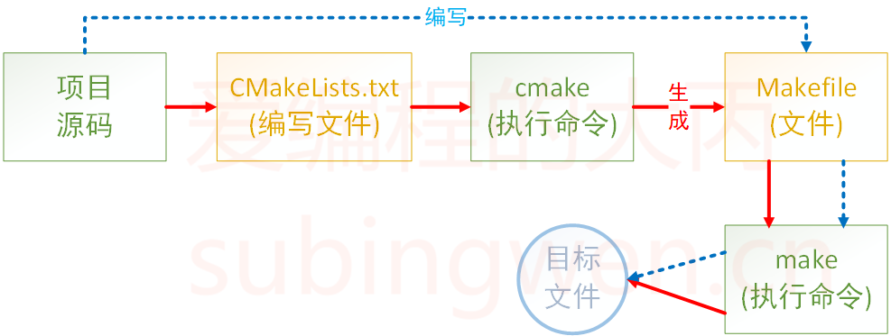

# 前言

最近要使用camke，做一个简单的小结梳理，方便后续回顾。

# 什么是cmake

CMake 是一种管理源代码构建的工具。最初，CMake 被设计为各种方言的生成器`Makefile`，如今，CMake 可以生成现代构建系统，以及`Ninja`适用于 Visual Studio 和 Xcode 等 IDE 的项目文件。

CMake 广泛用于 C 和 C++ 语言，但它也可以用于构建其他语言的源代码。并且是跨平台的。大多IDE软件都集成了make，比如：VS 的 nmake、linux 下的 GNU make、Qt 的 qmake等，如果自己动手写 makefile，会发现，makefile 通常依赖于当前的编译平台，而且编写 makefile 的工作量比较大，解决依赖关系时也容易出错。

CMake 恰好能解决上述问题，允许开发者指定整个工程编译流程，根据编译平台，自动生成本地化Makefile和工程文件，用户只需make编译即可，所以可以把CMake看成一款自动生成 Makefile的工具，其编译流程如下图：


CMake 是一个项目构建工具，并且是跨平台的。关于项目构建我们所熟知的还有Makefile（通过 make 命令进行项目的构建），大多是IDE软件都集成了make，比如：VS 的 nmake、linux 下的 GNU make、Qt 的 qmake等，如果自己动手写 makefile，会发现，makefile 通常依赖于当前的编译平台，而且编写 makefile 的工作量比较大，解决依赖关系时也容易出错。


而 CMake 恰好能解决上述问题， 其允许开发者指定整个工程的编译流程，在根据编译平台，自动生成本地化的Makefile和工程文件，最后用户只需make编译即可，所以可以把CMake看成一款自动生成 Makefile的工具，其编译流程如下图：



cmake的不同特性，可在不同场景使用


# 几个常用的命令

***

### **add\_executable**

`add_executable`命令用于将多个源文件编译成可执行文件。举个例子，假设我们有两个源文件`main.cpp`和`helper.cpp`，它们需要被编译成一个可执行文件`myapp`，我们可以使用下面的代码：

```c++
add_executable(myapp main.cpp helper.cpp)
```

其中，`myapp`表示生成的可执行文件的名称，`main.cpp`和`helper.cpp`表示源代码文件的名称。如果有多个源代码文件，可以将它们作为参数逐一列出。

***

### **add\_library**

`add_library`命令用于将多个源文件编译成静态库或动态库。举个例子，假设我们有两个源文件`foo.cpp`和`bar.cpp`，它们需要被编译成一个静态库`libfoobar.a`，我们可以使用下面的代码：

```c++
add_library(foobar STATIC foo.cpp bar.cpp)
```

其中，`foobar`表示生成的库的名称，`foo.cpp`和`bar.cpp`表示源代码文件的名称。`STATIC`表示生成静态库，`SHARED`表示生成动态库，`MODULE`表示生成插件库。如果不指定库类型，则默认生成静态库。

***

### **target\_link\_libraries**

`target_link_libraries`命令用于将一个或多个库链接到可执行文件或其他库中。举个例子，假设我们需要将`libfoo.a`和`libbar.a`链接到可执行文件`myapp`中，我们可以使用下面的代码：

```c++
target_link_libraries(myapp foo bar)
```

其中，`myapp`表示可执行文件或其他库的名称，`foo`和`bar`表示需要链接的库的名称。如果有多个库，可以将它们作为参数逐一列出。

***

### **include\_directories**

`include_directories`命令用于将头文件路径添加到编译器的搜索路径中。举个例子，假设我们需要将`/path/to/include`添加到编译器的头文件搜索路径中，我们可以使用下面的代码：

```c++
include_directories(/path/to/include)
```

如果有多个路径，可以将它们作为参数逐一列出。另外，`AFTER`和`BEFORE`表示添加的路径在搜索路径中的位置，`SYSTEM`表示添加的路径是系统头文件路径。

***

### **link\_directories**

`link_directories`命令用于将库文件路径添加到链接器的搜索路径中。举个例子，假设我们需要将`/path/to/lib`添加到链接器的库文件搜索路径中，我们可以使用下面的代码：

```c++
link_directories(/path/to/lib)
```

如果有多个路径，可以将它们作为参数逐一列出。

***

### **set**

`set`命令用于设置变量的值。举个例子，假设我们需要将变量`MY_VARIABLE`的值设置为`hello world`，我们可以使用下面的代码：

代码语言：C++

复制

```c++
set(MY_VARIABLE "hello world")
```

其中，`MY_VARIABLE`表示变量的名称，`hello world`表示变量的值。如果变量的值是一个字符串，需要用引号将其括起来。

***

### **if**

`if`命令用于判断条件是否成立。举个例子，假设我们需要判断变量`MY_VARIABLE`是否等于`hello world`，如果成立，则执行一些操作，我们可以使用下面的代码：

```c++
if(MY_VARIABLE STREQUAL "hello world")
    # do something
endif()
```

其中，`MY_VARIABLE`表示判断的条件，`STREQUAL`表示字符串相等。如果条件成立，则执行`do something`部分的代码。

***

### **endif**

`endif`命令用于结束`if`语句块。其实，在CMake中，所有的控制流语句都需要以`endif`命令结束。举个例子，假设我们需要判断变量`MY_VARIABLE`是否等于`hello world`，如果成立，则打印一条消息，否则打印另一条消息，我们可以使用下面的代码：

```c++
if(MY_VARIABLE STREQUAL "hello world")
    message("MY_VARIABLE is hello world")
else()
    message("MY_VARIABLE is not hello world")
endif()
```

其中，`message`命令用于打印消息。

***

### **foreach**

`foreach`命令用于遍历一个列表，并对其中的每个元素执行相同的操作。举个例子，假设我们有一个列表`mylist`，其中包含三个元素`foo`、`bar`和`baz`，我们需要将它们依次打印出来，我们可以使用下面的代码：

```c++
set(mylist foo bar baz)
foreach(item IN LISTS mylist)
    message(${item})
endforeach()
```

其中，`item`表示列表中的元素，`mylist`表示需要遍历的列表。`LISTS`表示`mylist`是一个列表。

***

以上是CMake常用的命令，它们可以帮助我们更方便地管理项目的构建过程，提高项目构建的效率。除了上述命令，CMake还有很多其他的命令和功能，比如条件编译、预处理器定义、编译选项等，可以根据实际需要进行学习和使用。

# 几个常用变量

`CMAKE_BINARY_DIR` `PROJECT_BINARY_DIR` `_BINARY_DIR` 这三个变量指代的内容是一致的，如果是 in source 编译，指得就是工程顶层目录，如果是 out-of-source 编译，指的是工程编译发生的目录。PROJECT\_BINARY\_DIR 跟其他 指令稍有区别，现在，可以理解为他们是一致的。

`CMAKE_SOURCE_DIR` `PROJECT_SOURCE_DIR` `<project_name>_SOURCE_DIR` 这三个变量指代的内容是一致的，不论采用何种编译方式，都是工程顶层目录。 也就是在 in source 编译时，他跟 CMAKE\_BINARY\_DIR 等变量一致。 `PROJECT_SOURCE_DIR` 跟其他指令稍有区别。

`CMAKE_CURRENT_SOURCE_DIR` 指的是当前处理的 CMakeLists.txt 所在的路径

`CMAKE_CURRRENT_BINARY_DIR` 如果是 in-source 编译，它跟 `CMAKE_CURRENT_SOURCE_DIR` 一致，如果是out-of-source 编译，他指的是 target 编译目录。 使用 `ADD_SUBDIRECTORY(src bin)`可以更改这个变量的值。 使用 `SET(EXECUTABLE_OUTPUT_PATH <新路径>)`并不会对这个变量造成影响，它仅仅修改了最终目标文件存放的路径。

`CMAKE_CURRENT_LIST_FILE`输出调用这个变量的 CMakeLists.txt 的完整路径

`CMAKE_CURRENT_LIST_LINE` 输出这个变量所在的行

`CMAKE_MODULE_PATH` 这个变量用来定义自己的 cmake 模块所在的路径。如果你的工程比较复杂，有可能会自己 编写一些 cmake 模块，这些 cmake 模块是随你的工程发布的，为了让 cmake 在处理 CMakeLists.txt 时找到这些模块，你需要通过 SET 指令，将自己的 cmake 模块路径设 置一下。 比如 `SET(CMAKE_MODULE_PATH ${PROJECT_SOURCE_DIR}/cmake) `这时候你就可以通过 INCLUDE 指令来调用自己的模块了

`EXECUTABLE_OUTPUT_PATH` 和 `LIBRARY_OUTPUT_PATH` 分别用来重新定义最终结果的存放目录，前面我们已经提到了这两个变量。

`PROJECT_NAME` 返回通过 PROJECT 指令定义的项目名称。

# 总结


# 参考资料

https://subingwen.cn/cmake/CMake-primer/#1-CMake%E6%A6%82%E8%BF%B0

https://cmake.org/cmake/help/latest/guide/tutorial/index.html

https://zhuanlan.zhihu.com/p/258118287

https://cloud.tencent.com/developer/article/2291353

https://juejin.cn/post/6998055558741753893
