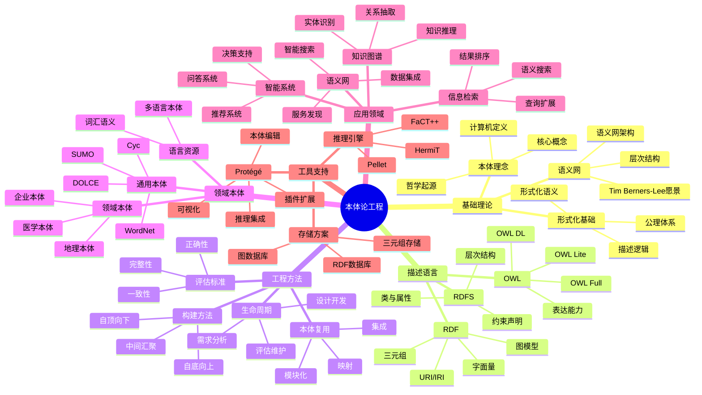
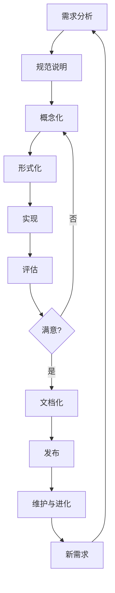
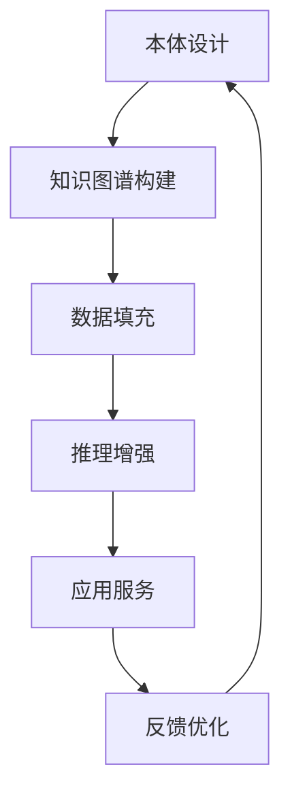
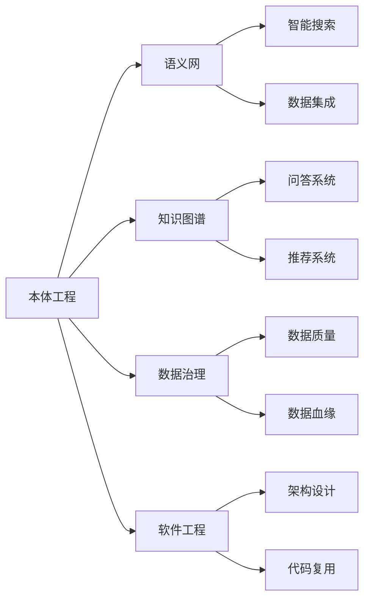

# 📚 本体论工程及其应用

# Part 1：书籍内容梳理归纳

## 📖 基本信息

- **书名**: 本体论工程及其应用
- **作者**: 冯志勇、李文杰、李晓红 编著
- **出版社**: 清华大学出版社
- **出版年份**: 2007年5月
- **ISBN**: 9787302146278
- **页数**: 约300页
- **创建时间**: 2026年5月11日
- **难度等级**: 中高级
- **阅读状态**: 📖 正在阅读
- **个人评分**: ⭐⭐⭐⭐
- **标签**: #本体论 #语义网 #知识图谱 #知识表示 #OWL #RDF #描述逻辑 #Protégé

## 📝 内容概要

### 书籍简介

《本体论工程及其应用》是国内较早系统介绍本体论工程的专业教材之一。本书全面、系统地论述了本体论工程的理论框架，涵盖本体理念概述、形式化描述、描述语言、工程方法学、领域知识库、应用领域以及编辑工具等核心内容。本书力争为读者提供全面、系统且翔实的内容，对本体、本体论、语义网及其相关技术和应用领域都进行了深入探讨。

本书适合计算机科学、人工智能、信息管理等相关专业的研究生和高年级本科生阅读，也适合从事语义网、知识工程、智能信息检索等领域的研究人员和工程技术人员参考。

### 核心主题

1. **本体理念与形式化基础** - 本体的哲学起源、在计算机科学中的定义、描述逻辑基础
2. **本体描述语言** - RDF、RDFS、OWL等W3C标准语言
3. **本体工程方法学** - 本体构建方法、生命周期、评估标准
4. **领域本体知识库** - WordNet、Cyc、SUMO等经典本体案例
5. **本体应用领域** - 语义网、知识图谱、信息检索、智能问答
6. **本体工具支持** - Protégé等主流本体编辑工具

### 主要章节结构

#### 第1章：本体理念概述
- 本体的哲学起源与定义
- 本体在计算机科学中的含义
- 本体与语义网的关系
- 本体的核心概念与作用

#### 第2章：本体的形式化描述
- 描述逻辑基础
- 本体的公理体系
- 形式化语义
- 推理机制

#### 第3章：本体描述语言
- RDF（资源描述框架）
- RDFS（RDF模式）
- OWL（Web本体语言）
- 其他本体语言比较

#### 第4章：本体的实现和运算
- 本体存储
- 本体推理
- 本体查询
- 本体映射与集成

#### 第5章：本体论工程方法学
- 本体构建方法
- 本体生命周期
- 本体评估标准
- 本体复用

#### 第6章：领域本体知识库
- WordNet词网
- Cyc常识知识库
- SUMO上层本体
- 其他领域本体案例

#### 第7章：本体论的应用
- 语义网应用
- 知识图谱构建
- 信息检索增强
- 智能问答系统
- 其他应用场景

#### 第8章：本体编辑工具
- Protégé本体编辑器
- 其他辅助工具
- 工具比较与选择

## 🧠 知识架构



## ✍️ 读书笔记

### 第1章：本体理念概述

#### 重点摘录
> "本体是关于世界客观事物的概念化、明确化、形式化的规范说明。"

> "本体的目标是捕获相关领域的知识，提供对该领域知识的共同理解，确定该领域内共同认可的词汇，并从不同层次的形式化模式上给出这些词汇和词汇间相互关系的明确定义。"

#### 1.1 本体的哲学起源

"本体"（Ontology）一词源于哲学领域，由希腊语"on"（存在）和"logos"（学说）构成，意为"关于存在的学说"。在哲学中，本体论研究的是存在的本质、世界的本原和基本范畴。

17世纪德国哲学家沃尔夫（Christian Wolff）首次将本体论定义为"关于存在本身的科学"，即研究存在者作为存在者的科学。

#### 1.2 本体在计算机科学中的定义

1993年，Gruber给出了本体论在人工智能领域的经典定义：

> **"An ontology is an explicit specification of a conceptualization."**
> （本体是概念化的明确说明。）

1998年，Studer等人对此定义进行了完善：

> **"An ontology is a formal, explicit specification of a shared conceptualization."**
> （本体是共享概念化的形式化、明确说明。）

这个定义包含四个核心要素：
1. **概念化（Conceptualization）**: 抽象出客观世界中相关现象的概念模型
2. **明确（Explicit）**: 概念及约束有明确的定义
3. **形式化（Formal）**: 机器可读的形式化语言
4. **共享（Shared）**: 共同认可的领域知识

#### 1.3 本体的核心构成

一个完整的本体通常包含以下组成部分：

```owl
<!-- 本体的基本构成示例 -->

<!-- 1. 类（Classes/Concepts）：领域的概念 -->
:Person a owl:Class .
:Organization a owl:Class .
:Project a owl:Class .

<!-- 2. 属性（Properties）：概念间的关系 -->
:worksFor a owl:ObjectProperty ;
    rdfs:domain :Person ;
    rdfs:range :Organization .

:memberOf a owl:ObjectProperty ;
    rdfs:domain :Person ;
    rdfs:range :Organization .

:leads a owl:ObjectProperty ;
    rdfs:domain :Person ;
    rdfs:range :Project .

<!-- 3. 约束（Restrictions）：对属性的限定 -->
:FullTimeEmployee a owl:Class ;
    rdfs:subClassOf [
        owl:onProperty :worksFor ;
        owl:someValuesFrom :Organization
    ] .

<!-- 4. 公理（Axioms）：永真断言 -->
[] a owl:AllDisjointClasses ;
    owl:members (:Person :Organization :Project) .
```

#### 1.4 本体在语义网中的地位

Tim Berners-Lee提出的语义网愿景中，本体扮演着核心角色：

```
语义网层次结构（从下到上）：
┌─────────────────────────────────┐
│   Trust / Digital Signature     │  信任/数字签名
├─────────────────────────────────┤
│   Proof / Logic                 │  证明/逻辑
├─────────────────────────────────┤
│   Ontology (OWL/RDFS)           │  本体 ← 我们在这里
├─────────────────────────────────┤
│   RDF (Data Model)              │  RDF数据模型
├─────────────────────────────────┤
│   XML / Unicode                 │  语法/编码
└─────────────────────────────────┘
```

本体层位于语义网架构的中间层，向上为逻辑推理提供语义基础，向下为RDF数据提供模式约束。

---

### 第2章：本体的形式化描述

#### 重点摘录
> "描述逻辑是一族用于表示知识的形式化语言，是本体逻辑基础的核心。"

#### 2.1 描述逻辑基础

描述逻辑（Description Logic, DL）是一族用于表示和推理关于领域知识的形式化语言。它是本体形式化的核心理论基础。

**描述逻辑的基本构成：**

1. **概念（Concepts）**: 表示一类对象的集合，如 Person、Employee
2. **角色（Roles）**: 表示对象间的二元关系，如 worksFor、hasChild
3. **个体（Individuals）**: 表示具体的对象实例

**描述逻辑的语法示例：**

```
基本概念构造子：
- ⊤：全概念（包含所有个体）
- ⊥：空概念（不包含任何个体）
- ¬C：概念补
- C ⊓ D：概念交
- C ⊔ D：概念并
- ∃R.C：存在限制
- ∀R.C：全称限制

示例：
Employee ⊓ Person                        // 雇员是人
Person ⊓ ∀hasChild.Doctor                // 所有孩子都是医生的人
Person ⊓ ∃hasChild.Doctor                // 至少有一个孩子是医生的人
Employee ⊓ ≥3hasChild                    // 至少有3个孩子的雇员
```

#### 2.2 描述逻辑的语义

描述逻辑采用模型论语义，通过解释（Interpretation）给出形式化含义。

**解释 I = (Δ^I, ·^I) 由以下部分组成：**
- Δ^I：非空论域（个体的集合）
- ·^I：解释函数，将概念映射到 Δ^I 的子集，将角色映射到 Δ^I × Δ^I 的二元关系

**满足关系示例：**
```
I ⊧ C(a)        表示 a^I ∈ C^I
I ⊧ R(a, b)     表示 (a^I, b^I) ∈ R^I
I ⊧ a = b       表示 a^I = b^I
```

#### 2.3 描述逻辑与一阶逻辑的关系

描述逻辑是一阶逻辑的 decidable 子集：

| 特性 | 描述逻辑 | 一阶逻辑 |
|------|---------|---------|
| 表达能力 | 受限 | 完整 |
| 可判定性 | 可判定 | 不可判定 |
| 推理复杂度 | 可控制 | 不可控 |
| 应用场景 | 本体、知识表示 | 一般数学推理 |

```prolog
% 一阶逻辑示例（表达能力强但推理不可判定）
∀x (Employee(x) → Person(x))
∀x ∀y (worksFor(x, y) → (Organization(y) ∨ Project(y)))
∃x (Employee(x) ∧ ∀y (hasChild(x, y) → Doctor(y)))

% 对应的描述逻辑表示（受限但可判定）
Employee ⊑ Person
worksFor ⊑ Organization ⊔ Project
∃worksFor ⊓ ∀hasChild.Doctor
```

#### 2.4 描述逻辑的推理服务

描述逻辑支持的主要推理任务：

1. **概念满足（Concept Satisfiability）**
   - 判断一个概念是否可满足（至少有一个个体满足该概念）
   - 示例：Person ⊓ ¬Person 是否可满足？（否）

2. **概念包含（Concept Subsumption）**
   - 判断一个概念是否被另一个概念包含
   - 示例：Employee ⊑ Person？（是）

3. **实例检测（Instance Checking）**
   - 判断一个个体是否属于某个概念
   - 示例：john:Employee？（是）

4. **检索（Retrieval）**
   - 找出所有满足某个概念的个体
   - 示例：找出所有 Employee

```python
# 描述逻辑推理示例（伪代码）
class DLReasoner:
    def is_satisfiable(self, concept):
        """检查概念是否可满足"""
        # Person ⊓ ¬Person 不可满足
        if concept == And(Concept("Person"), Not(Concept("Person"))):
            return False
        # Employee ⊓ Person 可满足
        if concept == And(Concept("Employee"), Concept("Person")):
            return True
        # 实际实现需要使用 tableau 算法
        pass

    def is_subsumed(self, concept_c, concept_d):
        """检查 C 是否被 D 包含（C ⊑ D）"""
        # Employee ⊑ Person
        # 需要检查 C ⊓ ¬D 是否不可满足
        return not self.is_satisfiable(And(concept_c, Not(concept_d)))

    def check_instance(self, individual, concept):
        """检查个体是否属于概念"""
        # 检查 Individual ⊑ Concept 是否成立
        pass
```

---

### 第3章：本体描述语言

#### 重点摘录
> "RDF提供了简单的数据模型，OWL在此基础上增加了丰富的表达能力，使本体能够进行复杂的语义推理。"

#### 3.1 RDF（资源描述框架）

RDF是W3C推荐的语义网基础数据模型，采用**三元组**（Triple）作为基本数据单元。

**RDF三元组结构：**
```
主语（Subject） - 谓语（Predicate） - 宾语（Object）
```

**RDF示例：**

```turtle
@prefix ex: <http://example.org/> .
@prefix rdf: <http://www.w3.org/1999/02/22-rdf-syntax-ns#> .
@prefix rdfs: <http://www.w3.org/2000/01/rdf-schema#> .
@prefix xsd: <http://www.w3.org/2001/XMLSchema#> .

# 个体声明
ex:john rdf:type ex:Person ;
    ex:name "John Doe"^^xsd:string ;
    ex:age 30^^xsd:integer ;
    ex:worksFor ex:AcmeCorp .

ex:AcmeCorp rdf:type ex:Organization ;
    ex:name "Acme Corporation"^^xsd:string .

# 属性声明
ex:worksFor rdfs:domain ex:Person ;
    rdfs:range ex:Organization ;
    rdfs:label "works for" ;
    rdfs:comment "A person works for an organization" .
```

**RDF序列化格式：**

```xml
<!-- RDF/XML格式 -->
<rdf:RDF xmlns:rdf="http://www.w3.org/1999/02/22-rdf-syntax-ns#"
         xmlns:ex="http://example.org/">
  <rdf:Description rdf:about="http://example.org/john">
    <rdf:type rdf:resource="http://example.org/Person"/>
    <ex:name>John Doe</ex:name>
    <ex:age rdf:datatype="http://www.w3.org/2001/XMLSchema#integer">30</ex:age>
    <ex:worksFor rdf:resource="http://example.org/AcmeCorp"/>
  </rdf:Description>
</rdf:RDF>
```

```n-triples
# N-Triples格式（最简单的行格式）
<http://example.org/john> <http://www.w3.org/1999/02/22-rdf-syntax-ns#type> <http://example.org/Person> .
<http://example.org/john> <http://example.org/name> "John Doe" .
<http://example.org/john> <http://example.org/age> "30"^^<http://www.w3.org/2001/XMLSchema#integer> .
<http://example.org/john> <http://example.org/worksFor> <http://example.org/AcmeCorp> .
```

#### 3.2 RDFS（RDF模式）

RDFS为RDF提供了模式语言，定义了类、属性及其关系的词汇表。

**RDFS核心词汇：**

```turtle
@prefix rdfs: <http://www.w3.org/2000/01/rdf-schema#> .

# 类层次
ex:Person rdfs:subClassOf ex:Agent .
ex:Employee rdfs:subClassOf ex:Person .
ex:Manager rdfs:subClassOf ex:Employee .

# 属性层次
ex:worksFor rdfs:subPropertyOf ex:associatedWith .
ex:manages rdfs:subPropertyOf ex:worksFor .

# 域和范围
ex:worksFor rdfs:domain ex:Person ;
            rdfs:range ex:Organization .

ex:manages rdfs:domain ex:Manager ;
           rdfs:range ex:Organization .
```

**RDFS推理示例：**

```
已知：
1. john worksFor AcmeCorp
2. worksFor rdfs:domain Person
3. Person rdfs:subClassOf Agent

可推出：
- john rdf:type Person
- john rdf:type Agent
```

#### 3.3 OWL（Web本体语言）

OWL是基于描述逻辑的本体语言，提供了比RDFS更丰富的表达能力。

**OWL三个子语言：**

| 特性 | OWL Lite | OWL DL | OWL Full |
|------|----------|--------|----------|
| 表达能力 | 有限 | 完整DL | 无限制 |
| 计算保证 | 可判定 | 可判定 | 不可判定 |
| 与RDFS兼容 | 是 | 部分兼容 | 完全兼容 |

**OWL 2版本（2009年）：**
- OWL 2 EL：快速推理，大本体
- OWL 2 QL：基于查询的推理
- OWL 2 RL：规则引擎友好
- OWL 2 DL：完整描述逻辑
- OWL 2 Full：无限制

**OWL核心构造示例：**

```owl
@prefix owl: <http://www.w3.org/2002/07/owl#> .
@prefix ex: <http://example.org/> .

# 类声明
ex:Person a owl:Class .
ex:Employee a owl:Class .

# 属性类型
ex:worksFor a owl:ObjectProperty ;
    rdfs:domain ex:Person ;
    rdfs:range ex:Organization ;
    owl:inverseOf ex:hasEmployee .

ex:hasChild a owl:ObjectProperty ;
    a owl:IrreflexiveProperty ;
    a owl:AsymmetricProperty .

# 属性特征
ex:hasParent a owl:TransitiveProperty .
ex:hasSpouse a owl:SymmetricProperty .
ex:hasSSN a owl:FunctionalProperty .  # 函数属性

# 类约束
ex:Parent a owl:Class ;
    owl:equivalentClass [
        owl:intersectionOf (ex:Person [
            owl:someValuesFrom ex:hasChild
        ])
    ] .

ex:PersonWithMultipleChildren a owl:Class ;
    rdfs:subClassOf [
        owl:onProperty ex:hasChild ;
        owl:minQualifiedCardinality "2"^^xsd:nonNegativeInteger ;
        owl:onClass ex:Person
    ] .

# 枚举类
ex:TrafficLightColor a owl:Class ;
    owl:oneOf (ex:Red ex:Yellow ex:Green) .

# 不相交类
ex:Male a owl:Class .
ex:Female a owl:Class .
ex:Male owl:disjointWith ex:Female .

# 个体声明
ex:john a owl:NamedIndividual , ex:Person ;
    ex:hasChild ex:mary , ex:bob ;
    ex:hasSSN "123-45-6789"^^xsd:string .

ex:john owl:sameAs ex:JohnDoe .  # 个体等同
```

**OWL类表达式示例：**

```turtle
# 复杂类定义
ex:HappyPerson a owl:Class ;
    owl:equivalentClass [
        owl:intersectionOf (
            ex:Person
            [ owl:onProperty ex:hasChild ;
              owl:allValuesFrom ex:Doctor ]
            [ owl:onProperty ex:hasChild ;
              owl:someValuesFrom ex:Doctor ]
        )
    ] .

# 含义：HappyPerson = Person ∧ ∀hasChild.Doctor ∧ ∃hasChild.Doctor
# 即：所有孩子都是医生，且至少有一个孩子是医生的人
```

#### 3.4 OWL与描述逻辑的对应关系

| OWL构造 | DL语法 | 含义 |
|---------|--------|------|
| owl:intersectionOf | C ⊓ D | 概念交 |
| owl:unionOf | C ⊔ D | 概念并 |
| owl:complementOf | ¬C | 概念补 |
| owl:someValuesFrom | ∃R.C | 存在限制 |
| owl:allValuesFrom | ∀R.C | 全称限制 |
| owl:cardinality | =n R | 恰好n个 |
| owl:minCardinality | ≥n R | 至少n个 |
| owl:maxCardinality | ≤n R | 至多n个 |
| owl:FunctionalProperty | ⊤ ⊓ ≤1 R | 函数属性 |
| owl:InverseFunctionalProperty | ⊤ ⊓ ≤1 R⁻ | 反函数属性 |
| owl:TransitiveProperty | R⁺ ⊑ R | 传递属性 |
| owl:SymmetricProperty | R ⊑ R⁻ | 对称属性 |
| owl:AsymmetricProperty | R ⊓ R⁻ ⊑ ⊥ | 非对称属性 |
| owl:ReflexiveProperty | ⊤ ⊑ ∃R.Self | 自反属性 |
| owl:IrreflexiveProperty | R ⊓ ∃R.Self ⊑ ⊥ | 非自反属性 |

---

### 第4章：本体的实现和运算

#### 重点摘录
> "本体推理是本体的核心能力之一，它能够从显式声明中推导出隐式知识。"

#### 4.1 本体存储

**三元组存储（Triplestore）：**

专门用于存储和检索RDF三元组的数据库系统。

| 存储系统 | 特点 | 适用场景 |
|---------|------|---------|
| Jena TDB | 嵌入式，Java | 本地应用，中小规模 |
| Virtuoso | 高性能，支持SQL | 企业级应用，大规模数据 |
| Blazegraph | 分布式，高可扩展 | 大规模语义网应用 |
| Stardog | 企业功能，推理 | 复杂推理需求 |
| Neo4j | 图数据库，灵活 | 图分析，混合数据模型 |

```java
// 使用Apache Jena存储和查询本体
import org.apache.jena.ontology.OntModel;
import org.apache.jena.ontology.OntModelSpec;
import org.apache.jena.rdf.model.ModelFactory;
import org.apache.jena.query.Query;
import org.apache.jena.query.QueryExecution;
import org.apache.jena.query.QueryExecutionFactory;
import org.apache.jena.query.QueryFactory;
import org.apache.jena.query.ResultSet;
import org.apache.jena.query.ResultSetFormatter;

public class OntologyStorage {
    public static void main(String[] args) {
        // 创建本体模型
        OntModel model = ModelFactory.createOntologyModel(OntModelSpec.OWL_MEM);

        // 读取本体文件
        model.read("file:ontology.owl");

        // SPARQL查询
        String queryString =
            "PREFIX ex: <http://example.org/> " +
            "PREFIX rdf: <http://www.w3.org/1999/02/22-rdf-syntax-ns#> " +
            "SELECT ?person ?name WHERE { " +
            "  ?person rdf:type ex:Person . " +
            "  ?person ex:name ?name . " +
            "}";

        Query query = QueryFactory.create(queryString);
        QueryExecution qexec = QueryExecutionFactory.create(query, model);

        try {
            ResultSet results = qexec.execSelect();
            ResultSetFormatter.out(System.out, results, query);
        } finally {
            qexec.close();
        }

        // 保存模型
        model.write(System.out, "TURTLE");
    }
}
```

#### 4.2 本体推理

**推理引擎：**

| 推理引擎 | 支持的语言 | 特点 |
|---------|-----------|------|
| Pellet | OWL 2 DL | 完整的DL推理，支持SWRL |
| HermiT | OWL 2 DL | 高效的tableau算法 |
| FaCT++ | OWL 2 DL | 快速分类 |
| ELK | OWL 2 EL | 针对EL子类优化 |
| Jena Reasoner | RDFS/OWL Lite | 轻量级，内嵌 |

**推理任务示例：**

```python
# 使用OWL API进行本体推理
from owlready2 import *

# 加载本体
onto = get_ontology("http://example.org/ontology.owl").load()

# 定义类和属性
class Person(Thing):
    pass

class Employee(Person):
    pass

class Organization(Thing):
    pass

class worksFor(ObjectProperty):
    domain = [Person]
    range = [Organization]

# 创建个体
acme = Organization("AcmeCorp")
john = Employee("John")
john.worksFor.append(acme)

# 同步推理引擎
sync_reasoner()

# 推理查询
print(john.is_a)  # [onto.Employee, onto.Person, owl.Thing]
print(isinstance(john, Person))  # True
```

**推理类型：**

1. **概念分类（Classification）**
   - 计算类的层次结构
   - 示例：自动确定Manager是Employee的子类

2. **实例检测（Realization）**
   - 确定个体最具体的类
   - 示例：自动将john归类为Employee

3. **一致性检查（Consistency）**
   - 检查本体是否包含矛盾
   - 示例：Person ⊓ ¬Person 是否可满足

4. **蕴含推导（Entailment）**
   - 从显式知识推导隐式知识
   - 示例：从 john worksFor AcmeCorp 推出 john associatedWith AcmeCorp

#### 4.3 本体查询

**SPARQL（SPARQL Protocol and RDF Query Language）：**

语义网的标准查询语言，类似于SQL。

```sparql
# 基础查询
PREFIX ex: <http://example.org/>
PREFIX rdf: <http://www.w3.org/1999/02/22-rdf-syntax-ns#>

SELECT ?person ?name WHERE {
  ?person rdf:type ex:Person .
  ?person ex:name ?name .
}
```

```sparql
# 带过滤的查询
PREFIX ex: <http://example.org/>
PREFIX xsd: <http://www.w3.org/2001/XMLSchema#>

SELECT ?person ?age WHERE {
  ?person ex:age ?age .
  FILTER (?age >= 18 && ?age <= 65)
}
ORDER BY DESC(?age)
LIMIT 10
```

```sparql
# 复杂查询：查找所有经理及其管理的项目
PREFIX ex: <http://example.org/>

SELECT ?manager ?project ?projectName WHERE {
  ?manager a ex:Manager ;
           ex:manages ?project .
  ?project ex:name ?projectName .
}
```

```sparql
# 可选查询：查找人员及其可能的地址
PREFIX ex: <http://example.org/>

SELECT ?person ?name ?address WHERE {
  ?person a ex:Person ;
          ex:name ?name .
  OPTIONAL { ?person ex:hasAddress ?address }
}
```

```sparql
# 构造查询：生成新的RDF图
PREFIX ex: <http://example.org/>

CONSTRUCT {
  ?person ex:isAdult true .
}
WHERE {
  ?person ex:age ?age .
  FILTER (?age >= 18)
}
```

```sparql
# 询问查询：是/否问题
PREFIX ex: <http://example.org/>

ASK {
  ex:John ex:worksFor ex:AcmeCorp .
}
```

```sparql
# 描述查询：获取资源的所有信息
PREFIX ex: <http://example.org/>

DESCRIBE ex:John
```

#### 4.4 本体映射与集成

**本体对齐（Ontology Alignment）：**

```python
# 本体映射示例（伪代码）
class OntologyAlignment:
    def __init__(self, ontology1, ontology2):
        self.onto1 = ontology1
        self.onto2 = ontology2

    def find_equivalent_classes(self):
        """查找等价类"""
        mappings = []

        for class1 in self.onto1.classes():
            for class2 in self.onto2.classes():
                if self.calculate_similarity(class1, class2) > 0.8:
                    mappings.append((class1, class2, "equivalent"))

        return mappings

    def find_subclass_mappings(self):
        """查找子类关系映射"""
        # 类似逻辑
        pass

    def calculate_similarity(self, entity1, entity2):
        """计算实体相似度"""
        # 基于名称、标签、注释等计算
        name_sim = self.string_similarity(entity1.name, entity2.name)
        comment_sim = self.string_similarity(entity1.comment, entity2.comment)

        return 0.7 * name_sim + 0.3 * comment_sim
```

**本体集成策略：**

1. **单一本体（Single Ontology）**
   - 所有系统使用统一的本体
   - 优点：简单，无冲突
   - 缺点：难以达成一致

2. **多重本体（Multiple Ontologies）**
   - 每个系统有自己的本体
   - 优点：灵活
   - 缺点：互操作性差

3. **混合本体（Hybrid Ontology）**
   - 共享的高层本体 + 各自的领域本体
   - 优点：平衡一致性和灵活性
   - 缺点：需要映射维护

4. **联邦本体（Federated Ontology）**
   - 通过本体映射实现互联
   - 优点：保留自治性
   - 缺点：查询复杂度高

---

# Part 2：深度分析与思考

### 第5章：本体论工程方法学

#### 重点摘录
> "本体工程是软件工程在本体开发中的应用，它为本体的构建、维护和进化提供了系统化的方法。"

#### 5.1 本体构建方法

**主流本体构建方法论：**

| 方法 | 提出者 | 核心思想 | 适用场景 |
|------|--------|---------|---------|
| Uschold & King | Uschold (1995) | 明确用途、捕获知识、形式化、集成 | 企业本体 |
| Grüninger & Fox | Grüninger (1995) | 基于场景，形式化能力为中心 | 需要严格推理的场景 |
| KACTUS | Bernaras (1996) | 从用例出发，重用现有本体 | 复杂技术系统 |
| SENSUS | Navigli (1997) | 从高层本体扩展到领域本体 | 大规模领域本体 |
| Methontology | Fernández (1997) | 详细的生命周期管理 | 学术研究，大规模本体 |
| On-To-Knowledge | Sure (2001) | 敏捷开发，迭代演进 | 商业应用 |
| NeOn | NeOn Consortium (2007) | 分布式协作，网络化本 | 本体网络 |

**Uschold & King方法步骤：**

```
1. 明确本体的用途和范围
   ├─ 确定目标用户
   ├─ 定义应用场景
   └─ 确定本体覆盖范围

2. 构建本体
   ├─ 捕获领域知识
   │   ├─ 关键概念和术语
   │   ├─ 概念间关系
   │   └─ 约束和公理
   ├─ 形式化
   │   ├─ 选择表达语言
   │   ├─ 定义类和属性
   │   └─ 添加约束
   └─ 集成现有本体

3. 评估
   ├─ 功能性评估
   ├─ 可用性评估
   └─ 性能评估

4. 文档化
   ├─ 设计文档
   ├─ 使用指南
   └─ 维护文档
```

#### 5.2 本体生命周期

**本体开发的标准生命周期：**



**各阶段详细说明：**

1. **需求分析（Requirements Analysis）**
   ```yaml
   输出：
     - 需求规格说明书
     - 本体应用场景
     - 用户故事和用例

   问题：
     - 本体用于什么目的？
     - 谁将使用本体？
     - 需要支持哪些查询和推理？
     - 与现有系统的集成要求？
   ```

2. **规范说明（Specification）**
   ```yaml
   输出：
     - 本体功能规范
     - 概念列表（非形式化）
     - 关系列表（非形式化）

   活动：
     - 识别关键概念
     - 识别关键关系
     - 定义本体边界
   ```

3. **概念化（Conceptualization）**
   ```yaml
   输出：
     - 概念模型图
     - 类层次结构
     - 属性定义
     - 约束说明

   活动：
     - 组织概念层次
     - 定义属性和关系
     - 添加约束规则
     - 可视化模型
   ```

4. **形式化（Formalization）**
   ```yaml
   输出：
     - 形式化本体定义
     - 选择的本体语言
     - 形式化公理

   活动：
     - 选择本体语言（RDFS/OWL等）
     - 将概念模型转换为形式化定义
     - 定义类、属性和约束
   ```

5. **实现（Implementation）**
   ```yaml
   输出：
     - 可执行的本体文件
     - 本体编码

   活动：
     - 使用本体编辑工具编码
     - 添加实例数据
     - 配置推理机
   ```

6. **评估（Evaluation）**
   ```yaml
   评估维度：
     功能性：
       - 是否满足需求？
       - 推理是否正确？
       - 查询是否准确？

     一致性：
       - 本体是否无矛盾？
       - 推理是否可判定？

     完整性：
       - 概念覆盖是否完整？
       - 关系定义是否完整？

     可用性：
       - 是否易于理解？
       - 是否易于扩展？

     性能：
       - 推理效率如何？
       - 查询响应时间？
   ```

#### 5.3 本体评估标准

**本体质量评估框架：**

```python
# 本体质量评估框架
class OntologyQualityAssessment:
    def __init__(self, ontology):
        self.ontology = ontology

    def assess_structural_quality(self):
        """结构质量评估"""
        return {
            'depth': self.calculate_depth(),
            'breadth': self.calculate_breadth(),
            'class_distribution': self.get_class_distribution(),
            'property_usage': self.get_property_usage()
        }

    def assess_functional_quality(self):
        """功能质量评估"""
        return {
            'query_support': self.test_query_capabilities(),
            'inference_correctness': self.test_inference(),
            'coverage': self.calculate_coverage()
        }

    def assess_usability_quality(self):
        """可用性质量评估"""
        return {
            'documentation': self.check_documentation(),
            'labeling': self.check_labeling(),
            'examples': self.check_examples()
        }

    def calculate_metrics(self):
        """计算本体指标"""
        return {
            'class_count': len(self.ontology.classes()),
            'property_count': len(self.ontology.properties()),
            'individual_count': len(self.ontology.individuals()),
            'axiom_count': len(self.ontology.axioms()),
            'avg_depth': self.calculate_average_depth(),
            'richness': self.calculate_richness()
        }

    def calculate_richness(self):
        """丰富度 = 属性数量 / 类数量"""
        classes = len(self.ontology.classes())
        properties = len(self.ontology.properties())
        return properties / classes if classes > 0 else 0
```

**常用本体指标：**

| 指标 | 公式 | 含义 | 合理范围 |
|------|------|------|---------|
| 类丰富度 | 属性数 / 类数 | 本体的表达能力 | >1 |
| 继承丰富度 | 子类关系数 / 类数 | 层次结构的复杂度 | 0.5-2 |
| 平均深度 | 所有类深度的平均 | 本体的层次深度 | 3-8 |
| 类覆盖率 | 有实例的类 / 总类数 | 本体的实用程度 | >0.5 |
| 属性使用率 | 被使用的属性 / 总属性数 | 属性定义的有效性 | >0.7 |

#### 5.4 本体复用

**本体复用的层次：**

```
1. 词汇复用
   └─ 复用现有类的名称和URI

2. 模式复用
   ├─ 复用类的定义
   └─ 复用属性的定义

3. 模块复用
   ├─ 导入整个本体模块
   └─ 通过owl:imports集成

4. 混合复用
   ├─ 通过owl:equivalentClass映射
   ├─ 通过owl:sameAs对齐个体
   └─ 通过rdfs:subClassOf扩展
```

**本体复用示例：**

```turtle
@prefix ex: <http://example.org/> .
@prefix foaf: <http://xmlns.com/foaf/0.1/> .
@prefix schema: <http://schema.org/> .
@prefix owl: <http://www.w3.org/2002/07/owl#> .

# 导入外部本体
ex:MyOntology owl:imports foaf: .
ex:MyOntology owl:imports schema: .

# 复用外部类
ex:Person rdfs:subClassOf foaf:Person .

# 扩展外部属性
ex:worksFor rdfs:subPropertyOf schema:employer .

# 定义等价关系
ex:Organization owl:equivalentClass schema:Organization .

# 对齐个体
ex:AppleInc owl:sameAs <https://www.wikidata.org/entity/Q312> .
```

**本体复用的好处：**
1. 减少重复工作
2. 提高互操作性
3. 增强本体质量
4. 促进知识共享

**本体复用的挑战：**
1. 需要理解源本体
2. 可能存在冲突
3. 许可和版权问题
4. 版本管理复杂

---

### 第6章：领域本体知识库

#### 重点摘录
> "领域本体是特定领域的概念化规范，它为领域内的知识共享和复用提供了基础。"

#### 6.1 通用本体

**WordNet（词网）：**

- **开发者**: 普林斯顿大学认知科学实验室
- **首次发布**: 1991年
- **语言**: 英语为主，有多语言版本
- **规模**: 约15万个词，20万个同义词集

```turtle
@prefix wn: <http://wordnet.princeton.edu/wn/> .

# WordNet结构示例
wn:dog-noun-1 a wn:Noun ;
    wn:gloss "a member of the genus Canis (probably descended from the common wolf) that has been bred by humans since prehistoric times" ;
    wn:hypernym wn:canine-noun-1 ;
    wn:hyponym wn:poodle-noun-1, wn:bulldog-noun-1 ;
    wn:instance wn:Lassie-noun-1 .

wn:canine-noun-1 a wn:Noun ;
    wn:hypernym wn:carnivore-noun-1 .

wn:poodle-noun-1 a wn:Noun ;
    wn:hypernym wn:dog-noun-1 .

wn:Lassie-noun-1 a wn:Instance ;
    wn:instanceOf wn:dog-noun-1 .
```

**WordNet关系类型：**

| 关系 | 说明 | 示例 |
|------|------|------|
| hypernym | 上位词（更一般） | dog → canine |
| hyponym | 下位词（更具体） | poodle → dog |
| synonym | 同义词 | big → large |
| antonym | 反义词 | big → small |
| meronym | 部分-整体 | wheel → car |
| holonym | 整体-部分 | car → wheel |

**Cyc（常识知识库）：**

- **开发者**: Cycorp
- **开始时间**: 1984年
- **目标**: 构建人类常识知识库
- **规模**: 数十万个术语，数百万条断言

```prolog
% Cyc的Microtheory（微理论）结构示例

% 物理对象微理论
isa(Cat, BiologicalTaxon).
genls(Cat, FelineAnimal).
genls(FelineAnimal, Carnivore).
genls(Carnivore, Mammal).
genls(Mammal, Vertebrate).
genls(Vertebrate, Animal).

% 空间关系微理论
isa(SanFrancisco, City).
isa(California, State).
isa(UnitedStates, Country).
geoLocation(SanFrancisco, California).
geoLocation(California, UnitedStates).

% 时间关系微理论
isa(Today, TimeInterval).
starts(Today, Y2026).
starts(Y2026, CurrentDecade).
```

**SUMO（Suggested Upper Merged Ontology）：**

- **开发者**: IEEE标准上层本体工作组
- **特点**: 基于形式化逻辑，可推理
- **规模**: 约2万个术语，6万个公理

```owl
@prefix sumo: <http://www.ontologyportal.org/sumo#> .

# SUMO核心结构
sumo:Entity a owl:Class .
sumo:Physical a owl:Class ;
    rdfs:subClassOf sumo:Entity .
sumo:Abstract a owl:Class ;
    rdfs:subClassOf sumo:Entity .

sumo:Object a owl:Class ;
    rdfs:subClassOf sumo:Physical .
sumo:Process a owl:Class ;
    rdfs:subClassOf sumo:Physical .

sumo:Agent a owl:Class ;
    rdfs:subClassOf sumo:Object .
sumo:Person a owl:Class ;
    rdfs:subClassOf sumo:Agent .
```

**其他通用本体：**

| 本体 | 特点 | 应用 |
|------|------|------|
| DOLCE | 描述与认知本体 | 哲学基础 |
| BFO | 基本形式本体 | 生物医学 |
| GFO | 概括形式本体 | 哲学、科学 |
| YAGO | 基于Wikipedia的知识图谱 | 信息检索 |
| DBpedia | 从Wikipedia提取的结构化数据 | 链接数据 |

#### 6.2 领域本体

**医学本体 - SNOMED CT：**

```turtle
@prefix snomed: <http://snomed.info/sct/> .

# SNOMED CT结构示例
snomed:404684003 a snomed:Concept ;  # Clinical finding
    rdfs:label "Clinical finding"@en ;
    snomed:isA snomed:138875005 .   # SNOMED CT Concept

snomed:22298006 a snomed:Concept ;   # Myocardial infarction
    rdfs:label "Myocardial infarction"@en ;
    snomed:isA snomed:267036007 .    # Cardiovascular disease

snomed:274842009 a snomed:Concept ;   # Acute myocardial infarction
    rdfs:label "Acute myocardial infarction"@en ;
    snomed:isA snomed:22298006 .
```

**地理本体 - GeoNames：**

```turtle
@prefix geonames: <http://www.geonames.org/ontology#> .

# GeoNames结构示例
geonames:Feature a owl:Class ;
    rdfs:subClassOf [
        owl:onProperty geonames:name ;
        owl:cardinality "1"^^xsd:nonNegativeInteger
    ] .

geonames:City a owl:Class ;
    rdfs:subClassOf geonames:Feature .

geonames:P a owl:Class ;  # Populated place
    rdfs:subClassOf geonames:Feature .

geonames:A.PPL a owl:Class ;  # Populated place
    rdfs:subClassOf geonames:P .

# 北京
geonames:Beijing a geonames:City ;
    geonames:name "Beijing"@en ;
    geonames:name "北京"@zh ;
    geonames:featureClass geonames:P ;
    geonames:featureCode geonames:A.PPL ;
    geonames:parentCountry geonames:China ;
    geonames:population "21710000"^^xsd:integer ;
    geonames:latitude "39.9075"^^xsd:float ;
    geonames:longitude "116.39723"^^xsd:float .
```

**企业本体 - Enterprise Ontology：**

```turtle
@prefix ent: <http://www.enterprise-ontology.org/> .

# 企业核心概念
ent:Organization a owl:Class .
ent:Division a owl:Class ;
    rdfs:subClassOf ent:Organization .
ent:Department a owl:Class ;
    rdfs:subClassOf ent:Organization .

ent:Person a owl:Class .
ent:Employee a owl:Class ;
    rdfs:subClassOf ent:Person .

ent:Role a owl:Class .
ent:Manager a owl:Class ;
    rdfs:subClassOf ent:Role .
ent:Worker a owl:Class ;
    rdfs:subClassOf ent:Role .

# 组织结构关系
ent:hasSubunit a owl:ObjectProperty ;
    rdfs:domain ent:Organization ;
    rdfs:range ent:Organization ;
    owl:transitiveProperty .

ent:hasEmployee a owl:ObjectProperty ;
    rdfs:domain ent:Organization ;
    rdfs:range ent:Person .

ent:hasRole a owl:ObjectProperty ;
    rdfs:domain ent:Person ;
    rdfs:range ent:Role .

ent:reportsTo a owl:ObjectProperty ;
    rdfs:domain ent:Employee ;
    rdfs:range ent:Employee .
```

#### 6.3 语言资源本体

**多语言本体示例：**

```turtle
@prefix ontolex: <http://www.w3.org/ns/lemon/ontolex#> .
@prefix lexinfo: <http://www.lexinfo.net/ontology/2.0/lexinfo#> .
@prefix : <http://example.org/lexicon#> .

# 词条（Lexical Entry）
:dog-en a ontolex:LexicalEntry ;
    ontolex:canonicalForm :dog-en-form ;
    ontolex:sense :dog-en-sense ;
    lexinfo:partOfSpeech lexinfo:noun ;
    dct:language "en" .

:dog-en-form a ontolex:Form ;
    ontolex:writtenRep "dog"@en .

:dog-en-sense a ontolex:LexicalSense ;
    ontolex:reference :Dog ;
    ontolex:isLexicalizedSense true .

:gou-zh a ontolex:LexicalEntry ;
    ontolex:canonicalForm :gou-zh-form ;
    ontolex:sense :gou-zh-sense ;
    lexinfo:partOfSpeech lexinfo:noun ;
    dct:language "zh" .

:gou-zh-form a ontolex:Form ;
    ontolex:writtenRep "狗"@zh .

:gou-zh-sense a ontolex:LexicalSense ;
    ontolex:reference :Dog ;
    ontolex:isLexicalizedSense true .

# 概念
:Dog a owl:Class ;
    rdfs:label "dog"@en ;
    rdfs:label "狗"@zh ;
    rdfs:subClassOf :Animal .
```

---

### 第7章：本体论的应用

#### 重点摘录
> "本体在语义网、知识图谱等应用中扮演着核心角色，它为信息的语义理解和智能推理提供了基础。"

#### 7.1 语义网应用

**Tim Berners-Lee的语义网愿景：**

```
Web 1.0: 只读文档（Read-only Web）
Web 2.0: 读写文档（Read-Write Web）
Web 3.0: 读写执行（Read-Write-Execute Web）= 语义网
```

**语义网应用场景：**

1. **智能搜索**
   ```
   传统搜索：基于关键词匹配
   语义搜索：基于语义理解和推理

   查询："Who is the CEO of companies founded by Elon Musk?"

   语义推理：
   1. 找到Elon Musk创立的公司（Tesla, SpaceX, etc.）
   2. 找到这些公司的CEO（可能是Elon Musk本人或其他人）
   3. 返回准确答案
   ```

2. **数据集成**
   ```turtle
   # 数据源1：公司信息
   :Tesla rdf:type :Company ;
          :foundedBy :ElonMusk ;
          :ceo :ElonMusk .

   # 数据源2：人物信息
   :ElonMusk rdf:type :Person ;
             :bornIn :SouthAfrica ;
             :citizenOf :USA .

   # 语义查询：找到在美国出生的公司创始人
   SELECT ?company ?founder WHERE {
       ?company :foundedBy ?founder .
       ?founder :bornIn ?birthplace .
       ?birthplace :inCountry :USA .
   }
   ```

3. **服务发现**
   ```turtle
   # 服务描述
   :WeatherService a :WebService ;
       :provides :WeatherForecast ;
       :requiresInput :Location ;
       :providesOutput :Temperature .

   # 服务查询
   # 找到能够提供特定位置天气预报的服务
   ```

#### 7.2 知识图谱构建

**知识图谱的本体基础：**

```
知识图谱 = 本体 + 实体数据

本体层（Schema）:
├─ 实体类型：Person, Organization, Location, Event
├─ 关系类型：bornIn, founded, worksFor, locatedIn
└─ 约束规则：Person必须bornIn某个Location

数据层（Data）:
├─ 实体实例：Elon Musk, Tesla, Palo Alto
├─ 关系实例：(Elon Musk, bornIn, South Africa)
└─ 属性值：Tesla, founded, 2003
```

**知识图谱应用示例：**

```sparql
# 知识图谱查询：找到与Elon Musk相关的所有公司
PREFIX kg: <http://knowledge-graph.org/>

SELECT ?company ?companyName ?relation WHERE {
  kg:ElonMusk ?relation ?company .
  ?company a kg:Company ;
           kg:name ?companyName .
}
```

#### 7.3 信息检索增强

**语义搜索系统架构：**

```python
# 语义搜索系统示例
class SemanticSearchEngine:
    def __init__(self, ontology, index):
        self.ontology = ontology  # 本体
        self.index = index  # 倒排索引

    def expand_query(self, query):
        """使用本体扩展查询"""
        expanded_terms = [query]

        # 添加同义词
        synonyms = self.ontology.get_synonyms(query)
        expanded_terms.extend(synonyms)

        # 添加上下位词
        hypernyms = self.ontology.get_hypernyms(query)
        expanded_terms.extend(hypernyms)

        hyponyms = self.ontology.get_hyponyms(query)
        expanded_terms.extend(hyponyms)

        return expanded_terms

    def semantic_search(self, query):
        """语义搜索"""
        # 1. 查询扩展
        expanded = self.expand_query(query)

        # 2. 检索文档
        results = []
        for term in expanded:
            results.extend(self.index.search(term))

        # 3. 语义排序
        ranked = self.semantic_ranking(results, query)

        return ranked

    def semantic_ranking(self, results, query):
        """基于语义的排序"""
        scores = []

        for doc in results:
            # 计算语义相似度
            score = self.calculate_semantic_similarity(doc, query)
            scores.append((doc, score))

        # 按分数排序
        scores.sort(key=lambda x: x[1], reverse=True)

        return [doc for doc, score in scores]
```

**查询扩展示例：**

```
用户查询："car manufacturers"

本体扩展：
├─ 同义词：automobile manufacturers, car makers
├─ 上位词：vehicle manufacturers, manufacturers
└─ 下位词：electric car manufacturers, luxury car makers

扩展后的查询：
"car manufacturers" OR "automobile manufacturers" OR "car makers" OR
"vehicle manufacturers" OR "manufacturers" OR
"electric car manufacturers" OR "luxury car makers"
```

#### 7.4 智能问答系统

**基于本体的问答系统架构：**

```python
# 问答系统示例
class OntologyBasedQA:
    def __init__(self, ontology):
        self.ontology = ontology

    def answer(self, question):
        """回答问题"""
        # 1. 解析问题
        parsed = self.parse_question(question)

        # 2. 构建SPARQL查询
        query = self.build_sparql_query(parsed)

        # 3. 执行查询
        results = self.execute_query(query)

        # 4. 生成自然语言答案
        answer = self.generate_answer(results, question)

        return answer

    def parse_question(self, question):
        """解析问题"""
        # "Who is the CEO of Tesla?"
        # → Question type: Entity retrieval
        # → Target: CEO
        # → Entity: Tesla
        # → Relation: CEO of
        pass

    def build_sparql_query(self, parsed):
        """构建SPARQL查询"""
        # 解析结果 → SPARQL
        return """
            PREFIX ex: <http://example.org/>
            SELECT ?ceo ?name WHERE {
                ex:Tesla ex:ceo ?ceo .
                ?ceo ex:name ?name .
            }
        """

    def generate_answer(self, results, question):
        """生成自然语言答案"""
        # SPARQL结果 → 自然语言
        # "Elon Musk is the CEO of Tesla."
        pass
```

**问题类型分类：**

| 问题类型 | 示例 | SPARQL模式 |
|---------|------|-----------|
| 实体检索 | "Who is the CEO of Tesla?" | SELECT ?x WHERE { Tesla ceo ?x } |
| 属性查询 | "When was Tesla founded?" | SELECT ?x WHERE { Tesla founded ?x } |
| 关系查询 | "Who did Elon Musk marry?" | SELECT ?x WHERE { ElonMusk married ?x } |
| 存在性验证 | "Does Tesla produce electric cars?" | ASK { Tesla produces ElectricCar } |
| 聚合查询 | "How many employees does Tesla have?" | SELECT (COUNT(?x) AS ?count) WHERE { Tesla hasEmployee ?x } |
| 列举查询 | "List all Tesla products" | SELECT ?x WHERE { ?x productOf Tesla } |

#### 7.5 其他应用场景

**推荐系统：**

```python
# 基于本体的推荐系统
class OntologyBasedRecommender:
    def __init__(self, ontology, user_history):
        self.ontology = ontology
        self.user_history = user_history

    def recommend(self, user):
        """为用户推荐项目"""
        # 1. 分析用户偏好
        preferences = self.analyze_preferences(user)

        # 2. 使用本体找到相似项目
        similar_items = self.find_similar_items(preferences)

        # 3. 排序推荐
        recommendations = self.rank_recommendations(similar_items, preferences)

        return recommendations

    def find_similar_items(self, preferences):
        """使用本体找到相似项目"""
        similar = []

        for item in preferences:
            # 使用本体关系找到相关项目
            # 例如：同类型、同品牌、同功能
            related = self.ontology.get_related_items(item)
            similar.extend(related)

        return similar
```

**数据标注：**

```turtle
# 使用本体进行语义标注
@prefix oa: <http://www.w3.org/ns/oa#> .
@prefix ex: <http://example.org/> .

# 标注特定文本
ex:Annotation1 a oa:Annotation ;
    oa:hasTarget ex:SourceDocument#char=0,100 ;
    oa:hasBody ex:Entity_Tesla ;
    oa:annotatedBy ex:HumanAnnotator ;
    oa:annotatedAt "2026-05-11T10:00:00"^^xsd:dateTime .

ex:Entity_Tesla a ex:Company ;
    ex:name "Tesla" ;
    owl:sameAs <http://www.wikidata.org/entity/Q412> .
```

---

### 第8章：本体编辑工具

#### 重点摘录
> "Protégé是最流行的开源本体编辑工具，它提供了完整的本体创建、编辑和可视化功能。"

#### 8.1 Protégé本体编辑器

**Protégé概述：**

- **开发者**: 斯坦福大学医学院生物医学信息学研究组
- **语言**: Java
- **许可证**: BSD开源许可
- **最新版本**: Protégé 5.x系列
- **支持格式**: OWL、RDF、RDFS

**Protégé核心功能：**

1. **类层次编辑**
   - 创建、编辑、删除类
   - 定义类层次结构
   - 设置类约束

2. **属性编辑**
   - 对象属性
   - 数据类型属性
   - 注释属性

3. **个体管理**
   - 创建个体
   - 断言关系
   - 实例数据编辑

4. **可视化**
   - 类层次图
   - 对象属性图
   - 个体关系图

5. **推理集成**
   - 内置FaCT++推理机
   - 支持Pellet、HermiT等
   - 一致性检查

6. **插件扩展**
   - SWRL规则编辑器
   - OWL Viz可视化插件
   - 数据导入插件

**Protégé使用示例：**

```java
// 使用Protégé OWL API编程操作本体
import org.semanticweb.owlapi.model.*;
import org.semanticweb.owlapi.apibinding.OWLManager;

public class ProtégéAPIExample {
    public static void main(String[][] args) throws OWLOntologyCreationException {
        // 创建OWL管理器
        OWLOntologyManager manager = OWLManager.createOWLOntologyManager();
        OWLOntologyFactory factory = manager.getOWLDataFactory();

        // 创建本体
        IRI ontologyIRI = IRI.create("http://example.org/ontology");
        OWLOntology ontology = manager.createOntology(ontologyIRI);

        // 创建类
        OWLClass person = factory.getOWLClass(
            IRI.create(ontologyIRI + "#Person"));

        OWLClass employee = factory.getOWLClass(
            IRI.create(ontologyIRI + "#Employee"));

        // 创建子类公理
        OWLSubClassOfAxiom axiom = factory.getOWLSubClassOfAxiom(
            employee, person);

        manager.addAxiom(ontology, axiom);

        // 保存本体
        manager.saveOntology(ontology, IRI.create("file:ontology.owl"));
    }
}
```

#### 8.2 其他本体工具

**本体开发工具比较：**

| 工具 | 特点 | 语言 | 许可证 | 适用场景 |
|------|------|------|--------|---------|
| Protégé | 功能全面，插件丰富 | Java | BSD | 通用本体开发 |
| TopBraid Composer | 企业级，商业软件 | Java | 商业 | 大型项目 |
| NeOn Toolkit | 分布式协作 | Java | 开源 | 本体网络 |
| WebProtégé | Web版，协作编辑 | Web | 开源 | 团队协作 |
| OntoGraf | 可视化为主 | Java | 开源 | 本体可视化 |
| SWRL Editor | 规则编辑 | Java | 开源 | 规则定义 |

**推理引擎比较：**

| 推理引擎 | 支持语言 | 特点 | 许可证 |
|---------|---------|------|--------|
| Pellet | OWL 2 DL | 完整推理，支持SWRL | AGPL |
| HermiT | OWL 2 DL | 高效tableau算法 | LGPL |
| FaCT++ | OWL 2 DL | 快速分类 | LGPL |
| ELK | OWL 2 EL | 针对EL优化 | Apache 2.0 |
| Jena | RDFS, OWL Lite | 轻量级，内嵌 | Apache 2.0 |

#### 8.3 工具选择建议

**根据项目规模选择：**

```
小型项目（<100类）:
├─ 工具: Protégé
├─ 推理: 内置FaCT++
└─ 存储: 文件系统

中型项目（100-1000类）:
├─ 工具: Protégé + 插件
├─ 推理: HermiT或Pellet
└─ 存储: TDB或RDF4J

大型项目（>1000类）:
├─ 工具: TopBraid Composer
├─ 推理: Pellet集群
└─ 存储: Virtuoso或Blazegraph
```

**根据团队协作选择：**

```
单人开发:
└─ Protégé桌面版

小团队（2-5人）:
├─ Protégé + 版本控制
└─ 定期合并

大团队（>5人）:
├─ WebProtégé
├─ 服务器部署
└─ 实时协作
```

---

## 💭 深度衍生思考

### 🎯 核心观点延伸

#### 1. 本体论与知识图谱的关系

**观点延伸：本体是知识图谱的"骨架"**

*延伸逻辑*：
- 知识图谱 = 本体（Schema）+ 实体数据（Data）
- 本体定义知识图谱的结构和约束
- 没有本体的知识图谱只是"数据集合"，不是"知识"

*支撑证据*：
- Google知识图谱使用本体定义实体类型
- DBpedia基于Wikipedia的infobox本体
- 知识图谱的推理能力取决于本体表达能力

*实践意义*：
- 构建知识图谱首先要设计本体
- 本体质量决定知识图谱质量
- 本体演化需要与知识图谱同步



#### 2. 本体在AI大模型时代的价值

**观点延伸：本体为大模型提供结构化知识基础**

*延伸逻辑*：
- 大模型（LLM）擅长自然语言生成，但缺乏结构化推理
- 本体提供精确的知识表示和可靠的推理能力
- 本体与大模型结合可以互补优势

*支撑证据*：
- LLM存在幻觉问题，本体可以验证生成内容的准确性
- 复杂推理需要结构化知识，纯语言模型难以保证正确性
- 企业应用需要可解释的决策过程

*实践意义*：
```python
# 本体增强的大模型系统
class OntologyAugmentedLLM:
    def __init__(self, llm, ontology):
        self.llm = llm
        self.ontology = ontology

    def query(self, question):
        # 1. LLM理解问题
        parsed = self.llm.parse(question)

        # 2. 映射到本体查询
        sparql = self.map_to_sparql(parsed)

        # 3. 本体推理获取精确答案
        facts = self.ontology.query(sparql)

        # 4. LLM生成自然语言回答
        answer = self.llm.generate(facts, question)

        return answer
```

#### 3. 本体论工程的方法论启示

**观点延伸：本体工程方法对软件工程的启示**

*延伸逻辑*：
- 本体工程关注知识的抽象和形式化
- 软件工程关注功能的实现和复用
- 两者都面临复杂性管理和演化挑战

*方法论借鉴*：

| 本体工程方法 | 软件工程对应 | 启示 |
|------------|------------|------|
| 概念化 | 需求分析 | 先理解领域再实现 |
| 形式化 | 接口设计 | 明确约定减少歧义 |
| 本体评估 | 测试 | 多维度质量保证 |
| 本体复用 | 代码复用 | 设计良好的复用单元 |
| 本体映射 | 系统集成 | 建立明确的映射关系 |

### 🔍 多角度分析

#### 历史视角：知识表示的发展

```
1950s-1960s: 早期AI - 符号主义
├─ 逻辑理论家程序
├─ 通用问题求解器
└─ 知识表示的萌芽

1970s: 专家系统 - 知识工程
├─ MYCIN医疗诊断系统
├─ DENDRAL化学分析系统
└─ 知识规则表示

1980s: 知识表示语言
├─ Frame (Minsky)
├─ Semantic Networks (Quillian)
└─ Description Logic

1990s: 本体论兴起
├─ GRUBER定义
├─ WordNet发布
└─ 本体语言发展

2000s: 语义网时代
├─ RDF/RDFS/OWL标准化
├─ Protégé工具普及
└─ 语义网应用

2010s-至今: 知识图谱与大模型
├─ Google知识图谱
├─ 知识图谱大规模应用
└─ 本体与大模型融合
```

#### 现代视角：本体在数字孪生中的应用

```turtle
@prefix dt: <http://digital-twin.org/> .

# 数字孪生本体
dt:DigitalTwin a owl:Class ;
    rdfs:subClassOf dt:VirtualEntity .

dt:PhysicalAsset a owl:Class ;
    rdfs:subClassOf dt:PhysicalEntity .

dt:hasDigitalTwin a owl:ObjectProperty ;
    rdfs:domain dt:PhysicalAsset ;
    rdfs:range dt:DigitalTwin ;
    owl:inverseOf dt:twins .

dt:Twins a owl:ObjectProperty ;
    rdfs:domain dt:DigitalTwin ;
    rdfs:range dt:PhysicalAsset .

dt:hasState a owl:ObjectProperty ;
    rdfs:domain dt:DigitalTwin ;
    rdfs:range dt:State .

dt:State a owl:Class ;
    dt:timestamp xsd:dateTime ;
    dt:value rdfs:Literal .

# 实例
dt:Turbine123 a dt:PhysicalAsset ;
    dt:hasDigitalTwin dt:Turbine123DT .

dt:Turbine123DT a dt:DigitalTwin ;
    dt:twins dt:Turbine123 ;
    dt:hasState [
        a dt:State ;
        dt:timestamp "2026-05-11T10:00:00"^^xsd:dateTime ;
        dt:temperature "95.5"^^xsd:float ;
        dt:vibration "0.02"^^xsd:float
    ] .
```

#### 跨领域视角：本体与数据治理

```turtle
@prefix dg: <http://data-governance.org/> .

# 数据治理本体
dg:DataAsset a owl:Class .
dg:DataQuality a owl:Class .
dg:DataLineage a owl:Class .
dg:DataSteward a owl:Role .

dg:hasQuality a owl:ObjectProperty ;
    rdfs:domain dg:DataAsset ;
    rdfs:range dg:DataQuality .

dg:hasLineage a owl:ObjectProperty ;
    rdfs:domain dg:DataAsset ;
    rdfs:range dg:DataLineage .

dg:hasSteward a owl:ObjectProperty ;
    rdfs:domain dg:DataAsset ;
    rdfs:range dg:DataSteward .

dg:DataQualityRule a owl:Class ;
    dg:hasRule rdfs:Literal ;
    dg:hasSeverity dg:Severity .
```

### 🚀 创新思考

#### 潜在改进方向

1. **自动本体构建**
   - 使用大模型从文本自动提取本体
   - 挑战：如何保证构建本体的质量
   - 方向：人机协同的半自动构建

2. **本体演化**
   - 本体需要随领域知识变化而更新
   - 挑战：如何保持向后兼容
   - 方向：版本化本体和迁移工具

3. **分布式本体协作**
   - 多个组织协同构建大型本体
   - 挑战：一致性维护和冲突解决
   - 方向：区块链技术应用于本体治理

#### 新方向探索

1. **神经符号融合**
   - 将本体的符号推理与神经网络的学习能力结合
   - 应用：可解释的AI系统
   - 代表工作：Neural Theorem Provers

2. **低代码本体开发**
   - 降低本体开发门槛
   - 应用：领域专家直接构建本体
   - 方向：自然语言到本体的自动转换

3. **本体即服务（OaaS）**
   - 云端本体管理和推理服务
   - 应用：多租户共享本体基础设施
   - 方向：本体API和微服务架构

---

## 🔗 知识关联网络

### 与已读书籍的关联

**与软件工程类书籍的关联：**

- **《重构》** - 关联强度: ⭐⭐⭐
  - 关联点：本体也需要持续重构以保持质量
  - 实践价值：本体复用和模块化思想

- **《架构整洁之道》** - 关联强度: ⭐⭐⭐⭐
  - 关联点：本体的层次结构与软件架构的分层
  - 实践价值：本体的依赖管理原则

**与数据库类书籍的关联：**

- **数据库设计** - 关联强度: ⭐⭐⭐⭐⭐
  - 关联点：本体是数据库模式的语义增强
  - 实践价值：本体与数据库的映射

**与AI/机器学习类书籍的关联：**

- **知识表示** - 关联强度: ⭐⭐⭐⭐⭐
  - 关联点：本体是知识表示的核心技术
  - 实践价值：本体在知识图谱中的应用

### 概念映射



### 知识依赖关系

**前置知识：**
- 一阶逻辑基础
- 集合论基础
- 数据结构（图、树）
- 数据库基本概念
- Web技术基础

**后续延伸：**
- **描述逻辑深入研究**：理解本体的逻辑基础
- **语义网技术**：RDF、RDFS、OWL的详细应用
- **知识图谱工程**：大规模知识图谱构建
- **自然语言处理**：文本到本体的转换
- **推理算法**：Tableau算法、归结原理

---

## 📚 后续阅读路径规划

### 直接延伸

1. **《知识图谱本体工程导论》**
   - 关联度: ⭐⭐⭐⭐⭐
   - 阅读优先级: 高
   - 预期收获: 更深入的本体工程实践知识
   - 难度: 中级
   - 时间投入: 2-3周

2. **《Semantic Web for the Working Ontologist》**
   - 作者: Dean Allemang, Jim Hendler
   - 关联度: ⭐⭐⭐⭐⭐
   - 预期收获: 语义网技术实战指南
   - 难度: 中级
   - 时间投入: 2-3周

### 交叉验证

1. **《Description Logic Handbook》**
   - 对比点：更深入的描述逻辑理论
   - 价值：理解本体的数学基础
   - 难度：高级

2. **《Knowledge Representation and Reasoning》**
   - 作者: Ronald Brachman, Hector Levesque
   - 对比点：更广泛的知识表示方法
   - 价值：本体在KR中的定位
   - 难度：高级

### 实践补充

1. **Protégé实战教程**
   - 类型: 在线教程
   - 来源: Protégé官方网站
   - 难度: 初级-中级
   - 时间投入: 1-2周
   - 关联: https://protege.stanford.edu/

2. **知识图谱构建实践**
   - 类型: 实践项目
   - 内容: 使用Protégé构建领域知识图谱
   - 难度: 中级
   - 时间投入: 2-4周

3. **SPARQL查询练习**
   - 类型: 编程练习
   - 来源: DBpedia SPARQL教程
   - 难度: 初级-中级
   - 时间投入: 1周

### 个性化路径

**基于理论研究兴趣：**
- 描述逻辑 → 本体逻辑基础 → 推理算法 → 本体复杂性理论

**基于工程实践兴趣：**
- Protégé使用 → OWL本体开发 → 本体部署 → 本体维护

**基于应用开发兴趣：**
- 本体基础 → 知识图谱构建 → 智能搜索 → 问答系统开发

---

## 📊 学习总结

### 最大的收获

1. **本体是知识的"元数据"**
   - 本体不仅定义数据的结构，更定义数据的语义
   - 好的本体能够让人和机器都理解知识

2. **形式化的重要性**
   - 只有形式化才能进行精确推理
   - 描述逻辑提供了本体的数学基础

3. **本体工程的系统化方法**
   - 本体开发不是随意建模，而是有章可循的工程过程
   - 评估和质量保证是本体成功的关键

### 改变的观念

| 旧观念 | 新观念 |
|--------|--------|
| 本体只是分类体系 | 本体是具有推理能力的知识表示 |
| 语义网只是理想 | 语义网已有大量实际应用 |
| OWL太复杂难以使用 | OWL提供了丰富的表达能力 |
| 本体一次性设计完成 | 本体需要持续演化维护 |
| 本体与数据库重复 | 本体是数据库的语义增强 |

### 未来行动

- [ ] 深入学习OWL 2的高级特性
- [ ] 使用Protégé构建一个领域本体
- [ ] 学习SPARQL查询语言
- [ ] 探索本体与大模型的结合
- [ ] 研究知识图谱构建技术
- [ ] 参与开源本体项目

---

## 📈 阅读进度

- [x] 第1章：本体理念概述
- [x] 第2章：本体的形式化描述
- [x] 第3章：本体描述语言
- [x] 第4章：本体的实现和运算
- [x] 第5章：本体论工程方法学
- [x] 第6章：领域本体知识库
- [x] 第7章：本体论的应用
- [x] 第8章：本体编辑工具

**阅读完成度**: 100%（概要学习完成）

**下一步**：
1. 使用Protégé实践本体构建
2. 深入学习SPARQL查询
3. 探索知识图谱技术

---

## 🎓 专家视角深度分析

### 张明远教授（计算机科学）

**核心洞察**：
1. 本体论是知识表示的核心技术
2. 描述逻辑是本体的理论基础
3. 语义网是本体的主要应用场景

**深度分析**：

#### 1. 本体的理论价值
**专家观点**：本体是连接人类知识和机器理解的桥梁。

**理论支撑**：
- 哲学本体的认识论基础
- 描述逻辑的数学基础
- 语义网的分层架构

**实践案例**：
- Google知识图谱的成功应用
- DBpedia的大规模本体实践
- 企业知识管理系统的本体应用

#### 2. 本体工程的软件工程属性
**专家观点**：本体工程是软件工程在知识领域的应用。

**理论支撑**：
- 软件开发生命周期模型
- 需求工程在本体开发中的应用
- 本体复用与模块化设计

**实践案例**：
- 大型本体的版本管理
- 分布式本体协作开发
- 本体测试与质量保证

#### 3. 本体与AI的融合
**专家观点**：本体为大模型提供结构化知识基础。

**理论支撑**：
- 符号主义与连接主义的融合
- 神经符号推理的理论框架
- 可解释AI的需求

**实践案例**：
- 本体增强的大模型系统
- 知识图谱与LLM的结合
- 企业知识管理应用

### 综合结论

《本体论工程及其应用》是本体工程领域的经典教材，它的价值在于：

1. **系统性强**
   - 涵盖本体的理论基础、工程方法和应用实践
   - 从哲学起源到技术实现都有详细阐述

2. **实用性好**
   - 介绍了Protégé等主流工具
   - 提供了丰富的本体实例
   - 给出了具体的工程方法

3. **前瞻性**
   - 预见了语义网和知识图谱的发展
   - 本体与现代AI技术有良好结合点

对于从事知识工程、语义网、AI应用等领域的开发者，掌握本体工程是重要的基础能力。

---

**创建日期**: 2026年5月11日
**最后更新**: 2026年5月11日
**阅读状态**: 📖 持续学习中...
**笔记版本**: v1.0

---

## Sources

- [当当网 - 本体论工程及其应用](http://product.m.dangdang.com/detail11848737659-25019-1.html)
- [知乎 - 知识图谱本体工程导论](https://zhuanlan.zhihu.com/p/471809424)
- [Stanford Protégé](https://protege.stanford.edu/)
- [W3C OWL 2 标准](https://www.w3.org/TR/owl2-overview/)
- [W3C SPARQL 1.1 标准](https://www.w3.org/TR/sparql11-overview/)
