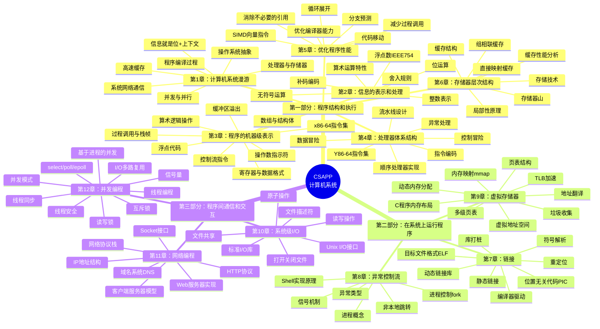

# 📚 深入理解计算机系统（第三版）

## 📖 基本信息

- **原名**: Computer Systems: A Programmer's Perspective (CSAPP)
- **作者**: Randal E. Bryant & David R. O'Hallaron
- **作者背景**: 卡内基梅隆大学教授
- **出版社**: 机械工业出版社
- **出版年份**: 2016年（第三版中译本）
- **课程基础**: CMU 15-213 "Introduction to Computer Systems"
- **页数**: 737页
- **难度等级**: 中高级
- **阅读状态**: 📖 准备开始
- **个人评分**: ⭐⭐⭐⭐⭐
- **标签**: #计算机系统 #底层原理 #汇编语言 #操作系统 #网络编程 #并发

## 📝 内容概要

### 书籍简介
《深入理解计算机系统》（CSAPP）是计算机科学领域最具影响力的经典教材之一。本书从**程序员视角**出发，系统地介绍了计算机系统的核心概念，帮助程序员理解程序在底层是如何运行的。书中融合了计算机组成、操作系统、编译原理、网络编程等多个领域的知识，是连接软件与硬件的桥梁。

### 核心主题
1. **信息表示与处理** - 位运算、整数/浮点数表示、IEEE 754标准
2. **机器级代码** - x86-64汇编、指令集、过程调用、栈帧结构
3. **处理器设计** - 指令集架构、流水线、数据通路
4. **程序优化** - 代码优化策略、缓存友好代码、SIMD
5. **存储体系** - 缓存原理、虚拟内存、内存映射
6. **系统机制** - 链接、异常控制流、信号处理
7. **系统编程** - I/O操作、网络编程、并发编程

### 章节结构

| 部分 | 章节 | 主题 |
|------|------|------|
| **第一部分** | 第1-6章 | 程序结构和执行 |
| **第二部分** | 第7-9章 | 在系统上运行程序 |
| **第三部分** | 第10-12章 | 程序间的通信和交互 |

## 🧠 知识架构



## ✍️ 读书笔记

### 第1章：计算机系统漫游

**本章要点**：从宏观视角介绍计算机系统的核心概念，建立全局认知。

#### 重点摘录
> "本书的目的就是帮助读者理解当执行 hello 程序时，系统发生了什么，以及为什么是这样的。"

#### 1.1 信息就是位+上下文

```c
// hello.c 程序的源文件实际上就是由 0 和 1 组成的位序列
// 每 8 个位组成一个字节，每个字节表示程序中的某个文本字符

#include <stdio.h>
int main() {
    printf("hello, world\n");
    return 0;
}

// ASCII 编码示例：
// '#' -> 35 -> 0x23 -> 00100011
// 'i' -> 105 -> 0x69 -> 01101001
```

**核心概念**：
- 所有信息（磁盘文件、内存数据、网络传输）都是二进制位
- 相同的字节序列在不同上下文中有不同含义
- 系统通过上下文来区分数据类型

#### 1.2 程序的编译过程


```bash
# 完整编译过程
gcc -E hello.c -o hello.i    # 预处理：展开头文件、宏替换
gcc -S hello.i -o hello.s    # 编译：生成汇编代码
gcc -c hello.s -o hello.o    # 汇编：生成目标文件
gcc hello.o -o hello         # 链接：生成可执行文件

# 一步编译
gcc hello.c -o hello
```

#### 1.3 处理器读取并解释存储器中的指令

```c
// 现代处理器采用流水线技术
// CPU 执行指令的基本循环：
while (1) {
    // 取指：从PC指向的内存位置读取指令
    instruction = fetch(PC);

    // 译码：分析指令的含义
    decoded = decode(instruction);

    // 执行：执行指令操作
    result = execute(decoded);

    // 写回：更新寄存器或内存
    writeback(result);

    // 更新PC
    PC = next_pc;
}
```

#### 1.4 存储器层次结构

```
┌─────────────────────────────────────────────┐
│  L0: 寄存器          ~1ns    < 1KB         │ ← 最快、最小
├─────────────────────────────────────────────┤
│  L1: L1缓存(SRAM)    ~2-4ns  ~32KB         │
├─────────────────────────────────────────────┤
│  L2: L2缓存(SRAM)    ~10ns   ~256KB-1MB    │
├─────────────────────────────────────────────┤
│  L3: L3缓存(SRAM)    ~30ns   ~8MB          │
├─────────────────────────────────────────────┤
│  L4: 主存(DRAM)       ~100ns  ~8-64GB      │
├─────────────────────────────────────────────┤
│  L5: 本地磁盘(SSD)    ~100μs  ~1TB         │
├─────────────────────────────────────────────┤
│  L6: 远程存储         ~10ms   无限         │ ← 最慢、最大
└─────────────────────────────────────────────┘

核心原则：越靠近CPU的存储越快但容量越小
```

#### 1.5 操作系统抽象

```c
// 操作系统提供的三个基本抽象：

// 1. 文件 - 对I/O设备的抽象
int fd = open("hello.txt", O_RDONLY);

// 2. 虚拟内存 - 对主存和磁盘的抽象
void *ptr = malloc(1024);  // 进程拥有独立的虚拟地址空间

// 3. 进程 - 对处理器、主存、I/O设备的抽象
pid_t pid = fork();  // 每个进程认为自己独占CPU
```

---

### 第2章：信息的表示和处理

**本章要点**：深入理解计算机如何表示和处理数据，特别是整数和浮点数。

#### 重点摘录
> "计算机用有限数量的位来编码数值，因此运算结果是有限精度的。"

#### 2.1 整数表示

```c
// 无符号数编码
// B2U(X) = Σ(x_i * 2^i), i从0到w-1

// 有符号数（补码）编码
// B2T(X) = -x_{w-1} * 2^{w-1} + Σ(x_i * 2^i), i从0到w-2

// 示例：4位数的表示范围
// 无符号：0 ~ 15
// 有符号：-8 ~ 7

// 类型转换
int x = -1;
unsigned ux = (unsigned)x;  // ux = UMax (4294967295 on 32-bit)

// 有符号与无符号混合运算（危险！）
int a = -1;
unsigned b = 1;
if (a < b) {  // 这个比较会先转为无符号！
    // 不会执行，因为 -1 的无符号表示是一个很大的正数
}
```

#### 2.2 整数运算

```c
// 无符号加法
// 如果 x + y >= 2^w，则结果为 x + y - 2^w

// 补码加法
// 负溢出：x + y < -2^{w-1}
// 正溢出：x + y >= 2^{w-1}

// 检测加法溢出
int tadd_ok(int x, int y) {
    int sum = x + y;
    if (x > 0 && y > 0 && sum <= 0) return 0;  // 正溢出
    if (x < 0 && y < 0 && sum >= 0) return 0;  // 负溢出
    return 1;  // 没有溢出
}

// 乘法溢出
// x * y 的结果可能需要 2w 位来表示
// 但只保留低 w 位
```

#### 2.3 浮点数（IEEE 754标准）

```c
// IEEE 754 浮点数表示：V = (-1)^s * M * 2^E
// s: 符号位 (1位)
// exp: 阶码 (8位float / 11位double)
// frac: 尾数 (23位float / 52位double)

// 浮点数的三种情况：
// 1. 规格化：exp != 0 且 exp != 255
//    E = e - Bias (Bias = 2^{k-1} - 1)
//    M = 1.frac (隐含的1)

// 2. 非规格化：exp = 0
//    E = 1 - Bias
//    M = 0.frac (没有隐含的1)
//    用于表示0和非常小的数

// 3. 特殊值：exp = 255
//    frac = 0: ±无穷大
//    frac != 0: NaN (Not a Number)

// 浮点数精度问题
float a = 0.1f;
float b = 0.2f;
float c = a + b;  // c != 0.3f!

// 安全的浮点比较
bool float_equal(float x, float y) {
    return fabs(x - y) < 1e-6;
}
```

---

### 第3章：程序的机器级表示

**本章要点**：理解x86-64汇编语言，掌握程序的底层执行机制。

#### 重点摘录
> "能够阅读和理解汇编代码是理解程序行为的关键。"

#### 3.1 x86-64 寄存器

```
┌─────────────────────────────────────────────────┐
│  64位        32位      16位    8位     用途     │
├─────────────────────────────────────────────────┤
│  %rax        %eax      %ax     %al     返回值   │
│  %rbx        %ebx      %bx     %bl     被调用者保存│
│  %rcx        %ecx      %cx     %cl     第4个参数 │
│  %rdx        %edx      %dx     %dl     第3个参数 │
│  %rsi        %esi      %si     %sil    第2个参数 │
│  %rdi        %edi      %di     %dil    第1个参数 │
│  %rbp        %ebp      %bp     %bpl    被调用者保存│
│  %rsp        %esp      %sp     %spl    栈指针    │
│  %r8         %r8d      %r8w    %r8b    第5个参数 │
│  %r9         %r9d      %r9w    %r9b    第6个参数 │
│  %r10-%r15   ...       ...     ...     调用者保存│
└─────────────────────────────────────────────────┘
```

#### 3.2 过程调用与栈帧

```c
// C代码
long sum(long x, long y) {
    return x + y;
}

int main() {
    long result = sum(1, 2);
    return 0;
}
```

```asm
// 对应的x86-64汇编
sum:
    // 没有栈帧（叶子函数优化）
    leaq    (%rdi, %rsi), %rax   // result = x + y
    ret                          // 返回

main:
    subq    $16, %rsp            // 分配栈空间
    movq    $2, %rsi             // 第2个参数
    movq    $1, %rdi             // 第1个参数
    call    sum                   // 调用函数
    movq    %rax, -8(%rsp)       // 保存返回值
    movq    $0, %rax             // 返回0
    addq    $16, %rsp            // 释放栈空间
    ret
```

**栈帧结构**：
```
高地址
┌─────────────────┐
│    参数 n       │
│    ...          │
│    参数 1       │
│  返回地址       │ ← 被call指令压入
├─────────────────┤ ← %rbp (可选的帧指针)
│  保存的寄存器   │
│  局部变量       │
│  临时空间       │
├─────────────────┤ ← %rsp (栈指针)
│    ...          │
低地址
```

#### 3.3 控制流指令

```c
// 条件分支
if (x > y)
    return x;
else
    return y;
```

```asm
// 使用条件跳转
cmov:
    cmpq    %rsi, %rdi      // 比较 x 和 y
    cmovg   %rdi, %rsi      // 如果 x > y，将 x 移到结果
    movq    %rsi, %rax      // 返回结果
    ret

// 条件传送（更高效，避免分支预测失败）
max:
    movq    %rdi, %rax      // 假设 x 更大
    cmpq    %rsi, %rdi      // 比较 x 和 y
    cmovle  %rsi, %rax      // 如果 x <= y，使用 y
    ret
```

#### 3.4 循环的汇编表示

```c
// C语言循环
long fact(long n) {
    long result = 1;
    for (long i = 2; i <= n; i++)
        result *= i;
    return result;
}
```

```asm
// 汇编版本（使用跳转）
fact:
    movl    $1, %eax         // result = 1
    movl    $2, %edx         // i = 2
    cmpq    %rdi, %rdx       // 比较 i 和 n
    jg      .L_done          // 如果 i > n，结束

.L_loop:
    imulq   %rdx, %rax       // result *= i
    incq    %rdx             // i++
    cmpq    %rdi, %rdx       // 比较 i 和 n
    jle     .L_loop          // 如果 i <= n，继续

.L_done:
    ret
```

---

### 第4章：处理器体系结构

**本章要点**：通过Y86-64指令集理解处理器的设计原理。

#### 重点摘录
> "现代处理器使用流水线技术来提高指令吞吐量。"

#### 4.1 Y86-64 指令集

```asm
// Y86-64 指令编码示例

// 停止执行
halt:   00

// 无操作
nop:    10

// 数据传送
rrmovq: 20 rA rB      // rB <- rA
irmovq: 30 V rB       // rB <- V (立即数)
rmmovq: 40 rA D(rB)   // Mem[rB+D] <- rA
mrmovq: 50 D(rB) rA   // rA <- Mem[rB+D]

// 算术运算
addq:   60 rA rB      // rB <- rB + rA
subq:   61 rA rB      // rB <- rB - rA
andq:   62 rA rB      // rB <- rB & rA
xorq:   63 rA rB      // rB <- rB ^ rA

// 跳转
jmp:    70 Dest       // 无条件跳转
jle:    71 Dest       // <= 时跳转
jl:     72 Dest       // < 时跳转
je:     73 Dest       // == 时跳转
jne:    74 Dest       // != 时跳转
jge:    75 Dest       // >= 时跳转
jg:     76 Dest       // > 时跳转

// 函数调用
call:   80 Dest       // 调用函数
ret:    90            // 返回

// 栈操作
pushq:  A0 rA         // 压栈
popq:   B0 rA         // 出栈
```

#### 4.2 流水线设计

```
指令执行的5个阶段：

┌─────────┐   ┌─────────┐   ┌─────────┐   ┌─────────┐   ┌─────────┐
│  取指   │ → │  译码   │ → │  执行   │ → │  访存   │ → │  写回   │
│  IF     │   │  ID     │   │  EX     │   │  MEM    │   │  WB     │
└─────────┘   └─────────┘   └─────────┘   └─────────┘   └─────────┘

流水线冒险：
1. 数据冒险：后续指令依赖前面指令的结果
2. 控制冒险：分支指令导致的不确定性
3. 结构冒险：硬件资源冲突
```

---

### 第5章：优化程序性能

**本章要点**：掌握程序优化的核心技术和策略。

#### 重点摘录
> "一个好的编译器会自动完成许多优化，但程序员仍需要理解这些优化原理。"

#### 5.1 代码移动

```c
// ❌ 低效代码：每次循环都调用strlen
void lower1(char *s) {
    for (long i = 0; i < strlen(s); i++)
        if (s[i] >= 'A' && s[i] <= 'Z')
            s[i] -= 'A' - 'a';
}
// 时间复杂度：O(n²)，因为strlen是O(n)

// ✅ 优化版本：将不变的计算移出循环
void lower2(char *s) {
    long len = strlen(s);
    for (long i = 0; i < len; i++)
        if (s[i] >= 'A' && s[i] <= 'Z')
            s[i] -= 'A' - 'a';
}
// 时间复杂度：O(n)
```

#### 5.2 循环展开

```c
// ❌ 原始版本
void sum1(double *a, int n, double *result) {
    double sum = 0;
    for (int i = 0; i < n; i++)
        sum += a[i];
    *result = sum;
}

// ✅ 循环展开版本（2x1展开）
void sum2(double *a, int n, double *result) {
    double sum = 0;
    int i;
    for (i = 0; i < n-1; i += 2) {
        sum += a[i] + a[i+1];
    }
    for (; i < n; i++)
        sum += a[i];
    *result = sum;
}

// ✅ 更好的版本：使用多个累加器（2x2展开）
void sum3(double *a, int n, double *result) {
    double sum0 = 0, sum1 = 0;
    int i;
    for (i = 0; i < n-1; i += 2) {
        sum0 += a[i];
        sum1 += a[i+1];
    }
    *result = sum0 + sum1;
}
```

#### 5.3 分支预测友好代码

```c
// ❌ 分支预测不友好的代码
void bubble_sort(int *a, int n) {
    for (int i = 0; i < n; i++)
        for (int j = 0; j < n-1; j++)
            if (a[j] > a[j+1])  // 分支难以预测
                swap(&a[j], &a[j+1]);
}

// ✅ 条件传送替代分支
int max(int a, int b) {
    return (a > b) ? a : b;
}
// 编译器会生成 cmov 指令，避免分支预测失败
```

#### 5.4 缓存友好代码

```c
// ❌ 缓存不友好：列优先访问（C是行优先存储）
int sum_col(int a[N][N]) {
    int sum = 0;
    for (int j = 0; j < N; j++)      // 内层循环按列访问
        for (int i = 0; i < N; i++)
            sum += a[i][j];
    return sum;
}

// ✅ 缓存友好：行优先访问
int sum_row(int a[N][N]) {
    int sum = 0;
    for (int i = 0; i < N; i++)      // 内层循环按行访问
        for (int j = 0; j < N; j++)
            sum += a[i][j];
    return sum;
}
```

---

### 第6章：存储器层次结构

**本章要点**：理解存储层次结构，编写缓存友好的代码。

#### 6.1 缓存结构

```
直接映射缓存 (E=1)：
┌───────────────────────────────────────────────────┐
│ 组0: │ 有效位 │ 标记 │ 数据块(64字节) │          │
├───────────────────────────────────────────────────┤
│ 组1: │ 有效位 │ 标记 │ 数据块(64字节) │          │
├───────────────────────────────────────────────────┤
│ ...                                              │
└───────────────────────────────────────────────────┘

地址结构：
┌───────────┬───────────┬───────────────────────┐
│  标记(t)  │  组索引(s) │  块偏移(b)            │
└───────────┴───────────┴───────────────────────┘
```

#### 6.2 局部性原理

```c
// 良好的时间局部性：同一变量被多次访问
int sum = 0;
for (int i = 0; i < n; i++)
    sum += a[i];  // sum 在每次迭代都被访问

// 良好的空间局部性：连续访问内存
for (int i = 0; i < n; i++)
    a[i] = 0;     // 连续访问数组元素

// 步长为k的访问模式
// 步长越小，空间局部性越好
for (int i = 0; i < n; i += k)
    a[i] = 0;     // k=1 最好，k越大越差
```

---

### 第7章：链接

**本章要点**：理解编译和链接的过程，掌握静态库和动态库的使用。

#### 7.1 链接过程

```bash
# 编译和链接的完整过程

# 1. 编译源文件为目标文件
gcc -c main.c -o main.o
gcc -c utils.c -o utils.o

# 2. 链接目标文件
gcc main.o utils.o -o program

# 查看符号表
nm main.o

# 查看ELF文件结构
readelf -a main.o
```

#### 7.2 静态库与动态库

```c
// 创建静态库
gcc -c add.c -o add.o
gcc -c sub.c -o sub.o
ar rcs libmath.a add.o sub.o

// 使用静态库
gcc main.c -L. -lmath -o program_static

// 创建动态库
gcc -shared -fPIC -o libmath.so add.c sub.c

// 使用动态库
gcc main.c -L. -lmath -o program_dynamic
```

---

### 第8章：异常控制流

**本章要点**：理解异常、进程和信号机制。

#### 8.1 进程控制

```c
#include <unistd.h>
#include <sys/wait.h>

int main() {
    pid_t pid = fork();

    if (pid == 0) {
        // 子进程
        printf("Child process: pid=%d\n", getpid());
        execl("/bin/ls", "ls", "-l", NULL);
        exit(0);
    } else if (pid > 0) {
        // 父进程
        int status;
        waitpid(pid, &status, 0);
        printf("Child exited with status %d\n", WEXITSTATUS(status));
    } else {
        // fork失败
        perror("fork failed");
    }
    return 0;
}
```

#### 8.2 信号处理

```c
#include <signal.h>
#include <unistd.h>

void sigint_handler(int sig) {
    printf("Caught SIGINT (Ctrl+C)\n");
}

int main() {
    // 注册信号处理函数
    signal(SIGINT, sigint_handler);

    while (1) {
        printf("Running... (pid=%d)\n", getpid());
        sleep(1);
    }
    return 0;
}
```

---

### 第9章：虚拟存储器

**本章要点**：理解虚拟内存机制，掌握动态内存分配。

#### 9.1 虚拟地址空间

```c
#include <stdio.h>
#include <stdlib.h>

int global_init = 100;     // 数据段（已初始化）
int global_uninit;         // BSS段（未初始化）

int main() {
    static int static_var = 200;  // 数据段
    int local_var = 10;           // 栈
    int *heap_var = malloc(100);  // 堆

    printf("代码段: %p\n", main);
    printf("数据段: %p\n", &global_init);
    printf("BSS段: %p\n", &global_uninit);
    printf("栈: %p\n", &local_var);
    printf("堆: %p\n", heap_var);

    free(heap_var);
    return 0;
}
```

#### 9.2 内存映射

```c
#include <sys/mman.h>
#include <fcntl.h>
#include <unistd.h>

int main() {
    // 使用 mmap 映射文件到内存
    int fd = open("test.txt", O_RDWR);
    void *addr = mmap(NULL, 4096, PROT_READ|PROT_WRITE,
                       MAP_SHARED, fd, 0);

    // 直接操作内存
    char *data = (char *)addr;
    data[0] = 'H';

    // 同步到文件
    msync(addr, 4096, MS_SYNC);

    // 解除映射
    munmap(addr, 4096);
    close(fd);
    return 0;
}
```

---

### 第10章：系统级I/O

**本章要点**：掌握Unix I/O接口，理解文件操作的本质。

```c
#include <fcntl.h>
#include <unistd.h>

int main() {
    // 打开文件
    int fd = open("test.txt", O_RDWR | O_CREAT, 0644);

    // 写入数据
    char buf[] = "Hello, World!";
    write(fd, buf, sizeof(buf));

    // 移动文件指针
    lseek(fd, 0, SEEK_SET);

    // 读取数据
    char read_buf[100];
    read(fd, read_buf, sizeof(read_buf));

    // 关闭文件
    close(fd);
    return 0;
}
```

---

### 第11章：网络编程

**本章要点**：掌握Socket编程，理解客户端-服务器模型。

#### 11.1 简单的TCP服务器

```c
#include <sys/socket.h>
#include <netinet/in.h>
#include <unistd.h>
#include <string.h>

int main() {
    int server_fd = socket(AF_INET, SOCK_STREAM, 0);

    struct sockaddr_in addr;
    addr.sin_family = AF_INET;
    addr.sin_port = htons(8080);
    addr.sin_addr.s_addr = INADDR_ANY;

    bind(server_fd, (struct sockaddr*)&addr, sizeof(addr));
    listen(server_fd, 5);

    printf("Server listening on port 8080...\n");

    while (1) {
        int client_fd = accept(server_fd, NULL, NULL);
        char *msg = "HTTP/1.1 200 OK\r\n\r\nHello, World!";
        send(client_fd, msg, strlen(msg), 0);
        close(client_fd);
    }
    return 0;
}
```

---

### 第12章：并发编程

**本章要点**：掌握多进程、多线程和I/O多路复用技术。

#### 12.1 多线程编程

```c
#include <pthread.h>
#include <stdio.h>

void *thread_func(void *arg) {
    int id = *(int*)arg;
    printf("Thread %d running\n", id);
    return NULL;
}

int main() {
    pthread_t threads[4];
    int ids[4];

    for (int i = 0; i < 4; i++) {
        ids[i] = i;
        pthread_create(&threads[i], NULL, thread_func, &ids[i]);
    }

    for (int i = 0; i < 4; i++) {
        pthread_join(threads[i], NULL);
    }
    return 0;
}
```

#### 12.2 线程同步

```c
#include <pthread.h>

pthread_mutex_t mutex = PTHREAD_MUTEX_INITIALIZER;
int counter = 0;

void *increment(void *arg) {
    for (int i = 0; i < 100000; i++) {
        pthread_mutex_lock(&mutex);
        counter++;
        pthread_mutex_unlock(&mutex);
    }
    return NULL;
}
```

---

## 💡 个人思考

### 1. 关于计算机系统抽象的思考

CSAPP最大的价值在于建立了一座桥梁，将上层软件与底层硬件连接起来。理解了这些抽象：
- **文件抽象**让我们无需关心磁盘读写细节
- **虚拟内存抽象**让每个进程都以为自己独占内存
- **进程抽象**让并发编程变得可行

理解这些抽象的边界和代价，是成为优秀程序员的关键。

### 2. 关于性能优化的思考

性能优化遵循一个重要原则：**测量而非猜测**。在优化之前：
1. 建立性能测试基准
2. 使用profiler找到真正的瓶颈
3. 针对性地优化热点代码

很多"优化"实际上是过早优化，不仅浪费时间，还可能引入bug。

### 3. 关于并发编程的思考

并发编程的难点在于：
- **竞态条件**：多线程访问共享资源
- **死锁**：循环等待资源
- **活锁**：线程持续运行但无法前进

解决之道：
- 尽量使用不可变数据
- 最小化锁的粒度
- 使用高级并发原语

---

## 🎯 实践应用

### 实践计划

**Lab实验系列**：
- [ ] Data Lab - 位操作和整数表示
- [ ] Bomb Lab - 逆向工程
- [ ] Attack Lab - 缓冲区溢出攻击
- [ ] Cache Lab - 缓存模拟器
- [ ] Shell Lab - 实现简易Shell
- [ ] Malloc Lab - 内存分配器
- [ ] Proxy Lab - Web代理服务器

### 代码检查清单

**性能优化检查**：
- [ ] 是否消除了不必要的函数调用
- [ ] 循环是否展开
- [ ] 内存访问是否连续
- [ ] 是否利用了SIMD指令

**系统编程检查**：
- [ ] 是否正确处理了返回值
- [ ] 是否释放了动态内存
- [ ] 是否正确处理了信号
- [ ] 是否避免了竞态条件

---

## 🔗 相关扩展

### 相关书籍
| 书名 | 作者 | 推荐理由 |
|------|------|---------|
| 《操作系统导论》 | Remzi Arpaci | 系统学习操作系统原理 |
| 《现代操作系统》 | Tanenbaum | 经典操作系统教材 |
| 《TCP/IP详解》 | Stevens | 网络编程权威指南 |
| 《UNIX环境高级编程》 | Stevens | 系统编程圣经 |

### 在线资源
- [CMU 15-213 课程主页](http://www.cs.cmu.edu/~213/)
- [CSAPP 官方网站](http://csapp.cs.cmu.edu/)
- [CSAPP Lab 实验](http://csapp.cs.cmu.edu/3e/labs.html)

### 开源项目
- [Y86-64 模拟器](https://github.com/initializexec/y86-64)
- [CSAPP Notes](https://github.com/stationhippos/CSAPP-Notes)

---

## 📊 学习总结

### 最大收获

1. **系统思维**：理解计算机各层抽象之间的关系
2. **底层视角**：能够阅读汇编，理解程序真正在做什么
3. **性能意识**：知道什么代码高效，什么代码低效
4. **并发能力**：掌握多线程和网络编程基础

### 改变的观念

| 旧观念 | 新观念 |
|--------|--------|
| 代码写对就行 | 代码要正确且高效 |
| 编译器会优化一切 | 理解优化原理才能写出好代码 |
| 内存是无限的 | 内存层次结构决定性能 |
| 并发就是多线程 | 并发有多种实现方式 |

---

## 📈 阅读进度

- [ ] 第1章：计算机系统漫游
- [ ] 第2章：信息的表示和处理
- [ ] 第3章：程序的机器级表示
- [ ] 第4章：处理器体系结构
- [ ] 第5章：优化程序性能
- [ ] 第6章：存储器层次结构
- [ ] 第7章：链接
- [ ] 第8章：异常控制流
- [ ] 第9章：虚拟存储器
- [ ] 第10章：系统级I/O
- [ ] 第11章：网络编程
- [ ] 第12章：并发编程

**阅读完成度**: 0%
**预计时间**: 3-6个月

---

**创建日期**: 2026-03-31
**最后更新**: 2026-03-31
**阅读状态**: 📖 准备开始

---

**Sources**:
- [CSAPP 官方网站](http://csapp.cs.cmu.edu/)
- [CMU 15-213 课程](http://www.cs.cmu.edu/~213/)
- [深入理解计算机系统 PDF](https://b3logfile.com/pdf/article/1578464536234.pdf)
- [CSAPP 豆瓣](https://book.douban.com/subject/1230413/)
