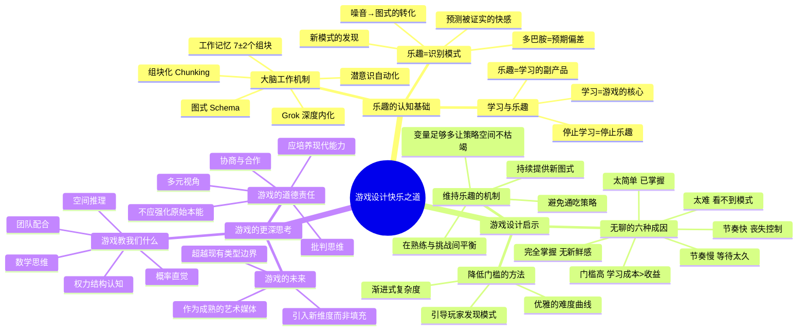

# 📚 《游戏设计快乐之道》读书笔记

## 📖 基础信息

- **英文原名**: A Theory of Fun for Game Design（第2版·10周年纪念版）
- **作者**: Raph Koster（拉夫·科斯特）
- **作者背景**: 《网络创世纪》（Ultima Online）、《星球大战网络版》（Star Wars Galaxies）首席创意师、前索尼在线娱乐首席创意官、认知科学+创意写作+诗歌艺术跨学科背景
- **出版社**: O'Reilly Media / 暂未查到中译出版社
- **出版年份**: 2013年（英文第2版）/ 2005年（第1版）
- **页数**: 约279页（图文各半）
- **开始阅读**: 2026-07-15
- **阅读状态**: ☐ 正在阅读
- **个人评分**: ⭐⭐⭐⭐⭐
- **标签**: #游戏设计 #认知科学 #乐趣理论 #学习 #RaphKoster

## 📖 内容概要

### 书籍简介

这不是一本教你"怎么做游戏"的书——全书没有一行代码，没有一个设计文档模板。Koster 做了一件更根本的事：**他回答了"游戏为什么有趣"这个终极问题。**

全书以大量手绘卡通插图配合简练文字，深入浅出地阐述了一个至今影响力不衰的核心论点：**游戏的本质是学习，乐趣来自于大脑对模式的识别、掌握和内化。** 当一个游戏不再能提供可学习的新模式时，它就会变得无聊——这就是为什么你会放下曾经沉迷的游戏。

第2版（2013）新增了"十年后"附言，Koster 回顾了书出版后十年间游戏行业的变化（手游崛起、社交游戏泛滥、F2P 模式争议）并重新审视了最初的理论。

### 核心主题

1. **游戏 = 学习** — 乐趣不是游戏的专属，而是大脑识别和掌握模式时产生的副产品
2. **图式与噪音** — 大脑热爱可理解的结构（图式），厌恶无法解读的混沌（噪音）——学习就是不断将噪音转化为图式的过程
3. **组块化** — 当技能写入潜意识，释放出心智资源去应对更复杂的新模式，人就会感受到"进步"和"精通"
4. **无聊的六种成因** — 太简单/太难/门槛太高/节奏太慢/节奏太快/完全掌握
5. **游戏在教我们什么？** — 很多游戏仍在教原始生存技能（跳跃、射击、非黑即白），应该教更现代的能力（协商、批判思维、多元视角）

### 主要章节（12章）

| 章节 | 主题 |
|------|------|
| 第1章 | 为什么写这本书 |
| 第2章 | 大脑如何工作 — 组块化、图式、Grok |
| 第3章 | 游戏是什么 — 作为学习工具的交互系统 |
| 第4章 | 游戏教给我们什么 — 数学、空间推理、概率、权力结构 |
| 第5章 | 游戏不是什么 — 驳斥故事的过度强调 |
| 第6章 | 不同的人有不同的快乐 — 个体差异与玩家偏好 |
| 第7章 | 学习的问题 — 为什么学习有时是痛苦而不是乐趣 |
| 第8章 | 人的问题 — 认知偏见、社会压力对游戏的影响 |
| 第9章 | 大背景下谈游戏 — 游戏在历史和社会中的位置 |
| 第10章 | 娱乐的道德观 — 游戏设计师的社会责任 |
| 第11章 | 游戏何去何从 — 未来游戏应该教给我们什么 |
| 第12章 | 游戏的合适定位 — 游戏作为成熟媒体 |

---

## 🧠 知识架构

---

## ✍️ 分章笔记

### 第1-2章：为什么写这本书 + 大脑如何工作

**核心概念：组块化与图式**

Koster 用"组块化"解释了一切。人类工作记忆极其有限（约7±2个信息单元），但我们通过"组块化"将复杂操作打包：一个初学钢琴的孩子需要逐音逐指地处理，而钢琴大师"演奏一首肖邦夜曲"只是一个组块。

**图式 = 组块的知识结构**：当"弹奏肖邦"从一个需要全身心投入的任务变成了一个自动化的图式时，认知资源被释放出来，可以同时处理表达、情感演绎、与乐队的互动。

**游戏设计的启示**：一款好游戏是不断发生的"组块化→遇到新挑战→重新组块化"的过程。当玩家说"我上手了"的那一刻，就是组块化完成的时刻——也是游戏需要提供新层次挑战的时刻。

**Grok**：源自 Heinlein 科幻小说《异乡异客》——意为"理解到成为它的一部分"。你的肌肉记忆、你的直觉反应、你"不用想就知道"的东西——这些就是你已经 Grok 了的东西。

> **Koster 定律**："一旦你理解了游戏，游戏就变得无聊了。"

### 第3-4章：游戏是什么 + 游戏教给我们什么

**游戏的本质定义**：游戏是**结构化的学习体验**。不同于学校的学习（抽象、缓慢、无即时反馈），游戏的学习是**具象、高效、有即时反馈**的。

**游戏训练的能力清单**：
- 数学（几乎所有游戏都涉及数字计算）
- 空间推理（从俄罗斯方块的旋转到FPS的弹道预测）
- 概率直觉（抽卡、命中率、暴击——玩家不需要知道概率公式，但他们的"直觉"在不断校准）
- 团队配合（多人游戏的资源分配、战场沟通）
- 权力结构（模拟游戏中对社会规则的体验）

**核心洞察**：游戏之所以让人欲罢不能，因为它们在**低风险环境中提供高密度学习**。你可以在《文明》中体验数千年帝国兴衰而不承受任何真实代价。

### 第5-7章：游戏不是什么 + 学习的问题

**驳"故事中心论"**：Koster 指出，故事是"消耗品"（读过一次就不会再读），但机制是可以重复玩的。游戏的核心是机制而非叙事。好的叙事应该为机制服务，而不是机制为叙事让路。

**学习为什么有时是痛苦而非乐趣**：
1. 学习失败（看不懂→沮丧→放弃）
2. 学习压力（必须学会→焦虑→反感）
3. 学习无反馈（不知道对不对→迷茫→放弃）

**游戏解决这些问题的秘诀**：
1. 设置合适难度（刚好能看出模式）
2. 降低失败的代价（可以无限重试）
3. 即时反馈（每个操作都有明确的结果）

### 第8-12章：人的问题 → 道德观 → 未来

**游戏的道德盲区**：
- 大多数游戏仍训练"原始生存技能"：暴力解决冲突、非黑即白思维、等级服从、对其他团体的敌意
- 这些"课程"嵌入在令人愉悦的奖励循环中，玩家不知不觉被影响

**Koster 的未来展望**：
- 游戏应该教"现代技能"：协商、批判思维、系统思考、多元文化理解
- 创新不是"填充现有元素"（给FPS加RPG元素=渐变创新），而是"引入新维度"（如《时空幻境》的时间操作=真正的创新）
- 游戏作为一种媒介，还远远没有达到其表达能力的上限

---

## 💭 个人思考

### 关于"乐趣=学习"的验证

Koster 的理论可以用个人经验轻松验证：你什么时候会放下一个游戏？当你不再从中学到新东西的时候。俄罗斯方块你玩了300小时后放弃了，不是因为"不好玩"，而是因为你的大脑已经 Grok 了方块旋转组合的所有可能性，游戏从"解谜惊喜"变成了"纯粹反应力"。

### 关于"故事 vs 机制"的重新思考

Koster 说故事是消耗品，这听起来偏激，但数据支持他的判断：剧情的游戏玩家通常只通关一次，而机制好的游戏（如《杀戮尖塔》《文明》）玩家会玩上千小时。《最后生还者》的故事是神作，但你通关了几次？《星际争霸》你玩了多少局？

这不是说故事不重要——故事提供"第一次体验"的情感浓度，机制提供"可重复体验"的深度。好的游戏两者兼具。

---

## 📊 学习总结

**最大的收获**：**"当我理解了游戏的那一刻，游戏就变得无聊了"**——理解了这句话，就理解了游戏设计的一切。你的任务不是做一个"好玩的游戏"，而是做一个"持续有东西可学的游戏"。

**改变的观念**：
1. "乐趣 = 特殊的、不能分析的东西" → "乐趣 = 学习（模式识别）+ 反馈（即时验证）+ 新挑战（更高层次图式）"
2. "故事是游戏最好的部分" → "机制是骨骼，故事是皮肤"
3. "上瘾 = 不好的" → "上瘾 = 持续学习中，关键在于教的是什么东西"

---

**笔记创建时间**: 2026-07-15 | **最后更新**: 2026-07-15 | **笔记版本**: v1.0

**Sources**: [豆瓣书评](https://book.douban.com/review/10023997/) · [Google Books](https://books.google.com/books?id=TS8KAgAAQBAJ)
