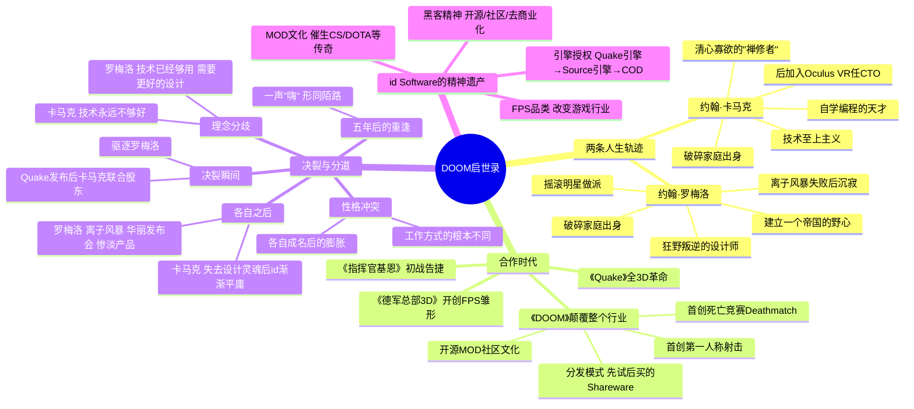

# 📚 《DOOM启世录》读书笔记

## 📖 基础信息

- **英文原名**: Masters of DOOM: How Two Guys Created an Empire and Transformed Pop Culture
- **作者**: David Kushner（大卫·库什纳）
- **作者背景**: 滚石杂志撰稿人、科技记者，擅长以文学笔法书写科技与游戏史
- **译者**: 孙振南
- **出版社**: 电子工业出版社（博文视点）
- **出版年份**: 2015年10月（纪念版）/ 2004年（首版）
- **页数**: 约320页
- **开始阅读**: 2026-07-15
- **阅读状态**: ☐ 正在阅读
- **个人评分**: ⭐⭐⭐⭐⭐
- **豆瓣评分**: 9.3
- **标签**: #游戏历史 #FPS #idSoftware #约翰卡马克 #约翰罗梅洛 #纪实文学

## 📖 内容概要

### 书籍简介

这不是一本游戏设计教科书，而是一部**游戏行业的史诗**。David Kushner 用记者式的精练笔法和小说式的叙事节奏，讲述了 id Software 的两位创始人——**约翰·卡马克**（编程天才，3D 引擎之父）和**约翰·罗梅洛**（狂野设计师，死亡竞赛发明者）——如何用两台电脑和一箱披萨，创造了《DOOM》《Quake》等改变世界游戏史的革命性作品，又在最辉煌的时刻走向决裂。

这本书被 Microsoft、Dell、Amazon 等公司选为内部推荐读物，豆瓣评分 9.3，71% 的读者给出五星。它不仅仅是一本游戏传记，更是一本关于**天才、合作、梦想与代价**的经典商业故事。

### 核心主题

1. **两个天才的共生与决裂** — 游戏界的"列侬与麦卡特尼"：卡马克是引擎，罗梅洛是火花；合则天下无双，分则两败俱伤
2. **黑客精神** — 开源、MOD 社区、不受商业利益束缚的纯粹技术追求
3. **技术革命** — 从2D到3D、从静态到实时渲染，id Software 每次都站在技术浪潮之巅
4. **游戏产业的形成** — 死亡竞赛、在线对战、MOD 文化、FPS 品类——太多游戏行业的基石都是 id 奠定的
5. **天才的代价** — 极致专注的代价是人际关系、健康和生活平衡的牺牲

---

## 🧠 知识架构

---

## ✍️ 核心故事笔记

### 黄金搭档：为什么是"两个约翰"创造了奇迹

Kushner 揭示了 id Software 成功的核心配方：**编程天才 + 设计狂人 = 改变世界的产品**。

| 维度 | 卡马克 | 罗梅洛 | 互补效应 |
|------|--------|--------|----------|
| 核心竞争力 | 3D引擎/渲染算法 | 关卡设计/游戏感觉 | 引擎赋予可能，设计释放潜能 |
| 工作方式 | 闭关写代码，孤独编程 | 团队动员，头脑风暴 | 一个人做引擎，一个人带队挖掘引擎潜力 |
| 驱动力 | 技术挑战本身 | 成功、名誉、改变世界 | 卡马克需要罗梅洛告诉他"这个技术能做什么好玩的" |
| 弱点 | 忽视设计深度 | 忽视技术边界 | 两人的弱点恰好被对方的强项覆盖 |

**溃败的教训**：当两人分开后，罗梅洛失去了卡马克的引擎优势，"离子风暴"做的《大刀》成为游戏史上最大的翻车之一。卡马克失去了罗梅洛的设计引领，id Software 再也没能做出超越《DOOM》和《Quake》的新品类。

### DOOM 如何改变一切（1993）

**技术革命**：
- 首个平滑纹理映射的3D引擎
- 光照衰减、非正交墙壁、可变高度——这些在1993年是魔法

**商业模式革命**：
- **Shareware（共享软件）模式**：免费发布第一章，想玩后续付费
- 这是最早的"试玩→购买"模型，比 App Store 的"免费下载+内购"早 15 年

**文化革命**：
- **死亡竞赛（Deathmatch）**：历史上第一个 PvP FPS 模式
- **MOD 社区**：卡马克坚持开源引擎代码，玩家自制关卡和 MOD 爆发式增长
- DOOM 在1995年的安装量超过了 Windows 95 的安装量

**社会争议**：
- Columbine 高中枪击案后，DOOM 成为暴力游戏争议的中心
- 卡马克的回应："游戏没有让人暴力，暴力的人玩暴力游戏"

### 两个天才的不可避免的决裂

Kushner 把这段写得像摇滚乐队的解散一样戏剧化：

**罗梅洛的膨胀**：
- DOOM 成功后成为"游戏界第一个摇滚明星"——法拉利跑车、豪宅、海报式宣传照
- "我要创建一个帝国"——忘记了 id 的核心力量是卡马克的引擎

**卡马克的沉默积累**：
- 罗梅洛在享乐和造势时，卡马克在通宵写 Quake 引擎
- 技术上的压力 = "唯一能拯救我们的引擎又一次落后了必须继续加班"
- 对罗梅洛的不满逐日积累

**最后的爆发**：
- Quake 的开发周期被罗梅洛的"完美主义"无限拖延
- 卡马克在 Quake 发售后发动"政变"：要求罗梅洛辞职
- 没有争吵、没有打斗——罗梅洛安静地收拾东西，离开了他创立的公司

**五年后的重逢**：
> 卡马克和罗梅洛在 QuakeCon 上再次见面。全场期待一个感性的和解。罗梅洛走过去，卡马克转过来。两人对望一秒。
> "嗨。"
> "嗨。"
> 就是这么简单。没有拥抱，没有眼泪，没有道歉。两个曾经创造了历史的人，如今只是两个陌生人。

---

## 💭 个人思考

### 关于"天才合作关系"的深层解读

id Software 的故事重复了一个千古不变的公式：
**天才 = 极致的专注 + 极致的代价**

卡马克的专注让他创造了改变世界的技术，但也让他失去了合作伙伴、社交生活和婚姻。罗梅洛的野心让他将 DOOM 推向了神话般的文化影响力，但也让他被自己的自负反噬。

"游戏界的列侬与麦卡特尼"的比喻非常精准——两个人在合体时做出了一个人永远无法做出的作品，但合体的前提恰恰是两个截然不同的灵魂的张力。当张力消失（一方妥协或一方退出），创造力也随之消失。

### 关于技术 vs 设计的永恒辩论

id Software 的故事也是"技术 vs 设计"辩论的最极致案例：

| 主张 | 代表人物 | 结果 |
|------|--------|------|
| "技术决定一切" | 卡马克 | 做出了史上最好的3D引擎，但游戏性越来越平庸 |
| "设计决定一切" | 罗梅洛 | 有最酷的设计理念，但没有引擎支持就是空中楼阁 |
| **"技术与设计缺一不可"** | **id 黄金时代** | **做出了改变世界的 DOOM** |

这个辩证关系在我的个人游戏开发中同样成立：沉迷 Godot 的 GDScript 优化（技术陷阱）和沉迷无限的设计迭代（设计陷阱）都是致命的。需要同时戴"卡马克帽子"（这个功能技术上怎么最优实现）和"罗梅洛帽子"（这个功能玩家会爽吗）。

---

## 📊 学习总结

**最大的收获**：**最伟大的产品来自互补型的合作，而非单打独斗。** 找到能弥补你盲区的人，比独自努力重要一百倍。

**改变的观念**：
1. "成功的关键是天才" → "成功的关键是让互补的天才能一起工作"
2. "技术是最重要的" → "技术是必要条件，设计才是灵魂"
3. "开源 = 放弃赚钱" → "开源 = 创造生态 = 更大的护城河"

---

**笔记创建时间**: 2026-07-15 | **最后更新**: 2026-07-15 | **笔记版本**: v1.0

**Sources**: [豆瓣评分 9.3](https://book.douban.com/subject/26642310/) · [百度百科](https://baike.baidu.com/item/DOOM启世录/8478814)
