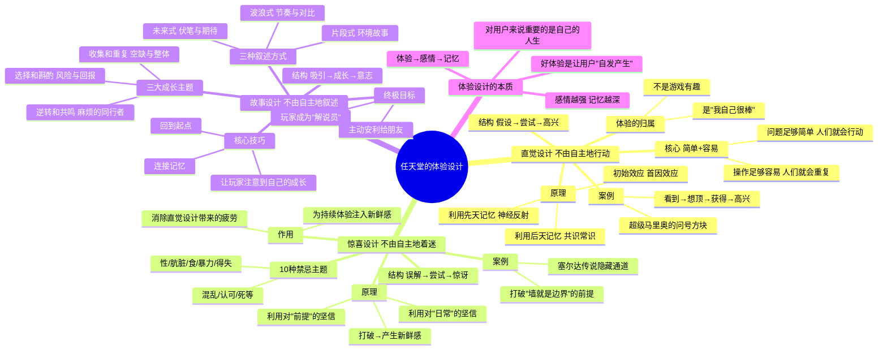

# 📚 《任天堂的体验设计》读书笔记

## 📖 基础信息

- **日文原名**: 「ついやってしまう」体験のつくりかた
- **作者**: 玉树真一郎（1977年生）
- **作者背景**: 前任天堂员工，Wii 游戏机策划负责人（全球销量超1亿台），以程序员入職后转设计师，参与 Wii 硬件、软件、网络服务全流程策划。2010年离职创业，成立"理解事务所"
- **译者**: 王芳
- **出版社**: 电子工业出版社
- **出版年份**: 2021年
- **页数**: 314页
- **开始阅读**: 2026-07-15
- **阅读状态**: ☐ 正在阅读
- **个人评分**: ⭐⭐⭐⭐
- **豆瓣评分**: 7.5
- **标签**: #任天堂 #体验设计 #直觉设计 #惊喜设计 #故事设计 #脑科学

## 📖 内容概要

### 书籍简介

这本书来自任天堂内部的第一手设计哲学。作者玉树真一郎曾在任天堂工作，是 Wii 游戏机的策划负责人（全球销量超1亿台）。他从脑科学、认知心理学和学习心理学的角度，揭开了任天堂游戏"为什么让人不知不觉玩下去"的秘密。

全书围绕**三大体验设计框架**展开，用《超级马里奥》《塞尔达传说》《勇者斗恶龙》《最后生还者》《风之旅人》等经典游戏案例，将任天堂那种"看似简单但极度精妙"的设计直觉转化为可复用的方法论。三者的递进关系构成了完整的游戏体验设计闭环：**直觉让人上手 → 惊喜让人沉迷 → 故事让人传播。**

本书不仅适用于游戏设计，也可用于产品设计、UX设计、服务设计、团队管理等领域。

### 核心主题

1. **直觉设计** — 让人"不由自主地行动"，零思考的操作
2. **惊喜设计** — 让人"不由自主地着迷"，打破疲劳和厌倦
3. **故事设计** — 让人"不由自主地想叙述"，触发传播本能
4. **"不是产品有趣，而是用户自己有趣"** — 体验设计的终极哲学

---

## 🧠 知识架构



---

## ✍️ 核心概念笔记

### 直觉设计：假设 → 尝试 → 高兴

这是任天堂设计哲学中最基础也最强大的部分。玉树用一个令人震撼的洞见开篇：

> **"改变人们行为方式的，不是说服，不是激励，而是简单和容易。"**

**直觉设计的运作机制**：
```
玩家看到[刺激] → 产生[假设] → 执行[尝试] → 获得[反馈] → 感到[高兴]
```

**关键洞察**：让玩家高兴的不是"游戏好厉害"，而是**"我好厉害"**——玩家在未经任何指导的情况下，凭直觉做出了正确的操作，这是一种深刻且有成瘾性的愉悦。

**马里奥问号方块案例**：
- 玩家看到一个悬浮在空中的闪亮方块 → "那里面一定有什么东西"（假设）
- 走过去跳起来撞一下 → "果然有！"（尝试成功）
- 获得金币/蘑菇（高兴）
- 正反馈循环完成 → 玩家会本能地寻找下一个方块

**设计原则**：
- 利用**先天记忆**（神经反射、本能反应）——看到闪亮的东西会注意，看到移动的东西会追踪
- 利用**后天记忆**（共识常识、文化期待）——箱子应该被打开、门应该被推开
- **初始效应**——体验的开始阶段人们注意力和学习能力最高，前5分钟决定玩家会不会留下

### 惊喜设计：误解 → 尝试 → 惊讶

**惊喜设计的核心**：持续的同一种设计会让人疲倦（即使再好的设计也会被适应）。惊喜是打破疲劳的唯一方式。

**惊喜设计的运作机制**：
```
玩家持有[坚信] → 被设计[颠覆] → [惊讶] → 重新燃起探索欲
```

**《塞尔达传说》隐藏通道案例**：
- 玩家坚信"墙是不可通过的"
- 在某个特定地点，炸弹炸开了墙壁
- 玩家震惊："原来还可以这样！"
- 从这一刻开始，玩家对**每一堵墙**都开始怀疑——这就是惊喜设计的终极效果

**10种禁忌主题**：性、肮脏、食、暴力、得失、混乱、认可、死——人类对这些主题有天生的、强烈的情感反应。在合适的时机触碰这些主题，能创造最强烈的惊喜。

**🎯 借鉴点**：惊喜设计的核心逻辑是**"给玩家一个非常合理的错误假设，然后在恰当的时机打破它"**。在我的 Godot 项目中，这意味着在设计每个区域时，需要考虑"玩家会形成什么假设？在什么时机打破这个假设最有力？"

### 故事设计：吸引 → 成长 → 意志

**故事设计的终极目标**：让玩家从"玩游戏的人"变成"讲游戏的人"。

**"回到起点"技巧**：最好的游戏故事不是让玩家看到成长，而是让玩家**感受到自己的成长**。《风之旅人》的结尾，你看到远处的雪山时，回想起你穿越整个沙漠和地下通道的旅程——这种"我用双脚走过的路"的叙事，比任何文字和过场动画都更有力量。

**三大成长主题**：
1. **收集和重复**：缺口带来焦虑，补全带来满足——《精灵宝可梦》的集齐全图鉴
2. **选择和斟酌**：风险越大，成功后的满足感越强——这是"选择 = 情感投资"的另一种表达
3. **逆转和共鸣**：最讨厌的角色（如《最后生还者》开头的 Joel）变成你最关心的角色，这种"态度逆转"是最强烈的成长叙事

---

## 💭 个人思考

### 关于"不是游戏有趣，是玩家自己有趣"

玉树的这个观点，实际上与 Koster 的"游戏=学习"理论、Isbister 的"选择产生情感"理论形成完美的三角互证：

| 作者 | 核心观点 | 与玉树的关联 |
|------|---------|------------|
| Koster | 乐趣=识别和掌握模式时的副产品 | 直觉设计 = 让玩家自己"发现和掌握" |
| Isbister | 情感来自玩家自己的选择 | 故事设计 = 让玩家自己"经历和成长" |
| **玉树** | 体验来自玩家对"自己很棒"的认知 | **这不是一个"设计技术"观点，而是一个"设计哲学"观点** |

### 关于三大设计的项目应用顺序

在个人游戏项目的不同阶段，三大设计的优先级不同：
- **原型阶段**：直觉设计优先——核心操作必须"0思考可完成"
- **Alpha阶段**：惊喜设计密集——玩家已经开始疲劳，需要新鲜感
- **Beta/打磨阶段**：故事设计完整——当玩家已经投入时间，要给他们"值得讲给朋友听"的体验

---

## 📊 学习总结

**最大的收获**：**"好体验不是做出来的，是让用户自发产生的。"** 设计的目标不是"做一个好游戏"，而是"创造条件让玩家自己觉得自己很棒"。

**改变的观念**：
1. "设计=制作" → "设计=创造条件让用户自己发现和感受"
2. "难度=障碍" → "难度=让成功更有意义的必要前提"
3. "故事=写剧情" → "故事=让玩家感受到自己的成长"

---

**笔记创建时间**: 2026-07-15 | **最后更新**: 2026-07-15 | **笔记版本**: v1.0

**Sources**: [微信读书](https://weread.qq.com/web/bookDetail/ef932fb07274b521ef9d17b) · [豆瓣](https://book.douban.com/subject/35643201/)
