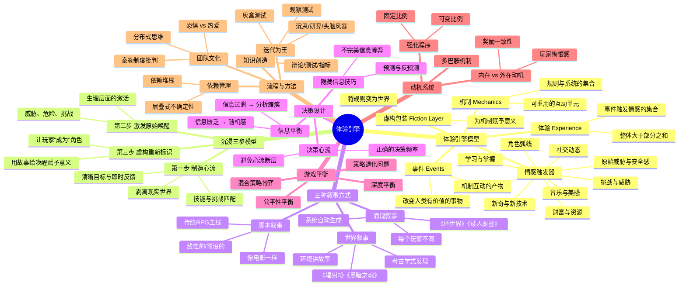

# 📚 《体验引擎：游戏设计全景探秘》读书笔记

## 📖 基础信息

- **英文原名**: Designing Games: A Guide to Engineering Experiences
- **作者**: Tynan Sylvester（泰南·西尔维斯特）
- **作者背景**: 《RimWorld》（环世界）独立开发者、前 Irrational Games 设计师（参与《生化奇兵：无限》）、Gamasutra 专栏作者、自2000年起从事游戏设计
- **译者**: 秦彬（Black Qin）
- **出版社**: 电子工业出版社 / O'Reilly Media
- **出版年份**: 2015年3月（中文版）/ 2013年（英文原版）
- **页数**: 408页
- **开始阅读**: 2026-07-15
- **完成阅读**: -
- **阅读状态**: ☐ 正在阅读
- **个人评分**: ⭐⭐⭐⭐⭐
- **豆瓣评分**: 9.4
- **标签**: #游戏设计 #体验工程 #情感触发器 #涌现叙事 #RimWorld #系统设计

## 📖 内容概要

### 书籍简介

《体验引擎》是一本被严重低估的游戏设计经典——它的豆瓣评分（9.4）高于《游戏设计艺术》（9.3），但知名度远不如后者。作者 Tynan Sylvester 是《环世界》（RimWorld）的独立开发者、前《生化奇兵：无限》的核心设计师，这种"3A + 独立游戏"的双重背景使他的视角既有理论高度又有落地能力。

本书的核心命题是：**游戏不是内容的包装，而是体验的工程。**Sylvester 提出了一套完整的"体验引擎"模型——从人类情感触发器的底层心理学出发，系统拆解了游戏如何通过机制互动产生事件、事件如何触发情感、情感如何聚合为体验的全过程。全书分为三部分：体验引擎理论（第1章）→ 游戏制作实践（第2-10章）→ 开发流程与团队管理（第11-17章）。

本书也是唯一一本同时深度覆盖**涌现叙事**（Emergent Narrative）和**系统设计思维**的游戏设计书籍——这与 Sylvester 制作《环世界》所用的"A故事生成器而非殖民模拟器"设计哲学完全一致。

### 核心主题

1. **体验引擎模型** — 机制 → 虚构包装 → 事件 → 情感触发器 → 情感 → 体验
2. **沉浸感三步法** — 制造心流（剥离现实）→ 激发原始唤醒（生理反应）→ 用虚构层重新标识（情感归属）
3. **三种叙事方式** — 脚本叙事（线性的）/ 世界叙事（环境驱动的）/ 涌现叙事（系统生成的）
4. **优雅原则** — 用最低复杂度成本获得最高情感回报
5. **决策即交互核心** — 信息平衡、心流中的决策范围、避免心流断层
6. **迭代胜过规划** — 灰盒测试、观察测试、有机流程，批判过度规划

### 主要章节（3部分17章）

**第1部分：体验引擎（第1章）**
- 机制与事件、情感黑盒、情感触发器分类、虚构层、心流与沉浸感、沉浸感三步模型

**第2部分：游戏制作（第2-10章）**
- 优雅（第2章）、技巧深度与弹性挑战（第3章）、三种叙事（第4章）、决策与交互（第5章）、平衡性（第6章）、多人游戏与博弈论（第7章）、动机与强化程序（第8章）、界面设计（第9章）、市场与定位（第10章）

**第3部分：开发流程（第11-17章）**
- 规划与迭代（第11章）、知识创造（第12章）、依赖性管理（第13章）、权利与决策分发（第14章）、团队动力（第15章）、复杂决策（第16章）、设计师价值观（第17章）

---

## 🧠 知识架构



---

## ✍️ 分章笔记

### 第1章：体验引擎 — 全书理论基石

**核心观点**：Sylvester 用整章构建了他的核心理论框架——**体验引擎模型**。

**体验引擎的工作流程**：
```
机制(Mechanics) → 虚构包装(Fiction) → 事件(Events) → 情感触发器(Emotional Triggers) → 情感(Emotion) → 体验(Experience)
```

这个模型的关键洞察是：**设计师不直接设计体验或情感。设计师设计的是机制和事件——玩家的情感是这些机制互动的涌现产物。**

**情感触发器分类**（十余种激发玩家情感的基本元素）：

| 触发器类型 | 说明 | 游戏示例 |
|-----------|------|----------|
| 学习与掌握 | 理解新机制的快感 | 《旷野之息》发现新能力组合 |
| 挑战与威胁 | 面对危险时的兴奋 | 《黑暗之魂》Boss战 |
| 角色弧线 | 角色成长引发的共情 | 《最后生还者》Joel的转变 |
| 社交动态 | 人与人的互动情感 | 《Among Us》背叛与信任 |
| 财富与资源 | 获得到失去的落差 | 《文明》资源博弈 |
| 音乐与美感 | 纯粹的审美体验 | 《风之旅人》沙漠滑行 |
| 新奇感 | 发现未知的喜悦 | 《空洞骑士》新区域 |
| 原始威胁 | 本能级的恐惧 | 《生化危机》脚步声 |
| 性暗示 | 吸引力驱动的行为 | 约会模拟类 |

**沉浸感三步模型**（基于情绪二因论）：

```
第一步：制造心流 → 第二步：激发原始唤醒 → 第三步：虚构重新标识
剥离现实世界         让玩家心跳加速           用故事给唤醒赋予意义
(挑战匹配技能)       (威胁、危险、压力)        ("这不是焦虑，这是勇敢")
```

Sylvester 指出，单纯的"心流"并不等于"沉浸"。一个俄罗斯方块玩家完美地处于心流状态，但他不会感觉自己是"方块军人"。沉浸 = 心流 + 生理唤醒 + 虚构层的意义标签。

**🎯 借鉴点**：沉浸感三步模型直接挑战了"心流就是沉浸"的常见误解。在我的游戏项目中，这意味着不能只做挑战匹配（心流），还要有意识地设计"唤醒时刻"（突然的威胁、意外的惊喜、重大的发现），然后用叙事包装给这些唤醒赋予意义。

---

### 第2章：优雅（Elegance）

**核心观点**：Sylvester 定义"优雅"为——**用最低的复杂度成本（玩家认知成本 + 开发成本）获得最高的情感回报**。

他用了《星际争霸2》中"掠夺者 vs 恶火"的经典案例：

| 维度 | 掠夺者（Marauder） | 恶火（Hellion） |
|------|-------------------|-----------------|
| 角色 | 笨重、高血量、减速弹 | 快速、低血量、直线火焰 |
| 对抗关系 | 掠夺者→克制→恶火 | 恶火→克制→轻甲单位 |
| 优雅度 | 中等（与其他单位差异不够大） | 高（速度+直线攻击创造了独特的操作体验） |

**优雅公式**：
```
优雅 = 情感回报 / (认知复杂度 + 开发复杂度)
```

---

### 第3章：技巧（Skill）

**核心观点**：技巧设计的关键是同时实现**深度**和**可及性**——易学难精。

**核心概念**：

| 概念 | 说明 |
|------|------|
| **技巧范围** | 一个机制能容纳的技巧差距有多大？（新手与大神的差距） |
| **弹性挑战** | 挑战难度随玩家技能动态适应 |
| **自我再造** | 游戏的技巧天花板能持续扩展（如《星际争霸》20年后仍在开发新战术） |
| **失败陷阱** | 失败后惩罚太重 → 玩家放弃；惩罚太轻 → 玩家不在乎 |

---

### 第4章：故事（Narrative）

**核心观点**：这是全书最精彩的一章。Sylvester 将游戏叙事分为三种类型：

**三种叙事方式对比**：

| 类型 | 特点 | 优点 | 缺点 | 代表作 |
|------|------|------|------|--------|
| **脚本叙事** | 线性的、预设的故事 | 精雕细琢、情感控制精准 | 与自由度冲突 | 《最后生还者》 |
| **世界叙事** | 环境讲述故事、玩家"考古" | 不打断游玩、天然沉浸 | 容易被跳过 | 《辐射3》《黑暗之魂》 |
| **涌现叙事** | 系统碰撞自动生成故事 | 每个玩家独一无二、无限可玩 | 缺乏戏剧结构 | 《环世界》《矮人要塞》 |

**代理权问题（Agency Problem）**：当脚本叙事要"杀死玩家的队友"时，如果玩家在游戏中有足够自由度，他们会试图救队友——而如果脚本强行杀死，玩家会感到被剥夺了代理权，情感反应变成挫败而非悲伤。

> **核心洞察**：最好的游戏不是只用一种叙事，而是在三种叙事之间找到衔接点。例如《最后生还者》主故事是脚本叙事，但废弃房屋中的尸骨信件是世界叙事，而被感染者突发围攻则是涌现叙事。

**🎯 借鉴点**：涌现叙事是 Sylvester 的专长（《环世界》就是一台"故事生成器"），这对我的游戏项目有直接启发——与其花时间写死所有剧情分支，不如设计能产生有意义互动的系统。当系统 A 与系统 B 碰撞时自然产生"一个母亲为了救孩子牺牲了自己"这样的故事，比手写一百个支线剧情更有力量。

---

### 第5章：决策（Decisions）

**核心观点**：**决策是交互性的核心。** 如果玩家不需要做决策——或者需要做但没有任何信息可以依据——那就不是游戏。

**信息平衡的三态**：

```
信息过少 ──────── 信息平衡 ──────── 信息过多
 (随机感)         (策略感)         (分析瘫痪)
```

**隐藏信息技巧**：
- 不完全信息博弈：扑克牌（对手手牌未知）、《星际争霸》（战争迷雾）
- 可控的不确定性：已知概率（抽卡80%成功率）vs 未知概率（"有一定几率"）
- 决策与心流：决策频率太低 → 无聊；决策频率太高 → 焦虑

---

### 第6章：平衡性（Balance）

**核心观点**：平衡不只是"公平"，更重要的是**深度平衡**——是否存在多种有效策略。

**策略退化问题**：当一个策略明显优于所有其他选择时，游戏的所有深度都退化为"找到这个最优策略并不断重复"。如《暗黑破坏神3》最早期版本的"踢罐子"（打罐子比打怪更高效）。

**平衡方法论**：
- 不要从数值开始——先定义每种策略应该"感觉"像什么
- 使用"影子对局"（模拟AI对战）测数值
- 平衡的目的是创造更多**有意义的选择**，不是让所有数字相等

---

### 第7-9章：多人游戏 / 动机 / 界面

**第7章 — 多人游戏**：
- 引入博弈论：纳什均衡（《使命召唤》中不同武器的选择形成混合策略均衡）、囚徒困境、公地悲剧
- 心理战设计：预测与反预测、虚张声势
- "破坏性玩家"不是玩家的问题，是设计的问题——如果一个系统可以被恶意利用，它**一定**会被恶意利用

**第8章 — 动机与实现**：
- 多巴胺系统：多巴胺不是"快乐分子"，而是"预期偏差分子"——当结果比预期好时释放多巴胺
- 强化程序：可变比例（老虎机式）的成瘾性最强
- 内在动机的金律：**奖励系统应与玩家想做的事情一致**，而不是引导玩家做他们不想做的事

**第9章 — 界面**：
- 界面是"象征词汇表"——好的界面让玩家"看到"就"知道"
- 间接控制三种手段：微影响（环境暗示）、灌输（习惯养成）、社会模仿（看到其他玩家怎么做）

---

### 第10-17章：市场、流程与团队

**第10章 — 市场**：马太效应（成功带来更多成功）、创新者的困境、细分市场与价值曲线

**第11章 — 规划与迭代**：
- 规划过度的代价：你不可能在纸面上预测玩家的真实感受
- 规划过少的代价：方向混乱、资源浪费
- **正确做法**：设定清晰的体验目标（非功能目标），用迭代验证实现方式

**第12-13章 — 知识创造与依赖性**：
- 知识创造的 7 种方法：沉思、研究、头脑风暴、书面分析、辩论、测试、指标
- 依赖堆栈：识别关键路径上的"不确定性的层叠"

**第14-15章 — 权利与动力**：
- 批判"泰勒制度"（自上而下的命令控制）：创造力无法被管理
- 恐惧驱动的管理扼杀创造力："不要让任何人害怕失败"
- **"有意义的工作"是终极动力**：让每个人看到他们的贡献如何影响了最终体验

**第16-17章 — 复杂决策与价值观**：
- 设计师的核心价值观：开放、坦率、谦虚、渴望——保持终身学习者的心态

---

## 💭 个人思考

### 关于"体验引擎"与 Schell 的"透镜方法论"对比

Sylvester 和 Schell 都是"体验优先"的设计哲学家，但他们的思维工具截然不同：

| 维度 | Schell（透镜） | Sylvester（体验引擎） |
|------|---------------|---------------------|
| 思维方式 | 发散式（100+个视角） | 收敛式（一条因果链） |
| 核心问题 | "你有没有从X角度想过？" | "这个机制会产生什么事件？" |
| 优点 | 覆盖面广、防遗漏 | 因果清晰、可验证 |
| 缺点 | 缺乏因果链 | 对叙事/美学覆盖不够 |

**两本书的最佳阅读顺序**：先读 Sylvester 建立因果思维（体验引擎如何工作），再读 Schell 扩展视角维度（用透镜防止遗漏）。

### 关于涌现叙事的工程实践

Sylvester 在《环世界》中实践了他自己的理论——游戏不预设任何故事，但"殖民者拒绝吃人肉而崩溃""最优秀的医生在火灾中遇难""被救的俘虏成为殖民地的英雄"这样的故事每天都在自然发生。这不是运气，而是系统设计。

涌现叙事的工程条件：
1. **系统必须足够复杂**——至少 5 个以上子系统可以互相碰撞
2. **碰撞结果必须有情感意义**——不是"伤害+10"，而是"你的未婚妻在战斗中为你挡了一枪"
3. **系统必须有"人性面"的维度**——纯粹的数字碰撞不会产生故事，人的欲望、恐惧、道德抉择才会

---

## 🎯 实践应用

### 行动计划 1：用体验引擎模型分析现有游戏

对 `games/` 目录的游戏分析笔记，补充"体验引擎"分析维度——从机制出发，追踪到事件、情感触发器和最终体验。

### 行动计划 2：为个人项目建立"涌现系统"设计文档

列出至少 5 个可以互相碰撞的游戏子系统，预测碰撞结果的情感意义，确保至少 3 种碰撞有"人性面"。

### 行动计划 3：实践中沉浸三步模型

选择一个正在开发的功能，设计完整的沉浸三步流程：制造心流的方式 → 激发原始唤醒的事件 → 为唤醒赋予意义的虚构包装。

---

## 🔗 相关扩展

### 相关书籍

1. **《游戏设计艺术》**（Jesse Schell）— "体验引擎 vs 透镜方法论"的最佳对比阅读组合
2. **《A Theory of Fun》**（Raph Koster）— 互补 Sylvester 薄弱的学习/乐趣理论部分
3. **《游戏编程设计模式》**（Robert Nystrom）— 涌现系统需要的设计模式：组件模式、观察者、事件队列
4. **《思考快与慢》**（Daniel Kahneman）— 情绪二因论的理论源头

---

## 📊 学习总结

### 最大的收获

**"设计师不设计体验，设计师设计的是产生体验的机器。"** 这句话彻底改变了我的游戏设计观——与其在脑中排练"玩家玩到这里应该感到什么"，不如设计一套能产生有意义事件的系统，然后观察玩家从这些事件中自然生成的情感反应。

### 改变的观念

1. **"沉浸 = 心流" → "沉浸 = 心流 + 生理唤醒 + 虚构意义标签"**
2. **"叙事 = 写故事" → "叙事 = 脚本 + 世界 + 涌现，三者结合"**
3. **"平衡 = 数字相等" → "平衡 = 为有意义的选择留出空间"**
4. **"多巴胺 = 快乐" → "多巴胺 = 预期偏差，惊喜比奖励更重要"**

---

**笔记创建时间**: 2026-07-15 | **最后更新**: 2026-07-15 | **笔记版本**: v1.0

**Sources**: [O'Reilly - Designing Games](https://www.oreilly.com/library/view/designing-games/9781449338015/) · [Tynan Sylvester 官网](https://tynansylvester.com/book/) · [豆瓣 - 体验引擎](https://book.douban.com/subject/26305611/) · [百度百科](https://baike.baidu.com/item/体验引擎/58033868)
