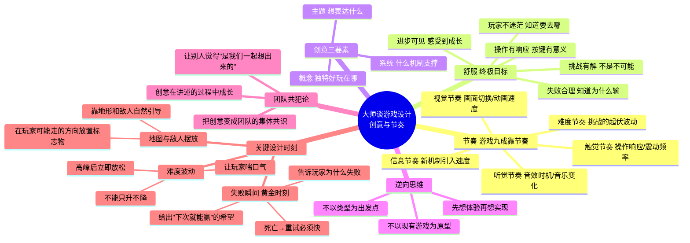

# 📚 《大师谈游戏设计：创意与节奏》读书笔记

## 📖 基础信息

- **日文原名**: ゲームプランナー集中講座 ゲーム創りはテンポが9割
- **作者**: 吉泽秀雄（Hideo Yoshizawa）
- **作者背景**: 日本资深游戏制作人，TECMO 时期制作《忍者龙剑传》系列《炸弹人杰克》，万代南梦宫时期担任首席制作人，制作《风之克罗诺亚》《皇牌空战3》《钻地小子》《右脑达人》
- **译者**: 支鹏浩
- **出版社**: 人民邮电出版社（图灵程序设计丛书）
- **出版年份**: 2017年6月
- **页数**: 244页
- **开始阅读**: 2026-07-15
- **阅读状态**: ☐ 正在阅读
- **个人评分**: ⭐⭐⭐⭐
- **标签**: #游戏设计 #节奏设计 #心流 #创意方法 #日本游戏 #吉泽秀雄

## 📖 内容概要

### 书籍简介

吉泽秀雄是日本游戏界的传奇制作人，横跨 FC 时代到现代主机，制作了《忍者龙剑传》《风之克罗诺亚》等经典。本书是他几十年从业经验的系统性总结，书名直译为"游戏创作九成靠节奏"——这就是全书的灵魂。

吉泽认为，游戏设计的终极目标是让玩家感到**"舒服"**——不是"刺激"、不是"爽快"，而是"舒服"。实现"舒服"的关键手段是**掌控游戏的节奏**。这里的"节奏"远不止音乐和动作时机，而是涵盖视觉、听觉、触觉等**一切刺激产生的时机与频率**。

本书风格与其他西方游戏设计书截然不同——没有学术理论、没有数据图表、没有引用论文。吉泽用朴素直白甚至"野路子"的语言，分享他一线的失败教训和成功经验。对新手来说，这是"知识高速公路"；对老手来说，这些朴素原则往往直指被复杂理论掩盖的本质。

### 核心主题

1. **节奏占九成** — 游戏的品质由节奏决定，而非创意的数量或复杂度
2. **"舒服"是终极标准** — 好玩 = 让玩家感到舒服，不舒服 = 节奏出了问题
3. **创意三要素** — 主题（表达什么）+ 概念（独特的好玩在哪）+ 系统（支撑的机制）
4. **"让团队成为共犯"** — 把创意变成团队的集体共识，而非设计师的独裁宣言
5. **失败瞬间是黄金时刻** — 玩家失败后的反应比成功后的反应更重要

### 主要章节（4篇14章）

**第1篇：总结创意中的节奏** — 从"舒服"出发的思考方式、核心创意三要素、逆向思维
**第2篇：培育创意中的节奏** — 讲述创意的方法、团队头脑风暴、创意取舍
**第3篇：创造游戏节奏** — 操作感、游戏附件的节奏、诱导玩家贴近概念
**第4篇：让创意的节奏更丰满** — 地图设计、敌人摆放、难度曲线、剧情意义

---

## 🧠 知识架构

---

## ✍️ 核心概念笔记

### 节奏九成论

吉泽的"游戏创作九成靠节奏"不是一个夸张修辞，而是一套具体的设计方法：

**节奏的定义**：游戏中一切刺激的**时机**和**频率**。不是"这个游戏有多少内容"，而是"这些内容以什么速度、什么顺序、什么强度呈现在玩家面前"。

**节奏在三个层面运作**：
1. **微节奏**（秒级）：按键→动作 的响应，单个操作的反馈
2. **中节奏**（分钟级）：一场战斗的节奏——紧张→喘息→紧张→胜利
3. **宏节奏**（小时级）：整个游戏的节奏——关卡1→Boss→新能力→新关卡→...

**指标诊断**：如果你觉得游戏"哪里不对"但说不出来，就用"节奏"去检查：
- 玩家是否在大脑空闲（节奏太慢）？
- 玩家是否在认知过载（节奏太快）？
- 胜利后奖励是否来迟了（奖励节奏错位）？

### "舒服"的标准

吉泽将"好玩"这个模糊词转化为可检验的"舒服"标准：

| "舒服"的表现 | "不舒服"的表现 | 节奏问题 |
|-------------|---------------|---------|
| 知道下一步去哪 | 到处乱转不知道干什么 | 引导节奏缺失 |
| 操作后立刻有反馈 | 按了键但不知道有没有效 | 反馈节奏过慢 |
| 感觉一定能过但需要练习 | 死了一次就不想再试 | 惩罚节奏过重 |
| 剧情和战斗交替 | 连续战斗一小时没休息 | 紧张/放松节奏失调 |
| 完成目标后有获得感 | 打完Boss没有奖励 | 奖励节奏错位 |

### "让团队成为共犯"的方法论

吉泽提出一个反传统观点：**不要试图说服团队"我的创意很好"，而是要让团队觉得"这个创意是我们一起想出来的"**。

**具体方法**：
1. 先用模糊的语言描述体验（"我想到一种让玩家既紧张又兴奋的感觉"），而不是直接给出结论
2. 让团队成员自己把"模糊感觉"转化为"具体方案"
3. 当一个成员提出方案时，另一个成员会为"自己参与创造的东西"而更积极地去实现

### 失败瞬间 = 黄金时刻

吉泽最深刻的实战洞察：

> "玩家失败的那个瞬间，是设计师唯一可以百分之百确定玩家会高度投入注意力的时刻。要在这个瞬间做三件事：让玩家知道为什么失败、让玩家觉得'下次一定能过'、让重试立即开始。"

**错误的失败处理**：
- 死亡后放 10 秒加载画面 → 玩家在刷手机
- 死亡后走 2 分钟回到 Boss 房 → "跑尸体"是游戏设计中最糟糕的节奏

---

## 💭 个人思考

### 关于"舒服"标准与西方设计理论的对比

吉泽的"舒服"标准和 Schell 的"100个透镜"、Fullerton 的"Playcentric"似乎处于两极，但实际上是**同一真理的两种表达方式**：

| 维度 | 吉泽（东方） | Schell/Fullerton（西方） |
|------|------------|------------------------|
| 核心词汇 | "舒服" | "体验"/"乐趣" |
| 分析方法 | 直觉+经验 | 框架+审查 |
| 知识传递 | "师父带徒弟" | 教科书+练习 |
| 优点 | 直达本质、不绕弯 | 可复制、可教学 |

将两者结合可能是最好的：用西方框架搭建分析骨骼，用东方直觉感知体验血肉。

### 关于"节奏"的普适性验证

吉泽的观点可以用 Koster 的理论完美验证：**学习的节奏 = 新模式的引入速度**。当新模式引入太快 → 噪音→焦虑→不舒服。当新模式引入太慢 → 无新图式可学→无聊→不舒服。**"舒服"的节奏 = 新模式（新图式）以玩家刚好能跟上的速度持续提供。**

---

## 📊 学习总结

**最大的收获**：**"九成靠节奏"——将注意力从"做什么"转向"以什么频率、什么顺序做"。**

**改变的观念**：
1. "好游戏 = 内容多" → "好游戏 = 内容以舒服的节奏呈现"
2. "失败是惩罚" → "失败瞬间是设计师最珍贵的黄金时刻"
3. "创意是我的" → "创意是团队的集体共识"

---

**笔记创建时间**: 2026-07-15 | **最后更新**: 2026-07-15 | **笔记版本**: v1.0

**Sources**: [豆瓣](https://book.douban.com/subject/27055726/) · [豆瓣书评](https://book.douban.com/review/12166264/)
