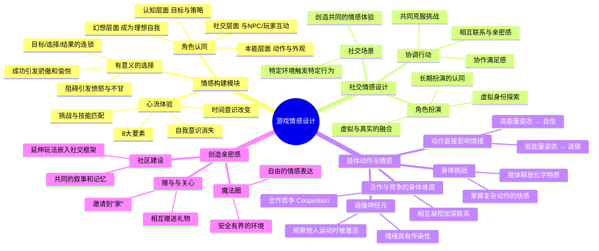

# 📚 《游戏情感设计：如何触动玩家的心灵》读书笔记

## 📖 基础信息

- **英文原名**: How Games Move Us: Emotion by Design
- **作者**: Katherine Isbister（凯瑟琳·伊斯比斯特）
- **作者背景**: 加州大学圣克鲁兹分校计算机媒体学院教授、纽约大学游戏创新实验室创始人
- **译者**: 金潮
- **出版社**: 电子工业出版社 / MIT Press
- **出版年份**: 2017年2月（中文版）/ 2016年（英文原版）
- **页数**: 196页
- **开始阅读**: 2026-07-15
- **阅读状态**: ☐ 正在阅读
- **个人评分**: ⭐⭐⭐⭐
- **标签**: #游戏设计 #情感设计 #玩家心理 #社交游戏 #体感设计

## 📖 内容概要

### 书籍简介

在现有的游戏设计书单中，绝大多数都在讨论"怎么做机制""怎么做平衡""怎么做关卡"，但极少有人专门讨论**情感**。Katherine Isbister 填补了这一空白。

本书由 MIT Press 出版（学术出版社，暗示其严谨性），核心论点是：**游戏在创造同理心和强烈正向情感体验方面，具有其他媒介无法比拟的独特力量。** 游戏的两种专属武器——**选择**（有意义的选择带来情感投资）和**心流**（高度投入打开情感容器）——加上对社交互动的模拟，使游戏成为史上最强的情感机器。

全书不到200页，薄但密度高，以"社交情感""肢体动作""亲密感"三个独特视角为框架，结合《风之旅人》《火车》《最后生还者》等案例，系统解析了游戏如何触动玩家。

### 核心主题

1. **选择是情感的基础** — 有意义的选择让玩家将情感投资于游戏结果
2. **心流是情感的容器** — 高度投入的状态使玩家对情感刺激更加敏感
3. **社交情感最强烈** — 不论是 NPC 还是真人，玩家与"他人"的情感连接最深
4. **身体动作即情感** — 肢体姿态和动作直接影响情绪状态
5. **亲密感跨越隔阂** — 游戏创造的安全空间允许更自由的情感表达

---

## 🧠 知识架构



---

## ✍️ 核心概念笔记

### 触发情感的三步路径

Isbister 提出游戏情感设计的逻辑链：

```
有意义的选择 → 情感投资 → 心流状态 → 情感容器打开 → 情感刺激 → 强烈情感体验
```

这个链条的关键在于：**如果选择没有意义，情感投资就不存在，后续所有情感设计都无效。** 这是为什么"自动战斗"永远无法像手动操作那样产生情感。

### 游戏的情感优势（相比其他媒介）

| 媒介 | 情感触发方式 | 局限性 |
|------|-------------|--------|
| 电影 | 被动观察角色的情感 | 你永远是旁观者 |
| 小说 | 文字触发想象与同理 | 需要高度想象力 |
| **游戏** | **你的选择导致了结果** | — |

游戏独有的情感——**负罪感**和**责任心**——只有通过"你自己做出了那个选择"才能产生。《最后生还者》结尾 Joel 的选择之所以震撼，不是因为"看"他做了什么，而是你**作为**他亲手执行了那些操作。

### 社交情感的三个构建模块

1. **协调行动**：一起做一件事（哪怕是一起打一个Boss），比一起看一部电影产生的情感连接强10倍。动作同步带来情感同步。
2. **角色扮演**：当你在游戏中长期扮演一个角色，并且这个角色与其他人互动时，虚拟和现实的边界开始模糊——你在现实中也开始关心你的队友。
3. **社交场景**：游戏的"魔法圈"提供了一个安全空间，在这里人们可以表达现实中不敢或不能表达的情感。

### 身体动作的情感力量

Isbister 引用了社会心理学中"权力姿势"的研究：保持高能量姿态（如站立双手叉腰）2分钟，睾丸激素上升、皮质醇下降——人会变得更自信。

**游戏中的应用**：
- 设计让玩家做出高能量动作的机制（大范围挥砍、高速冲刺）会让他们感到更有力量
- 体感游戏（如 Just Dance、Beat Saber）的爽快感不仅来自节奏匹对，也来自身体释放的化学物质
- 镜像神经元的激活：当玩家看到角色做出流畅的动作，他们的大脑会模拟这个动作——产生身体上的"代入感"

### "玩家为NPC之死而哭泣"的原因

Isbister 指出，玩家为 NPC 之死哭泣是最常见的情感反应——不是因为 NPC 是真人，而是因为：
1. NPC 是你在这个世界中**每天互动**的对象（你的队友、跟随者、宠物）
2. 游戏**没有给你挽救 NPC 的选择**的时候，你感受到的是无力感和失去感——"如果我当时……"
3. NPC 的死亡往往是**游戏叙事的高潮**——所有积累的情感在这一刻释放

---

## 💭 个人思考

### 关于"情感是测量的缺失"

Isbister 的书揭示了游戏设计中最被忽视的维度：**情感不是设计的副作用，而是设计的目标。** 但大多数游戏设计师在思考"这个机制会产生什么情感"时完全处于直觉状态。

结合 Sylvester 的"体验引擎"模型（情感触发器的分类）和 Isbister 的"情感路径"（选择→心流→情感），可以得到一个相对完整的游戏情感设计框架：
1. 识别你想要的目标情感（Sylvester）
2. 设计能产生这种情感的事件（Sylvester）
3. 确保玩家有有意义的选择来触发这些事件（Isbister）
4. 用心流状态打开情感容器（Isbister）
5. 用社交元素和身体元素放大情感强度（Isbister）

### 关于"情感游戏"的实践价值

在个人游戏项目中，Isbister 的理论意味着：**不要只在"最后一关"设计情感高潮**。从游戏的第一秒开始，就需要设计情感路径——新手引导不仅是"教操作"，更要让玩家感到"我可以掌控这个世界"（自信 + 胜任感）。

---

## 📊 学习总结

**最大的收获**：**"玩家的情感来自他们自己的选择，不是来自设计师的导演。"** 你无法告诉玩家"这里你应该感动"——你必须创造让他们自己做出会产生情感的选择的条件。

**改变的观念**：
1. "情感是故事的副产物" → "情感是选择+心流+社交的综合产物"
2. "体感游戏=运动" → "身体动作直接释放影响情绪的化学物质"
3. "NPC是功能性工具" → "NPC是情感锚点"

---

**笔记创建时间**: 2026-07-15 | **最后更新**: 2026-07-15 | **笔记版本**: v1.0

**Sources**: [百度百科](https://baike.baidu.com/item/游戏情感设计：如何触动玩家的心灵) · [GameRes](https://www.gameres.com/907095.html)
