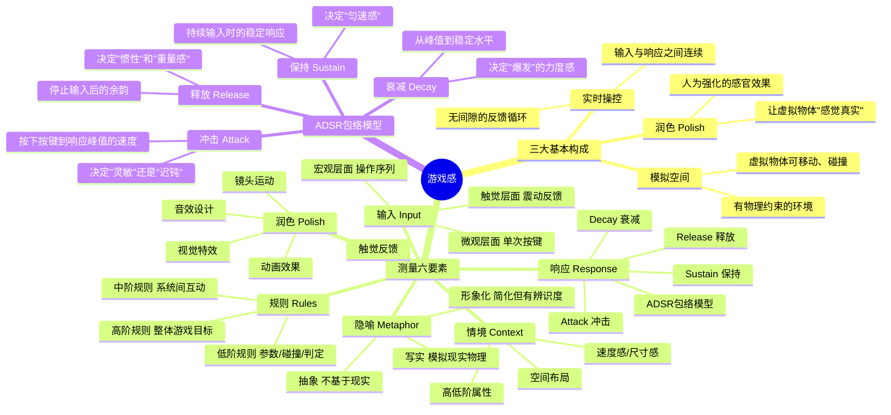

# 📚 《游戏感：游戏操控感和体验设计指南》读书笔记

## 📖 基础信息

- **英文原名**: Game Feel: A Game Designer's Guide to Virtual Sensation
- **作者**: Steve Swink（史蒂夫·斯温克）
- **作者背景**: 独立游戏开发者、独立游戏节（IGF）联合主席、Flashbang Studios 联合创始人，《越野狩猎迅猛龙》开发者
- **出版社**: 电子工业出版社（中文版由腾讯游戏翻译推荐）
- **出版年份**: 2020年4月（中文版）/ 2008年（英文原版）
- **页数**: 约344-380页
- **开始阅读**: 2026-07-15
- **阅读状态**: ☐ 正在阅读
- **个人评分**: ⭐⭐⭐⭐⭐
- **豆瓣评分**: 9.4
- **标签**: #游戏设计 #操控感 #虚拟感觉 #ADSR模型 #量化体验

## 📖 内容概要

### 书籍简介

这本书回答了一个极其重要但极其难回答的问题：**为什么马里奥跳起来"刚刚好"，而很多山寨版的跳跃手感在纸面上参数一模一样却"总觉得哪里不对"？**

Swink 是**游戏设计领域量化体验的第一人**。在本书之前，"游戏感"是玄学——设计师凭直觉调参数，玩家凭直觉说"爽"或"不爽"。Swink 建立了一套完整的分析框架，把"手感"这个模糊概念分解为**可测量、可分析、可复制**的六个维度（输入、响应、情境、润色、隐喻、规则），并借鉴音频合成器的 ADSR 包络模型来量化运动响应。

本书是腾讯游戏内部被多个工作室负责人推荐的设计手册。《王者荣耀》制作人李旻、NExT Studios 总经理沈黎都公开推荐过此书。

### 核心主题

1. **游戏感的定义** — 在模拟空间中，对虚拟物体的实时操控，借助于润色所得到的感触
2. **三大基本构成** — 实时操控 + 模拟空间 + 润色（Polish）
3. **测量游戏感的六要素** — 输入、响应、情境、润色、隐喻、规则
4. **ADSR 包络模型** — 用于分析和设计运动响应的核心工具
5. **经典案例分析** — 《小行星》《超级马里奥兄弟》《生化尖兵》《超级马里奥64》
6. **打造游戏感的八项准则** — 从"结果可预测"到"征服感"

### 主要章节（5部分19章）

**第一部分：定义游戏感（第1-4章）**
- 游戏感的三要素：实时操控、模拟空间、润色
- 感知机制与交互循环

**第二部分：测量游戏感（第5-11章）**
- 六要素详细拆解
- ADSR 包络模型

**第三部分：经典案例分析（第12-16章）**
- 5款经典游戏的游戏感逐层拆解

**第四、五部分：准则与未来（第17-19章）**

---

## 🧠 知识架构



---

## ✍️ 核心概念笔记

### ADSR 包络模型 — 量化手感的革命性工具

这是全书最重要的原创贡献。Swink 将音频合成器的 ADSR 模型应用于角色运动分析：

**以马里奥的跳跃为例**：

| ADSR 阶段 | 马里奥的跳跃 | "手感好"的参数 | "手感差"的参数 |
|-----------|-------------|--------------|--------------|
| **冲击** | 按下A键→起跳加速度 | 1-3帧内达到峰值（灵敏） | 8帧才到峰值（迟钝） |
| **衰减** | 从起跳峰值→上升减速 | 缓和的渐变（可控制） | 瞬间到顶（无控制感） |
| **保持** | 在空中上升阶段 | 按键时长控制高度 | 固定轨迹（无操控感） |
| **释放** | 松开A键→开始下坠 | 有微小惯性后再下落 | 瞬间下落（不自然） |

**🎯 借鉴点**：ADSR 模型可以直接应用到我的 Godot 项目中。每次做角色运动/跳跃/冲刺时，用这四个参数定义手感，而不是靠"感觉"反复调数值：
```
Attack = 2（2帧达到峰值速度）
Decay = 0.15（15%的速度衰减到保持值）
Sustain = 0.7（保持最大速度的70%）
Release = 0.3（停止输入后0.3秒回到静止）
```

### 六要素量化框架

Swink 建立的不是"好看/不好看"的模糊判断，而是一套**逐层采样的测量系统**：

| 要素 | 测量维度 | 示例问题 |
|------|---------|---------|
| 输入 | 延迟/灵敏度/精度 | 按键到角色开始移动需要多少ms？ |
| 响应 | ADSR四参数 | 停止按键后角色滑行多远？ |
| 情境 | 空间尺度/速度 | 角色相对屏幕的尺寸比例？移动速度占屏幕宽度百分比？ |
| 润色 | 动画帧数/特效时长/音效 | 跳跃的挤压/拉伸帧数是多少？ |
| 隐喻 | 写实度 | 为什么直升机比摩托车"真实"？ |
| 规则 | 碰撞范围/判定框 | 马里奥的脚和敌人的头的碰撞框关系？ |

### 五款经典游戏的案例分析

| 游戏 | 核心游戏感 | 关键设计 |
|------|-----------|---------|
| 《小行星》 | 太空惯性质感 | 无摩擦、动量守恒、屏幕边界翻转 |
| 《超级马里奥兄弟》 | 精确平台跳跃 | 加速度+惯性+可变的跳跃高度 |
| 《生化尖兵》 | 荡索的物理感 | 钟摆物理、无跳跃、纯摆荡移动 |
| 《超级马里奥64》 | 3D空间的自由操控 | 三重跳+后空翻+前扑+墙壁跳的组合系统 |
| 《越野狩猎迅猛龙》 | 车辆物理+碰撞感 | 冲撞物理、速度与质量感的平衡 |

### 打造游戏感的八项准则

1. **结果可预测** — 玩家能预期操作的后果
2. **即时响应** — 操作到反馈 ≤ 100ms
3. **易于上手，难于精通** — 入门门槛低但深度天花板高
4. **新颖** — 提供"没玩过"的体验（最稀缺的准则）
5. **响应有吸引力** — 操作反馈本身就令人愉悦
6. **自然运动** — 符合物理直觉（不一定是真实物理，但一定是可预测的物理）
7. **和谐** — 各要素协调统一，无突兀感
8. **征服感** — 玩家感到自己掌握了一套技能

---

## 💭 个人思考

### 关于"游戏感可量化"的范式转变

在 Swink 之前，手感是"师父传徒弟"的口耳相传经验。Swink 把 ADSR 包络模型带入游戏设计的贡献，相当于牛顿把微积分带入物理学——之前不是没有人做出好手感，但没有人能**系统地解释**为什么好、**精确地指定**如何变好。

在我的个人项目中，这意味着：以后调手感时不再说"感觉飘"，而是说"Attack 值需要从 5帧 降到 2帧，Release 需要从 0.1秒 增到 0.3秒"。

### 关于润色（Polish）不是最后一步

Swink 强调了一个反常识的观点：润色不是"最后一步"，而是**游戏感的固有组成部分**。一个没有润色的游戏和一个润色充分的游戏，在"操控感"上是两个不同的游戏——不是"同一个游戏但外表更好看"。

这与 Rogers 在《通关》中说的"3C是地基"形成呼应——3C告诉你"什么组成交互"，Swink 告诉你"交互的质量怎么测量"。

---

## 📊 学习总结

**最大的收获**：**游戏感可以量化**——ADSR包络模型 + 六要素框架，将"玄学"变成了"工程"。

**改变的观念**：
1. "手感靠直觉" → "手感靠ADSR参数设计"
2. "润色是最后加的" → "润色是游戏感的内在组成部分"
3. "不同游戏的手感不能比较" → "用ADSR可以参数化比较任何游戏的手感"

---

**笔记创建时间**: 2026-07-15 | **最后更新**: 2026-07-15 | **笔记版本**: v1.0

**Sources**: [百度百科](https://baike.baidu.com/item/游戏感：游戏操控感和体验设计指南) · [博文视点](http://www.broadview.com.cn/book/4849) · [腾讯游戏分享](https://mp.weixin.qq.com/s?__biz=MjM5OTc2ODUxMw==&mid=2649774080&idx=1&sn=bf5e7492a4ae5b14aba4440c9d13cee1)
