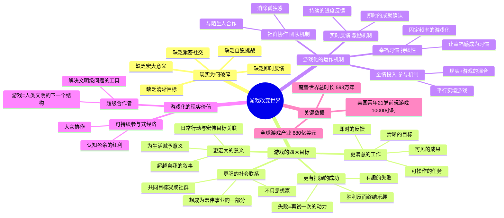

# 📚 《游戏改变世界》读书笔记

## 📖 基础信息

- **英文原名**: Reality Is Broken: Why Games Make Us Better and How They Can Change the World
- **作者**: Jane McGonigal（简·麦戈尼格尔）
- **作者背景**: 著名未来学家、"未来研究所"游戏研发总监、TED大会新锐演讲者
- **译者**: 闾佳
- **出版社**: 北京联合出版公司（经典版）/ 浙江人民出版社（首版）
- **出版年份**: 2016年10月（经典版）/ 2012年8月（首版）
- **开始阅读**: 2026-07-15
- **阅读状态**: ☐ 正在阅读
- **个人评分**: ⭐⭐⭐⭐
- **标签**: #游戏化 #现实应用 #社会影响 #幸福设计 #平行实境

## 📖 内容概要

### 书籍简介

这本书不是教你"怎么做游戏"，而是告诉你**"游戏为什么比现实更好"**——以及更重要的是——**"我们如何用游戏的机制来修复现实"**。

Jane McGonigal 是"游戏化"（Gamification）运动的旗帜性人物。她的核心主张是：**现实已经破碎了**——我们的工作缺乏即时反馈、我们的生活缺乏清晰目标、我们的社交缺乏紧密连接。而游戏恰好提供了这一切：清晰规则、即时反馈、自愿挑战、宏大意义。**游戏不是逃避现实的工具，而是修复现实的蓝图。**

本书以大量"平行实境游戏"（Alternate Reality Games）案例——如《家务战争》《喷气人》《非凡》——展示了游戏化如何改善健康、教育、社会协作和环境问题。全球玩家在《魔兽世界》上花费的时间总计超过 593 万年——如果能善用这股力量，人类有可能解决文明级的问题。

### 核心主题

1. **游戏化4大目标** — 更满意的工作、更有把握的成功、更强的社会联系、更宏大的意义
2. **游戏化4大机制** — 全情投入（参与机制）、实时反馈（激励机制）、社群协作（团队机制）、幸福习惯（持续性）
3. **修复现实的7条游戏化原则** — 从自愿参与到宏大意义
4. **平行实境游戏** — 将游戏机制叠加在现实生活之上的新型游戏

### 主要章节（四大部分）

**第一部分：游戏化，互联时代的重要趋势**
**第二部分：游戏化的4大目标**
**第三部分：游戏化的运作机制**
**第四部分：游戏化的现实价值**

---

## 🧠 知识架构

---

## ✍️ 核心概念笔记

### 现实为何破碎 vs 游戏为何迷人

McGonigal 的论证建立在一个对比之上：

| 现实的问题 | 游戏的解法 |
|-----------|-----------|
| 努力工作但没有反馈 | 每完成一个任务都有明确奖励 |
| 不知道"为什么"而做 | 宏大叙事告诉你"你在拯救世界" |
| 失败=耻辱 | 失败=学习+再来一次 |
| 社交=尴尬 | 社交=合作打Boss，共同的目标消解了尴尬 |

**McGonigal 的洞察**：这些"游戏特有的优势"并非技术绑定的——我们可以把它们嫁接到现实世界。

### 游戏化4大目标

**1. 更满意的工作**：
游戏中，"工作"的定义清晰、目标明确、反馈及时、进步可见。现实中，"做一个好报表"既无清晰定义也无即时的情感反馈。游戏化方案：将日常工作拆分为可完成的任务，为每个完成增加即时确认。

**2. 更有把握的成功**：
> "胜利终结乐趣，失败维持乐趣。"

这是全书最反直觉的观点。当你可以稳定赢的时候，游戏就不好玩了。真正让人持续投入的是**"差一点就赢了"的时刻**。游戏化方案：为现实任务设置合适的难度梯度，设计"有趣的失败"机制（失败有收获而非纯惩罚）。

**3. 更强的社会联系**：
一起玩《荒野乱斗》的陌生人比一起开会的同事更亲密——因为前者共享一个目标，后者共享一个房间。游戏化方案：在工作环境中加入需要协作完成的挑战。

**4. 更宏大的意义**：
《魔兽世界》让你觉得你在为艾泽拉斯的命运而战——你的日常任务（杀10只野猪）被嵌套在宏大叙事中，从而有了超越自身的意义。工作同样可以。游戏化方案：将日常 KPI 与"我们正在改变XX行业"这样的宏大叙事关联起来。

### 7条修复现实的原则

McGonigal 提炼了让现实更像游戏的核心原则：
1. **自愿参与** — 没人被强迫玩《魔兽世界》，玩家是自愿的，所以工作也是乐趣
2. **清晰的目标** — "拯救世界"vs"做好工作"——前者更激励人
3. **清晰的规则** — 玩家不需要猜测"怎么做是对的"
4. **即时反馈系统** — 暴击的数字、经验值的增长、等级的提升——现实需要更多这样的即时确认
5. **自愿接受的障碍** — 游戏中最快乐的时刻是主动接受挑战并克服的时刻
6. **共同目标** — 与陌生人因共同目标而成为战友
7. **宏大叙事** — 把个人行为与更宏大的意义关联起来

---

## 💭 个人思考

### 关于"游戏化"概念的边界与危险

McGonigal 在2012年提出的"游戏化"概念，之后十年经历了从"流行词汇"到"过度滥用"到"回归理性"的完整周期。大量的"游戏化"实践变成了简单粗暴的"加积分+加排行榜+加徽章"——这是对 McGonigal 理论的极大误解。

**真正的游戏化不是"加积分"，而是"创造让内在动机发挥作用的环境"**。如果一项工作本身没有内在价值、无法让承担它的人感到"我可以做得更好"和"我在做有意义的事"，任何积分和徽章都无法挽救——它们只会把糟糕的体验变成"有积分的糟糕体验"。

这与 Koster 的"游戏=学习"理论、Sylvester 的"多巴胺=预期偏差"理论、Deci & Ryan 的"自我决定论"完全一致——外在奖励（积分/徽章）最多做锦上添花，永远无法替代内在动机。

### 关于 McGonigal 理论在个人项目中的应用

McGonigal 的7条原则可以直接转化为个人项目管理工具：
- 每个Sprint的目标 = 游戏目标（清晰+宏大）
- 每完成一个Task的即时确认 = 游戏反馈
- 团队协作的共享目标 = 社会联系

**这套系统的价值不在于"让工作变好玩"，而在于暴露工作中那部分"设计糟糕"的内容**——如果一个任务无法对应 McGonigal 的任何一条原则，也许这个任务本身就不应该存在。

---

## 📊 学习总结

**最大的收获**：**"现实是设计糟糕的游戏。修复现实的方法不是逃离现实，而是把现实中缺少的游戏元素（目标、规则、反馈、自愿、意义）重新注入现实。"**

**改变的观念**：
1. "游戏=浪费时间" → "游戏=人类对美好体验的天然追求"
2. "游戏化=加积分" → "游戏化=为现实体验注入目标/反馈/意义"
3. "工作是苦差事游戏是放松" → "最佳工作状态和最佳游戏状态都是心流"

---

**笔记创建时间**: 2026-07-15 | **最后更新**: 2026-07-15 | **笔记版本**: v1.0

**Sources**: [百度百科](https://baike.baidu.com/item/游戏改变世界：游戏化如何让现实变得更美好/581546) · [GameLook](http://www.gamelook.com.cn/2012/09/94966/)
