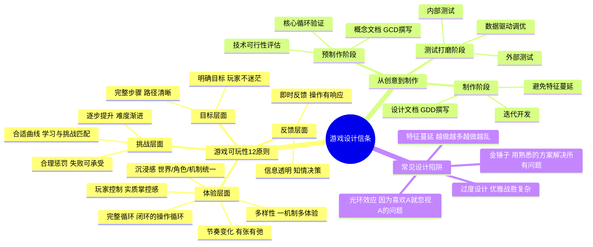

# 📚 《游戏设计信条：从创意到制作的设计原则》读书笔记

## 📖 基础信息

- **法文原名**: Concevoir un jeu vidéo
- **作者**: Marc Albinet（马克·阿尔比奈）
- **作者背景**: 资深游戏设计师，曾任《刺客信条》系列设计总监、Ubisoft 资深设计师，拥有超过15年3A游戏设计经验
- **出版社**: 人民邮电出版社
- **出版年份**: 2018年（中文版）
- **页数**: 约200页
- **开始阅读**: 2026-07-15
- **阅读状态**: ☐ 正在阅读
- **个人评分**: ⭐⭐⭐⭐
- **标签**: #游戏设计 #游戏性 #设计原则 #3A #Ubisoft

## 📖 内容概要

### 书籍简介

《游戏设计信条》是一本**薄却输出密度极高**的游戏设计书。作者 Marc Albinet 是 Ubisoft《刺客信条》系列的设计总监，他在书中凝练了十余年3A游戏设计经验，提出了**"游戏可玩性12项原则"**。全书不到200页，语言精炼直接，没有一句废话——每一页都是来自一线实践的硬核经验。

本书的独特之处在于：它不是从"好的游戏应该怎样"出发，而是从"设计决策的底层逻辑"出发。Albinet 教你的不是"什么东西是好玩的"，而是"当你面对一个设计选择题时，用什么原则来做判断"。

### 核心主题

1. **游戏可玩性12项原则** — 从"明确目标"到"完整循环"，构成游戏设计的决策框架
2. **从创意到制作的完整流程** — 预制作→制作→测试→打磨，每个阶段的关键决策
3. **文档撰写方法论** — 游戏概念文档（GCD）、游戏设计文档（GDD）的实战写法
4. **避免常见设计陷阱** — 特征蔓延、过度设计、复杂度失控

### 游戏可玩性12项原则（核心框架）

| # | 原则 | 说明 |
|---|------|------|
| 1 | 明确目标 | 玩家始终知道自己的方向，不迷茫 |
| 2 | 完整步骤 | 达成目标的路径清晰可见，由有意义的选择构成 |
| 3 | 逐步提升 | 挑战难度逐渐增加，技能需求水涨船高 |
| 4 | 合适曲线 | 学习曲线的坡度与玩家能力增长匹配 |
| 5 | 即时反馈 | 每个操作都有明确、即时的响应 |
| 6 | 玩家控制 | 玩家感到自己对局面有实质性的掌控 |
| 7 | 完整循环 | 核心游戏循环完整自足：操作→反馈→调整→再操作 |
| 8 | 合理惩罚 | 失败的代价不摧毁玩家的继续意愿 |
| 9 | 信息透明 | 玩家拥有做决策所需的全部信息 |
| 10 | 节奏变化 | 游戏节奏有快有慢，有紧张有放松 |
| 11 | 多样性 | 同一个机制能在不同情境下产生不同的体验 |
| 12 | 沉浸感 | 世界、角色、机制三者统一，形成完整的沉浸体验 |

---

## 🧠 知识架构

---

## ✍️ 核心概念笔记

### 12项原则的精髓：从"感觉"到"逻辑"

Albinet 做的最重要的一件事，是把"好游戏"拆解为可逐项检查的工程指标：

**原则1-4（方向感）**确保玩家知道自己要去哪、怎么去。
**原则5-6（操控感）**确保玩家的每一步操作都有意义。
**原则7-9（公平感）**确保游戏系统是可理解、可掌控的。
**原则10-12（体验感）**确保游戏有节奏、有变化、有沉浸。

**设计启示**：当游戏的某个部分"感觉不对"时，不用猜，直接上这12个原则逐项排查。你会发现"感觉不对"的背后一定有一个或多个原则被违反了。

### 从"金锤子"到工具箱

Albinet 提出了游戏设计中的"金锤子"反模式：
> "如果你手里只有一把锤子，你看什么都像钉子。"

在游戏设计中的表现：
- 只会做开放世界的团队给RPG也做成开放世界
- 只懂COD的设计师给任何FPS都加呼吸回血
- 只会做抽卡的策划给任何系统都加抽卡

**解决方案**：培养多类型、多机制的设计知识——这正是读《游戏设计基础》这类百科全书式教材的价值。

### 3A游戏设计决策的真实逻辑

Albinet 在 Ubisoft 学到的核心教训：
1. **90%的好想法死在原型阶段** — 纸面上看起来完美的设计，一做成可玩原型就露出问题
2. **玩家的抱怨不是需求** — "希望有更酷的武器"不是需求，"玩家在第3关以后使用同一种武器超过80%的时间"才是
3. **特征蔓延是第一杀手** — 每个版本都想加新东西，但新东西往往破坏已有平衡

---

## 💭 个人思考

### 关于12原则与Schell透镜的关系

| 维度 | Albinet的12原则 | Schell的透镜 |
|------|----------------|-------------|
| 用途 | 设计决策 | 设计审查 |
| 数量 | 12项，精炼 | 100+项，全面 |
| 风格 | "如果违反就被判不合格" | "你有没有想过这个角度？" |
| 最佳使用时机 | 设计过程中做选择 | 设计完成后做检查 |

**最佳实践**：用 Albinet 的 12 原则指导每日设计决策，用 Schell 的透镜做每周设计审查。一个向前看，一个回头看。

### 关于"特征蔓延"的深层反思

Albinet 说特征蔓延是第一杀手。这让我想到 Martin Fowler 在《重构》中说的"如果它很丑，它就在伤害你。每天。"两者的本质相同：不必要的复杂度会像利息一样每天累积债务。

游戏设计中"加一个功能"的诱惑 = 软件开发中"加一个if-else"的诱惑。Albinet 的建议是：每次想加新功能时，先问"删掉什么？"——净功能增长必须是零。

---

## 📊 学习总结

**最大的收获**：设计不是"我觉得好"，而是有原则可循。12项原则是"设计决策的GPS"——每次迷失方向时，回到原则，逐项对照。

**改变的观念**：
1. "好的设计来自灵感" → "好的设计来自遵循原则+验证迭代"
2. "玩家说的都是对的" → "观察玩家做什么 > 听玩家说什么"
3. "加功能=进步" → "删功能=净化"

---

**笔记创建时间**: 2026-07-15 | **最后更新**: 2026-07-15 | **笔记版本**: v1.0

**Sources**: [图灵社区](https://www.ituring.com.cn/book/1856) · [豆瓣](https://book.douban.com/subject/30186145/)
