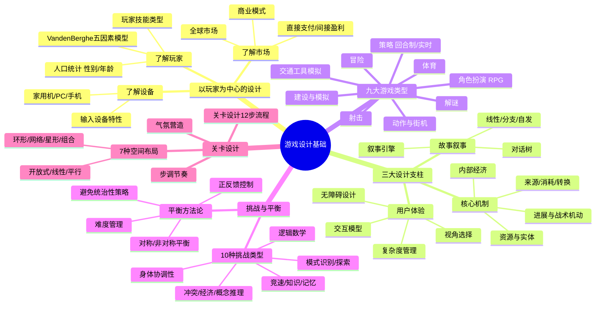

# 📚 《游戏设计基础》读书笔记

## 📖 基础信息

- **英文原名**: Fundamentals of Game Design（第3版）
- **作者**: Ernest Adams（欧内斯特·亚当斯）
- **作者背景**: 前 EA 制作人（《Madden NFL》系列）、Bullfrog Productions 首席设计师、IGDA（国际游戏开发者协会）创建者与首任主席、Gamasutra "Designer's Notebook" 专栏作家
- **译者**: 江涛
- **出版社**: 机械工业出版社
- **出版年份**: 2017年（中文第3版）/ 2014年（英文第3版）
- **页数**: 约560页（英文）/ 424页（中文）
- **开始阅读**: 2026-07-15
- **阅读状态**: ☐ 正在阅读
- **个人评分**: ⭐⭐⭐⭐
- **豆瓣评分**: 8.0+
- **标签**: #游戏设计 #系统设计 #教材 #核心机制 #ErnestAdams

## 📖 内容概要

### 书籍简介

《游戏设计基础》是游戏设计领域**最系统、最全面的教科书**，没有之一。如果说 Schell 的《游戏设计艺术》是"哲学沉思集"，Rogers 的《通关》是"实战手册"，Koster 的《快乐之道》是"认知科学论文"——那 Adams 的这本书就是"百科全书式的系统教材"。

本书以**"以玩家为中心的设计方法"**（Player-Centric Design）为主线，覆盖从概念构想到关卡落地的全流程。第3版新增了移动游戏、触屏设计、F2P 商业模式等当代话题。每章末尾配有设计练习和习题，是真正可以当课本来用的书。

Adams 另一个贡献是定义了**9大经典游戏类型**的分类体系（射击、动作、策略、RPG、体育、交通工具模拟、建设与模拟、冒险、解谜），这个分类至今被广泛引用。

### 核心主题

1. **以玩家为中心** — 所有设计从玩家能力、偏好、心理出发
2. **三大设计支柱** — 核心机制（逻辑规则）+ 用户体验（交互界面）+ 叙事（故事与情感）
3. **内部经济系统** — 资源、实体、来源、消耗、转换、交易、生产
4. **挑战层次** — 原子挑战→中间级挑战→终极挑战
5. **平衡方法论** — 避免统治性策略、正反馈控制、难度管理

### 主要章节（17章，3部分）

**第1部分：基础与概览（第1-6章）**
- 游戏定义、设计方法、9大类型、玩家分析、设备分析、商业模式

**第2部分：设计核心要素（第7-16章）**
- 概念→世界→创造型玩法→角色→叙事→用户体验→可玩性→核心机制→平衡→关卡设计

**第3部分：专项设计（第17章）**
- 在线游戏设计

---

## 🧠 知识架构



---

## ✍️ 核心概念笔记

### 游戏设计的三层结构

Adams 将游戏设计组织为清晰的层次：

```
┌───────────────────────────────┐
│     用户体验（User Interface） │  ← 玩家看到和操作的层面
│  ┌─────────────────────────┐  │
│  │   核心机制（Core Mechanics）│  │  ← 数学和逻辑规则
│  │  ┌───────────────────┐  │  │
│  │  │  叙事（Narrative）  │  │  │  ← 故事和情感层面
│  │  └───────────────────┘  │  │
│  └─────────────────────────┘  │
└───────────────────────────────┘
```

**核心机制 = 骨骼**：定义了什么能发生，什么不能发生
**用户体验 = 皮肤**：定义了如何感知和操作
**叙事 = 血肉**：定义了意义和情感

### 9大游戏类型分类

Adams 的类型分类法是游戏设计教材中引用最广的分类系统：

| 类型 | 核心玩法 | 代表 |
|------|----------|------|
| 射击 | 精确操作 + 空间感知 | 《CS:GO》《使命召唤》 |
| 动作/街机 | 快速反应 + 手眼协调 | 《超级马里奥》《Celeste》 |
| 策略 | 资源管理 + 长期规划 | 《星际争霸》《文明》 |
| 角色扮演 | 角色成长 + 叙事沉浸 | 《最终幻想》《巫师3》 |
| 体育 | 模拟真实运动规则 | 《FIFA》《NBA 2K》 |
| 交通工具模拟 | 驾驶/飞行操作体验 | 《GT赛车》《微软飞行模拟》 |
| 建设与模拟 | 系统管理 + 创造 | 《模拟城市》《环世界》 |
| 冒险 | 探索 + 解谜 + 叙事 | 《塞尔达》《猴岛》 |
| 解谜 | 纯逻辑或空间推理 | 《传送门》《Baba Is You》 |

### 挑战层次理论

```
原子挑战 → 中间级挑战 → 终极挑战
(单次按键)  (打赢一场战斗)  (通关整个游戏)
```

**设计启示**：好的游戏让"完成一系列原子挑战"自动累积为"通过一个中间级挑战"，而这种累积应该产生自然而然的满足感，不需要额外的奖励来"补偿"。

### 内部经济系统

Adams 最重要的原创贡献之一是**游戏的内部经济框架**：

| 经济操作 | 说明 | 例子 |
|----------|------|------|
| **来源（Source）** | 资源从哪里产生 | 金矿产出金币 |
| **消耗（Drain）** | 资源在哪里被消耗 | 造兵消耗金币 |
| **转换（Converter）** | 资源从A变成B | 木材+石头→建筑 |
| **交易（Trader）** | 资源在不同实体间转移 | 玩家间交易 |
| **生产（Production）** | 基于条件自动产生 | 每回合+1人口 |

**设计启示**：每个经济操作都是"设计决策点"。如果你的系统只有"来源"（资源不断产出）而没有"消耗"（无处可用），经济就会通货膨胀→游戏失去紧张感。

### 10种挑战类型

Adams 打破"挑战 = 战斗"的狭隘观念，将游戏挑战细分为：

1. **身体协调性** — 操作执行的精度
2. **逻辑数学** — 推理和计算
3. **竞速** — 时间的紧迫感
4. **知识** — 记忆和回忆信息
5. **记忆** — 短期记忆的考验
6. **模式识别** — 辨识规律的能力
7. **探索** — 发现和空间导航
8. **冲突** — 策略、战术和直接对抗
9. **经济** — 资源积累和财富管理
10. **概念推理** — 理解抽象规则的能力

**设计启示**：一款好游戏很少只用一种挑战类型。《旷野之息》同时涉及探索、身体协调性、模式识别、逻辑数学、冲突——这种交叉是它卓尔不群的原因。

### 7种关卡布局

| 布局 | 结构 | 适合的游戏 |
|------|------|-----------|
| 开放式 | 全区域可自由移动 | 开放世界RPG、沙盒 |
| 线性 | A→B→C 单线推进 | 叙事驱动、教学关 |
| 平行 | 多路线可选 | 提供玩家选择感 |
| 环形 | 绕一圈回到起点 | 赛车赛道、Metroidvania |
| 网络 | 多个节点互相连通 | 开放区域RPG |
| 星形 | 中心枢纽+分支 | 3D塞尔达、超级马里奥64 |
| 组合 | 上述两种以上的混合 | 现代3A游戏标配 |

---

## 💭 个人思考

### 关于"内部经济系统"框架的跨领域应用

Adams 的内部经济框架（来源→消耗→转换→交易→生产）可以完美迁移到非游戏系统设计。一个移动 App 的"用户参与系统"也可以用这个框架描述：
- 来源 = 用户注册获得积分
- 消耗 = 用积分兑换高级功能
- 转换 = 积分升级为"徽章"（将积分变为荣誉）
- 交易 = 用户间分享和邀请
- 生产 = 每日登录自动获得积分

这个框架提供了一种系统思维的语言，可以脱离游戏领域独立使用。

### 关于本书与《游戏设计艺术》的定位差异

Adams 写的是"百科全书"，Schell 写的是"哲学沉思"。
Adams 更好**查**（想了解关卡布局→翻第16章→7种布局+12步流程→照做即可）
Schell 更好**读**（想培养设计思维→读透镜→自我反思→形成直觉）
最佳使用方式：用 Schell 培养思维，用 Adams 落地执行。

---

## 📊 学习总结

**最大的收获**：游戏设计不是玄学——它有一套完整的、可分类、可操作的元素体系。Adams 的贡献是把这些元素用清晰的语言、结构化的框架和可操作的流程展现出来。

**改变的观念**：
1. "挑战 = 战斗" → "挑战有10种类型，最好的游戏融合多种挑战"
2. "经济系统 = RPG专属" → "每个游戏都有内部经济，只是复杂度不同"
3. "平衡 = 各元素均等" → "平衡 = 没有统治性策略"

---

**笔记创建时间**: 2026-07-15 | **最后更新**: 2026-07-15 | **笔记版本**: v1.0

**Sources**: [微信读书](https://weread.qq.com/web/bookDetail/14f32800811e34248g010170) · [机械工业出版社](http://www.cmpbook.com/products/detail?id=43611)
