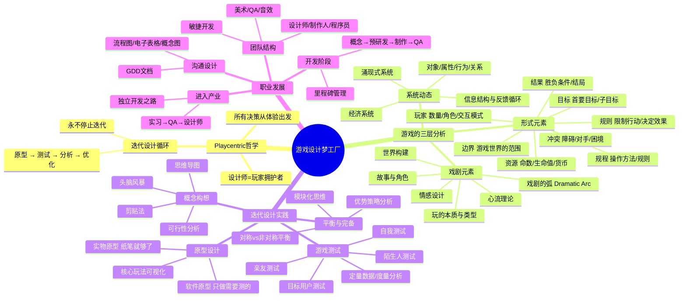

# 📚 《游戏设计梦工厂》读书笔记

## 📖 基础信息

- **英文原名**: Game Design Workshop: A Playcentric Approach to Creating Innovative Games（第4版）
- **作者**: Tracy Fullerton（特雷西·弗雷顿）
- **作者背景**: USC 电影艺术学院互动媒体与游戏专业系主任、USC Games Program 负责人（北美排名第一的游戏设计项目）、独立游戏《瓦尔登湖》创作者、GDC Ambassador Award 获得者、陈星汉的老师
- **译者**: 陈潮（曾在 USC 师从 Fullerton，先后任职完美世界和腾讯）
- **出版社**: 电子工业出版社
- **出版年份**: 2022年7月（中文第4版）/ 2018年（英文第4版）
- **页数**: 584页
- **开始阅读**: 2026-07-15
- **完成阅读**: -
- **阅读状态**: ☐ 正在阅读
- **个人评分**: ⭐⭐⭐⭐⭐
- **豆瓣评分**: 8.5
- **标签**: #游戏设计 #迭代原型 #USC教材 #系统设计 #Playcentric #TracyFullerton

## 📖 内容概要

### 书籍简介

《游戏设计梦工厂》是**北美排名第一的 USC 游戏设计项目的核心教材**，也是游戏设计领域最系统、最实操的教科书。作者 Tracy Fullerton 是 USC 游戏专业的掌门人，也是陈星汉（《风之旅人》《光·遇》）的老师。

本书的核心方法论是 **"Playcentric Approach"（以游玩体验为核心）**——所有设计决策从玩家体验出发，通过循环"原型→测试→修改"的迭代过程逐步打磨。不同于 Schell 的哲学沉思和 Rogers 的嬉笑怒骂，Fullerton 提供的是**学术级的系统框架 + 26 个可立即动手的练习**。

第4版新增了 Switch、VR/AR、独立游戏、包容性设计团队等当代话题，并邀请 Warren Spector、陈星汉、Jane McGonigal 等业界大咖在每章末尾分享实战视角。

### 核心主题

1. **Playcentric 哲学** — 以游玩体验为核心，设计师是"玩家的拥护者"
2. **形式元素+戏剧元素+系统动态** — 游戏的三个分析层次
3. **迭代设计循环** — 原型→游戏测试→分析修改→再原型
4. **从概念到发行** — 完整覆盖游戏设计全生命周期
5. **26个实践练习** — 不需要编程基础的动手练习贯穿全书

### 主要章节（3篇16章）

**第1篇：游戏设计基础（第1-5章）** — 设计师角色、游戏结构、形式元素、戏剧元素、系统动态

**第2篇：设计一款游戏（第6-11章）** — 概念构想、实物原型、软件原型、游戏测试、功能性与平衡性、乐趣与易用性

**第3篇：像设计师一样工作（第12-16章）** — 团队结构、开发阶段与方法、沟通设计、产业理解、进入产业

---

## 🧠 知识架构



---

## ✍️ 分章笔记

### 第1篇：游戏设计基础

#### 第1章：游戏设计师的角色

**核心观点**：设计师首先是**"玩家的拥护者"（Player Advocate）**——在所有人（程序员、美术、市场、老板）都提出各自诉求时，设计师是唯一坚持"这对玩家意味着什么"的人。

**设计师的多重身份**：
- 玩家拥护者 — 替玩家发声
- 沟通者 — 在程序员、美术、制作人之间翻译
- 团队合作者 — 设计不是闭门造车
- 灵感管理者 — 不只是创意，更是管理创意变为现实的过程

**迭代设计流程**：
```
概念 → 原型 → 测试 → 评估 → 修改 → 原型 → 测试 → ...
  ↑_________________________________________________|
```

> **Fullerton 定律**："你的第一个想法永远不是最好的。你的第十个可能是。"

#### 第2章：游戏的结构

**核心观点**：通过对比最极简的游戏和最复杂的游戏，抽象出游戏的本质。

**案例对比**：
- 《钓鱼》（Go Fish，纸牌游戏）：极简规则，纯社会互动
- 《雷神之锤》（Quake）：高速3D，复杂输入，物理引擎

两者的共同点：都有玩家、目标、规程、规则、资源、冲突、边界、结果。

#### 第3章：形式元素的运用 — 游戏设计的"元素周期表"

**核心观点**：本章建立了全文最重要的**分析框架——八个形式元素**：

| 形式元素 | 定义 | 设计关键问题 |
|----------|------|-------------|
| **玩家** | 多少人？什么角色？什么交互模式？ | 单人/多人/合作/竞争/非对称 |
| **目标** | 游戏想让玩家达成什么？ | 终极目标+渐进子目标 |
| **规程** | 玩家能做什么操作？ | 操作→反馈→操作循环 |
| **规则** | 什么被允许？什么被禁止？ | 限制行动/定义后果 |
| **资源** | 玩家可以管理什么？ | 命数/生命值/货币/时间/道具 |
| **冲突** | 什么阻碍玩家达成目标？ | 障碍/对手/困境/随机性 |
| **边界** | 游戏世界的边缘在哪里？ | 物理边界/规则边界/社会边界 |
| **结果** | 游戏如何结束？ | 胜/负/平/无结局/多结局 |

**案例应用**：用这八个元素拆解《四子棋》（Connect Four）和《超级马里奥兄弟》，展示同一个框架如何分析极简和极复杂的游戏。

**🎯 借鉴点**：这套八个形式元素框架可以替代我在游戏分析笔记中目前使用的散乱分析方式。用它作为每款游戏的第一个分析步骤，确保分析的结构完整性。

#### 第4章：戏剧元素的运用

**核心观点**：形式元素定义了游戏**能做什么**，戏剧元素定义了游戏**给人的感觉**。

**关键戏剧元素**：
- **心流理论**：挑战与技能的黄金平衡（齐克森米哈伊的理论基础）
- **戏剧的弧**：开场（建立）→ 发展（冲突升级）→ 高潮（最大紧张）→ 结局（释放）
- **故事与角色**：游戏不一定需要传统"故事"，但一定需要"戏剧性"
- **情感游戏设计**：设计师要有意识地考虑每个环节激发什么情感

#### 第5章：运用系统动态

**核心观点**：游戏不是静态物体的集合，而是一套**交互系统**。

**系统思维的核心**：
- **对象**：游戏中的实体
- **属性**：对象的特征
- **行为**：对象能做什么
- **关系**：对象之间如何关联

**反馈循环**：
- **正反馈**：富者愈富（如《文明》中科技领先→军事更强→征服更多→科技更领先）
- **负反馈**：弱者得到帮助（如《马里奥赛车》中落后时获得更强道具）

> **关键洞察**：游戏设计中最重要的不是单个机制，而是机制之间的互动关系——也就是"涌现"。

---

### 第2篇：设计一款游戏

#### 第6章：概念构想

**核心观点**：创意不是凭空产生的，是有方法可循的。

**头脑风暴技巧**：
- 思维导图 — 从一个中心词出发，不断分支
- 意识流 — 不受限制地连续写10分钟
- 剪贴法 — 从杂志/照片/截图中寻找视觉灵感
- "如果……会怎样" — 假设一个规则改变，会发生什么？

**可行性三问**：这个概念在技术上可行吗？市场有空间吗？成本可控吗？

#### 第7章：原型 — 本书的灵魂章节

**核心观点**：原型不需要代码。你能用纸和笔做的事情比你想象的多得多。

**实物原型的力量**：
- 0行代码，30分钟，纸+笔+骰子 → 能够测试核心循环
- 数字化的最大风险是"看起来像成品但其实玩起来很糟糕"
- 纸面原型强迫你只关注机制，不被视觉效果分心

**经典案例**：《万智牌》的最初版本是 Richard Garfield 手绘的卡片——纸面原型让他测试了"不同颜色代表不同策略"的核心概念。

#### 第8章：软件原型

**核心观点**：只有实物原型无法测试的部分（操作手感、实时性、视觉反馈），才需要软件原型。

**软件原型的四种类型**：
- 机制原型 — 只做核心玩法
- 美学原型 — 只做视觉风格测试
- 动觉原型 — 只做操作手感
- 技术原型 — 只做技术可行性

**核心原则**：**一次只回答一个问题。** 不要做一个"完整但不完美"的原型——做一个"不完整但能完美回答一个问题的"原型。

#### 第9章：游戏测试 — 全书最具实操价值的章节

**核心观点**：游戏测试不是"找人玩一下"，而是一套严谨的方法论。

**测试者金字塔**：
```
        目标用户 ← 最有价值，最难找到
      陌生人 ← 不说谎的反馈
    熟人 ← 可能顾及你的感受
  自己 ← 最好骗的测试者
```

**主持游戏测试的原则**：
1. **不要教他们怎么玩** — 观察他们自己摸索
2. **不要帮他们玩** — 他们卡住的地方就是需要修改的地方
3. **不要为设计辩护** — 他们的困惑就是事实
4. **看他们做什么，不要听他们说什么** — 行为比意见更诚实

**定量数据**：游戏矩阵（死亡次数、通关时间、使用率最低的武器）比"我觉得不好玩"有用一百倍。

#### 第10章：功能性、完备性和平衡性

**核心观点**：游戏从"可以玩"到"好玩"，需要经过系统化的完善过程。

**平衡的两种类型**：
- **对称平衡**：给所有玩家相同的初始条件（国际象棋）
- **非对称平衡**：给不同玩家不同的能力但整体公平（《星际争霸》三族）

**优势策略问题**：当一种策略明显优于所有其他选择时，游戏从一个"策略空间"退化为一个"按按钮"的过程。

#### 第11章：乐趣和易用性

**核心观点**：把"乐趣"这个模糊概念拆解为可操作的维度。

**三层次乐趣模型**：
- 感觉乐趣（Sensory Pleasure）— 好看、好听、手感好
- 幻想乐趣（Fantasy Pleasure）— 成为另一个人，去另一个世界
- 成就感乐趣（Achievement Pleasure）— 克服困难、达成目标、证明自己

**"乐趣杀手"清单**（必须消除的体验）：
- 微操作（Micromanagement）— 让玩家做无意义的重复操作
- 停滞（Stagnation）— 玩家不知道下一步该做什么
- 无法逾越的障碍 — 难度曲线出现断崖
- 可预测的结果 — 一切都在玩家意料之中
- 惩罚与错误不匹配 — 不小心掉坑=从头开始？

---

### 第3篇：像一名游戏设计师一样工作

#### 第12-16章：团队、流程、沟通与产业

**第12章 — 团队**：发行商团队 vs 开发商团队的结构差异；程序/美术/设计/QA 的各自职责；敏捷开发方法论；包容性设计（陈星汉特邀分享）。

**第13章 — 开发阶段**：概念阶段→预研发→制作→QA/优化→发布。每个阶段的里程碑和交付物。

**第14章 — 沟通设计**：GDD 不是写小说的方式——用流程图、电子表格、概念图、可交互原型来"沟通"，而不是用文字描述。

**第15章 — 产业理解**：所有平台（PS/Xbox/Switch/PC/手机/VR/AR）、所有类型、发行商商业模式全景图。

**第16章 — 进入产业**：实习→QA→初级设计师→高级设计师→创意总监的典型路径；独立开发作为另一条路。

---

## 💭 个人思考

### 关于"Playcentric"与其他设计哲学的对比

| 方法 | 始发点 | 核心循环 | 代表作 |
|------|--------|----------|--------|
| Playcentric（Fullerton） | 玩家体验 | 原型→测试→修改 | 《瓦尔登湖》 |
| 体验引擎（Sylvester） | 机制→事件→情感 | 系统→涌现→情感 | 《环世界》 |
| 透镜（Schell） | 100个视角 | 审视→反思→改进 | 通用方法论 |
| 3C实战（Rogers） | 角色/镜头/操作 | 设计→文档→实现 | 《战神》 |

**四种方法的关系**：Playcentric 是"工作流程"（怎么做），体验引擎是"因果逻辑"（为什么有效），透镜是"检查清单"（有没有漏掉什么），3C是"界面焦点"（玩家如何接触游戏）。

### 关于纸面原型的反直觉智慧

Fullerton 最反直觉的建议是："在做数字原型之前，先用纸做一个。"这个建议背后的逻辑是——数字原型的"不完善"很难被区分：是机制不好玩，还是美术太丑？是数值不对，还是操作手感太差？

纸面原型消除了一切视觉/操作层面的干扰，只回答一个问题：**这个核心循环本身有趣吗？**

这与《重构》中的"两顶帽子"原则异曲同工——一次只做一件事。做纸面原型就是戴上"测试机制"的帽子，暂时不关心呈现。

---

## 🎯 实践应用

### 行动计划 1：为个人项目做纸面原型

**具体步骤**：
1. 用纸、笔、骰子、硬币模拟核心游戏循环
2. 找3个人玩这个纸面原型，只观察不解释
3. 如果纸面版本就不好玩，不要开始写代码

### 行动计划 2：用八个形式元素分析已分析的游戏

对 `games/` 目录下每款游戏补充形式元素分析，提升分析的结构化程度。

### 行动计划 3：建立游戏测试日志

每次做项目测试时记录：日期、测试者类型、观察到的行为（而非意见）、发现的问题、计划修改。

---

## 📊 学习总结

**最大收获**：学会了"迭代不是一句口号，而是一套有章可循的工程方法"——从纸面原型到游戏测试，每一步都有具体的工具和流程。

**改变的观念**：
1. "原型 = 写代码" → "纸面原型是最快最有效的原型方式"
2. "测试 = 问我朋友觉得怎么样" → "观察行为 > 听取意见"
3. "设计师 = 有创意的人" → "设计师 = 玩家拥护者 + 迭代管理者"

---

**笔记创建时间**: 2026-07-15 | **最后更新**: 2026-07-15 | **笔记版本**: v1.0

**Sources**: [豆瓣 - 游戏设计梦工厂第4版](https://book.douban.com/subject/35934901/) · [百度百科](https://baike.baidu.com/item/游戏设计梦工厂（第4版）/61565070)
