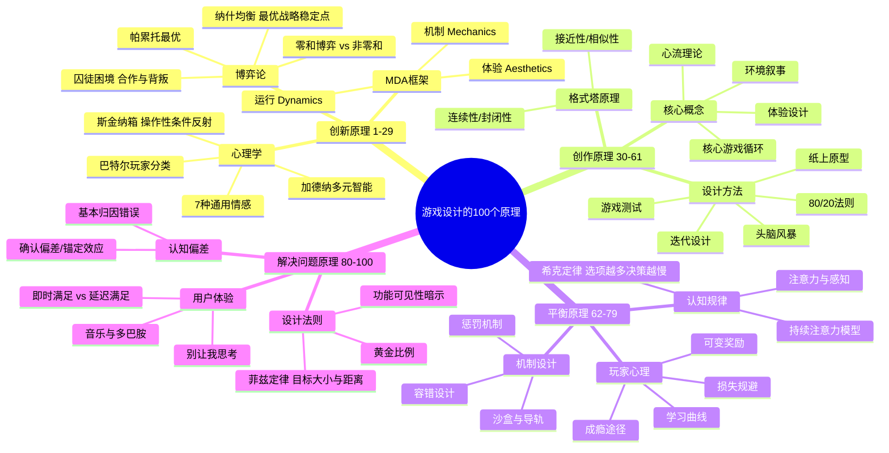

# 📚 《游戏设计的100个原理》读书笔记

## 📖 基础信息

- **英文原名**: 100 Principles of Game Design
- **作者**: Wendy Despain（温迪·德斯佩恩）
- **作者背景**: 资深游戏设计师、编剧和教育者，曾担任 EA《JetSet Secrets》、Playdom《时光花园》（GDC Online 2011 年度最佳社交游戏）叙事设计，Cartoon Network MMO《融合之秋》设计顾问，福赛大学游戏设计教授
- **译者**: 肖心怡
- **出版社**: 人民邮电出版社
- **出版年份**: 2015年2月
- **页数**: 218页（全彩印刷）
- **开始阅读**: 2026-07-15
- **阅读状态**: ☐ 正在阅读
- **个人评分**: ⭐⭐⭐⭐
- **标签**: #游戏设计 #设计原理 #工具书 #跨学科 #速查手册

## 📖 内容概要

### 书籍简介

这是一本**游戏设计的"速查手册"**，不是让你从头读到尾的教材，而是**放在案头随时翻阅的工具书**。Wendy Despain 整合了心理学、博弈论、经济学、神经科学、市场营销、建筑学等多个学科的理论，提炼出 100 条与游戏设计直接相关的原理。每条原理独立成章，2-3 页的篇幅，配有信息图或插画，可随时翻阅参考。

全书分为四大篇章：**创新原理（29条）→ 创作原理（32条）→ 平衡原理（18条）→ 解决问题原理（21条）**，覆盖从概念设想到后期调试的完整设计流程。

### 核心主题

1. **跨学科工具箱** — 游戏设计不是孤岛，几乎所有学科的理论都能为设计所用
2. **独立成章** — 每条原理可作为独立的"思维触发器"使用
3. **从理论到实践** — 每条原理都附有游戏设计中的具体应用案例
4. **四大阶段覆盖** — 创新→创作→平衡→解决问题，一条龙

### 主要内容结构（四大篇章）

**第1篇：游戏创新的一般原理（1-29）** — 博弈论、心理学、MDA框架、玩家类型理论
**第2篇：游戏创作的一般原理（30-61）** — 80/20法则、头脑风暴、心流、核心循环、迭代
**第3篇：游戏平衡的一般原理（62-79）** — 损失规避、学习曲线、希克定律、可变奖励
**第4篇：解决问题的一般原理（80-100）** — 认知偏差、菲兹定律、黄金比例、可用性

---

## 🧠 知识架构



---

## ✍️ 核心原理选摘

### 原理选读（最具实用价值的10条）

| 原理 | 出处 | 游戏设计应用 |
|------|------|-------------|
| **囚徒困境** | 博弈论 | 设计"合作最优但背叛诱人"的多人博弈（如《Among Us》任务vs背叛） |
| **斯金纳箱** | 行为心理学 | 可变比例的奖励比固定比例更能维持行为（如抽卡系统） |
| **MDA框架** | 游戏研究 | 设计师做机制→玩家感受运行→产生体验——三层视角检视设计 |
| **心流理论** | 积极心理学 | 难度与技能匹配，在无聊与焦虑之间的最佳状态 |
| **希克定律** | 认知心理学 | 选项数量与决策时间呈对数关系——简化UI，减少玩家认知负荷 |
| **损失规避** | 行为经济学 | 失去的痛苦≈获得的快乐的2倍——惩罚设计要极其谨慎 |
| **菲兹定律** | 人机交互 | 按钮越大、越近，越容易点击——UI尺寸和位置的设计依据 |
| **80/20法则** | 经济学 | 80%的玩家只用20%的游戏内容——把精力集中在核心体验上 |
| **格式塔原理** | 感知心理学 | 接近/相似/连续/封闭——视觉设计的底层逻辑 |
| **别让我思考** | 可用性工程 | UI的第一准则——玩家不应该需要思考"这个按钮是干什么的" |

### MDA 框架详解（全书最核心的概念）

MDA 是游戏设计中最经典的框架之一：

```
设计师 → 机制(M) → 运行(D) → 体验(A) ← 玩家
        创建规则   玩家与系统   情感反应
                    互动模式    审美体验
```

**三层分析**：
- **机制**：游戏规则层面的描述（伤害公式、经济系统、交互协议）
- **运行**：玩家与机制互动时产生的行为模式（蹲点防守、rush战术、资源囤积策略）
- **体验**：玩家在互动过程中感受到的情感（紧张、惊喜、满足、沮丧）

**关键洞察**：设计师只能控制 M，玩家最终体验到的是 A，而 D 是设计师与玩家之间的"翻译层"——同一个 M 可能产生完全不同的 D，取决于不同玩家的策略和风格。

---

## 💭 个人思考

### 关于"跨学科思维"的价值

Despain 这本书最大的价值不是具体哪条原理，而是展示了**游戏设计可以借用的学科工具之丰富**。读完这 100 条原理，最大的感受是：**游戏设计没有自己的"专属理论"——它的一切理论都来自对人类行为、认知和社会的理解。**

对比 Schell 的透镜（100+ 个游戏设计专属视角），Despain 的 100 个原理（来自已有学科的通用知识）展示了两种互补的思维方式：Schell 从内向外看（游戏设计需要什么）、Despain 从外向内看（其他学科能给游戏设计什么）。两种结合，才是完整的思维工具箱。

### 关于"工具书思维"

不是每本书都需要从头读到尾。Despain 这本书的正确用法是：**遇到具体问题时翻查相关原理，而非按顺序阅读。**
- 设计多人博弈 → 翻"囚徒困境""纳什均衡"
- 调整 UI 布局 → 翻"菲兹定律""希克定律""格式塔原理"
- 玩家说"没动力" → 翻"斯金纳箱""损失规避""可变奖励"

---

## 📊 学习总结

**最大的收获**：建立"跨学科工具箱"意识——游戏设计的问题，往往在其他学科中已经有了答案。

**改变的观念**：
1. "游戏设计有自己的理论" → "游戏设计 = 跨学科知识的创造性应用"
2. "读书必须从头到尾" → "工具书按需查阅，效率更高"

---

**笔记创建时间**: 2026-07-15 | **最后更新**: 2026-07-15 | **笔记版本**: v1.0

**Sources**: [百度百科](https://baike.baidu.com/item/游戏设计的100个原理) · [微信读书](https://weread.qq.com/web/bookDetail/e09328e0811e1a6ebg0185d7)
