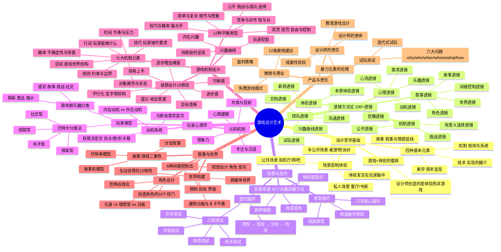
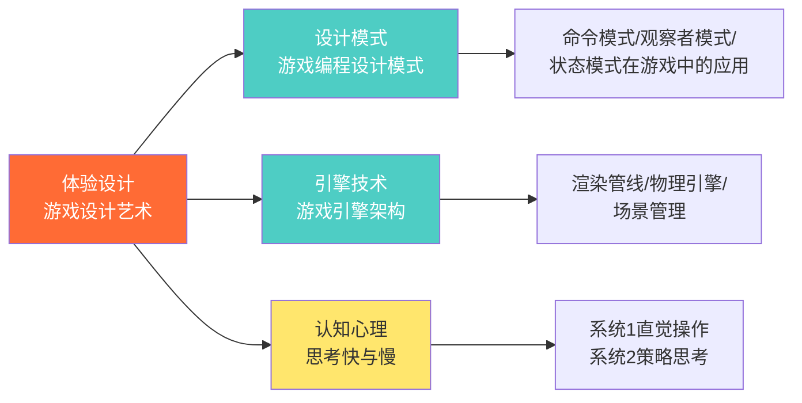

# 📚 《游戏设计艺术》读书笔记

## 📖 基础信息

- **英文原名**: The Art of Game Design: A Book of Lenses（第3版·10周年纪念版）
- **作者**: Jesse Schell（杰西·谢尔）
- **作者背景**: 卡内基-梅隆大学娱乐科技中心教授、Schell Games 公司 CEO、前迪士尼虚拟现实工作室创意总监、前 IGDA（国际游戏开发者协会）主席
- **译者**: 刘嘉俊 等
- **出版社**: 电子工业出版社
- **出版年份**: 2024年（中文纪念版）/ 2020年（英文第3版）/ 2008年（第1版）
- **页数**: 644页（中文纪念版）
- **开始阅读**: 2026-07-15
- **完成阅读**: -
- **阅读状态**: ☐ 正在阅读
- **个人评分**: ⭐⭐⭐⭐⭐
- **豆瓣评分**: 9.3
- **标签**: #游戏设计 #游戏设计 #透镜方法论 #体验设计 #JesseSchell #设计思维

## 📖 内容概要

### 书籍简介

《游戏设计艺术》被誉为**"游戏设计师的圣经"**，是全球游戏设计领域最具影响力的著作之一。作者 Jesse Schell 并非教你"如何写代码"或"如何使用引擎"，而是从**体验设计**的根本出发，提出了一套名为**"透镜"（Lenses）**的独特方法论——全书包含 100+ 个透镜，每个透镜都是一套精心设计的问题集，帮助设计师从心理学、建筑学、音乐、视觉设计、电影、软件工程、主题公园设计、数学、谜题设计和人类学等多学科视角反复审视自己的游戏设计。

第3版新增了 VR/AR 平台内容，加入《神秘海域4》《最后生还者》等当代案例，以及免费游戏、混合游戏、严肃游戏等话题。书中附有一套可撕下的**透镜卡片（Deck of Lenses）**，供设计师在头脑风暴中随时取用。

### 核心主题

1. **游戏设计 = 体验设计** — 设计师不是在制作游戏，而是在为玩家创造有意义的体验。游戏只是承载体验的媒介。
2. **四种基本元素** — 任何游戏都由**机制、故事、美学、技术**四大元素构成，四者如皮肤与骨骼般相互依存。
3. **透镜方法论** — 100+ 个透镜构成一套完整的"设计检查清单"，每个透镜都迫使你从一个特定角度重新审视设计决策。
4. **迭代为王** — "你的游戏前几个版本一定是错的"，快速原型、频繁测试、持续改进是唯一正确的设计流程。
5. **以玩家为中心** — 理解玩家的心理模型、动机系统、专注机制和情感反应是游戏设计的心理学基础。
6. **设计的责任** — 游戏有能力改变玩家，设计师必须意识到自己的伦理责任。

### 主要章节（六大板块，34章）

**板块一：设计基础（第1-6章）** — 游戏设计师的角色定位、体验的本质、游戏的元素构成、主题统一性

**板块二：创意与迭代（第7-8章）** — 灵感来源与头脑风暴方法、八项测试与原型设计技巧

**板块三：玩家心理（第9-11章）** — 玩家类型学、心理模型与想象、动机系统

**板块四：游戏机制（第12-16章）** — 七大游戏机制、12种平衡类型、谜题设计、界面设计、兴趣曲线

**板块五：故事与世界（第17-22章）** — 故事与游戏的关系、间接控制、跨媒体世界、角色设计、空间建筑、美学

**板块六：团队、商业与社会责任（第23-34章）** — 多人游戏与社群、团队合作、试玩测试、技术选择、客户管理、推销技巧、盈利模式、教育游戏、伦理责任

---

## 🧠 知识架构



---

## ✍️ 分章笔记

### 板块一：设计基础（第1-6章）

#### 第1章：太初之时，有设计师

**核心观点**：游戏设计师首先是一个**倾听者**——倾听玩家、倾听团队、倾听游戏本身、倾听客户、倾听自己的内心。Schell 提出"五种倾听"模型，认为这才是设计师最重要的技能。

**关键概念**：
- **设计师必备技能**：动画、人类学、建筑学、头脑风暴、商业、电影摄影、沟通、创意写作、经济学、工程学、历史、管理、数学、音乐、心理学、公开演讲、音效设计、技术写作、视觉艺术——至少比大多数人更擅长其中一项
- **信心的魔法**：设计过程中需要一种"假装知道自己在做什么"的勇气，直到你真的知道
- **天才的秘密**：不是天赋，而是对某个小领域的极度专注

> **透镜 1 — 情感透镜**
> "人们玩游戏是为了获得某种情感体验。你的游戏唤起了玩家什么样的情感？为什么？你希望玩家感受到什么？"

#### 第2章：设计师创造体验

**核心观点**：本章是最重要的哲学基础。Schell 明确指出：**"游戏设计师关心的不是游戏本身，而是游戏所创造的体验。"** 游戏只是一个媒介，如同 CD 是音乐的媒介。

**关键概念**：
- 体验是人类意识中的主观现象，无法被直接设计
- 设计师能做的，是创造**可能产生理想体验的条件**
- 三个学科帮助我们理解体验：心理学（体验的本质）、人类学（不同文化中的体验差异）、设计学（如何有目的地塑造体验）

> **透镜 2 — 本质体验透镜**
> "停下来想一想，你希望玩家拥有什么样的体验。用尽可能纯粹的词语描述这种感觉。然后找到一种游戏机制，能够最直接地传达这种体验。"

**🎯 借鉴点**：这个思想直接适用于我的 Godot 游戏项目中（`books/game-dev/Godot引擎游戏开发/`）。在设计任何功能前，先问"这个功能带来什么体验"而非"这个功能怎么实现"。见本质体验透镜——在 Godot 中，这意味着先确定核心情绪目标（如"自由飞翔的快感"），再设计对应的物理参数和视觉效果。

#### 第3章：体验发生于场景

**核心观点**：游戏体验深受**游玩场景**的影响。同一个游戏在客厅（私人场景）、街机厅（公共场景）、桌游吧（半公开场景）中的体验完全不同。

**关键概念**：
- 私人场景：电视、电脑、手机、VR 头显
- 公共场景：街机、电竞馆、展会
- 半公开场景：桌游、派对游戏、局域网聚会
- Wii、Switch、VR 的成功，很大程度上是因为它们重新定义了场景

> **透镜 3 — 场景透镜**
> "玩家的游戏体验发生在什么物理空间？这个空间如何影响了他们的游戏体验？你能改变场景来改善体验吗？"

#### 第4章：体验从游戏中诞生

**核心观点**：在讨论了体验和场景之后，Schell 正式定义"什么是游戏"。他综合了多位理论家的定义后提出自己的理解。

**游戏的十层定义**：
1. 游戏是**自愿**参与的
2. 游戏有**目标**
3. 游戏有**冲突**
4. 游戏有**规则**
5. 游戏可以**赢和输**
6. 游戏是**交互的**
7. 游戏有**挑战**
8. 游戏能创造**内在价值**
9. 游戏会**吸引**玩家
10. 游戏是**闭合的正规系统**

> **透镜 4 — 惊奇透镜**
> "你的游戏中有没有会让玩家感到惊喜的东西？当他们玩的时候，有没有什么东西让他们睁大眼睛，说'哇'？"

#### 第5章：游戏由元素构成

**核心观点**：这是全书最经典的理论框架——**四种基本元素**。Schell 认为任何游戏都由四种相互关联的元素构成，它们犹如"皮肤"与"骨骼"：

```
┌─────────────────────────────────────────┐
│              美学 (Aesthetics)            │
│    ┌───────────────────────────────┐    │
│    │    机制 (Mechanics)            │    │
│    │   ┌─────────────────────┐     │    │
│    │   │  故事 (Story)       │     │    │
│    │   │  ┌───────────┐     │     │    │
│    │   │  │ 技术       │     │     │    │
│    │   │  │(Technology)│     │     │    │
│    │   │  └───────────┘     │     │    │
│    │   └─────────────────────┘     │    │
│    └───────────────────────────────┘    │
└─────────────────────────────────────────┘
```

- **机制**：游戏的规则和系统。它决定了玩家能做什么，游戏如何响应。是游戏的**骨骼**。
- **故事**：游戏中的叙事序列。是游戏的**血肉**。
- **美学**：游戏的外观、声音、气味、触感。是游戏的**皮肤**——玩家最先感知到的部分。
- **技术**：使游戏得以运行的媒介。是游戏的**器官**——所有其他元素运作的前提。

四种元素必须**协调统一**，形成**共鸣的主题**。它们不是孤立的：改变机制会影响故事，改变技术会限制美学选择。

> **透镜 5 — 四种元素透镜**
> "你真正使用了全部四种元素吗？你的设计是否均匀地分布在四种元素上？有没有某种元素被忽视？如果加强某种元素，体验会更好吗？"

**🎯 借鉴点**：这个框架可以直接用于分析任何游戏。在写游戏分析笔记时（如 `games/` 目录下各款游戏分析），用这四种元素拆解可以保证分析的完整性。尤其是在写《游戏编程设计模式》读书笔记后，补充这个设计视角，使得"怎么实现"与"为什么这样设计"形成完整的认知链条。

#### 第6章：元素支撑起主题

**核心观点**：四种元素需要被一个**统一的主题**统领。主题不是"西部"或"科幻"这样的表面设定，而是"我们想说什么"。好的主题让所有设计决策都趋向一致，产生**共鸣**。

Schell 的建议：**确认你的主题，然后让所有东西都支持它。** 如果你的游戏主题是"友谊的力量"，那么机制应该鼓励合作而非竞争，故事应该展示友谊的价值，美学应该温暖而有亲和力。

> **透镜 6 — 统一主题透镜**
> "如果我的游戏有一个主题，它会是什么？我怎么才能让游戏中的所有元素都强化这个主题？"

---

### 板块二：创意与迭代（第7-8章）

#### 第7章：游戏始于一个创意

**核心观点**：好的创意不是等来的，而是通过系统化的头脑风暴和有意识的灵感管理产生的。Schell 提供了 **16 条灵感来源和头脑风暴建议**：

| # | 技巧 | 说明 |
|---|------|------|
| 1 | 保持安静 | 灵感需要空间降临 |
| 2 | 放低姿态 | 不要期待灵感自己来 |
| 3 | 记下一切 | 随身携带笔记本 |
| 4 | 审视你的需求 | 清楚知道自己要什么 |
| 5 | 摆脱干扰 | 关闭手机和网络 |
| 6 | 改变你的视角 | 用孩子的眼光看、用老人的眼光看 |
| 7 | 混合搭配 | 把不相关的东西放到一起 |
| 8 | 与他人交流 | 碰撞激发新想法 |
| 9 | 换个环境 | 咖啡馆、公园、美术馆 |
| 10 | 写俳句 | 强迫自己用极简的形式提炼想法 |
| 11 | 不要自我审查 | 先发散再收敛 |

> **透镜 7 — 无尽灵感透镜**
> "你的生活中有什么东西让你感到好奇？你最近有没有学到什么新东西？你上次尝试新事物是什么时候？"

#### 第8章：游戏通过迭代提高

**核心观点**：这是 Schell 设计哲学中最核心的实践原则——**迭代是一切**。你的第一个想法几乎一定是错的，你需要快速验证、快速修改。

**八项测试**（每个原型必须通过）：
1. 艺术测试 — 看起来对吗？
2. 体验测试 — 玩起来对吗？
3. 技术测试 — 能实现吗？
4. 市场测试 — 有人想要吗？
5. 商业测试 — 能赚钱吗？
6. 伦理测试 — 负责任吗？
7. 社交测试 — 对玩家及其社交圈产生什么影响？
8. 迭代测试 — 每次迭代后重新评估以上七项

**原型设计的 10 个技巧**：
1. 先回答一个具体问题
2. 忘掉质量，追求速度
3. 不要执着
4. 为你的原型设定时间限制
5. 用纸和笔开始
6. 先做核心循环
7. 先做最不确定的部分
8. 保持循环：原型→测试→分析→改进
9. 尽早吸收外部反馈
10. 知道何时停止

> **透镜 8 — 八项测试透镜**
> "你的游戏设计是否通过了全部八项测试？哪项测试现在是最大的风险？你下一步应该集中解决哪个问题？"

**🎯 借鉴点**：迭代测试的思想对我的 Godot 练习项目（`books/game-dev/Godot引擎游戏开发/`）和 Unity 项目（`books/game-dev/Unity3D高级编程主程手记/`）都有直接指导意义——做功能前先纸面原型，最小化实现核心循环，每完成一个功能立即试玩评估体验。

---

### 板块三：玩家心理（第9-11章）

#### 第9章：游戏为玩家而生

**核心观点**：了解你的玩家是设计好游戏的前提。Schell 汇总了游戏设计中的两大玩家分析框架：

**LeBlanc 的 8 种乐趣分类**：
| 乐趣类型 | 描述               | 典型游戏                      |
|----------|--------------------|-----------------------------|
| 感官     | 视听享受           | 《风之旅人》《GRIS》          |
| 幻想     | 成为另一个人       | 《塞尔达传说》《上古卷轴》     |
| 叙事     | 体验戏剧性情节     | 《最后生还者》《巫师3》        |
| 挑战     | 克服困难           | 《黑暗之魂》《只狼》           |
| 社交     | 与人互动的快乐     | 《Among Us》《动物森友会》     |
| 探索     | 发现新领域         | 《塞尔达：旷野之息》《空洞骑士》|
| 表达     | 创造和表达自我     | 《我的世界》《动物森友会》     |
| 服从     | 沉浸在重复活动中   | 《俄罗斯方块》《星露谷物语》   |

**Bartle 的 4 种玩家类型**（基于 MUD 研究）：
- **杀手型**：享受竞争、击败他人、排名
- **成就型**：享受达成目标、收集、完美通关
- **社交型**：享受与人互动、交朋友、合作
- **探索型**：享受发现、探索系统边界、理解规则

Schell 提醒：真实玩家往往混合多种类型，但了解这些类型有助于思考"你的游戏主要服务哪种玩家"。

> **透镜 9 — 四种玩家类型透镜**
> "你的游戏分别吸引了哪种类型的玩家？是否有一种类型的玩家完全被忽视了？如果你能更好地吸引被忽视的类型，体验会更好吗？"

#### 第10章：体验在玩家的脑中

**核心观点**：体验不是游戏中客观存在的，而是在玩家大脑中被**建构**出来的。Schell 引用了认知科学的四个关键概念：

1. **心理建模** — 玩家在大脑中构建游戏世界的心智模型。设计师的任务是让这个模型尽可能清晰、一致。
2. **专注** — 当玩家完全沉浸时，他们进入一种"心流"状态，忘记时间、忘记自我。
3. **共情** — 玩家将自己的情感投射到游戏角色和情境中。
4. **想象** — 玩家用想象力填充游戏留下的空白。最好的游戏给想象力留出空间，而不是填满每一个细节。

> **透镜 10 — 建模透镜**
> "玩家需要建立什么样的心智模型才能玩你的游戏？这个模型中有没有不合理或令人困惑的部分？你怎么让心智模型的构建更容易？"

> **透镜 11 — 想象透镜**
> "你的游戏给玩家留下了什么来想象？你填充了所有的空白吗？如果你给玩家留下更多的想象空间，体验会更有力量吗？"

#### 第11章：玩家的动机驱使着玩家的脑

**核心观点**：游戏之所以吸引人，根源在于它们满足了玩家的深层心理需求。Schell 整合了需求层次理论与自我决定论：

**动机的层次**：
```
┌────────────────────────────────┐
│  自我实现 (Self-Actualization)  │  ← 最好游戏的作用层次
│  尊重 (Esteem)                   │
│  归属 (Belonging)                │
│  安全 (Safety)                   │
│  生理 (Physiological)            │
└────────────────────────────────┘
```

**内在动机 vs 外在动机**：
- 外在动机：奖励、积分、成就徽章 → **短期有效，长期有害**
- 内在动机：挑战的乐趣、自我表达、好奇心 → **长期驱动力**

**自我决定论的三大基本需求**：
- **自主** — 玩家需要感到自己掌控局面
- **胜任** — 玩家需要感到自己有能力应对挑战
- **关联** — 玩家需要感到与他人的连接

> **透镜 12 — 动机透镜**
> "你的游戏主要激发的是哪种动机？是内在动机还是外在动机？你怎么让玩家感到更多的自主、胜任和关联？"

---

### 板块四：游戏机制（第12-16章）

#### 第12章：有些元素是游戏机制

**核心观点**：Schell 将游戏机制分解为**七大核心元素**：

| 元素 | 说明 | 设计关键 |
|------|------|----------|
| **空间** | 游戏世界的几何/拓扑结构 | 离散 vs 连续、多少维度、区域划分 |
| **时间** | 游戏的时间结构 | 实时 vs 回合制、时间限制、时间扭曲 |
| **对象、属性和状态** | 游戏中的所有实体 | 每个对象有什么属性、状态如何变化 |
| **行动** | 玩家能发起的操作 | 基础操作与衍生操作 |
| **规则** | 约束行为的方式 | 规则越少越好、规则产生涌现性 |
| **技巧** | 玩家操作所需的能力 | 身体技巧、心智技巧、社交技巧 |
| **概率** | 不确定性的引入 | 确定性 vs 随机性、风险与回报 |

> **透镜 13 — 机制透镜**
> "你的游戏中有哪些机制？它们彼此如何关联？哪些是最重要的？如果你删掉其中一个，游戏会变得怎样？"

#### 第13章：游戏机制必须平衡

**核心观点**：平衡不是各元素均等，而是让游戏系统产生**最优体验**。Schell 列出了需要平衡的 **12 个维度**：

1. **公平** — 所有玩家都有平等的机会
2. **挑战与成功** — 挑战难度与玩家技能匹配
3. **有意义的选择** — 每个选择都对游戏结果有影响
4. **技巧与概率** — 技巧的掌控感与概率的惊喜感
5. **脑力与体力** — 策略深度与操作强度
6. **竞争与合作** — PvP 的刺激与合作的社会性
7. **短期与长期** — 即时奖励与长期目标
8. **奖赏** — 奖励的频率、大小和类型
9. **惩罚** — 失败的代价（太高则焦虑、太低则不在乎）
10. **自由与控制** — 玩家自由与设计师引导
11. **简单与复杂** — 易学难精的黄金法则
12. **细节与想象** — 展示的细节与留给想象的空间

> **透镜 14 — 平衡透镜**
> "你的游戏在哪些维度上是平衡的？哪些维度上不平衡？这种不平衡是故意的还是疏忽？"

**🎯 借鉴点**：这12个平衡维度可以作为游戏分析笔记的标准分析框架。在分析《游戏编程设计模式》中的观察者模式、状态模式时，可以映射到这些平衡维度——例如，状态模式用来管理"简单与复杂"的平衡，观察者模式确保"有意义的选择"能被正确反馈。

#### 第14章：游戏机制支持谜题

**核心观点**：谜题是游戏设计中最古老也最基础的机制之一。Schell 提出 **10 大谜题设计原则**：

1. 让目标容易理解
2. 让开始变得容易
3. 给进步的感知
4. 给可解的感觉
5. 逐渐增加难度
6. 平行化（玩家可以跳过一个去尝试另一个）
7. 金字塔结构（小谜题引向大谜题）
8. 提示系统（让卡关成为可控体验）
9. 给答案（在某些时候直接给出答案比让玩家离开更好）
10. 知觉偏移（改变玩家的思维方式后，原本困难的问题变得简单）

> **透镜 15 — 谜题透镜**
> "你的谜题设计用了上述哪些原则？有没有可以加入的新原则来改善谜题体验？"

#### 第15章：玩家通过界面玩游戏

**核心观点**：界面是玩家与游戏机制之间的桥梁。Schell 用"互动循环"模型描述界面设计：

```
  ┌─────────┐    输出    ┌─────────┐
  │  游戏    │ ────────→ │  玩家    │
  │  (Game)  │ ←───────  │ (Player) │
  └─────────┘    输入    └─────────┘
```

**界面设计的 10 条建议**：
1. 偷窃（学习最好的界面设计）
2. 统一性（相同的操作做相同的事）
3. 不要覆盖太多信息通道
4. 让输入变得优雅（操作本身就是一种乐趣）
5. 不要用界面妨碍游戏
6. 可自定义（让玩家调整界面）
7. 考虑触觉反馈
8. 模式切换要清晰
9. 帮助玩家记住操作
10. 为玩家设计而非为你自己

> **透镜 16 — 界面透镜**
> "你的界面让玩家做什么变得更容易？什么变得更难？在哪里界面本身成为了体验的一部分？在哪里界面阻碍了体验？"

#### 第16章：体验可以用兴趣曲线来评价

**核心观点**：好的游戏体验像一条精心设计的**兴趣曲线**，它有三个组成部分：

```
兴趣
 ↑        ╱╲        ╱╲      ╱╲
 │   ╱╲  ╱  ╲  ╱╲ ╱  ╲  ╱╲  ╲
 │  ╱  ╲╱    ╲╱  ╱    ╲╱  ╲  ╲
 │ ╱              ╱            ╲___
 │╱______________╱_________________→ 时间
    高潮     低谷    高潮   结局
```

1. **内在兴趣**：游戏内容本身的吸引力（故事设定、角色、世界）
2. **诗歌般的呈现**：节奏、对比、重复、高潮与低谷的艺术化安排
3. **玩家的投射**：玩家自己的想象、情感投入和个性化的解读

> **透镜 17 — 兴趣曲线透镜**
> "画一下你的游戏的兴趣曲线。哪个部分是最高点？哪个部分是最低点？你怎么让兴趣曲线变得更像是'过山车'？"

---

### 板块五：故事与世界（第17-22章）

#### 第17章：有种体验叫作故事

**核心观点**：故事和游戏之间存在一种**"二象性"**——它们既可以互相对立（"我想让玩家自由探索，但故事需要线性推进"），也可以互相增强（"当玩家的选择和故事主题一致时，体验达到巅峰"）。

**两种故事结构模型**：
- **珍珠串模型**：游戏是珍珠（自由游玩段落），故事是串线（线性叙事段落）。珍珠之间用不可互动的过场动画连接。这是《最后生还者》等3A游戏的主流模式。
- **故事机模型**：故事由游戏系统自动生成，每个玩家的故事都不同。这是《模拟人生》《矮人要塞》《RimWorld》等沙盒游戏的模式。

**故事设计的 8 个秘诀**：
1. 目标、障碍和冲突
2. 简单和超越
3. 英雄之旅
4. 故事的一致性
5. 让故事融入机制
6. 不要只说"发生了什么"——要说"为什么会发生"
7. 现实主义不等于真实
8. 结局很重要

> **透镜 18 — 故事透镜**
> "玩家会记住什么样的故事？故事中的哪些时刻是他们永远不会忘记的？你的游戏机制怎么帮助讲述这个故事？"

#### 第18章：故事和游戏结构的间接控制

**核心观点**：如何在不剥夺玩家自由的前提下引导他们经历故事？Schell 提出 **6 种间接控制方法**：

| 方法 | 原理 | 例子 |
|------|------|------|
| 限制 | 缩小可做的选择范围 | 锁住的门、限定区域 |
| 目标 | 用任务目标暗示"下一步" | 任务标记、导航箭头 |
| 界面 | 界面突出某些选项 | 高亮可交互物品 |
| 视觉设计 | 用视觉线索引导注意力 | 灯光、颜色对比、构图 |
| 角色 | NPC 的行为和对话暗示 | 队友说"我们应该走这边" |
| 音乐 | 音乐变化暗示情势变化 | 战斗音乐→探索音乐 |

> **透镜 19 — 间接控制透镜**
> "你的游戏在哪些地方用间接控制引导了玩家？玩家是否感受到了自由？如果完全去掉某种间接控制，体验会变好吗？"

**🎯 借鉴点**：间接控制的概念可以直接应用于我的 Godot 关卡设计。例如，用光照引导而非箭头标记（视觉设计+限制的组合），让玩家"自己发现"路径，而非被 UI 牵着走。这与《游戏引擎架构》中讨论的场景管理和《游戏编程设计模式》中的命令模式（用于剧情触发）可以整合。

#### 第19章：在世界里发生的故事与游戏

**核心观点**：很多成功的游戏不只是"有一个故事"，而是"创造了一个世界"。Schell 讨论了**跨媒体世界**的概念——一个统一的世界观可以跨越游戏、小说、电影、漫画（如《精灵宝可梦》、漫威宇宙）。

**跨媒体世界的成功要素**：
- 世界必须有自己的规则和逻辑
- 每个媒介类型展示世界的不同侧面
- 世界比任何单一故事都大——留下探索空间

> **透镜 20 — 世界透镜**
> "你的游戏发生在一个什么样的世界里？这个世界比游戏本身更大吗？玩家离开游戏后还会继续想这个世界吗？"

#### 第20章：世界中的角色

**核心观点**：玩家角色有三种基本设计范式：
- **化身**：完全由玩家控制的"空白"载体（如《塞尔达》的 Link、《半条命》的 Gordon Freeman）
- **理想型**：玩家想成为的那种人（如《巫师》的杰洛特、《战神》的奎托斯）
- **白板**：玩家可以完全自定义的角色（如《上古卷轴》的龙裔）

**恐怖谷效应**：角色越接近真实人类但不完全像时，越让人感到不适。这是设计师在追求写实风格时需要谨慎处理的。

> **透镜 21 — 角色透镜**
> "你的玩家角色是化身、理想型还是白板？这种选择是否符合你想要的体验？NPC 角色有深度吗？"

#### 第21章：世界里的空间

**核心观点**：建筑师与关卡设计师做的是同一件事——创造人们在其中生活、体验的空间。Schell 引入建筑学视角分析游戏空间：

**生动结构的 15 项特性**（Christopher Alexander 启发）：
1. 层次等级 2. 中心和边缘 3. 正空间 4. 渐变 5. 粗糙感
6. 回声 7. 简单与内在平静 8. 不分离 9. 对比 10. 深刻
11. 对称 12. 模糊 13. 空的空间 14. 不相似 15. 连接

> **透镜 22 — 空间透镜**
> "玩家在空间中移动的感觉是什么？空间的大小、形状、节奏传达了什么样的情感？"

#### 第22章：世界的外观与感觉——美学

**核心观点**：美学不只是"好看"，而是游戏设计中与玩家建立情感连接的最直接方式。Schell 提出"学会观察"的重要性——设计师需要训练自己像画家一样观察世界。

> **透镜 23 — 美学透镜**
> "你的视觉风格是独一无二的吗？它是否强化了主题？如果你只能用一个词形容你的视觉风格，那会是什么？"

---

### 板块六：团队、商业与社会责任（第23-34章）

#### 第23-24章：多人游戏与社群

**核心观点**：多人游戏不只是"加更多玩家"，而是从根本上改变了体验的本质。

**强大社群的 10 条建议**：
1. 创造聚集点 2. 给玩家身份 3. 培养领导者 4. 分享知识
5. 创造仪式 6. 分享价值观 7. 给玩家改变世界的力量 8. 欢迎新玩家
9. 处理冲突 10. 倾听社区

#### 第25-26章：团队合作与文档沟通

Schell 强调"共同设计"的重要性——最好的设计决策往往来自团队成员之间的碰撞，而非设计师的孤立思考。他也讨论了游戏设计文档（GDD）的正确写法：不是一次性写就的厚重文档，而是**活文档**，随项目迭代持续更新。

#### 第27章：通过试玩创造好游戏

**试玩测试六大问题**：
- **为什么？** 这次测试想学到什么？
- **谁？** 找谁来试玩？（自己人→熟人→陌生人→目标受众）
- **何时？** 越早越好，越频繁越好
- **何处？** 尽可能接近真实的使用场景
- **什么？** 观察什么行为？记录什么数据？
- **怎样？** 用什么方式收集反馈？

#### 第28章：制作游戏的技术

Schell 的两大技术分类：
- **基础性技术**：实现游戏核心的必要技术
- **装饰性技术**：改善体验但不改变核心的技术

**创新者的窘境**：成熟团队常因已有技术积累而忽视颠覆性新技术，导致被"更差但更新"的技术击败。

#### 第29-31章：客户与商业

12 条推销建议、免费游戏模式分析、盈利策略讨论。Schell 的观点相当务实：商业成功不是设计的敌人，理解商业模式能让你的游戏触达更多玩家。

#### 第32-33章：游戏改变玩家

**教育游戏的设计原则**：
- 学习的过程就是游戏的过程
- 不要用游戏"包装"无聊的内容
- 最好的教育游戏让玩家忘记自己在学习

**设计师的伦理责任**：
- 你的游戏在成瘾性设计上有没有道德边界？
- 暴力元素的设计是帮助玩家释放还是放大了现实暴力？
- 你希望你的游戏让世界变得更好还是更糟？

#### 第34章：每个设计师都有个目标

全书以哲学和反思收尾。Schell 认为，最好的游戏来自于设计师最深层的个人关切：**"你为什么要做游戏？你最想对这个世界说什么？"**

---

## 💭 个人思考

### 关于"透镜方法论"的深层解读

Schell 的透镜不是"设计指南"而是"思维工具"。关键区别在于：指南告诉你"做什么"，透镜问"你有没有考虑过这个维度"。这个差别非常关键：

**指南的局限**：游戏设计没有正确答案。同一款游戏可以是 8-bit 像素风也可以是照片级写实，《蔚蓝》是前者，《战神》是后者，两者都是杰作。

**透镜的优势**：它不预设答案，只预设**值得问的问题**。"你的美学风格一致吗？"这个问题对《蔚蓝》和《战神》都有效，但它们的答案完全不同。

这让我联想到《重构》一书中的"代码坏味道"——它同样不是规则，而是"这里有值得检查的东西"的信号。两者的设计哲学完全一致：**好的判断工具帮助你做自己的判断，而不是替你判断**。

### 关于四种元素的跨领域类比

Schell 的四种元素模型可以映射到非游戏领域：

| 游戏设计 | 软件产品 | Web 开发 |
|----------|---------|----------|
| 机制     | 功能逻辑 | 后端 + 业务规则 |
| 故事     | 用户旅程 | 信息架构 + 内容策略 |
| 美学     | UI/UX | 前端视觉 + 动效 |
| 技术     | 技术栈 | 框架 + 基础设施 |

这个映射验证了 Schell 框架的普适性——不仅是游戏，任何体验设计都可以用这四个维度审视。

### 关于内在动机的再反思

Schell 引用自我决定论的观点非常深刻：外在奖励（积分、徽章、每日签到）在短期有效，但长期会**侵蚀**内在动机。这是游戏化设计中最常见的错误——把游戏化等同于"加积分和排行榜"，反而破坏了用户本来可能存在的内在兴趣。

这让我联想到《真本事：从会工作到会赚钱》（`books/thinking/` 目录）中关于内在驱动力的讨论。真正好的游戏化不是给用户"胡萝卜"，而是让任务本身变得像游戏一样有内在吸引力。

---

## 🎯 实践应用

### 行动计划 1：用透镜方法论审查自己的项目

**具体步骤**：
1. 针对目前 Godot 练习项目，选取 5 个最相关的透镜进行自我审查
2. 建议优先级：本质体验透镜 → 四种元素透镜 → 兴趣曲线透镜 → 平衡透镜 → 界面透镜
3. 每个透镜写 200 字以上的审查报告，记录发现的问题和改进计划

**预期效果**：从"技术实现"视角切换为"体验设计"视角，发现之前从未考虑过的设计缺陷

### 行动计划 2：建立游戏分析的标准化框架

**具体步骤**：
1. 基于四种元素 + 12 种平衡维度 + 兴趣曲线，建立游戏分析的标准检查清单
2. 为 `games/` 目录下的每款游戏补充此框架的分析

**预期效果**：游戏分析不再流于表面感受，而是有结构化的设计语言支撑

### 行动计划 3：将间接控制应用到 UI 设计

**具体步骤**：
1. 梳理项目中所有"直接告诉玩家做什么"的 UI 元素
2. 逐一评估能否用间接控制替代（视觉引导、NPC 暗示、音乐变化）
3. 实现至少 2 处从直接控制到间接控制的转换

**预期效果**：玩家感受到更多的自主性和沉浸感

---

## 🔗 相关扩展

### 相关书籍推荐

1. **《体验引擎》**（Tynan Sylvester）— 同样是"体验优先"的设计哲学，更深入地讨论涌现型叙事和系统设计
2. **《A Theory of Fun for Game Design》**（Raph Koster）— 从认知科学角度剖析"乐趣"的本质
3. **《游戏设计梦工厂》**（Tracy Fullerton）— USC 教材，含大量动手练习
4. **《游戏编程设计模式》**（Robert Nystrom）— Schell 讨论"机制"时提到的大量设计模式在此书中展开技术实现
5. **《游戏引擎架构》**（Jason Gregory）— 四种元素中"技术"部分的工程级展开

### 延伸阅读

- Jesse Schell 的 GDC 演讲视频（YouTube），特别是关于"游戏化"的经典讲座
- Deck of Lenses 官方 App（iOS/Android），可随时随机抽取一张透镜卡片
- Schell Games 工作室官网及其 I Expect You To Die 系列 VR 游戏案例分析

### 实践资源

- **Game Design Workshop** 在线课程（对应《游戏设计梦工厂》）
- **Global Game Jam** — 48小时内从零到原型的极限迭代实践
- **itch.io** — 大量独立游戏案例，可以用来练习用透镜分析法拆解

---

## 💭 深度衍生思考

### 🎯 核心观点延伸

**延伸 1：从"四种元素"到"四种负债"**

Schell 讨论四种元素时总是从"如何做好"的角度出发，但我反过来想：四种元素如果处理不当，会成为**四种负债**：

- **机制负债**：复杂但无深度的规则系统，徒增学习成本
- **故事负债**：冗长的过场动画和对话，打断而非增强体验
- **美学负债**：高预算但无辨识度的"3A 脸"，千篇一律的影视化呈现
- **技术负债**：过度追求新技术，导致 Bug 遍地、稳定性差

这个反向视角的实用价值：在项目初期，与其问"我们的四种元素强不强"，不如问"我们的四种元素有没有变成负债"——后者更容易识别和修复。

**延伸 2：透镜方法论与"刻意练习"**

Schell 的 100+ 个透镜本质上是一套**刻意练习系统**。安德斯·艾利克森的研究表明，高手与普通人的区别不在于练习时间，而在于练习方式——高手总是在**特定维度上有意识地练习**。透镜正是提供了这些维度：今天练习用"本质体验透镜"看你的游戏，明天用"兴趣曲线透镜"，后天用"公平透镜"……循序渐进的刻意练习比泛泛地"做好游戏"高效得多。

### 🔍 多角度分析

**技术视角**：Schell 对技术的定位非常克制——技术是"媒介"而非"目的"。这与《游戏引擎架构》和《Unity3D高级编程主程手记》的纯技术视角形成有趣的补充。一个成熟的游戏设计师需要在"技术能做什么"和"体验需要什么"之间找到交集，而不是偏向任何一端。

**心理学视角**：第10-11章关于玩家心理的讨论与《思考快与慢》（`books/thinking/`）中卡尼曼的双系统理论高度互补。系统1（快思维）对应游戏中"直觉操作"的时刻，系统2（慢思维）对应"解谜和策略"的时刻。好游戏让两种系统交替工作，避免疲劳。

**商业视角**：第29-31章的商业化讨论虽然在全书篇幅中占比不大，但 Schell 的观点很有洞察力——商业模式不是设计的敌人，而是设计的约束条件。这让我想起《人月神话》中的那句"没有银弹"——游戏设计也没有银弹，只能在约束中寻找最优解。

### 🚀 创新思考

**把"透镜"变成 AI 辅助设计工具**：100+ 个透镜是完美的 AI prompt 模板。可以构建一个"AI 游戏设计评审系统"——输入游戏设计文档，AI 自动用每个透镜审查并输出发现的问题和建议。每个透镜的问题集天然适合作为 critique prompt。

---

## 🔗 知识关联网络

### 与已读书籍的关联

| 已读书籍 | 关联点 | 强度 |
|----------|--------|------|
| 《游戏编程设计模式》 | Schell 的"机制"对应 Nystrom 讨论的"命令模式""观察者模式"等——Schell 讲"设计什么"，Nystrom 讲"怎么实现" | ⭐⭐⭐⭐⭐ |
| 《游戏引擎架构》 | 四种元素中的"技术"部分在 Gregory 书中有工程级展开 | ⭐⭐⭐⭐ |
| 《重构》 | 透镜方法论与"代码坏味道"的相似性——两者都是诊断工具而非规则 | ⭐⭐⭐⭐ |
| 《思考快与慢》 | 系统1/系统2 对应游戏中直觉操作/策略思考的心理机制 | ⭐⭐⭐ |
| 《真本事》 | 内在动机 vs 外在动机在工作中的应用 | ⭐⭐⭐ |

### 概念映射



### 知识依赖关系

- **前置知识**：不需要——本书是游戏设计的入门教科书。唯一的"前置条件"是你玩过一些游戏。
- **后续延伸**：读完后建议按以下路径深入：
  - 如果想深入**机制设计** → 《游戏编程设计模式》《体验引擎》
  - 如果想深入**叙事设计** → 《游戏剧本怎么写》
  - 如果想深入**心理学层面** → 《思考快与慢》《心流》
  - 如果想深入**技术实现** → 《游戏引擎架构》

---

## 📚 后续阅读路径规划

### 直接延伸
1. **《体验引擎》（Tynan Sylvester）** — 同样强调"体验优先"，更深入讨论涌现型叙事
   - 关联度: ⭐⭐⭐⭐⭐ | 优先级: 高
   - 预期收获: 从"设计"走向"系统工程"

2. **《A Theory of Fun for Game Design》（Raph Koster）** — 从认知科学角度讨论"游戏为什么有趣"
   - 关联度: ⭐⭐⭐⭐ | 优先级: 高
   - 预期收获: 补充本书偏薄的"乐趣理论"

### 交叉验证
1. **《游戏设计梦工厂》（Tracy Fullerton）** — USC 教材，更重实践练习
   - 对比点: Schell 偏哲学思辨，Fullerton 偏动手做
   - 价值: 两本书互补，一本想、一本做

### 实践补充
1. **《游戏感》（Steve Swink）** — 聚焦操控体验
   - 类型: 专项深入 | 难度: 中级
   - 时间投入: 2周精读 + 大量动手练习

### 个性化路径

基于已有技术基础（已有 5 本游戏开发类笔记），建议阅读路径：
- **设计优先路径**（推荐）：本书 → 《体验引擎》 → 《游戏感》 → 《游戏设计梦工厂》
- **技术深化路径**：本书 → 《游戏编程设计模式》 → 《游戏引擎架构》（已读则复习）
- **叙事专项路径**：本书 → 《游戏剧本怎么写》 → 分析《最后生还者》等叙事标杆

---

## 📊 学习总结

### 最大的收获

最大的收获不是某个具体的设计技巧，而是一种**思维框架的升级**：从"这个功能怎么做"切换到"这个功能带来什么体验"。Schell 的透镜方法让"体验设计"从一种玄学变成了可操作、可验证、可迭代的工程过程。

### 改变的观念

1. **"游戏设计需要天赋" → "游戏设计可以用透镜刻意练习"**
2. **"故事和游戏互相矛盾" → "故事和游戏是二象性关系，可以有多种解法"**
3. **"平衡就是各要素均匀" → "平衡是为最优体验服务的不均匀配比"**
4. **"外在奖励能驱动玩家" → "外在奖励长期有害，内在动机才是王道"**

### 未来行动

1. 在每次写游戏分析笔记时，强制使用"四种元素透镜"作为分析框架
2. 为 Godot 练习项目建立"透镜审查日志"，每周用 2-3 个透镜审查当前状态
3. 把 Schell 的"八项测试"整合到自己的个人项目启动流程中
4. 组织一次团队内部的"透镜工作坊"，用 Deck of Lenses 卡片做头脑风暴

---

**笔记创建时间**: 2026-07-15
**最后更新**: 2026-07-15
**笔记版本**: v1.0
**Source**: [豆瓣 - 游戏设计艺术](https://book.douban.com/subject/34931905/) · [Routledge - The Art of Game Design 3rd Edition](https://www.routledge.com/The-Art-of-Game-Design-A-Book-of-Lenses-Third-Edition/Schell/p/book/9781138632097) · [微信读书 - 游戏设计艺术](https://weread.qq.com/web/bookDetail/73c32970811e74d10g016162)
