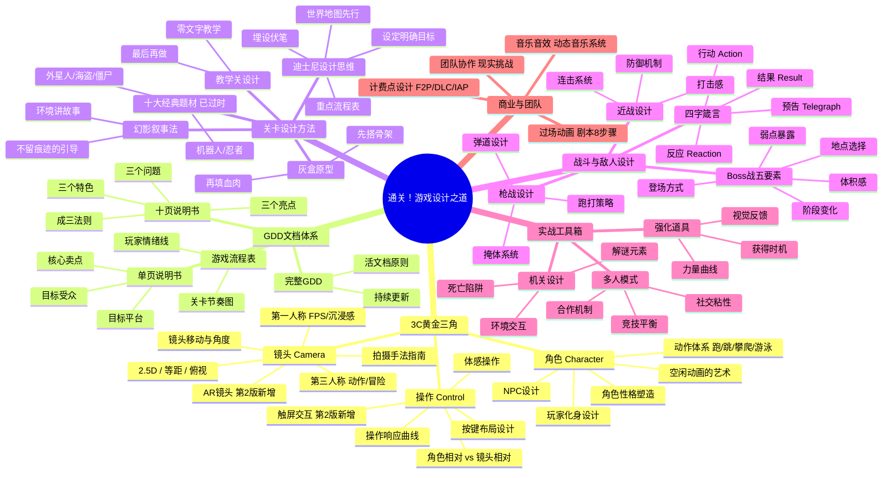
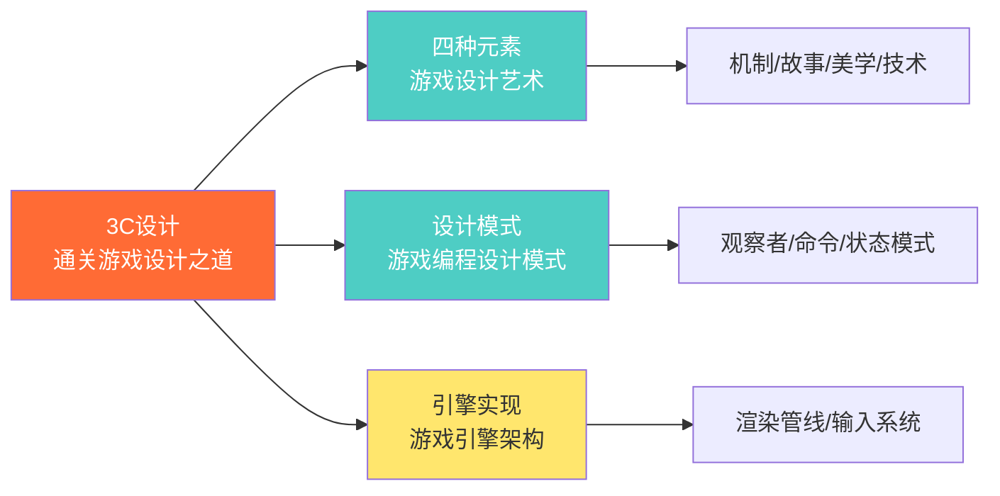

# 📚 《通关！游戏设计之道》读书笔记

## 📖 基础信息

- **英文原名**: Level Up! The Guide to Great Video Game Design（第2版）
- **作者**: Scott Rogers（斯科特·罗杰斯）
- **作者背景**: 迪士尼创意师、前 THQ 创意经理，参与制作《战神》《吃豆人世界》《魔界英雄记》系列、《描绘生命》系列、《暗黑血统》
- **出版社**: 人民邮电出版社（图灵教育）
- **出版年份**: 2017年（中文第2版）/ 2014年（英文第2版）/ 2010年（第1版）
- **页数**: 415页
- **开始阅读**: 2026-07-15
- **完成阅读**: -
- **阅读状态**: ☐ 正在阅读
- **个人评分**: ⭐⭐⭐⭐⭐
- **豆瓣评分**: 8.5
- **标签**: #游戏设计 #3C设计 #关卡设计 #实战手册 #GDD #ScottRogers

## 📖 内容概要

### 书籍简介

《通关！游戏设计之道》是一本以"游戏化"方式撰写的游戏设计实战手册。全书以**18个"关卡"**组织章节，每章末尾设有"攻略与秘籍"提炼要点，仿佛读者在通关一款游戏——而通关的奖励就是掌握游戏设计的核心技能。

Scott Rogers 以幽默直白、绝不装腔的语言风格著称。他在书中频繁插入100多张自己手绘的卡通插图，让这本设计书读起来像漫画一样轻松。但他的幽默之下是硬核的实战经验——作者参与过《战神》等多款 3A 大作，书中的每一条建议都来自血泪教训。第2版新增了手机游戏、触屏交互、计费点设计等与时俱进的章节。

### 核心主题

1. **3C设计体系** — Character（角色）/ Camera（镜头）/ Control（操作）构成了游戏设计的黄金三角
2. **分层文档方法论** — 单页说明书 → 十页说明书 → 游戏流程表 → 完整 GDD，逐层深入
3. **关卡设计从迪士尼学起** — 将主题公园设计思维迁移到游戏关卡设计中
4. **战斗四字箴言** — 预告→行动→反应→结果，新手上路的战斗设计框架
5. **"痛恨乐趣"** — Rogers 反传统地认为"有趣"是模糊无用的设计目标，设计应该追求更具体的情感
6. **"没人关心你那愚蠢的小世界"** — 设计师别太自恋，玩家只关心好不好玩

### 主要章节（18关 + 11个奖励关）

| 关卡 | 主题 | 核心内容 |
|------|------|----------|
| 第1关 | 欢迎，小白！ | 游戏史、分类、团队构成、平台特性 |
| 第2关 | 创意 | 灵感来源、头脑风暴、突破创作障碍 |
| 第3关 | 游戏故事 | 剧情三角论、角色创建、授权游戏剧本 |
| 第4关 | 文档 | GDD 体系：单页→十页→流程表→完整 GDD |
| 第5关 | 3C之角色 | 角色性格、动作体系、NPC 设计 |
| 第6关 | 3C之镜头 | 视角类型、镜头控制、拍摄手法 |
| 第7关 | 3C之操作 | 按键/触屏设计、角色/镜头相关操作 |
| 第8关 | HUD与图标 | 血槽、雷达、弹药、QTE等 |
| 第9关 | 关卡设计 | 十大题材、迪士尼方法、灰盒、教学关 |
| 第10关 | 战斗 | 四字箴言、近战/枪战、死亡机制 |
| 第11关 | 敌人设计 | 行为模式、Boss战五要素 |
| 第12关 | 机关与机制 | 陷阱、解谜、迷你游戏 |
| 第13关 | 强化道具 | 道具设计、奖励机制 |
| 第14关 | 多人游戏 | 竞技、合作、在线模式 |
| 第15关 | 计费点（第2版新增） | F2P、微交易、DLC |
| 第16关 | 音乐与音效 | 配乐节奏、音效反馈 |
| 第17关 | 过场动画 | 剧本8步骤、跳过还是必须看 |
| 第18关 | 最难的关底 | 现实挑战、团队协作、经验总结 |

**奖励关（附录）**：单页说明书模板、十页说明书模板、GDD模板、故事类型列表、场景列表、敌人/Boss设计模板、宣讲稿模板

---

## 🧠 知识架构



---

## ✍️ 分关笔记

### 第1关：欢迎，小白！

**核心观点**：Rogers 用极快的速度带读者过一遍游戏史（雅达利→任天堂→PlayStation→手游时代），重点是让读者了解**游戏行业是做什么的**以及**谁在制作游戏**。

**游戏开发团队角色**：
- 制作人（Producer）— 管进度、管钱
- 设计师（Designer）— 管"好不好玩"
- 美术师（Artist）— 管"好不好看"
- 程序员（Programmer）— 管"能不能跑"
- 测试员（QA）— 管"哪里会坏"
- 音效师（Audio）— 管"好不好听"

**Rogers 的第一条忠告**：游戏设计师不需要样样精通，但需要对每个领域都有**足够的了解**，才能有效沟通。如果你不知道程序怎么写、美术怎么画，你写的设计文档就是废纸。

> **攻略与秘籍**：了解你团队中每个人的工作，学会用他们的语言沟通。

### 第2关：创意

**核心观点**：本章最著名的观点是 **"我痛恨'乐趣'"**。Rogers 认为"好玩"这个词太模糊、太主观，作为设计目标毫无用处。你无法对程序员说"这个地方要更'好玩'一点"——程序员会问你"到底改什么参数"。

**替代方案**：用具体的、可量化的情感词汇替代"乐趣"——
- "我希望玩家在打败这个 Boss 后感到 **松了一口气然后又紧张起来**"
- "我希望玩家发现隐藏通道时感到 **'我真聪明'的窃喜**"
- "我希望玩家使用这个道具时感到 **浑身充满力量**"

**头脑风暴建议**：
- 把想法**写下来**——没写下来的创意等于不存在
- 保持**"创意笔记"**——随时记录，定期回顾
- 不要**自我审查**——先发散再收敛

> **攻略与秘籍**：忘掉"有趣"这个词。用具体的情感词汇描述你想创造的体验。

**🎯 借鉴点**：这条原则可以直接应用到我的 Godot 项目设计中。功能策划时不再写"让战斗更有趣"，而是写"让玩家在闪避成功后感受到0.2秒的无敌窗口带来的'死里逃生'快感"。这种精确的情感目标才能转化为精确的参数设计。

### 第3关：给游戏编个故事

**核心观点**：Rogers 提出 **"剧情三角论"（Triangle of Weirdness）**——任何好故事都由三个角构成：**角色、冲突、世界**。三个角中至少有一个必须是"怪异的"——也就是有独一无二的吸引力。

**给故事定名的技巧**：
- 名字应该好记、好拼、好搜索
- 名字应该暗示游戏类型或氛围
- 名字不要和已存在的游戏撞车

> **攻略与秘籍**：如果你的故事三角一点也不怪异，你的游戏就没有记忆点。

### 第4关：会做游戏，但会写文档吗

**核心观点**：这是全书最实用的章节之一。Rogers 提出**分层 GDD 体系**，每一层有明确的目标受众和用途：

```
单页说明书（给老板看）→ 十页说明书（给投资人看）→ 游戏流程表（给团队看）→ 完整GDD（给自己看）
```

**单页说明书要素**：
- 游戏名称
- 目标平台
- 目标受众年龄
- ESRB 评级预期
- 游戏摘要（用3句话以内说清楚）
- 独特卖点（与竞品的区别）
- 竞品游戏

**十页说明书**：
- 第一页：标题页
- 第二页：游戏总览
- 第三页：角色
- 第四页：游戏玩法
- 第五页：游戏世界
- 第六页：游戏体验
- 第七页：游戏机关
- 第八页：敌人
- 第九页：剧情过场
- 第十页：奖励内容

**"成三法则"**：每个设计概要必须包含——三个特色、三个问题、三个亮点。

> **攻略与秘籍**：最重要的文档不是 GDD，而是单页说明书。如果你不能在1页纸内说清楚你的游戏，说明你根本没想清楚。

**🎯 借鉴点**：这套文档体系可以直接照搬到个人游戏项目的启动阶段。我目前的 Godot 项目练习中最大的问题就是"边做边想"——没有先写单页说明书，导致功能堆积而无核心体验。后续所有个人项目启动前必须完成单页说明书。

### 第5-7关：3C黄金三角

**核心观点**：3C 是 Rogers 全书最核心的理论贡献——**这三点决定了玩家与游戏互动的全部体验**。

#### 第5关：角色（Character）

**角色设计关键问题**：
- 玩家想在游戏中成为谁？
- 角色的能力定义了游戏玩法——不是"这个角色能做什么动作"，而是"这些动作让玩家感受到什么"
- **"什么都不做的艺术"**：角色的空闲动画（Idle Animation）透露性格——马里奥空闲时会坐下休息，奎托斯空闲时会愤怒地握拳

#### 第6关：镜头（Camera）

**镜头类型速查表**：

| 镜头类型 | 适合的游戏 | 代表作品 |
|----------|-----------|----------|
| 第一人称 | 射击、沉浸探索 | 《使命召唤》《半条命》 |
| 第三人追尾 | 动作、冒险 | 《战神》《黑暗之魂》 |
| 固定视角 | 恐怖、解谜 | 早期《生化危机》 |
| 2.5D | 平台跳跃 | 《小小大星球》 |
| 等距/俯视 | 策略、RPG | 《暗黑破坏神》《哈迪斯》 |

**核心原则**：镜头不应该被玩家**注意到**。理想情况下，玩家完全忘记镜头的存在——一旦他们在思考"为什么镜头这样转"，体验就断了。

#### 第7关：操作（Control）

**操作设计的三大铁律**：
1. **响应必须即时**——按键到动作的延迟不超过 100ms
2. **操作必须是可预测的**——相同输入永远产生相同输出
3. **操作的难度永远在玩家的操作上，不在理解操作上**——如果一个操作需要看说明书才能理解，这个操作就失败了

**角色相对 vs 镜头相对的移动**：
- 角色相对（如初代生化危机）：按"上"=角色朝自己面向的方向前进——对新手极不友好
- 镜头相对（如大多数现代3D游戏）：按"上"=朝屏幕上方走——直觉但牺牲了某些操作的精确性

> **攻略与秘籍**：在完成整套 3C 之前，不要开始做关卡。3C 是你的地基，地基不稳，房子再漂亮也会塌。

### 第8关：符号语言——HUD与图标

**核心观点**：HUD 是游戏与玩家之间的"翻译层"。好的 HUD 让玩家**几乎感觉不到它的存在**，只在需要时出现。

**HUD 设计原则**：
- **信息优先级**：只显示玩家"现在"需要的信息
- **diegetic（世界内）vs non-diegetic（世界外）**：diegetic UI（如《死亡空间》的血条在角色盔甲上）比 HUD 更沉浸
- **图标比文字快**：大脑识别图标的速度是文字的 10 倍

> **攻略与秘籍**：设计 HUD 时，先问自己"这条信息真的需要一直显示吗？"如果答案是"不一定"，就默认隐藏它。

### 第9关：关卡设计——从迪士尼学到的

**核心观点**：本章是全书最长的一章，也是最精彩的一章。Rogers 将他在迪士尼工作的经验迁移到关卡设计：

**迪士尼关卡设计 5 步法**：
1. 画一张**世界地图**（宏观）
2. 在地图上**埋设伏笔**（让玩家看到但到不了的地方）
3. 设定**明确目标**（玩家始终知道自己在朝什么前进）
4. 制作**重点流程表**（每个区域的节奏：战斗→探索→休息）
5. 保持**变化与惊喜**（不要让玩家看穿公式）

**灰盒（Gray Box）原型法**：
- 先用最简单的几何体搭出关卡框架
- 只测试空间关系、移动节奏、战斗节奏
- 等"骨架"通过测试后，再请美术"填肉"

**教学关设计铁律**：**最后再设计教学关。** 只有当你完全确定了游戏的所有机制后，你才知道玩家最需要学什么。

**"幻影叙事法"**：用环境暗示而非文字告诉玩家发生了什么——墙上溅血的弹孔比一段文字描述"这里发生过枪战"更有力。

> **攻略与秘籍**：玩家不在乎你花了多少心思制作,他们只关心好不好玩。别把自己感动哭了。

### 第10关：战斗的要素

**核心观点**：Rogers 为战斗设计提出了 **"四字箴言"框架**，适用于从格斗到射击的所有战斗类型：

```
预告(Telegraph) → 行动(Action) → 反应(Reaction) → 结果(Result)
    ↑                                              |
    └──────────────────────────────────────────────┘
                    循环：下一轮攻击
```

**四字箴言拆解**：

| 阶段 | 含义 | 好设计 | 坏设计 |
|------|------|--------|--------|
| 预告 | 敌人在攻击前给出信号 | 0.3-0.5秒前摇，明显动画 | 无前摇，瞬间攻击 |
| 行动 | 攻击本身的执行 | 清晰的判定范围 | 判定范围与视觉不匹配 |
| 反应 | 玩家如何应对 | 闪避/格挡/反击都有反馈 | 只有挨打的份 |
| 结果 | 攻击后的结果 | 攻击后有明显硬直 | 攻击后立刻继续攻击 |

**死亡系统设计**：
- 死亡是教学——教会玩家下次怎样做才对
- 死亡后重试的间隔不能太长——每个 10 秒以上的死亡重试间隔都会流失 10% 的玩家
- 让死亡"有趣"——《黑暗之魂》的"You Died"是一个品牌，不是惩罚

> **攻略与秘籍**：如果你只记一个战斗设计原则，记这个——**攻击必须有前摇，前摇必须能被看见**。

**🎯 借鉴点**：四字箴言直接指导我的 Godot 项目战斗系统开发。在设计每个敌人的攻击时，必须满足：有可见前摇（预告）→ 攻击执行（行动）→ 给予玩家闪避/格挡窗口（反应）→ 攻击后硬直或位移（结果）。

### 第11关：所有人都想要你的小命

**核心观点**：敌人不是"血条+伤害值"，而是**有性格、有行为模式、有记忆点的角色**。

**敌人设计的层次**：
1. **小兵（Grunt）** — 让玩家练习基础操作，大量出现
2. **中 Boss（Mini Boss）** — 教玩家一种新机制，中等数量
3. **Boss** — 阶段性技能测验，唯一

**Boss 战五要素**：
1. **体积感**：Boss 必须看起来有威胁性，不管是巨大还是快速
2. **地点选择**：Boss 战的场地应该本身就是一个"角色"
3. **登场方式**：让 Boss 的出场像 WWE 摔跤手入场一样有仪式感
4. **阶段变化**：至少 2 个阶段，第二阶段翻转第一阶段的规则
5. **弱点暴露**：给玩家"发现弱点→攻击弱点"的满足感

> **攻略与秘籍**：设计 Boss 时，先设计它被击败的方式，再反推它的攻击模式。

### 第12-18关 & 奖励关（精要）

**第12关 — 机关与机制**：陷阱不是"惩罚"，是"刺激"。解谜的黄金比例是"让玩家觉得难到有成就感，但不会难到摔手柄"。

**第13关 — 强化道具**：道具的力量曲线应该是锯齿状上升——获得道具→变强→遇到新挑战→需要新道具→变强→...

**第14关 — 多人游戏**：多人模式不是"加更多玩家"，而是**从基础机制重新考虑**。一个好的多人游戏规则用一句话就能说清。

**第15关 — 计费点**（第2版新增）：F2P 的道德底线——"卖好看"可以，"卖数值"危险，"卖体验"最优雅。

**第16关 — 音乐音效**：音效设计是"隐形的 UI"——玩家在听到声音的一瞬间就已经得到了反馈，不需要任何视觉信息。

**第17关 — 过场动画**：最残酷的真相——**"没人会看你的过场动画"**。如果你的叙事依赖过场动画，你的叙事方式是错的。把故事融入 gameplay。

**第18关 — 最难的关底**：游戏的现实——延迟、砍功能、加班、和团队吵架、最终出货后一切都值了。

**奖励关**：11 个可直接使用的文档模板——单页说明书、十页说明书、GDD、敌人/Boss 设计模板、宣讲稿。这些模板的实用价值极高，无需二次加工即可使用。

---

## 💭 个人思考

### 关于"痛恨乐趣"的深度解读

Rogers 说"I hate fun"时不是在玩文字游戏，而是在指出游戏设计中最普遍的错误：**用抽象标签替代具体分析**。

这让我联想到《重构》中 Martin Fowler 的"代码坏味道"——"坏味道"也不是精确规则，而是一个信号："这里有值得检查的东西"。"有趣"不行，"太绕了"也不行。两者都重复了同一个模式：**好的诊断语言应该是具体的，而非抽象的。**

**类比软件开发**：
- 产品经理说"让这个功能更好用" = 无用
- 产品经理说"用户从点按钮到看到结果不能超过 200ms" = 可用

游戏设计同理：
- 设计师说"让这个战斗更有趣" = 无用
- 设计师说"让玩家在准确格挡时感受到 6 帧的冻结帧 + 震屏 + 特殊音效" = 可用

### 关于 3C 框架的普适性

3C（角色/镜头/操作）不仅适用于游戏，也适用于任何交互产品：

| 游戏 | Web应用 | 对应关系 |
|------|---------|----------|
| 角色 | 用户身份/头像/个性化 | "我是谁" |
| 镜头 | 页面布局/信息架构 | "我看到什么" |
| 操作 | 交互方式/手势/快捷键 | "我怎么操作" |

一个 Web 应用如果用户的身份感模糊（没有角色）、信息架构混乱（镜头不稳）、操作反直觉（控制失当），用户体验一定糟糕——完全对应 Rogers 的 3C 框架。

### 关于"最后才做教学关"的反直觉智慧

这条建议的反直觉之处在于：在不知道玩家需要学什么之前，你怎么设计教学？常规做法是先设计教学再设计关卡，但 Rogers 的观点是——**只有关卡完成后，你才知道玩家卡在哪里、什么机制最让人困惑，这时你才能做出有针对性而非说教式的教学**。

这让我联想到《游戏编程设计模式》中"观察者模式"的一个应用场景——在游戏中埋入数据追踪点，上线后通过玩家死亡热力图确定真正的痛点，然后针对性地调整教学。先看数据，再做教学。

---

## 🎯 实践应用

### 行动计划 1：为 Godot 项目写单页说明书

**具体步骤**：
1. 用 Rogers 的单页说明书模板完整撰写
2. 核心要求：3 句话以内说清游戏、列出 3 个竞品、3 个独特卖点
3. 贴在显示器旁边，每个新功能开发前对照检查是否偏离核心

**预期效果**：避免功能蔓延，确保所有开发决策服务于核心体验

### 行动计划 2：用四字箴言改造战斗系统

**具体步骤**：
1. 逐个检查所有敌人的攻击动画，确保每个攻击有可见前摇
2. 为每个攻击设置标准参数：前摇帧数、判定帧数、后摇帧数
3. 测试确保所有操作响应 ≤ 100ms

**预期效果**：战斗手感从不公平的"被秒杀"变为公平的"技不如人"

### 行动计划 3：用灰盒法做关卡原型

**具体步骤**：
1. 在 Godot 中用 Box/Cylinder 搭建关卡白模
2. 只测试移动节奏、空间尺度、战斗间距
3. 通过测试后再交由美术细化

**预期效果**：避免美术资源浪费在需要推翻的关卡设计上

---

## 🔗 相关扩展

### 相关书籍推荐

1. **《游戏设计艺术》**（Jesse Schell）— Rogers 的"实战手册" + Schell 的"哲学沉思" = 游戏设计的完整视角
2. **《体验引擎》**（Tynan Sylvester）— 深入 Rogers 没展开的系统设计层面
3. **《游戏设计梦工厂》**（Tracy Fullerton）— USC教材，含大量练习，补足本书"动手不足"的短板
4. **《游戏感》**（Steve Swink）— 3C 中"Control"部分的深度展开
5. **《游戏编程设计模式》**（Robert Nystrom）— 本书讨论的机制如何用代码实现

### 延伸阅读

- Scott Rogers 的 GDC 演讲："Everything I Learned About Level Design, I Learned from Disneyland"
- 图灵社区本书读书笔记系列
- 迪士尼"Imagineering"主题公园设计纪录片

---

## 💭 深度衍生思考

### 🎯 核心观点延伸

**延伸1：3C框架的"第四C"——Context（场景）**

Rogers 讨论 3C 时只覆盖了游戏内部元素，但缺少了 Schell 强调的"场景"维度。我提出**第四C：Context（场景）**：

- 玩家在什么环境下玩？（客厅沙发 vs 地铁通勤 vs 电竞椅）
- 玩家的心态是什么？（放松 vs 竞争 vs 消磨时间）
- 玩家的设备是什么？（手机 vs 主机 vs PC vs VR）

这四个维度共同决定了体验，而且 Context 往往决定了 3C 的设计方向——手机游戏的镜头和控制设计与主机游戏完全不同。Rogers 在第2版中加入了触屏操作的讨论，暗示了他自己也意识到了这个缺失。

**延伸2：GDD的衰落与替代方案**

Rogers 花了大量篇幅讨论 GDD（游戏设计文档），但近年行业趋势是 **"GDD 已死"**——取而代之的是 Wiki 式活文档、Markdown + Git 版本管理、Figma 交互原型、游戏内注释系统。Rogers 的框架仍有价值（单页说明书的思路永远不会过时），但具体形式需要更新。

### 🔍 多角度分析

**与《游戏设计艺术》对比**：

| 维度 | 《通关！游戏设计之道》 | 《游戏设计艺术》 |
|------|----------------------|-----------------|
| 风格 | 实战手册 + 漫画 + 段子 | 哲学思辨 + 透镜卡片 |
| 受众 | 想做游戏的人 | 想理解游戏的人 |
| 可操作性 | 极高（模板可直接用） | 中等（需要自己转化） |
| 深度 | 中等 | 深 |
| 覆盖广度 | 3A 动作游戏为主 | 所有游戏类型 |

两本书的关系不是"选一本"，而是"先读 Rogers 入门建立直觉，再读 Schell 深化建立框架"。

---

## 🔗 知识关联网络

### 与已读书籍的关联

| 已读书籍 | 关联点 | 强度 |
|----------|--------|------|
| 《游戏设计艺术》 | 3C vs 四种元素——两个框架互补，一个关注交互界面，一个关注体验构成 | ⭐⭐⭐⭐⭐ |
| 《游戏编程设计模式》 | 四字箴言中的"预告"对应观察者模式事件广播，"行动"对应命令模式 | ⭐⭐⭐⭐ |
| 《游戏引擎架构》 | 镜头系统涉及渲染管线、剔除算法等引擎级实现 | ⭐⭐⭐ |
| 《Godot引擎游戏开发》 | 3C 在 Godot 中的实现：Camera2D/Camera3D、InputMap、CharacterBody | ⭐⭐⭐⭐ |

### 概念映射



---

## 📊 学习总结

### 最大的收获

游戏设计不是玄学，是可以流程化、模板化、逐项检查的工程。Rogers 最大的贡献是把"怎么做游戏"从大师的经验变成小白的checklist。

### 改变的观念

1. **"'有趣'就够了" → "'有趣'是最无用的设计目标"**
2. **"先做教学关" → "最后再做教学关，因为只有那时你才知道玩家需要学什么"**
3. **"GDD 越详细越好" → "单页说明书 > 完整 GDD，前者迫使你思考核心"**
4. **"过场动画很重要" → "没人看你的过场动画，故事应该发生在 gameplay 中"**

### 未来行动

1. 所有个人项目启动前完成单页说明书和十页说明书
2. 用灰盒法替代"美术先做→关卡后配"的工作流程
3. 战斗设计强制使用四字箴言检查清单
4. 把 3C 作为游戏分析笔记的标准维度之一

---

**笔记创建时间**: 2026-07-15
**最后更新**: 2026-07-15
**笔记版本**: v1.0

**Sources**: [百度百科 - 通关！游戏设计之道](https://baike.baidu.com/item/通关！游戏设计之道/49935278) · [微信读书](https://weread.qq.com/web/reader/14a32f50811e1a928g018b37) · [Google Books - Level Up!](https://books.google.com/books?id=8w_ETFmHrewC)
