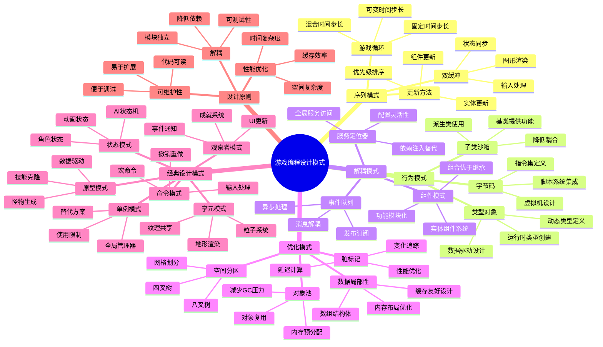
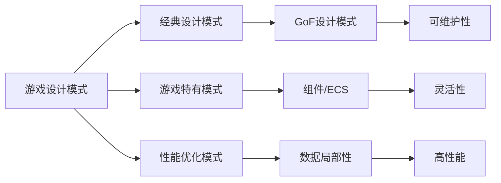

# 📚 游戏编程设计模式

> ⚠️ **诚实标注**：本笔记为预读阶段的框架整理（基于书评、目录和第二手资料生成），**不是真实阅读后的感悟**。阅读状态：准备开始。
>
> 笔记中的详细章节内容来自资料整理和公开书评，非亲身阅读体验。阅读完成后将用真实感悟覆盖，特别是"这本书对 Godot 实际项目的具体影响"。

## 📖 基本信息

- **书名**: 游戏编程设计模式 (Game Programming Patterns)
- **作者**: Robert Nystrom
- **出版社**: Genever Benning
- **出版年份**: 2014
- **中译本**: 人民邮电出版社
- **译者**: 贾洪伟
- **创建时间**: 2026-05-13
- **难度等级**: 中级
- **阅读状态**: 📖 准备开始
- **个人评分**: ⭐⭐⭐⭐⭐
- **在线版本**: https://gameprogrammingpatterns.com/

## 📝 内容概要

### 书籍简介
《游戏编程设计模式》是一本专注于游戏开发中设计模式应用的经典著作。作者Robert Nystrom结合多年游戏开发经验，深入浅出地讲解了如何将经典设计模式应用于游戏开发场景，以及游戏开发特有的模式。本书不同于传统的GoF设计模式书籍，而是从游戏开发的实际需求出发，通过大量代码示例和实战案例，展示了设计模式在游戏循环、组件系统、状态管理等方面的应用。

### 核心主题
1. **架构模式** - 游戏循环、双缓冲、游戏循环与更新方法
2. **设计模式** - 命令模式、享元模式、观察者模式、原型模式、单例模式、状态模式
3. **序列模式** - 双缓冲、游戏循环、更新方法
4. **行为模式** - 字节码、子类沙箱、类型对象
5. **解耦模式** - 组件模式、事件队列、服务定位器
6. **优化模式** - 数据局部性、脏标记、对象池、空间分区

### 主要章节
- **第1章**: 架构、性能和游戏
- **第2章**: 命令模式 (Command Pattern)
- **第3章**: 享元模式 (Flyweight Pattern)
- **第4章**: 观察者模式 (Observer Pattern)
- **第5章**: 原型模式 (Prototype Pattern)
- **第6章**: 单例模式 (Singleton Pattern)
- **第7章**: 状态模式 (State Pattern)
- **第8章**: 双缓冲 (Double Buffer)
- **第9章**: 游戏循环 (Game Loop)
- **第10章**: 更新方法 (Update Method)
- **第11章**: 字节码 (Bytecode)
- **第12章**: 子类沙箱 (Subclass Sandbox)
- **第13章**: 类型对象 (Type Object)
- **第14章**: 组件模式 (Component)
- **第15章**: 事件队列 (Event Queue)
- **第16章**: 服务定位器 (Service Locator)
- **第17章**: 数据局部性 (Data Locality)
- **第18章**: 脏标记 (Dirty Flag)
- **第19章**: 对象池 (Object Pool)
- **第20章**: 空间分区 (Spatial Partition)

## 🧠 知识架构



## ✍️ 读书笔记

### 第1章: 架构、性能和游戏

**重点摘录:**
> 软件架构的目标是减少开发成本，提高代码的可维护性。好的架构让你更容易做出改变，而不需要在整个代码库中进行大规模的修改。

**核心概念:**

#### 解耦的价值
- **解耦**: 让代码的各个部分尽可能独立
- **好处**: 修改一处代码时，不需要改动其他地方
- **代价**: 需要更多的抽象和间接层

#### 性能与架构的平衡
> 游戏开发是一个性能敏感的领域。我们需要在代码架构的优雅性和运行效率之间找到平衡。

```javascript
// ❌ 过度解耦 - 性能损失
class Entity {
  constructor() {
    this.components = new Map();
  }

  update() {
    // 需要遍历查找组件
    for (const component of this.components.values()) {
      component.update();
    }
  }
}

// ✅ 合理的解耦 - 平衡性能
class Entity {
  constructor() {
    this.position = new PositionComponent();
    this.physics = new PhysicsComponent();
    this.render = new RenderComponent();
  }

  update() {
    // 直接访问，缓存友好
    this.physics.update(this.position);
    this.render.update(this.position);
  }
}
```

**个人思考:**
游戏开发中的架构设计需要在抽象和性能之间找到平衡点。过度抽象会导致性能下降，而过度优化又会损害代码的可维护性。好的架构师需要理解游戏的具体需求，做出恰当的权衡。

### 第2章: 命令模式 (Command Pattern)

**重点摘录:**
> 命令模式将一个请求封装为一个对象，从而让你可以用不同的请求对客户进行参数化，对请求排队或记录请求日志，以及支持可撤销的操作。

#### 基础实现

```javascript
// 命令接口
class Command {
  execute() {
    throw new Error('Must implement execute()');
  }
}

// 移动命令
class MoveCommand extends Command {
  constructor(unit, x, y) {
    super();
    this.unit = unit;
    this.x = x;
    this.y = y;
    this.previousX = 0;
    this.previousY = 0;
  }

  execute() {
    this.previousX = this.unit.x;
    this.previousY = this.unit.y;
    this.unit.moveTo(this.x, this.y);
  }

  undo() {
    this.unit.moveTo(this.previousX, this.previousY);
  }
}

// 输入处理器
class InputHandler {
  constructor() {
    this.buttonX = null;
    this.buttonY = null;
    this.buttonA = null;
    this.buttonB = null;
  }

  handleInput() {
    if (isPressed(BUTTON_X)) return this.buttonX;
    if (isPressed(BUTTON_Y)) return this.buttonY;
    if (isPressed(BUTTON_A)) return this.buttonA;
    if (isPressed(BUTTON_B)) return this.buttonB;
    return null;
  }
}

// 使用示例
const handler = new InputHandler();
handler.buttonX = new MoveCommand(player, 1, 0);

const command = handler.handleInput();
if (command) {
  command.execute();
}
```

#### 撤销与重做系统

```javascript
// 支持撤销的命令系统
class UndoableCommand extends Command {
  constructor(actor) {
    super();
    this.actor = actor;
    this.previousState = null;
  }

  execute() {
    this.previousState = this.actor.getState();
    this.doExecute();
  }

  undo() {
    this.actor.restoreState(this.previousState);
  }

  doExecute() {
    throw new Error('Must implement doExecute()');
  }
}

// 命令历史管理器
class CommandHistory {
  constructor(maxSize = 100) {
    this.history = [];
    this.maxSize = maxSize;
    this.currentIndex = -1;
  }

  execute(command) {
    // 清除当前位置之后的所有命令
    this.history = this.history.slice(0, this.currentIndex + 1);

    // 执行新命令
    command.execute();

    // 添加到历史
    this.history.push(command);
    if (this.history.length > this.maxSize) {
      this.history.shift();
    } else {
      this.currentIndex++;
    }
  }

  undo() {
    if (this.currentIndex >= 0) {
      this.history[this.currentIndex].undo();
      this.currentIndex--;
    }
  }

  redo() {
    if (this.currentIndex < this.history.length - 1) {
      this.currentIndex++;
      this.history[this.currentIndex].execute();
    }
  }
}
```

#### 配置输入键位

```javascript
// 可配置的输入系统
class ConfigurableInputHandler {
  constructor() {
    this.keyBindings = new Map();
  }

  bindKey(keyCode, command) {
    this.keyBindings.set(keyCode, command);
  }

  handleInput() {
    const commands = [];
    for (const [keyCode, command] of this.keyBindings) {
      if (isPressed(keyCode)) {
        commands.push(command.clone());
      }
    }
    return commands;
  }
}

// 使用示例
const input = new ConfigurableInputHandler();
input.bindKey(KEY_W, new MoveCommand(player, 0, 1));
input.bindKey(KEY_S, new MoveCommand(player, 0, -1));
input.bindKey(KEY_A, new MoveCommand(player, -1, 0));
input.bindKey(KEY_D, new MoveCommand(player, 1, 0));
```

**应用场景:**
- 输入处理系统
- 撤销/重做功能
- 回放系统
- 技能系统
- 宏命令录制

### 第3章: 享元模式 (Flyweight Pattern)

**重点摘录:**
> 享元模式通过共享来有效地支持大量细粒度的对象。它将对象的固有状态(intrinsic state)和外在状态(extrinsic state)分离，固有状态可以共享，外在状态由客户端维护。

#### 共享数据与实例数据

```javascript
// 地形类型 - 共享数据
class Terrain {
  constructor(movementCost, isWater, texture) {
    this.movementCost = movementCost;
    this.isWater = isWater;
    this.texture = texture;
  }
}

// 世界地图 - 使用享元
class World {
  constructor(width, height) {
    this.width = width;
    this.height = height;
    // 共享的地形实例
    this.grassTerrain = new Terrain(1, false, 'grass.png');
    this.waterTerrain = new Terrain(3, true, 'water.png');
    this.mountainTerrain = new Terrain(5, false, 'mountain.png');

    // 地图只存储引用
    this.tiles = new Array(width * height);
  }

  generate() {
    for (let y = 0; y < this.height; y++) {
      for (let x = 0; x < this.width; x++) {
        if (Math.random() < 0.3) {
          this.tiles[y * this.width + x] = this.waterTerrain;
        } else {
          this.tiles[y * this.width + x] = this.grassTerrain;
        }
      }
    }
  }

  getTile(x, y) {
    return this.tiles[y * this.width + x];
  }
}

// 内存节省示例
// 不使用享元: 1000x1000 地图 = 1,000,000 个 Terrain 对象
// 使用享元: 只有 3 个 Terrain 对象 + 1,000,000 个引用
```

#### 粒子系统应用

```javascript
// 粒子类型 - 共享属性
class ParticleType {
  constructor(color, sprite, lifespan, blendMode) {
    this.color = color;
    this.sprite = sprite;
    this.lifespan = lifespan;
    this.blendMode = blendMode;
  }
}

// 单个粒子 - 实例属性
class Particle {
  constructor(type, x, y, velocityX, velocityY) {
    this.type = type;  // 引用共享类型
    this.x = x;
    this.y = y;
    this.velocityX = velocityX;
    this.velocityY = velocityY;
    this.age = 0;
  }

  update(dt) {
    this.x += this.velocityX * dt;
    this.y += this.velocityY * dt;
    this.age += dt;
  }

  isAlive() {
    return this.age < this.type.lifespan;
  }

  render(renderer) {
    renderer.drawSprite(
      this.type.sprite,
      this.x, this.y,
      this.type.color,
      this.type.blendMode
    );
  }
}

// 粒子系统
class ParticleSystem {
  constructor() {
    this.particles = [];
    this.types = new Map();

    // 预定义粒子类型
    this.types.set('fire', new ParticleType('red', 'fire.png', 2.0, 'additive'));
    this.types.set('smoke', new ParticleType('gray', 'smoke.png', 5.0, 'alpha'));
    this.types.set('sparkle', new ParticleType('yellow', 'sparkle.png', 0.5, 'additive'));
  }

  emit(typeName, x, y, count) {
    const type = this.types.get(typeName);
    for (let i = 0; i < count; i++) {
      const angle = Math.random() * Math.PI * 2;
      const speed = 50 + Math.random() * 100;
      this.particles.push(new Particle(
        type,
        x, y,
        Math.cos(angle) * speed,
        Math.sin(angle) * speed
      ));
    }
  }

  update(dt) {
    this.particles = this.particles.filter(p => {
      p.update(dt);
      return p.isAlive();
    });
  }
}
```

**应用场景:**
- 地形系统
- 粒子效果
- UI元素共享
- 音效资源
- 动画帧数据

### 第4章: 观察者模式 (Observer Pattern)

**重点摘录:**
> 观察者模式定义了对象间的一对多依赖关系，当一个对象的状态发生改变时，所有依赖它的对象都会收到通知并自动更新。

#### 成就系统实现

```javascript
// 观察者接口
class Observer {
  onNotify(subject, event) {
    throw new Error('Must implement onNotify()');
  }
}

// 主题接口
class Subject {
  constructor() {
    this.observers = [];
  }

  addObserver(observer) {
    this.observers.push(observer);
  }

  removeObserver(observer) {
    const index = this.observers.indexOf(observer);
    if (index !== -1) {
      this.observers.splice(index, 1);
    }
  }

  notify(subject, event) {
    for (const observer of this.observers) {
      observer.onNotify(subject, event);
    }
  }
}

// 成就观察者
class AchievementObserver extends Observer {
  constructor() {
    super();
    this.heroesKilled = 0;
    this.fallenOffBridges = 0;
  }

  onNotify(subject, event) {
    switch (event.type) {
      case 'ENEMY_KILLED':
        if (event.enemy.type === 'hero') {
          this.heroesKilled++;
          if (this.heroesKilled >= 100) {
            this.unlock('Master of Arms');
          }
        }
        break;

      case 'FELL_OFF_BRIDGE':
        this.fallenOffBridges++;
        if (this.fallenOffBridges >= 10) {
          this.unlock('Bridge Jumper');
        }
        break;
    }
  }

  unlock(achievement) {
    console.log(`Achievement Unlocked: ${achievement}`);
  }
}

// 物理系统作为主题
class Physics extends Subject {
  updateEntity(entity) {
    const isOnBridge = this.checkBridge(entity);
    const isFalling = this.checkFalling(entity);

    if (isOnBridge && isFalling) {
      this.notify(entity, { type: 'FELL_OFF_BRIDGE' });
    }
  }
}
```

#### 解耦的观察者系统

```javascript
// 事件系统
class EventSystem {
  constructor() {
    this.listeners = new Map();
  }

  on(eventType, callback, context = null) {
    if (!this.listeners.has(eventType)) {
      this.listeners.set(eventType, []);
    }
    this.listeners.get(eventType).push({ callback, context });
  }

  off(eventType, callback) {
    const listeners = this.listeners.get(eventType);
    if (listeners) {
      const index = listeners.findIndex(l => l.callback === callback);
      if (index !== -1) {
        listeners.splice(index, 1);
      }
    }
  }

  emit(eventType, data) {
    const listeners = this.listeners.get(eventType);
    if (listeners) {
      for (const listener of listeners) {
        listener.callback.call(listener.context, data);
      }
    }
  }

  clear() {
    this.listeners.clear();
  }
}

// 全局事件系统
const Events = new EventSystem();

// 使用示例
class Player {
  constructor(name) {
    this.name = name;
    this.health = 100;
  }

  takeDamage(amount) {
    this.health -= amount;
    Events.emit('PLAYER_DAMAGED', {
      player: this,
      amount: amount,
      health: this.health
    });

    if (this.health <= 0) {
      Events.emit('PLAYER_DIED', { player: this });
    }
  }
}

// UI监听玩家受伤事件
Events.on('PLAYER_DAMAGED', (data) => {
  console.log(`${data.player.name} took ${data.amount} damage. Health: ${data.health}`);
});

// 成就系统监听玩家死亡事件
Events.on('PLAYER_DIED', (data) => {
  console.log(`Game Over for ${data.player.name}`);
});
```

**应用场景:**
- 成就系统
- UI更新
- 音效触发
- 统计追踪
- 任务系统

### 第5章: 原型模式 (Prototype Pattern)

**重点摘录:**
> 原型模式通过复制现有对象来创建新对象，而不是通过实例化类。这在需要创建大量相似对象的场景中特别有用。

#### 怪物生成系统

```javascript
// 基础怪物类
class Monster {
  constructor(name, health, damage, speed) {
    this.name = name;
    this.health = health;
    this.damage = damage;
    this.speed = speed;
    this.x = 0;
    this.y = 0;
  }

  clone() {
    return new Monster(this.name, this.health, this.damage, this.speed);
  }

  spawn(x, y) {
    const instance = this.clone();
    instance.x = x;
    instance.y = y;
    return instance;
  }
}

// 怪物生成器
class Spawner {
  constructor(prototype) {
    this.prototype = prototype;
  }

  spawnMonster(x, y) {
    return this.prototype.spawn(x, y);
  }
}

// 使用原型创建怪物
const goblinPrototype = new Monster('Goblin', 50, 10, 3.0);
const orcPrototype = new Monster('Orc', 100, 25, 2.0);
const dragonPrototype = new Monster('Dragon', 500, 100, 5.0);

const goblinSpawner = new Spawner(goblinPrototype);
const orcSpawner = new Spawner(orcPrototype);

// 生成怪物
const goblin1 = goblinSpawner.spawnMonster(100, 200);
const goblin2 = goblinSpawner.spawnMonster(150, 200);
```

#### 数据驱动的原型系统

```javascript
// JSON数据定义怪物
const monsterData = {
  goblin: {
    name: 'Goblin',
    health: 50,
    damage: 10,
    speed: 3.0,
    abilities: ['stab', 'dodge']
  },
  orc: {
    name: 'Orc',
    health: 100,
    damage: 25,
    speed: 2.0,
    abilities: ['bash', 'charge']
  },
  dragon: {
    name: 'Dragon',
    health: 500,
    damage: 100,
    speed: 5.0,
    abilities: ['fireBreath', 'tailSwipe', 'fly']
  }
};

// 怪物工厂
class MonsterFactory {
  constructor() {
    this.prototypes = new Map();
  }

  loadPrototypes(data) {
    for (const [key, config] of Object.entries(data)) {
      this.prototypes.set(key, this.createPrototype(config));
    }
  }

  createPrototype(config) {
    return {
      config: config,
      clone() {
        return JSON.parse(JSON.stringify(this.config));
      }
    };
  }

  createMonster(type, x, y) {
    const prototype = this.prototypes.get(type);
    if (!prototype) {
      throw new Error(`Unknown monster type: ${type}`);
    }

    const data = prototype.clone();
    data.x = x;
    data.y = y;
    return data;
  }
}

// 使用
const factory = new MonsterFactory();
factory.loadPrototypes(monsterData);

const dragon = factory.createMonster('dragon', 500, 300);
```

**应用场景:**
- 怪物/NPC生成
- 子弹/技能生成
- 粒子效果复制
- 数据驱动设计
- 编辑器工具

### 第6章: 单例模式 (Singleton Pattern)

**重点摘录:**
> 单例模式确保一个类只有一个实例，并提供一个全局访问点。但在游戏开发中，单例往往被滥用，导致代码耦合度增加。

#### 单例的问题

```javascript
// ❌ 传统的单例实现
class FileSystem {
  static instance = null;

  constructor() {
    if (FileSystem.instance) {
      return FileSystem.instance;
    }
    FileSystem.instance = this;
  }

  static getInstance() {
    if (!FileSystem.instance) {
      FileSystem.instance = new FileSystem();
    }
    return FileSystem.instance;
  }
}

// 问题: 全局状态难以测试
class Game {
  save() {
    const fs = FileSystem.getInstance();
    fs.write('save.dat', this.serialize());
  }
}

// 测试困难: 无法mock FileSystem
```

#### 更好的替代方案

```javascript
// ✅ 使用依赖注入
class Game {
  constructor(fileSystem) {
    this.fileSystem = fileSystem;
  }

  save() {
    this.fileSystem.write('save.dat', this.serialize());
  }
}

// 可以轻松替换实现
const game = new Game(new MockFileSystem());

// ✅ 服务定位器模式
class ServiceLocator {
  static services = new Map();

  static provide(name, service) {
    ServiceLocator.services.set(name, service);
  }

  static get(name) {
    return ServiceLocator.services.get(name);
  }
}

// 配置服务
ServiceLocator.provide('fileSystem', new FileSystem());
ServiceLocator.provide('audio', new AudioSystem());

// 使用服务
class Player {
  save() {
    const fs = ServiceLocator.get('fileSystem');
    fs.write('player.dat', this.serialize());
  }
}
```

**单例的合理使用:**
- 文件系统
- 日志系统
- 音频引擎
- 输入管理器

**更好的替代:**
- 依赖注入
- 服务定位器
- 全局变量(有节制地使用)

### 第7章: 状态模式 (State Pattern)

**重点摘录:**
> 状态模式允许对象在其内部状态改变时改变其行为。对象看起来好像修改了它的类。

#### 角色状态机

```javascript
// 状态接口
class State {
  enter(entity) {}
  execute(entity, dt) {}
  exit(entity) {}
  handleInput(entity, input) {
    return null;
  }
}

// 站立状态
class StandingState extends State {
  enter(entity) {
    entity.setAnimation('idle');
  }

  handleInput(entity, input) {
    if (input.jump) {
      return new JumpingState();
    }
    if (input.duck) {
      return new DuckingState();
    }
    return null;
  }
}

// 跳跃状态
class JumpingState extends State {
  enter(entity) {
    entity.setAnimation('jump');
    entity.velocityY = 10;
  }

  execute(entity, dt) {
    entity.velocityY -= GRAVITY * dt;
    entity.y += entity.velocityY * dt;

    if (entity.y <= 0) {
      entity.y = 0;
      return new StandingState();
    }
    return null;
  }

  handleInput(entity, input) {
    if (input.dive) {
      return new DivingState();
    }
    return null;
  }
}

// 蹲下状态
class DuckingState extends State {
  enter(entity) {
    entity.setAnimation('duck');
  }

  handleInput(entity, input) {
    if (!input.duck) {
      return new StandingState();
    }
    return null;
  }
}

// 角色类
class Hero {
  constructor() {
    this.state = new StandingState();
    this.x = 0;
    this.y = 0;
    this.velocityY = 0;
  }

  setState(newState) {
    if (this.state) {
      this.state.exit(this);
    }
    this.state = newState;
    this.state.enter(this);
  }

  handleInput(input) {
    const newState = this.state.handleInput(this, input);
    if (newState) {
      this.setState(newState);
    }
  }

  update(dt) {
    const newState = this.state.execute(this, dt);
    if (newState) {
      this.setState(newState);
    }
  }
}
```

#### 并发状态机

```javascript
// 武器状态机
class WeaponState extends State {
  // 独立的状态: 持枪、开火、换弹等
}

// 角色类同时管理两个状态机
class Soldier {
  constructor() {
    this.movementState = new StandingState();
    this.weaponState = new HoldingWeaponState();
  }

  handleInput(input) {
    // 移动和武器状态独立处理
    this.movementState.handleInput(this, input);
    this.weaponState.handleInput(this, input);
  }

  update(dt) {
    this.movementState.execute(this, dt);
    this.weaponState.execute(this, dt);
  }
}
```

#### 分层状态机

```javascript
// 基础状态
class OnGroundState extends State {
  handleInput(entity, input) {
    if (input.jump) {
      return new JumpingState();
    }
    return null;
  }
}

// 继承自基础状态
class RunningState extends OnGroundState {
  handleInput(entity, input) {
    // 先尝试基类处理
    const state = super.handleInput(entity, input);
    if (state) return state;

    // 子类特殊处理
    if (!input.run) {
      return new StandingState();
    }
    return null;
  }
}
```

**应用场景:**
- 角色行为状态
- AI状态机
- 动画状态
- 菜单状态
- 游戏状态

### 第8章: 双缓冲 (Double Buffer)

**重点摘录:**
> 双缓冲使用两个缓冲区来实现平滑的状态转换。当一个缓冲区被读取时，另一个缓冲区被写入，然后交换两个缓冲区。

#### 图形渲染双缓冲

```javascript
class FrameBuffer {
  constructor(width, height) {
    this.width = width;
    this.height = height;
    this.current = new Uint8ClampedArray(width * height * 4);
    this.next = new Uint8ClampedArray(width * height * 4);
  }

  draw(x, y, color) {
    const index = (y * this.width + x) * 4;
    this.next[index] = color.r;
    this.next[index + 1] = color.g;
    this.next[index + 2] = color.b;
    this.next[index + 3] = color.a;
  }

  swap() {
    [this.current, this.next] = [this.next, this.current];
    this.next.fill(0); // 清空下一个缓冲区
  }

  getPixels() {
    return this.current;
  }
}
```

#### 物理模拟双缓冲

```javascript
class PhysicsBuffer {
  constructor() {
    this.current = new Map();
    this.next = new Map();
  }

  setPosition(entityId, x, y) {
    this.next.set(entityId, { x, y });
  }

  getPosition(entityId) {
    return this.current.get(entityId);
  }

  swap() {
    [this.current, this.next] = [this.next, this.current];
    this.next.clear();
  }
}

// 使用示例
class PhysicsSystem {
  constructor() {
    this.buffer = new PhysicsBuffer();
  }

  update(entities) {
    // 计算新位置写入next缓冲区
    for (const entity of entities) {
      const currentPos = this.buffer.getPosition(entity.id);
      const newPos = this.calculatePosition(entity, currentPos);
      this.buffer.setPosition(entity.id, newPos.x, newPos.y);
    }

    // 交换缓冲区
    this.buffer.swap();
  }
}
```

**应用场景:**
- 图形渲染
- 物理模拟
- 输入处理
- 网络状态同步

### 第9章: 游戏循环 (Game Loop)

**重点摘录:**
> 游戏循环是游戏的心脏，它不断地循环执行，驱动整个游戏的运转。一个好的游戏循环能够处理帧率变化，确保游戏逻辑的一致性。

#### 固定时间步长

```javascript
class Game {
  constructor() {
    this.isRunning = false;
    this.previousTime = 0;
    this.lag = 0;
    this.MS_PER_UPDATE = 16.67; // 60 FPS
  }

  run() {
    this.isRunning = true;
    this.previousTime = performance.now();
    this.lag = 0;

    while (this.isRunning) {
      const currentTime = performance.now();
      const elapsed = currentTime - this.previousTime;
      this.previousTime = currentTime;
      this.lag += elapsed;

      this.processInput();

      // 固定时间步长更新
      while (this.lag >= this.MS_PER_UPDATE) {
        this.update(this.MS_PER_UPDATE / 1000);
        this.lag -= this.MS_PER_UPDATE;
      }

      // 渲染，可以插值
      this.render(this.lag / this.MS_PER_UPDATE);
    }
  }

  update(dt) {
    // 游戏逻辑更新
    for (const entity of this.entities) {
      entity.update(dt);
    }
  }

  render(alpha) {
    // 渲染时可以插值
    for (const entity of this.entities) {
      const renderX = entity.x + entity.velocityX * alpha;
      const renderY = entity.y + entity.velocityY * alpha;
      this.drawEntity(entity, renderX, renderY);
    }
  }
}
```

#### 可变时间步长

```javascript
class VariableGameLoop {
  constructor() {
    this.isRunning = false;
    this.previousTime = 0;
  }

  run() {
    this.isRunning = true;
    this.previousTime = performance.now();

    const loop = (currentTime) => {
      if (!this.isRunning) return;

      const elapsed = (currentTime - this.previousTime) / 1000;
      this.previousTime = currentTime;

      this.processInput();
      this.update(elapsed);
      this.render();

      requestAnimationFrame(loop);
    };

    requestAnimationFrame(loop);
  }

  update(dt) {
    // 注意: 可变时间步长可能导致物理不稳定
    for (const entity of this.entities) {
      entity.update(dt);
    }
  }
}
```

#### 混合时间步长

```javascript
class HybridGameLoop {
  constructor() {
    this.isRunning = false;
    this.accumulatedTime = 0;
    this.fixedDeltaTime = 1 / 60; // 60 Hz
    this.maxFrameTime = 0.25; // 最大帧时间
  }

  run() {
    this.isRunning = true;
    let lastTime = performance.now();

    const loop = (currentTime) => {
      if (!this.isRunning) return;

      let frameTime = (currentTime - lastTime) / 1000;
      lastTime = currentTime;

      // 防止死亡螺旋
      if (frameTime > this.maxFrameTime) {
        frameTime = this.maxFrameTime;
      }

      this.accumulatedTime += frameTime;

      this.processInput();

      // 固定时间步长的物理更新
      while (this.accumulatedTime >= this.fixedDeltaTime) {
        this.fixedUpdate(this.fixedDeltaTime);
        this.accumulatedTime -= this.fixedDeltaTime;
      }

      // 可变时间步长的渲染更新
      this.variableUpdate(frameTime);
      this.render(this.accumulatedTime / this.fixedDeltaTime);

      requestAnimationFrame(loop);
    };

    requestAnimationFrame(loop);
  }
}
```

### 第10章: 更新方法 (Update Method)

**重点摘录:**
> 更新方法为每个实体提供一个每帧调用的更新方法，让它自己处理自己的行为。这是游戏开发中最基础的模式之一。

#### 基础实现

```javascript
// 实体基类
class Entity {
  constructor(x, y) {
    this.x = x;
    this.y = y;
    this.isAlive = true;
  }

  update(dt) {
    // 子类重写
  }
}

// 游戏世界
class World {
  constructor() {
    this.entities = [];
  }

  addEntity(entity) {
    this.entities.push(entity);
  }

  update(dt) {
    for (let i = this.entities.length - 1; i >= 0; i--) {
      const entity = this.entities[i];
      if (entity.isAlive) {
        entity.update(dt);
      } else {
        this.entities.splice(i, 1);
      }
    }
  }
}

// 具体实体
class Skeleton extends Entity {
  constructor(x, y) {
    super(x, y);
    this.patrolLeft = false;
    this.speed = 50;
  }

  update(dt) {
    if (this.patrolLeft) {
      this.x -= this.speed * dt;
      if (this.x <= 0) {
        this.patrolLeft = false;
      }
    } else {
      this.x += this.speed * dt;
      if (this.x >= 100) {
        this.patrolLeft = true;
      }
    }
  }
}
```

#### 组件化更新

```javascript
// 组件基类
class Component {
  constructor() {
    this.owner = null;
  }

  update(dt) {}
}

// 物理组件
class PhysicsComponent extends Component {
  constructor() {
    super();
    this.velocityX = 0;
    this.velocityY = 0;
    this.gravity = -9.8;
  }

  update(dt) {
    this.velocityY += this.gravity * dt;
    this.owner.x += this.velocityX * dt;
    this.owner.y += this.velocityY * dt;
  }
}

// 渲染组件
class RenderComponent extends Component {
  constructor(sprite) {
    super();
    this.sprite = sprite;
  }

  update(dt) {
    this.sprite.setPosition(this.owner.x, this.owner.y);
  }

  render(renderer) {
    renderer.draw(this.sprite);
  }
}

// 实体类
class Entity {
  constructor() {
    this.x = 0;
    this.y = 0;
    this.components = [];
  }

  addComponent(component) {
    component.owner = this;
    this.components.push(component);
  }

  update(dt) {
    for (const component of this.components) {
      component.update(dt);
    }
  }
}
```

### 第11章: 字节码 (Bytecode)

**重点摘录:**
> 字节码模式将行为编码为虚拟机指令，使得可以在运行时修改游戏逻辑，支持脚本系统和数据驱动设计。

#### 简单虚拟机实现

```javascript
// 指令集
const Instruction = {
  SET_HEALTH: 0,
  SET_WISDOM: 1,
  SET_AGILITY: 2,
  PLAY_SOUND: 3,
  SPAWN_PARTICLES: 4,
  GET_HEALTH: 5,
  LITERAL: 6,  // 压入字面量
  ADD: 7,      // 加法
  SUBTRACT: 8, // 减法
  MULTIPLY: 9, // 乘法
  DIVIDE: 10   // 除法
};

// 虚拟机
class WizardVM {
  constructor(wizard) {
    this.wizard = wizard;
    this.stack = [];
  }

  interpret(code) {
    let ip = 0; // 指令指针

    while (ip < code.length) {
      const instruction = code[ip++];

      switch (instruction) {
        case Instruction.SET_HEALTH:
          this.wizard.health = this.stack.pop();
          break;

        case Instruction.GET_HEALTH:
          this.stack.push(this.wizard.health);
          break;

        case Instruction.LITERAL:
          this.stack.push(code[ip++]);
          break;

        case Instruction.ADD: {
          const b = this.stack.pop();
          const a = this.stack.pop();
          this.stack.push(a + b);
          break;
        }

        case Instruction.SET_WISDOM:
          this.wizard.wisdom = this.stack.pop();
          break;

        case Instruction.PLAY_SOUND:
          this.wizard.playSound(this.stack.pop());
          break;

        case Instruction.SPAWN_PARTICLES:
          this.wizard.spawnParticles();
          break;
      }
    }
  }
}

// 使用示例
const wizard = {
  health: 100,
  wisdom: 50,
  playSound(name) { console.log(`Playing: ${name}`); },
  spawnParticles() { console.log('Spawning particles'); }
};

const vm = new WizardVM(wizard);

// 字节码: 设置health = 100 + 50
const code = [
  Instruction.LITERAL, 100,
  Instruction.LITERAL, 50,
  Instruction.ADD,
  Instruction.SET_HEALTH
];

vm.interpret(code);
console.log(wizard.health); // 150
```

**应用场景:**
- 技能系统
- 脚本语言
- 数据驱动逻辑
- Mod支持

### 第12章: 子类沙箱 (Subclass Sandbox)

**重点摘录:**
> 子类沙箱模式将基类作为子类的"沙箱"，基类提供一系列受保护的方法供子类调用，子类通过组合这些方法实现复杂行为。

#### 基础实现

```javascript
// 基类提供沙箱方法
class Superpower {
  constructor() {
    this.audio = ServiceLocator.get('audio');
    this.particles = ServiceLocator.get('particles');
    this.logger = ServiceLocator.get('logger');
  }

  // 沙箱入口
  activate() {
    // 子类实现
  }

  // 受保护的方法
  playSound(soundName, volume) {
    this.audio.playSound(soundName, volume);
  }

  spawnParticles(type, x, y) {
    this.particles.spawn(type, x, y);
  }

  log(message) {
    this.logger.log(message);
  }
}

// 子类使用沙箱方法
class SkyLaunch extends Superpower {
  activate() {
    this.playSound('launch.wav', 1.0);
    this.spawnParticles('dust', this.x, this.y);
    this.log('SkyLaunch activated');
  }
}

class GroundPound extends Superpower {
  activate() {
    this.playSound('pound.wav', 0.8);
    this.spawnParticles('shockwave', this.x, this.y);
    this.log('GroundPound activated');
  }
}
```

#### 配置驱动的超能力系统

```javascript
// 超能力工厂
class SuperpowerFactory {
  constructor() {
    this.powerTypes = new Map();
  }

  register(name, PowerClass) {
    this.powerTypes.set(name, PowerClass);
  }

  create(name) {
    const PowerClass = this.powerTypes.get(name);
    if (!PowerClass) {
      throw new Error(`Unknown power: ${name}`);
    }
    return new PowerClass();
  }
}

// 使用
const factory = new SuperpowerFactory();
factory.register('skyLaunch', SkyLaunch);
factory.register('groundPound', GroundPound);

const power = factory.create('skyLaunch');
power.activate();
```

### 第13章: 类型对象 (Type Object)

**重点摘录:**
> 类型对象模式允许在运行时创建新的"类型"，而不需要定义新的类。它通过数据来定义行为，实现数据驱动设计。

#### 怪物类型系统

```javascript
// 怪物类型定义
class MonsterType {
  constructor(name, health, attack, speed, drops) {
    this.name = name;
    this.health = health;
    this.attack = attack;
    this.speed = speed;
    this.drops = drops;
  }
}

// 怪物实例
class Monster {
  constructor(type, x, y) {
    this.type = type;
    this.x = x;
    this.y = y;
    this.currentHealth = type.health;
  }

  getName() { return this.type.name; }
  getAttack() { return this.type.attack; }
  getSpeed() { return this.type.speed; }

  takeDamage(amount) {
    this.currentHealth -= amount;
    if (this.currentHealth <= 0) {
      this.die();
    }
  }

  die() {
    for (const drop of this.type.drops) {
      spawnLoot(drop.item, drop.chance, this.x, this.y);
    }
  }
}

// 类型注册表
class MonsterTypeRegistry {
  constructor() {
    this.types = new Map();
  }

  register(name, type) {
    this.types.set(name, type);
  }

  get(name) {
    return this.types.get(name);
  }
}

// 数据驱动的类型定义
const registry = new MonsterTypeRegistry();

// 从JSON加载
const monsterTypes = {
  goblin: {
    name: 'Goblin',
    health: 50,
    attack: 10,
    speed: 3.0,
    drops: [
      { item: 'gold', chance: 0.5 },
      { item: 'sword', chance: 0.1 }
    ]
  },
  orc: {
    name: 'Orc',
    health: 100,
    attack: 25,
    speed: 2.0,
    drops: [
      { item: 'gold', chance: 0.8 },
      { item: 'axe', chance: 0.2 }
    ]
  }
};

for (const [key, config] of Object.entries(monsterTypes)) {
  registry.register(key, new MonsterType(
    config.name,
    config.health,
    config.attack,
    config.speed,
    config.drops
  ));
}
```

### 第14章: 组件模式 (Component Pattern)

**重点摘录:**
> 组件模式将实体的行为分解为独立的组件，通过组合而非继承来实现功能复用。

#### 组件系统实现

```javascript
// 组件基类
class Component {
  constructor() {
    this.entity = null;
  }

  attach(entity) {
    this.entity = entity;
  }

  update(dt) {}
  render(renderer) {}
}

// 输入组件
class InputComponent extends Component {
  constructor(inputHandler) {
    super();
    this.inputHandler = inputHandler;
  }

  update(dt) {
    const input = this.inputHandler.getInput();

    if (input.left) this.entity.velocityX = -100;
    else if (input.right) this.entity.velocityX = 100;
    else this.entity.velocityX = 0;

    if (input.jump && this.entity.onGround) {
      this.entity.velocityY = -200;
    }
  }
}

// 物理组件
class PhysicsComponent extends Component {
  constructor() {
    super();
    this.gravity = 980;
    this.friction = 0.9;
  }

  update(dt) {
    // 应用重力
    this.entity.velocityY += this.gravity * dt;

    // 应用速度
    this.entity.x += this.entity.velocityX * dt;
    this.entity.y += this.entity.velocityY * dt;

    // 地面碰撞
    if (this.entity.y > GROUND_Y) {
      this.entity.y = GROUND_Y;
      this.entity.velocityY = 0;
      this.entity.onGround = true;
    } else {
      this.entity.onGround = false;
    }
  }
}

// 渲染组件
class RenderComponent extends Component {
  constructor(sprite) {
    super();
    this.sprite = sprite;
  }

  render(renderer) {
    this.sprite.x = this.entity.x;
    this.sprite.y = this.entity.y;
    renderer.draw(this.sprite);
  }
}

// 实体类
class Entity {
  constructor() {
    this.x = 0;
    this.y = 0;
    this.velocityX = 0;
    this.velocityY = 0;
    this.onGround = false;
    this.components = [];
  }

  addComponent(component) {
    component.attach(this);
    this.components.push(component);
  }

  getComponent(ComponentClass) {
    return this.components.find(c => c instanceof ComponentClass);
  }

  update(dt) {
    for (const component of this.components) {
      component.update(dt);
    }
  }

  render(renderer) {
    for (const component of this.components) {
      component.render(renderer);
    }
  }
}

// 创建玩家
const player = new Entity();
player.addComponent(new InputComponent(inputHandler));
player.addComponent(new PhysicsComponent());
player.addComponent(new RenderComponent(playerSprite));
```

### 第15章: 事件队列 (Event Queue)

**重点摘录:**
> 事件队列模式将事件的发送和处理解耦，发送者将事件放入队列，处理者从队列中取出事件处理。

#### 游戏事件系统

```javascript
// 事件队列
class EventQueue {
  constructor() {
    this.pendingEvents = [];
    this.handlers = new Map();
  }

  // 注册处理器
  on(eventType, handler) {
    if (!this.handlers.has(eventType)) {
      this.handlers.set(eventType, []);
    }
    this.handlers.get(eventType).push(handler);
  }

  // 发送事件
  queue(event) {
    this.pendingEvents.push(event);
  }

  // 处理所有待处理事件
  process() {
    while (this.pendingEvents.length > 0) {
      const event = this.pendingEvents.shift();
      const handlers = this.handlers.get(event.type);

      if (handlers) {
        for (const handler of handlers) {
          handler(event.data);
        }
      }
    }
  }
}

// 使用示例
const eventQueue = new EventQueue();

// 注册事件处理器
eventQueue.on('PLAYER_DIED', (data) => {
  console.log(`Player ${data.playerId} died`);
  showDeathScreen();
});

eventQueue.on('ENEMY_KILLED', (data) => {
  addScore(data.points);
  spawnLoot(data.position);
});

// 发送事件
eventQueue.queue({
  type: 'ENEMY_KILLED',
  data: {
    enemyId: 'goblin_1',
    points: 100,
    position: { x: 50, y: 100 }
  }
});

// 在游戏循环中处理事件
function gameLoop() {
  processInput();
  update();
  eventQueue.process(); // 处理所有事件
  render();
}
```

#### 异步音频播放

```javascript
// 音频事件队列
class AudioQueue {
  constructor(audioSystem) {
    this.audioSystem = audioSystem;
    this.pendingSounds = [];
  }

  play(soundId, volume) {
    this.pendingSounds.push({ soundId, volume });
  }

  update() {
    while (this.pendingSounds.length > 0) {
      const { soundId, volume } = this.pendingSounds.shift();
      this.audioSystem.playSound(soundId, volume);
    }
  }
}
```

### 第16章: 服务定位器 (Service Locator)

**重点摘录:**
> 服务定位器模式提供一个全局访问点来获取服务，同时保持服务的可配置性和可测试性。

#### 基础实现

```javascript
// 服务定位器
class ServiceLocator {
  static services = new Map();

  static provide(name, service) {
    ServiceLocator.services.set(name, service);
  }

  static get(name) {
    const service = ServiceLocator.services.get(name);
    if (!service) {
      throw new Error(`Service not found: ${name}`);
    }
    return service;
  }

  static has(name) {
    return ServiceLocator.services.has(name);
  }
}

// 服务接口
class Audio {
  playSound(soundId) {
    throw new Error('Must implement playSound');
  }

  stopSound(soundId) {
    throw new Error('Must implement stopSound');
  }

  setVolume(volume) {
    throw new Error('Must implement setVolume');
  }
}

// 真实实现
class ConsoleAudio extends Audio {
  constructor() {
    super();
    this.sounds = new Map();
  }

  loadSound(soundId, asset) {
    this.sounds.set(soundId, asset);
  }

  playSound(soundId) {
    const sound = this.sounds.get(soundId);
    if (sound) {
      sound.play();
    }
  }
}

// 空实现(用于测试或无音频模式)
class NullAudio extends Audio {
  playSound(soundId) {
    // 什么都不做
  }

  stopSound(soundId) {
    // 什么都不做
  }

  setVolume(volume) {
    // 什么都不做
  }
}

// 配置服务
ServiceLocator.provide('audio', new ConsoleAudio());

// 使用服务
class Player {
  jump() {
    const audio = ServiceLocator.get('audio');
    audio.playSound('jump.wav');
  }
}
```

#### 可配置的日志服务

```javascript
// 日志接口
class Logger {
  log(message) {}
  warn(message) {}
  error(message) {}
}

// 控制台日志
class ConsoleLogger extends Logger {
  log(message) { console.log(`[LOG] ${message}`); }
  warn(message) { console.warn(`[WARN] ${message}`); }
  error(message) { console.error(`[ERROR] ${message}`); }
}

// 文件日志
class FileLogger extends Logger {
  constructor(filename) {
    super();
    this.filename = filename;
  }

  log(message) { this.write(`[LOG] ${message}`); }
  warn(message) { this.write(`[WARN] ${message}`); }
  error(message) { this.write(`[ERROR] ${message}`); }

  write(text) {
    // 写入文件
  }
}

// 配置
if (DEBUG) {
  ServiceLocator.provide('logger', new ConsoleLogger());
} else {
  ServiceLocator.provide('logger', new FileLogger('game.log'));
}
```

### 第17章: 数据局部性 (Data Locality)

**重点摘录:**
> 数据局部性模式通过优化数据在内存中的布局，提高缓存命中率，从而显著提升性能。

#### 数组结构体 vs 结构体数组

```javascript
// ❌ 结构体数组 - 缓存不友好
class EntityAoS {
  constructor() {
    this.entities = []; // 每个实体包含所有数据
  }
}

class Entity {
  constructor() {
    this.x = 0;
    this.y = 0;
    this.velocityX = 0;
    this.velocityY = 0;
    this.health = 100;
    this.mana = 50;
    this.name = '';
    this.sprite = null;
    // ... 更多数据
  }
}

// ✅ 数组结构体 - 缓存友好
class EntitySoA {
  constructor(count) {
    this.count = count;
    // 连续存储相同类型的数据
    this.x = new Float32Array(count);
    this.y = new Float32Array(count);
    this.velocityX = new Float32Array(count);
    this.velocityY = new Float32Array(count);
  }

  update(dt) {
    // 遍历时只访问需要的数据，缓存友好
    for (let i = 0; i < this.count; i++) {
      this.x[i] += this.velocityX[i] * dt;
      this.y[i] += this.velocityY[i] * dt;
    }
  }
}
```

#### 组件数据局部性优化

```javascript
// 物理组件数据
class PhysicsData {
  constructor(maxEntities) {
    this.x = new Float32Array(maxEntities);
    this.y = new Float32Array(maxEntities);
    this.velocityX = new Float32Array(maxEntities);
    this.velocityY = new Float32Array(maxEntities);
    this.mass = new Float32Array(maxEntities);
    this.entityId = new Uint32Array(maxEntities);
    this.active = new Uint8Array(maxEntities);
    this.count = 0;
  }

  addEntity(id, x, y, mass) {
    const index = this.count++;
    this.entityId[index] = id;
    this.x[index] = x;
    this.y[index] = y;
    this.mass[index] = mass;
    this.active[index] = 1;
    return index;
  }

  update(dt) {
    // SIMD友好的更新循环
    for (let i = 0; i < this.count; i++) {
      if (this.active[i]) {
        this.x[i] += this.velocityX[i] * dt;
        this.y[i] += this.velocityY[i] * dt;
      }
    }
  }
}
```

### 第18章: 脏标记 (Dirty Flag)

**重点摘录:**
> 脏标记模式延迟计算直到真正需要结果时，避免不必要的重复计算。

#### 变换矩阵脏标记

```javascript
class Transform {
  constructor() {
    this.position = { x: 0, y: 0, z: 0 };
    this.rotation = { x: 0, y: 0, z: 0 };
    this.scale = { x: 1, y: 1, z: 1 };

    this.worldMatrix = null;
    this.dirty = true;
  }

  setPosition(x, y, z) {
    this.position.x = x;
    this.position.y = y;
    this.position.z = z;
    this.dirty = true;
  }

  setRotation(x, y, z) {
    this.rotation.x = x;
    this.rotation.y = y;
    this.rotation.z = z;
    this.dirty = true;
  }

  getWorldMatrix() {
    if (this.dirty) {
      this.worldMatrix = this.calculateMatrix();
      this.dirty = false;
    }
    return this.worldMatrix;
  }

  calculateMatrix() {
    // 只在需要时计算
    const matrix = Matrix4.identity();
    matrix.translate(this.position.x, this.position.y, this.position.z);
    matrix.rotateX(this.rotation.x);
    matrix.rotateY(this.rotation.y);
    matrix.rotateZ(this.rotation.z);
    matrix.scale(this.scale.x, this.scale.y, this.scale.z);
    return matrix;
  }
}
```

#### 场景图脏标记

```javascript
class SceneNode {
  constructor() {
    this.transform = new Transform();
    this.children = [];
    this.parent = null;
    this.dirty = true;
  }

  setDirty() {
    if (!this.dirty) {
      this.dirty = true;
      // 传播到子节点
      for (const child of this.children) {
        child.setDirty();
      }
    }
  }

  getWorldTransform() {
    if (this.dirty) {
      if (this.parent) {
        const parentTransform = this.parent.getWorldTransform();
        this.worldTransform = parentTransform.multiply(this.transform);
      } else {
        this.worldTransform = this.transform;
      }
      this.dirty = false;
    }
    return this.worldTransform;
  }
}
```

### 第19章: 对象池 (Object Pool)

**重点摘录:**
> 对象池模式预先分配一组可重用的对象，避免频繁的内存分配和释放，提升性能。

#### 通用对象池

```javascript
class ObjectPool {
  constructor(createFn, initialSize = 10) {
    this.createFn = createFn;
    this.pool = [];
    this.active = new Set();

    // 预分配对象
    for (let i = 0; i < initialSize; i++) {
      this.pool.push(this.createFn());
    }
  }

  acquire() {
    let obj;
    if (this.pool.length > 0) {
      obj = this.pool.pop();
    } else {
      obj = this.createFn();
    }
    this.active.add(obj);
    return obj;
  }

  release(obj) {
    if (this.active.has(obj)) {
      this.active.delete(obj);
      // 重置对象状态
      if (obj.reset) {
        obj.reset();
      }
      this.pool.push(obj);
    }
  }

  releaseAll() {
    for (const obj of this.active) {
      if (obj.reset) {
        obj.reset();
      }
      this.pool.push(obj);
    }
    this.active.clear();
  }
}
```

#### 粒子池

```javascript
class Particle {
  constructor() {
    this.reset();
  }

  reset() {
    this.x = 0;
    this.y = 0;
    this.velocityX = 0;
    this.velocityY = 0;
    this.life = 0;
    this.maxLife = 0;
    this.color = { r: 255, g: 255, b: 255, a: 1 };
    this.active = false;
  }

  init(x, y, velocityX, velocityY, life, color) {
    this.x = x;
    this.y = y;
    this.velocityX = velocityX;
    this.velocityY = velocityY;
    this.life = life;
    this.maxLife = life;
    this.color = color;
    this.active = true;
  }

  update(dt) {
    if (!this.active) return;

    this.x += this.velocityX * dt;
    this.y += this.velocityY * dt;
    this.life -= dt;

    if (this.life <= 0) {
      this.active = false;
    }
  }
}

class ParticlePool extends ObjectPool {
  constructor(maxParticles) {
    super(() => new Particle(), maxParticles);
    this.maxParticles = maxParticles;
  }

  emit(x, y, velocityX, velocityY, life, color) {
    const particle = this.acquire();
    particle.init(x, y, velocityX, velocityY, life, color);
    return particle;
  }

  update(dt) {
    for (const particle of this.active) {
      particle.update(dt);
      if (!particle.active) {
        this.release(particle);
      }
    }
  }

  render(renderer) {
    for (const particle of this.active) {
      const alpha = particle.life / particle.maxLife;
      renderer.drawParticle(
        particle.x, particle.y,
        particle.color,
        alpha
      );
    }
  }
}
```

#### 子弹池

```javascript
class Bullet {
  constructor() {
    this.reset();
  }

  reset() {
    this.x = 0;
    this.y = 0;
    this.velocityX = 0;
    this.velocityY = 0;
    this.damage = 0;
    this.owner = null;
    this.active = false;
  }

  fire(x, y, direction, speed, damage, owner) {
    this.x = x;
    this.y = y;
    this.velocityX = Math.cos(direction) * speed;
    this.velocityY = Math.sin(direction) * speed;
    this.damage = damage;
    this.owner = owner;
    this.active = true;
  }
}

class BulletPool extends ObjectPool {
  constructor(maxBullets) {
    super(() => new Bullet(), maxBullets);
  }

  fire(x, y, direction, speed, damage, owner) {
    const bullet = this.acquire();
    bullet.fire(x, y, direction, speed, damage, owner);
    return bullet;
  }
}
```

### 第20章: 空间分区 (Spatial Partition)

**重点摘录:**
> 空间分区模式将游戏世界划分为多个区域，快速定位和查询特定空间范围内的对象，优化碰撞检测和范围查询。

#### 四叉树实现

```javascript
class Rectangle {
  constructor(x, y, width, height) {
    this.x = x;
    this.y = y;
    this.width = width;
    this.height = height;
  }

  contains(point) {
    return (
      point.x >= this.x &&
      point.x < this.x + this.width &&
      point.y >= this.y &&
      point.y < this.y + this.height
    );
  }

  intersects(range) {
    return !(
      range.x > this.x + this.width ||
      range.x + range.width < this.x ||
      range.y > this.y + this.height ||
      range.y + range.height < this.y
    );
  }
}

class QuadTree {
  constructor(boundary, capacity = 4) {
    this.boundary = boundary;
    this.capacity = capacity;
    this.points = [];
    this.divided = false;
  }

  subdivide() {
    const x = this.boundary.x;
    const y = this.boundary.y;
    const w = this.boundary.width / 2;
    const h = this.boundary.height / 2;

    this.northwest = new QuadTree(new Rectangle(x, y, w, h), this.capacity);
    this.northeast = new QuadTree(new Rectangle(x + w, y, w, h), this.capacity);
    this.southwest = new QuadTree(new Rectangle(x, y + h, w, h), this.capacity);
    this.southeast = new QuadTree(new Rectangle(x + w, y + h, w, h), this.capacity);

    this.divided = true;
  }

  insert(point) {
    if (!this.boundary.contains(point)) {
      return false;
    }

    if (this.points.length < this.capacity) {
      this.points.push(point);
      return true;
    }

    if (!this.divided) {
      this.subdivide();
    }

    return (
      this.northwest.insert(point) ||
      this.northeast.insert(point) ||
      this.southwest.insert(point) ||
      this.southeast.insert(point)
    );
  }

  query(range, found = []) {
    if (!this.boundary.intersects(range)) {
      return found;
    }

    for (const point of this.points) {
      if (range.contains(point)) {
        found.push(point);
      }
    }

    if (this.divided) {
      this.northwest.query(range, found);
      this.northeast.query(range, found);
      this.southwest.query(range, found);
      this.southeast.query(range, found);
    }

    return found;
  }
}

// 使用示例
const boundary = new Rectangle(0, 0, 800, 600);
const quadTree = new QuadTree(boundary);

// 插入游戏对象
for (const entity of entities) {
  quadTree.insert({ x: entity.x, y: entity.y, entity });
}

// 查询范围内的对象
const searchArea = new Rectangle(100, 100, 200, 200);
const nearbyEntities = quadTree.query(searchArea);

// 碰撞检测优化
for (const point of nearbyEntities) {
  checkCollision(player, point.entity);
}
```

#### 网格分区

```javascript
class GridPartition {
  constructor(width, height, cellSize) {
    this.width = width;
    this.height = height;
    this.cellSize = cellSize;
    this.cols = Math.ceil(width / cellSize);
    this.rows = Math.ceil(height / cellSize);
    this.cells = new Array(this.cols * this.rows);

    for (let i = 0; i < this.cells.length; i++) {
      this.cells[i] = [];
    }
  }

  clear() {
    for (const cell of this.cells) {
      cell.length = 0;
    }
  }

  getCellIndex(x, y) {
    const col = Math.floor(x / this.cellSize);
    const row = Math.floor(y / this.cellSize);

    if (col < 0 || col >= this.cols || row < 0 || row >= this.rows) {
      return -1;
    }

    return row * this.cols + col;
  }

  insert(entity) {
    const index = this.getCellIndex(entity.x, entity.y);
    if (index >= 0) {
      this.cells[index].push(entity);
    }
  }

  getNearby(x, y) {
    const col = Math.floor(x / this.cellSize);
    const row = Math.floor(y / this.cellSize);

    const nearby = [];

    // 检查周围的9个格子
    for (let dy = -1; dy <= 1; dy++) {
      for (let dx = -1; dx <= 1; dx++) {
        const c = col + dx;
        const r = row + dy;

        if (c >= 0 && c < this.cols && r >= 0 && r < this.rows) {
          const index = r * this.cols + c;
          nearby.push(...this.cells[index]);
        }
      }
    }

    return nearby;
  }
}

// 使用
const grid = new GridPartition(800, 600, 50);

// 更新网格
grid.clear();
for (const entity of entities) {
  grid.insert(entity);
}

// 碰撞检测
for (const entity of entities) {
  const nearby = grid.getNearby(entity.x, entity.y);
  for (const other of nearby) {
    if (entity !== other) {
      checkCollision(entity, other);
    }
  }
}
```

## 🔗 相关扩展

### 相关书籍
- 《设计模式：可复用面向对象软件的基础》- GoF
- 《游戏引擎架构》- Jason Gregory
- 《代码整洁之道》- Robert C. Martin
- 《重构：改善既有代码的设计》- Martin Fowler
- 《游戏编程算法与技巧》- Sanjay Madhav

### 在线资源
- [Game Programming Patterns 官网](https://gameprogrammingpatterns.com/) - 免费在线阅读
- [Unity Design Patterns](https://github.com/Naphier/unity-design-patterns) - Unity设计模式示例
- [Unreal Engine Architecture](https://docs.unrealengine.com/) - UE架构文档
- [GDC Vault](https://www.gdcvault.com/) - 游戏开发者大会演讲

### 开源项目
- [Unity ECS](https://docs.unity3d.com/Packages/com.unity.entities@latest) - 实体组件系统
- [Entitas](https://github.com/sschmid/Entitas) - C# ECS框架
- [Unreal Engine Source](https://github.com/EpicGames/UnrealEngine) - UE源码学习
- [Godot Engine](https://github.com/godotengine/godot) - 开源游戏引擎

### 实践项目建议
1. **2D游戏框架** - 实现游戏循环、组件系统、状态机
2. **粒子系统** - 使用对象池、享元模式
3. **技能系统** - 使用命令模式、状态模式
4. **场景管理** - 使用空间分区优化
5. **UI系统** - 使用观察者模式、组件模式

## 💡 实践应用

### 项目实践计划
1. **重构现有代码** - 识别过度耦合的代码，应用解耦模式
2. **实现ECS架构** - 基于组件模式构建实体系统
3. **性能优化** - 使用数据局部性、对象池优化性能
4. **设计可扩展系统** - 使用命令模式、观察者模式

### 代码质量检查清单
- [ ] 使用组合而非继承
- [ ] 避免全局状态和单例滥用
- [ ] 确保类职责单一
- [ ] 使用对象池减少GC压力
- [ ] 优化数据布局提高缓存命中率
- [ ] 使用状态机管理复杂行为
- [ ] 解耦系统间的依赖

### 模式选择指南

| 问题场景 | 推荐模式 |
|---------|---------|
| 输入处理 | 命令模式 |
| AI行为 | 状态模式 |
| 大量相似对象 | 享元模式 |
| 事件通知 | 观察者模式 |
| 对象创建 | 原型模式、对象池 |
| 系统解耦 | 组件模式、服务定位器 |
| 性能优化 | 数据局部性、脏标记、空间分区 |

## 📊 阅读进度

- [x] 第1章：架构、性能和游戏
- [x] 第2章：命令模式
- [x] 第3章：享元模式
- [x] 第4章：观察者模式
- [x] 第5章：原型模式
- [x] 第6章：单例模式
- [x] 第7章：状态模式
- [x] 第8章：双缓冲
- [x] 第9章：游戏循环
- [x] 第10章：更新方法
- [x] 第11章：字节码
- [x] 第12章：子类沙箱
- [x] 第13章：类型对象
- [x] 第14章：组件模式
- [x] 第15章：事件队列
- [x] 第16章：服务定位器
- [x] 第17章：数据局部性
- [x] 第18章：脏标记
- [x] 第19章：对象池
- [x] 第20章：空间分区

**阅读完成度**: 100%
**笔记状态**: ✅ 完成

## 💭 深度衍生思考

### 🎯 核心观点延伸

**设计模式在游戏开发中的独特价值**

传统软件工程中的设计模式强调的是可维护性和可扩展性，而游戏开发中的设计模式还需要特别关注性能。这带来了独特的权衡考量。

*延伸逻辑*:
- 游戏是实时系统，帧率要求严格
- 性能优化往往与代码抽象相冲突
- 内存布局对性能影响巨大
- 游戏类型决定架构选择

*支撑证据*:
- 组件模式在Unity/UE中的广泛应用
- 数据局部性对性能的10x提升
- 对象池消除GC卡顿
- ECS架构的兴起

*实践意义*:
- 模式选择需考虑性能影响
- 过度抽象会损害性能
- 需要在优雅和效率间平衡
- 根据游戏类型选择合适的架构

### 🔍 多角度分析

**历史视角**：游戏架构的演进
```
1990s: 面向对象继承层次
2000s: 组件化设计
2010s: 实体组件系统(ECS)
2020s: 数据驱动+DOTS架构
```

**现代视角**：现代游戏引擎中的设计模式
- **Unity DOTS**: 数据局部性+ECS
- **Unreal Engine**: 组件+反射系统
- **Godot**: 节点树+信号系统

### 🚀 创新思考

**潜在改进**：设计模式的现代挑战
1. 多线程环境下的模式适配
2. 数据导向设计的模式重构
3. 跨引擎的模式复用

**新方向探索**：
1. 基于Rust的所有权系统设计模式
2. WebAssembly游戏模块化
3. AI辅助的代码架构优化

## 🔗 知识关联网络

### 与已读书籍的关联

- **设计模式** - 关联强度: ⭐⭐⭐⭐⭐
  - 本书是设计模式在游戏领域的实践应用
  - 增加了游戏特有的模式和优化考量

- **游戏引擎架构** - 关联强度: ⭐⭐⭐⭐⭐
  - 设计模式是引擎架构的基础
  - 组件模式是现代引擎的核心

- **游戏编程算法与技巧** - 关联强度: ⭐⭐⭐⭐
  - 算法需要良好的架构支撑
  - 模式帮助组织复杂算法

- **架构整洁之道** - 关联强度: ⭐⭐⭐⭐
  - SOLID原则在游戏开发中的应用
  - 解耦和依赖管理的实践

### 概念映射



### 知识依赖关系

**前置知识**：
- 面向对象编程基础
- 设计模式基础概念
- 游戏开发基础

**后续延伸**：
- **ECS架构深度学习** - Unity DOTS
- **数据导向设计** - 缓存优化
- **游戏引擎开发** - 架构实践

## 📚 后续阅读路径规划

### 直接延伸

1. **《游戏引擎架构》**
   - 关联度: ⭐⭐⭐⭐⭐
   - 预期收获: 设计模式在引擎中的系统级应用

2. **《数据导向设计》**
   - 关联度: ⭐⭐⭐⭐
   - 预期收获: 现代性能优化技术

### 交叉验证

1. **《设计模式》**
   - 对比点: 经典模式与游戏模式的异同
   - 价值: 理解模式的通用性与特殊性

### 实践补充

1. **Unity DOTS实践**
   - 类型: 实战教程
   - 难度: 高级
   - 时间投入: 2-3周

2. **ECS框架开发**
   - 类型: 个人项目
   - 难度: 中级
   - 时间投入: 3-4周

## 🎓 专家视角深度分析

### 张明远教授（计算机科学）

**核心洞察**：
1. 设计模式是软件工程智慧的结晶
2. 游戏开发对性能的特殊要求带来独特挑战
3. 模式的正确使用需要深刻理解其意图

**深度分析**：
- **模式本质**：解决特定上下文中反复出现的问题
- **权衡考量**：每个模式都有其适用场景和代价
- **过度设计风险**：为模式而模式是常见错误

**综合结论**：
《游戏编程设计模式》成功地将经典设计模式与游戏开发实践结合，既保留了模式的精髓，又针对游戏的特殊需求进行了调整和扩展。

### 陈晓峰（游戏客户端架构师）

**核心洞察**：
1. 组件模式是现代游戏架构的基石
2. 性能优化模式直接影响游戏体验
3. 解耦模式提高团队协作效率

**深度分析**：
- **ECS架构**：组件模式的极致应用
- **数据局部性**：缓存友好的关键
- **对象池**：消除GC卡顿的利器

### 周文博（游戏行业专家）

**核心洞察**：
1. 架构选择影响项目成败
2. 技术债务在游戏中积累更快
3. 好的架构降低迭代成本

**深度分析**：
- **项目周期**：游戏迭代快，架构需灵活
- **团队协作**：解耦让多人并行开发
- **长期维护**：好的架构降低维护成本

### 综合结论

《游戏编程设计模式》是一本理论与实践完美结合的著作。它不仅讲解了设计模式的原理，更重要的是展示了如何在游戏开发的特殊约束下正确使用这些模式。对于游戏开发者而言，这本书是架起软件工程原则与游戏开发实践的桥梁。

---

**创建日期**: 2026-05-13
**最后更新**: 2026-05-13
**阅读状态**: ✅ 已完成
**笔记版本**: v1.0
**质量等级**: ⭐⭐⭐⭐⭐
