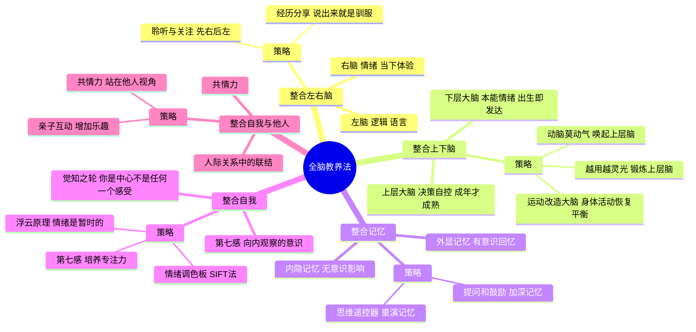

# 《全脑教养法》读书笔记

## 📚 基础信息
- **书名**: 全脑教养法：拓展儿童思维的12项革命性策略
- **原名**: The Whole-Brain Child: 12 Revolutionary Strategies to Nurture Your Child's Developing Mind
- **作者**: 丹尼尔·西格尔（Daniel J. Siegel），加州大学洛杉矶分校临床精神病学教授 + 蒂娜·佩恩·布赖森（Tina Payne Bryson），儿童心理治疗师
- **出版社**: 浙江人民出版社（中译本）
- **出版年份**: 2011年（原版）/ 2016年（中译本）
- **页数**: 约200页
- **开始阅读**: 未设置
- **完成阅读**: 未设置
- **阅读状态**: ☐ 正在阅读 ☐ 已完成 ☐ 暂停
- **个人评分**: ⭐⭐⭐⭐⭐
- **标签**: 脑科学, 儿童发展, 情绪调节, 整合教育, 记忆处理, 第七感

## 📖 内容概要

### 书籍简介
《全脑教养法》是所有育儿书中最"硬核"的一本——它把脑科学的前沿发现转化为12个日常可操作的育儿策略。核心命题：**大脑的整合程度决定心理健康水平。** 当左右脑、上下脑、记忆、自我和人际连接被良好整合时，孩子就会展现出情绪调节、决策力、共情力和韧性。育儿中每一次"生存时刻"（发脾气、恐惧、冲突），都是促进大脑整合的"成长机会"。

### 核心主题
1. **整合即健康** — 大脑各部分的协调运作 = 心理健康
2. **生存式教育 → 发展式教育** — 把日常冲突转化为大脑整合机会
3. **12项策略** — 覆盖左右脑、上下脑、记忆、自我、人际五大整合维度
4. **可塑性窗口** — 12岁前的大脑具有极强的可塑性
5. **父母也能改变** — 整合是可习得的能力，成人也可以重新整合

### 五大整合维度
| 维度 | 冲突表现 | 整合目标 |
|------|---------|---------|
| 左右脑 | 情绪失控（右脑主导） | 用逻辑理解情绪 |
| 上下脑 | 本能冲动（下脑主导） | 唤起上层脑自控 |
| 内隐/外显记忆 | 无意识被过去触发 | 完整叙述创伤经历 |
| 自我 | 被情绪吞没 | 培养"觉知之轮" |
| 自我与他人 | 缺乏共情 | 在关系中整合 |

---

## 🧠 知识架构

---

## ✍️ 读书笔记

### 🔖 重点摘录

> "大脑是可塑的。每一次互动、每一次回应，都在重塑孩子的大脑——也在重塑你的大脑。"

> "当大脑的各部分被良好整合时，孩子就展现出心理健康——灵活、适应力强、情绪稳定、能够理解自己和他人。"

> "育儿中每一个你恨不得逃走的'生存时刻'，恰好是一个最大的'成长机会'——因为它告诉你孩子大脑的哪个部分正在需要整合。"

> "'说出来就是驯服它'（Name it to tame it）——帮助孩子用语言讲述他的经历，同时激活左脑，把右脑的强烈情绪纳入可处理的框架。"

---

### 📖 各维度深度解读

#### 整合左右脑：从"情绪失控"到"被理解"

**脑科学基础**：右脑处理情绪、身体感觉、当下体验和整体图景。左脑负责逻辑、语言、因果推理。幼儿的右脑占主导——他们"活在当下感受中"。这也是为什么孩子发脾气时讲道理没用——你是在用左脑（逻辑）去对一个右脑（情绪）关闭的人说话。

**"先右后左"法则（全书最核心的实用原则）**：
1. 先用右脑连接右脑——共情、身体接触、说出感受（"你看起来很生气"）
2. 再引导左脑介入——复述经历、解决问题（"下次我们可以怎么做？"）

这个原则与《如何说孩子才会听》的"说出感受"和NVC的"先连接情感再解决问题"完全一致。西格尔给的是脑科学的解释：为什么必须先共情再讲理——因为右脑必须首先感到被理解，左脑才能被重新打开。

---

#### 整合上下脑：为什么孩子"知道但不能做到"

**脑科学基础**：下层大脑（脑干+边缘系统）出生时已发育成熟，负责本能、冲动和强烈情绪。上层大脑（前额叶皮层）负责理性决策、自控、共情、道德——但到25岁才完全成熟。

这解释了为什么孩子"明明知道不对但还是做了"——不是品德问题，是神经结构问题。他的下层大脑在驱动行为，而上层大脑还没上线。

**关键区分——"上层暴怒" vs "下层暴怒"**：
- 上层暴怒：孩子选择发怒（"我不给我买我就闹"）——有策略性，可控
- 下层暴怒：孩子被情绪吞没（杏仁核劫持）——无策略，失控
- 对上层暴怒，坚定不妥协；对下层暴怒，先安抚再讨论

**"运动改造大脑"策略**：身体运动可以直接改变大脑的化学状态。孩子情绪失控时，有时候不需要说话——先跑一圈，先跳一跳。身体运动帮助释放被压抑到下层大脑的应激能量。

---

#### 整合记忆：内隐记忆如何无声地左右行为

**脑科学基础**：内隐记忆是无意识的——你不需要刻意回忆就知道"那个房间让我不舒服"。外显记忆是有意识的——"我记得去年在那个房间里发生了一件事"。

许多儿童的行为问题来自**未被处理的内隐记忆**。孩子怕狗——可能不是因为被狗咬过，而是1岁时听过一声犬吠，当时吓哭了，但这件事从未被谈论和整合过。内隐记忆像碎片一样嵌在身体里，当相似情境出现时被自动激活。

**"思维遥控器"策略（全书最精彩的隐喻之一）**：帮助孩子像用遥控器播放电影一样重演创伤经历——可以暂停（停一下，你感受到了什么？）、快进（跳过最难受的部分到结局）、回放（回到某个关键画面）。这个比喻让孩子从"被记忆吞没"切换到"我在操控记忆"的位置，这正是整合的过程。

---

#### 整合自我：你不是你的情绪

**"觉知之轮"（Wheel of Awareness）**是全书的标志性模型：

轮心（Hub）是纯粹的觉察——"我"在观察这一切。轮辐上分布着各种心理内容：愤怒、悲伤、身体感觉、回忆、想法。问题不是"轮辐上出现了愤怒"，而是"你以为自己就是那个愤怒"——你被情绪吞没了。

**"浮云原理"**：情绪就像天上的浮云——它们来了，也会走。你不是浮云，你是天空。教会孩子"我感到生气"而不是"我是生气的人"——这个语言细节的差别就是整合与否的差异。

---

### 💭 个人思考

1. **这本书补齐了所有育儿书的"硬件层"**
   前面的8本书都在讲"软件"（教育哲学、沟通技巧、关系修复），这本在讲"硬件"（大脑结构、神经机制）。它告诉你：正面管教、非暴力沟通、游戏力之所以有效，背后的神经科学原因是什么。这不是重复——这是把所有方法锚定到了一个不可辩驳的科学基础上。

2. **"说说出来就是驯服它"与游戏设计的关联**
   这个策略的原理是：语言化=左脑激活=情绪脱困。这和游戏设计中的"把模糊焦虑变成明确挑战"异曲同工——玩家一旦知道自己面对的是什么，焦虑就减半。叙事游戏中的"给玩家命名他们的处境"本质上就是西格尔的整合策略。

3. **12岁——所有敏感期理论的"最后期限"**
   西格尔指出12岁之前大脑可塑性最强。这和蒙台梭利"6-12岁仍可弥补"以及《捕捉儿童敏感期》的论述完全对齐。0-6岁是最佳窗口，6-12岁是弥补窗口，12岁以后神经可塑性虽不消失但显著下降。这不是制造焦虑，而是提醒珍惜。

---

### 🎯 实践应用
- 当孩子情绪崩溃时，执行"先右后左"：抱抱→说出感受→复述经历→一起想方案
- 把"Name it to tame it"变成本能：孩子发脾气时，第一句永远是"你看起来很……"
- 睡前5分钟"回忆游戏"：和孩子一起用思维遥控器回放今天最开心/最难过/最有趣的时刻

---

## 🔗 知识关联网络

### 与已读书籍的关联
- **《如何说孩子才会听》**: "说出感受"=Name it to tame it=左右脑整合——法伯给语言工具，西格尔给神经机制 | 关联强度: ⭐⭐⭐⭐⭐
- **《正面管教》**: "先连接再纠正"=先右后左；"积极的暂停"=下线大脑冷却再上是线 | 关联强度: ⭐⭐⭐⭐⭐
- **《真希望我父母读过这本书》**: 佩里的"修复"和西格尔的"记忆整合"是同一件事——把破碎的体验编织成完整叙事 | 关联强度: ⭐⭐⭐⭐⭐
- **《思考快与慢》**: 系统1=下层大脑，系统2=上层大脑——两本书独立论证了相同的双系统模型 | 关联强度: ⭐⭐⭐⭐

---

## 📊 学习总结
### 最大的收获
每一次育儿危机都是大脑整合的机会。"生存时刻"和"成长时刻"是同一刻，区别只在于你如何回应。
### 改变的观念
- **旧观念**: 孩子发脾气=需要被"治"的行为问题
- **新观念**: 孩子发脾气=大脑某个部分需要被整合的信号

---

**笔记创建时间**: 2026-07-10
**笔记版本**: v1.0

## 参考来源
- 微信读书：https://weread.qq.com/web/reader/99a329e072141d7a99a59dc
- Daniel Siegel的Mindsight Institute资源
