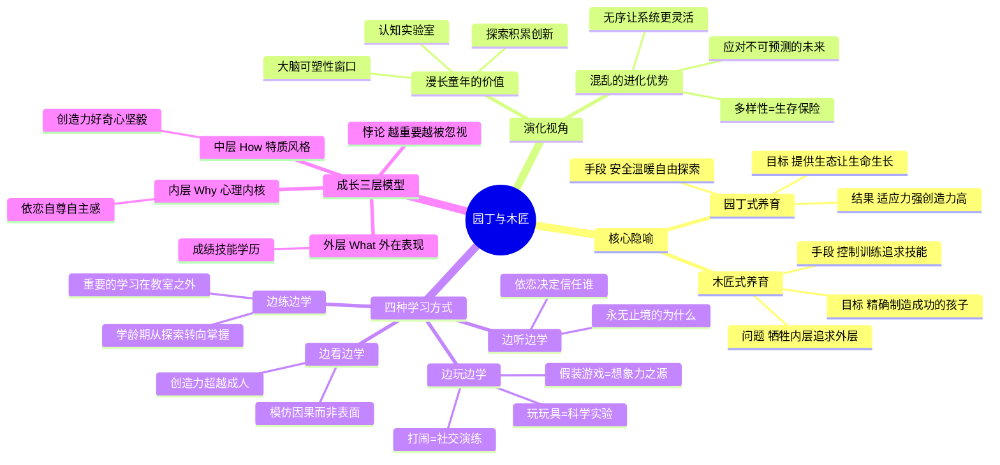

# 《园丁与木匠》读书笔记

## 📚 基础信息
- **书名**: 园丁与木匠
- **原名**: The Gardener and the Carpenter: What the New Science of Child Development Tells Us About the Relationship Between Parents and Children
- **作者**: [美] 艾莉森·高普尼克（Alison Gopnik），加州大学伯克利分校发展心理学教授，牛津大学心理学博士
- **出版社**: 浙江人民出版社（中译本）
- **出版年份**: 2016年（原版）/ 2019年（中译本）
- **页数**: 约280页
- **开始阅读**: 未设置
- **完成阅读**: 未设置
- **阅读状态**: ☐ 正在阅读 ☐ 已完成 ☐ 暂停
- **个人评分**: ⭐⭐⭐⭐⭐
- **标签**: 发展心理学, 演化心理学, 育儿哲学, 认知科学, 玩耍学习, 童年本质

## 📖 内容概要

### 书籍简介
这不是一本"怎么育儿"的书——它是一本从演化生物学和发展心理学出发追问"为什么有童年""为什么有父母""孩子到底是怎么学习的"的书。高普尼克用30年的实证研究构建了一个强有力的论证：**童年的独特性——混乱、玩耍、好奇心、漫长的依赖——不是系统缺陷，而是进化的精妙设计。** 好父母不是木匠（按蓝图精确制造产品），而是园丁（为生命提供生长的生态系统）。

### 核心主题
1. **园丁 vs 木匠** — 育儿不是制造产品，是培育生态
2. **童年的演化价值** — 漫长童年是进化的认知实验室
3. **孩子如何学习** — 边看边学、边听边学、边玩边学、边练边学
4. **爱的本质** — 爱是无条件地提供成长条件，不是塑造对方成为什么
5. **"混乱"的价值** — 无序和探索是人类面对未来的生存保险

### 主要章节
| 章节 | 主题 | 核心问题 |
|------|------|---------|
| 引言 | 为人父母的本质 | 父母是"制造"孩子还是"培育"孩子？ |
| 第1章 | 童年的演化 | 为什么人类有最长的童年？童年的混沌有什么进化优势？ |
| 第2章 | 爱的进化 | 我们为什么爱孩子？祖父母、异亲与"爱的三面手" |
| 第3章 | 边看边学 | 孩子如何通过观察来学习因果？模仿为何比我们想的更聪明？ |
| 第4章 | 边听边学 | 孩子为什么永无止境地问"为什么"？依恋如何影响信任？ |
| 第5章 | 边玩边学 | 打闹、玩玩具、假装游戏——玩耍为什么是最高级的学习？ |
| 第6章 | 边练边学 | 学龄期从探索式学习到掌握式学习的转变 |
| 第7章 | 科技与未来 | 屏幕时代，园丁式养育意味着什么？ |

---

## 🧠 知识架构

---

## ✍️ 读书笔记

### 🔖 重点摘录

> "为人父母就像在园子里种花，旨在提供一个营养丰富、安全稳定的环境，让各式各样的鲜花茁壮成长；旨在为孩子提供一个健康、强大、多样的生态系统，让他们自己创造具有无限可能的未来。"

> "爱的意义不是塑造我们所爱之人的命运，而是帮助他们塑造自己的命运；不是为了向他们展示道路，而是为了帮助他们找到自己的道路，哪怕他们所走的道路不是我们想选的。"

> "无序是解答一切问题的钥匙。一个可以变化和演进的系统，哪怕是随机演变，都能更智慧、灵活地适应变化中的世界。"

> "好父母不一定会把孩子变成聪明、快乐或成功的成年人，但可以打造出强健、具有高适应性和韧性的新一代人。"

---

### 📖 核心概念深度解读

#### "园丁与木匠"隐喻——为什么这个比喻价值连城

**木匠思维**：我心中有一个成品的蓝图（好大学、好工作、好品格），我的工作是把孩子这块木材雕刻成蓝图的样子。精确、可控、可预测。

**园丁思维**：我创造肥沃的土壤（安全的依恋、温暖的家庭、丰富的刺激），然后让种子按照它自身携带的基因和信息去生长。园丁不能决定花开成什么颜色，但能确保土壤不让花枯萎。

**为什么木匠思维如此普遍？** 因为它满足"控制幻觉"——让我们觉得"我在做点什么"。而园丁思维要求我们承受不确定性——"我做了我能做的，但结果不由我控制"。这在焦虑的文化环境中尤其困难。

**与中国式家长的直接对话**：整个"鸡娃"教育体系就是极致的木匠思维——奥数、英语、钢琴、编程，每一样都是工匠手中的工具。高普尼克用演化视角证明：**这套逻辑在十万年的时间尺度上是错的。** 未来不可预测，你按照今天的"成功蓝图"雕刻出来的孩子，不一定能适应明天的世界。而园丁养育出的孩子——在自由探索中长出适应性、创造力和韧性——反而更有可能在任何未来中生存和繁荣。

---

#### 成长的三个层次——解开"育儿焦虑"的钥匙

译者赵昱鲲将高普尼克的论证提炼为三层模型：

| 层次 | 内容 | 可测量性 | 重要性 | 木匠式关注度 | 园丁式关注度 |
|------|------|:---:|:---:|:---:|:---:|
| **内层 Why** | 依恋、自尊、自主感 | 最难 | 最高 | 最低 | 最高 |
| **中层 How** | 创造力、好奇心、韧性 | 中等 | 高 | 中等 | 高 |
| **外层 What** | 成绩、技能、学历 | 最容易 | 最低 | 最高 | 最低 |

**悖论**：最容易衡量的东西最不重要，最重要的东西最难衡量。木匠式育儿把全部精力投入在外层，因为它"看得见"；园丁式育儿把精力放在内层和中层，因为那才是孩子一生的底座。

**关联到之前读过的所有书**：这个三层模型是一个完美的总结框架——
- 《捕捉儿童敏感期》+《童年的秘密》 → 保护内层（精神胚胎不被破坏）
- 《正面管教》+《看见孩子》 → 重建内层（"你是好的"，重建归属感）
- 《如何说》+《游戏力》 → 发展中层（通过沟通和游戏培养创造力、韧性）
- 而这些都是对"木匠式只关注外层"的反抗

---

#### "混乱"的演化价值——全书最反直觉也最有力量的观点

在演化时间尺度上，童年的"混乱"——自由玩耍、无目的探索、试错、假装——不是系统缺陷，而是系统最精妙的设计。

**论证链**：
1. 未来不可预测（这是演化的大前提）
2. 应对不可预测未来的最优策略不是"精确设计"，而是"多样性和适应性"
3. 漫长的童年+自由探索=最大化的多样性
4. 因此，看起来"低效""混乱"的童年其实是进化选择的"高效"策略——只不过这个"高效"不能用KPI来衡量

**游戏设计关联**：这和Roguelite游戏的设计逻辑完全一致——不是给玩家一条预设的最优路线，而是给一个系统+随机性，让玩家自己探索出解法。园丁式养育就是让真实世界成为孩子的Roguelite。

---

### 💭 个人思考

1. **这本书解决了一个根本性的焦虑——"我到底要不要鸡娃？"**
   高普尼克的回答不是"鸡娃不道德"（道德论证），而是"鸡娃不聪明"（效用论证）。在演化逻辑下，鸡娃是在用石器时代的确定性思维（木匠）来应对一个加速变化的世界。真正的理性选择恰恰是看起来"放任"的园丁策略。

2. **"为什么"比"怎么做"重要一百倍**
   这本书在9本育儿书中位置独特——它不讲任何具体的育儿技巧。它是9本书中的"底层操作系统"——如果你理解了园丁与木匠的差别，具体用什么方法是次要的。正因如此，它被放在"深度理解"阅读路线的中间。

---

### 🎯 实践应用
- 给孩子每天至少2小时无结构自由玩耍时间——不安排、不干预、不评价
- 当焦虑"别人家孩子都在学XX"时，问自己：这是在种花还是在雕木头？

---

## 🔗 知识关联网络

### 与已读书籍的关联
- **《童年的秘密》**: 蒙氏"内在生命力"与高普尼克的"演化设计"殊途同归，一个来自观察，一个来自演化论证 | 关联强度: ⭐⭐⭐⭐⭐
- **《真需求》**: 孩子的"真需求"不是成绩和技能，而是安全依恋+自主探索+自由玩耍——这就是内层和中层 | 关联强度: ⭐⭐⭐⭐⭐
- **《第一性原理》**: 高普尼克从"童年为什么存在"这个第一性问题出发，推导出育儿哲学——这是第一性原理的典范应用 | 关联强度: ⭐⭐⭐⭐
- **《中国式家长》游戏分析**: 游戏高考中心主义=木匠思维；如果加入"自由探索"和"非学术路线"，就是园丁思维的体现 | 关联强度: ⭐⭐⭐⭐

---

## 📊 学习总结
### 最大的收获
童年的"混乱"不是需要被消灭的敌人，而是需要被保护的设计。育儿焦虑的本质是我们用木匠的思维方式去处理园丁的工作。
### 改变的观念
- **旧观念**: 育儿是做加法（教得越多越好）
- **新观念**: 育儿是做减法+做环境（去除障碍+提供生态）

---

**笔记创建时间**: 2026-07-10
**笔记版本**: v1.0

## 参考来源
- 微信读书：https://weread.qq.com/web/bookDetail/00a32aa0813ab7df5g019c9b
- Alison Gopnik的TED演讲及UC Berkeley实验室研究
