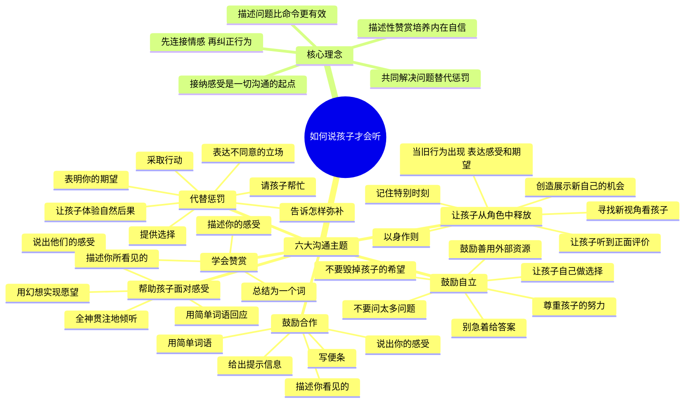
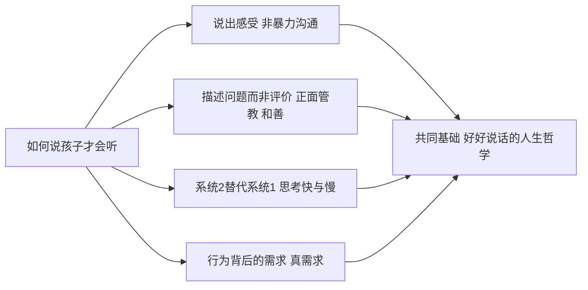

# 《如何说孩子才会听，怎么听孩子才肯说》读书笔记

## 📚 基础信息
- **书名**: 如何说孩子才会听，怎么听孩子才肯说
- **原名**: How to Talk So Kids Will Listen & Listen So Kids Will Talk
- **作者**: 阿黛尔·法伯（Adele Faber）& 伊莱恩·玛兹丽施（Elaine Mazlish）
- **译者**: 安燕玲
- **出版社**: 中央编译出版社（中译本）
- **出版年份**: 1979年（原版）/ 2007年（中译本）
- **页数**: 约320页
- **开始阅读**: 未设置
- **完成阅读**: 未设置
- **阅读状态**: ☐ 正在阅读 ☐ 已完成 ☐ 暂停
- **个人评分**: ⭐⭐⭐⭐⭐
- **标签**: 亲子沟通, 倾听, 合作, 赞赏, 自立, 情商教育, 儿童心理

## 📖 内容概要

### 书籍简介
《如何说孩子才会听，怎么听孩子才肯说》是国际亲子沟通的经典之作，出版40余年来畅销全球，被誉为"亲子沟通圣经"。作者阿黛尔·法伯和伊莱恩·玛兹丽施是美国著名亲子沟通专家，两人均为儿童心理学家海姆·吉诺特（Haim Ginott）的学生。

本书的核心命题简单而深刻：**亲子之间的大部分冲突，源于沟通方式的问题，而非孩子本身的问题。** 全书围绕六大主题，提供了30种具体、可操作的沟通技巧——没有空泛的理论，只有能直接用到日常生活里的方法。

### 核心主题
1. **接纳感受** — 所有沟通的起点：先接纳情绪，再处理行为
2. **鼓励合作** — 用描述式语言替代命令式语言，让孩子主动配合
3. **替代惩罚** — 惩罚剥夺反思机会，共同解决问题培养责任感
4. **培养自立** — 做一个"舍得放手"的父母，让孩子成为独立的个体
5. **有效赞赏** — 描述性赞赏让人看见自己，评价性赞赏让人依赖评价
6. **释放角色** — 撕掉标签，让孩子从固化角色中解放出来

### 主要章节
| 章节 | 主题 | 方法数量 | 核心技能 |
|------|------|:------:|---------|
| 第1章 | 帮助孩子面对感受 | 4个技巧 | 全神倾听→简单回应→说出感受→幻想实现 |
| 第2章 | 鼓励孩子与我们合作 | 5个技巧 | 描述→提示→简语→说感受→写便条 |
| 第3章 | 代替惩罚的方法 | 7个技巧 | 帮忙→表达立场→期望→选择→弥补→行动→自然后果 |
| 第4章 | 鼓励孩子自立 | 6个技巧 | 自己选→尊重努力→少追问→不代答→用外部资源→保护梦想 |
| 第5章 | 学会赞赏孩子 | 3个技巧 | 描述所见→描述感受→总结为词 |
| 第6章 | 让孩子从角色中释放 | 6个技巧 | 见新自己→创造机会→无意中听→以身作则→记特别时刻→表期望 |
| 第7章 | 融会贯通 | 综合应用 | 六大技能在真实场景中的灵活组合 |

---

## 🧠 知识架构

---

## ✍️ 读书笔记

### 🔖 重点摘录

> "孩子的感受和他们的行为有直接的联系。孩子感觉好了，自然就会做得好。"

> "我们越想把一件事从脑子里赶出去，它就越会在脑子里扎根。"

> "当孩子的感受被否定时，他们会感到困惑和愤怒——这也是为什么他们无法静下心来听你讲道理。"

> "惩罚能让孩子为他的行为付出代价，但它不能教会孩子怎样做得更好。"

> "描述性赞赏让孩子能够自己赞赏自己——这才是赞赏的终极目标。"

> "永远不要低估你的话对孩子一生的影响。"

---

### 📖 各章核心笔记

#### 第1章：帮助孩子面对他们的感受

**核心命题**：父母最常见的错误——在孩子有情绪时，第一反应是"否定感受"（"别哭了""这有什么好生气的""不至于"）。越否定，孩子情绪越激烈。

**四个技巧**：

1. **全神贯注地倾听**
   - 错误：一边看手机一边说"我在听"
   - 正确：放下手中的事，转向孩子，眼神接触
   - 设计原理：孩子需要的不是"解决问题"，首先是"被听见"

2. **用"哦……""嗯……""这样啊……"来回应**
   - 错误：立刻给建议、说教、追问
   - 正确：用简单的语气词表明"我在听，我接收到了"
   - 设计原理：保持对话通道打开，不急于关上

3. **说出他们的感受**
   - 错误："别生气，弟弟不是故意的"
   - 正确："你看起来真的很生气。我猜被推倒一定很难受。"
   - 设计原理：当感受被准确命名，情绪的强度会自动下降（这与NVC中"辨识感受"完全一致）

4. **用幻想的方式实现他们的愿望**
   - 错误："不行就是不行，别闹了"
   - 正确："我真希望现在就能给你变出一盒新蜡笔！我们要不要想想还有什么可以替代的？"
   - 设计原理：幽默和想象力可以绕过"不"的对抗，打开新的可能

**深度洞察（第四层）**：为什么"说出感受"这么简单的动作如此有效？因为它让孩子从"被情绪吞没"的状态切换到"观察自己的情绪"的元认知状态。说出感受，就是把孩子从情绪的冲浪板上请到岸上。

---

#### 第2章：鼓励孩子与我们合作

**核心命题**：传统的命令式沟通（"快去做作业！""不要乱扔！"）天然激发对抗。把命令替换为描述，合作自然发生。

**五个技巧**：

1. **描述你所看见的或描述问题**
   - "湿毛巾放在床上了"（而非"你又把毛巾扔床上！"）
   - 效果：孩子听到的是事情本身，不是你对他本人的指责

2. **提示**
   - "牛奶不放回冰箱会变酸"
   - 效果：信息传递不带攻击性，孩子自己去执行

3. **用简单的词语表达**
   - "书包！"（而非"跟你说了多少次进门要把书包放好……"）
   - 效果：简短提醒最有力，长篇说教让人关闭耳朵

4. **说出你的感受**
   - "我不喜欢听别人打断我说话"（而非"你这孩子真没礼貌！"）
   - 效果：用"我"的信息替代"你"的指控

5. **写便条**
   - 门上贴："请轻声关门，弟弟在睡觉 :)"
   - 效果：书面语言绕过口头的情绪惯性

**设计思维分析**：这五种技巧实际上是一个"去攻击性"的渐进设计：从最不侵入（描述问题），到提供信息（提示），到简洁指令（简语），到表达自己（说感受），最后到换媒介（便条）。家长可以根据场景逐级升级，而不是一步跳到情绪爆发。

---

#### 第3章：代替惩罚的方法

**核心命题**：惩罚让孩子忙于怨恨和报复，没有余力反思自己的行为。用"共同解决问题"替代惩罚，既维护规则，又保留连接。

**为什么惩罚"有效"但有害？**
- 惩罚让孩子的注意力从"我做错了什么"转向"我被怎样对待了"
- 惩罚教会孩子"强者可以压迫弱者"，这不是你想教的东西
- 惩罚的效用随年龄递减：10岁后孩子会想"你还能对我怎么样？"

**问题解决五步骤**（屡教不改时的核心工具）：
1. 倾听孩子的感受和需求——"我看到你不愿意按时睡觉，能告诉我为什么吗？"
2. 说出你的感受和需求——"我需要你有足够的睡眠才能在学校保持精力"
3. 一起头脑风暴，写下所有想法——不评价，先收集
4. 回顾清单，决定双方同意的方案——选择双方都能接受的
5. 付诸行动——约定试行期，定期回顾

**认知转变（第五层）**：我原本以为"不用惩罚"意味着"放弃管教的底线"。这本书让我意识到：**惩罚不是底线，解决问题才是底线。** 惩罚只是用暴力速度走了一条捷径，而共同解决问题虽然更慢，但切实教会了孩子"当出现冲突时，我们可以坐下来协商"。后者恰恰是孩子在未来人生中需要的核心能力。

---

#### 第4章：鼓励孩子自立

**核心命题**：父母的终极任务是让自己"失业"。孩子的自立不是被"教会"的，而是被"允许"的。

**六个技巧中的关键几个**：

1. **让孩子自己做选择**："今天穿蓝裤子还是红裤子？"——二选一的智慧在于，给孩子掌控感，又不让他被过多选择淹没。

3. **不要问太多问题**：孩子放学回家，不要劈头盖脸"今天学了什么？考试多少分？和谁玩了？"——过度的追问传递的是焦虑和不信任。

4. **别急着告诉答案**："这是个有趣的问题——你怎么想的？"——让孩子先思考，是培养独立思考最简单也最重要的方法。

6. **不要毁掉孩子的希望**："我想当宇航员！"——"你数学那么差还当宇航员？"vs"听起来很酷！你觉得宇航员需要学什么？"

---

#### 第5章：学会赞赏孩子

**核心命题**：赞赏不是"你真棒"，而是"我看到你做了什么"。前者的潜台词是"我在评价你"，后者的潜台词是"我在关注你"。

**三个技巧**：

1. **描述你所看见的**："我注意到你今天写完作业后自己收拾了书桌"
2. **描述你的感受**："走进这样的房间让我心情都变好了"
3. **总结为一个词**："这就是'自律'——你不需要别人催就自己完成了"

**为什么"你真棒"有害？**
- "你真棒"让孩子依赖外部评价——当没有人在旁边说"你真棒"时，他不知道自己做得好不好
- "你真棒"指向结果，让孩子害怕尝试可能失败的事
- 描述性赞赏让孩子自己得出结论"我做得好"——这才是真正的自信

---

#### 第6章：让孩子从角色中释放

**核心命题**：父母无意中给孩子贴的标签（"我家这孩子就是腼腆""她数学不好""他做事慢"），会变成孩子对自己的定义，然后行为会主动符合标签。

**六个技巧中的核心**：
- 寻找机会让孩子看到一个全新的自己："我记得你上次主动帮了邻居奶奶，你其实很会关心人"
- 创造机会让孩子另眼看待自己："你能帮我个忙吗？我需要一个细心的人来整理这些文件"
- 让孩子无意中听到你的正面评价：对配偶说（让孩子"恰好"听到）"今天我在忙的时候，他自己把玩具都收拾好了"

**深层机制（第四层）**：标签之所以强大，是因为它简化了孩子的自我认知——"我就是这样的人"比"我需要搞清楚自己是什么样的人"要简单得多。撕标签的本质是：把复杂性还给孩子，让他看到自己不只是一种可能。

---

### 💭 个人思考

1. **这本书最颠覆的洞察：亲子冲突的根源不是"孩子不听话"，而是"成人不会说话"**
   读完会发现，书中每一个"错误示范"都如此熟悉——因为我们自己就是被这样对待的。父母的父母用命令、惩罚和评价和他们说话，他们学会了，然后用同样方式和我们说话，我们又学会了。这本书的本质是**打破沟通方式的代际传递**。

2. **与《正面管教》的互补关系**
   正面管教提供教育哲学（"和善与坚定并行""行为不当=丧失信心"），这本书提供该哲学的具体实现——"和善"怎么表达？（说出感受）"坚定"怎么做？（描述问题+提供选择）。两本书配合，一套完整体系就形成了。

3. **这些沟通技巧的跨领域通用性**
   书中的六大技巧完全可以迁移到任何关系：
   - **夫妻关系**："我看着这一桌子的碗没洗"（描述问题）vs "你怎么又没洗碗！"（指责）
   - **职场关系**："这个项目延期两周了"（描述）vs "你怎么做的？太慢了！"（攻击）
   - **自我对话**："我今天没完成计划，感到很沮丧"（说出自己的感受）vs "我真是个废物"（自我惩罚）
   
   这本书表面上在讲"怎么跟孩子说话"，实际上在讲**怎么好好说话**。

---

### 🎯 实践应用

1. **"感受词汇表"上墙**：打印常见情绪词汇（开心、伤心、愤怒、害怕、失望、委屈、嫉妒、兴奋、紧张……）贴在墙上，帮助孩子和自己练习"说出感受"。

2. **把命令改成便条**：找一件你每天都在重复催促的事情（起床、收拾书包、关灯），写一张温和的便条，代替口头催促。观察效果。

3. **每天一次"描述性赞赏"**：一周内，每天至少用一次"描述所见+描述感受+总结为词"代替"你真棒"。

4. **当冲突发生时，启动"问题解决五步"**：不需要每次都做，但当某个问题反复出现时，和孩子坐下来走一遍完整流程。

---

## 🔗 相关扩展

### 相关书籍推荐
1. **《孩子，把你的手给我》海姆·吉诺特** — 本书作者法伯和玛兹丽施的导师，亲子沟通的开山之作
2. **《正面管教》简·尼尔森** — 本书的方法论在"和善与坚定并行"的框架下应用更完整
3. **《非暴力沟通》马歇尔·卢森堡** — NVC的四步与本书的"说出感受"高度同构
4. **《P.E.T.父母效能训练》托马斯·戈登** — 另一套经典沟通体系，"积极倾听""我-信息"与本书互补
5. **《游戏力》劳伦斯·科恩** — 将"说出感受"和"幻想实现"发挥到极致的游戏式育儿

---

## 💭 深度衍生思考

### 🎯 核心观点延伸

**"描述而非评价"是人类关系的底层改善机制**
把"你真懒"（评价）改为"我看到你的房间三天没有整理了"（描述），沟通效果天差地别。为什么？因为描述给你和对方一个共同的第三方——客观事实。评价则把你变成法官，把对方变成被告。描述创造了"我们一起看同一件事"的合作姿态，而不是"我在你之上评判你"的权力姿态。

---

### 🔍 多角度分析

1. **语言学视角**：本书的技巧本质上是"语用学重构"——不改变要传递的核心信息，但改变语言的表达形式（句式、语气、媒介），从而改变接收者的解读。这是语言的力量：同样的意图，不同的句式，决定了对方是打开还是关闭。

2. **游戏设计视角**：游戏中NPC与玩家的互动也有"如何说"的问题。传统NPC只会下达任务命令（"去杀死10只野狼！"），但如果游戏借鉴本书的沟通设计：NPC先说出感受（"我的羊群被狼袭击了，我很害怕"），然后描述情境（"最近野狼越来越多"），最后由玩家主动提出帮助——这会让任务接受度完全不同。联想到之前在《中国式家长》分析中提到的"允许玩家在系统内优化并看到代价"，游戏叙事也可以用"描述而非命令"的方式来传达设计师的意图。

3. **反向思考**：本书方法的最大限制——它在情绪平静时效果最好，但孩子崩溃时和家长疲惫时根本想不起这些技巧。法伯和玛兹丽施自己也承认：不是你每句话都能完美表达，而是你努力成为"大多数时候好好说话"的家长。这让我想到系统设计中的一个原则：**不要追求完美执行的系统，要追求在出错后能恢复的系统。** 亲子沟通也是如此——修复比完美更重要。

---

## 🔗 知识关联网络

### 与已读书籍的关联
- **《非暴力沟通》**: NVC四步（观察-感受-需要-请求）与本书六章高度同构：说感受=NVC"感受"，描述问题=NVC"观察"，提供选择=NVC"请求" | 关联强度: ⭐⭐⭐⭐⭐
- **《正面管教》**: 正面管教提供"和善与坚定并行"的哲学框架，本书提供该框架下具体的语言工具 | 关联强度: ⭐⭐⭐⭐⭐
- **《思考快与慢》**: 亲子冲突中家长的第一反应（吼、命令、评价）是系统1，本书的所有技巧都是在训练家长从系统1切换到系统2——在开口之前先停一秒，选择"怎么表达" | 关联强度: ⭐⭐⭐⭐
- **《真需求》**: 孩子的"不听话"往往是被成人解读错了的"真需求"——比如拖延可能不是懒惰，而是对自主权的需求 | 关联强度: ⭐⭐⭐⭐

### 概念映射

---

## 📚 后续阅读路径规划

### 理论源头
- 《孩子，把你的手给我》吉诺特 → 《P.E.T.父母效能训练》戈登 → 理解亲子沟通的学术传统

### 方法补充
- 《正面管教》尼尔森（教育哲学） + 《游戏力》科恩（游戏化沟通） + 《看见孩子》肯尼迪（情感连接）

### 应用到其他关系
- 《非暴力沟通》卢森堡 → 《关键对话》帕特森 → 将亲子沟通技巧推广到成人关系

---

## 📊 学习总结

### 最大的收获
亲子冲突的解药不是"让孩子闭嘴"，而是"换一种方式开口"。

### 改变的观念
- **旧观念**: 孩子需要被教育、被纠正、被管束——这是冲突的根源
- **新观念**: 孩子需要被倾听、被理解、被邀请合作——这是合作的开端

### 未来行动
- 将"描述而非评价"应用于所有关系（亲子、夫妻、同事）
- 在情绪激动时先做"积极的暂停"，而不是脱口而出第一反应
- 在游戏设计和交互设计中考虑"描述而非命令"的沟通模式

---

**笔记创建时间**: 2026-07-10
**最后更新**: 2026-07-10
**笔记版本**: v1.0

## 参考来源
- 微信读书：https://weread.qq.com/web/bookDetail/33b32450715aa36033b53ae
- 豆瓣读书相关评论
- Goodreads: How to Talk So Kids Will Listen & Listen So Kids Will Talk
