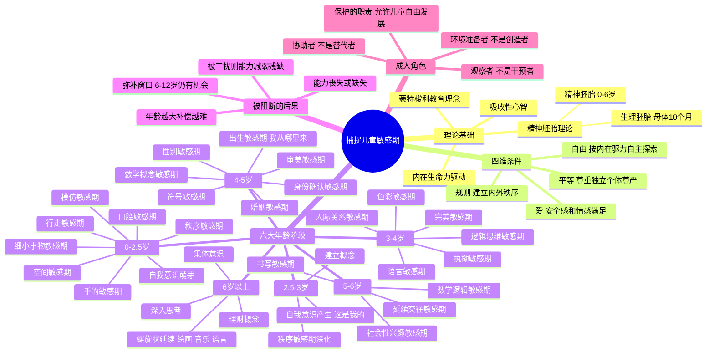
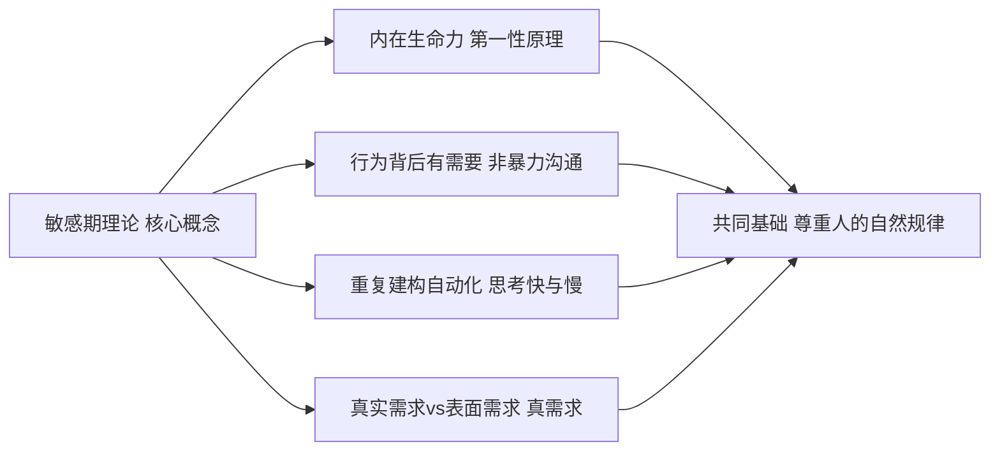

# 《捕捉儿童敏感期》读书笔记

## 📚 基础信息
- **书名**: 捕捉儿童敏感期
- **作者**: 孙瑞雪
- **出版社**: 中国妇女出版社（珍藏版）/ 新蕾出版社（早期版本）
- **出版年份**: 2007年（首版）/ 2013年（珍藏版）
- **页数**: 约240-272页
- **开始阅读**: 未设置
- **完成阅读**: 未设置
- **阅读状态**: ☐ 正在阅读 ☐ 已完成 ☐ 暂停
- **个人评分**: ⭐⭐⭐⭐⭐
- **标签**: 儿童教育, 蒙特梭利, 敏感期, 发展心理学, 幼儿成长, 孙瑞雪, 爱和自由

## 📖 内容概要

### 书籍简介
《捕捉儿童敏感期》是中国著名教育家、"爱和自由"教育精神创始人孙瑞雪的代表作。本书基于蒙特梭利教育理念，通过200多个0~10岁儿童敏感期的真实案例（由家长或老师记录，孙瑞雪点评），系统揭示了儿童成长的底层密码——敏感期。

书中核心命题：儿童在0~6岁期间受内在生命力驱使，会依次经历一系列敏感期。每个敏感期内，儿童对特定事物有近乎痴迷的兴趣和强大的吸收能力。如果敏感期被阻挠或干扰，对应能力就会丧失或残缺；如果被成人理解和保护，儿童将顺利建构完整的人格。

本书被誉为"中国幼儿教育的开创性著作"，被千万家长推崇。

### 核心主题
1. **敏感期理论** — 儿童成长的底层密码：不同年龄阶段对应不同的发展窗口
2. **精神胚胎理论** — 人类有两个胚胎期：生理胚胎（母体10个月）+ 精神胚胎（0-6岁）
3. **四维教育条件** — 爱、自由、规则、平等是敏感期顺利发展的四个核心条件
4. **成人角色重新定义** — 成人只是环境的准备者，不是儿童的创造者
5. **敏感期被阻断的后果与补救** — 6-12岁仍有弥补机会，但年龄越大越难

### 主要章节
- **第一章 4个孩子的完整成长故事**: 妞妞(0-4岁)、畅畅(0-4岁)、贝贝(1-3岁)、缇缇(2.5-5岁)的纵向追踪，提供敏感期全景认知
- **第二章 0~2.5岁敏感期**: 视觉、口、听觉、手、走、空间、细小事物、秩序、模仿、自我意识、玩水玩沙、审美等
- **第三章 2.5~3岁敏感期**: 建立概念、自我意识产生（"这是我的"）、秩序敏感期深化
- **第四章 3~4岁敏感期**: 执拗、垒高、色彩、语言、诅咒、追求完美、剪贴涂、藏与占有欲、逻辑思维、绘画、人际关系
- **第五章 4~5岁敏感期**: 出生（询问来处）、情感、婚姻、审美、数学概念、身份确认、性别、音乐、绘画、符号
- **第六章 5~6岁敏感期**: 婚姻深化、书写、数学逻辑、社会性兴趣、动植物与实验收集、延续交往
- **第七章 6岁以上**: 螺旋状敏感期的延续（绘画、音乐、语言等直至12岁），理财、集体意识、深入思考
- **第八章 更多观察案例**: "看看身边的孩子"
- **第九章 教育对谈**: 孙瑞雪与薛梅——"孩子应该怎样学习"

---

## 🧠 知识架构

---

## ✍️ 读书笔记

### 🔖 重点摘录

> "所谓敏感期，是指在0~6岁的成长过程中，儿童受内在生命力的驱使，在某个时间段内，专心吸收环境中某一事物的特质，并不断重复实践的过程。顺利通过一个敏感期后，儿童的心智水平便从一个层面上升到另一个层面。"

> "人类的本质不同在于有两个胚胎期：一个在母体中的10个月，形成的是生物的人；另一个是出生后0~6岁甚至更长，形成的是精神的人。"

> "成人只是环境，不是创造者。创造的权利必须交给儿童自己。"

> "敏感期被破坏后，能力就会丧失或者缺失。被干扰的话，能力就会减弱、残缺、不完整。"

> "不要用成人的价值观去评判儿童——儿童用口认识味道是建构自我，成人强调节约反而可能损害其心理发展。"

> "学习是人的天性。儿童天生具有吸收性心智和惊人的学习热情，成人用强制手段反而会破坏这种品质。"

---

### 📖 各章核心笔记

#### 第一章：四个孩子的完整成长故事

本章通过妞妞、畅畅、贝贝、缇缇四个孩子的纵向追踪记录，全景式呈现了敏感期的自然发展过程。

**关键洞察**：每个孩子的发展节奏不同，但敏感期的出现顺序是相同的。家长最常犯的错误是把"发展节奏的差异"误判为"能力的优劣"。

**案例**：畅畅在口腔敏感期时把各种物品放入口中，他的父母没有阻止，而是确保物品安全干净。结果畅畅顺利度过口腔敏感期后，不仅语言能力发展良好，而且对食物的接受度极广——这是"顺利度过敏感期"带来的长期红利。

---

#### 第二章：0~2.5岁——奠定一生的基础

这是敏感期最为密集的阶段，几乎每个月的表现都在变化。

| 敏感期 | 典型表现 | 成人常见错误 | 正确做法 |
|--------|---------|-------------|---------|
| **口腔敏感期** | 吃手、将一切放入口中 | 打手、涂苦味剂、"脏，不许吃" | 确保安全卫生，允许口部探索 |
| **手的敏感期** | 抓捏黏稠物、扔东西、对接 | "别乱扔""不许玩食物" | 提供可抓捏的安全材料 |
| **行走敏感期** | 反复上下坡、爬楼梯 | 抱起来走、制止"危险"行为 | 在安全范围内允许自由行走探索 |
| **空间敏感期** | 爬高、旋转、钻柜子 | "太危险""快下来" | 创造安全的攀爬和探索环境 |
| **细小事物敏感期** | 对蚂蚁、头发丝极度专注 | "脏""有什么好看的" | 保护专注状态，不打扰 |
| **秩序敏感期** | 物品必须归位、程序不可改变 | "别这么固执""至于吗" | 尊重秩序需求，建立稳定的日常规律 |
| **模仿敏感期** | 模仿成人的一切行为 | 被模仿时不耐烦 | 以身作则，成为行为的榜样 |
| **自我意识萌芽** | 频繁说"不"、打人咬人 | 严厉惩罚、认为孩子"变坏了" | 理解这是"我"的诞生，不是恶意 |

**深度思考**：这个阶段最大的教育悖论——**成人为了保护孩子而阻挠敏感期，结果造成的伤害比允许探索的风险更大。** 比如为了"安全"而不让孩子爬高，实际上剥夺了空间感知和身体协调的发展机会。真正的安全来自于孩子在探索中学会判断风险，而不是被隔离在风险之外。

---

#### 第三章：2.5~3岁——"我"的诞生

这个年龄被书中称为"自我意识的爆发期"。

**核心现象：**
- **"这是我的！"**：儿童通过占有物品来建构"自我"的边界。这不是自私，而是自我认知的必要过程。强迫分享实际上是在破坏儿童的自我建构。
- **建立概念**：儿童开始将感知经验与语言符号配对。比如不仅知道"苹果"是好吃的，还开始理解"苹果"这个概念包含颜色、形状、味道等属性。
- **秩序敏感期深化**：程序一旦建立就不可逆改。比如必须先穿左脚的袜子再穿右脚，顺序错了要全部重来。

**关键洞察**：书中强调，如果这个阶段儿童的"自我"被成人强行压制（强迫分享、强迫服从），会导致两种后果：要么变得没有边界感（无法拒绝别人），要么变得防御性过度（攻击性强）。健康的自我意识来自于被充分允许"拥有"和"说不"。

---

#### 第四章：3~4岁——执拗与完美

**执拗敏感期**：儿童对事物的完整性、程序的不可逆性有极致追求。一个饼干碎了就会崩溃大哭——不是无理取闹，而是对"完整"的内在秩序被破坏了。

**完美敏感期**：要求物品的形状、颜色、摆放达到心中的完美标准。这其实是儿童在建构对世界的认知框架——通过追求完美来理解和掌控环境。

**逻辑思维敏感期**：不断追问"为什么"，而且通常是追问到底的连环发问。这不是在挑战权威，而是在建构因果逻辑链条。

**成人的最大误区**：把执拗和完美敏感期当成"性格固执""不讲道理"来对待，用惩罚或忽视来回应。实际上这恰恰是儿童秩序感和审美能力在高速发展的信号。

---

#### 第五章：4~5岁——情感与关系的觉醒

这是社会性敏感期密集出现的阶段。

**婚姻敏感期（4~5岁）**：
- 最初阶段：要和爸爸或妈妈结婚
- 发展阶段："爱上"一个小伙伴或老师
- 成熟阶段：理解婚姻需要年龄相当、互相喜欢
- 案例：一个5岁男孩认真地说"我要和妈妈结婚"——成人如果嘲笑或直接否定，就错过了一次讨论爱与关系的教育机会

**出生敏感期**：开始追问"我从哪里来"。书中建议用真实、科学的回答，而不是"捡来的""充话费送的"这类玩笑话——后者会损害儿童对父母的信任和对生命的认知。

**审美敏感期**：对自我和环境有明确的审美要求。女孩对衣着打扮产生兴趣，男孩可能关注力量和帅气。这是自我形象建构的自然过程。

**身份确认敏感期**：通过扮演"超人""公主""警察"等角色来确认自己在社会中的位置。动画片和故事中的角色成为儿童理解社会角色的脚手架。

---

#### 第六章：5~6岁——社会化的起步

**社会性兴趣敏感期**：开始理解规则的意义。儿童主动询问"为什么要有规则"，并热衷于讨论规则是否公平。

**书写与数学逻辑敏感期**：不是被教会的，而是自己"发现"的。案例中一个孩子突然对书写产生狂热的兴趣，一天写了上百个字——因为他自己准备好了，而不是被要求学习的。

**延续交往敏感期**：从一对一的友谊发展到三四人一组的小团体。开始出现"最好的朋友"概念。

---

#### 第七章：6岁以上——螺旋式发展

6~12岁是之前敏感期的延续和深化期。0~6岁被压抑的敏感期，在这个阶段仍有弥补机会。

- 绘画、音乐、语言等敏感期呈螺旋状反复出现，每次都在更高层次上展开
- 开始发展理财概念、集体意识、深入思考能力
- 书中强调：**童年不是在6岁结束，而是在12岁左右才真正完成人格的基本建构**

---

### 💭 个人思考

1. **关于"敏感期"与"关键期"的区别**
   书中强调的是"敏感期"（sensitive period）而非"关键期"（critical period）。关键期意味着错过就永远丧失；敏感期意味着有一段最佳窗口，但窗口过后仍可弥补，只是难度更大。这个区分非常关键——它避免了家长的焦虑（"我的孩子3岁了还没过XX敏感期，是不是晚了？"），同时仍然传递了"请珍惜0~6岁"的信号。

2. **关于中国式育儿与敏感期的冲突**
   中国传统的育儿方式与敏感期理论存在系统性冲突：
   - "不许吃手" vs 口腔敏感期——传统育儿把吃手视为坏习惯，实际上是用口认识世界的生理需求
   - "不许乱扔" vs 手的敏感期和空间敏感期——扔东西是儿童在探索重力、距离、因果关系
   - "不许问那么多为什么" vs 逻辑思维敏感期——连环追问是智力发展的表现，不是故意烦人
   - "要分享，不能自私" vs 自我意识敏感期——强迫分享会损害自我边界的建构

   联想到之前分析的《中国式家长》游戏，其中"面子对决"的设计恰好反映了中国家庭中"通过比较孩子来获得社会认同"的文化惯性。这种文化与敏感期理论的核心（"尊重儿童的内在发展需求"）是完全冲突的。

3. **关于"精神胚胎"概念的哲学意义**
   孙瑞雪提出的"精神胚胎"概念有深刻的哲学含义：儿童不是一张白纸等待成人书写，也不是一个需要被塑造的对象，而是一个携带内在发展蓝图的独立生命。成人最重要的职责不是"教育"，而是"不破坏"。这种视角对"中国式家长"式的教育焦虑是一剂解药——你不需要把孩子塑造成什么人，你只需要别挡在他成为自己的路上。

4. **敏感期理论的游戏设计启示**
   联想到之前分析的游戏：如果做一个儿童模拟/育儿题材的游戏，敏感期可以成为核心机制：
   - 每个阶段解锁不同的"敏感期事件"（口部探索、扔东西、追问为什么、婚姻游戏等）
   - 玩家的选择（支持/阻挠/忽视）影响孩子的长期属性发展（安全感、创造力、社交能力、自我认同）
   - 可以设计"反直觉最优解"：比如允许孩子吃手虽然短期会让其他家长非议，但长期会提升语言能力和探索精神

---

### 🎯 实践应用

1. **建立"敏感期观察日志"**
   - 具体步骤: 为0~6岁的孩子建立观察记录，每月记录1-2次当前专注的行为模式（反复做什么？对什么痴迷？排斥什么变化？）
   - 预期效果: 识别正在经历的敏感期，理解行为背后的发展需求而非"问题"
   - 频率: 月记，每次5-10分钟

2. **改造家庭环境支持敏感期**
   - 0~2岁: 提供安全的口部探索物（咬胶、干净布书）、提供可抓捏的软材料、在安全范围内允许攀爬
   - 2~3岁: 尊重物品归属权（不强迫分享）、保持日常流程稳定（支持秩序感）
   - 3~4岁: 认真回答"为什么"（可反问"你觉得呢？"）、允许完整作品不被破坏
   - 4~5岁: 认真对待婚姻敏感期（不嘲笑"我要和妈妈结婚"）、科学回答"我从哪里来"

3. **与家人统一教育认知**
   - 组织一次家庭读书会，分享书中最重要的3个观点
   - 关键是让祖辈理解：孩子"吃手""扔东西""说不要"不是坏习惯，是成长的信号
   - 达成共识："不破坏敏感期"是全家人的共同原则

---

## 🔗 相关扩展

### 相关书籍推荐
1. **《爱和自由》孙瑞雪**——同一作者，"爱和自由"教育体系的核心著作，更偏理念层面
2. **《完整的成长》孙瑞雪**——同一作者的第三本核心著作，关注儿童生命的自我创造
3. **《童年的秘密》蒙台梭利**——敏感期理论的原典，世界教育经典
4. **《魔法岁月》塞尔玛·弗雷伯格**——0~6岁儿童的内心世界，案例分析风格相近
5. **《园丁与木匠》艾莉森·高普尼克**——发展心理学的育儿哲学，从演化视角理解童年的本质

### 延伸阅读
- 蒙特梭利教育法官方网站与资源
- 李玫瑾讲座视频：心理抚养与早期教育的关系
- 孙瑞雪教育机构官网：爱和自由教育的实践体系

---

## 💭 深度衍生思考

### 🎯 核心观点延伸

1. **敏感期理论是"天时"思维的体现**
   中国传统智慧讲"天时地利人和"，蒙氏敏感期理论讲的就是儿童发展的"天时"——每个能力都有自己的最佳习得时间。错过了不是彻底废了，但相当于在不合适的季节种庄稼。这个类比可以帮助中国家长快速理解敏感期的价值。

2. **"不破坏"比"培养"更难**
   书中最反直觉的结论：做"好父母"的关键不是多做，而是少做。不打断孩子的专注、不纠正孩子的探索、不强迫孩子分享、不嘲笑孩子的情感——这些"不作为"比"积极培养"需要更强的认知和更大的克制力。

3. **敏感期理论与《思考快与慢》的交叉**
   蒙台梭利观察到儿童通过重复操作来建构认知，这可以和卡尼曼的双系统理论对话：敏感期内的重复实践（如反复开关柜门、反复爬台阶）其实是在把系统2的知识（需要努力学习的）转化为系统1的直觉（自动化的）。儿童通过大量重复将世界内化——这就是"吸收性心智"的认知机制。

---

### 🔍 多角度分析

1. **历史视角**: 蒙台梭利在20世纪初提出敏感期理论时，主流教育界仍以行为主义（奖惩训练）为主导。她的洞察比发展心理学的大规模实证研究早了半个多世纪。今天脑科学的研究（如大脑可塑性的年龄窗口）很大程度上验证了她的直觉。

2. **跨领域视角（游戏设计）**: 游戏设计中的"学习曲线设计"与敏感期理论高度同构——玩家在游戏的某个阶段对特定类型的挑战有最强的学习动力和吸收能力。好的关卡设计会匹配玩家的"敏感期"。应用到教育游戏中：不是所有内容可以随时教，而是应该在玩家/儿童的"敏感窗口"给到最匹配的内容。

3. **反向思考**: 如果敏感期理论不成立会怎样？——那就意味着人类可以通过后天的系统训练在任何年龄获得任何能力，发展没有时间窗口。但实际上，语言、社交、运动、音乐等许多能力的习得确实存在敏感期（二语习得的关键期假说、绝对音感的训练窗口等都是实证支持）。敏感期理论的争议点不在于"有没有窗口"，而在于"窗口有多窄"——部分批评者认为蒙氏低估了后期的可塑性。

---

## 🔗 知识关联网络

### 与已读书籍的关联
- **《思考快与慢》**: 敏感期内的重复行为是将系统2知识转化为系统1直觉的过程——儿童通过大量重复建构自动化认知 | 关联强度: ⭐⭐⭐⭐
- **《非暴力沟通》**: 敏感期理论强调"不用成人价值观评判儿童"与NVC的"观察而非评判"高度一致；理解儿童行为背后的"需要"（口腔探索需要、秩序需要、自我建构需要）正是NVC的视角 | 关联强度: ⭐⭐⭐⭐
- **《真需求》**: 敏感期本质上是儿童的"真需求"——不是成人以为的"学习知识"，而是"建构自我"。当成人把过早的知识灌输当成教育，实际满足的是自己的"教育焦虑"需求，而非儿童的真实发展需求 | 关联强度: ⭐⭐⭐⭐
- **《第一性原理》**: 蒙台梭利从"儿童是如何自然发展的"这个第一性出发推导教育方法，而非从"社会需要什么人""考试考什么"出发。这是第一性原理思维的典型案例 | 关联强度: ⭐⭐⭐

### 概念映射

---

## 📚 后续阅读路径规划

### 方向一：深化蒙氏教育
- 《童年的秘密》蒙台梭利 → 《爱和自由》孙瑞雪 → 《完整的成长》孙瑞雪

### 方向二：发展心理学验证
- 《魔法岁月》弗雷伯格 → 《园丁与木匠》高普尼克 → 《发展心理学》谢弗

### 方向三：亲子沟通实践
- 《如何说孩子才会听》法伯 → 《正面管教》尼尔森 → 《游戏力》科恩

---

## 📊 学习总结

### 最大的收获
敏感期不是"教育方法"，而是"不教育的理由"。理解了敏感期理论后，最大的转变是：当孩子出现某个"令人烦恼"的行为时，第一反应不是"如何纠正"，而是"这是哪个敏感期在起作用？我是否在阻挠他的正常发展？"

### 改变的观念
- **旧观念**: 孩子需要被教会一切
- **新观念**: 孩子自带发展蓝图，成人最重要的是不破坏

### 未来行动
- 建立0~6岁敏感期对照表，贴在家庭日常可见处
- 遇到儿童"问题行为"时，先用敏感期框架理解，再用非暴力沟通回应
- 在游戏设计工作中，思考"敏感期/学习窗口"与关卡设计的类比应用

---

**笔记创建时间**: 2026-07-10
**最后更新**: 2026-07-10
**笔记版本**: v1.0

## 参考来源
- 百度百科：https://baike.baidu.com/item/捕捉儿童敏感期（珍藏版）/12797605
- 豆瓣读书：https://book.douban.com/subject/1184872/
- 豆瓣读书笔记汇总：https://book.douban.com/review/9773424/
- 孙瑞雪教育机构官网相关文献
