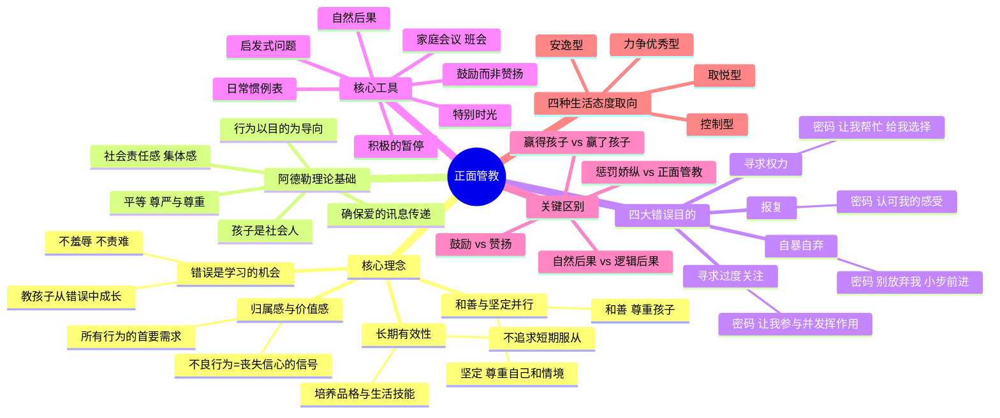
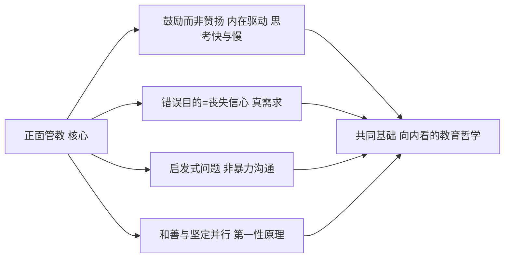

# 《正面管教》读书笔记

## 📚 基础信息
- **书名**: 正面管教（Positive Discipline）
- **作者**: 简·尼尔森（Jane Nelsen），教育学博士，美国"正面管教协会"创始人
- **出版社**: 北京联合出版公司 / 京华出版社（中译本）；Ballantine Books（原版）
- **出版年份**: 1981年（首版）/ 2016年（修订版中译本）
- **页数**: 约300页
- **开始阅读**: 未设置
- **完成阅读**: 未设置
- **阅读状态**: ☐ 正在阅读 ☐ 已完成 ☐ 暂停
- **个人评分**: ⭐⭐⭐⭐⭐
- **标签**: 正面管教, 家庭教育, 阿德勒心理学, 儿童心理, 亲子沟通, 和善与坚定

## 📖 内容概要

### 书籍简介
《正面管教》（Positive Discipline）是美国教育学博士简·尼尔森的经典之作，基于阿尔弗雷德·阿德勒的个体心理学理论，提出了一套**既不惩罚也不娇纵**的育儿体系——"和善与坚定并行"。自1981年首版以来，全球销量超600万册，被翻译成16种语言，被誉为管教孩子的"黄金准则"。

本书的核心洞察是：孩子的所有行为——包括不良行为——都是在追求**归属感**和**自我价值感**。一个行为不当的孩子，其实是一个丧失信心的孩子。因此，管教的目标不是控制行为，而是帮助孩子重建信心、培养品格。

### 核心主题
1. **和善与坚定并行** — 既尊重孩子，也尊重自己和情境
2. **归属感和价值感** — 孩子所有行为背后的首要心理需求
3. **错误是学习的机会** — 不因错误羞辱，而教孩子从错误中成长
4. **"赢得"孩子而非"赢了"孩子** — 从对抗转向合作
5. **长期有效性** — 培养自律、责任感、合作能力和解决问题的技能

### 主要章节
| 章节 | 标题 | 核心 |
|:--:|------|------|
| 1 | 正面的方法 | "和善与坚定并行"原则；七大感知力与技能 |
| 2 | 几个基本概念 | 阿德勒8个基本概念；"赢得"孩子而非"赢了"孩子 |
| 3 | 出生顺序的重要性 | 老大/老小/中间/独生子女差异与因序施教 |
| 4 | 重新看待不良行为 | 四大错误目的：寻求过度关注、权力、报复、自暴自弃 |
| 5 | 当心逻辑后果 | 自然后果 vs 逻辑后果；逻辑后果的四个R |
| 6 | 关注于解决问题 | 积极的"暂停"；启发式问题；3R1H |
| 7 | 有效地运用鼓励 | 鼓励与赞扬的区别；特别时光；着眼于优点 |
| 8 | 班会 | 围成圆圈、致谢、专注于解决方案 |
| 9 | 家庭会议 | 主席、秘书、致谢、议程、家庭娱乐 |
| 10 | 你的性格对孩子性格的影响 | 四种生活态度取向 |
| 11 | 综合应用 | 就寝、就餐、零花钱等实用策略 |
| 12 | 家里和教室里的爱与欢乐 | 赢得合作四步骤；无条件地爱 |

---

## 🧠 知识架构

---

## ✍️ 读书笔记

### 🔖 重点摘录

> "正面管教是一种既不惩罚也不娇纵的管教孩子的方法。孩子只有在一种和善而坚定的气氛中，才能培养出自律、责任感、合作以及自己解决问题的能力。"

> "一个行为不当的孩子，是一个丧失信心的孩子。"

> "孩子们需要鼓励，就像植物需要水。鼓励是教孩子相信他们自己有能力、有价值的过程。"

> "我们究竟从哪里得到这么一个荒诞的观念，认定若要让孩子做得更好，就得先让他感觉更糟？"

> "'赢了'孩子，使孩子成为失败者。而'赢得'孩子则意味着获得孩子心甘情愿的合作。"

---

### 📖 各章核心笔记

#### 第1章：正面的方法

介绍了正面管教的三大支柱：**和善与坚定并行**、**归属感与价值感**、**长期有效性**。

尼尔森定义了孩子需要的**七大感知力和技能**：
1. 对个人能力的感知力——"我能行"
2. 对自己在重要关系中的价值的感知力——"我有价值"
3. 对自己在生活中的力量或影响的感知力——"我能影响发生在我身上的事"
4. 内省能力——理解自己的情绪并做到自律
5. 人际沟通能力——与人合作、倾听、共情
6. 整体把握能力——对日常生活的限制和后果负有责任感
7. 判断能力——基于价值观做决策

**关键洞察**：惩罚在短期内"有效"——孩子确实停止了不良行为——但它付出的长期代价是这七大感知力和技能的丧失。从正面管教的视角看，惩罚的"有效"恰恰是它的危险所在：它让家长误以为问题解决了，而实际上孩子的内在建构正在被破坏。

---

#### 第2章：几个基本概念

基于阿德勒的个体心理学，尼尔森提出8个基本概念：

1. **孩子是社会人**：孩子的行为始终镶嵌在社会关系中，行为的意义来源于社交情境
2. **行为以目的为导向**：孩子做任何事都有目的——即使这个目的是无意识的
3. **首要目的是追求归属感和价值感**：这是所有人类行为的根本驱动力
4. **行为不当 = 丧失信心**：这是全书最核心的洞察
5. **社会责任感**：培养"我能为集体做什么"的意识
6. **平等**：尊严和尊重上的平等，不是"完全相同"
7. **犯错是学习的好时机**：当孩子犯错时，不是追问"谁干的？"而是问"我们能从中学到什么？"
8. **确保爱的讯息传递**：管教之后要确认孩子是否接收到"我仍然爱你"

**深度思考**：第4个概念——"行为不当 = 丧失信心"——是全书最有冲击力的洞察。它把"管教问题"从"如何纠正行为"转变为"如何重建信心"。这个转变不仅是方法论上的，更是底层逻辑上的：行为的根源不是"孩子变坏了"，而是"孩子觉得自己没有价值了"。

---

#### 第3章：出生顺序的重要性

不同的出生顺序会塑造不同的心理特征：
- **老大**：责任感强、完美主义、喜欢领导——但也容易成为"被颠覆者"
- **老小**：善于观察和模仿、有魅力——但也可能习惯被照顾
- **中间孩子**：更善于谈判和调解——但也可能感到被忽视
- **独生子女**：可能更早成熟——但也可能更依赖成人评价

**实践价值**：理解出生顺序不是为了给孩子贴标签，而是提醒家长：同一个家庭中，不同位置的孩子面对的心理环境截然不同，需要不同方式的连接。

---

#### 第4章：重新看待不良行为——四大错误目的

这是全书最实用的章节。每个"不良行为"背后都有一个密码：

| 错误目的 | 孩子的信念 | 成人感受 | 应对密码 |
|---------|----------|---------|---------|
| **寻求过度关注** | "只有被关注，我才有归属" | 心烦、恼怒 | "让我参与并发挥作用" |
| **寻求权力** | "只有我说了算，我才有归属" | 被挑战、被激怒 | "让我帮忙——给我选择" |
| **报复** | "我没有归属，所以以牙还牙" | 受伤、失望 | "认可我的感受" |
| **自暴自弃** | "我不行，别管我" | 无能为力 | "别放弃我——小步前进" |

**关键洞察（第四层）**：识别错误目的的关键不是孩子的行为，而是**成人的感受**。当孩子寻求过度关注时，你会感到心烦；当他寻求权力时，你会感到被挑衅。成人的情绪是第一手诊断工具——这是尼尔森极其巧妙的设计，因为它绕开了"客观分析孩子"的不可靠性。

**认知转变（第五层）**：我原本以为"管教"的核心是教会孩子什么是对的。尼尔森让我意识到：**管教的真正对象不是孩子的行为，而是孩子的信念。** 不良行为只是表象，底层信念（"我没有价值"）才是根源。只纠正行为而不重建信念，相当于只退烧不治病。

---

#### 第5-6章：从"逻辑后果"到"解决问题"

**自然后果 vs 逻辑后果：**
- **自然后果**：不穿外套就会冷，忘记带午餐就会饿。让现实本身成为老师。
- **逻辑后果**：人为设定的关联（如"不收拾玩具就不能看电视"）。容易滑向惩罚，必须满足四个R：**R**elated（相关）、**R**espectful（尊重）、**R**easonable（合理）、**R**evealed in advance（预先告知）。

**关键过渡**：尼尔森本人承认她早期过度强调逻辑后果，后来发现**关注于解决问题**比逻辑后果更有效。解决问题的3R1H：Related（相关）、Respectful（尊重）、Reasonable（合理）、Helpful（有帮助）。

**积极的"暂停"**：不是惩罚性的隔离，而是帮孩子布置一个能让他平复情绪的空间（冷静角），让孩子**主动选择**去暂停以恢复情绪控制。

---

#### 第7章：有效地运用鼓励

**鼓励 vs 赞扬（全书最重要的区分之一）：**

| | 鼓励 | 赞扬 |
|---|------|------|
| 指向 | 过程和努力（"你很努力"） | 结果和天赋（"你真聪明"） |
| 教给孩子的 | "我有能力"（内控） | "别人觉得我好"（外控） |
| 长期效果 | 自信、自立、内在驱动 | 依赖他人评价、害怕失败 |
| 对孩子来说 | 像水一样必需 | 像糖果——甜，但不能当饭吃 |

**特别时光**：每天（或每周）固定时间全身心陪伴孩子，不被手机、工作或家务打断。核心不是时间多长，而是**不可侵犯的规律性**——让孩子确信"这段时间，我是最重要的"。

---

#### 第8-9章：班会与家庭会议

**班会**和**家庭会议**是正面管教最深层的制度机制——把"管教"从家长对孩子的单向行为改造，转为**全家人共同解决问题的民主实践**。

核心步骤：
1. 围成圆圈（消除等级感）
2. 致谢环节（练习积极关注）
3. 议程讨论（提前收集议题）
4. 头脑风暴（寻找解决方案）
5. 家庭娱乐（会议以连接结束）

**深度思考（第四层——产生洞察）**：家庭会议表面上是"开会"，实则在训练孩子的五种核心能力：表达感受、倾听他人、解决冲突、承担责任、参与决策。这不是在管教孩子——这是在教孩子如何参与一个微型民主社会。

---

#### 第10章：四种生活态度取向

| 取向 | 优势 | 劣势 | 对孩子的影响 |
|------|------|------|------------|
| **安逸型** | 随和、避免冲突 | 可能过于纵容 | 孩子学会利用父母的"怕麻烦" |
| **控制型** | 组织力强、有秩序 | 可能过于严厉 | 孩子可能反抗或顺从过度 |
| **取悦型** | 友善、体贴 | 可能忽视自己的需求 | 孩子学会操纵或缺乏边界 |
| **力争优秀型** | 有追求、上进 | 可能对自己和孩子要求过高 | 孩子可能感到"永远不够好" |

**核心洞察**：你是什么类型的家长，决定了你会把孩子"塑造成"什么类型。这不是在选择教育方法——这是在进行自我认知。

---

### 💭 个人思考

1. **关于正面管教与中国文化的冲突**
   正面管教的核心理念（"和善与坚定并行""赢得孩子而非赢了孩子"）与中国传统的"棍棒底下出孝子""严师出高徒"有深层冲突。但书中来自阿德勒心理学的论据非常扎实：惩罚确实能换来短期服从，但长期代价是内在驱动的丧失——这正是中国教育中最常见的问题：孩子小时候"听话"，长大后"缺乏主动性"。

2. **关于"错误目的"理论对日常生活的穿透力**
   四大错误目的不仅能解释孩子的行为，也能解释成年人的人际冲突。同事的消极抵抗可能是"寻求权力"；伴侣的冷战可能是"报复"；自己的拖延可能是"自暴自弃"。尼尔森给了一个通用的人际理解框架，这远远超出了育儿范畴。

3. **关于"鼓励vs赞扬"在职场管理中的延伸**
   如果你理解了"鼓励指向努力和过程，赞扬指向结果和天赋"，就会发现大多数职场表扬其实是"赞扬"——"你做得真好""你很聪明"。这会让员工依赖外部认可。换成鼓励的语言："你在这个项目上的坚持很有价值""你在关键节点上的判断帮助了团队"——这才是培养自驱力的管理方式。

4. **联想到《中国式家长》游戏**
   游戏中的"父母满意度"系统完全是惩罚与奖励的混合体：满意了就奖励，不满意就施压。如果做一个"正面管教版"的育儿模拟游戏，核心机制应该是：识别孩子的错误目的 → 用鼓励而非奖惩回应 → 长期属性（自信、自律、合作能力）自然增长。这才是对"鸡娃最优解"的根本解构——不是压制功利化育儿，而是展示另一种逻辑的有效性。

---

### 🎯 实践应用

1. **建立"错误目的速查表"**：打印四大错误目的对照表贴在显眼处。当亲子冲突发生时，先觉察自己的情绪——这是最快的诊断线索。

2. **启动家庭会议制度**：每周日晚上15-20分钟，轮流担任主席和秘书，从致谢开始，到娱乐结束。

3. **用启发式问题替换命令**：
   - "快去做作业！" → "你的作业计划是什么？"
   - "不要打弟弟！" → "你觉得怎么和弟弟玩，他和你都会开心？"

4. **区分鼓励与赞扬**：接下来一周，每天至少用一次鼓励（指向努力和过程）替换赞扬（指向结果和天赋）。

---

## 🔗 相关扩展

### 相关书籍推荐
1. **《孩子：挑战》鲁道夫·德雷克斯** — 正面管教的理论前身，阿德勒心理学的育儿应用
2. **《如何说孩子才会听》法伯 & 玛兹丽施** — 亲子沟通技巧的实操宝典，与正面管教高度互补
3. **《P.E.T.父母效能训练》托马斯·戈登** — 另一套不惩罚的教育体系，可对比阅读
4. **《非暴力沟通》马歇尔·卢森堡** — NVC的"观察-感受-需要-请求"与正面管教的"启发式问题"有深层呼应
5. **《游戏力》劳伦斯·科恩** — 正面管教的"连接"理念在游戏中的应用

---

## 💭 深度衍生思考

### 🎯 核心观点延伸

1. **"赢得孩子而非赢了孩子"是冲突解决的通用原则**
   延伸观察：这句话不仅适用于亲子关系，也适用于亲密关系、团队管理和谈判。任何关系中，如果你追求"赢"，你就已经制造了一个"输家"——而输家不会心甘情愿地合作。正面管教的本质是：**把零和博弈的关系重构为共同解决问题的联盟。**

2. **鼓励经济学：为什么现代社会系统性缺乏鼓励**
   学校用分数、排名、升学来衡量学生；职场用KPI、晋升、薪资来衡量员工。现代社会是一台巨大的"赞扬机器"（外部评价），却系统性匮乏"鼓励"（内在肯定）。在这种环境下长大的孩子和成人，普遍缺乏自我价值感的独立来源。尼尔森的"鼓励vs赞扬"不只是一个育儿技巧，而是对这个评价过载时代的诊断。

---

### 🔍 多角度分析

1. **历史视角**：正面管教诞生于1981年，正是行为主义（斯金纳的奖惩训练）向认知革命过渡的时期。它承前启后：从行为主义拿了"后果"概念但改造为"自然后果"，从认知心理学拿了"信念"概念并应用于日常管教。

2. **跨领域视角（游戏设计）**：尼尔森的"错误目的"模型可以迁移到游戏玩家行为分析。玩家在游戏中的"不良行为"（挂机、故意送头、言语攻击）也可以用错误目的框架理解：寻求关注（"没人理我"）、寻求权力（"我要主导这场游戏"）、报复（"队友坑我所以我坑回去"）、自暴自弃（"我太菜了随便玩"）。游戏设计中的"正面管教"意味着：用信号系统代替惩罚系统，帮玩家重建信心。

3. **反向思考**：正面管教的潜在风险是——如果执行不准确，"和善"可能滑向娇纵，"坚定"可能滑向惩罚。尼尔森自己也承认"逻辑后果很容易变成惩罚"。这个体系的高门槛在于：它要求家长持续保持自我觉察，而这恰恰是睡眠不足、压力巨大的新手父母最稀缺的资源。

---

## 🔗 知识关联网络

### 与已读书籍的关联
- **《思考快与慢》**: 正面管教本质上是在训练家长用系统2（慢思考）来应对亲子冲突，而不是用系统1（"打/骂/吼"的自动化反应）。"积极的暂停"就是让系统2有时间启动 | 关联强度: ⭐⭐⭐⭐⭐
- **《非暴力沟通》**: NVC的四步（观察-感受-需要-请求）与正面管教的"启发式问题+鼓励"高度互补。NVC提供沟通框架，正面管教提供教育哲学 | 关联强度: ⭐⭐⭐⭐⭐
- **《真需求》**: "归属感与价值感"就是儿童最深层的真需求；惩罚之所以短期有效，是因为它满足了家长的"控制感"需求，却牺牲了孩子的"价值感"需求 | 关联强度: ⭐⭐⭐⭐
- **《第一性原理》**: 正面管教的第一性原理是"行为不当 = 丧失信心"，从这一条推导出全部方法体系。对比传统管教的第一性原理是"行为需要被纠正"，导致完全不同的问题定义和解决路径 | 关联强度: ⭐⭐⭐⭐

### 概念映射

---

## 📚 后续阅读路径规划

### 理论深化
- 《孩子：挑战》德雷克斯 → 《超越自卑》阿德勒 → 《个体心理学》系统学习

### 方法补充
- 《如何说孩子才会听》法伯 → 《P.E.T.父母效能训练》戈登 → 《游戏力》科恩

### 自我探索
- 《家庭的觉醒》萨巴瑞 → 《真希望我父母读过这本书》佩里 → 《看见孩子》肯尼迪

---

## 📊 学习总结

### 最大的收获
"一个行为不当的孩子，是一个丧失信心的孩子。" 这一句话重塑了我对"管教"的理解——管教的起点不是"如何纠正"，而是"孩子到底在追求什么？他失去了什么？"

### 改变的观念
- **旧观念**: 管教就是让孩子停止不良行为
- **新观念**: 管教是帮孩子重建归属感和价值感，不良行为会自然消退

### 未来行动
- 在亲子冲突时，先觉察自我情绪，识别孩子的错误目的
- 用启发式问题代替命令，用鼓励代替赞扬
- 在团队管理中将"错误目的"框架应用于分析成年人的行为动机
- 如果在游戏设计中涉及育儿或人际关系模拟，把正面管教的核心机制（错误目的识别→鼓励回应→长期品格增长）融入系统设计

---

**笔记创建时间**: 2026-07-10
**最后更新**: 2026-07-10
**笔记版本**: v1.0

## 参考来源
- 百度百科：https://baike.baidu.com/item/正面管教/1272338
- 微信读书：https://weread.qq.com/web/bookDetail/3af32bc0811e77720g019679
- 正面管教协会官网：https://www.positivediscipline.com/
