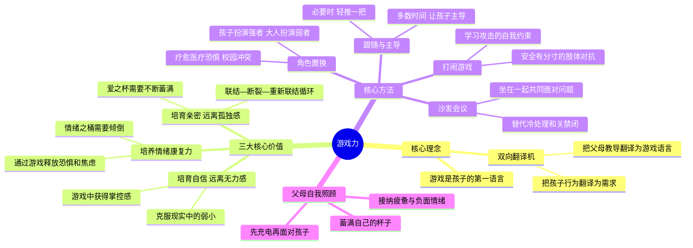

# 《游戏力》读书笔记

## 📚 基础信息
- **书名**: 游戏力：笑声，激活孩子天性中的合作与勇气
- **原名**: Playful Parenting
- **作者**: [美] 劳伦斯·科恩（Lawrence J. Cohen），临床心理学家、杜克大学心理学博士
- **译者**: 李岩
- **出版社**: 中信出版集团 / 中国人口出版社
- **出版年份**: 2001年（原版）/ 2018年（中译本十周年版）
- **页数**: 约320页
- **开始阅读**: 未设置
- **完成阅读**: 未设置
- **阅读状态**: ☐ 正在阅读 ☐ 已完成 ☐ 暂停
- **个人评分**: ⭐⭐⭐⭐⭐
- **标签**: 游戏教育, 亲子联结, 情绪疗愈, 打闹游戏, 角色置换, 心理韧性

## 📖 内容概要

### 书籍简介
《游戏力》（Playful Parenting）是美国国家亲子出版奖金奖作品，被翻译成14种语言。作者劳伦斯·科恩博士的核心理念是：**游戏是孩子的第一语言。** 要想和孩子有效沟通，不能用成人的语言说教，而要用孩子的语言——游戏——来"翻译"。

全书核心比喻：
- **"爱之杯"**：孩子内心对爱和关注的需求就像一个杯子，需要不断被蓄满。不良行为=杯子空了的信号。
- **"情绪之桶"**：积累的痛苦情绪需要定期倾倒。哭闹发脾气=在倾倒情绪之桶。
- **"双向翻译机"**：父母需要把孩子的行为翻译为需求，同时把自己的教导翻译为游戏语言。

### 核心主题
1. **联结—断裂—重新联结** — 亲子关系的核心循环
2. **游戏即沟通** — 用孩子的语言（游戏）代替成人的语言（说教）
3. **笑声的力量** — 大笑是最快捷的联结方式，也是最强效的情绪释放
4. **角色置换疗愈创伤** — 让孩子在游戏中扮演强者，获得力量感
5. **轻推而非硬推** — 在安全和挑战之间的微妙平衡点

### 主要章节
| 章节 | 主题 | 核心方法 |
|------|------|---------|
| 第1-2章 | 游戏力的价值与加入孩子 | 放下身段，调到同一频道 |
| 第3章 | 建立联结 | "爱之杯"隐喻；镜像游戏 |
| 第4-5章 | 培养自信与笑声 | 力量感vs无力感；装傻的力量 |
| 第6章 | 学会打闹 | 打闹游戏的安全规则 |
| 第7章 | 角色置换 | 让孩子扮演强者疗愈恐惧 |
| 第8-10章 | 跟随与主导 | "轻推"的艺术 |
| 第11-13章 | 情绪暴风雨与规则 | "沙发会议"替代冷处理 |
| 第14-15章 | 手足之争与父母充电 | 蓄满自己的杯子 |

---

## 🧠 知识架构

---

## ✍️ 读书笔记

### 🔖 重点摘录

> "游戏是孩子认识世界的方式，也是他们与人建立关系的方式。要进入孩子的世界，游戏是你唯一的通行证。"

> "孩子的不良行为，不是坏心肠的表现，而是内心'爱之杯'空了或者'情绪之桶'满了的信号。"

> "说教和惩罚为什么经常失效？因为孩子只能听到成人的语言，而成人的语言不是他们的母语。游戏的'翻译机'，是亲子之间最重要的沟通工具。"

> "笑声是建立联结的最快方法。当你和孩子一起笑的时候，你们之间就没有距离了。"

---

### 📖 各章核心笔记

#### 三大核心比喻（全书的逻辑基础）

**1. "爱之杯"**：每个孩子心中都有一个需要被爱、关注和联结填满的杯子。当杯子蓄满时，孩子合作、快乐、有创造力。当杯子空了，孩子通过"不良行为"发出信号——"我需要被蓄杯"。

**2. "情绪之桶"**：孩子（以及成人）内心积累的痛苦情绪——恐惧、悲伤、愤怒、挫折——像一个需要定期清理的桶。哭闹、发脾气、过度活跃，都是在倾倒情绪之桶。如果桶溢出来了，孩子会失控。

**3. "双向翻译机"**：父母需要做两件事——把孩子的"不良行为"翻译成"我杯子空了/桶满了"，同时把自己的教导（"你应该……"）翻译成游戏语言（"我们来玩一个游戏……"）。

**设计洞察**：这三个比喻极其精巧。它们给了父母一套快速诊断框架——当孩子行为出问题时，不需要复杂的心理分析，只需问"杯子空了还是桶满了？"然后决定"蓄杯还是倒桶？"

---

#### 打闹游戏（第6章）

科恩给出安全打闹的具体规则：安全第一、大人全程参与、有分寸。打闹不是放任暴力，而是一种**有规则的攻击性表达**。孩子在打闹游戏中学到的不是"打架是可以的"，而是"我可以在力量充沛时控制自己，不伤害别人"。

**跨领域联想**：这和游戏设计中的"安全空间"理论一致——玩家在虚拟世界中的打斗不是在练习暴力，而是在一个安全的结构中体验掌控感和释放压力。打闹游戏本质上是**物理世界的游戏化教育**。

---

#### 角色置换（第7章）——全书最具治疗价值的方法

**核心机制**：孩子在现实中最无力、最恐惧的情境（打针、被老师批评、被大孩子欺负），在游戏中可以角色互换——让孩子扮演医生、老师或大哥姐，成人扮演受害者。当孩子在安全游戏中重新经历并掌控了恐惧情境，现实中的恐惧就被消解了。

**为什么这有效？** 因为这让孩子从"被动受害者"转为"主动掌控者"——这正是创伤疗愈的基本原理。孩子在游戏中不是逃避恐惧，而是**在安全距离上重新面对并消化恐惧**。

---

#### "沙发会议"替代冷处理（第13章）——与"积极的暂停"的对话

《正面管教》提出"积极的暂停"——让孩子去冷静角。《游戏力》提出"沙发会议"——不是让孩子一个人冷静，而是**和孩子坐在一起共同面对问题**。科恩认为冷处理（timeout）本质上是"撤走联结作为惩罚"，这对孩子的核心伤害是"你的感受太难搞了，所以我走了"。

**对比思考**：两本书提出了两种路径——"暂停但保持欢迎"（正面管教）vs"不离开但一起坐下来"（游戏力）。两者都比传统惩罚好得多，区别在于孩子的气质类型：有些孩子需要独处平复，有些孩子独处只会更恐慌。家长需要根据孩子的情况灵活使用。

---

### 💭 个人思考

1. **"游戏是孩子的第一语言"——这句话的深度远不止表面**
   这本书和《如何说孩子才会听》在读法上恰好互补。法伯教家长"怎么说"，科恩教家长"玩什么"。但如果深挖一层，两者的本质其实是一致的——都在讲"用对方能接受的语言来表达"。法伯的"描述问题而非命令"和科恩的"玩给他看而非说给他听"，都是"去权力化的沟通"。

2. **游戏力对父亲的特殊价值**
   很多父亲不擅长"温柔地说话"（这是社会化的结果），但擅长"一起玩"。科恩的方法给父亲提供了一条不违背真实性格的育儿路径——不需要变成温柔妈妈，只需要变成一个会玩的大孩子。这在性别角色固化的文化环境中尤其有价值。

3. **游戏力与中国式家长的冲突**
   中国家长习惯的沟通模式是"上级对下级"——命令、指导、评价。游戏力的核心是"从平等位置出发"——你需要蹲下来，不仅物理上蹲，心理上也蹲。这意味着放弃家长权威带来的控制便利，换取真正的联结。这是最难的，也是最有价值的。

---

### 🎯 实践应用
1. **每天10分钟"特别游戏时间"**：让孩子完全主导，你只说"好啊"。这是最低成本的"蓄杯"。
2. **当冲突发生时先"翻译"**：孩子打人→"他的爱之杯空了"；孩子崩溃大哭→"他的情绪之桶满了"。先翻译再回应。
3. **用"打闹游戏"替代说教**：孩子有攻击行为时，不要讲道理，直接提议"我们来枕头大战，但规则是不能打脸"。

---

## 🔗 知识关联网络

### 与已读书籍的关联
- **《如何说孩子才会听》**: 法伯教语言技巧，科恩教游戏翻译，互补关系 | 关联强度: ⭐⭐⭐⭐⭐
- **《正面管教》**: 正面管教的"赢得孩子"与游戏力的"联结"异曲同工；"沙发会议"vs"积极的暂停"是两种不同路径 | 关联强度: ⭐⭐⭐⭐⭐
- **《真希望我父母读过这本书》**: 都强调"关系优先于技巧"，游戏是建立关系的最有效途径 | 关联强度: ⭐⭐⭐⭐

---

## 📊 学习总结
### 最大的收获
育儿最被低估的工具不是任何话术，而是**一起玩的天赋**——笑声本身就是最有效的教育和疗愈。
### 改变的观念
- **旧观念**: 玩是学习之余的奖励
- **新观念**: 玩本身就是最核心的学习方式和沟通方式

---

**笔记创建时间**: 2026-07-10
**笔记版本**: v1.0

## 参考来源
- 豆瓣读书：https://book.douban.com/subject/35879908/
- 得到听书解读
- Lawrence Cohen著作及相关访谈
