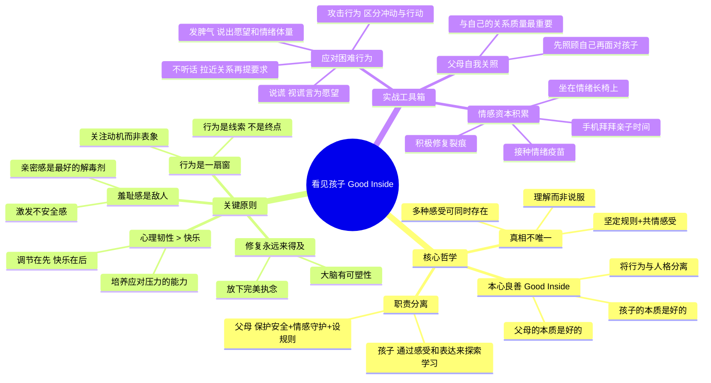

# 《看见孩子》读书笔记

## 📚 基础信息
- **书名**: 看见孩子（Good Inside）
- **原名**: Good Inside: A Guide to Becoming the Parent You Want to Be
- **作者**: [美] 贝姬·肯尼迪博士（Dr. Becky Kennedy），哥伦比亚大学临床心理学博士
- **出版社**: 中信出版社（中译本）
- **出版年份**: 2022年（原版）/ 2023年6月（中译本）
- **页数**: 378页
- **开始阅读**: 未设置
- **完成阅读**: 未设置
- **阅读状态**: ☐ 正在阅读 ☐ 已完成 ☐ 暂停
- **个人评分**: ⭐⭐⭐⭐⭐
- **标签**: 育儿准则, 亲子关系, 羞耻感, 心理韧性, 情绪调节, 行为理解

## 📖 内容概要

### 书籍简介
《看见孩子》2022年《纽约时报》畅销书No.1，长期位居美亚家教类图书榜首。作者贝姬·肯尼迪博士被《时代》周刊誉为"千禧时代父母的教养教练"。全书包含**10大育儿准则 + 40+案例 + 19个教养难题**的解决方案。

书名"Good Inside"直译为"内在善的"——贝姬的核心出发点是：**父母和孩子的本心都是好的。** 每个"坏行为"背后，都有一个遇到困难、渴望帮助的"好孩子"。传统行为主义管教（奖惩、关禁闭）混淆了"噪声"（行为）和"信号"（孩子真正在经历什么），往往以牺牲亲子关系为代价换取了表面的服从。

### 核心主题
1. **Good Inside（本心良善）** — 孩子和父母的本质都是好的，行为只是信号
2. **真相不唯一** — 多种现实和感受可以同时存在，不需要在"你对还是我对"之间二选一
3. **心理韧性 > 快乐** — 培养应对压力的能力比追求短暂快乐更重要
4. **羞耻感是敌人** — 羞耻感激发不安全感，亲密感是羞耻的解毒剂
5. **修复永远来得及** — 大脑有可塑性，放下追求完美的执念

### 10大育儿准则
| 准则 | 核心要点 |
|------|---------|
| 1. 善意养育 | 将孩子与问题分开；打破代际循环 |
| 2. 真相不唯一 | 多种现实和感受可同时存在；理解而非说服 |
| 3. 明确职责 | 父母=安全守护者+情感守护者；孩子=通过感受和表达来探索学习 |
| 4. 早期至关重要 | 早期互动塑造依恋模式；依赖越安全，孩子越独立 |
| 5. 永远都不晚 | 大脑可塑性；修复的力量大于完美 |
| 6. 韧性 > 快乐 | 调节在先，快乐在后 |
| 7. 行为是一扇窗 | 行为只是线索，背后的动机更值得关注 |
| 8. 减少羞耻感 | 亲密感是羞耻的解毒剂 |
| 9. 说真话 | 肯定孩子的感受，陪伴面对真相 |
| 10. 自我关照 | 与自己的关系质量决定与他人的关系质量 |

---

## 🧠 知识架构

---

## ✍️ 读书笔记

### 🔖 重点摘录

> "每个'坏行为'背后，都有一个遇到困难、渴望帮助的'好孩子'。"

> "真相不唯一。你可以既坚定地执行规则，又温柔地接纳孩子的感受。这两件事不矛盾。"

> "心理韧性比快乐更重要——因为一个能应对压力的人自然会找到快乐，而一个只会追求快乐的人在压力面前会崩溃。"

> "羞耻感让孩子觉得自己本身是坏的，而不是行为需要改变。亲密感——'即使你这样做了，我依然爱你'——是羞耻感唯一的解药。"

---

### 📖 核心理念深度解读

#### "真相不唯一"——全书最具原创性的概念

这是贝姬对育儿哲学最独特的贡献。大多数育儿理念在"坚定"和"温柔"之间要求"平衡"或"折中"。贝姬说：**不需要平衡。这两件事可以同时100%为真。** 

举例：孩子在超市哭闹要买糖果。
- 传统思路：要么买（纵容），要么不买+吼（严厉），要么"好吧但你要答应我……"（讨价还价）
- 贝姬的思路："我知道你真的很想要这个糖果，不能买让你很难过。我听到了。但我不会买。我会在这里陪着你。"

这就是"真相不唯一"：**"你想要糖果"是真的，"我不买"也是真的。** 两者不需要打架。孩子需要的是一个既能容纳他的失望、又能维护规则的成人——这就是"情感守护者"的含义。

**深层设计思维**：这个概念打破了"零和博弈"的认知框架。在之前分析的《中国式家长》中，"孩子想玩"和"家长想学"被设计成零和冲突。但如果借鉴贝姬的框架重新设计系统，可以创造第三种状态——"我理解你想玩（共情）"和"你现在需要完成学习任务（规则）"可以同时成立。

---

#### "羞耻感是敌人"——与《正面管教》的深层对话

《正面管教》讲"行为不当=丧失信心"，贝姬更进一步：**行为不当的根源往往是羞耻感——孩子觉得自己本身就是坏的。**

关键区分：
- 内疚："我做了一件坏事"（行为有问题）→ 健康的，促进改正
- 羞耻："我是一个坏孩子"（人格有问题）→ 有毒的，导致退缩或逆反

当父母说"你怎么这么不懂事！"时，引发的是羞耻，不是内疚。而亲密感——"即使你做了这件事，我依然爱你，我们来想想怎么弥补"——是把羞耻转化为内疚的关键。

**跨领域洞察**：这个区分在职场管理中也完全适用。对员工说"这个决策有问题"（内疚）和"你怎么这么不靠谱"（羞耻），效果天差地别。

---

#### "心理韧性 > 快乐"——对"快乐童年"迷思的挑战

很多父母追求"让孩子快乐"，但贝姬指出：**追求快乐是错误的目标。** 正确的目标是心理韧性——应对压力的能力。

逻辑链：
- 如果目标是"让孩子快乐"，你会回避一切让孩子难过的事
- 但生活不可避免地包含难过的事
- 不快乐时，一个只有"快乐技能"的孩子会崩溃
- 而一个有"应对不快乐的技能"的孩子会渡过难关——然后重新找回快乐

所以："调节在先，快乐在后"——先教孩子如何应对难过，快乐会自然发生。

**关联到《真希望我父母读过这本书》**：佩里的"情绪调音台"理论（不能选择性调低一种情绪）与此完全一致。禁止悲伤就是禁止全部感受，包括快乐。

---

### 💭 个人思考

1. **"Good Inside"是中国育儿文化中最缺的一块基石**
   中国传统育儿文化中，孩子行为的默认解读框架是"孩子不懂事、需要被管教"。贝姬的框架是"孩子本质是好的，行为是信号"。这是两套完全不同的操作系统。前者把父母放在"纠正者"的位置上，后者把父母放在"解码者"的位置上。

2. **"真相不唯一"对非黑即白思维的解构**
   中国文化中很多亲子冲突来自"要么听你的，要么听我的"的二元框架。贝姬的"真相不唯一"给了第三条路——"你的感受是真的，我的规则也是真的"——这不仅是育儿技巧，是一种世界观。

3. **本书在育儿书序列中的独特位置**
   如果前面读的正面管教是做"正确的事"，如何说是"正确地说话"，游戏力是"用玩的方式说"，真希望是"修好说错的话"——那么看见孩子做的是**"先确认你是好的，然后我们再说怎么做"**。它是所有技术的基础层：先重建孩子的自我价值，技术才有用。

---

### 🎯 实践应用
1. **当孩子行为出问题时，先说"你是一个好孩子，只是遇到了困难"**——这句话本身就是在重建安全感
2. **练习"真相不唯一"句式**："我知道你不想……，同时我们需要……"
3. **区分羞耻和内疚**：批评行为，不批判人格

---

## 🔗 知识关联网络

### 与已读书籍的关联
- **《正面管教》**: "行为不当=丧失信心"与"Good Inside"一脉相承；"鼓励vs赞扬"与"减少羞耻"互补 | 关联强度: ⭐⭐⭐⭐⭐
- **《真希望我父母读过这本书》**: 都强调"修复比完美重要"；"真相不唯一"呼应佩里的"包容感受" | 关联强度: ⭐⭐⭐⭐⭐
- **《如何说孩子才会听》**: "说出感受"是实现"真相不唯一"的语言工具 | 关联强度: ⭐⭐⭐⭐
- **《非暴力沟通》**: NVC的"观察而非评判"就是"将行为与人格分离" | 关联强度: ⭐⭐⭐⭐

---

## 📊 学习总结
### 最大的收获
看见孩子=透过行为看到孩子的"好"，同时相信自己的"好"。当双方的"好"都被确认，改变自然发生。
### 改变的观念
- **旧观念**: 育儿=纠正不良行为
- **新观念**: 育儿=解码行为信号，重建安全联结，让孩子的好自然展现

---

**笔记创建时间**: 2026-07-10
**笔记版本**: v1.0

## 参考来源
- 豆瓣读书：https://book.douban.com/subject/36427596/
- 《时代》周刊对Dr. Becky的报道
- Good Inside官方资源：https://www.goodinside.com/
