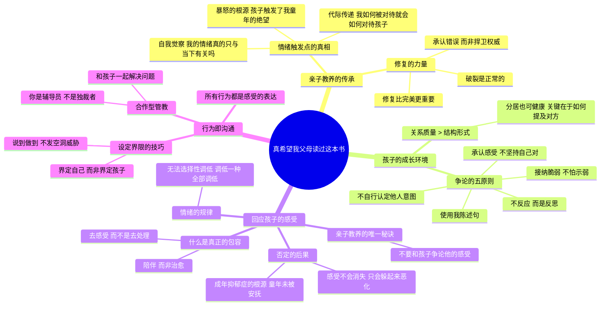

# 《真希望我父母读过这本书》读书笔记

## 📚 基础信息
- **书名**: 真希望我父母读过这本书
- **原名**: The Book You Wish Your Parents Had Read (and Your Children Will Be Glad That You Did)
- **作者**: [英] 菲利帕·佩里（Philippa Perry），资深心理治疗师、专栏作家、BBC纪录片制作人
- **出版社**: 中信出版集团
- **出版年份**: 2020年7月（中译本）
- **页数**: 约304页
- **开始阅读**: 未设置
- **完成阅读**: 未设置
- **阅读状态**: ☐ 正在阅读 ☐ 已完成 ☐ 暂停
- **个人评分**: ⭐⭐⭐⭐⭐
- **标签**: 亲子关系, 代际创伤, 情绪修复, 依恋理论, 原生家庭, 心理治疗

## 📖 内容概要

### 书籍简介
这是一本关于"关系"的书——你与孩子的关系、与自身的关系、与过去的关系、与周围世界的关系。作者菲利帕·佩里是从业20年的心理治疗师，她将临床经验浓缩成一个核心论断：**亲子教养的核心，在于你和孩子之间的关系。** 如果把孩子比作植物，关系就是土壤——支持和滋养着孩子。

全书最颠覆的洞察是：**育儿中真正伤害孩子的，不是一个错误本身，而是犯错后拒绝承认和修复的"权威姿态"。** 破裂是正常的，修复比完美更重要。

### 核心主题
1. **代际传承** — 我们对孩子的反应深受自身童年经历的影响
2. **关系的修复力** — 破裂不可怕，不修复才可怕
3. **感受的正当性** — 不要和孩子争论他的感受，所有感受都需要被接纳
4. **行为即沟通** — 孩子的每一个"问题行为"都在传递信息
5. **父母真实性** — 孩子需要的是真实可信的父母，而非十全十美的父母

### 主要章节
| 章节 | 主题 | 核心命题 |
|------|------|---------|
| 第1章 | 亲子教养的传承 | 你的情绪按钮连着童年的伤口 |
| 第2章 | 孩子的成长环境 | 家人之间如何相处，比家庭结构更重要 |
| 第3章 | 回应孩子的感受 | 不要和孩子争论他的感受——这是亲子教养唯一的秘诀 |
| 第4章 | 最初的孕育 | 从怀孕开始建立亲子关系 |
| 第5章 | 培养心理健康的孩子 | 获得回应是孩子的需要，不是渴望 |
| 第6章 | 所有的行为都是沟通 | 在行为背后，你会发现感受 |

---

## 🧠 知识架构

---

## ✍️ 读书笔记

### 🔖 重点摘录

> "亲子教养的核心，在于你和孩子之间的关系。如果把人比作植物，关系就是土壤。关系支持和滋养着孩子，让孩子得以成长。"

> "如果亲子教养真的有秘诀可言，那就是这一个：不要和孩子争论他的感受。"

> "感受遭到否定时并不会消失，它们只是躲起来继续恶化，未来再冒出来制造麻烦。"

> "你无法淡化悲伤和痛苦，并强化幸福和快乐。你只要把一种情绪调低，所有的情绪都会一并调低。"

> "孩子需要的是父母真实可信，而不是十全十美。"

> "重点不在于关系破裂，而是要加以修复。"

> "躲藏起来是一种乐趣，但没人发现自己时却是一种灾难。"

---

### 📖 各章核心笔记

#### 第1章：亲子教养的传承——你的过去正在养育你的孩子

**核心机制**：当孩子到达你自己童年受伤的那个年龄时，你的"情绪按钮"会被触发。你对孩子的暴怒，往往不是对孩子的暴怒，而是对你童年中类似情境的绝望的防御。

**关键练习**：当你的情绪被孩子触发时，自问——"我的反应真的只与当下这件事有关吗？我像他这么大的时候，发生过什么？"

**修复的力量（全书最重要的工具）**：
破裂—修复—重建联结，这个循环是健康亲子关系的日常节奏。完美的关系不是从不破裂，而是每次破裂后都能修复。修复的步骤：
1. 冷静下来
2. 承认自己的错误（不找借口，不推卸责任）
3. 表达歉意
4. 确认孩子的感受（"我刚才大吼让你感到害怕了，对吗？"）
5. 重新联结

**深层洞察**：许多父母不敢修复，因为修复需要承认"我做错了"——这触发了"我是一个坏父母"的羞耻感。佩里指出：**正是拒绝修复的姿态，才真正造成伤害。** 修复不是在展示软弱，而是在展示勇气和爱。

---

#### 第2章：孩子的成长环境——关系质量是关键

**核心命题**：家庭结构（双亲、单亲、重组家庭）对孩子的影响远小于**家人之间如何相处**。

**争论的五个原则**（同样适用于夫妻关系）：
1. 承认自己的感受，也考虑对方的感受——**不要坚持自己是对的**
2. 使用"我陈述句"而非"你陈述句"——"你刷手机不回我话，我觉得很受伤"vs"你总是不理我"
3. 不要反应，而是**反思**——在开口之前停顿
4. 接纳你的脆弱，**不害怕示弱**
5. 不要自行认定他人的意图——你无法读心

**跨领域洞察**：这五条原则完全适用于任何亲密关系和团队沟通。它不是育儿技巧，而是**人类高质量关系的通用原则**。

---

#### 第3章：回应孩子的感受——全书最核心的章节

**"不要和孩子争论他的感受"——为什么？**

当一个孩子说"我讨厌弟弟"时，最常见的回应是"别这样说，他是你的弟弟啊，你应该爱他"。佩里指出这背后的逻辑是：**成人害怕孩子的感受，所以试图用否定来让感受消失。** 但感受不会消失——它们只是躲起来，在潜意识里继续发酵。

**关键区分**："包容感受"不是"认同感受导致的行为"。
- 包容感受："你看起来很生气，我猜被推倒一定很难受。"
- 纵容行为：允许孩子因为生气而打人。

感受永远需要被接纳；行为可以也需要有边界。

**情绪的规律——"调音台"隐喻（第五层洞察）**：
> "你无法淡化悲伤和痛苦，并强化幸福和快乐。你只要把一种情绪调低，所有的情绪都会一并调低。"

这意味着那些"只要孩子开心就好"的育儿理念在底层逻辑上是错误的。你无法只允许快乐而禁止悲伤——关闭一种感受的通道，就是关闭所有感受的通道。一个不允许自己悲伤的孩子，也永远不会真正地快乐。

**关联到《正面管教》**：尼尔森教我们"识别错误目的"，佩里教我们"接纳情绪作为识别的前提"。两本书在一起才是完整的：先接纳感受（佩里），再引导行为（尼尔森）。

---

#### 第4-5章：从孕育到健康的心理基础

**关键理念**：
- 亲子关系从怀孕时期就开始了。把胎儿当成一个"人"而不是一件"事情"来对待。
- **获得回应是婴幼儿的需要，不是渴望。** 如果我们不回应，孩子可能形成不安全型依附关系。
- **你不可能因为敏锐回应婴幼儿而"宠坏"孩子。** 投入的关注越多，未来需要弥补的裂痕越少。
- **"温情轰炸"**：安排一段由孩子完全主导的一对一时间，全身心投入。
- 让孩子按自己的步调与你分开——**帮孩子独立 ≠ 疏远孩子**。

---

#### 第6章：所有的行为都是沟通

**核心金句**：**"所有的行为都是沟通，所以在行为的背后，你会发现感受。"**

**合作型管教 vs 专制型管教**：
- 专制型：你是独裁者，孩子是服从者
- 合作型：你是辅导员，你们一起思考怎么解决问题

**设定的界限时**：**"界定自己，而不是界定孩子"**
- "我不能让你玩我的钥匙"（界定自己的边界）vs"你不能碰我的钥匙"（界定孩子能做什么）
- 前者的潜台词是每个人都有权设定边界，后者是"我有权命令你"

**关于说谎**：孩子撒谎往往是因为成年人无法冷静看待真相。包容孩子的感受，不要对真相反应过度，才能维持沟通渠道畅通。

---

### 💭 个人思考

1. **"修复而非完美"是最高级的育儿哲学**
   这可能是本书对之前读的所有育儿书最重要的补充。正面管教教我们"和善与坚定"，如何说教我们"描述而非命令"，但这本书提醒我们：**你不可能永远做到这些。** 当你情绪崩溃吼了孩子之后，最关键的下一步不是"我真是个糟糕的父母"的自我鞭笞，而是修复——坐下来、承认错误、道歉、重新联结。修复的能力比完美执行的能力重要一万倍。

2. **"不要和孩子争论感受"的深层含义**
   争论感受的本质是：用成人的权威来否定儿童的内在体验。这在亲子关系中制造了一种根深蒂固的权力不对等——"我的感受比你的感受更有效"。长期来看，这教给孩子的是"你的感受不重要"和"不要相信自己的感受"——这两条信念是许多成年人心理健康问题的源头。

3. **"情绪调音台"隐喻与游戏设计的关联**
   如果情绪不能选择性调低，这影响的不只是育儿，也影响游戏设计。很多游戏试图只给玩家"爽感"而不给挫折感，但根据佩里的理论，一个调低了所有负面情绪的人，正面情绪也会被一起调低。好的游戏体验不是没有挫败，而是挫败后有一个"修复"的出口——就像好的亲子关系不是没有破裂，而是破裂后有修复。

4. **与中国式育儿传统的对照**
   中国传统育儿中大量使用否定感受的策略："别哭了""这有什么好怕的""不许生气了"。这些在文化中如此自然，以至于我们意识不到它是一个选择——而且是一个有代价的选择。本书让我们看到：这些不是"文化传统"，而是"可以被审视的教育决策"。

---

### 🎯 实践应用

1. **当情绪被触发时，启动"童年回溯"自问**：每次对孩子产生超出情境的强烈情绪时，花30秒问自己："我像他这么大的时候，有没有类似的经历？我的父母是怎么回应的？"

2. **建立"修复仪式"**：每次亲子冲突后，在平静下来的时候做三件事——说"对不起"、确认孩子的感受、重新做一件联结的小事（拥抱、击掌、说个笑话）。

3. **练习"包容感受"而非"解决问题"**：当孩子哭闹时，先不用找原因或给方案，只需坐在旁边说："我知道你很伤心，我会在这里陪你。"

---

## 🔗 知识关联网络

### 与已读书籍的关联
- **《非暴力沟通》**: 佩里的"我陈述句"和"包容感受"与NVC的"观察-感受-需要-请求"结构高度一致 | 关联强度: ⭐⭐⭐⭐⭐
- **《正面管教》**: 正面管教讲"行为不当=丧失信心"，本书讲"行为背后是感受"，两本书从不同角度切入同一个核心——看穿行为的表层 | 关联强度: ⭐⭐⭐⭐⭐
- **《如何说孩子才会听》**: "不要否定感受"是两本书共同的起点，佩里更偏为什么（心理机制），法伯更偏怎么做（具体技巧） | 关联强度: ⭐⭐⭐⭐⭐
- **《捕捉儿童敏感期》**: 敏感期理论讲"行为背后是发展需求"，佩里讲"行为背后是感受和沟通"，两者互补 | 关联强度: ⭐⭐⭐⭐

---

## 📚 后续阅读路径规划

- 《看见孩子》肯尼迪 → 《家庭的觉醒》萨巴瑞 → 深化"关系优先"的育儿哲学
- 《依恋》鲍尔比 → 《情感依附》 → 从依恋理论源头理解亲子关系的形成

---

## 📊 学习总结

### 最大的收获
**亲子关系中最要紧的能力不是"不犯错"，而是"犯错后能修复"。** 修复不是示弱，是示范——你在向孩子示范如何面对自己的不完美。

### 改变的观念
- **旧观念**: 好父母=永远正确、永远耐心、永远不吼孩子
- **新观念**: 好父母=真实的父母。真实意味着会犯错、会疲惫、会失控——但也会道歉、会修复、会重新联结

---

**笔记创建时间**: 2026-07-10
**最后更新**: 2026-07-10
**笔记版本**: v1.0

## 参考来源
- 豆瓣读书：https://book.douban.com/subject/35173329/
- 微信读书：https://read.douban.com/ebook/157209563/
- Philippa Perry个人官网相关内容
