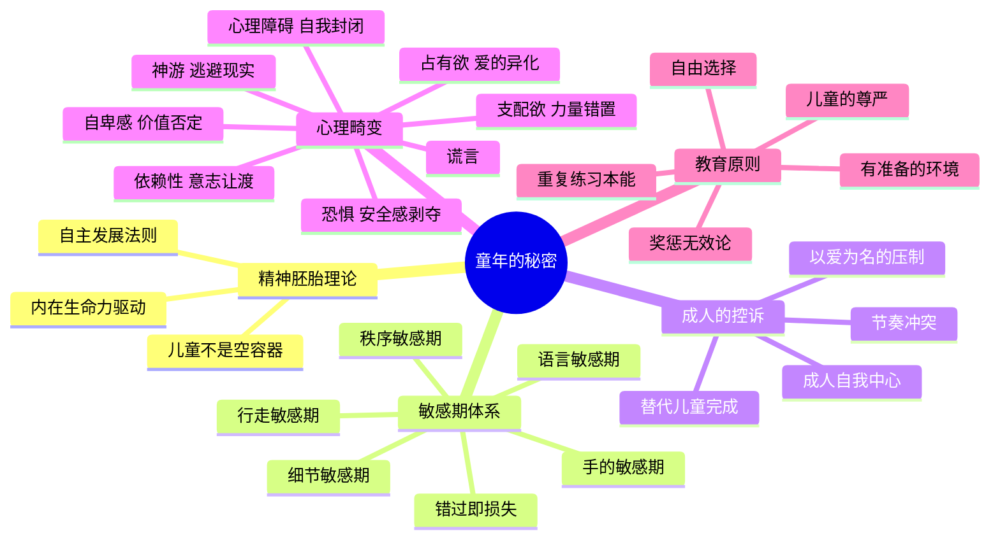

# 《童年的秘密》读书笔记

## 📚 基础信息
- **书名**: 童年的秘密
- **原名**: The Secret of Childhood
- **作者**: [意] 玛丽亚·蒙台梭利（Maria Montessori, 1870-1952），意大利首位女医学博士、幼儿教育家
- **出版社**: 中国发展出版社 / 人民教育出版社
- **出版年份**: 1936年（原版）
- **页数**: 约250页
- **开始阅读**: 未设置
- **完成阅读**: 未设置
- **阅读状态**: ☐ 正在阅读 ☐ 已完成 ☐ 暂停
- **个人评分**: ⭐⭐⭐⭐⭐
- **标签**: 蒙台梭利, 敏感期, 幼儿教育, 精神胚胎, 教育经典, 儿童发展

## 📖 内容概要

### 书籍简介
《童年的秘密》是蒙台梭利教育法的理论奠基之作，1936年首次出版，被誉为"二十世纪最伟大的教育著作之一"。全书共30章，分为三大部分。

蒙台梭利在这本书中做出了一个革命性的论断：**儿童不是等待成人填充的空容器，而是携带内在发展蓝图的独立精神生命。** 成人最重要的工作不是"教"，而是清除阻碍儿童自然发展的障碍——而最大的障碍往往是成人自己。

### 核心主题
1. **精神胚胎** — 儿童拥有内在的发展驱力和自然法则
2. **敏感期** — 特定年龄对特定刺激的特殊敏感性，一旦错过难以弥补
3. **成人的控诉** — 成人以"爱"的名义压制了儿童的自然发展
4. **心理畸变** — 敏感期受阻导致的心理偏差及其后果
5. **教育即解放** — 教育的任务是清除障碍，而非灌输知识

### 主要章节
| 部分 | 章节 | 核心命题 |
|------|------|---------|
| 第一部分 | 第1-17章 | 精神的胚胎：敏感期、秩序感、智力发展 |
| 第二部分 | 第18-24章 | 新教育的方法：教师的使命、心理畸变 |
| 第三部分 | 第25-30章 | 儿童与社会：成人与儿童的冲突、儿童的权利 |

---

## 🧠 知识架构

---

## ✍️ 读书笔记

### 🔖 重点摘录

> "幸运的人一生都被童年治愈，不幸的人一生都在治愈童年。"

> "儿童是成人之父。只有发现和解放儿童，我们才能拥有更好的未来。"

> "教育的任务就是清除儿童发展道路上的障碍——而这个障碍往往是成人自己。"

> "儿童的发展不是被教出来的，而是他们在适宜的环境中自我建构的。"

> "处于敏感期的儿童会依据敏感性指令，以惊人的方式自然而然地从环境中吸收和学习。"

---

### 📖 核心章节笔记

#### 精神胚胎（第一部分核心）

蒙台梭利提出：人类有两个胚胎期。第一个是生理胚胎（母体中的10个月），形成"生物的人"。第二个是**精神胚胎**（出生后0-6岁），形成"精神的人"。在这个阶段，儿童通过从环境中吸收一切——不仅是知识，还包括情感模式、社会规则和思维方式——来建构自己的心智。

**演化视角的洞察**：人类与动物不同，动物出生时本能几乎完整，人类新生儿却是最不成熟的。这种"不成熟"不是缺陷，而是进化的策略——它带来了巨大的可塑性。儿童不是"小号的成人"，而是一种在精神结构上完全不同的存在。

---

#### 敏感期——全书最核心的概念

蒙台梭利在《童年的秘密》中首次系统性提出敏感期理论。核心观点：

- 敏感期是**内在发展的自动导航系统**——不需要成人"教"，儿童会自动寻找并吸收对应刺激
- 处于秩序敏感期的儿童会对物品位置的微小变动产生剧烈情绪反应——这不是"无理取闹"，而是内在秩序建构的需求
- **敏感期一旦被阻碍，会导致"心理畸变"**

**我之前读《捕捉儿童敏感期》时已深入分析过敏感期的具体内容，本书是其理论源头。** 孙瑞雪的贡献是把蒙台梭利的理论框架用200多个中国家庭案例"翻译"出来，使其落地。蒙台梭利的原创贡献是提出整个理论框架。

---

#### "成人的控诉"——全书最尖锐的宣言

蒙台梭利向所有成人发出了"控诉"：**成人以爱为名，用自我中心的方式压制了儿童的正常发展。**

控诉清单：
- 成人用自己的节奏取代儿童的节奏——儿童需要慢慢系鞋带，成人一把夺过来
- 成人用"帮助"的名义剥夺儿童的自主——替儿童完成他本可以自己做的事
- 成人用"安全"的名义限制儿童的探索——这也不能碰，那也不能去
- 成人用"教育"的名义打断儿童的专注——孩子沉浸在自己的活动中，成人过来"来，妈妈教你"

**深度思考（第四层——产生洞察）**：这"控诉"不只适用于20世纪初的欧洲，也完全适用于今天的中国。当代家庭的"鸡娃"本质上就是"成人自我中心"的升级版——不是"帮助"而是"控制"，不是"解放"而是"压制"。联想到之前分析的《中国式家长》游戏，整个游戏系统都可以被重新解读为"成人对儿童发展的系统性替代与压制"的模拟。

---

#### 心理畸变——敏感期受阻的八大后果

当敏感期被阻碍时，儿童的心理发展会出现偏离：

1. **神游**：用幻想替代现实中的无力感
2. **心理障碍**：关闭与外界的通道
3. **依赖性**：放弃自主意志
4. **占有欲**：把对环境的爱异化为对物品的占有
5. **支配欲**：通过控制别人来补偿被控制的无力感
6. **自卑感**：内化成人的否定
7. **恐惧**：安全感的深层剥夺
8. **谎言**：自我保护的最后防线

**"奖惩无效"原则**：蒙台梭利观察到，真正专注的儿童对奖励和惩罚都无动于衷——内在驱动力远比外在奖惩强大。这一观察被60年后的自我决定理论（Deci & Ryan）完全验证：外在奖励反而会削弱内在动机。

---

### 💭 个人思考

1. **"儿童是成人之父"这句话埋在全书底层，但它是最深刻的一句**
   它不是感性的比喻，而是精确的观察。因为人性的基本结构——信任、好奇、专注、爱的能力——都是在童年建构的。成人后来添加的都是这层基础之上的增量。如果童年被破坏了，成人后所做的一切修复都是在拆除危楼重建。这就是为什么"童年治愈一生"和"一生治愈童年"的差距如此巨大。

2. **蒙台梭利与《真希望我父母读过这本书》跨越80年的对话**
   佩里说"修复比完美重要"，蒙台梭利说"成人本身就是障碍"。两本书合在一起揭示了一个完整的辩证：成人确实经常是儿童发展的障碍（蒙台梭利的控诉），但成人也是儿童发展不可或缺的关系土壤（佩里的修复论）。成人既不能退场，也不能过度掌控——这个度就是所有育儿智慧的来源。

3. **敏感期理论与游戏设计的深层对话**
   在之前分析的所有游戏中，"学习曲线"的设计本质上就是给玩家创造"人为敏感期"——在某个阶段集中释放特定类型的挑战，让玩家在该阶段的吸收效率最高。蒙台梭利告诉我们，好的设计（无论是教育环境还是游戏关卡）的核心功能是"匹配内在发展节奏"，而不是"灌输外部内容"。

---

### 🎯 实践应用
- 在家创设"有准备的环境"：低矮的家具、可自由取用的物品、安全但不受限的探索空间
- 保护专注时刻：当孩子沉浸于某件事（哪怕在成人看来"没有意义"），绝对不打扰
- 慢下来：成人有意识地把自己的节奏降下来匹配孩子的节奏

---

## 🔗 知识关联网络

### 与已读书籍的关联
- **《捕捉儿童敏感期》**: 本书的理论源头——孙瑞雪将敏感期理论本土化 | 关联强度: ⭐⭐⭐⭐⭐
- **《真希望我父母读过这本书》**: 佩里的"修复论"与蒙氏的"成人控诉"形成辩证互补 | 关联强度: ⭐⭐⭐⭐⭐
- **《园丁与木匠》**: 高普尼克的演化视角与蒙氏的"内在生命力"一脉相承 | 关联强度: ⭐⭐⭐⭐
- **《真需求》**: 儿童的"真需求"是自主建构，成人给的往往是"被误读的需求" | 关联强度: ⭐⭐⭐⭐

---

## 📊 学习总结
### 最大的收获
儿童不是需要被填满的空容器，而是携带内在蓝图的种子。教育不是灌水，是不挡光。
### 改变的观念
- **旧观念**: 教育=教
- **新观念**: 教育=不破坏+提供环境+观察+等待

---

**笔记创建时间**: 2026-07-10
**笔记版本**: v1.0

## 参考来源
- 百度百科：https://baike.baidu.com/item/童年的秘密/61180200
- 微信读书：https://weread.qq.com/web/bookDetail/7fd324b0813ab83ccg010b8a
