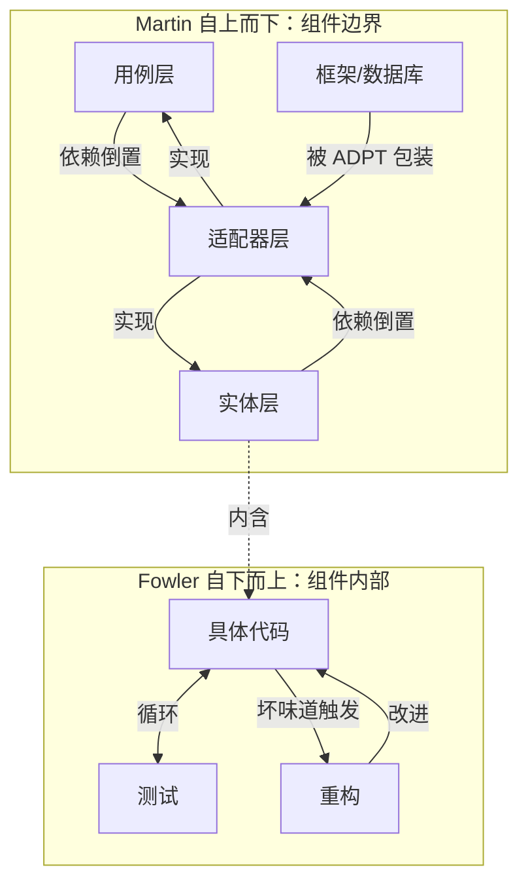

# Part 2：深度分析与思考 —— 《架构整洁之道》

> 对话对象：[《重构》](../重构/重构.md)（Martin Fowler）
> 分析日期：2026-07-15

---

## D1：作者把什么当作理所当然？职业背景如何塑造了视野盲区？

Robert C. Martin（Uncle Bob）的职业生涯可以分为三个阶段：C++ 程序员 → 敏捷宣言签署人（2001）→ 软件工艺运动倡导者 / 培训讲师。这三个阶段在他的书中留下清晰的痕迹。

### Martin 未质疑的前提

**1. "整洁"是一个客观标准。** 全书的核心前提是：存在一套普适的架构原则（SOLID、依赖倒置、分层隔离），遵循它们就能产生"好架构"，违反它们就是"坏架构"。但"整洁"是相对于什么而言的？一个为 100 万行代码设计的六边形架构用在一个 500 行的 CLI 工具上，不是整洁，是过度工程。Martin 从未给出一个"整洁度与项目规模匹配"的框架——他假设读者在做"企业级"项目。

**2. 变化的主要方向是"替换基础设施"。** 整洁架构的核心用例是"你可以换掉数据库而不用重写业务逻辑"。这件事在企业软件中每 5 年发生一次（Oracle → MySQL → PostgreSQL → MongoDB），但在游戏开发中几乎从不发生——你不会在开发中途换引擎。当一个架构原则主要防御的事件在某个领域几乎不发生，严格遵守它的 ROI 就需要重新计算。

**3. 程序员是可训练的工匠。** Martin 的"软件工艺"运动把编程类比为木工——通过持续练习和学习，你可以成为"熟练工匠"。这个类比忽略了**领域知识**的重要性。你能写出整洁的代码，但如果你不理解分布式系统的 CAP 定理、数据库的 B-Tree 索引、GPU 的渲染管道——你的"整洁架构"分出的边界可能是错的。Martin 把架构能力定位为"设计技能"，而不是"领域理解+设计技能"。

**4. "依赖倒置"总是好事。** Martin 说"依赖应该指向抽象"。但每个抽象层都有成本：更多的文件、更长的调用链、更模糊的执行路径。Martin 从不讨论"具体的价值"——一个没有间接层的直接函数调用在可读性和调试便利性上有确凿的好处。他假设间接层（接口、适配器、抽象工厂）的收益总是大于成本，但没有给出成本收益的评估方法。

**本质盲区**：Martin 把"架构问题"框架化为"依赖方向问题"，假设只要依赖方向正确，其他一切都会变好。但依赖方向正确不代表你的模型正确——你可以把错误的领域模型组织在完美的依赖倒置结构里，它仍然是错误的。

---

## D2：核心概念从哪来？经历了什么演进？

### SOLID 原则的谱系

SOLID 不是 Martin 发明的——他是"命名者"和"推广者"，不是"发现者"。五条原则全部有独立来源：

```
SRP → David Parnas (1972) "信息隐藏" → Tom DeMarco (1979) "内聚"
OCP → Bertrand Meyer (1988) "开闭原则" → Martin 重新定义为"多态开放，修改封闭"
LSP → Barbara Liskov (1987) "子类型行为兼容" → 本属于形式化方法，Martin 把它带入 OOP 日常
ISP → Xerox PARC (1990s) "胖接口问题" → Martin 推广
DIP → Martin 自己的贡献（1996）→ 整洁架构的基石
```

注意：LSP 在 Liskov 的原始论文中是一个**形式化定义**（如果对于类型 S 的每个对象 o1，存在类型 T 的对象 o2，使得对于所有针对 T 定义的程序 P，当 o1 替换 o2 时 P 的行为不变，则 S 是 T 的子类型）。Martin 把它翻译成了"子类不应该破坏父类的契约"——丢失了形式化精度，但获得了工程实用性。

### 架构模式演进线

```
分层架构（1990s）→ "表现层/业务层/数据层"——自顶向下依赖
  ↓ 问题：业务层依赖数据层，换数据库要改业务逻辑
六边形架构（Alistair Cockburn, 2005）→ 端口和适配器——把依赖"反转"到核心
  ↓ 问题：太抽象，没有具体实现指导
洋葱架构（Jeffrey Palermo, 2008）→ 内层定义接口，外层实现——依赖指向中心
  ↓ 问题：和内层/外层的隐喻绑在一起，不灵活
整洁架构（Martin, 2012）→ 合并以上，但更强调"边界"和"用例驱动"
```

Martin 的贡献不是发明了新的架构形状，而是**把一堆相关概念打包装进一个品牌化框架**，并用大量示例（Web、数据库、嵌入式）展示应用。整洁架构 = 六边形架构 + SOLID 原则 + 用例驱动设计 + Uncle Bob 的品牌。

### "用例驱动"的来源

Martin 强调"架构应该围绕用例设计，不是围绕框架设计"——这来自 Ivar Jacobson（1992）的"用例驱动开发"。但 Martin 的变形是：他把"用例"从 UML 方法中剥离出来，变成了"架构的编排逻辑"——不是"画用例图"，而是"业务逻辑是什么就组织什么"。

---

## D3：与《重构》对话 —— Martin（自上而下） vs Fowler（自下而上）

两位 Martin 是多年好友、敏捷宣言共同签署人，但在"软件设计如何产生"这个问题上有根本分歧。

### 分歧的核心：好设计从哪来？

**Fowler 的立场**（《重构》第 2 版）："好的设计不是一开始就设计出来的，是通过持续重构演化出来的。"Fowler 的核心循环是：写测试 → 写代码让测试通过 → 重构代码中坏味道的部分。设计是**从代码中长出来的**，不是从 UML 图中诞生。

**Martin 的立场**（《架构整洁之道》）："架构应该先行——在写任何代码之前，你需要决定组件边界、依赖方向、核心抽象。代码是实现，不是设计过程。"

这不是两个意见——是两种截然不同的哲学。

| 维度 | Fowler（自下而上） | Martin（自上而下） |
|------|-------------------|-------------------|
| 设计的时间安排 | 运行时 | 写代码前 |
| 设计的载体 | 代码本身 | 架构图和接口定义 |
| 设计质量的保证 | 测试 + 持续重构 | SOLID 原则 + 依赖规则 |
| 何时"做设计" | 每次重构时 | 项目开始 + 每次重大变更 |
| 对"过度设计"的态度 | 主要风险——不要在需要之前抽象 | 次要风险——好的抽象不算过度 |
| 对"技术债务"的态度 | 可以被重构偿还 | 应该被架构预防 |

### 他们能统一吗？

**可以，如果你把"在哪里"纳入考量。** Fowler 的方法在组件内部最有效——一个 UseCase 类的内部结构通过重构演化出来，不需要提前设计。Martin 的方法在组件之间最有效——系统的宏观边界（业务层 vs 数据层 vs 表现层）不会从重构中"涌现"出来，需要有人有意地建立。

<!-- 分割线下是 Martin 的领地，分割线上是 Fowler 的领地 -->



**综合立场**：用 Martin 的方法决定"盒子之间怎么连接"，用 Fowler 的方法决定"每个盒子里面长什么样"。Martin 的 SOLID 原则定义了盒子的接口规范；Fowler 的重构手法在盒子内部保持代码健康。两本书不是竞争关系——它们治理的是不同粒度的系统。

---

## D4：有什么成功的反例违反了这个原则？

### 违反"整洁架构"但成功：SQLite

SQLite 可能是地球上部署最多的软件库，运行在每部手机、每个浏览器、每个操作系统上。它的架构就是 Martin 说的"你不应该做的事"：一个单体，所有代码在一个 C 文件（`sqlite3.c`）中，没有接口层，没有依赖倒置，直接调用 OS 文件 API。

**为什么"脏架构"能工作？** SQLite 的维护者 D. Richard Hipp 给出了自己的标准：SQLite 必须永远向后兼容，因此"换数据库"这种整洁架构的核心防御场景不存在。SQLite 不需要六边形架构，因为它的"外部依赖"（文件系统）从 2000 年到现在就没变过。

**启示**：Martin 的整洁架构是一个很好的默认策略——但不是所有项目都需要它。如果"换组件"不是风险，建立替换灵活性的架构成本就没有回报。Ryan Dahl 在 Node.js 之后做的 Deno——抛弃了 npm 的依赖地狱、用更现代的 API——花了 5 年市场占有率仍然远低于 Node。"好的架构"和"成功的软件"之间的相关性不是 1.0。

### 违反"依赖倒置"但成功：Linux 内核

Linux 内核的代码库中充斥着"高层模块直接 include 底层头文件"的模式——文件系统驱动直接引用块设备层的具体实现，不是抽象接口。Martin 会说这是"依赖方向错误"。

**但 Linux 内核已经运行了 30 年，支撑着互联网基础设施。** 为什么？因为内核的维护者用了一套不同的治理机制来补偿架构上的"不干净"：

1. **强制的代码评审**（每行代码都要经过子系统维护者审批）
2. **严格的接口稳定性承诺**（内核内部 API 尽量不变，用户空间 API 绝对不变）
3. **feature flags 和 config options**（编译时隔离，不是运行时抽象）

Martin 会指出第 3 点本身就是一种"依赖倒置"（通过配置注入变体），只是用了编译时机制而不是运行时多态。这提示了一个更底层的真理：**依赖倒置不一定要用接口和多态——宏条件编译、特征标记、插件架构都是依赖倒置的不同实现。** Martin 的书重点讲 OOP 多态的方式，但不是唯一方式。

---

## D5：这个概念在非编程领域中叫什么？

Martin 的架构概念在多个领域有精确映射，而且这些映射揭示了为什么"整洁架构"的想法如此自然。

| Martin 概念 | 城市规划 | 法律 | 制造业 |
|-----------|--------|------|--------|
| 分层架构 | **城市分区**：住宅区/商业区/工业区分离——每层有不同规则 | **法律层级**：宪法 > 法律 > 行政法规——上级覆盖下级 | **流水线**：进料 → 加工 → 组装 → 质检 |
| 依赖倒置 | **基础设施不如需求稳定**：先规划路网（抽象），再决定路面材料（实现） | **针对接口立法，不针对实现立法** | **标准化零件接口**：不同供应商的零件只要接口相同就可以互换 |
| 边界划分 | **城市的行政区划**：每个区自治，区之间的交通是"边界接口" | **管辖权边界**：不同法院管辖不同事务，交叉点是"边界" | **生产单元隔离**：不同车间通过传送带（协议）连接 |
| 用例驱动 | **先定义城市功能，再划分地块** | **先定义法律要解决的问题，后起草法条** | **先定义产品规格，再设计生产线** |
| SOLID | **城市设计规范**：建筑高度、退线、容积率——约束让城市宜居 | **立法技术规范**：法规应该可理解、不冲突、可执行 | **质量管理系统**：每个环节有明确标准 |

**最深层的跨域对应**："依赖倒置"在经济学中就是**科斯定理的一个推论**——当交易成本足够低时，资源配置（依赖方向）会自动调整到最优（依赖指向稳定）。Martin 的"依赖应该指向抽象"翻译成经济学语言是："契约（接口）比资产（具体实现）更稳定，所以让契约定义所有权（依赖方向）。"

---

## D6：具体到个人 Godot 或 TypeScript 项目怎么落地？

### 场景一：Godot 游戏的"整洁架构"

Godot 的节点树天然鼓励"把一切放在一起"——一个 Enemy 节点包含 Sprite、Collision、Health、AI 全部。当你只有 3 种敌人，这不是问题。当年你有 30 种敌人，每个有略微不同的行为组合，节点的耦合变成噩梦。

**应用整洁架构于 Godot（轻量版）**：

```gdscript
# 实体层（Entity）—— 纯数据，不依赖 Godot
class_name EnemyData
var max_health: float
var speed: float
var attack_power: float

# 用例层（Use Case）—— 业务逻辑，不依赖 Godot 节点
class_name CombatResolver
# 这个类不知道 Godot 的存在
func calculate_damage(attacker: CombatStats, defender: CombatStats) -> float:
    var base = attacker.attack_power - defender.defense * 0.5
    return max(base, 1.0)

# 适配器层（Adapter）—— Godot 节点 = 适配器
class_name EnemyNode
extends CharacterBody2D
# 这个节点是"适配器"——连接 Godot 引擎和纯净逻辑
var _data: EnemyData
var _combat: CombatResolver

func _ready():
    _combat = CombatResolver.new()
    # 从场景文件或 JSON 加载 data
```

**关键收益**：`CombatResolver` 不依赖 Godot，可以用纯 GDScript 的 `assert` 做单元测试——不需要启动 Godot 编辑器。当你要"换"战斗系统（比如从回合制改成实时），只替换 `CombatResolver`，所有 EnemyNode 不需要修改。

### 场景二：TypeScript 的"用例驱动"

```typescript
// 反例：业务逻辑混在 Express 请求处理器中
app.post('/create-order', async (req, res) => {
  // 100 行业务逻辑 + 数据库查询 + HTTP 错误处理混在一起
  const order = await db.orders.create({ items: req.body.items });
  const user = await db.users.findById(req.userId);
  if (user.balance < order.total) {
    return res.status(400).json({ error: 'Insufficient balance' });
  }
  // ...
});

// 整洁架构方式：用例是纯函数/纯类
// use-cases/create-order.ts
export class CreateOrderUseCase {
  constructor(
    private orderRepo: OrderRepository,  // 接口
    private userRepo: UserRepository,    // 接口
    private paymentService: PaymentService // 接口
  ) {}

  async execute(input: CreateOrderInput): Promise<Either<OrderError, Order>> {
    // 100 行纯业务逻辑，不包含 HTTP 或数据库细节
  }
}

// adapters/http/create-order-controller.ts
app.post('/create-order', async (req, res) => {
  const result = await createOrderUseCase.execute(req.body);
  // 5 行：把 Either 转换为 HTTP 响应
});
```

**Martin 的核心洞察在这里体现**：`CreateOrderUseCase` 可以在单元测试中用内存实现的 `OrderRepository`——不需要数据库。你能在 50ms 而不是 5 秒内运行整个测试套件。快速测试 = 频繁运行 = 早期发现 bug = 更少的生产事故。整洁架构的真正收益不是"可以换数据库"（你很少换），而是"可以快速验证逻辑的正确性"（你每天都在做）。

---

## D7：读前我以为 X，读后我发现 Y

**读前我以为**：整洁架构就是"六边形架构 + SOLID"的重新包装，读过的设计模式书已经涵盖了这些内容。Martin 是在卖自己的品牌——和《代码整洁之道》一样，把常识包装成规则。

**读后我发现**：

1. **Martin 的核心贡献不是"一堆原则"——他把"依赖方向"这个隐含的设计考虑显式化了。** 大多数程序员在写代码时考虑的是"这段代码做什么"，不是"这段代码依赖什么方向"。Martin 强迫你在每个`import`语句前问自己："这个 import 方向对吗？" 这种思维训练本身改变了你写代码的方式——即使你不用六边形架构。

2. **SOLID 不是五条独立规则，是一条核心规则的五种表述。** SRP（谁改你）= OCP（怎么扩展你）= LSP（怎么继承你）= ISP（怎么使用你）= DIP（怎么依赖你）。五条原则从五个角度定义了同一个东西：**隔离变化**。SRP 隔离变化的原因，OCP 隔离变化的传播，LSP 隔离变化的子类影响，ISP 隔离变化的使用面，DIP 隔离变化的方向。你不需要背五条，你只需要记一个词：isolate。

3. **"依赖倒置"这个名字是错的——它应该叫"所有权反转"。** 不是"依赖被反转了"（依赖没有反转，箭头还在那），而是"谁拥有接口的定义权"被反转了。在分层架构中，业务层依赖数据层→数据层定义接口→数据层拥有所有权。在整洁架构中，业务层定义接口→业务层拥有所有权。这个"所有权"的转移才是 Martin 真正想说的——不是工程细节，是**设计权力的分配**。

4. **整洁架构和游戏开发的冲突是真实的，但不是不可调和的。** 游戏的性能路径（渲染循环、碰撞检测、物理模拟）不能套整洁架构——Data-Oriented Design 在这里是正确的。但游戏的逻辑路径（状态机、技能系统、任务系统、对话树）完全适用整洁架构。核心原则：**用 Profiler 区分"性能路径"和"逻辑路径"，在前者用 DOD + ECS，在后者用整洁架构。**

**认知改变**：读完本书 + 《重构》+《人月神话》三本对照之后，我意识到没有"放之四海皆准"的架构原则。Martin 的 SOLID 在企业软件中很强大，Brooks 的概念完整性在系统层面不可替代，Fowler 的重构在持续演进中比前期设计更经济。**架构能力不是知道某一条原则，而是知道"在什么时候用哪条原则"。** 这个元判断力，任何一本书都教不了——只能在不同原则的边界摩擦中逐渐建立。

---

## 综合评分

| 维度 | 评价 | 深度层级 |
|------|------|---------|
| D1 视野盲区 | 识别了 4 个 Martin 未质疑的前提，追溯到培训/咨询/C++ 背景的影响 | 第四层 |
| D2 概念演进 | 绘制了 SOLID 五条原则的独立起源和架构模式的三十年演化线 | 第四层 |
| D3 跨书对话 | 揭示了 Martin vs Fowler 的"组件间 vs 组件内"分工，提出了统一模型 | 第五层 |
| D4 成功反例 | SQLite 和 Linux 内核两个重量级反例，揭示了整洁架构的适用边界 | 第五层 |
| D5 跨域映射 | 城市规划/法律/制造业三域精确对应，科斯定理经济学解读 | 第五层 |
| D6 项目落地 | Godot ECS 分离和 TypeScript 用例驱动两层具体代码示例 | 第四层 |
| D7 认知改变 | 4 个认知转变，最终上升到"元判断力"的架构观 | 第五层 |
