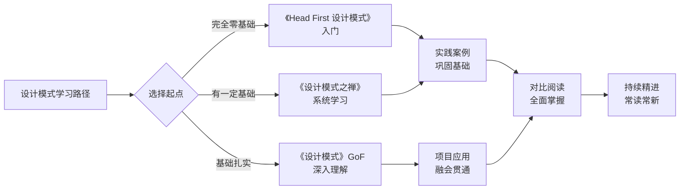
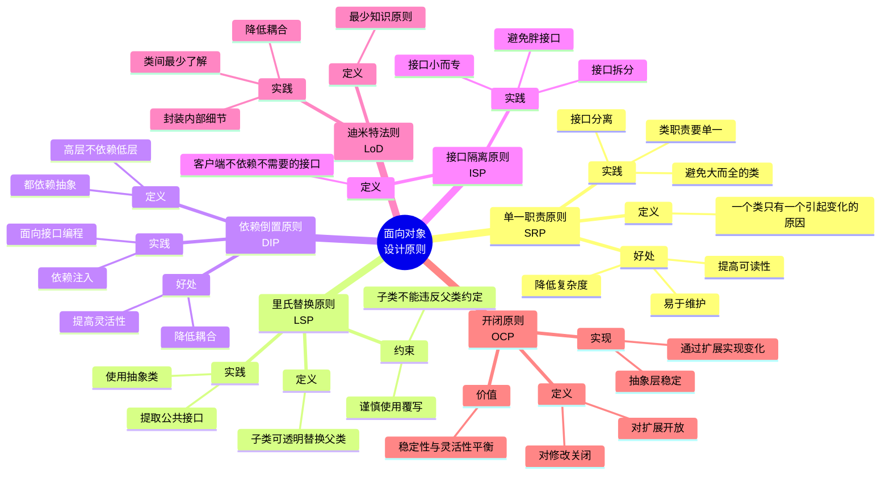
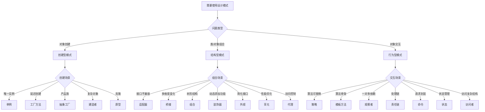

# 设计模式知识架构总览

## 📚 三本经典设计模式书籍对比

### 书籍定位与特点

| 书籍 | 作者 | 特点 | 适合人群 | 难度 |
|------|------|------|----------|------|
| **《设计模式：可复用面向对象软件的基础》** (GoF) | Erich Gamma等 （四人帮） | • 设计模式领域的"圣经" • 理论权威，定义标准 • 抽象程度高，语言精炼 • 23种模式的起源 | • 有一定基础的开发者 • 想深入理解模式本质 • 架构师、技术专家 | ⭐⭐⭐⭐⭐ |
| **《Head First 设计模式》** | Eric Freeman等 | • 图文并茂，视觉化学习 • 案例生动，循序渐进 • 实战导向，容易上手 • 2005年Jolt大奖 | • 初学者入门 • 喜欢案例驱动的学习 • Java开发者 | ⭐⭐⭐ |
| **《设计模式之禅》** （第2版） | 秦小波 | • 中文原创，幽默风趣 • 趣味性强，通俗易懂 • 28种模式，7种单例 • Java实战案例丰富 | • 中文读者入门 • Java开发者 • 喜欢趣味性讲解 | ⭐⭐⭐⭐ |

### 学习路径建议

## 🧠 设计模式完整知识体系

### 一、面向对象设计原则（六大原则）

### 二、23种GoF设计模式分类

#### 创建型模式（5种）- 对象创建的抽象化

| 模式 | 核心思想 | 应用场景 | 难度 |
|------|----------|----------|------|
| **单例模式 Singleton** | 确保一个类只有一个实例 | • 配置管理器 • 连接池 • 日志管理器 | ⭐⭐ |
| **工厂方法 Factory Method** | 由子类决定创建哪类对象 | • 日志系统 • 数据库连接 • 框架扩展点 | ⭐⭐⭐ |
| **抽象工厂 Abstract Factory** | 创建产品族，无需指定具体类 | • 跨平台UI组件 • 不同主题样式 • 多数据库支持 | ⭐⭐⭐⭐ |
| **建造者 Builder** | 分步骤构建复杂对象 | • 复杂对象构建 • SQL构建器 • 文档生成器 | ⭐⭐⭐ |
| **原型 Prototype** | 通过克隆创建对象 | • 创建成本高的对象 • 保护性拷贝 • 复杂对象初始化 | ⭐⭐⭐ |

#### 结构型模式（7种）- 类和对象的组合

| 模式 | 核心思想 | 应用场景 | 难度 |
|------|----------|----------|------|
| **适配器 Adapter** | 接口转换，兼容不兼容接口 | • 遗留系统整合 • 第三方API适配 • 数据格式转换 | ⭐⭐⭐ |
| **桥接 Bridge** | 分离抽象与实现 | • 多维度变化 • 跨平台应用 • JDBC驱动 | ⭐⭐⭐⭐ |
| **组合 Composite** | 树形结构，统一处理个体和整体 | • 文件系统 • 菜单系统 • 组织架构 | ⭐⭐⭐ |
| **装饰器 Decorator** | 动态添加功能 | • IO流 • 缓存装饰 • 权限检查 | ⭐⭐⭐ |
| **外观 Facade** | 简化复杂子系统接口 | • API网关 • 库封装 • 复杂流程简化 | ⭐⭐ |
| **享元 Flyweight** | 共享细粒度对象，优化性能 | • 字符串常量池 • 缓存系统 • 对象池 | ⭐⭐⭐⭐ |
| **代理 Proxy** | 控制对象访问 | • 远程代理 • 虚拟代理 • 保护代理 • AOP | ⭐⭐⭐ |

#### 行为型模式（11种）- 对象间职责划分与通信

| 模式 | 核心思想 | 应用场景 | 难度 |
|------|----------|----------|------|
| **策略模式 Strategy** | 定义算法族，可互换 | • 支付方式 • 排序算法 • 压缩算法 | ⭐⭐ |
| **模板方法 Template Method** | 算法骨架，子类实现细节 | • Spring JdbcTemplate • Servlet • 算法框架 | ⭐⭐ |
| **观察者 Observer** | 一对多依赖，发布订阅 | • 事件系统 • 消息队列 • MVVM框架 | ⭐⭐⭐ |
| **责任链 Chain of Responsibility** | 请求沿链传递处理 | • 过滤器链 • 日志级别 • 审批流程 | ⭐⭐⭐ |
| **命令 Command** | 封装请求为对象 | • 撤销/重做 • 任务队列 • 事务 | ⭐⭐⭐ |
| **迭代器 Iterator** | 遍历集合对象 | • 集合遍历 • 数据库结果集 | ⭐⭐ |
| **中介者 Mediator** | 对象间解耦，中枢通信 | • 聊天室 • 航空管制 • MVC控制器 | ⭐⭐⭐⭐ |
| **备忘录 Memento** | 保存恢复状态 | • 撤销机制 • 游戏存档 · 事务回滚 | ⭐⭐⭐ |
| **状态 State** | 对象状态改变时行为改变 | • 订单状态 • 工作流 • 游戏角色 | ⭐⭐⭐ |
| **访问者 Visitor** | 操作分离，不改变数据结构 | • 编译器 • 文档结构 · 数据结构稳定 | ⭐⭐⭐⭐ |
| **解释器 Interpreter** | 语法解释，语言解释 | • SQL解析 • 正则表达式 • 配置文件 | ⭐⭐⭐⭐ |

### 三、常见扩展模式（非GoF）

| 模式 | 说明 | 应用场景 |
|------|------|----------|
| **简单工厂 Simple Factory** | 非GoF模式，静态工厂方法 | • 对象创建逻辑简单 • 快速实现 |
| **MVC模式** | 模型-视图-控制器架构 | • Web框架 • GUI应用 |
| **DAO模式** | 数据访问对象 | • 数据库操作 · 数据持久化 |
| **依赖注入 DI** | 控制反转的一种实现 | • Spring框架 • 对象管理 |
| **服务定位器 Service Locator** | 查找服务对象 | • 微服务架构 · 服务注册发现 |

## 🎯 设计模式实践指南

### 1. 模式选择决策树

### 2. 设计模式学习路线图

#### 阶段一：基础入门（1-2个月）
- **必读书籍**: 《Head First 设计模式》
- **学习重点**: 策略、观察者、装饰器、工厂、单例
- **实践任务**:
  - 完成书中所有案例代码
  - 每个模式至少写一个实际应用案例
  - 对比不同模式的代码结构

#### 阶段二：系统学习（3-4个月）
- **必读书籍**: 《设计模式之禅》
- **学习重点**: 23种模式全面掌握，6大设计原则
- **实践任务**:
  - 实现28种模式的Java代码
  - 分析JDK源码中的模式应用
  - 在实际项目中应用至少5种模式

#### 阶段三：深入理解（2-3个月）
- **必读书籍**: GoF《设计模式》
- **学习重点**: 模式本质，设计哲学，架构思维
- **实践任务**:
  - 精读GoF原版，理解模式的抽象定义
  - 参与开源项目，学习优秀的模式应用
  - 总结个人模式应用经验，形成知识库

#### 阶段四：融会贯通（持续）
- **学习方式**: 三本书对比阅读，项目实战
- **学习重点**: 模式组合，模式权衡，架构设计
- **实践任务**:
  - 每年重读经典，常读常新
  - 技术分享，向团队讲解模式应用
  - 建立个人设计模式知识体系

### 3. 实战项目推荐

#### 初级项目
1. **简单计算器**
   - 涉及模式: 策略模式、工厂模式
   - 练习点: 算法封装、对象创建

2. **咖啡店点单系统**
   - 涉及模式: 装饰器模式、抽象工厂
   - 练习点: 动态添加功能、产品族创建

3. **日志系统**
   - 涉及模式: 单例模式、策略模式、建造者模式
   - 练习点: 唯一实例、算法选择、复杂对象构建

#### 中级项目
1. **支付系统**
   - 涉及模式: 工厂方法、策略模式、适配器模式
   - 练习点: 多支付方式、第三方API整合

2. **文档编辑器**
   - 涉及模式: 组合模式、迭代器模式、命令模式
   - 练习点: 树形结构、遍历、撤销重做

3. **事件驱动框架**
   - 涉及模式: 观察者模式、中介者模式
   - 练习点: 发布订阅、事件总线

#### 高级项目
1. **Web MVC框架**
   - 涉及模式: 前端控制器、视图助手、拦截器
   - 练习点: 多模式组合、框架设计

2. **ORM框架**
   - 涉及模式: 工厂模式、代理模式、DAO模式、装饰器模式
   - 练习点: 数据库抽象、动态代理、缓存装饰

3. **工作流引擎**
   - 涉及模式: 责任链模式、状态模式、命令模式、模板方法
   - 练习点: 流程定义、状态转换、任务执行

## 📚 学习资源推荐

### 在线资源
- **[Refactoring.Guru](https://refactoringguru.cn/design-patterns)**: 优秀的设计模式教程，图文并茂
- **[Java设计模式项目](https://github.com/iluwatar/java-design-patterns)**: 开源的模式实现
- **[Spring框架中的设计模式](https://www.baeldung.com/design-patterns-in-spring)**: 实战应用

### 经典书籍
1. **《设计模式：可复用面向对象软件的基础》** (GoF) - 权威之作
2. **《Head First 设计模式》** - 入门首选
3. **《设计模式之禅》** - 中文经典
4. **《Effective Java》** - Java最佳实践

### 实践框架
- **Spring Framework**: 大量应用设计模式
- **Jakarta Commons**: 工具类库的模式应用
- **Apache Tomcat**: Servlet容器的设计

## 💡 学习建议

### DO - 应该做的
✅ 先学设计原则，再学设计模式
✅ 每个模式至少实践一个完整案例
✅ 阅读优秀开源项目的源码
✅ 在实际项目中适度使用模式
✅ 建立个人设计模式知识库
✅ 定期回顾，常读常新

### DON'T - 不应该做的
❌ 不要为了使用模式而使用模式
❌ 不要过度设计，保持简单
❌ 不要孤立学习模式，要系统掌握
❌ 不要忽视模式的代价和局限性
❌ 不要死记硬背，要理解本质
❌ 不要停留在理论，要大量实践

---

**创建时间**: 2025-12-29
**最后更新**: 2025-12-29
**版本**: v1.0
