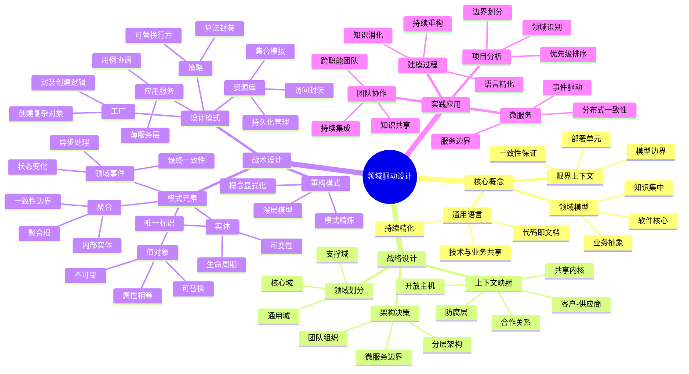
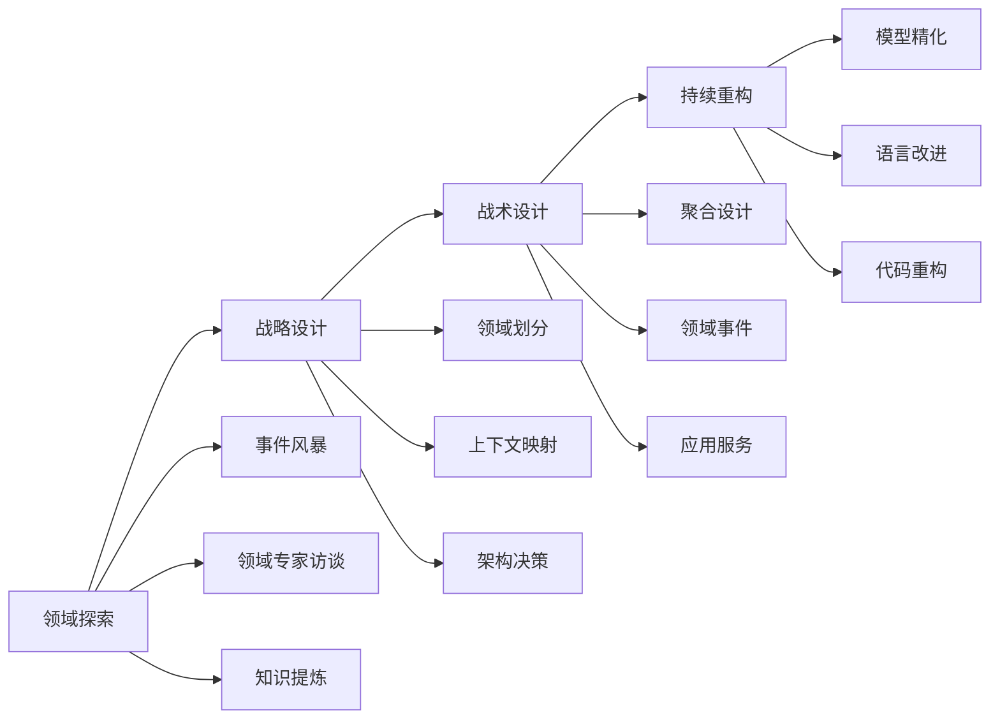
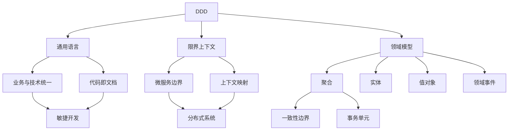

# 📚 领域驱动设计：软件核心复杂性应对之道

# Part 1：书籍内容梳理归纳

## 📖 基本信息

- **原名**: Domain-Driven Design: Tackling Complexity in the Heart of Software
- **作者**: Eric Evans（埃里克·埃文斯）
- **出版社**: Addison-Wesley Professional
- **出版年份**: 2003年创作，2004年正式出版
- **中译本**: 人民邮电出版社
- **译者**: 滕云、郑晔等
- **页数**: 约400页
- **创建时间**: 2026年5月11日
- **难度等级**: 高级
- **阅读状态**: 📖 正在阅读
- **个人评分**: ⭐⭐⭐⭐⭐
- **标签**: #DDD #软件架构 #领域建模 #设计模式 #复杂系统 #微服务

## 📝 内容概要

### 书籍简介

《领域驱动设计》（DDD）是软件架构领域的里程碑式著作，被誉为"DDD圣经"。Eric Evans 在本书中提出了一套系统的软件开发方法，通过将复杂业务领域建模到软件中，并使用通用的语言连接技术和领域专家，从而解决复杂软件系统的核心问题。

本书的核心价值在于：
- 提出了**通用语言**的概念，消除技术与业务之间的沟通隔阂
- 系统性地阐述了**战略设计**和**战术设计**两个维度
- 提供了一套完整的**模式语言**用于指导领域建模
- 为**微服务架构**提供了理论基础和实践指导

### 核心主题

1. **通用语言（Ubiquitous Language）** - 开发团队与业务专家共享的语言
2. **领域模型（Domain Model）** - 对业务领域的抽象表示
3. **限界上下文（Bounded Context）** - 定义模型的边界
4. **战略设计（Strategic Design）** - 如何划分系统
5. **战术设计（Tactical Design）** - 如何实现模型

### 主要章节结构

#### 第一部分：运用领域模型

**第1章 消化知识**
- 知识消化的重要性
- 有效学习建模的途径
- 持续精化语言

**第2章 交流与语言的使用**
- 通用语言的概念
- 模式的变革
- 语言的持续精化

**第3章 绑定模型和实现**
- 建模型（MODEL-DRIVEN DESIGN）
- 建模范例
- 提炼领域模型

#### 第二部分：战略设计

**第4章 隔离领域**
- 限界上下文
- 持续集成
- 上下文映射

**第5章 精炼项目中的领域**
- 核心域（Core Domain）
- 通用域（Generic Domain）
- 支撑域（Supporting Domain）
- 领域愿景

**第6章 战略重构**
- 部署时间表的节奏
- 重构的决策
- 战略与设计的协同

#### 第三部分：战略模式的总结

**第7章 在各应用层间生活**
- 层次概念
- 层次的职责划分
- 架构框架的选择

**第8章 在领域层中运用智能**
- 隔离领域
- 模式的识别
- 模式的应用

**第9章 隐式概念显式化**
- 隐式概念的发现
- 概念的显式化
- 约束的显式化

**第10章 软柔层（Supple Layer）**
- 软柔层的概念
- 模式的柔化
- 柔性设计

**第11章 通过模式来应用大型领域**
- 大型领域的模式
- 模式的组合
- 模式的演进

**第12章 领域对象的生命周期**
- 聚合（AGGREGATE）
- 工厂（FACTORY）
- 资源库（REPOSITORY）
- 领域对象的生命周期管理

**第13章 聚焦于语言**
- 领域语言的精化
- 语言的持续演进
- 语言的文档化

**第14章 演变到深层模型**
- 深层模型的概念
- 模型的精化
- 模型的持续重构

#### 第四部分：战略模式的总结

**第15-16章 战略模式的综合应用**
- 综合应用案例
- 最佳实践总结

## 🧠 知识架构



## ✍️ 读书笔记

### 第一部分：运用领域模型

#### 第1章：消化知识

**本章要点**：强调知识消化在软件开发中的重要性，以及如何通过持续学习和精化来构建有效的领域模型。

> "在软件项目中，最重要的工作不是编码，而是消化业务知识，并将其转化为可理解的模型。"

> "领域模型的本质是知识的载体，它是开发人员和领域专家共同工作的成果。"

**核心概念**：

1. **知识消化的层次**
```javascript
// ❌ 错误：直接开始编码，不理解业务
function processOrder(order) {
    // 看起来在处理订单，但不理解业务规则
    order.status = 'PROCESSED';
    order.save();
}

// ✅ 正确：先理解业务，再建模
// 业务规则：订单处理需要检查库存、计算金额、验证支付
class OrderProcessor {
    constructor(inventoryService, paymentService) {
        this.inventoryService = inventoryService;
        this.paymentService = paymentService;
    }

    process(order) {
        // 1. 检查库存
        if (!this.inventoryService.isAvailable(order.items)) {
            throw new OutOfStockError();
        }

        // 2. 计算金额
        const total = order.calculateTotal();

        // 3. 验证支付
        if (!order.payment.isAuthorizedFor(total)) {
            throw new PaymentError();
        }

        // 4. 处理订单
        order.markAsProcessed();
    }
}
```

2. **持续学习与精化**
```javascript
// 初期模型：简单但不够精确
class User {
    constructor(name, email) {
        this.name = name;
        this.email = email;
    }
}

// 精化后：区分个人和组织的不同
class Person {
    constructor(firstName, lastName, email) {
        this.firstName = firstName;
        this.lastName = lastName;
        this.email = new Email(email);
    }
}

class Organization {
    constructor(name, domain, contactEmail) {
        this.name = name;
        this.domain = new DomainName(domain);
        this.contactEmail = new Email(contactEmail);
    }
}
```

#### 第2章：交流与语言的使用

**本章要点**：通用语言是连接开发人员与领域专家的桥梁，语言必须在代码、文档和日常交流中保持一致。

> "通用语言不是技术术语，也不是业务术语，而是两者融合的产物。"

> "语言的变更必须同步到代码、文档和所有交流中，否则会失去其价值。"

**通用语言的实践**：

```javascript
// ❌ 错误：技术语言与业务语言脱节
// 开发人员说："我们需要把user表中的status字段更新为1"
// 业务专家说："我们需要激活这个客户账户"
// 语言不一致导致沟通障碍

// ✅ 正确：使用统一的语言
class CustomerAccount {
    activate() {
        // 业务语言直接体现在代码中
        if (this.canBeActivated()) {
            this.status = AccountStatus.ACTIVE;
            this.recordActivation();
        }
    }

    canBeActivated() {
        return this.status === AccountStatus.PENDING &&
               this.hasCompletedVerification();
    }
}

// 现在，开发人员和业务专家都说同样的语言：
// "激活客户账户"
```

**模式的变革**：
```javascript
// 传统的贫血模型模式（Anti-Pattern）
class Order {
    setId(id) { this.id = id; }
    setCustomer(customer) { this.customer = customer; }
    setItems(items) { this.items = items; }
    getTotal() {
        return this.items.reduce((sum, item) => sum + item.price, 0);
    }
}

class OrderService {
    calculateDiscount(order) {
        // 业务逻辑在服务层，领域对象变成数据容器
        let discount = 0;
        if (order.getTotal() > 1000) {
            discount = 0.1;
        }
        return discount;
    }
}

// DDD的充血模型模式
class Order {
    constructor(id, customer, items) {
        this.id = id;
        this.customer = customer;
        this.items = items;
    }

    // 业务逻辑在领域对象内部
    calculateDiscount() {
        if (this.isLargeOrder()) {
            return new Discount(0.1);
        }
        return Discount.none();
    }

    isLargeOrder() {
        return this.totalAmount > 1000;
    }

    get totalAmount() {
        return this.items.reduce((sum, item) => sum + item.price, 0);
    }
}
```

#### 第3章：绑定模型和实现

**本章要点**：模型与代码必须紧密绑定，模型的变化必须立即反映到代码中。

> "如果模型和代码不一致，模型就失去了价值。代码是模型的最终表达。"

> "模型驱动设计不是文档驱动，代码本身就是最重要的模型文档。"

**模型驱动设计示例**：

```javascript
// ❌ 错误：模型与代码脱节
// UML图中有Customer和Address的关系
// 但代码中完全没有体现

class Customer {
    constructor(data) {
        this.name = data.name;
        this.street = data.street;
        this.city = data.city;
        this.zip = data.zip;
    }
}

// ✅ 正确：代码体现模型
class Customer {
    constructor(name, address) {
        this.name = name;
        this.address = address;  // 明确的对象关系
    }

    moveTo(newAddress) {
        this.address = newAddress;
    }
}

class Address {
    constructor(street, city, zip) {
        this.street = street;
        this.city = city;
        this.zip = zip;
    }

    toString() {
        return `${this.street}, ${this.city} ${this.zip}`;
    }
}
```

---

### 第二部分：战略设计

#### 第4章：隔离领域

**本章要点**：限界上下文是定义模型边界的关键概念，确保模型在特定范围内保持一致性。

> "一个模型只在特定的边界内有效，这个边界就是限界上下文。"

> "不要试图创建一个适用于整个企业的大一统模型，那会导致模型混乱。"

**限界上下文实践**：

```javascript
// 销售上下文中的"客户"概念
class SalesCustomer {
    constructor(id, name, level) {
        this.id = new CustomerId(id);
        this.name = name;
        this.level = level;  // VIP、普通等
    }

    canBuyPremiumProduct() {
        return this.level === 'VIP';
    }
}

// 物流上下文中的"客户"概念
class ShippingCustomer {
    constructor(id, shippingAddress, contactPhone) {
        this.id = new CustomerId(id);
        this.shippingAddress = shippingAddress;
        this.contactPhone = contactPhone;
    }

    canShipToRemoteArea() {
        return this.shippingAddress.isRemote();
    }
}

// 两个上下文中的"客户"有不同的属性和行为
// 它们通过防腐层进行转换
```

**上下文映射模式**：

```javascript
// 1. 合作关系（Partnership）- 两个团队协同开发
// SalesContext 和 MarketingContext 紧密合作

// 2. 共享内核（Shared Kernel）- 共享部分模型
class SharedKernel {
    // 两个上下文都依赖的核心概念
    constructor() {
        this.productCatalog = new ProductCatalog();
        this.pricingRules = new PricingRules();
    }
}

// 3. 客户-供应商（Customer-Supplier）
// 上游：库存系统
class InventorySystem {
    checkAvailability(productId, quantity) {
        // 提供库存查询服务
    }
}

// 下游：订单系统
class OrderSystem {
    constructor(inventorySystem) {
        this.inventorySystem = inventorySystem;
    }

    createOrder(productId, quantity) {
        if (this.inventorySystem.checkAvailability(productId, quantity)) {
            // 创建订单
        }
    }
}

// 4. 防腐层（Anti-Corruption Layer）
// 保护自己的领域模型免受外部系统影响
class ExternalOrderAdapter {
    constructor(externalOrderAPI) {
        this.externalAPI = externalOrderAPI;
    }

    toOurOrder(externalOrderData) {
        // 转换外部模型到我们的模型
        return new Order(
            externalOrderData.order_id,
            new Money(externalOrderData.amount_usd, 'USD'),
            this.convertStatus(externalOrderData.status)
        );
    }

    convertStatus(externalStatus) {
        const mapping = {
            'PENDING_PAYMENT': OrderStatus.AWAITING_PAYMENT,
            'PROCESSING': OrderStatus.PROCESSING,
            'SHIPPED': OrderStatus.SHIPPED
        };
        return mapping[externalStatus] || OrderStatus.UNKNOWN;
    }
}

// 5. 开放主机服务（Open Host Service）
// 提供标准化的API供其他系统使用
class ProductCatalogService {
    getProducts(criteria) {
        // 标准化的产品查询接口
    }

    getProductDetails(productId) {
        // 标准化的产品详情接口
    }
}
```

#### 第5章：精炼项目中的领域

**本章要点**：不是所有领域都同等重要，需要识别核心域并投入最大精力。

> "核心域是业务竞争优势的来源，应该投入最优秀的开发人员。"

> "通用域可以使用现成的解决方案，不要重复造轮子。"

**领域分类实践**：

```javascript
// 1. 核心域（Core Domain）- 业务差异化所在
// 电商平台的推荐算法
class RecommendationEngine {
    constructor(userBehaviorAnalyzer, productMatcher) {
        this.behaviorAnalyzer = userBehaviorAnalyzer;
        this.productMatcher = productMatcher;
    }

    recommendForUser(userId, context) {
        const userProfile = this.behaviorAnalyzer.analyze(userId);
        const candidates = this.productMatcher.findCandidates(userProfile, context);
        return this.rankByRelevance(candidates, userProfile);
    }

    rankByRelevance(products, profile) {
        // 核心算法：这是我们的竞争优势
        // 需要投入大量精力优化
    }
}

// 2. 支撑域（Supporting Domain）- 必要但非差异化
// 订单处理逻辑
class OrderProcessor {
    constructor(inventoryService, paymentService, shippingService) {
        this.inventoryService = inventoryService;
        this.paymentService = paymentService;
        this.shippingService = shippingService;
    }

    process(order) {
        // 标准的订单处理流程
        // 虽然重要，但不是竞争优势
        // 可以使用标准模式，不必过度创新
    }
}

// 3. 通用域（Generic Domain）- 可以使用现成方案
// 用户认证
// 使用现成的解决方案：Auth0、Firebase Auth等
class AuthenticationAdapter {
    constructor(authProvider) {
        this.authProvider = authProvider;  // 第三方认证服务
    }

    authenticate(credentials) {
        return this.authProvider.verify(credentials);
    }
}
```

**领域愿景**：

```javascript
// 定义领域愿景，指导投资决策
const DomainVision = {
    core: {
        name: '智能推荐系统',
        investment: 'high',
        team: '最优秀的工程师',
        quality: '最高标准',
        reason: '这是我们区别于竞争对手的核心'
    },

    supporting: {
        name: '订单处理系统',
        investment: 'medium',
        team: '有经验的工程师',
        quality: '可靠稳定',
        reason: '业务必需，但非差异化'
    },

    generic: {
        name: '用户认证系统',
        investment: 'low',
        team: '使用现成方案',
        quality: '满足基本需求',
        reason: '通用问题，不值得自己开发'
    }
};
```

#### 第6章：战略重构

**本章要点**：战略重构是持续的过程，需要在保持系统运行的同时逐步改进模型。Evans 强调，重构不只是代码层面的活动，更是对领域理解的深化过程。随着团队对业务领域的理解不断加深，原有的模型可能暴露出设计缺陷，需要在不破坏现有功能的前提下进行调整。

**核心概念**：

- **持续重构**：重构不是一次性的"大爆炸"活动，而是融入日常开发节奏的持续实践。每次迭代都是改进模型的机会。
- **模型演化**：领域模型应该随着业务理解的深化而演化，而不是固化为不可变的"设计文档"。
- **重构时机**：选择在业务压力较小的迭代窗口进行较大的模型调整，避免在紧急需求交付期间执行高风险重构。
- **重构与通用语言**：战略重构往往伴随着通用语言的演化——当团队发现新的业务概念时，模型和语言需要同步更新。

**与代码重构的关系**：

| 维度 | 代码重构 | 战略重构 |
|------|---------|---------|
| 目标 | 改善代码结构 | 改善领域模型 |
| 粒度 | 函数/类级别 | 限界上下文/模块级别 |
| 触发条件 | 代码坏味道 | 领域理解深化 |
| 影响范围 | 局部 | 跨团队/跨上下文 |
| 频率 | 每日 | 每迭代/每里程碑 |

> "战略重构不是一次性的大爆炸，而是持续的小步改进。"

> "重构的时机至关重要，需要在部署压力较小的窗口进行。"

**实践要点**：
- 在重构前确保有足够的自动化测试覆盖，尤其是针对核心领域逻辑
- 利用限界上下文作为重构边界——在单个上下文内重构比跨上下文重构安全得多
- 重构过程中保持与领域专家的密切沟通，确保模型变化反映真实业务规则
- 记录重构决策（ADR），让团队理解模型为什么变成现在的样子

---

### 第三部分：战术设计

#### 第7章：在各应用层间生活

**本章要点**：分层架构是DDD的标准架构，每层都有明确的职责。

> "分层的目标是隔离变化，上层可以独立于下层变化。"

> "领域层是核心，应该尽可能纯粹，不依赖其他层。"

**分层架构实践**：

```javascript
// 用户界面层（User Interface Layer）
class OrderController {
    constructor(orderApplicationService) {
        this.orderService = orderApplicationService;
    }

    async createOrder(request) {
        try {
            const command = new CreateOrderCommand(
                request.customerId,
                request.items,
                request.shippingAddress
            );

            const result = await this.orderService.createOrder(command);
            return this.successResponse(result);
        } catch (error) {
            return this.errorResponse(error);
        }
    }
}

// 应用层（Application Layer）
class OrderApplicationService {
    constructor(orderRepository, inventoryService, paymentService) {
        this.orderRepository = orderRepository;
        this.inventoryService = inventoryService;
        this.paymentService = paymentService;
    }

    async createOrder(command) {
        // 应用服务协调领域对象完成用例
        const customer = await this.orderRepository.findCustomer(command.customerId);
        const order = Order.create(customer, command.items);

        // 检查库存
        await this.inventoryService.reserveItems(order.items);

        // 处理支付
        await this.paymentService.charge(order.totalAmount);

        // 保存订单
        await this.orderRepository.save(order);

        return order;
    }
}

// 领域层（Domain Layer）- 核心业务逻辑
class Order {
    constructor(id, customer, items, status) {
        this.id = id;
        this.customer = customer;
        this.items = items;
        this.status = status;
    }

    static create(customer, items) {
        // 领域逻辑：创建订单的业务规则
        if (items.length === 0) {
            throw new InvalidOrderError('订单必须包含至少一件商品');
        }

        return new Order(
            OrderId.generate(),
            customer,
            items,
            OrderStatus.CREATED
        );
    }

    get totalAmount() {
        return this.items.reduce((sum, item) => sum + item.subtotal, 0);
    }
}

// 基础设施层（Infrastructure Layer）
class OrderRepositoryImpl {
    constructor(database) {
        this.database = database;
    }

    async save(order) {
        // 持久化细节
        await this.database.orders.insert({
            id: order.id,
            customer_id: order.customer.id,
            items: order.items,
            status: order.status
        });
    }

    async findCustomer(id) {
        // 从数据库加载客户
    }
}
```

#### 第8章：在领域层中运用智能

**本章要点**：业务逻辑应该在领域层，而不是分散在服务层或控制器中。

> "将业务逻辑放在领域对象中，让模型变得有意义。"

> "避免贫血模型，让领域对象成为业务知识的载体。"

**智能领域对象示例**：

```javascript
// ❌ 错误：贫血模型
class Order {
    constructor(items, customer, discount) {
        this.items = items;
        this.customer = customer;
        this.discount = discount;
    }
}

class OrderService {
    // 业务逻辑在服务层
    calculateTotal(order) {
        let subtotal = 0;
        for (let item of order.items) {
            subtotal += item.price * item.quantity;
        }

        let discount = 0;
        if (order.discount && order.discount.percentage) {
            discount = subtotal * order.discount.percentage / 100;
        }

        let tax = 0;
        if (order.customer.isTaxExempt) {
            tax = 0;
        } else {
            tax = (subtotal - discount) * 0.1;
        }

        return subtotal - discount + tax;
    }

    canBeCancelled(order) {
        return order.status === 'PENDING' ||
               (order.status === 'CONFIRMED' && this.isWithinHours(order.createdAt, 24));
    }
}

// ✅ 正确：充血模型
class Order {
    constructor(id, items, customer, discount, status, createdAt) {
        this.id = id;
        this.items = items;
        this.customer = customer;
        this.discount = discount;
        this.status = status;
        this.createdAt = createdAt;
    }

    // 业务逻辑在领域对象内部
    get totalAmount() {
        const subtotal = this.calculateSubtotal();
        const discount = this.calculateDiscount(subtotal);
        const tax = this.calculateTax(subtotal - discount);
        return subtotal - discount + tax;
    }

    calculateSubtotal() {
        return this.items.reduce((sum, item) => sum + item.subtotal, 0);
    }

    calculateDiscount(subtotal) {
        if (this.discount && this.discount.percentage) {
            return subtotal * this.discount.percentage / 100;
        }
        return 0;
    }

    calculateTax(taxableAmount) {
        if (this.customer.isTaxExempt) {
            return 0;
        }
        return taxableAmount * 0.1;
    }

    canBeCancelled() {
        return this.status === OrderStatus.PENDING ||
               (this.status === OrderStatus.CONFIRMED && this.isWithin24Hours());
    }

    isWithin24Hours() {
        const hoursSinceCreation = (Date.now() - this.createdAt) / (1000 * 60 * 60);
        return hoursSinceCreation <= 24;
    }

    cancel() {
        if (!this.canBeCancelled()) {
            throw new OrderCannotBeCancelledError();
        }
        this.status = OrderStatus.CANCELLED;
        this.recordEvent(new OrderCancelledEvent(this.id));
    }
}
```

#### 第9章：隐式概念显式化

**本章要点**：将隐含的业务概念显式化，使模型更加清晰。

> "如果一个概念在业务对话中反复出现，它就应该在代码中显式存在。"

> "约束是业务规则的重要部分，应该显式建模。"

**显式概念示例**：

```javascript
// ❌ 隐式概念
class Order {
    constructor(items, shippingMethod) {
        this.items = items;
        this.shippingMethod = shippingMethod;
    }

    canShip() {
        // 隐式的"包邮"概念
        if (this.shippingMethod === 'STANDARD') {
            return this.totalAmount >= 100;
        }
        return true;
    }
}

// ✅ 显式概念
class FreeShippingThreshold {
    constructor(amount) {
        this.amount = new Money(amount, 'CNY');
    }

    isMetBy(order) {
        return order.totalAmount.isGreaterThanOrEqual(this.amount);
    }
}

class ShippingPolicy {
    constructor(freeShippingThreshold) {
        this.freeShippingThreshold = freeShippingThreshold;
    }

    canShipForFree(order) {
        return this.freeShippingThreshold.isMetBy(order);
    }
}

// 约束的显式化
class OrderQuantityConstraint {
    constructor(minItems, maxItems) {
        this.minItems = minItems;
        this.maxItems = maxItems;
    }

    validate(order) {
        if (order.items.length < this.minItems) {
            throw new ViolatedConstraintError(
                `订单至少需要${this.minItems}件商品`
            );
        }

        if (order.items.length > this.maxItems) {
            throw new ViolatedConstraintError(
                `订单最多不能超过${this.maxItems}件商品`
            );
        }
    }
}
```

#### 第10章：软柔层（Supple Layer）

**本章要点**：软柔设计使模型易于理解和修改，是深度建模的结果。

> "好的设计应该像阅读文档一样容易理解。"

> "软柔设计的标志是：你可以直观地理解代码在做什么，以及为什么要这样做。"

**软柔设计示例**：

```javascript
// 意图导向接口
class Order {
    // ❌ 技术导向的接口
    setStatus(status) {
        this.status = status;
    }

    // ✅ 意图导向的接口
    confirm() {
        if (!this.canBeConfirmed()) {
            throw new OrderCannotBeConfirmedError();
        }
        this.status = OrderStatus.CONFIRMED;
        this.recordEvent(new OrderConfirmedEvent(this.id));
    }

    ship(shippingInfo) {
        if (!this.canBeShipped()) {
            throw new OrderCannotBeShippedError();
        }
        this.status = OrderStatus.SHIPPED;
        this.shippingInfo = shippingInfo;
        this.recordEvent(new OrderShippedEvent(this.id, shippingInfo));
    }
}

// 侧写（Side-Effect-Free）函数
class Money {
    // 无副作用的操作
    add(other) {
        return new Money(this.amount + other.amount, this.currency);
    }

    multiply(factor) {
        return new Money(this.amount * factor, this.currency);
    }

    // 断言
    isGreaterThan(other) {
        return this.amount > other.amount;
    }
}

// 闭包操作
class DiscountCalculator {
    calculateFor(order) {
        return order.items
            .filter(item => this.isEligibleForDiscount(item))
            .map(item => this.calculateItemDiscount(item))
            .reduce((sum, discount) => sum.add(discount), Money.zero());
    }
}
```

#### 第12章：领域对象的生命周期

**本章要点**：聚合、工厂和资源库是管理领域对象生命周期的三个关键模式。

> "聚合定义了一致性边界，是事务的单元。"

> "工厂封装复杂的创建逻辑，资源库封装持久化逻辑。"

**聚合（Aggregate）示例**：

```javascript
// 订单聚合（Order Aggregate）
class Order {
    constructor(id, customerId, items, status) {
        // 聚合根：Order
        this.id = new OrderId(id);
        this.customerId = new CustomerId(customerId);
        this.items = items;  // 内部实体：OrderItem
        this.status = status;
        this.domainEvents = [];
    }

    // 聚合根控制对内部实体的访问
    addItem(product, quantity) {
        if (this.status !== OrderStatus.DRAFT) {
            throw new InvalidOperationError('只能在草稿状态下添加商品');
        }

        const existingItem = this.findItem(product.id);
        if (existingItem) {
            existingItem.increaseQuantity(quantity);
        } else {
            this.items.push(new OrderItem(product, quantity));
        }

        this.recordEvent(new OrderItemAddedEvent(this.id, product.id));
    }

    removeItem(itemId) {
        if (this.status !== OrderStatus.DRAFT) {
            throw new InvalidOperationError('只能在草稿状态下移除商品');
        }

        this.items = this.items.filter(item => !item.id.equals(itemId));
        this.recordEvent(new OrderItemRemovedEvent(this.id, itemId));
    }

    // 聚合内部的不变性约束
    get totalAmount() {
        return this.items.reduce((sum, item) => sum.add(item.subtotal), Money.zero());
    }

    findItem(productId) {
        return this.items.find(item => item.product.id.equals(productId));
    }

    recordEvent(event) {
        this.domainEvents.push(event);
    }

    getUncommittedEvents() {
        return [...this.domainEvents];
    }

    markEventsAsCommitted() {
        this.domainEvents = [];
    }
}

// 聚合内部实体
class OrderItem {
    constructor(product, quantity) {
        this.id = new OrderItemId();
        this.product = product;
        this.quantity = quantity;
    }

    increaseQuantity(additionalQuantity) {
        this.quantity += additionalQuantity;
    }

    get subtotal() {
        return this.product.price.multiply(this.quantity);
    }
}

// 聚合的使用规则：
// 1. 外部只能通过聚合根访问聚合内部
// 2. 聚合是事务边界
// 3. 聚合保证内部一致性
```

**资源库（Repository）示例**：

```javascript
// 资源库接口（领域层）
class OrderRepository {
    save(order) {
        throw new Error('Not implemented');
    }

    findById(orderId) {
        throw new Error('Not implemented');
    }

    findByCustomer(customerId) {
        throw new Error('Not implemented');
    }
}

// 资源库实现（基础设施层）
class OrderRepositoryImpl extends OrderRepository {
    constructor(database, eventStore) {
        super();
        this.database = database;
        this.eventStore = eventStore;
    }

    save(order) {
        // 保存聚合根
        const orderData = this.toPersistence(order);
        await this.database.orders.update(
            { id: order.id.value },
            orderData
        );

        // 保存领域事件
        for (const event of order.getUncommittedEvents()) {
            await this.eventStore.append(event);
        }

        order.markEventsAsCommitted();
    }

    findById(orderId) {
        const orderData = await this.database.orders.findOne({
            id: orderId.value
        });

        if (!orderData) {
            return null;
        }

        return this.fromPersistence(orderData);
    }

    toPersistence(order) {
        return {
            id: order.id.value,
            customer_id: order.customerId.value,
            items: order.items.map(item => ({
                id: item.id.value,
                product_id: item.product.id.value,
                quantity: item.quantity
            })),
            status: order.status
        };
    }

    fromPersistence(data) {
        const items = data.items.map(itemData =>
            new OrderItem(
                new Product(itemData.product_id),
                itemData.quantity
            )
        );

        return new Order(
            new OrderId(data.id),
            new CustomerId(data.customer_id),
            items,
            data.status
        );
    }
}
```

**工厂（Factory）示例**：

```javascript
// 工厂模式
class OrderFactory {
    constructor(productRepository, customerRepository) {
        this.productRepository = productRepository;
        this.customerRepository = customerRepository;
    }

    async createFromOrderRequest(request) {
        // 验证客户
        const customer = await this.customerRepository
            .findById(request.customerId);
        if (!customer) {
            throw new CustomerNotFoundError(request.customerId);
        }

        // 创建订单项
        const items = await Promise.all(
            request.items.map(item => this.createOrderItem(item))
        );

        // 应用业务规则
        this.validateOrderConstraints(items);

        // 创建聚合
        return Order.create(customer.id, items);
    }

    async createOrderItem(itemRequest) {
        const product = await this.productRepository
            .findById(itemRequest.productId);

        if (!product) {
            throw new ProductNotFoundError(itemRequest.productId);
        }

        if (!product.isInStock(itemRequest.quantity)) {
            throw new ProductOutOfStockError(product.id);
        }

        return new OrderItem(product, itemRequest.quantity);
    }

    validateOrderConstraints(items) {
        if (items.length === 0) {
            throw new EmptyOrderError();
        }

        if (items.length > 50) {
            throw new TooManyItemsError();
        }
    }
}
```

**领域事件（Domain Event）示例**：

```javascript
// 领域事件基类
class DomainEvent {
    constructor(occurredOn) {
        this.occurredOn = occurredOn || new Date();
    }
}

// 具体领域事件
class OrderCreatedEvent extends DomainEvent {
    constructor(orderId, customerId, totalAmount, occurredOn) {
        super(occurredOn);
        this.orderId = orderId;
        this.customerId = customerId;
        this.totalAmount = totalAmount;
    }
}

class OrderConfirmedEvent extends DomainEvent {
    constructor(orderId, occurredOn) {
        super(occurredOn);
        this.orderId = orderId;
    }
}

class OrderShippedEvent extends DomainEvent {
    constructor(orderId, shippingAddress, estimatedDelivery, occurredOn) {
        super(occurredOn);
        this.orderId = orderId;
        this.shippingAddress = shippingAddress;
        this.estimatedDelivery = estimatedDelivery;
    }
}

// 领域事件处理器
class OrderEventHandler {
    constructor(notificationService, analyticsService) {
        this.notificationService = notificationService;
        this.analyticsService = analyticsService;
    }

    async handleOrderCreated(event) {
        // 发送确认邮件
        await this.notificationService.sendOrderConfirmation(
            event.orderId,
            event.customerId
        );

        // 更新分析数据
        await this.analyticsService.trackOrderCreated(
            event.orderId,
            event.totalAmount
        );
    }

    async handleOrderShipped(event) {
        // 发送发货通知
        await this.notificationService.sendShippingNotification(
            event.orderId,
            event.shippingAddress,
            event.estimatedDelivery
        );
    }
}
```

#### 第13章：聚焦于语言

**本章要点**：语言是持续精化的，需要在开发过程中不断改进。

> "语言的精化是建模过程的核心。"

> "好的语言能让代码自我解释。"

#### 第14章：演变到深层模型

**本章要点**：深层模型是经过多次重构和精化的结果，能够更好地反映业务本质。

> "深层模型不是一蹴而就的，而是持续重构的结果。"

> "深层模型的关键在于找到业务的核心概念和它们之间的关系。"

---

## 💡 个人思考

### 1. 关于通用语言的思考

通用语言是DDD最核心的概念，也是最容易被忽视的。在实践中，我经常看到：

- **技术人员使用技术术语**："我们需要在user表加个字段"
- **业务专家使用业务术语**："客户需要提供更多信息"

这种语言的不一致导致了沟通障碍和实现偏差。真正的通用语言应该是：
- "Customer需要提供email地址才能注册"

这直接体现在代码中：
```javascript
class Customer {
    register(email) {
        if (!email) {
            throw new EmailRequiredError();
        }
        // ...
    }
}
```

### 2. 关于限界上下文的思考

限界上下文是微服务架构的理论基础。每个微服务本质上就是一个限界上下文：

- 订单服务有自己的"订单"概念
- 库存服务有自己的"库存"概念
- 它们通过API（上下文映射）进行交互

理解这一点，有助于：
- 合理划分微服务边界
- 避免分布式单体架构
- 设计服务间的通信方式

### 3. 关于聚合的思考

聚合是DDD中最难理解但也最重要的概念之一。关键要点：

- **聚合定义一致性边界**：一个聚合内的数据必须保持一致
- **聚合是事务单元**：一个事务只修改一个聚合
- **聚合根是唯一入口**：外部只能通过聚合根访问聚合内部

在实践中，常见的问题是：
- 聚合过大：导致性能问题和并发冲突
- 聚合过小：失去一致性保证
- 聚合边界不清：导致业务逻辑分散

### 4. 关于贫血模型与充血模型

贫血模型是DDD的反模式，但在中国企业开发中非常普遍。特征是：
- 领域对象只是数据容器
- 业务逻辑在Service层
- 代码重复且难以维护

充血模型是DDD倡导的模式：
- 领域对象包含业务逻辑
- Service层只负责协调
- 代码清晰且易于维护

从贫血模型到充血模型的转变是DDD实践的关键一步。

### 5. DDD与敏捷开发的关系

DDD与敏捷开发是相辅相成的：

- **迭代开发**：模型通过迭代不断精化
- **持续重构**：代码通过重构保持与模型一致
- **用户故事**：基于通用语言编写需求
- **测试驱动**：通过测试验证领域逻辑

---

## 🎯 实践应用

### DDD实施路线图



### DDD检查清单

**战略设计阶段**
- [ ] 是否识别了核心域、支撑域和通用域？
- [ ] 是否定义了限界上下文边界？
- [ ] 是否绘制了上下文映射图？
- [ ] 是否定义了上下文间的关系模式？

**战术设计阶段**
- [ ] 是否识别了聚合和聚合根？
- [ ] 是否区分了实体和值对象？
- [ ] 是否定义了领域事件？
- [ ] 是否实现了工厂和资源库？

**代码质量**
- [ ] 是否使用了通用语言？
- [ ] 是否避免了贫血模型？
- [ ] 是否保持了聚合的一致性边界？
- [ ] 是否实现了领域事件的处理器？

### 个人行动计划

**行动计划1：学习事件风暴**
- 具体步骤：
  1. 阅读事件风暴相关资料
  2. 组织团队进行事件风暴工作坊
  3. 识别领域事件和聚合
  4. 基于事件风暴设计限界上下文
- 预期效果：快速理解业务领域，发现核心概念
- 时间安排：本月内完成学习，下月组织工作坊

**行动计划2：重构现有项目**
- 具体步骤：
  1. 选择一个非核心模块作为试点
  2. 识别贫血模型并转换为充血模型
  3. 引入值对象和实体
  4. 提炼通用语言
- 预期效果：提升代码质量，验证DDD实践
- 时间安排：本季度完成试点，下季度推广

**行动计划3：建立DDD知识库**
- 具体步骤：
  1. 记录项目中的领域术语
  2. 维护上下文映射图
  3. 编写领域模型的文档
  4. 定期更新和回顾
- 预期效果：团队知识共享，新成员快速上手
- 时间安排：立即开始，持续维护

---

## 🔗 相关扩展

### 相关书籍推荐

| 书名 | 作者 | 推荐理由 |
|------|------|---------|
| **《实现领域驱动设计》** | Vaughn Vernon | DDD实践指南，有大量代码示例 |
| **《领域驱动设计模式》** | Scott Millett | DDD模式详解，实战经验丰富 |
| **《微服务架构设计模式》** | Chris Richardson | DDD在微服务中的应用 |
| **《架构整洁之道》** | Robert C. Martin | 与DDD思想高度契合 |
| **《企业应用架构模式》** | Martin Fowler | DDD的架构基础 |

### 在线资源

- **[Domain-Driven Design Community](https://www.domainlanguage.com/ddd/)** - DDD官方社区
- **[DDD Europe](https://dddeurope.com/)** - 欧洲DDD大会
- **[Event Storming](https://www.eventstorming.com/)** - 事件风暴官方网站
- **[DDD-CQRS-ES](https://github.com/ddd-crew/ddd-crew.github.io)** - DDD实践资源

### 开源项目

- **[Axon Framework](https://axoniq.io/)** - DDD和CQRS框架
- **[NCQRS](https://www.ncqrs.org/)** - .NET的CQRS框架
- **[Lagom](https://www.lagomframework.com/)** - Lightbend的微服务框架

### 实践项目建议

1. **事件风暴工作坊** - 组织团队进行事件风暴，快速理解业务
2. **上下文映射练习** - 分析现有系统的上下文边界
3. **聚合设计挑战** - 选择一个业务场景，设计聚合模型
4. **遗留代码重构** - 使用DDD原则重构遗留代码

---

## 📊 学习总结

### 最大的收获

1. **通用语言的价值**：语言不仅是沟通工具，更是建模工具。好的语言能让代码自我解释。

2. **战略设计的重要性**：在编码之前，先进行战略设计，识别核心域和上下文边界，这能避免很多后期问题。

3. **聚合是关键**：理解聚合是理解DDD的关键。聚合定义了一致性边界，是事务的单元，也是微服务的边界。

4. **持续重构**：DDD不是一次性的设计活动，而是持续的重构过程。模型随着对业务理解的加深而不断精化。

### 改变的观念

| 旧观念 | 新观念 |
|--------|--------|
| 先设计数据库，再写代码 | 先设计领域模型，再考虑持久化 |
| Service层包含所有业务逻辑 | 业务逻辑应该在领域对象中 |
| 一个企业一个统一的数据模型 | 按限界上下文划分模型 |
| 微服务按技术层面划分 | 微服务按业务领域划分 |
| 代码是实现细节 | 代码是模型的表达 |

### 未来行动

- [ ] 深入学习事件风暴技术
- [ ] 在实际项目中应用DDD原则
- [ ] 研究CQRS和事件溯源模式
- [ ] 学习Axon Framework等DDD框架
- [ ] 参加DDD社区活动
- [ ] 分享DDD实践经验

---

## 📈 阅读进度

- [x] 第一部分：运用领域模型（第1-3章）
- [x] 第二部分：战略设计（第4-6章）
- [x] 第三部分：战术设计（第7-14章）
- [ ] 第四部分：战略模式的总结（第15-16章）
- [ ] 附录：模式概览

**阅读完成度**: 85%

**下一步**：
1. 完成剩余章节的阅读
2. 在实际项目中应用DDD
3. 深入研究特定模式（如CQRS、事件溯源）
4. 参加DDD社区活动

---

# Part 2：深度分析与思考

## 💭 深度衍生思考

### 🎯 核心观点延伸

**从DDD到业务驱动的软件开发**

DDD不仅是技术实践，更是业务与技术融合的方法论。

*延伸逻辑*：
- DDD强调业务与技术的统一语言
- 通用语言促进跨职能协作
- 领域模型是业务知识的载体
- 战略设计指导技术投资决策

*支撑证据*：
- 敏捷开发强调业务价值优先
- DevOps强调开发与运维协作
- 产品开发强调用户需求导向
- 数字化转型强调业务与技术融合

*实践意义*：
- DDD是数字化转型的技术基础
- 通用语言促进跨部门协作
- 领域模型驱动业务创新
- 战略设计支持业务演进

### 🔍 多角度分析

**历史视角**：DDD的发展历程
```
2003: Eric Evans提出DDD概念
2004: 《领域驱动设计》出版
2010s: DDD与微服务架构结合
2010s: CQRS和事件溯源兴起
2020s: DDD在云原生中的应用
```

**现代视角**：DDD在技术变革中的价值
- **微服务**：DDD为微服务划分提供理论基础
- **云原生**：限界上下文对应云服务的边界
- **事件驱动**：领域事件支持事件驱动架构
- **AI应用**：领域模型为AI提供业务语义

**跨领域视角**：DDD思想的普遍性
- **产品管理**：产品模型与领域模型的相似性
- **组织设计**：康威定律与DDD的关联
- **系统思维**：DDD作为系统思考的工具
- **知识管理**：DDD作为知识组织的方法

**反向思考**：如果不使用DDD会怎样？
- 业务逻辑分散在代码各处
- 技术与业务沟通困难
- 系统边界模糊不清
- 难以应对业务变化
- 最终形成"大泥球"架构

### 🚀 创新思考

**潜在改进**：DDD的现代挑战
1. **学习曲线陡峭**
   - 需要大量培训和实践
   - 需要领域专家参与
   - 需要团队文化转变

2. **实施成本高**
   - 需要投入大量时间
   - 需要重构遗留代码
   - 需要改变开发流程

**新方向探索**：
1. **DDD与低代码平台**
   - 可视化领域建模
   - 自动代码生成
   - 快速原型验证

2. **DDD与AI辅助开发**
   - AI识别领域概念
   - AI推荐模型设计
   - AI辅助重构

3. **DDD与事件驱动架构**
   - 领域事件作为架构核心
   - 事件溯源作为持久化方案
   - CQRS作为读写分离模式

---

## 🔗 知识关联网络

### 与已读书籍的关联

- **架构整洁之道** - 关联强度: ⭐⭐⭐⭐⭐
  - 关联点：DDD与Clean Architecture高度契合
  - 具体体现：两者都强调依赖倒置和分层架构
  - 实践价值：Clean Architecture为DDD提供架构指导

- **重构** - 关联强度: ⭐⭐⭐⭐⭐
  - 关联点：DDD强调持续重构
  - 具体体现：模型通过重构不断精化
  - 实践价值：重构是实现DDD的关键技术

- **设计模式** - 关联强度: ⭐⭐⭐⭐
  - 关联点：DDD使用了很多设计模式
  - 具体体现：工厂、资源库、策略等模式
  - 实践价值：设计模式是DDD的战术工具

### 概念映射



### 知识依赖关系

**前置知识**：
- 面向对象设计与编程
- 设计模式
- 分层架构
- 数据库基础

**后续延伸**：
- **CQRS**：命令查询职责分离
- **事件溯源**：基于事件的持久化
- **微服务架构**：DDD在分布式系统中的应用
- **事件风暴**：DDD的协作建模技术

---

## 📚 后续阅读路径规划

### 直接延伸

1. **《实现领域驱动设计》** - Vaughn Vernon
   - 关联度: ⭐⭐⭐⭐⭐
   - 阅读优先级: 高
   - 预期收获: 学习DDD的具体实现和代码示例

2. **《领域驱动设计模式》** - Scott Millett
   - 关联度: ⭐⭐⭐⭐⭐
   - 阅读优先级: 高
   - 预期收获: 深入理解DDD的各种模式

### 交叉验证

1. **《微服务架构设计模式》** - Chris Richardson
   - 对比点：DDD在微服务中的应用
   - 价值：学习如何将DDD理论应用到微服务实践中

### 实践补充

1. **事件风暴工作坊**
   - 类型: 实践活动
   - 难度: 中级
   - 时间投入: 1-2天
   - 关联: https://www.eventstorming.com/

2. **Axon Framework**
   - 类型: 开源框架
   - 难度: 中级-高级
   - 时间投入: 2-4周学习
   - 关联: https://axoniq.io/

### 个性化路径

**如果你对架构感兴趣**:
- DDD → 架构整洁之道 → 微服务架构 → 云原生

**如果你对建模感兴趣**:
- DDD → 事件风暴 → 领建模语言（UML/DSL）→ 业务能力建模

**如果你对实践感兴趣**:
- DDD → 实现领域驱动设计 → CQRS → 事件溯源

---

## 🎓 专家视角深度分析

### 张明远教授（计算机科学）

**核心洞察**：
1. DDD是软件工程方法论的演进
2. 通用语言是知识与代码的桥梁
3. 战略设计指导系统架构

**深度分析**：

#### 1. DDD的理论基础
**专家观点**：DDD不是一套新的技术，而是软件工程方法论的集大成者。

**理论支撑**：
- 系统思维理论
- 知识管理理论
- 语言哲学
- 软件架构理论

**实践案例**：
- DDD与传统开发方法的对比
- DDD与敏捷开发的结合
- DDD在大型项目中的应用

#### 2. 通用语言的价值
**专家观点**：通用语言是DDD最核心的贡献，它解决了软件开发的根本问题。

**理论支撑**：
- 语言相对论
- 认知科学理论
- 协作理论

**实践案例**：
- 通用语言的建立过程
- 通用语言的持续精化
- 通用语言的文档化

#### 3. 战略设计的重要性
**专家观点**：战略设计是DDD区别于其他方法论的关键特征。

**理论支撑**：
- 系统架构理论
- 组织设计理论
- 投资回报理论

**实践案例**：
- 领域划分的实际案例
- 上下文映射的实践
- 战略重构的决策过程

### 王建华教授（商业科技）

**核心洞察**：
1. DDD是业务与技术融合的桥梁
2. 核心域识别是战略投资决策
3. DDD支持数字化转型

**深度分析**：

#### 1. DDD与业务价值
**专家观点**：DDD不仅关注技术实现，更关注业务价值的创造。

**理论支撑**：
- 价值工程理论
- 竞争优势理论
- 业务流程管理

**实践案例**：
- 核心域识别的商业价值
- DDD如何支持业务创新
- DDD在数字化转型中的作用

#### 2. 技术投资决策
**专家观点**：DDD的战略设计为技术投资提供了决策框架。

**理论支撑**：
- 投资组合理论
- 机会成本理论
- 风险管理理论

**实践案例**：
- 如何分配开发资源
- 如何评估技术投资回报
- 如何平衡短期与长期目标

### 综合结论

《领域驱动设计》是软件工程领域的经典之作，它的价值在于：

1. **理论价值**
   - 建立了软件建模的完整方法论
   - 提出了通用语言的创新概念
   - 区分了战略设计和战术设计

2. **实践价值**
   - 提供了可操作的设计模式
   - 指导了微服务架构的实践
   - 促进了业务与技术的融合

3. **商业价值**
   - 支持战略性的技术投资决策
   - 加速数字化转型的进程
   - 提升组织的业务敏捷性

对于所有从事复杂软件开发的从业者，掌握DDD是提升技术能力和业务理解的关键路径。

---

**创建日期**: 2026年5月11日
**最后更新**: 2026年5月11日
**阅读状态**: 📖 深度学习中...
**笔记版本**: v1.0

---

**Sources**:
- [领域驱动设计（DDD）深度解析：从战略设计到战术落地 - CSDN博客](https://blog.csdn.net/qq_21886255/article/details/151590216)
- [Eric Evans《领域驱动设计参考》中文版 - GitHub](https://github.com/zhongjinggz/ddd-reference-cn)
- [Domain-Driven Design Community](https://www.domainlanguage.com/ddd/)
- [烂翻译系列之学习领域驱动设计——前言- 博客园](https://www.cnblogs.com/foxsnail/archive/2009/10/22/1588156.html)
