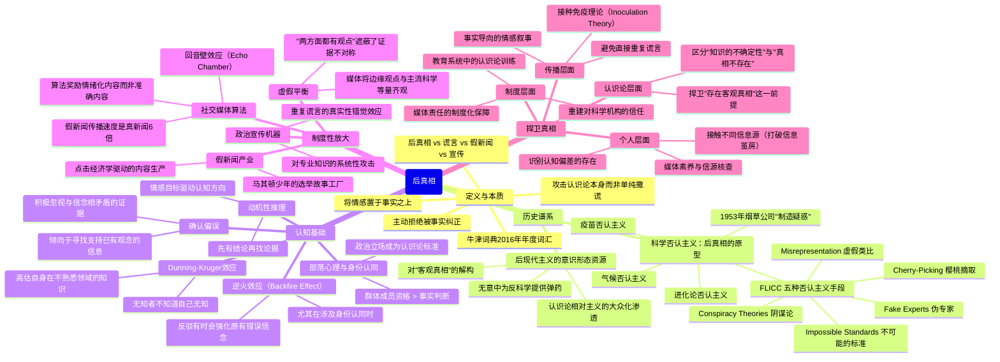
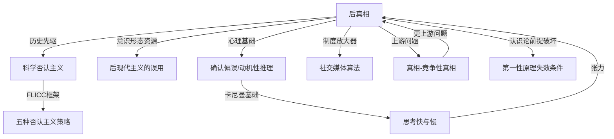

# 《后真相》读书笔记

## 📚 基础信息
- **书名**: 后真相
- **原书名**: Post-Truth
- **作者**: 李·麦金太尔（Lee McIntyre）
- **出版社**: MIT Press（MIT 基本知识系列）
- **出版年份**: 2018年
- **页数**: 约200页
- **阅读状态**: ☐ 正在阅读 ☐ 已完成 ☐ 暂停
- **个人评分**: ⭐⭐⭐⭐⭐
- **标签**: 认识论、政治哲学、科学传播、媒体素养、批判性思维、民主理论

---

## 📖 内容概要

### 书籍简介

李·麦金太尔是波士顿大学科学哲学研究员，长期研究科学否认主义和认识论问题。《后真相》出版于2018年，获 CNN 每周推荐、PBS 年度好书、《福布斯》必读书单，是后真相议题最具分析深度的哲学性著作之一。

**2016 年牛津词典将"Post-truth"（后真相）选为年度词汇**，定义为：*"诉诸情感及个人信仰比陈述客观事实更能影响舆论的情境"*。这一选择本身就是一个历史性时刻的标注：特朗普当选和英国脱欧公投，让这个概念从学术讨论进入了大众视野。

本书的核心论点不是"人们开始说谎了"，而是更深刻也更令人不安的观察：**后真相是对认识论本身的攻击**——不只是对个别事实的歪曲，而是对"什么构成证据"、"谁有资格判断真相"、"真相本身是否存在"这些基础问题的系统性颠覆。

麦金太尔的追问：**当民主社会失去共同的事实基础，政治讨论将变成什么？**

### 核心主题
1. **后真相的精确定义**: 将情感置于事实之上，并拒绝被事实纠正——这是一种文化态度，而非单纯的无知
2. **后真相的历史谱系**: 科学否认主义是后真相的原型和试验场；后现代主义提供了意识形态资源
3. **认知基础**: 确认偏误、动机性推理、部落心理是后真相的神经学和心理学基础
4. **制度性后真相**: 社交媒体算法、假新闻产业、政治宣传机器如何将个体认知偏差放大为社会规模的现象
5. **捍卫真相**: 后真相不是不可对抗的——但反击需要在认识论层面而非单纯事实层面展开

### 主要章节结构

**第一章：什么是后真相**
- "Post-truth"词汇的起源与牛津年度词汇的选择
- 后真相的精确定义：不是谎言，而是对真相的主动拒绝
- 后真相 vs. 假新闻 vs. 宣传的概念区别

**第二章：科学否认主义——后真相的历史先驱**
- 烟草公司的"制造疑惑"策略（1953年起）
- 科学否认主义的五种标准手段（FLICC 框架）
- 气候否认、疫苗否认、进化论否认的共同机制

**第三章：认知偏差如何助长后真相**
- 确认偏误（Confirmation Bias）的神经学基础
- 动机性推理（Motivated Reasoning）：先有结论，再找证据
- 部落心理（Tribal Epistemology）：群体认同优先于真相判断
- 后见之明偏误与高估自身知识的 Dunning-Kruger 效应

**第四章：后现代主义对真相的贡献与责任**
- 后现代主义对"客观真相"的解构
- 从学术圈到政治话语：后现代相对主义的大众化渗透
- 麦金太尔的批评：后现代主义无意中为反科学提供了弹药

**第五章：社交媒体与信息生态的崩溃**
- 算法推荐的回音壁效应（Echo Chamber）
- 假新闻的传播速度比真新闻快六倍（MIT 研究）
- 媒体碎片化与"虚假平衡"（False Balance）
- 信息过载如何反而降低判断能力

**第六章：后真相政治**
- 后真相作为一种政治战略：用情感动员取代事实说服
- 对专业知识的系统性攻击："精英vs.人民"框架
- 重复谎言的"真实性错觉"效应（Illusory Truth Effect）

**第七章：捍卫真相**
- 为什么反驳谎言反而可能强化它（"逆火效应"）
- 有效纠错的策略：接种免疫（Inoculation Theory）
- 重建对科学和专业知识的信任
- 在制度层面捍卫认识论健康

---

## 🧠 知识架构



---

## ✍️ 读书笔记

### 第一章：精确定义——后真相不是谎言

麦金太尔对"后真相"的定义工作是全书最重要的贡献之一。在大众话语中，"后真相"经常被用作"谎言"的委婉说法，但麦金太尔坚持这个区分至关重要：

> "后真相不只是说谎。它是一种态度——一种将情感和意识形态置于事实之上，并**拒绝被事实纠正**的文化倾向。"

关键词是**"拒绝被纠正"**。普通谎言可以被事实推翻；后真相行为者在事实面前不会承认错误——他们的响应是质疑事实来源的可信度、寻找替代性"事实"、或者干脆说"所有人都有自己的事实"。

```
概念区分：

谎言（Lie）：
  说话者知道陈述是假的，但故意陈述
  可以被揭穿，揭穿后理论上应该被接受

假新闻（Fake News）：
  虚假内容以新闻形式呈现
  是谎言的一种媒体化形式

宣传（Propaganda）：
  有系统地利用信息来控制公众舆论
  可以基于真实信息，也可以基于谎言

后真相（Post-Truth）：
  将情感与信仰置于事实之上
  拒绝被证据纠正
  攻击的是"什么算作事实"的认识论前提本身

关键区别：前三者是在真相游戏中作弊，
         后真相是宣布这个游戏本身没有意义
```

---

### 第二章：科学否认主义——后真相的实验室

这是全书历史分析最深入的章节。麦金太尔追溯了后真相的起源，找到了一个令人吃惊的起点：1953年的美国烟草行业。

**烟草公司的"制造疑惑"策略（Manufacturing Doubt）**

1950年代初，大量医学研究已经证实吸烟与肺癌的关联。烟草公司面临的挑战不是反驳这些研究（这几乎不可能），而是防止公众接受它们。他们的策略革命性地改变了后来的信息战：

> **"我们卖的不是香烟，我们卖的是疑惑。"**
> ——Brown & Williamson 内部文件（1969年）

具体操作：
1. 资助可疑的"科学研究"，制造与主流研究对立的声音
2. 雇用一批愿意公开质疑吸烟危害共识的科学家（即使他们是少数派）
3. 通过媒体向公众传达"科学家们仍在争论"的印象
4. 强调"还需要更多研究"，无限期推迟行动

这个策略的天才之处在于：**它不需要证明烟草是安全的，只需要让公众觉得问题还不确定**。只要疑惑存在，消费者就可以推迟改变行为。

这个模板此后被几乎原封不动地复制到：气候变化、进化论、疫苗、酸雨、臭氧层破坏等议题上——有时甚至由同一批人操作（Naomi Oreskes 的《贩卖疑惑的人》有详细记录）。

**科学否认主义的 FLICC 框架**

麦金太尔整理了五种科学否认主义的标准手段，首字母构成 FLICC：

| 缩写 | 策略 | 机制 | 典型案例 |
|------|------|------|---------|
| **F** | Fake Experts（伪专家） | 找到少数持异见的科学家/学者，制造"专家意见分歧"假象 | 烟草公司雇用的科学顾问；气候否认主义中的"31,000名科学家联署" |
| **L** | Logical Fallacies（逻辑谬误） | 用虚假类比、滑坡论证、稻草人攻击等转移焦点 | "过去气候也在变化" ≠ "人类活动不是现在变化的原因" |
| **I** | Impossible Expectations（不可能的标准） | 要求科学提供绝对确定性，否则就"不算证实" | "没有100%的证据就不应该限制烟草/碳排放" |
| **C** | Cherry-Picking（樱桃摘取） | 只引用支持自己观点的数据，忽视整体证据图景 | 引用局部降温数据否认整体全球变暖趋势 |
| **C** | Conspiracy Theories（阴谋论） | 声称主流科学家存在大规模串谋，制造假数据 | "气候科学家为了获得研究经费而伪造数据" |

**关键洞见**：这五种手段不是随机出现的，而是构成了一套系统性的、可复制的认识论攻击工具包。识别出这个框架，就可以在任何议题上快速识别正在发生的否认主义操作。

---

### 第三章：认知偏差——后真相的心理学基础

麦金太尔与卡尼曼的研究形成了深刻的对话关系。卡尼曼描述了认知偏差的机制；麦金太尔展示了这些偏差如何在政治和媒体环境中被放大成系统性的真相崩溃。

**确认偏误（Confirmation Bias）**

人们天生倾向于寻找和记忆支持既有信念的信息，并以更高的批判标准审视与信念相悖的信息。神经影像学研究显示，接触符合偏好的信息时，大脑的奖励回路被激活。

这意味着：**事实纠错在认识论上处于劣势**——错误信念往往更"好喝"。

**动机性推理（Motivated Reasoning）**

更深层的问题：当事实与利益、身份、情感联结相冲突时，人类并非理性地权衡证据，而是先确定期望的结论，再动用认知资源为其辩护。

这不是缺乏智力，而是高度智力的误用：越聪明的人，往往越能为错误立场构建更精致的论证。

**部落认识论（Tribal Epistemology）**

这是麦金太尔认为后真相的核心动力：**"我相信什么"越来越等同于"我的部落相信什么"**。

在这个模型里，接受或拒绝一个主张，不是基于证据分析，而是基于这个主张是否来自"我们"这边，以及接受它是否会伤害群体凝聚力。这让反驳变得极度困难——因为你呈现的每一个反驳证据，都可能被理解为"来自敌对部落的攻击"。

**逆火效应（Backfire Effect）**

罗杰斯和奈赫(Brendan Nyhan & Jason Reifler)的早期研究发现：在某些情况下，提供纠正性证据反而会强化错误信念——被纠正者会感受到威胁，进而更坚定地捍卫原有立场。

（注：后续的复制研究对逆火效应的普遍性产生了质疑，但在强身份认同议题上，这个效应仍然相当可靠。）

---

### 第四章：后现代主义的共谋？

这是全书最具争议性的章节，也是最有思想深度的部分。麦金太尔提出了一个让很多人不舒服的论断：**后现代主义的学术思想，无意中为反科学运动提供了意识形态武器**。

**后现代主义对真相的挑战**

1960-70年代的后现代主义哲学（福柯、利奥塔尔、德里达）对"客观真相"发起了系统性质疑：
- 所有知识都是权力关系的产物
- "科学"是多种可能的"叙事"之一，没有特权地位
- 真相是社会建构的，反映的是特定群体的利益

在学术语境里，这些论点产生了有价值的批判性洞察——揭示了科学制度中的性别偏见、种族偏见、资金影响等真实问题。

**从学院到政治**

问题发生在这些思想从学术圈渗透到政治话语之后。在大众化的过程中，精微的认识论批判被简化为：**"没有客观真相"**——这个结论可以被任何群体（无论立场多么反科学）用来为自己的信念辩护。

```
知识传播链的失真：

学术后现代主义：
  "科学知识是社会建构的，存在权力偏见，需要批判审视"
  （有价值的认识论批评）
              ↓ 大众化简化
政治后现代主义：
  "科学只是一种观点，和其他观点没有本质区别"
  （对科学权威的彻底否定）
              ↓ 政治应用
科学否认主义：
  "气候科学家有自己的政治议程，他们的研究不比我们的更可靠"
  （为利益驱动的否认主义提供认识论掩护）
```

麦金太尔明确：他不是在攻击后现代主义本身的学术贡献，而是指出了一个历史性的意外——当"质疑客观性"的话语工具被从左派学术圈放入政治场域，它往往被右派反科学力量更有效地使用。

这是本书对《真相》（麦克唐纳）提出的竞争性真相理论的一个重要补充：不只是"真相被选择性使用"，而是"真相的存在本身被攻击"——这是更深一层的认识论危机。

---

### 第五章：社交媒体与后真相的工业化

**算法经济学的后真相机器**

社交媒体平台的商业模式是注意力经济：最大化用户在平台上的时间，以便展示更多广告。算法发现，**情绪激活内容（尤其是愤怒、恐惧）**比信息性内容更能驱动分享和互动。

结果：
- 极端化、情绪化的内容在算法推荐中获得系统性的分发优势
- 准确但情感上中立的新闻在参与度指标上竞争不过虚假但情绪激化的内容
- MIT 的 Vosoughi et al. 2018年研究发现：假新闻比真新闻传播得**快6倍、广70%**

**回音壁效应（Echo Chamber）**

算法根据用户的互动历史进行个性化推荐，导致用户越来越多地看到与自己已有观点一致的内容，越来越少看到挑战性观点。

这产生了一个危险的循环：
1. 用户偏好确认性内容（确认偏误）
2. 算法学习这个偏好并提供更多
3. 用户的信念越来越强，对挑战越来越不宽容
4. 群体内的"部落认识论"强化

**虚假平衡（False Balance）**

传统媒体的"客观性"规范要求在争议性话题上呈现"两方面的观点"。但当一方是99%的科学共识，另一方是烟草公司资助的少数异见者时，给予双方等同的媒体版面，是一种虚假的平衡——它系统性地夸大了少数派观点的分量。

---

### 第六章：后真相政治

**真实性错觉效应（Illusory Truth Effect）**

心理学研究发现：重复接触一个陈述，会独立于其内容的真实性，使人对它的可信度评估上升。这意味着：谎言重复足够多次，感觉上就会越来越像真相。

政治宣传家对这个效应的利用由来已久，但社交媒体使其规模化到了前所未有的程度——即使单个用户不相信某个说法，经过算法的反复触达，可信度评估会逐渐提升。

**专业知识的系统性攻击**

后真相政治的一个核心操作是攻击专业知识的权威性：
- "精英专家有自己的利益，他们的判断不代表普通人"
- "大众的常识和直觉比那些读了太多书的人更可靠"
- "你的个人经验和感受和统计数据一样有效"

这种攻击的危险不在于个别案例（专家确实有时候是错的，个人经验也有价值），而在于它系统性地消解了"我们为什么要信任某些判断多于其他判断"的标准——即认识论的基础设施。

---

### 第七章：捍卫真相

**为什么简单的反驳无效**

直接呈现纠正性事实往往效果有限，甚至可能适得其反。原因：
1. 逆火效应：在强身份认同议题上，反驳可能强化原有信念
2. 虚假平衡：媒体对"争议"的报道反而让谎言获得合法性
3. 注意力稀缺：谎言通常更简单、更情绪化，纠正性事实通常更复杂、更平淡

**接种免疫理论（Inoculation Theory）**

研究表明，在错误信息传播之前，提前告诉人们：
1. 某个领域存在特定类型的操纵（例如"你可能会看到有人引用个别科学家来否认气候科学共识"）
2. 解释这种操纵的机制

比事后反驳有效得多。这类似于疫苗接种——用弱化的病原体激活免疫系统，使其在接触真正感染时更有抵抗力。

**在认识论层面反击**

麦金太尔最终的建议不只是"说更多的事实"，而是**在认识论层面反击**——捍卫的不只是具体事实，而是"存在客观真相、证据比情感更可靠"这些基础性的认识论承诺。

这意味着：应对后真相的战斗不是科学传播问题，而是哲学教育问题——帮助公众理解什么是好的证据、什么是认识论操纵、为什么区分这两者对民主社会至关重要。

---

## 💭 深度衍生思考

### 🎯 核心观点延伸

#### 延伸1：《后真相》、《真相》、《黑天鹅》构成了一个完整的认识论三角

这三本书从不同层面处理了同一个认识论困境：

```
认识论困境的三个层面：

《黑天鹅》（塔勒布）：
  问题：即使我们诚实地尝试认识世界，认知边界本身就制造了盲点
  方向：在无法预测的情况下建立鲁棒系统

《真相》（麦克唐纳）：
  问题：即使我们说的都是真话，信息的选择性呈现可以制造任意方向的叙事
  方向：识别竞争性真相框架，主动寻找被压制的视角

《后真相》（麦金太尔）：
  问题：有人在系统性地攻击"什么算作真相"的认识论基础本身
  方向：在认识论层面（而非单纯事实层面）进行反击

三本书合在一起：
  个体认知有边界（黑天鹅）
  + 真相可以被选择性框架（真相）
  + 认识论本身可以被政治化攻击（后真相）
  = 现代信息环境下理解"我们为什么无法形成对现实的共同认识"的完整图景
```

#### 延伸2：科学否认主义的 FLICC 框架在软件工程争论中的对应形式

FLICC 框架本来描述的是反科学运动，但它揭示了一种更普遍的**认识论操纵模式**。在技术决策和工程争论中，可以观察到类似的结构：

| FLICC 策略 | 技术决策中的对应表现 |
|-----------|-------------------|
| **Fake Experts（伪专家）** | 引用一个有背书头衔但没有该领域实际经验的人来支持争议性技术选型 |
| **Logical Fallacies（逻辑谬误）** | "Google 用 X 技术，所以我们也应该用" ← 规模谬误；"这次重构会让整个系统崩溃" ← 滑坡论证 |
| **Impossible Expectations（不可能标准）** | "你不能证明重构一定不会引入新 Bug"← 要求不可能的确定性来阻止合理的技术决策 |
| **Cherry-Picking（选择性引用）** | 只引用支持当前技术栈的案例，忽视其已知的结构性问题 |
| **Conspiracy Theories（阴谋论）** | "架构评审委员会就是想阻碍我们团队" ← 用组织政治解释技术分歧 |

**落地建议**：在重要技术决策的讨论中，用 FLICC 框架做一次快速检查——不是为了指责对方"在否认主义"，而是帮助识别哪些论点是基于证据的理性分析，哪些是认识论操纵。

#### 延伸3：《后真相》挑战了《思考快与慢》的一个乐观假设

卡尼曼的双系统理论隐含了一个相对乐观的假设：系统1（直觉）会犯错，但系统2（理性）通常可以纠正它，前提是激活系统2。

麦金太尔用动机性推理和部落认识论指出了这个框架的局限：**当系统2在强烈情感目标的驱动下运作时，它不是在纠正系统1的偏差，而是在为系统1的偏好构建更精致的理性化论证**。

换句话说：在后真相的极端形式里，激活系统2只会让人更善于为已有立场辩护，而不是更接近客观真相。

这意味着认识论训练（帮助人们理解什么是好的证据）比纯粹的批判性思维训练（如何更好地推理）更重要——因为后者在动机性推理的环境下可能反而增强了认识论扭曲的精密度。

#### 延伸4：后现代主义章节对《第一性原理》的挑战

《第一性原理》的核心是：通过拆解假设、回归基本事实来实现颠覆性创新。这隐含了一个假设：**存在可以被回归的"基本事实"**。

麦金太尔关于后现代主义的分析，揭示了当这个假设本身被政治化攻击时会发生什么：当有人声称"没有基本事实，只有由权力构建的叙事"，第一性原理思维的整个认识论基础就被釜底抽薪了。

**这意味着第一性原理思维需要一个前提条件**：对话各方必须共享对"什么算作好的证据"的基本认识论承诺。在后真相的极端情境里（各方已经放弃了共同的事实基准），第一性原理不再是可以修复分歧的工具——你们的分歧已经在它之前的那一层。

这是《后真相》对整个认识论工具箱最深刻的警告：**在认识论共识崩溃之前，才是使用这些工具的正确时机**。

### 🔍 多角度分析

**反向思考**：麦金太尔关于后现代主义的批评是否过度？批评者指出，后现代主义对科学权威的质疑在某些历史情境下是必要的和正确的——它帮助揭示了冷战时代科学被滥用为政治工具的历史、揭露了医学研究中系统性的性别偏见。麦金太尔的回应是：批评科学实践不等于否认科学方法的认识论有效性；问题不在于质疑，而在于把认识论相对主义从批评工具变成了基本立场。

**跨领域视角**：后真相现象在中世纪宗教战争中有完美对应——当时的"真相之战"同样是关于谁有权威判断真相（教皇？国王？地方主教？），而非关于具体事实的分歧。现代后真相战争只不过是把这场战争的战场从宗教权威转移到了科学权威和媒体权威。麦金太尔的解决方案（重建认识论基础设施）类似于启蒙运动的解决方案——但启蒙运动花了两个世纪。

---

## 🎯 实践应用

### 个人认知层面

**1. FLICC 快速识别清单**

下次遇到一个强烈挑战主流科学共识或专业意见的主张时，快速过一遍：
- 这个观点是否引用了少数派专家来制造"专家分歧"的假象？（F）
- 是否使用了滑坡谬误、虚假类比或稻草人攻击？（L）
- 是否要求不可能的确定性标准？（I）
- 是否只引用了支持其立场的数据而忽视了整体证据？（C）
- 是否暗示了主流观点是有组织的阴谋？（C）

**2. 区分"知识的不确定性"和"真相不存在"**

科学在很多问题上存在真实的不确定性，这是科学的正常状态；但"科学尚有不确定性"不等于"这个问题上所有观点同样有效"。训练自己识别这两个完全不同的陈述。

**3. 接种免疫而非事后反驳**

在可能遇到错误信息的情境前，主动了解这个领域常见的否认主义策略——这比事后反驳更有效。

### 技术传播与沟通层面

**4. 避免提供"虚假平衡"**

在技术文档和架构决策讨论中，"展示两种观点"是好的，但要明确地注明证据的不对称性——不要给边缘技术观点与有大量实证支持的观点等同的篇幅，这是一种读者服务上的失职。

**5. 在认识论层面而非事实层面应对技术争论中的"后真相"行为**

当遇到"你不能证明这个方案一定有问题"（不可能标准策略）或"架构委员会的意见不代表现实"（攻击专业权威）时，不要只在事实层面反驳，而要明确点出认识论操纵模式本身。

---

## 🔗 知识关联网络

### 与已读书籍的关联

**《真相》（麦克唐纳）**：关联强度 ⭐⭐⭐⭐⭐
- 最直接的续作关系（麦金太尔在书中多次推荐《真相》）
- 《真相》讲的是：在没有谎言的情况下，真相如何被选择性操纵（竞争性真相）
- 《后真相》讲的是：在更深一层，"什么算作真相"的认识论基础本身如何被政治化攻击
- 两本书共同构成了从"真相的选择性呈现"到"真相的存在本身被攻击"的完整谱系

**《思考快与慢》（卡尼曼）**：关联强度 ⭐⭐⭐⭐⭐
- 卡尼曼的确认偏误、动机性推理等概念是麦金太尔分析的心理学基础
- **张力点**：卡尼曼的系统2（理性）理论隐含乐观主义；麦金太尔指出动机性推理使系统2可以服务于错误立场，"更好地推理"不足以应对后真相

**《黑天鹅》（塔勒布）**：关联强度 ⭐⭐⭐⭐
- 叙事谬误与后真相的共同根源：人类对简单叙事的偏好使我们容易被操纵
- 后真相是叙事谬误的政治化应用——将对"简单强叙事"的认知偏好武器化

**《第一性原理》**：关联强度 ⭐⭐⭐⭐
- 《后真相》揭示了第一性原理思维的前提条件：各方必须共享对"什么是好的证据"的认识论承诺
- 后真相攻击的正是这个前提条件——使第一性原理思维在极端后真相环境中失效

**《灰犀牛》（渥克）**：关联强度 ⭐⭐⭐
- 科学否认主义是后真相的工具，也是灰犀牛（如气候变化）被系统性忽视的机制
- 灰犀牛的"集体沉默"在后真相时代有了新的机制：不只是"大家都知道但不行动"，而是通过否认主义主动制造"大家不再确定这是真的"的认知状态

### 概念映射



### 知识依赖关系
- **前置建议**：先读《思考快与慢》（提供心理学基础）和《真相》（提供竞争性真相框架），再读本书效果最佳
- **配合阅读**：《贩卖疑惑的人》（Naomi Oreskes）——科学否认主义的历史实证研究
- **后续延伸**：《正义之心》（Jonathan Haidt）——道德基础理论，解释为什么部落认识论如此顽固

---

## 📚 后续阅读路径规划

### 直接延伸
1. **《贩卖疑惑的人》（Merchants of Doubt, Naomi Oreskes）**——关联度 ⭐⭐⭐⭐⭐，优先级：高
   - 麦金太尔科学否认主义章节的历史详版
   - 预期收获：科学否认主义从烟草到气候的完整历史记录

2. **《正义之心》（The Righteous Mind, Jonathan Haidt）**——关联度 ⭐⭐⭐⭐⭐，优先级：高
   - 道德基础理论解释为什么"部落认识论"如此顽固
   - 预期收获：理解为什么向对方呈现事实通常无法改变道德-政治立场

3. **《说谎》（On Bullshit, Harry Frankfurt）**——关联度 ⭐⭐⭐⭐，优先级：中
   - 区分"谎言"与"胡说"（bullshit）的哲学分析；后者更危险，因为说话者根本不在乎真相
   - 预期收获：后真相现象的另一个哲学入口

### 交叉验证
1. **《为什么我们制造胡说》（Why People Believe Weird Things, Michael Shermer）**——关联度 ⭐⭐⭐⭐，优先级：中
   - 从更实证的角度分析阴谋论和伪科学信念的心理学

---

## 📊 学习总结

### 最大的收获

《后真相》给了我一个重新理解当代社会争论的框架转变：**不要问"他们在撒谎吗"，而要问"他们是否在攻击我们共同的认识论基础"**。

这个框架的实用性在于：它把对抗的层次从"事实之争"提升到了"认识论之争"。当有人用 FLICC 框架否认科学共识时，用更多事实反驳他们通常无效——他们的操作目标不是赢得事实辩论，而是制造足够的疑惑，使公众放弃对这个议题的认识论判断。正确的反击在于揭示操纵模式本身，而不是在被操纵设计的战场上迎战。

### 改变的观念

1. **之前**：后真相是一个政治问题，技术人员不太需要关心
   **之后**：FLICC 框架揭示了科学否认主义是一种通用的认识论操纵模式，在技术决策、产品争论、工程评审中都可以观察到类似结构

2. **之前**：更好地传播事实是应对错误信息的核心策略
   **之后**：接种免疫（提前揭示操纵模式）比事后纠正更有效；且应该在认识论层面而非纯粹事实层面展开反击

3. **之前**：卡尼曼的系统2（理性思考）是解决认知偏差的良药
   **之后**：动机性推理使系统2可以服务于错误立场——当情感目标足够强烈，理性能力反而被用来为非理性立场构建更精致的辩护

### 未来行动

- **FLICC 日常应用**：在重要信息消费中，用 FLICC 快速检查是否存在认识论操纵模式
- **技术讨论**：在评审和架构讨论中，区分"基于证据的分歧"和"认识论操纵"，对后者在元层面提出而不是在对象层面迎战
- **接种免疫**：在可能遇到特定类型错误信息的领域，提前了解常见的操纵策略（如气候议题的否认主义手册、AI 安全领域的 FLICC 变体）

---

## 🔗 来源

- MIT Press Official: mitpress.mit.edu/books/post-truth
- Lee McIntyre Official: leemcintyrebooks.com
- Shortform Summary: Post-Truth by Lee McIntyre
- Fareed Zakaria, CNN 推荐书评

---

**笔记创建时间**: 2026-06-22
**最后更新**: 2026-06-22
**笔记版本**: v1.0
