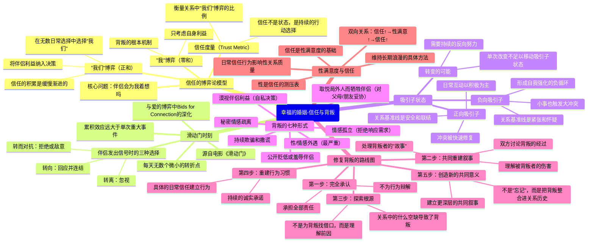
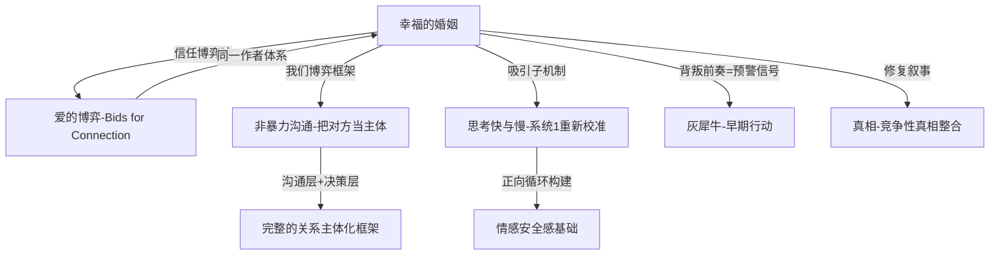

# 《幸福的婚姻》读书笔记

## 📚 基础信息
- **书名**: 幸福的婚姻：男女亲密相处的秘密
- **原书名**: What Makes Love Last? How to Build Trust and Avoid Betrayal
- **作者**: 约翰·戈特曼（John Gottman）& 南·西尔弗（Nan Silver）
- **出版社**: Simon & Schuster / 中信出版社（中译版）
- **出版年份**: 2012年（原版）；2014年（中文版）
- **页数**: 约320页
- **阅读状态**: ☐ 正在阅读 ☐ 已完成 ☐ 暂停
- **个人评分**: ⭐⭐⭐⭐⭐
- **标签**: 婚姻关系、信任、背叛、亲密关系、心理学、博弈论、性关系

---

## 📖 内容概要

### 书籍简介

《幸福的婚姻》是戈特曼继《爱的博弈》之后的进阶之作。如果说《爱的博弈》回答的是"怎样的婚姻是健康的"，那么《幸福的婚姻》回答的是一个更根本的问题：**爱情为何能持久？信任是如何建立、侵蚀和崩溃的？**

本书的核心视角来自一个意想不到的地方：**博弈论**（Game Theory）。戈特曼把婚姻中的信任问题用博弈论的框架重新建模——两个人在无数个日常选择中，是选择"我"还是选择"我们"？这些选择的累积，决定了信任的积累或损耗。

这本书的另一个核心突破是**重新定义了背叛**：背叛不只是性不忠，而是一个连续谱——任何一方在关键时刻选择自己的利益而牺牲伴侣利益的行为，都是某种程度的背叛。这个定义扩展了我们对婚姻危机的理解：很多关系不是因为一次重大背叛而崩溃，而是因为无数次微小的"选择自己"的行为积累。

### 核心主题
1. **信任的博弈论模型**: 信任 = 在面临选择时，持续将伴侣利益纳入决策
2. **背叛的连续谱**: 从日常冷漠到性不忠，背叛有七种主要形式
3. **滑动门时刻**: 关系的转折点存在于每天无数个微小的选择中
4. **吸引子状态**: 关系会稳定在正向或负向的情感模式中
5. **信任的修复**: 即使发生重大背叛，关系也可以重建——但需要彻底诚实和系统性努力
6. **性与信任的关系**: 性满意度与整体信任水平高度相关，两者互为因果

### 主要章节结构

**第一部分：信任的本质**
- 第1章：爱为何衰退——信任的渐进侵蚀
- 第2章：信任的博弈论——"我们"博弈与"我"博弈
- 第3章：滑动门时刻——微小选择如何决定关系命运
- 第4章：吸引子状态——关系如何陷入正向或负向循环

**第二部分：背叛的解剖**
- 第5章：背叛的七种面孔——从日常冷漠到性外遇
- 第6章：背叛的前奏——关系危机的早期信号
- 第7章：当秘密出现——谎言与欺骗的破坏机制

**第三部分：重建信任**
- 第8章：背叛后的诚实——如何进行困难的真相对话
- 第9章：修复路线图——从承认到重建的完整流程
- 第10章：重建承诺——创造新的共同叙事

**第四部分：长期维持**
- 第11章：持续浪漫——在日常中保持激情的方法
- 第12章：性满意度的秘密——信任与亲密的深层联结

---

## 🧠 知识架构



---

## ✍️ 读书笔记

### 第一章：爱为何衰退——信任的渐进侵蚀

大多数婚姻的衰退不是因为一个决定性的时刻，而是因为**无数个微小的背离的积累**。

戈特曼用了一个精准的比喻：信任就像银行里的存款，每一次"你选择了我/我们"是存款，每一次"你选择了自己而牺牲了我/我们"是取款。信任的侵蚀通常不是因为一次大额取款，而是因为长期、持续、微小的取款——每次伴侣有情感需求时的冷漠回应，每次他们的利益需要被考虑时的忽视，每次公开场合里对他们的批评。

**关键洞见**：对于很多处于困境中的婚姻来说，问题不是"发生了什么大事"，而是"什么事情从来没有发生过"——那些应该发生的情感回应、应该得到的支持、应该被看见的时刻，一次次地缺席。

---

### 第二章：信任的博弈论——"我们"博弈与"我"博弈

这是本书最重要的理论创新。戈特曼将信任问题纳入博弈论框架：

```
婚姻关系中的博弈模型：

"我们"博弈（正和博弈 / We-Game）：
  双方的决策都将伴侣的利益纳入考量
  博弈的最优解是双赢
  信任在这种博弈中积累
  
  例：工作邀请需要搬家
  "我们"思维："这对我来说很好，但会影响伴侣。
               我需要和她深度讨论，真正考虑她的感受和利益，
               甚至可能需要拒绝这个机会。"

"我"博弈（零和博弈 / Me-Game）：
  决策只考虑自身利益，伴侣的利益是需要最小化的约束
  
  例：同一个工作邀请
  "我"思维："这对我的职业发展很好。
               我需要说服伴侣接受这个安排。"

问题不是哪个选择更"正确"，
而是哪种思维框架在驱动决策过程。
"我们"博弈不代表永远自我牺牲，
而是对方的利益在你的考量中是真实存在的，而非仅仅是需要管理的障碍。
```

**信任度量（Trust Metric）**：戈特曼提出可以通过以下问题评估关系中的信任水平：
- 当你有需要时，你的伴侣会放下自己的事来帮助你吗？
- 你的伴侣在重要决策中真的考虑你的感受和需求吗？
- 当你受伤时，你的伴侣能真正感受到并回应吗？
- 你的伴侣会在朋友和家人面前维护你吗？

每一个否定的回答，都是信任账户里的一次取款记录。

---

### 第三章：滑动门时刻（Sliding Door Moments）

这个概念源自1998年的电影《滑动门》——同一个女主角因为是否赶上一班地铁，走上了完全不同的人生轨迹。

在婚姻中，**滑动门时刻**是那些看起来微小但实际上是关系命运分叉口的瞬间。戈特曼通过研究发现，这类时刻每天会在一段关系中发生数十次。

```
滑动门时刻的典型场景：

场景1：
  周五晚上，你非常疲惫地回家
  伴侣正坐在沙发上，情绪低落，说："今天真的很糟糕..."
  
  选择A（转向）：放下手机，坐下来，"怎么了？"
                  → 存款：我在这里，我在乎你
  
  选择B（转离）："哦，我也很累，先去洗澡。"
                  → 取款：此刻你的需求不重要

场景2：
  在朋友面前，伴侣讲了一件事，你知道他记错了细节
  
  选择A（转向）：当时不纠正，事后私下提
  选择B（转离）：当场纠正："不是那样的，你记错了"
                  → 取款：在他人面前让伴侣难堪
  
  选择C（转而对抗）："你每次都这样乱说..."
                      → 双重取款：否定 + 羞辱
```

**关键洞见**：在任何一个滑动门时刻，转向的代价通常很小（几分钟的注意力），但累积的信任价值是巨大的。相反，转离通常也"没什么大不了"，但如果成为习惯，就会形成情感隔阂的模式。

大多数婚姻的问题不是"发生了什么重大背叛"，而是"每天都在无数个滑动门时刻选择了转离"。

---

### 第四章：吸引子状态（Attractor States）

这个概念来自混沌理论（Chaos Theory）。复杂系统会趋向稳定在某些特定状态上——即"吸引子"。婚姻关系也是如此：

**正向吸引子**：
- 关系的基准情感氛围是安全和友善的
- 小的冲突和误解会被快速修复
- 伴侣的默认解读是善意的（"他迟到是因为堵车"）
- 日常互动中积极体验是主流

**负向吸引子**：
- 关系的基准情感氛围是紧张和不安全的
- 小事也可能触发大冲突
- 伴侣的行为默认被解读为负面的（"他迟到是因为不在乎我"）
- 形成自我强化的负循环：消极解读 → 防御反应 → 证实了消极解读

```
吸引子状态的自我强化机制：

正向循环：
  基础安全感 → 善意解读伴侣行为
            → 更开放的沟通
            → 更多的情感回应
            → 更高的基础安全感

负向循环：
  基础不安全感 → 防御性解读伴侣行为
              → 更多的四骑士行为
              → 伴侣变得更防御或退出
              → 更低的基础安全感
```

**戈特曼的关键发现**：移动吸引子状态需要**持续的、方向一致的努力**，而不是单次的重大改变。一次浪漫的周年纪念旅行，不足以改变一个已经稳定在负向吸引子的关系；但连续三个月每天一次微小的真诚转向，则有可能真正改变吸引子状态。

---

### 第五章：背叛的七种形式

这是本书最重要的认知扩展。大众文化倾向于把婚姻背叛等同于性不忠，但戈特曼的研究揭示了背叛的完整谱系：

| 背叛类型 | 描述 | 常见误解 |
|---------|------|---------|
| **性/情感外遇** | 与第三方建立排斥伴侣的性或情感关系 | 通常被认为是唯一的"真正"背叛 |
| **秘密情感疏离** | 从伴侣身边情感退出而不告知，内心已经离开婚姻 | 被当作"感情变淡"而非背叛 |
| **自私的重大决策** | 在涉及双方的决策中，只考虑自身利益而忽视伴侣 | 被合理化为"这是我的事" |
| **为取悦局外人而牺牲伴侣** | 向父母、朋友或同事妥协，以伴侣的利益为代价 | 被视为"孝顺"或"社交需要" |
| **持续的欺骗和谎言** | 系统性地对伴侣隐瞒重要信息或撒谎 | 被合理化为"不想让他担心" |
| **情感孤立** | 当伴侣有情感需求时持续拒绝回应 | 被视为"我不擅长表达情感" |
| **公开贬低或羞辱** | 在他人面前批评、嘲讽或贬低伴侣 | 被视为"开玩笑" |

**关键洞见**：这七种背叛的共同本质都是同一件事——**"我"博弈压倒了"我们"博弈**。每一种背叛都是在一个关键时刻，选择了自己的利益（舒适、便利、情感满足、社会压力）而牺牲了伴侣和关系。

另一个重要洞见是**背叛的累积性**：即使没有一次大的背叛，长期的小背叛也会侵蚀信任到同样的程度。很多关系崩溃的原因，不是能被指出的某一件事，而是多年来无数次微小背叛的积累。

---

### 第六章：背叛的前奏——关系危机的早期信号

戈特曼发现，重大背叛（尤其是外遇）通常不是突然发生的，而是在一系列早期信号被忽视之后。

**外遇前的关系危机信号**：
1. 伴侣长期感到在婚姻中不被看见或不被欣赏
2. 大量批评和蔑视积累，缺乏修复尝试
3. 情感联结减少，Bids for Connection被持续忽视
4. 在外部关系（工作、友谊、网络）中寻求情感满足
5. 关系中的冲突已无法修复，进入"已放弃"状态

这些信号的意义不在于"谁的错"，而在于：**外遇更多是婚姻危机的症状，而不是原因**。预防外遇的最有效方式，是维持健康的情感联结——而不是监控伴侣的行为。

---

### 第八章：背叛后的诚实——困难的真相对话

一旦背叛（尤其是外遇）发生，如何处理随后的对话，是关系能否修复的关键。

戈特曼对"背叛后的诚实"有反直觉的研究发现：**渴望"把所有一切都告诉伴侣"的冲动，有时并不有利于修复**。关键不是信息量，而是信息的方式和目的：

```
背叛后诚实对话的原则：

❌ 不利于修复的诚实模式：
  - 以详细描述换取"道德洁净感"
    （把细节都说出来以减轻自己的内疚）
  - 为背叛行为提供解释（"是因为我们关系出了问题"）
    在承认责任之前提供解释 = 辩解
  - 把对方对细节的追问视为"需要满足"
    （有时追问是焦虑的表现，满足追问反而加重焦虑）

✅ 有利于修复的诚实模式：
  - 首先完全承担责任，不附加任何解释
  - 承认对方的痛苦是真实和正当的
  - 提供改变的具体承诺（而非承诺"不会再发生"）
  - 在伴侣准备好之前，不强迫进入修复对话
```

---

### 第九章：修复路线图

背叛发生后，关系修复是一个非线性的、需要时间的过程。戈特曼提出了五个核心步骤：

**步骤1：完全承认（Full Acknowledgment）**
不为行为辩解，不减轻，不比较。被背叛的一方需要首先感到伤害被完全承认，才能进入下一步。

**步骤2：共同重建叙事（Rebuilding the Story）**
双方一起讨论背叛发生的经过——不是为了分配责任，而是为了双方都理解发生了什么、对方的经历是什么。这个过程通常需要多次对话。

**步骤3：探索关系根源（Exploring the Context）**
这一步骤必须在步骤1完成之后才能进行。探索的目的是理解"关系中的什么状态使背叛成为可能"——不是为背叛者开脱，而是为修复找到真正的着力点。

**步骤4：重建日常信任行为（Rebuilding Trust Behaviors）**
信任不是通过承诺重建，而是通过行为重建。背叛者需要通过具体的、可见的、一致的行为来重新积累信任存款——通常这需要数月甚至数年。

**步骤5：创造新的共同意义（Creating New Shared Meaning）**
修复的目标不是"回到背叛之前"，而是创造一段新的、更深刻的关系——一段已经经历了试炼并在另一端重新相遇的关系。这需要双方共同建构关于"我们是谁，背叛告诉了我们什么，我们选择了什么"的新叙事。

---

### 第十一章：持续浪漫——在日常中保持激情

戈特曼关于长期婚姻中保持浪漫的研究，反驳了两个常见的误解：

**误解1："激情会随时间自然消退"**
戈特曼的研究发现，激情的消退不是时间的必然结果，而是情感联结持续减少的结果。维持情感联结的夫妻，在婚后数十年仍能报告高度的性满意度和浪漫感。

**误解2："需要制造特别时刻来保持浪漫"**
研究发现，浪漫更多来自于日常的微小联结时刻，而非特别的大事件。每天的简短联结（真正的"今天怎么样"对话、睡前的简单告别、一个真实的拥抱）比偶尔的豪华旅行对关系满意度的影响更大。

---

### 第十二章：性满意度的秘密

这是本书最直接但在婚姻书籍中最常被回避的主题。戈特曼的研究发现：

**性满意度与信任水平高度相关，两者互为因果**：
- 高信任 → 更高的情感安全感 → 更深的性亲密 → 更高的性满意度
- 高性满意度 → 更强的情感联结感 → 更高的信任

性满意度低的主要原因（不是技巧问题）：
1. **情感安全感不足**：无法在脆弱状态中感到安全
2. **未解决的怨恨**：积累的批评和蔑视在性关系中重现
3. **情感联结缺失**：日常的情感断开使得性关系变得机械
4. **沟通回避**：无法真实地表达性需求和偏好

戈特曼的核心建议：**提升性关系的关键不在于卧室，而在于日常的情感联结质量**。

---

## 💭 深度衍生思考

### 🎯 核心观点延伸

#### 延伸1：《幸福的婚姻》与《爱的博弈》的互补关系

这两本书是同一理论体系的两个层次：

```
《爱的博弈》：
  问题："什么样的婚姻是健康的？"
  答案：建立在深厚友谊上、有效管理冲突的婚姻
  工具：四骑士、七个原则、情感银行账户

《幸福的婚姻》：
  问题："爱情为何持久？信任如何建立和破裂？"
  答案：信任来自在无数个滑动门时刻选择"我们"而非"我"
  工具：博弈论模型、背叛谱系、修复路线图

两本书的关系：
  《爱的博弈》是"如何构建"
  《幸福的婚姻》是"如何维持和修复"
  合在一起：从0到1（建立）+ 从1到∞（维持）+ 从危机重建（修复）
```

#### 延伸2：博弈论框架与《非暴力沟通》的深层同构

NVC的核心是：在冲突中，识别对方的感受和需求，而不是只看到自己的。

戈特曼的"我们"博弈核心是：在决策中，将伴侣的利益真实地纳入考量，而不是只算自己的得失。

两者都在描述同一件事：**把另一个人当作真实存在的主体，而非实现自己目标的工具或障碍**。

区别在于层次：
- NVC 处理的是**沟通时刻**的态度
- 戈特曼博弈论处理的是**决策时刻**的态度
- 两者共同构成了"把伴侣当作完整主体"的完整框架

#### 延伸3：背叛的七种形式——这本书挑战了"只要没有外遇就没问题"的认知

很多人（尤其是男性）把婚姻信任理解为一个二元问题：有没有外遇。戈特曼的框架把这个认知彻底打开了——**没有外遇不代表没有背叛**。

每次在双方都在场的饭局上，你取笑或纠正伴侣，是背叛。
每次在涉及两个人的重要决策上，你"告知"而不是"商量"，是背叛。
每次伴侣情绪低落时，你选择刷手机而不是问一声，是背叛。

这个认知框架在文化上是有冲击性的，因为它把"情感忽视"和"以父母为借口牺牲伴侣"等行为也归入了背叛的谱系——而这些在很多文化中是被默认接受的。

#### 延伸4：吸引子状态与《思考快与慢》的结合

戈特曼的负向吸引子状态，可以用卡尼曼的框架来解释机制：

负向吸引子建立后，伴侣的任何行为都会被系统1自动解读为负面。这不是有意识的选择，而是系统1对环境的适应性学习——在长期的威胁信号积累后，大脑重新校准了"默认解读框架"。

这意味着：**在负向吸引子状态的婚姻中，改变沟通技巧效果有限**，因为技巧是系统2层面的工具，而问题已经沉降到了系统1的默认解读层。真正的改变需要在系统1层面重新校准——通过持续、一致的正向体验，慢慢改变大脑的默认解读。

这解释了为什么戈特曼强调"持续"而非"努力"：系统1的重新校准需要时间和重复，而不是强度。

#### 延伸5：修复路线图与《灰犀牛》的应用

婚姻危机是一个典型的灰犀牛——信号通常在数年前就已出现（情感联结减少、批评增加、滑动门时刻的持续转离），但往往被推迟处理直到危机爆发。

修复路线图的五步，可以理解为灰犀牛的"行动"阶段——当危机已经爆发，如何进行最有效的应对。

但更重要的洞察是：**背叛不应该等到发生之后才处理**。戈特曼的背叛前奏（第六章）实际上是在提供一个早期预警系统——通过监测关系的信任水平，在灰犀牛还没有冲来时就开始行动。

### 🔍 多角度分析

**反向思考**：戈特曼的"我们"博弈框架，是否过度强调了自我牺牲的必要性？批评者指出，健康的关系需要双方都有能力说"不，这次我的需求更重要"，而不是把"我们"思维内化为永远把伴侣置于自己之前。戈特曼的回应可能是：真正的"我们"思维包含了真实地表达自己的需求（而非总是屈服），区别在于做决策时对方的感受是否在你的考量中真实存在。

**跨文化视角**：背叛的七种形式中，"为取悦局外人而牺牲伴侣"这一条，在不同文化中有完全不同的含义。在强调家族义务的文化中，对父母的服从被视为美德而非背叛；而戈特曼的框架（来自西方个人主义文化）把夫妻二元关系置于原生家庭关系之上。这个文化预设值得读者结合自身文化背景批判性地审视。

---

## 🎯 实践应用

### 信任建立的日常习惯

**1. 滑动门时刻意识训练**

每天选择三个时刻，刻意转向而非转离：
- 伴侣分享任何事情时（无论多小），先放下当前的事，给予15秒完全在场
- 伴侣表现出情绪（任何情绪）时，用一句话确认："你看起来有些[担心/疲惫/开心]？"
- 在决定任何影响双方的事情之前，多问一句："你觉得呢？"

**2. "我们"博弈检查**

在做重要决策前，用以下问题做快速检查：
- 我有没有真正了解这个决策会如何影响我的伴侣？
- 我的伴侣的利益在我的决策过程中是真实的考量，还是只是需要"沟通"的结果？
- 如果立场互换，我希望伴侣如何处理这个决策？

**3. 背叛前奏预警检查（每月一次）**

主动评估关系健康度：
- 我的伴侣最近有没有感到被忽视或不被欣赏？
- 我们之间的情感联结感是增强还是减弱了？
- 过去一个月，我有没有在任何人面前批评或贬低过我的伴侣？

### 危机修复工具

**4. 背叛对话的开场框架**

当需要进行关于信任受损的对话时：
1. **首先不解释，只承认**："我知道我[具体行为]伤害了你，我对此负全责。"
2. **确认对方的体验**："我想听你说，这对你来说意味着什么。"
3. **在对方准备好之前，不提关系根源**（不要说"这是因为我们之间..."）

---

## 🔗 知识关联网络

### 与已读书籍的关联

**《爱的博弈》（戈特曼）**：关联强度 ⭐⭐⭐⭐⭐
- 同一作者，同一理论体系，直接延续
- 《爱的博弈》：如何构建健康婚姻（七个原则）
- 《幸福的婚姻》：如何维持信任、识别和修复背叛
- 两本合在一起才构成戈特曼框架的完整体系

**《非暴力沟通》（罗森伯格）**：关联强度 ⭐⭐⭐⭐⭐
- "我们"博弈 = NVC 的"把对方当作完整主体"在决策层面的应用
- 背叛的识别 = NVC 中感受到需求未被满足的系统性累积
- 两者共同构成了"全面以伴侣为真实主体"的关系框架

**《思考快与慢》（卡尼曼）**：关联强度 ⭐⭐⭐⭐
- 吸引子状态（负向循环）= 系统1被训练成默认的负面解读框架
- 信任侵蚀的心理机制：系统1在习惯了威胁信号后，会重新校准"默认解读"
- 修复需要持续而非高强度：系统1的重新校准靠重复，而非努力

**《灰犀牛》（渥克）**：关联强度 ⭐⭐⭐⭐
- 婚姻危机是经典灰犀牛：信号早已出现，却被推迟处理
- 背叛前奏（第六章）= 婚姻危机灰犀牛的早期预警系统
- 修复路线图 = 灰犀牛已冲来时的应急响应框架

**《真相》（麦克唐纳）**：关联强度 ⭐⭐⭐
- 背叛后双方对同一事件的叙事往往是不同的竞争性真相
- 修复路线图的"共同重建叙事"步骤，本质上是让双方的竞争性真相都被听见并整合

### 概念映射



### 知识依赖关系
- **前置建议**：先读《爱的博弈》，本书是其直接延续，很多概念建立在《爱的博弈》基础上
- **配合阅读**：《非暴力沟通》——两者互补性极强，合在一起提供了关系中"说什么"和"为谁考量"的完整框架
- **后续延伸**：《Hold Me Tight》（Sue Johnson）——依恋理论视角，解释了信任需求背后更深的情绪系统

---

## 📚 后续阅读路径规划

### 直接延伸
1. **《Hold Me Tight》（Sue Johnson）**——关联度 ⭐⭐⭐⭐⭐，优先级：高
   - 依恋理论：所有信任需求背后都是"你会在我需要时出现吗"的依恋焦虑
   - 预期收获：理解信任崩溃的情绪根源，比戈特曼更深入情感机制

2. **《亲密关系》（Rowland Miller）**——关联度 ⭐⭐⭐⭐，优先级：中
   - 亲密关系研究的全景综述，戈特曼在其中的位置
   - 预期收获：更广泛的学术视角和其他研究者的发现

---

## 📊 学习总结

### 最大的收获

**《幸福的婚姻》把婚姻信任从一个模糊的情感概念，变成了一个可以分析的行为模式**：信任是在无数个日常选择中，选择"我们"还是选择"我"的积累。这个框架的价值在于它的可操作性——不需要等到"感觉到信任"，而是可以通过具体的行为选择来构建或侵蚀信任。

第二个重要收获是**背叛谱系的扩展**：意识到背叛不只是外遇，还包括日常的情感忽视、为讨好他人而牺牲伴侣、在重要决策中排除伴侣——这些可能才是更普遍、更持续地侵蚀婚姻信任的行为。

### 改变的观念

1. **之前**：婚姻健康的底线是"没有外遇"
   **之后**：没有外遇只是背叛谱系的一个极端；日常的情感忽视和"我"博弈思维同样是背叛的形式，且往往更难被命名和处理

2. **之前**：婚姻出问题是因为某些关键事件
   **之后**：大多数婚姻问题来自每天数十次微小滑动门时刻的持续转离积累；关系更多由日常微小模式决定，而非关键事件

3. **之前**：从背叛中修复需要的主要是"原谅"和"遗忘"
   **之后**：真正的修复不是遗忘，而是五步骤的系统过程，其中"创造新的共同意义"（整合背叛为关系历史的一部分）是最深刻也最难的一步

### 未来行动

- **立即**：意识并记录今天的三个滑动门时刻——我在那些时刻选择了转向还是转离？
- **日常**：在涉及双方的任何决策前，多问一步："我真的考虑过他/她的感受和利益了吗，还是只是在通知他/她？"
- **定期**：每月做一次"信任账户状态"评估——过去这个月，我有没有做过任何背叛谱系中的事情？

---

## 🔗 来源

- Shortform Summary: What Makes Love Last by John Gottman
- The Gottman Institute: gottman.com
- Gottman Institute Research: gottman.com/about/research

---

**笔记创建时间**: 2026-06-22
**最后更新**: 2026-06-22
**笔记版本**: v1.0
