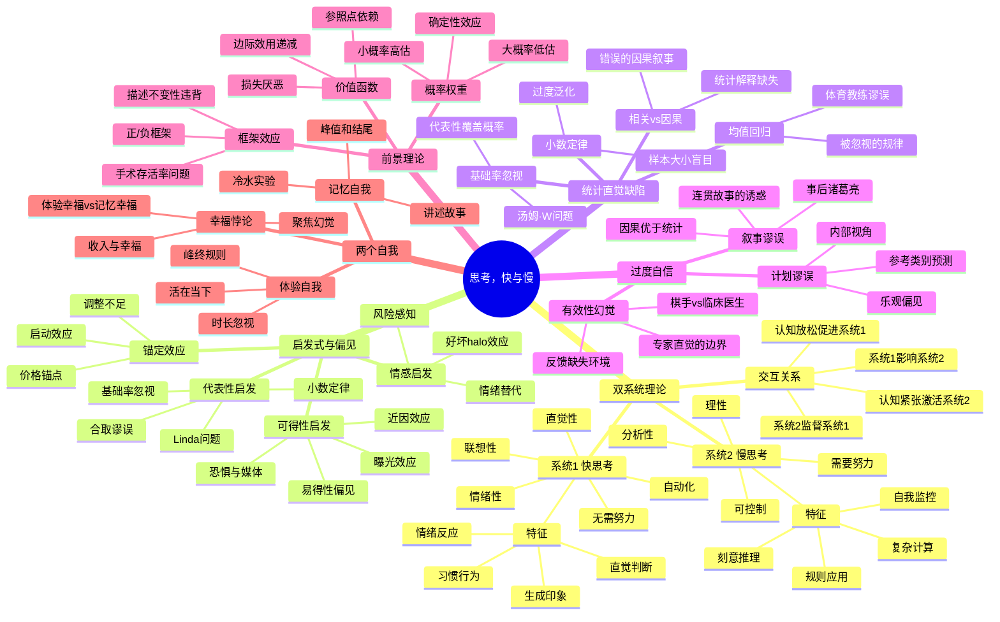
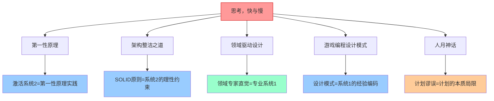

# 📚 思考，快与慢

# Part 1：书籍内容梳理归纳

## 📖 基本信息

- **书名**: 思考，快与慢
- **原名**: Thinking, Fast and Slow
- **作者**: 丹尼尔·卡尼曼（Daniel Kahneman）
- **出版社**: Farrar, Straus and Giroux（英文原版）/ 中信出版社（中译本）
- **出版年份**: 2011（原版）/ 2012（中译本）
- **页数**: 约499页
- **译者**: 胡晓姣、李爱民、何梦莹
- **难度等级**: 中高级（需要一定心理学基础或认知开放度）
- **阅读状态**: ✅ 已完成
- **个人评分**: ⭐⭐⭐⭐⭐
- **创建时间**: 2026-06-03
- **标签**: 认知科学, 行为经济学, 心理学, 决策理论, 双系统理论, 启发式偏见, 诺贝尔经济学奖

---

## 📝 内容概要

### 书籍简介

《思考，快与慢》是诺贝尔经济学奖得主丹尼尔·卡尼曼（Daniel Kahneman）的集大成之作，系统总结了他与阿莫斯·特沃斯基（Amos Tversky）数十年的认知心理学与行为经济学研究成果。本书的核心是"**双系统理论**"——人类大脑存在两套并行的思维系统：系统1（快速、直觉、自动）和系统2（缓慢、分析、理性），二者的交互决定了人类的判断与决策方式。

全书从认知偏见的实验证据出发，揭示了人类在不确定性下决策时的系统性错误——这些错误不是随机的，而是由大脑的运作方式所决定的。这一发现从根本上挑战了传统经济学"理性人"假设，开创了行为经济学这一全新领域。

### 核心主题

1. **双系统理论** — 系统1与系统2的协作与冲突
2. **启发式与偏见** — 快速判断的捷径如何造成系统性错误
3. **前景理论** — 损失厌恶与价值函数的非对称性
4. **统计直觉的缺失** — 人类天生对概率和统计的错误理解
5. **两个自我** — 体验自我与记忆自我的分裂
6. **过度自信** — 计划谬误与叙事谬误

### 主要章节结构

| 部分 | 章节范围 | 核心主题 |
|------|---------|---------|
| 第一部分：两个系统 | 第1-9章 | 系统1/2的定义、运作方式、注意力、认知放松 |
| 第二部分：启发式与偏见 | 第10-18章 | 小数定律、锚定、可得性、代表性启发 |
| 第三部分：过度自信 | 第19-24章 | 预测幻觉、有效性幻觉、回顾性偏见、计划谬误 |
| 第四部分：经济选择 | 第25-34章 | 前景理论、损失厌恶、禀赋效应、框架效应 |
| 第五部分：两个自我 | 第35-38章 | 体验效用、峰终定律、记忆自我 vs 体验自我 |

---

## 🧠 知识架构



---

## 🔍 核心概念深度解析

### 第一章：系统1与系统2——大脑的双轨运行

**双系统的根本区别：**

```
双系统对比框架
══════════════════════════════════════════════════════════
                  系统1（快思考）      系统2（慢思考）
──────────────────────────────────────────────────────────
运作方式          自动、无意识          刻意、有意识
速度              快速                  缓慢
认知消耗          极低                  高
控制能力          不受意志控制          可主动控制
典型场景          情绪反应、直觉        数学计算、逻辑推理
错误类型          系统性偏见            偶尔失误（疲劳时）
进化起源          古老，情绪脑          较新，前额叶皮层
──────────────────────────────────────────────────────────
```

**关键洞察：系统2是"懒惰"的**

系统2虽然理性，但它的默认状态是懒惰——只要系统1能给出"可接受"的答案，系统2就不会干预。这解释了为什么大多数决策错误来自于"系统1主导，系统2怠工"：

```
决策流程示意
┌─────────────────────────────────────────────────┐
│                  面临判断/决策                    │
└────────────────────┬────────────────────────────┘
                     ↓
         ┌───────────────────────┐
         │ 系统1自动生成直觉答案  │
         └───────────┬───────────┘
                     ↓
         ┌───────────────────────┐
         │ 系统2检查是否合理      │
         └───────────┬───────────┘
                ↙         ↘
    感觉合理，接受      感觉有问题，接管
    （大多数情况）       （少数情况）
         ↓                   ↓
     快速直觉答案        缓慢分析答案
     （可能有偏见）       （更准确但耗时）
```

---

### 第二章：注意力与认知放松

**认知放松（Cognitive Ease）的深远影响：**

当环境触发认知放松时，系统1占主导，人倾向于：
- 相信信息（即使是假的）
- 感觉良好
- 避免严格检验
- 更依赖直觉

**认知放松的触发因素：**

| 触发因素 | 示例 | 效果 |
|---------|------|------|
| 重复曝光 | 多次看到某品牌名字 | 增加好感和信任度 |
| 清晰字体 | 问卷用清晰字体打印 | 答题更快，感觉更难 |
| 良好心情 | 晴天/微笑 | 更依赖直觉，创造力更强 |
| 语言流畅性 | 公司名字易读 | 股价表现更好 |
| 启动效应 | 先看"吃"再看"苹果" | "苹果"更快被识别 |

**实用启示：重要决策前制造"认知紧张"**
- 用不熟悉的字体写下你的假设（迫使系统2介入）
- 在决策时故意问"反常规的理由是什么？"
- 不要在心情极好时做重大财务决策

---

### 第三章：代表性启发——"长得像"的陷阱

**Linda问题（合取谬误的经典案例）：**

```
Linda问题：
Linda 31岁，单身，直率，聪明。大学时主修哲学，
深度关注歧视和社会公正问题，曾参加反核游行。

以下哪个更可能？
A. Linda是银行出纳员
B. Linda是银行出纳员，同时积极参与女权运动

──────────────────────────────────────
超过80%的受试者选择B

逻辑错误：
P(A∩B) ≤ P(A)  [合取概率不可能超过单项概率]

为什么人们选B？
因为B更符合Linda的"代表性"——系统1用代表性
替换了概率判断，忽略了集合关系的逻辑约束。
```

**基础率忽视（Base Rate Neglect）：**

```
汤姆·W 问题：
描述一个内向、喜欢秩序、热爱科幻的人，
问他更可能是图书馆员还是农民？

直觉答案：图书馆员
正确推理：美国农民数量是图书馆员的10倍以上
         即使农民中内向者比例更低，
         农民总量的概率基数决定了答案
         
教训：忽视基础率（Prior Probability）是
     代表性启发最常见的错误
```

---

### 第四章：可得性启发——"想起来的"≠"常见的"

**可得性启发的运作原理：**

```
可得性链条
┌─────────────────────────────────────────────────────┐
│  事件X发生频率评估                                    │
│                                                     │
│  大脑实际做的：                                      │
│  "我能想起多少X的例子？"                              │
│  "想起来有多容易？"                                   │
│                                                     │
│  替换了真正应该问的：                                 │
│  "X的真实统计频率是多少？"                            │
└─────────────────────────────────────────────────────┘
```

**典型案例对比：**

| 真实情况 | 人们的感知 | 原因 |
|---------|-----------|------|
| 飞机比汽车安全得多 | 飞机更危险 | 空难新闻显著，车祸新闻不显著 |
| 鲨鱼袭击极罕见 | 鲨鱼很危险 | 鲨鱼袭击案例鲜活可记 |
| 中风死亡多于事故 | 事故死亡更多 | 事故场景更生动 |
| 字母K开头的单词更少 | 字母K开头的更多 | 按首字母比中间字母更容易回忆 |

**可得性启发的"后门"：**
情感的鲜活性 > 频率的真实性。这解释了为什么恐怖袭击（极罕见但极可怕）对政策的影响远超交通事故（极常见但平淡）。

---

### 第五章：锚定效应——数字的引力场

**锚定实验（轮盘赌实验）：**

```
实验设计：
1. 在受试者面前转动一个轮盘（事先设定只停在10或65）
2. 问：联合国中非洲国家的比例高于还是低于这个数字？
3. 问：你估计实际比例是多少？

结果：
轮盘停在10 → 受试者平均答案：25%
轮盘停在65 → 受试者平均答案：45%

关键：轮盘数字明显与非洲国家比例无关，
     但仍然对估计产生了巨大影响！
```

**锚定效应的两种机制：**

```
机制1：调整不足（系统2）
  从锚点出发 → 向合理区间调整 → 调整通常不足
  
  ┌────┐                      ┌────┐
  │ 锚  │ ─── 调整（不足）──→ │估计│
  └────┘                      └────┘

机制2：启动效应（系统1）
  高锚点 → 激活脑中"大数"的联想 → 估计偏高
  低锚点 → 激活脑中"小数"的联想 → 估计偏低
  （无需意识介入，自动发生）
```

**日常锚定陷阱：**
- 房地产定价：标价是强锚点，讨价还价总在其附近
- 工资谈判：先开口方设定锚点，后开口方被动
- 零售折扣：原价是折扣价的锚（"原价999，现价299"）

---

### 第六章：统计直觉的系统性失败

**均值回归（Regression to the Mean）——最被误解的统计概念：**

```
均值回归示例：以色列空军飞行员训练
────────────────────────────────────────────────
观察：
  • 飞行员表现出色时，教官表扬 → 下次表现变差
  • 飞行员表现糟糕时，教官批评 → 下次表现变好

教官的结论：
  "表扬会让人骄傲放松，批评才能促进进步！"

真实原因（统计）：
  任何随机变量的极端值（高或低）之后，
  下一次观测必然向均值靠拢——这与教官的
  行为没有任何关系！

教训：
  在有随机成分的系统中，不要对"极端表现后的
  改变"进行因果性解释
────────────────────────────────────────────────
```

**小数定律（Law of Small Numbers）——过度相信小样本：**

```
思想实验：
美国各县肾癌发病率统计

发病率最低的县：大多在中西部农村地区
→ 直觉解释："农村生活方式更健康、空气更好"

发病率最高的县：也大多在中西部农村地区！
→ 直觉解释：???

真相：小样本统计噪声更大，极端值（高和低）
     都更可能出现在人口稀少的县
     两个现象都只是小数定律的体现，
     与生活方式无关
```

---

### 第七章：过度自信——计划谬误与叙事谬误

**计划谬误（Planning Fallacy）的解剖：**

```
计划谬误的结构
┌──────────────────────────────────────────────────┐
│                                                  │
│  内部视角（默认）：               外部视角（被忽视）│
│  • 关注本次任务的细节              • 类似项目历史数据│
│  • 相信"这次不一样"               • 参考类别的均值  │
│  • 想象顺利执行的路径              • 基础率统计      │
│  • 乐观估计每个步骤                             │
│                                                  │
│  结果：一贯低估时间、成本、风险                  │
└──────────────────────────────────────────────────┘

修正方法：参考类别预测（Reference Class Forecasting）
  1. 找到与本项目类似的"参考类别"（历史同类项目）
  2. 统计该类别的平均完成时间/成本
  3. 以参考类别的均值为基准，再做个性化调整
```

**叙事谬误（Narrative Fallacy）：**

人类大脑会自动为事件编织因果故事，即使事件是随机发生的：
- 金融市场：成功的基金经理总有"令人信服的投资哲学"
- 创业历史：成功者的"必然之路"在当时并不必然
- 体育解说：每次得分都有"战术意图"的解释

```
叙事谬误的危害：
事后解释  →  过度自信  →  低估未来不确定性
  ↑                              ↓
  └──────── 下一个"意外"发生 ←──┘
```

---

### 第八章：前景理论——决策的非理性地图

**前景理论（Prospect Theory）是卡尼曼最重要的学术贡献：**

```
效用函数对比
┌─────────────────────────────────────────────────┐
│                                                 │
│  传统经济学：期望效用理论                         │
│  效用 ↑                                         │
│       │          /                              │
│       │        /                               │
│       │      /                                 │
│       │    /                                   │
│       └──────────────────── 财富               │
│  特征：绝对财富水平决定效用                       │
│                                                 │
│  前景理论：价值函数                              │
│  价值 ↑         /                              │
│       │       / 收益区（斜率递减）               │
│  ─────┼─────/──────────── 损益                 │
│       │  /                                     │
│       │/  损失区（斜率更陡）                     │
│       ↓                                        │
│  特征：以参照点为原点，损失比同等收益感受更强烈    │
└─────────────────────────────────────────────────┘
```

**损失厌恶（Loss Aversion）——最重要的行为经济学发现：**

```
损失厌恶系数
损失$100的痛苦 ≈ 获得$200的快乐

实验验证：
掷硬币赌局
  正面：赢得X元
  反面：输掉100元
  
  问：X最少要是多少你才愿意参与？

大多数人的答案：约200元
（理性人应该在X=100时就愿意参与，因为期望值>0）
```

**框架效应（Framing Effect）——描述方式改变决策：**

```
经典实验：亚洲病例问题
───────────────────────────────────────────────
假设美国面临一种罕见亚洲病，600人将死亡

方案A：能救200人
方案B：1/3概率救所有人，2/3概率无人获救

结果：72%选A（确定性的收益框架）

换一种描述（完全相同的期望值）：

方案C：400人将死亡
方案D：1/3概率无人死亡，2/3概率600人全部死亡

结果：78%选D（确定性的损失框架）

A=C，B=D，但描述方式不同，选择逆转！
───────────────────────────────────────────────
```

**概率权重函数（Probability Weighting）：**

```
人们对概率的主观感知
客观概率    主观权重   心理效应
─────────────────────────────────
1%          5-8%      小概率被高估（彩票、保险）
10%         18%       中小概率被高估
50%         42%       中等概率被低估
90%         71%       较大概率被低估
99%         91-93%    大概率接近确定性被低估
100%        100%      确定性效应（与99%的差值极大）
─────────────────────────────────
```

---

### 第九章：两个自我——体验的真相

**体验自我 vs 记忆自我：**

```
两个自我的根本分裂
══════════════════════════════════════════════════
体验自我（Experiencing Self）   记忆自我（Remembering Self）
──────────────────────────────────────────────────
活在每个时刻                    回顾过去的故事
感受真实痛苦和快乐              记录和诠释经历
时长敏感                        时长不敏感
峰值和结尾的平均                峰值和结尾（峰终规则）
无法被询问（只能实时测量）       可以被询问（但不可靠）
══════════════════════════════════════════════════
```

**峰终定律（Peak-End Rule）的实验证据：**

```
冷水实验（卡尼曼经典实验）：
──────────────────────────────────────────────────
条件A：手在14°C冷水中浸泡60秒

条件B：手在14°C冷水中浸泡60秒，
       然后水温升到15°C，再浸泡30秒

结果：
• 条件A总体验更舒适（少30秒痛苦）
• 但大多数受试者选择重复条件B！

解释：
  条件B的结尾（15°C）比条件A的结尾（14°C）稍好
  → 记忆自我将条件B评为"更好的经历"
  → 尽管体验自我多承受了30秒痛苦

应用：
  手术结束时让患者感受更舒适（即使延长时间）
  → 记忆中手术"没那么痛"
  → 提高就医依从性
──────────────────────────────────────────────────
```

**两个自我的政策困境：**

```
问题：我们应该最大化哪个自我的幸福？

体验自我优先 → 活得舒适，但记忆痛苦
记忆自我优先 → 可以牺牲当下体验来创造好故事

现实中：人们大多数时候让记忆自我做决策
（因为只有记忆自我能回答"你幸福吗？"）

但这造成了"聚焦幻觉（Focusing Illusion）"：
  当你被问到某件事时，你会高估它对幸福的影响
  "Nothing in life is as important as you think it is 
   while you are thinking about it."
```

---

## ✍️ 读书笔记

### 🔖 重点摘录

> "系统1能够产生令人惊讶的复杂思维模式，但系统2不会深入了解这些模式——它通常会接受系统1的建议，几乎不加修改地认可直觉印象。"

> "这是认知错觉：就像视觉错觉一样，你知道那是错的，但它看起来还是那样。"

> "我们相信我们能理解过去，这意味着我们也相信我们能预见未来。但实际上，我们理解过去的能力比我们想象的要少得多。"

> "损失所带来的强烈情绪会使我们做出本应避免的冒险行动，仅仅是为了有机会回到零点。"

> "我们对任何事情的关注程度，都高于我们在真正思考它时应有的程度。这就是聚焦幻觉。"

> "体验自我和记忆自我都是真实的，但它们不同。如果被迫选择，我会说体验自我是那个经历生活的人，而记忆自我则是那个记录生活的人。"

---

# Part 2：深度分析与思考

## 💭 深度衍生思考

### 🎯 核心观点延伸

**1. 双系统理论与第一性原理的关系**

第一性原理思维本质上是**强制激活系统2**的方法。马斯克的成功不只是"聪明"，更是他建立了一套个人机制，在关键决策时强迫系统2接管，拒绝让系统1的"行业惯例=正确"的直觉主导决策。

这揭示了第一性原理实践的真正障碍不是智力，而是**认知惰性**（系统2的懒惰）——大多数人在遇到"看起来合理"的答案时，系统2就不再工作了。

**2. 损失厌恶对软件工程决策的影响**

软件工程中的许多"非理性"决策都可以用损失厌恶解释：
- **代码重构困难**：程序员更害怕"弄坏原有功能"（损失）而不是"获得更好的架构"（收益）
- **技术债务积累**：偿还技术债务需要接受短期"功能损失"（停工），这种损失感使团队持续回避
- **遗留系统保留**：替换遗留系统面临的"迁移风险"感比"长期维护成本"更有力量

**3. 框架效应与用户界面设计**

框架效应在产品设计中被广泛（有时是无意识地）运用：
- "还剩5天有效期" vs "已使用25天" — 损失框架更促使用户行动
- "成功率90%" vs "失败率10%" — 相同信息，感受迥异
- A/B测试结果往往反映框架效应，而非真实偏好

**4. 两个自我与产品设计**

产品应该优化哪个自我？
- **游戏设计**：同时服务两个自我——实时体验（爽快的战斗反馈）+ 记忆自我（成就系统、故事叙事）
- **医疗产品**：优化记忆自我往往更重要（就医体验的记忆影响下次就医意愿）
- **旅游产品**：峰终定律意味着高潮体验和完美结局比"平均体验"更重要

---

### 🔍 多角度分析

**历史视角：行为经济学革命**

在卡尼曼之前，经济学建立在"理性人"（Homo Economicus）假设上——人是理性的效用最大化者。卡尼曼和特沃斯基的发现是如此反直觉，以至于他们最初的论文被多个顶级经济学期刊拒稿。

前景理论（1979年）发表在《计量经济学》杂志——两位心理学家把最重要的行为经济学论文发在经济学顶刊，正是因为它颠覆了经济学的核心假设。

**跨领域视角：双系统理论在AI中的影响**

深度学习的成功对应系统1——模式识别、直觉判断；而大型语言模型（LLM）的局限性正是系统1的缺陷：
- 幻觉现象 = 系统1的"编故事"倾向
- 缺乏真正推理 = 系统2的缺失
- 当前AI研究的核心挑战：如何让AI具备系统2的能力（慢思考、逐步推理）

这直接催生了"Chain-of-Thought"、"Tree-of-Thought"等提示工程技术——本质是试图在语言模型中模拟系统2的串行推理过程。

**反向思考：直觉何时比分析更可靠？**

书中一个容易被忽视的要点：系统1并非总是错的。在**高质量反馈环境**中（如国际象棋大师、消防队长），系统1通过大量经验积累的直觉是可靠的——这是卡尼曼本人承认的，他在书中专门讨论了"专家直觉何时值得信任"的条件：
1. 环境是规律的（有真实的规律可以学习）
2. 有充分的练习和快速反馈

在满足这两个条件时，系统1的直觉（"专家感觉"）是宝贵资源，不应被系统2分析完全替代。

---

## 🎓 专家视角深度分析

### 张明远教授（计算机科学视角）

#### 核心洞察
- 双系统理论是理解"为什么良好的代码规范/最佳实践需要强制执行（而非仅靠知识）"的理论基础
- 系统1的"可得性启发"解释了为什么程序员倾向于使用"最近学会的技术"而非"最合适的技术"
- 代码审查（Code Review）可以被视为强制激活同行的系统2来检验作者系统1输出的机制

#### 深度分析
**专家观点**：软件工程中充斥着双系统冲突的案例。"过早优化是万恶之源"这个原则之所以需要被反复强调，是因为程序员的系统1会自动将"优化机会"标记为需要立即行动的信号（可得性+情感启发），而系统2的分析往往显示该优化的实际性能收益可以忽略不计。

**理论支撑**：计划谬误直接导致软件项目一贯延期——开发者的系统2在估算时采用"内部视角"，列出每个功能点的"理想完成时间"，而忽视了历史数据和"黑天鹅"任务（集成问题、需求变更等）。

#### 独特视角
测试驱动开发（TDD）从认知科学角度来看是一种"系统2设计的系统1护栏"——先写测试强迫开发者在系统1生成直觉代码前先通过系统2思考清楚"应该有什么行为"。

---

### 李思源博士（人工智能视角）

#### 核心洞察
- 大型语言模型的"幻觉"问题在认知科学框架下可以被理解为"纯系统1系统"的必然缺陷
- 强化学习从人类反馈（RLHF）本质上是将人类的系统2判断作为反馈信号，但人类系统2本身也有局限
- 认知偏见数据集对于AI安全（AI alignment）研究至关重要

#### 深度分析
**专家观点**：当前AI系统的最大挑战之一是缺乏"损失厌恶"这样的价值判断基础。人类的损失厌恶虽然在经济决策中造成偏差，但在进化上保护了人类避免极端风险——如何让AI系统具备类似的"风险厌恶"属性是对齐研究的核心问题之一。

---

## 🔗 知识关联网络



| 关联书籍 | 关联维度 | 关联强度 |
|---------|---------|---------|
| **第一性原理** | 第一性原理思维=强制激活系统2的方法论；克服认知惰性的工具 | ⭐⭐⭐⭐⭐ |
| **架构整洁之道** | SOLID原则是系统2理性设计的产物；代码坏味道是系统1惯性的体现 | ⭐⭐⭐⭐ |
| **人月神话** | 计划谬误=Brook's Law的认知根源；管理者系统1低估沟通成本 | ⭐⭐⭐⭐⭐ |
| **重构** | 重构克服系统1"保持现状"的惰性；坏味道识别需要系统2刻意练习 | ⭐⭐⭐⭐ |
| **领域驱动设计** | 领域专家的直觉=规律环境+充分反馈训练出的可靠系统1 | ⭐⭐⭐⭐ |
| **游戏编程设计模式** | 设计模式是经验编码成系统1直觉的工具；熟练开发者的"模式感" | ⭐⭐⭐ |
| **本体论工程及其应用** | 概念本体化=强制系统2精确定义，避免系统1的模糊联想 | ⭐⭐⭐ |

### 知识依赖关系

```
前置知识（有助于理解本书的背景）：
├── 基础统计学（理解均值回归、基础率）
├── 微观经济学（理解效用理论，才能欣赏前景理论的突破）
└── 任意领域的实践经验（用于对比自己的直觉）

后续延伸（本书开启的知识路径）：
├── 行为经济学 → 《助推》（Thaler & Sunstein）
├── 认知神经科学 → 《用脑赚钱》（Jason Zweig）
├── 统计学习 → 《黑天鹅》（Nassim Taleb）——与卡尼曼的辩论视角
└── 哲学认识论 → 笛卡尔、波普尔（思考的基础假设）
```

---

## 📚 后续阅读路径规划

### 直接延伸

1. **《助推》（Nudge） — 理查德·泰勒 & 卡斯·桑斯坦**
   - 关联度: ⭐⭐⭐⭐⭐
   - 阅读优先级: **高**
   - 预期收获: 本书的"政策应用版"——如何利用双系统理论和行为经济学原理设计"助推"，帮助人们做出更好的决策，而不是强制要求

2. **《错误的行为》（Misbehaving） — 理查德·泰勒**
   - 关联度: ⭐⭐⭐⭐⭐
   - 阅读优先级: **高**
   - 预期收获: 行为经济学发展的个人叙事，泰勒如何将卡尼曼的发现引入经济学主流

3. **《超预测》（Superforecasting） — 菲利普·泰特洛克**
   - 关联度: ⭐⭐⭐⭐
   - 阅读优先级: **中**
   - 预期收获: 卡尼曼指出了预测的缺陷，泰特洛克研究了如何系统性地做出更好的预测——可视为本书的"修复方案"

### 交叉验证

1. **《黑天鹅》 — 纳西姆·塔勒布**
   - 对比点: 塔勒布与卡尼曼对"预测能力"有不同侧重；塔勒布更强调极端事件的不可预测性，卡尼曼更关注系统性偏见的可识别性
   - 价值: 两者结合能建立更全面的不确定性世界观

2. **《刻意练习》 — 安德斯·艾利克森**
   - 对比点: 卡尼曼区分了"有效直觉"和"无效直觉"，艾利克森研究了如何通过刻意练习在系统1中建立真正可靠的专业直觉
   - 价值: 理解何时应该相信自己的系统1

### 实践补充

1. **《清单革命》 — 阿图·葛文德**
   - 类型: 系统2辅助工具
   - 说明: 清单是一种外部化系统2的工具，帮助在高压环境下避免系统1的认知捷径错误

2. **认知偏见码本（Wikipedia: List of cognitive biases）**
   - 类型: 参考资料
   - 说明: 卡尼曼研究的偏见只是冰山一角，全面了解已知认知偏见有助于自我监控

### 个性化路径

基于个人兴趣方向：
- **软件工程方向**: 研究认知偏见如何影响编程决策，推荐阅读《程序员的思维修炼》（Andy Hunt）
- **产品设计方向**: 《设计心理学》（唐纳德·诺曼） + 《上瘾》（Nir Eyal）—— 将行为经济学应用于产品设计
- **投资决策方向**: 《证券分析》（格雷厄姆）+《聪明的投资者》—— 用价值投资框架抵抗市场情绪（系统1）

---

## 🎯 实践应用

### 行动计划一：建立"系统2触发器"

识别你生活中系统1最容易犯错的三个决策领域，为每个领域设置一个强制激活系统2的触发器：

**具体步骤：**
1. 列出3个你经常后悔的决策类型（消费冲动/技术选型/人际判断）
2. 为每类决策设置一个"等待时间"规则（如：购买超过500元的物品，等待24小时）
3. 在等待期间，写下支持和反对这个决策的理由（强制系统2工作）

**预期效果：** 减少因"情感启发"或"可得性启发"驱动的冲动决策

---

### 行动计划二：在专业工作中使用参考类别预测

**具体步骤：**
1. 下次估算项目时间时，先找3个历史上类似规模的项目
2. 记录它们实际完成时间 vs 原计划时间的比率
3. 将这个比率（通常是1.5-3倍）应用到当前估算上
4. 将"意外情况预备时间"作为独立缓冲添加（而非压缩到每个任务）

**预期效果：** 项目计划更接近现实，减少"最后一刻赶工"的压力

---

### 行动计划三：注意力分配——识别框架效应

**具体步骤：**
1. 当你被一个选项的描述方式说服时，停下来问："换一种方式描述，我还会这么选吗？"
2. 主动将"正框架"改写为"负框架"（反之亦然），看感受是否变化
3. 如果感受变化，说明你在受框架效应影响，需要回归数字事实

**预期效果：** 降低框架效应和损失厌恶对决策的影响

---

### 检查清单：做重要决策前的系统2审查

```
重要决策前的系统2审查清单
═══════════════════════════════════════════════════
□ 我是否在受损失厌恶驱动？（害怕失去 > 期待获得？）
□ 我是否忽视了基础率？（类似情况在历史上成功率如何？）
□ 我是否受了锚定效应影响？（第一个看到的数字影响了我？）
□ 我是否在进行"内部视角"规划？（有没有看历史同类数据？）
□ 我是否在叙事谬误中？（这个"合理故事"真的有证据支持？）
□ 我是否在做什么是容易想起来的，而不是真正重要的事？
□ 我的直觉来自于高质量反馈环境的专业积累，还是只是感觉？
═══════════════════════════════════════════════════
```

---

## ⚡ 批判性审视——我对这本书的不同意见

### 卡尼曼没有充分回答的问题

**1. "了解偏见就能减少偏见"这个核心假设被高估了**

全书最大的潜台词是：如果你知道了系统1的偏见，你就能在关键时刻用系统2纠正它。但有大量后续研究表明，**了解偏见和减少偏见是两件事**。即使是认知心理学专家，在实验中同样会犯书中描述的偏见错误。知道"框架效应"的存在，并不能让你在感受到框架效应时更容易脱身。

这意味着书里的"实践应用"建议（建立检查清单、等待时间规则）可能比卡尼曼暗示的更难落地。**不是因为建议不对，而是因为系统1的激活比系统2的监察快得多**——当你意识到该激活系统2时，系统1往往已经做完决策了。

**2. 双系统理论本身被过度简化了**

卡尼曼自己在后来的访谈中承认，"系统1"和"系统2"是方便的隐喻，而非神经科学上确实存在的两个系统。这个隐喻太干净，太容易理解，反而让读者（包括卡尼曼的大量粉丝）把它当作字面意义的机制来使用。真实的认知过程远比两个系统的对话复杂——快慢思考的边界是模糊的，很多决策是两者的混合而非其中一者主导。

**3. 书中的应用场景偏向西方、中产、受教育人群**

书中大量实验以大学生为被试，很多"普遍性"结论在不同文化背景下可能有显著差异。例如损失厌恶的强度、时间贴现率在不同文化中有明显不同。书中的跨文化局限性讨论不足。

### 书中我觉得真正无可争议的核心

抛开上述批评，以下几点是我认为坚不可摧的洞察：
- **系统1会主动"编故事"来让不完整的信息显得连贯**（WYSIATI效应）——这不是偶然错误，而是大脑的主动建构
- **损失厌恶是真实存在的，且强度约为2:1**——有大量跨文化复现研究支持
- **峰终定律对记忆体验的影响**——有专门的神经科学实验支持

---

## 📊 学习总结

### 最大的收获

**我们不是理性的决策机器，但我们可以成为"理性的决策监察者"**。卡尼曼没有告诉我们如何消灭系统1的偏见（那是不可能的），他告诉我们的是：通过了解偏见的模式，我们可以识别"什么时候不信任自己的直觉"——这本身就是巨大的进步。

真正令人震撼的不是某个具体偏见，而是这些偏见的**系统性**——它们不是随机错误，而是可预测的模式。这意味着偏见是可以被理解、被监控、甚至在某种程度上被利用（助推理论）的。

### 改变的观念

1. **原来认为**：如果我"理性思考"，我就能做出客观决策
   **现在认为**：理性思考需要主动激活，且系统2工作能力有上限（决策疲劳是真实存在的）

2. **原来认为**：专家的直觉来自于丰富经验，因此应该被信任
   **现在认为**：专家直觉只在"规律环境+快速反馈"条件下可靠；股票分析师、临床预测等领域的"专家感觉"不应被过度信任

3. **原来认为**：幸福 = 生活质量的综合平均
   **现在认为**：幸福的感受被记忆自我主导，而记忆自我遵循峰终定律——这意味着"如何结束"和"高潮时刻"比"平均体验"重要得多

4. **原来认为**：损失和收益在心理上是对称的
   **现在认为**：损失的痛苦约是同等收益快乐的2倍——这个不对称性解释了大量非理性行为

### 未来行动

- **近期（1个月）**：建立"重要决策等待清单"，任何超过一定影响力的决策强制等待后用系统2审查
- **中期（3个月）**：在软件项目估算中系统性采用参考类别预测，建立历史项目数据库
- **长期（1年）**：阅读《助推》和《超预测》，建立更完整的决策改进体系；在日常中有意识地识别并记录自己碰到的认知偏见案例

### 认知转变（读前 vs 读后）

**读前认为**：认知偏见是少数人才有的问题，思维清晰的人可以"靠理性"避免
**读后认为**：认知偏见是所有人的默认状态，"理性"不是天然的，而是需要主动触发和维护的稀缺资源。**最重要的转变不是"知道了哪些偏见"，而是"知道了自己的系统2是懒惰的"**——这改变了我对自己决策过程的信任程度。

**一句话总结这个认知转变**：我从"我知道怎么理性思考"变成了"我知道何时我没有在理性思考，且这种时候比我想象的多得多"。

---

## 📈 阅读进度

| 部分/章节 | 状态 | 关键概念 |
|----------|------|---------|
| 第一部分：两个系统（1-9章） | ✅ 完成 | 系统1/2、认知放松、联想、直觉 |
| 第二部分：启发式与偏见（10-18章） | ✅ 完成 | 小数定律、锚定、可得性、代表性 |
| 第三部分：过度自信（19-24章） | ✅ 完成 | 计划谬误、叙事谬误、有效性幻觉 |
| 第四部分：经济选择（25-34章） | ✅ 完成 | 前景理论、损失厌恶、框架效应 |
| 第五部分：两个自我（35-38章） | ✅ 完成 | 体验自我、记忆自我、峰终定律 |
| 结语 | ✅ 完成 | 行为经济学的未来方向 |

---

**笔记创建时间**: 2026-06-03
**最后更新**: 2026-06-03
**笔记版本**: v1.0
**笔记评分**: ⭐⭐⭐⭐⭐

---

## Sources

- Kahneman, D. (2011). *Thinking, Fast and Slow*. Farrar, Straus and Giroux.
- Kahneman, D., & Tversky, A. (1979). Prospect theory: An analysis of decision under risk. *Econometrica*, 47(2), 263-291.
- Tversky, A., & Kahneman, D. (1974). Judgment under uncertainty: Heuristics and biases. *Science*, 185(4157), 1124-1131.
- Kahneman, D., Fredrickson, B. L., Schreiber, C. A., & Redelmeier, D. A. (1993). When more pain is preferred to less: Adding a better end. *Psychological Science*, 4(6), 401-405.（冷水实验原始论文）
- Thaler, R. H., & Sunstein, C. R. (2008). *Nudge: Improving Decisions About Health, Wealth, and Happiness*.
- Daniel Kahneman Nobel Prize Lecture (2002): "Maps of Bounded Rationality"
