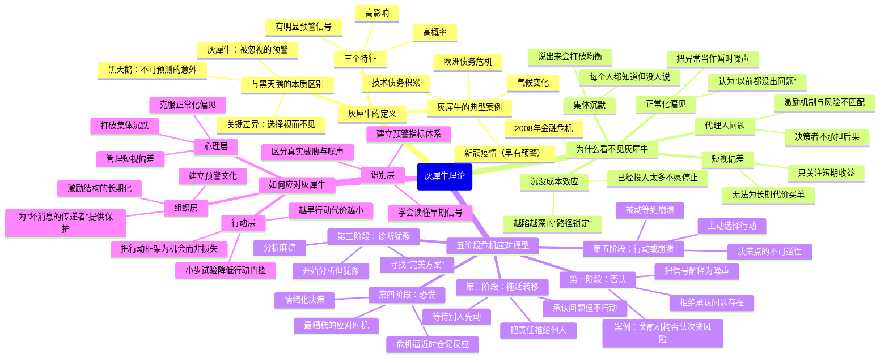
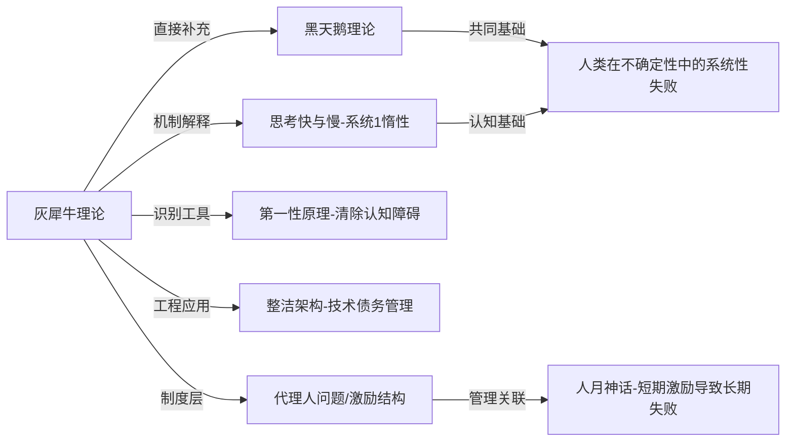

# 《灰犀牛》读书笔记

## 📚 基础信息
- **书名**: 灰犀牛：如何应对大概率危机
- **原书名**: The Gray Rhino: How to Recognize and Act on the Obvious Dangers We Ignore
- **作者**: 米歇尔·渥克（Michele Wucker）
- **出版社**: St. Martin's Press（美）/ 中信出版社（中译版）
- **出版年份**: 2016年（原版）；2017年（中文版）
- **页数**: 约320页
- **阅读状态**: ☐ 正在阅读 ☐ 已完成 ☐ 暂停
- **个人评分**: ⭐⭐⭐⭐
- **标签**: 风险管理、认知科学、危机决策、组织行为、公共政策、不确定性

---

## 📖 内容概要

### 书籍简介

《灰犀牛》是米歇尔·渥克继承并扩展塔勒布《黑天鹅》体系的重要作品。渥克是全球化事务专家和经济政策研究者，曾任 World Policy Institute 主席，长期研究金融危机、拉美经济与风险政策。

本书的核心命题直接挑战了黑天鹅理论的一个"甩锅"逻辑：**大多数重大危机并非不可预测的黑天鹅，而是有充分预警信号、高概率发生、却被系统性忽视和拖延处理的"灰犀牛"**。2008年金融危机、欧债危机、气候变化、新冠疫情——这些都不是意外，而是我们选择视而不见的结果。

渥克的核心追问是：**如果我们知道问题会来，为什么还是不行动？**

这个问题的答案，指向了人类心理结构、组织激励机制和社会文化三个层面的深层缺陷。

### 核心主题
1. **灰犀牛的本质**: 高概率、高影响力、有充分预警的显性危机被系统性忽视
2. **不行动的心理根源**: 正常化偏见、短视偏差、集体沉默等认知机制
3. **五阶段应对模型**: 从否认到行动的危机心理演变全景图
4. **如何跑赢灰犀牛**: 个人、组织、政策层面的提前行动框架

### 主要章节结构

**第一部分：识别灰犀牛**
- 第1章：两吨重的提示——什么是灰犀牛，与黑天鹅的本质区别
- 第2章：站在你面前的显而易见——灰犀牛的三个特征与常见伪装
- 第3章：灰犀牛动物园——从金融危机到气候变化，各领域的灰犀牛图谱

**第二部分：五阶段危机应对心理**
- 第4章：第一阶段——否认（Denial）
- 第5章：第二阶段——拖延转移（Muddling）
- 第6章：第三阶段——诊断犹豫（Diagnosis）
- 第7章：第四阶段——恐慌（Panic）
- 第8章：第五阶段——行动或崩溃（Action or Crash）

**第三部分：跑赢灰犀牛**
- 第9章：抢先行动——预警体系的建立
- 第10章：逆流而上——在组织和政治惰性中推动改变
- 第11章：化危为机——将灰犀牛转化为变革动力

---

## 🧠 知识架构



---

## ✍️ 读书笔记

### 第一部分：识别灰犀牛

#### 第一章：两吨重的提示

想象一头重达两吨的犀牛正向你冲来。它不是突然出现的——你早就看见它站在远处，只是没想到它会跑。当它真的开始冲锋，每个人都看见了，但大多数人仍然愣在原地。

这就是灰犀牛的隐喻：**一个显而易见、体量庞大、危险明确的威胁，却被人们系统性地忽视，直到它近在咫尺。**

渥克明确了灰犀牛与黑天鹅的根本区别：

| 维度 | 黑天鹅（塔勒布） | 灰犀牛（渥克） |
|------|--------------|--------------|
| **可预测性** | 不可预测 | 有充分预警 |
| **发生概率** | 极低 | 高概率 |
| **事前态度** | 根本无法知晓 | 知道，但选择无视 |
| **主要问题** | 认知边界的局限 | 意志力和激励的失败 |
| **应对重点** | 建立鲁棒系统（无法防止） | 及时识别和行动（可以防止） |
| **后见之明** | 事后说"本可预见"（其实不能） | 事后说"我们早就知道"（确实知道） |

**关键洞见**："黑天鹅"概念有时会成为一种逃避责任的话语工具——当一场明明有预警的危机爆发后，说它是"黑天鹅"等于在说"没人能预见到"，从而为所有失职的人开脱。渥克的"灰犀牛"概念是对这种逃脱的直接反击。

#### 第二章：灰犀牛的常见伪装

灰犀牛通常不以裸体示人。它往往披着一件令人放松的外衣，让人误认为情况可控。常见的伪装形式：

1. **"只是暂时的"**: 危机被解读为周期性波动，而非结构性问题
2. **"没有先例的"**: 用"这次不一样"的叙事掩盖历史的重复
3. **"专家们不同意"**: 把专家之间的分歧当作"问题不存在"的借口
4. **"别人也这样"**: 普遍行为成为个体免责的理由
5. **"代价太高了"**: 把行动的短期代价与不行动的长期代价错误地比较

```
灰犀牛识别框架：

问题一：这个风险是否有过往数据或先例支撑？（不仅仅是感觉）
问题二：是否存在早期预警信号（即使很微弱）？
问题三：如果这个风险成真，影响规模有多大？
问题四：应对的窗口期正在缩短吗？
问题五：我现在的不行动，是因为"不知道"，还是因为"不想知道"？

如果问题三/四/五的答案都是肯定的 → 这很可能是一头灰犀牛
```

#### 第三章：灰犀牛动物园

渥克列举了当今世界最重要的几头灰犀牛：

**金融系统的灰犀牛**：2008年金融危机之前，次贷问题早有分析师预警。2005年，经济学家 Raghuram Rajan 在世界顶级经济学家面前警告过抵押贷款市场的系统性风险，却遭到嘲笑。不是预警不存在，而是激励结构让所有人选择忽视。

**债务危机的灰犀牛**：希腊、阿根廷等国债务危机都有明确的先行指标（债务/GDP 比率、经常账户赤字等），相关机构提前多年就发出过预警，但政治系统无法应对"今天的痛苦换明天的安全"。

**气候变化的灰犀牛**：科学界从1988年的美国国会听证就开始公开警告气候变化，这是历史上预警最充分、预警窗口最长的灰犀牛，但也是应对最迟缓的一头。

**技术债务的灰犀牛**（软件工程语境）：每个开发者都知道未经重构的代码会越来越难以维护，但每一个当下的交付压力都让清偿时间延后，直到整个系统重构成本高到无法承受。

---

### 第二部分：五阶段危机应对心理

这是本书最核心的分析框架，渥克把人们面对已知危机时的心理和行为轨迹总结为五个阶段：

```
灰犀牛来袭的五阶段模型：

时间轴 →
                    犀牛已进入视野
         ┌──────────────────────────────────────────→ 崩溃
         │
  危  ↑  │ [1.否认]→[2.拖延转移]→[3.诊断犹豫]→[4.恐慌]→[5.行动/崩溃]
  机  │  │   "没问题"  "等等看"    "分析中"    "怎么办"  [主动/被动]
  程  │  │
  度  ↑  │
         │
  理想情境：             ↑ 在这里行动，代价最小
                        "犀牛刚出现，早早出手"
```

#### 第四章：第一阶段——否认（Denial）

否认不只是鸵鸟埋头。它有一套复杂的认知机制支撑：

- **正常化偏见（Normalcy Bias）**: 大脑默认"世界会继续按照历史模式运行"，把威胁信号过滤掉
- **系统1的保护机制**: 承认威胁需要消耗认知资源，大脑倾向于否认来节省资源
- **社会压力**: 在大多数人都表现"正常"的环境中，第一个表达恐惧是反社会的

否认的典型语言模式：
- "这种事从来没发生过"
- "现在的情况跟以前不一样"
- "分析师总是在危言耸听"
- "等更多数据出来再说"

#### 第五章：第二阶段——拖延转移（Muddling）

一旦无法否认问题存在，下一个心理防御机制是：把问题推给别人，或者声称"在处理中"但实际毫无进展。

**代理人问题**在这里最明显：决策者（政客/CEO/基金经理）的激励结构是短期的——下次选举、下个季度、年底奖金。灰犀牛的代价通常是长期的。所以**理性地计算，对很多决策者来说，拖延是最优策略**——把风险推给继任者，把功劳留给自己。

这揭示了一个系统性的制度设计缺陷：**当决策者不承担其决策的长期后果时，拖延永远是博弈的均衡解**。

渥克把这个阶段的核心描述为"集体沉默的囚徒困境"：
- 每个人都知道问题存在
- 每个人都知道别人也知道
- 但第一个大声说出来的人要承担打破现状的代价
- 于是所有人选择沉默，等待别人先行动

#### 第六章：第三阶段——诊断犹豫（Diagnosis）

这个阶段的危险是"分析麻痹（Analysis Paralysis）"——开始认真对待问题，但把大量精力放在"搞清楚确切原因"上，反而推迟了行动。

典型症状：
- 委托成立"研究委员会"
- 等待更完整的数据再决定
- 争论问题的优先级和资源分配
- 寻找"完美解决方案"而非"够好的解决方案"

渥克指出，完美方案往往不存在，而等待它的过程是一种新形式的拖延。当犀牛已经在奔跑，你没有时间等待最优解——**"够好且及时"永远优于"完美但太晚"**。

#### 第七章：第四阶段——恐慌（Panic）

当威胁近在眼前无法再忽视时，恐慌是人类的本能反应。问题是：**恐慌下的决策是最差的决策**。

- 注意力收窄，只能看到眼前，无法考虑长期后果
- 情绪主导，系统2思考能力受损
- 寻找即时解脱，而非真正的解决
- 过度补偿（把本可以温和处理的问题用"核弹方案"来应对）

这个阶段的核心悲剧是：**代价最高的行动，往往发生在最应该采取代价最低行动的时机已经过去之后**。提前的小成本行动，被替换成了事后的大代价救火。

#### 第八章：第五阶段——行动或崩溃（Action or Crash）

这是最终的分叉点。当犀牛已经逼近，还有一个选择：

- **主动行动**：即使代价高昂，也可能把损失控制在可承受范围内
- **被动崩溃**：什么都不做，等待撞击，然后从废墟中重建

渥克的关键洞察是：即使在这个最晚的时机，行动与不行动之间仍然有巨大差距。关键是**不能因为"本该更早行动"的内疚感而陷入另一种瘫痪——觉得什么都来不及了而放弃**。

---

### 第三部分：跑赢灰犀牛

#### 第九章：抢先行动的三个杠杆

**杠杆1：重新框架（Reframing）**

人类对"损失"和"代价"的敏感度远高于对"收益"和"机会"的敏感度（损失厌恶）。行动的障碍往往不是"不知道有风险"，而是"行动的成本在当下是可见的，而不行动的代价在未来是抽象的"。

解决方案：把"应对灰犀牛"的叙事从"损失框架"转换为"机会框架"——
- 不是"我们要花多少钱来修复这个问题"
- 而是"如果我们现在行动，能获得多大的竞争优势"

**杠杆2：降低行动门槛**

一次性的大行动在心理上非常困难，但一系列的小步骤是可以实施的。把"应对灰犀牛"分解为：
- 第一步：公开承认问题存在（打破集体沉默）
- 第二步：做一个低风险的小实验
- 第三步：基于实验结果扩大行动范围

**杠杆3：激励结构的重新设计**

这是最根本的杠杆，也是最难执行的：改变决策者的激励结构，让长期代价变得对短期决策可见。

具体机制包括：
- 延迟奖金发放（让决策者承担决策的长期后果）
- 建立"预测责任制"（公开记录决策者的预测，事后评估）
- 为"坏消息的传递者"提供保护（而不是惩罚他们）

#### 第十章：组织中的灰犀牛文化

渥克指出，组织对灰犀牛的反应质量，取决于三个文化要素：

**1. 心理安全感（Psychological Safety）**
当员工知道说出"危险的真相"不会被惩罚时，组织才能早期识别灰犀牛。否则，信息只在底层流通，无法到达决策层。

**2. 时间视野（Time Horizon）**
短期导向的组织文化（季度利润、年度 KPI）天然倾向于拖延处理长期风险。建立更长时间视野的评估机制，是组织层面最重要的制度改变。

**3. "坏消息"的流通渠道**
建立正式的渠道让不利信息能够无障碍地上达：红队机制（Red Team）、异见者保护制度、匿名预警渠道等。

---

## 💭 深度衍生思考

### 🎯 核心观点延伸

#### 延伸1：灰犀牛与黑天鹅是互补而非对立的风险框架

读完《黑天鹅》再读《灰犀牛》，会发现两者并不是竞争关系，而是描述了两类完全不同的风险：

```
风险的四象限分类：

                  高影响
                    │
                    │
  低概率            │           高概率
  ──────────────────┼──────────────────────
  黑天鹅（塔勒布）  │   灰犀牛（渥克）
  不可预测          │   有充分预警
  建立鲁棒系统来抵御│   通过早期行动来预防
                    │
                    │
                  低影响
```

对于风险管理来说，正确的做法是：
- 对黑天鹅：用塔勒布的哑铃策略建立鲁棒性，不试图预测
- 对灰犀牛：用渥克的五阶段框架主动识别和行动，越早越好

**更深的洞察**：塔勒布的体系有一个潜在的"副作用"——它可能给了人们一个逃避责任的话语工具："这是黑天鹅，没人能预见到"。渥克的贡献是把这个话语工具揭穿：**真正的黑天鹅是少数，大多数被称为"黑天鹅"的危机其实是灰犀牛——我们看到了，但选择不行动。**

#### 延伸2：技术债务就是软件工程领域最典型的灰犀牛

从渥克的框架来看，技术债务和灰犀牛几乎是完美的映射：

| 灰犀牛特征 | 技术债务的对应 |
|-----------|-------------|
| 高概率 | 不经重构的代码库一定会越来越难维护，这是铁律 |
| 高影响 | 技术债务足够高时，功能交付速度下降60-80%，新人上手成本指数级增加 |
| 有明显预警信号 | 代码坏味道、构建时间增长、Bug率上升、开发者抱怨增多 |
| 被系统性忽视 | 每个 Sprint 都有"更紧急"的新功能，重构总被推迟 |
| 五阶段完美呈现 | 否认（"代码还好"）→ 拖延（"下个版本再重构"）→ 诊断犹豫（"要全面重构还是局部"）→ 恐慌（"这个核心模块已经没人敢改"）→ 行动或崩溃（要么全面重构要么推倒重来） |

**落地建议**：把技术债务治理纳入"灰犀牛管理框架"——
1. 建立技术债务可视化仪表盘（代码质量指标、构建时间趋势、坏味道密度），让"犀牛"变得可见
2. 为技术债务指标设立阈值，超过阈值触发强制评估
3. 把技术债务的*未来成本*换算成业务语言（"当前架构每季度让我们多花X人天交付新功能"）来应对"机会框架"的说服需求
4. 保护那些愿意说"这里有问题"的工程师

#### 延伸3：五阶段模型与《思考快与慢》的深层联系

渥克的五阶段模型，可以用卡尼曼的双系统理论来做机制解释：

```
五阶段        主导认知系统        对应偏差
────────────────────────────────────────────────
否认          系统1             正常化偏见（默认世界稳定）
拖延转移      系统1             现状偏见 + 损失厌恶（行动有即时代价）
诊断犹豫      系统2（但受限）   完美主义 + 分析麻痹
恐慌          系统1（极度激活） 注意力隧道效应 + 情绪劫持
行动          系统2（理想）     需要主动激活理性评估
```

这意味着：**灰犀牛应对失败，本质上是系统1一直在主导决策，系统2没有被及时激活。**

打破这个模式的关键不是"让人更聪明"，而是设计机制，让系统2在恰当的时机自动被激活：
- 定期的强制回顾（让系统2必须处理被系统1忽略的信号）
- 公开承诺机制（一旦说出来，就激活了系统2的一致性偏好）
- 异见者制度（由专门的人扮演系统2角色，对系统1的默认判断提出挑战）

#### 延伸4：这本书挑战了《第一性原理》中"知道就能做到"的隐含假设

《第一性原理》的核心主张是：回归基本事实，打破未经检验的假设，就能做出更好的决策。这里有一个隐含假设：**认知问题是主要障碍**——一旦你真正理解了，就会做出正确的行动。

渥克用整本书证明了这个假设是错的：**对于灰犀牛，认知障碍往往不是主要问题，意志力和激励结构的问题才是**。金融监管者知道风险，政客知道债务不可持续，工程师知道技术债务会爆炸——他们还是不行动，因为行动对他们个人来说代价太高，不行动对他们个人来说收益更大。

这是一个重要的补充：**第一性原理解决的是"我没想清楚这个问题"；灰犀牛理论解决的是"我想清楚了但还是不行动"。**后者才是更普遍的失败模式。

### 🔍 多角度分析

**反向思考**：渥克的框架有一个潜在的问题——它可能让人把所有"本可以预防的坏事"都重新标签为灰犀牛，从而产生一种"一切都可以预防"的过度自信。实际上，区分"真正有充分预警信号的灰犀牛"和"事后归因为本可预防的伪灰犀牛"是极其困难的。渥克对此有所讨论，但这仍是理论的一个弱点。

**跨领域视角**：演化生物学中有一个类似的概念——"鲎效应"（Horseshoe Crab Effect）：一些生物物种因为长期稳定的环境而没有演化压力，直到环境骤变时才发现自己没有应对能力。这与渥克描述的"正常化偏见"高度同构——长期稳定让生物/组织失去了对变化的感知能力。

---

## 🎯 实践应用

### 个人层面

**1. 建立"个人灰犀牛清单"**

每年做一次审视，问自己：
- 我生活/工作中有哪些"我知道有问题但一直在拖"的事情？
- 这些事情里，哪些会随着时间推移代价越来越高？
- 我现在不行动的真实原因是什么（不知道怎么做？ 代价太高？ 等别人先动？）

**2. "越早行动越便宜"原则**

对自己的重要决策建立一个心理原则：大多数问题都是**越拖越贵**的。每次感到"拖一拖再说"的冲动时，主动估算"如果再拖3个月，这个问题的处理代价会增加多少"。

### 工程团队层面

**3. 技术债务的灰犀牛可视化**

建立团队可见的技术健康仪表盘，让技术债务的"增长轨迹"可见而非隐形：
- 核心模块的圈复杂度趋势
- 测试覆盖率趋势
- 构建时间趋势
- 新人上手时间估算

**4. "红队"机制**

在重要技术/架构决策中，指定一名"红队成员"负责专门论证"为什么这个方案会失败"，为当前方案中隐含的灰犀牛发声。这个角色应该受到明确的保护，而不是被当成"团队的否定者"。

**5. "架构债务到期日"机制**

对每一笔明确的技术债务，在登记时就设定一个"到期日"——届时必须强制回顾是否需要处理，而不是让它无限期搁置。

---

## 🔗 知识关联网络

### 与已读书籍的关联

**《黑天鹅》（塔勒布）**：关联强度 ⭐⭐⭐⭐⭐
- 最核心的对话关系：两者都研究风险认知失败，但定位不同
- 黑天鹅：不可预测的极端事件，建立鲁棒性防御
- 灰犀牛：有充分预警的高概率危机，需要意志力和制度设计来触发行动
- **张力点**：渥克隐性地批评了黑天鹅理论被滥用作"免责话语"的倾向——把本是灰犀牛的危机归咎于"不可预测的黑天鹅"
- 互补关系：两本书合在一起，构成了对"为什么重大危机一再发生"的完整解释图景

**《思考快与慢》（卡尼曼）**：关联强度 ⭐⭐⭐⭐⭐
- 灰犀牛的五阶段心理机制，可以用系统1/系统2的框架完整解释
- 正常化偏见 = 系统1的默认稳定假设
- 拖延转移 = 系统1的现状偏见和损失厌恶
- 行动 = 需要系统2主动介入
- 渥克的"重新框架策略"本质上是在修改系统1的启发式路径

**《第一性原理》**：关联强度 ⭐⭐⭐⭐
- 第一性原理解决认知问题：帮你把问题想清楚
- 灰犀牛解决意志力和激励问题：即使你想清楚了，如何克服行动障碍？
- 两者是互补的：先用第一性原理把灰犀牛看清楚，再用渥克的框架克服行动惰性

**《架构整洁之道》（Bob Martin）**：关联强度 ⭐⭐⭐⭐
- 技术债务是软件工程中最典型的灰犀牛，整洁架构是预防技术债务犀牛的系统性方法
- "软件腐化"的根本原因不是人们不知道整洁的必要性，而是短期交付压力（激励结构的失败）驱使人们选择不整洁
- 整洁架构是一种"提前行动"策略，在技术债务犀牛还小的时候就阻止它成长

**《真需求》（梁宁）**：关联强度 ⭐⭐⭐
- 产品设计中也存在灰犀牛：大量产品经理知道自己的产品没有找到真实需求（早有信号），却靠着流量/资本继续运营，直到崩溃
- 梁宁的"应然 vs 实然"框架，是识别产品层灰犀牛的工具之一

### 概念映射



### 知识依赖关系
- **前置建议**：先读《黑天鹅》建立风险认知基础，再读本书会有更强的对话感
- **后续延伸**：《反脆弱》（塔勒布）——从"预防黑天鹅/灰犀牛"进一步到"如何从危机中受益"

---

## 📚 后续阅读路径规划

### 直接延伸
1. **《反脆弱》（Nassim Taleb）**——关联度 ⭐⭐⭐⭐⭐，优先级：高
   - 预防灰犀牛 + 对抗黑天鹅之后的下一步：主动从不确定性中获益
   - 预期收获：不只是防御，而是建立在混乱中茁壮成长的系统

2. **《大短仓》（The Big Short, Michael Lewis）**——关联度 ⭐⭐⭐⭐，优先级：中
   - 2008年金融危机的叙事——少数人看见了灰犀牛，系统如何让绝大多数人选择不看
   - 预期收获：灰犀牛理论的最佳真实案例研究

3. **《崩溃》（Collapse, Jared Diamond）**——关联度 ⭐⭐⭐⭐，优先级：中
   - 历史上的灰犀牛大案例：复活节岛、玛雅文明、格陵兰维京人如何在早有信号的情况下走向崩溃
   - 预期收获：长时间尺度上的灰犀牛模式分析

### 交叉验证
1. **《预测》（Superforecasting, Philip Tetlock）**——关联度 ⭐⭐⭐⭐，优先级：中
   - Tetlock 的"超级预测者"研究表明，有一些人确实能在早期识别灰犀牛并做出准确判断
   - 对比渥克的"激励失败导致不行动"论点：即使你能预测，如何把预测转化为行动仍是另一个挑战

---

## 📊 学习总结

### 最大的收获

**灰犀牛理论提供了一个思维转换**：把面对危机时的第一个问题从"这件事发生的概率是多少？"变成了"**我现在选择不行动，是因为真的不知道，还是因为行动对我来说代价太高？**"

这个问题更准确地指向了真实的决策障碍。很多时候，我们不是在处理认知问题，而是在处理激励问题——我们知道有犀牛，但让犀牛先跑一段对我们个人更有利。

### 改变的观念

1. **之前**：重大危机发生时，如果有人说"这是黑天鹅，没人能预料到"，我会倾向于接受
   **之后**：先验证：在危机发生之前，是否有专家提出过预警？预警被怎么处理了？如果有预警被忽视，这是灰犀牛不是黑天鹅，需要追究的是行动失败而非认知失败

2. **之前**：技术债务是"以后"的问题，现在有更紧急的事
   **之后**：技术债务是一头灰犀牛，它的处理代价随时间单调递增；"以后"处理永远比"现在"处理更贵

3. **之前**：领导力意味着做出正确的决策
   **之后**：在灰犀牛面前，领导力更意味着**打破集体沉默**——在所有人都选择假装看不见时，第一个公开承认问题存在的人

### 未来行动

- **立即**：制作个人灰犀牛清单——列出工作中"我知道有问题但一直在拖"的3件事，并评估每件事随时间推移的代价增长曲线
- **技术管理**：在项目周报中增加"技术健康指标"，让技术债务的灰犀牛可见
- **决策框架**：当遇到"等等再看"的冲动时，主动问自己：这是真正需要更多信息的情况，还是我在拖延行动？

---

## 🔗 来源

- Shortform Summary: The Gray Rhino by Michele Wucker
- Michele Wucker 公开讲座及访谈资料
- World Policy Institute 相关研究文献

---

**笔记创建时间**: 2026-06-18
**最后更新**: 2026-06-18
**笔记版本**: v1.0
