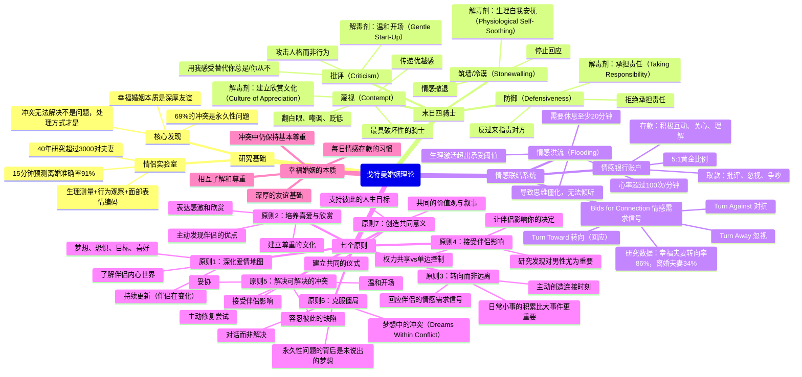
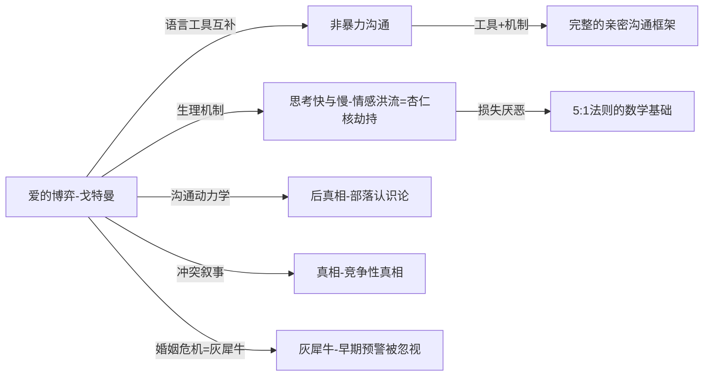

# 《爱的博弈》读书笔记

## 📚 基础信息
- **书名**: 爱的博弈：建立信任、避免背叛、创造持久爱情的科学
- **原书名**: The Seven Principles for Making Marriage Work
- **作者**: 约翰·戈特曼（John Gottman）& 南·西尔弗（Nan Silver）
- **出版社**: Harmony Books / 中信出版社（中译版）
- **出版年份**: 1999年（第一版）；2015年（修订版）
- **页数**: 约320页
- **阅读状态**: ☐ 正在阅读 ☐ 已完成 ☐ 暂停
- **个人评分**: ⭐⭐⭐⭐⭐
- **标签**: 婚姻关系、亲密关系、心理学、实证研究、冲突管理、情感联结

---

## 📖 内容概要

### 书籍简介

约翰·戈特曼是华盛顿大学心理学荣休教授，用超过40年的时间研究婚姻关系，是当代最重要的婚姻研究者之一。他和妻子朱莉·施瓦茨·戈特曼共同创立了戈特曼研究所（The Gottman Institute，1996年）。

戈特曼研究的方法论本身就是一个亮点：他在西雅图建立了著名的"情侣实验室"（Love Lab），让数百对夫妻在配备摄像头的公寓里生活，同时进行生理监测（心率、皮肤电导等）和面部表情编码，记录真实的日常互动。通过分析这些数据，他能够在**观察夫妻互动仅15分钟后，以超过91%的准确率预测这对夫妻是否会离婚**。

这本书的核心主张：**幸福婚姻的本质是深厚的友谊，而不是解决冲突的技巧**。大多数婚姻辅导教人"如何正确吵架"，但戈特曼的研究发现这是治标不治本的——真正决定婚姻质量的是日常生活中的情感联结积累。

### 核心主题
1. **情侣实验室的实证研究**: 通过生理测量和行为观察，科学预测婚姻走向
2. **四骑士**: 批评、蔑视、防御、筑墙——四种可预测离婚的沟通模式及其解毒剂
3. **情感联结系统**: Bids for Connection、情感银行账户、5:1正负互动比
4. **七个原则**: 从爱情地图到共同意义，建立稳定婚姻的系统框架
5. **永久性问题**: 69%的婚姻冲突永远无法解决，但可以管理

### 主要章节结构

**第一部分：婚姻的真相**
- 第1章：戈特曼如何预测离婚（Love Lab研究方法介绍）
- 第2章：七个信号——预测婚姻走向的关键指标

**第二部分：七个原则**
- 第3章 原则一：深化爱情地图（Enhance Your Love Maps）
- 第4章 原则二：培养喜爱与欣赏（Nurture Your Fondness and Admiration）
- 第5章 原则三：转向而非远离（Turn Toward Each Other Instead of Away）
- 第6章 原则四：接受伴侣影响（Accept Your Partner's Influence）
- 第7章 原则五：解决可解决的冲突（Solve Your Solvable Problems）
- 第8章 原则六：克服僵局（Overcome Gridlock）
- 第9章 原则七：创造共同意义（Create Shared Meaning）

---

## 🧠 知识架构



---

## ✍️ 读书笔记

### 第一章：戈特曼如何预测婚姻走向

戈特曼研究的方法论突破在于：**他不研究夫妻"应该如何沟通"，而是研究他们"实际上如何互动"**。

情侣实验室的研究设计：
1. 夫妻来到布置成家居环境的实验室公寓
2. 进行日常对话：讨论一件美好的事、一个持续的争议、一个共同计划
3. 同时记录：视频、音频、面部肌肉运动编码（FACS）、生理指标
4. 追踪随访数年，记录婚姻状态

关键发现：**只需观察15分钟的对话，就可以以超过91%的准确率预测这对夫妻在接下来14年内是否会离婚**。

这一发现的颠覆性在于：它表明婚姻质量并不隐藏在特别重要的时刻——而是清晰地写在日常互动的每一个细节里。

---

### 第二章：末日四骑士（Four Horsemen of the Apocalypse）

四骑士是戈特曼研究中发现的四种最能准确预测婚姻破裂的沟通模式。

#### 第一骑士：批评（Criticism）

**定义**：对伴侣的人格或性格发起攻击，而非针对具体的行为或事件。

```
行为投诉（健康） vs. 批评（危险）：

行为投诉：
  "你没有帮我洗碗，我感到很沮丧，
   因为厨房是我们共享的空间，我希望我们能一起维护它。"

批评：
  "你从来不帮忙做家务。
   你是那种不在乎家庭的人，只顾着自己。"

区别：投诉是关于具体行为的，批评是关于"这个人是什么类型的人"的。
```

批评的解毒剂：**温和开场（Gentle Start-Up）**
- 用"我"开头表达感受，而不是用"你"指控对方
- 描述具体情境，而不是概括性指控
- 公式：*"当[具体情境]发生时，我感到[感受]，因为[需要/价值观]，我希望[具体请求]"*

（注意：这与《非暴力沟通》的OFNR框架高度同构——这不是巧合，两者都来自同一认知传统）

#### 第二骑士：蔑视（Contempt）——最具破坏性

**定义**：传递"我比你优越"的信息，通过讽刺、嘲笑、翻白眼、贬低来表达。

蔑视是四骑士中**最强的离婚预测因子**。戈特曼的研究发现，如果一对夫妻在讨论中频繁出现蔑视行为，即使他们最终没有离婚，也往往比没有蔑视的夫妻报告更多的疾病和传染病——蔑视产生的应激反应会损害免疫系统。

```
批评 vs. 蔑视的区别：

批评（第一骑士）：
  "你这个人不在乎家庭。"
  （攻击，但在同一水平线上）

蔑视（第二骑士）：
  "你知道吗，我真搞不懂你是怎么想的。
   大多数人都会注意到厨房乱了。"
  （攻击，并传递了"我比你更有见识/更好"的信息）
```

蔑视的解毒剂：**建立欣赏文化（Culture of Appreciation）**
- 对伴侣表达感激，主动寻找他们做得好的事
- 5:1法则：每一次负面互动需要约5次正面互动来平衡
- 这不是计分，而是长期的情感氛围建设

#### 第三骑士：防御（Defensiveness）

**定义**：当受到批评时，通过辩解、反指责来保护自己，而不是倾听和承担责任。

防御的问题在于：**它向伴侣传递了"我没有问题，是你的问题"的信息**，使沟通陷入互相指责的循环。

```
防御的常见形式：
1. 辩解："我没有时间，因为工作很忙。"（把责任推给情境）
2. 反指责："你不也总是这样？" （转移焦点）
3. 是但是："你说得对，但......" （表面认同，实际仍在辩解）
4. 受害者化："我已经尽力了，你还要我怎样？"
```

防御的解毒剂：**承担责任（Taking Responsibility）**
- 即使只有部分责任，也主动承认
- 不需要完全认同对方，但要承认自己的角色
- 公式："我理解你的感受，我在这件事上确实没有做到[具体部分]，对不起。"

#### 第四骑士：筑墙/冷漠（Stonewalling）

**定义**：完全从对话中退出，拒绝回应——沉默、转移目光、单音节回答、离开对话。

筑墙通常是**情感洪流（Flooding）**的结果。戈特曼发现，当心率超过约100次/分钟时，人们进入"战或逃"的应激状态，此时理性思考能力严重受损，无法真正倾听或理性回应——于是本能地"关机"。

```
情感洪流的生理机制：

正常状态 → 争论开始 → 压力上升 → 心率超过100bpm
                                        ↓
                              进入"战或逃"模式
                              杏仁核劫持（Amygdala Hijack）
                              前额叶皮层（理性）功能下降
                                        ↓
                     无法倾听、无法共情、无法理性回应
                                        ↓
                              本能反应：筑墙/逃离
```

筑墙的解毒剂：**生理自我安抚（Physiological Self-Soothing）**
- 当意识到自己开始"关机"时，主动要求暂停
- 暂停至少**20-30分钟**（生理上需要这么长时间让应激激素消散）
- 利用暂停时间做能平复身心的事（不是在心里继续争论）
- 暂停结束后主动回到对话

---

### 第三章到第九章：七个原则

#### 原则一：深化爱情地图（Enhance Your Love Maps）

**爱情地图**是戈特曼用来描述"你对伴侣内心世界了解程度"的概念。包括：
- 他们现在的主要担忧和压力是什么
- 他们最大的梦想和愿望
- 他们最喜欢的食物、电影、音乐、书
- 他们与父母、朋友的关系如何
- 他们对未来五年的规划

关键洞见：**人是在持续变化的。** 你五年前画出的爱情地图今天可能已经过时。幸福婚姻的夫妻会持续更新对彼此的了解——不是通过大型"深度谈话"，而是通过日常的小问题和好奇心。

研究发现：在面对重大生活压力（失业、孩子出生、亲人离世）时，爱情地图丰富的夫妻比爱情地图贫乏的夫妻更不容易因压力而婚姻破裂。

#### 原则二：培养喜爱与欣赏（Nurture Your Fondness and Admiration）

喜爱和欣赏是幸福婚姻的**防腐剂**——它们阻止蔑视这个最危险的骑士入侵。

研究发现：在危机婚姻中，伴侣们能记住的对方的优点往往被他们重新解读为"其实也没什么"——而在幸福婚姻中，即使面对困难，伴侣仍然能够想到和说出对方的优点。

实践关键：**养成每天主动注意并表达一件欣赏伴侣的事的习惯**。这不是虚假的赞美，而是注意力的训练——我们注意到的，就会放大；我们忽视的，就会消失。

#### 原则三：转向而非远离（Turn Toward Each Other Instead of Away）

这一原则建立在**情感需求信号（Bids for Connection）**的研究上。

Bids for Connection 是伴侣发出的获取关注、联结或情感支持的任何信号——可以很小，如"今天下午真美啊"，可以更直接，如"你能陪我聊聊吗"。

面对这些信号，有三种响应：
1. **转向（Turn Toward）**：回应——即使只是"嗯？是挺美的。"
2. **转离（Turn Away）**：忽视——继续看手机或书
3. **对抗（Turn Against）**："你烦死了，我在看东西。"

戈特曼的研究数据：
- **幸福婚姻**中，面对伴侣的情感信号，转向率达 **86%**
- **离婚夫妻**的转向率只有 **33%**

**关键洞见**：大多数婚姻不是因为大吵大闹而崩溃的，而是因为长期的情感忽视——无数次微小的"转离"积累成了越来越深的情感隔阂。每一次转向，即使只是短暂的回应，都是在情感银行账户里存款。

#### 原则四：接受伴侣影响（Accept Your Partner's Influence）

戈特曼的研究发现了一个令人吃惊的性别差异：**在接受伴侣影响方面，男性的拒绝程度比女性高得多**，而拒绝伴侣影响与婚姻不满意高度相关。

接受影响的含义：
- 在做决策时，真正考虑伴侣的意见和感受
- 不是放弃自己的观点，而是允许对方的观点修改自己的判断
- 认可伴侣的权威——"我需要听听你的看法"

研究发现：即使在冲突中，接受伴侣影响的男性，其婚姻满意度和稳定性都显著高于拒绝影响的男性。根本原因是：**拒绝伴侣影响向对方传递了"你的看法不重要"的信息，这正是蔑视的前兆**。

#### 原则五：解决可解决的冲突（Solve Your Solvable Problems）

**可解决的冲突**是指有具体解决方案的分歧（时间安排、家务分工、消费方式等）。

解决步骤：
1. **温和开场**：用感受而非指责开始对话
2. **修复尝试**：在对话中主动使用修复信号（幽默、认错、请求暂停）
3. **情绪调节**：如果感到洪流，主动要求暂停
4. **妥协**：找到双方都能接受的中间地带
5. **容忍缺陷**：接受伴侣不会完全改变

**修复尝试（Repair Attempts）**是一个关键概念。在冲突中，任何降低紧张气氛的行为都是修复尝试——开个玩笑、说"我爱你但我现在很愤怒"、请求暂停、承认自己一部分的责任。

戈特曼的发现：修复尝试本身的内容其实不那么重要，**重要的是对方是否能接收到这个信号**。在稳定的婚姻中，即使笨拙的修复尝试也会成功；在危机婚姻中，即使精心设计的修复尝试也会被忽视或拒绝——因为底层的友谊基础已经损蚀。

#### 原则六：克服僵局（Overcome Gridlock）

**永久性问题（Perpetual Problems）**：戈特曼发现约69%的婚姻冲突是永久性的——这些问题在10年后还会存在，核心分歧从未真正解决。

这不是坏消息。幸福婚姻中的夫妻也面对这些无法解决的问题，区别在于：他们**管理这些问题，而不是试图解决它们**。他们可以谈论这些分歧而不陷入愤怒，偶尔开玩笑，保持某种轻松的距离。

**僵局（Gridlock）**是问题升级为婚姻危机的状态：双方都感到被伤害和不受尊重，在这个话题上完全无法对话，把它当成拒绝对方整个人的信号。

僵局的根源：**未说出的梦想（Dreams Within Conflict）**。每一个持续的冲突背后，往往隐藏着双方对各自人生叙事、身份认同或深层价值观的诉求。

例：关于养猫的分歧表面上是一个简单的喜好问题，但实际上可能涉及：一方对"家"的象征意义的渴望、另一方对整洁和秩序的需要（可能与童年经历相关）。当这些深层梦想没有被对话，冲突就会变成僵局。

克服僵局的过程：
1. 识别每个人在这个冲突背后隐藏的梦想
2. 尝试理解并尊重对方的梦想，即使不同意
3. 寻找暂时的妥协（不是解决，而是可以忍受的共处方式）
4. 定期重新讨论

#### 原则七：创造共同意义（Create Shared Meaning）

婚姻在最深的层面上，是两个人**共同创造一个小文化**的过程——共同的仪式、角色定义、目标、象征意义。

共同意义的四个维度：
1. **仪式（Rituals of Connection）**：家庭餐桌、睡前对话、周末早晨、纪念日庆祝——给日常生活注入意义的重复行为
2. **角色（Roles）**：我是什么样的配偶？父母？如何平衡个人与家庭？
3. **目标（Goals）**：我们作为一个家庭，想要实现什么？我们的家庭使命是什么？
4. **象征（Symbols）**："家"对我们意味着什么？这些意义是否一致？

共同意义不是凭空创造的——它从两个人各自的家庭传统中汲取，有选择地保留、修改或创造新的传统。

---

## 💭 深度衍生思考

### 🎯 核心观点延伸

#### 延伸1：四骑士模型与《非暴力沟通》的深层联系

戈特曼和罗森伯格（非暴力沟通的作者）从不同方向触达了同一个核心：**大多数沟通破坏来自于我们表达的不是感受和需求，而是判断和指控**。

```
两个框架的对应关系：

NVC框架            戈特曼框架
观察（Observation）↔ 行为投诉（vs 批评）
感受（Feelings）    ↔ 温和开场（Gentle Start-Up）
需要（Needs）       ↔ 深层梦想（Dreams Within Conflict）
请求（Requests）    ↔ 修复尝试（Repair Attempts）

批评（Criticism）   = NVC所说的"评判性语言"
蔑视（Contempt）    = 攻击到对方的存在价值层
防御（Defensiveness）= 无法进入倾听模式
筑墙（Stonewalling） = 彻底关闭沟通渠道
```

两本书的互补价值：
- NVC 提供了**清晰的语言工具**（如何表达）
- 戈特曼提供了**生理学和神经学基础**（为什么我们无法做到NVC所说的）——情感洪流（Flooding）解释了为什么我们知道"应该好好沟通"却还是做不到

#### 延伸2：情感银行账户与《思考快与慢》的整合

戈特曼的5:1法则（每次负面互动需要5次正面互动平衡）可以用卡尼曼的双系统理论来解释机制：

- **正面互动**积累的是系统1层面的"安全感"和"被接纳感"——这是缓慢沉积的基础层
- **负面互动**则直接触发系统1的威胁反应——这个反应比积累更快、更强烈

这解释了为什么5:1而不是1:1：负面刺激在演化上比正面刺激更受大脑重视（负面偏差 Negativity Bias），因此需要更多的正面积累来维持整体的安全感。

**深层推导**：在婚姻中，"不做坏事"不等于"情感健康"。情感银行账户的存款需要**主动、频繁的积极行为**，而不只是避免取款行为——这正是戈特曼反复强调的"日常小事比重大事件更重要"的数学基础。

#### 延伸3：69%永久性问题——这本书挑战了大多数婚姻辅导的核心假设

大多数婚姻辅导（包括很多通俗书籍）的隐含假设是：**婚姻问题是可以解决的**，通过正确的沟通技巧，双方可以达成理解和共识。

戈特曼的69%研究发现直接反驳了这个假设：**解决冲突不是幸福婚姻的目标，管理不可解决的差异才是**。

这不是悲观主义，而是更现实的期待设置。它带来了一个解放性的认知转变：

```
旧框架：
  "我们还没解决这个问题 → 我们的婚姻有严重问题 → 我们应该离婚"

戈特曼框架：
  "这是一个永久性问题 → 幸福的婚姻也有这类问题 → 我们需要的不是解决，
   而是带着这个分歧仍然感到尊重和联结"
```

这对"关系的第一性原理"是一个重要修正：婚姻的目标不是最大化共识，而是在差异中保持联结和尊重。

#### 延伸4：这本书提供了对后真相/竞争性真相框架在人际关系层面的应用

麦克唐纳在《真相》中描述的"竞争性真相"——关于同一现实，两个人都持有真实但相互矛盾的叙事——在婚姻中每天都在发生。

戈特曼的"梦想中的冲突"概念（Dreams Within Conflict）正是描述了这种现象：争论养猫的夫妻，实际上是两个关于"家的意义"的竞争性真相在争论。这两个真相都是真实的，都来自真实的经历和价值观，但彼此相互矛盾。

解决方案不是裁定哪个真相"更正确"，而是让双方的真相都被听见——这正是戈特曼所说的"克服僵局"的过程：识别和尊重对方真相背后的梦想，而不是试图说服对方接受你的真相。

### 🔍 多角度分析

**反向思考**：戈特曼的研究主要来自西方中产阶级异性恋夫妻，其结论的普遍适用性受到质疑。特别是5:1法则在不同文化背景下是否同样适用，以及这些原则对同性婚姻和非西方文化婚姻是否同样有效，都需要进一步研究。此外，"接受伴侣影响"原则对男性的特别强调，反映了特定的性别动态假设。

**历史视角**：戈特曼的研究跨越了1970年代到2010年代，期间美国离婚率从峰值开始下降。他的研究既捕捉了婚姻的压力，也追踪了婚姻模式的演变。

---

## 🎯 实践应用

### 日常联结习惯

**1. 情感需求信号意识训练**

意识到伴侣在发出情感信号，并有意识地"转向"——即使只是一个简短的回应：
- 放下手机/书，做15秒的完全在场
- 用一句话回应他们分享的内容
- 培养"收到了"的确认习惯

**2. 每日欣赏仪式**

每天找一件具体的事欣赏和表达：
- 不是空洞的赞美（"你真好"）
- 而是具体的观察（"你今天主动做了晚饭，我感到被照顾了"）
- 目标：让5:1的比例不是靠着"不做坏事"维持，而是靠主动积累

**3. 爱情地图更新**

每周一个新问题了解伴侣：
- "你最近工作上最满意的是什么？"
- "如果这个月可以做一件想做的事，你会做什么？"
- "你最近有没有什么担心的事？"

### 冲突管理工具

**4. 四骑士识别清单**

在对话变得紧张时，自我检查：
- 我是在描述一个**行为**，还是在攻击对方的**人格**？（批评检查）
- 我是否在传递"我比你更对/更好"的信息？（蔑视检查）
- 我是否在承担自己的部分责任，还是在转移？（防御检查）
- 我是否已经开始"关机"？心率是否明显升高？（筑墙检查）

**5. 暂停协议**

提前与伴侣商定一个暂停信号（手势或词语），意味着：
- 我感到情感洪流，需要20-30分钟平复
- 这不是逃避，我们会回来继续对话
- 暂停期间不继续在脑海中争论（那样心率不会降下来）

**6. 温和开场模板**

当需要提出一个困难的话题时：
*"[具体情境]发生时，我感到[感受]，因为对我来说[这件事的意义/价值]，我希望我们能[具体请求]。"*

---

## 🔗 知识关联网络

### 与已读书籍的关联

**《非暴力沟通》（罗森伯格）**：关联强度 ⭐⭐⭐⭐⭐
- 最直接的互补关系：NVC 提供语言工具，戈特曼提供使用这些工具的心理学和生理学基础
- NVC 的 OFNR 框架 ≈ 戈特曼的温和开场 + 梦想中的冲突
- 戈特曼的情感洪流理论解释了为什么"知道NVC"但在冲突中做不到——因为洪流状态下前额叶皮层功能受损
- **互补关系**：NVC 教你如何表达；戈特曼告诉你在表达之前需要先管理自己的生理状态

**《思考快与慢》（卡尼曼）**：关联强度 ⭐⭐⭐⭐⭐
- 情感洪流 = 杏仁核劫持（Amygdala Hijack）= 系统1完全压制系统2
- 5:1法则的机制来自负面偏差（Negativity Bias）——损失厌恶在关系中的应用
- 修复尝试在危机婚姻中失败：因为系统1已经把伴侣编码为"威胁"，任何信号都被威胁解读过滤

**《后真相》（麦金太尔）**：关联强度 ⭐⭐⭐⭐
- 部落认识论（Tribal Epistemology）——在婚姻危机中，夫妻各自的叙事形成封闭的自我强化系统，无法接受对方的"真相"
- 逆火效应（Backfire Effect）——在婚姻冲突中，直接指出对方的错误往往反而强化对方的防御

**《真相》（麦克唐纳）**：关联强度 ⭐⭐⭐⭐
- 竞争性真相在婚姻中每日都在发生
- 梦想中的冲突（Dreams Within Conflict）= 两个竞争性真相的冲突：关于同一件事（养猫、金钱、时间分配），双方都有基于真实经历的合理叙事
- 解决之道都是：不是裁定哪个真相更正确，而是让每个真相被听见

**《灰犀牛》（渥克）**：关联强度 ⭐⭐⭐
- 情感银行账户的赤字化是一个典型的灰犀牛：高概率、高影响、信号明显（四骑士是早期预警）但被系统性忽视
- 婚姻危机的五阶段（否认→拖延→诊断→恐慌→行动/崩溃）与渥克的灰犀牛五阶段高度平行

### 概念映射



### 知识依赖关系
- **前置建议**：读过《非暴力沟通》效果最佳——两者互补，先有NVC的语言框架，再用戈特曼的生理学解释"为什么做不到"
- **后续延伸**：《Hold Me Tight》（Sue Johnson）——依恋理论在婚姻中的应用，解释戈特曼框架背后更深的情绪机制

---

## 📚 后续阅读路径规划

### 直接延伸
1. **《Hold Me Tight》（Sue Johnson）**——关联度 ⭐⭐⭐⭐⭐，优先级：高
   - 依恋理论视角：所有婚姻冲突的底层都是"你会不会在我需要时出现"的依恋焦虑
   - 预期收获：理解四骑士背后更深的情绪需求

2. **《亲密关系》（Rowland Miller）**——关联度 ⭐⭐⭐⭐，优先级：中
   - 心理学教材，全面覆盖亲密关系研究
   - 预期收获：戈特曼框架在更广泛亲密关系研究中的位置

3. **《爱的五种语言》（Gary Chapman）**——关联度 ⭐⭐⭐⭐，优先级：中
   - 戈特曼的 Bids for Connection 的语言化工具
   - 预期收获：识别自己和伴侣的"情感需求信号"类型

---

## 📊 学习总结

### 最大的收获

**戈特曼将婚姻研究从"规范性"（你应该怎么做）转变为"实证性"（幸福的夫妻实际上是怎么做的）**，这个方向的转变带来了真正颠覆性的洞察：幸福婚姻的核心不是解决冲突的能力，而是在日常生活中持续积累的情感连接——而大多数人花了太多精力在"如何正确吵架"上，而不是在"如何每天增加一次情感存款"上。

### 改变的观念

1. **之前**：婚姻问题的核心是冲突没有解决
   **之后**：69%的冲突本来就无法解决；幸福婚姻的标准不是"没有冲突"，而是在冲突中仍然保持对彼此的尊重和联结

2. **之前**：偶尔的大矛盾是婚姻健康的主要威胁
   **之后**：日常无数次微小的"转离"积累的情感隔阂，比偶尔的大吵更危险；婚姻质量写在每天的小事里

3. **之前**：知道"应该好好沟通"，做不到是意志力的问题
   **之后**：在情感洪流（心率超过100bpm）状态下，大脑生理上无法好好沟通；做不到不是意志力问题，而是需要先管理生理状态（暂停20-30分钟）

### 未来行动

- **即刻**：注意自己在对话中是否出现四骑士，尤其是蔑视（最危险）——用"我感受到..."替代"你总是/你从不..."
- **日常**：建立爱情地图更新习惯——每周提出一个关于伴侣内心世界的新问题
- **冲突**：与伴侣协商一个暂停信号，练习在情感洪流来临前主动暂停

---

## 🔗 来源

- The Gottman Institute: gottman.com
- Shortform Summary: The Seven Principles for Making Marriage Work
- John Gottman Wikipedia
- Gottman Method blog: gottman.com/blog

---

**笔记创建时间**: 2026-06-22
**最后更新**: 2026-06-22
**笔记版本**: v1.0
