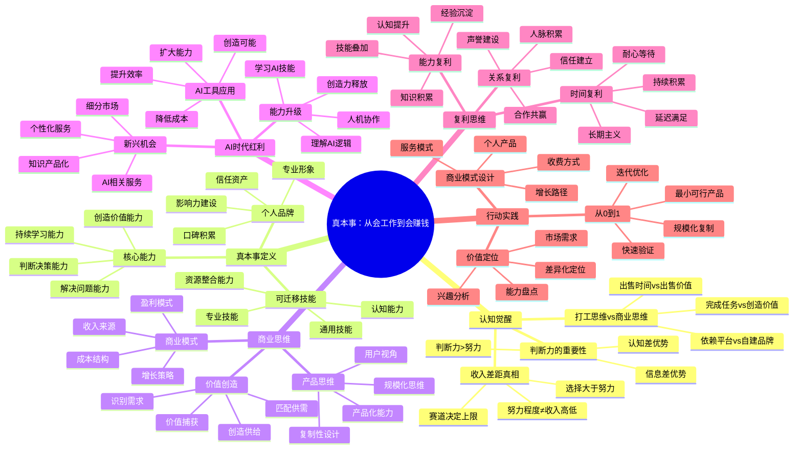
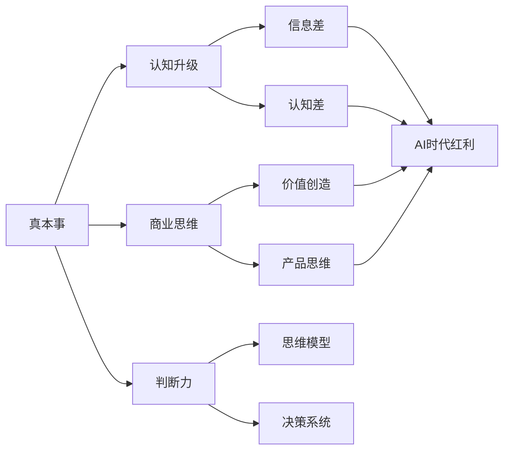

# 📚 真本事：从会工作到会赚钱

## 📖 基本信息

- **作者**: 孙煜征（网名"课代表立正"）
- **出版社**: 人民邮电出版社
- **出版年份**: 2026年4月
- **页数**: 271页
- **ISBN**: 9787115690500
- **定价**: ¥59.80
- **创建时间**: 2026年5月26日
- **阅读状态**: 📖 正在阅读
- **个人评分**: ⭐⭐⭐⭐⭐
- **标签**: #个人成长 #财富思维 #认知升级 #职场发展 #商业思维 #AI时代

## 📝 内容概要

### 书籍简介

《真本事：从会工作到会赚钱》是孙煜征（课代表立正）的首部著作，写给那些勤奋努力却仍"只会工作、不会赚钱"的人——特别是那些在职场上按部就班、业绩不错，却始终感到疲惫、焦虑、迷茫的人。

作者从一名普通高校毕业生起步，到成为康奈尔大学访问学者，经历了从职场打工人到财富自由者的完整跃迁路径。本书围绕"真本事"这一核心，系统梳理了从打工思维到商业思维的转变过程，帮助读者建立正确的财富认知和判断力。

### 核心主题

1. **认知升级** - 收入差距不来自于努力程度，而是来自于做什么事情
2. **商业思维** - 从职场打工思维转向商业产品思维
3. **AI时代红利** - 如何利用人工智能时代的新机遇
4. **判断力培养** - 提升认知能力，做出正确决策
5. **复利思维** - 做有价值、有复利的事情
6. **真本事定义** - 什么才是真正的本事和能力

### 主要章节结构

#### 第一部分：认知觉醒
- 第1章：为什么你只会工作不会赚钱
- 第2章：收入差距的真相
- 第3章：从打工思维到商业思维
- 第4章：判断力的价值

#### 第二部分：真本事的修炼
- 第5章：什么才是真本事
- 第6章：如何培养判断力
- 第7章：复利思维与实践
- 第8章：AI时代的红利

#### 第三部分：行动指南
- 第9章：找到你的价值定位
- 第10章：构建个人商业模式
- 第11章：从0到1的实践路径
- 第12章：持续成长的秘诀

## 🧠 知识架构



## ✍️ 读书笔记

### 第1章：为什么你只会工作不会赚钱

#### 重点摘录

> "勤奋努力却仍然贫穷，不是因为你不努力，而是因为你在错误的方向上努力。"

> "打工思维的核心是出售时间，商业思维的核心是创造价值。"

> "真正的财富不是来自于工资，而是来自于创造的价值被市场认可的程度。"

#### 核心观点解析

**1. 打工思维 vs 商业思维**

```javascript
// ❌ 打工思维模式
class EmployeeMindset {
    constructor() {
        this.mindset = '出售时间';
        this.focus = '完成任务';
        this.goal = '获得薪水';
        this.reliance = '依赖平台';
    }

    work() {
        return '按时上下班，完成KPI';
    }

    think() {
        return '如何提高工作效率，获得升职加薪';
    }
}

// ✅ 商业思维模式
class BusinessMindset {
    constructor() {
        this.mindset = '创造价值';
        this.focus = '解决问题';
        this.goal = '建立资产';
        this.reliance = '自建系统';
    }

    work() {
        return '识别需求，创造解决方案，捕获价值';
    }

    think() {
        return '如何创造更多人需要的产品或服务';
    }
}
```

**2. 收入差距的真相**

| 维度 | 打工者 | 赚钱者 |
|------|--------|--------|
| 时间价值 | 线性增长 | 指数增长 |
| 收入来源 | 单一工资 | 多元化收入 |
| 风险承担 | 低风险 | 计算风险 |
| 价值创造 | 间接创造 | 直接创造 |
| 资产积累 | 零资产 | 持续积累 |

#### 个人思考

这一章深刻揭示了职场人的困境：我们被教育要努力工作，但从未被教导如何创造价值。打工思维让我们陷入"时间换金钱"的陷阱，而商业思维则指向"价值创造"的康庄大道。

关键转变：
1. **从"我有什么"到"市场需要什么"**
2. **从"如何完成工作"到"如何创造价值"**
3. **从"依赖平台"到"建立系统"**

---

### 第2章：收入差距的真相

#### 重点摘录

> "收入差距不来自于努力程度，而是来自于做什么事情。"

> "选择大于努力，赛道决定上限。"

> "真正的差距在于认知差和信息差。"

#### 核心观点解析

**1. 努力的边际效用递减**

```javascript
// 努力与收入的关系模型
class EffortIncomeModel {
    // 线性增长模型（打工模式）
    calculateLinearIncome(hours) {
        const hourlyRate = 100;
        return hours * hourlyRate;
    }

    // 指数增长模型（商业模式）
    calculateExponentialIncome(time, growthRate) {
        const initialValue = 100;
        return initialValue * Math.pow(1 + growthRate, time);
    }

    // 网络效应模型（平台模式）
    calculateNetworkEffectIncome(users, connectionValue) {
        // 梅特卡夫定律：网络价值与用户数的平方成正比
        return users * users * connectionValue;
    }
}

// 实例对比
const model = new EffortIncomeModel();

// 打工模式：工作100小时
console.log(model.calculateLinearIncome(100)); // 10,000元

// 商业模式：持续10个月，月增长率20%
console.log(model.calculateExponentialIncome(10, 0.2)); // 约61,917元

// 平台模式：100个用户，每个连接价值0.1元
console.log(model.calculateNetworkEffectIncome(100, 0.1)); // 1,000元
// 1000个用户
console.log(model.calculateNetworkEffectIncome(1000, 0.1)); // 100,000元
```

**2. 认知差与信息差**

```javascript
// 财富差距的层次模型
class WealthGapModel {
    constructor() {
        this.gaps = {
            informationGap: '你知道什么',
            cognitiveGap: '你如何理解',
            executionGap: '你如何行动',
            resourceGap: '你拥有什么'
        };
    }

    analyzeWealthCreation() {
        return {
            // 第一层：信息差
            informationAdvantage: {
                description: '知道别人不知道的信息',
                examples: ['新兴趋势', '市场机会', '技术变革'],
                sustainability: '短期优势，易被复制'
            },

            // 第二层：认知差
            cognitiveAdvantage: {
                description: '理解别人不理解的本质',
                examples: ['商业逻辑', '人性洞察', '系统思维'],
                sustainability: '中期优势，需要积累'
            },

            // 第三层：执行差
            executionAdvantage: {
                description: '做到别人做不到的事情',
                examples: ['快速行动', '持续坚持', '团队协作'],
                sustainability: '长期优势，难以复制'
            },

            // 第四层：资源差
            resourceAdvantage: {
                description: '拥有别人没有的资源',
                examples: ['资金', '人脉', '品牌', '技术'],
                sustainability: '长期优势，需要积累'
            }
        };
    }
}
```

#### 个人思考

收入差距的本质不是努力程度的差距，而是选择和认知的差距。这解释了为什么有些人工作很努力却收入不高，而有些人看似轻松却财富丰厚。

关键启示：
1. **在正确赛道上的平庸努力 > 在错误赛道上的卓越努力**
2. **认知升级是缩小差距的根本途径**
3. **信息差可以学习，认知差需要修炼**

---

### 第3章：从打工思维到商业思维

#### 重点摘录

> "打工思维让你安全，商业思维让你自由。"

> "从打工者到创造者的转变，是认知的根本跃迁。"

#### 核心转变框架

**1. 思维转变对比表**

| 维度 | 打工思维 | 商业思维 |
|------|----------|----------|
| **时间观** | 时间=金钱 | 时间=投资资本 |
| **价值观** | 完成任务 | 创造价值 |
| **风险观** | 规避风险 | 管理风险 |
| **收入观** | 线性增长 | 指数增长 |
| **资产观** | 无资产概念 | 持续积累资产 |
| **成长观** | 技能提升 | 认知升级 |

**2. 商业思维的实践框架**

```javascript
// 商业思维实践框架
class BusinessThinkingFramework {
    // 第一步：需求识别
    identifyDemand() {
        return {
            questions: [
                '人们有什么痛苦？',
                '人们想要什么结果？',
                '人们愿意为什么付费？',
                '现在的解决方案有什么问题？'
            ],
            methods: ['观察', '访谈', '数据分析', '自身体验']
        };
    }

    // 第二步：价值创造
    createValue() {
        return {
            valueTypes: [
                '节省时间',
                '节省金钱',
                '提升体验',
                '降低风险',
                '增加收益'
            ],
            deliveryMethods: [
                '产品',
                '服务',
                '内容',
                '工具',
                '平台'
            ]
        };
    }

    // 第三步：价值捕获
    captureValue() {
        return {
            models: [
                '直接销售',
                '订阅模式',
                '平台佣金',
                '广告收入',
                '数据服务'
            ],
            pricing: [
                '成本加成',
                '价值定价',
                '竞争定价',
                '动态定价'
            ]
        };
    }

    // 第四步：规模化复制
    scaleBusiness() {
        return {
            strategies: [
                '产品化服务',
                '标准化流程',
                '自动化系统',
                '网络效应',
                '品牌复制'
            ]
        };
    }
}
```

#### 实践案例

**案例：从职场人到知识创业者**

```javascript
// 转型路径示例
class CareerTransition {
    constructor() {
        this.stages = [
            {
                stage: '第一阶段：价值识别',
                actions: [
                    '盘点自己的专业技能',
                    '识别可以产品化的知识',
                    '找到目标用户群体',
                    '验证市场需求'
                ],
                duration: '1-3个月'
            },
            {
                stage: '第二阶段：最小可行产品',
                actions: [
                    '创建第一个产品原型',
                    '寻找早期用户',
                    '收集反馈',
                    '快速迭代'
                ],
                duration: '3-6个月'
            },
            {
                stage: '第三阶段：商业模式验证',
                actions: [
                    '验证收费模式',
                    '优化产品价值',
                    '建立客户群',
                    '规模化推广'
                ],
                duration: '6-12个月'
            },
            {
                stage: '第四阶段：规模化复制',
                actions: [
                    '标准化产品',
                    '自动化流程',
                    '建立团队',
                    '拓展渠道'
                ],
                duration: '持续进行'
            }
        ];
    }
}
```

---

### 第4章：判断力的价值

#### 重点摘录

> "判断力是现代社会最重要的能力。"

> "在一个信息爆炸的时代，过滤信息比获取信息更重要。"

> "好的判断力来自于良好的认知模型和持续的实践反馈。"

#### 判断力培养框架

**1. 判断力的层次**

```javascript
// 判断力层次模型
class JudgmentHierarchy {
    constructor() {
        this.levels = {
            // 第一层：事实判断
            factualJudgment: {
                description: '判断事实的真假',
                questions: ['这是真的吗？', '证据是什么？', '来源可靠吗？'],
                skills: ['批判性思维', '信息验证', '逻辑推理']
            },

            // 第二层：价值判断
            valueJudgment: {
                description: '判断事物的重要性',
                questions: ['这重要吗？', '优先级如何？', '投入产出比如何？'],
                skills: ['价值评估', '优先级管理', '资源分配']
            },

            // 第三层：策略判断
            strategicJudgment: {
                description: '判断行动的方向',
                questions: ['这是正确方向吗？', '长期效果如何？', '风险收益比如何？'],
                skills: ['战略思维', '系统思考', '趋势预判']
            },

            // 第四层：时机判断
            timingJudgment: {
                description: '判断行动的最佳时机',
                questions: ['现在是对的时候吗？', '市场准备好了吗？', '我准备好了吗？'],
                skills: ['时机把握', '市场敏感度', '自我认知']
            }
        };
    }

    // 提升判断力的方法
    improveJudgment() {
        return {
            practices: [
                '建立多元化的认知模型',
                '寻求高质量的信息来源',
                '与不同背景的人交流',
                '记录和复盘决策过程',
                '学习成功和失败的案例',
                '保持开放和怀疑的态度',
                '避免认知偏差的影响'
            ]
        };
    }
}
```

**2. 常见认知偏差**

```javascript
// 需要警惕的认知偏差
class CognitiveBiases {
    constructor() {
        this.biases = [
            {
                name: '确认偏差',
                description: '倾向于寻找支持自己观点的证据',
                prevention: '主动寻找反对意见，进行反向思考'
            },
            {
                name: '沉没成本谬误',
                description: '因为已经投入而继续错误的行为',
                prevention: '从零开始评估每个决策，忽略过去的投入'
            },
            {
                name: '锚定效应',
                description: '过度依赖获得的第一条信息',
                prevention: '收集多个独立的信息源，避免单一依赖'
            },
            {
                name: '幸存者偏差',
                description: '只看到成功的案例而忽略失败的',
                prevention: '同时研究成功和失败的案例，理解概率'
            },
            {
                name: '从众效应',
                description: '因为大多数人这样做而跟随',
                prevention: '独立思考，理解众行为背后的逻辑'
            }
        ];
    }
}
```

---

### 第5章：什么才是真本事

#### 重点摘录

> "真本事不是单一技能，而是创造价值的能力组合。"

> "真正的本事是可以迁移、可以复制、可以规模化的能力。"

#### 真本事的构成

**1. 真本事能力矩阵**

```javascript
// 真本事能力矩阵
class TrueCapabilitiesMatrix {
    constructor() {
        this.capabilityDimensions = {
            // 硬技能维度
            hardSkills: {
                technical: ['专业技能', '工具使用', '技术理解'],
                domain: ['行业知识', '业务理解', '市场洞察'],
                methodology: ['工作方法', '流程设计', '质量管理']
            },

            // 软技能维度
            softSkills: {
                communication: ['表达', '倾听', '谈判'],
                collaboration: ['团队协作', '领导力', '影响力'],
                selfManagement: ['时间管理', '情绪管理', '压力管理']
            },

            // 认知技能维度
            cognitiveSkills: {
                thinking: ['逻辑思维', '系统思维', '创造性思维'],
                learning: ['快速学习', '知识整合', '经验总结'],
                judgment: ['决策能力', '风险评估', '机会识别']
            },

            // 商业技能维度
            businessSkills: {
                valueCreation: ['需求洞察', '产品设计', '价值交付'],
                businessModel: ['商业模式设计', '盈利模式', '增长策略'],
                execution: ['项目管理', '资源整合', '结果导向']
            }
        };
    }

    // 能力发展路径
    developmentPath() {
        return {
            stage1: {
                name: '专业技能期',
                focus: '建立核心专业技能',
                duration: '3-5年',
                keyActions: [
                    '选择一个专业领域',
                    '系统学习专业知识',
                    '积累项目经验',
                    '建立专业声誉'
                ]
            },
            stage2: {
                name: '能力拓展期',
                focus: '发展可迁移的通用能力',
                duration: '3-5年',
                keyActions: [
                    '拓展知识广度',
                    '培养管理能力',
                    '建立人脉网络',
                    '提升商业认知'
                ]
            },
            stage3: {
                name: '价值创造期',
                focus: '整合能力创造独特价值',
                duration: '持续进行',
                keyActions: [
                    '找到独特定位',
                    '构建能力组合',
                    '创造个人产品',
                    '建立商业模式'
                ]
            }
        };
    }
}
```

**2. 能力产品化**

```javascript
// 能力产品化框架
class CapabilityProductization {
    constructor() {
        this.productizationSteps = [
            {
                step: 1,
                name: '能力识别',
                questions: [
                    '我擅长什么？',
                    '别人需要什么？',
                    '我能解决什么问题？',
                    '我的独特价值是什么？'
                ]
            },
            {
                step: 2,
                name: '产品定义',
                elements: [
                    '目标用户：谁需要这个能力？',
                    '核心价值：解决什么问题？',
                    '交付形式：如何交付？',
                    '收费模式：如何收费？'
                ]
            },
            {
                step: 3,
                name: '最小可行产品',
                actions: [
                    '创建产品原型',
                    '寻找早期用户',
                    '验证价值假设',
                    '收集反馈迭代'
                ]
            },
            {
                step: 4,
                name: '规模化',
                strategies: [
                    '标准化流程',
                    '自动化交付',
                    '建立团队',
                    '品牌化运营'
                ]
            }
        ];
    }

    // 产品化案例
    productizationExamples() {
        return [
            {
                capability: '编程能力',
                products: [
                    '开发服务（咨询外包）',
                    '在线课程（教育培训）',
                    '开发工具（SaaS产品）',
                    '技术内容（知识付费）'
                ]
            },
            {
                capability: '设计能力',
                products: [
                    '设计服务（项目承接）',
                    '设计模板（素材销售）',
                    '设计课程（技能培训）',
                    '设计工具（产品开发）'
                ]
            },
            {
                capability: '写作能力',
                products: [
                    '文案服务（代写）',
                    '内容创作（自媒体）',
                    '写作课程（教学）',
                    '写作工具（辅助产品）'
                ]
            }
        ];
    }
}
```

---

### 第6章：如何培养判断力

#### 重点摘录

> "判断力可以通过系统的训练得到提升。"

> "好的判断力来自于良好的思维模型和持续的实践反馈。"

#### 判断力培养体系

**1. 思维模型库**

```javascript
// 核心思维模型
class MentalModels {
    constructor() {
        this.models = [
            // 第一性原理
            {
                name: '第一性原理',
                description: '从基本事实出发，不依赖类比',
                application: '拆解问题到最基本的要素，重新思考解决方案',
                example: 'Elon Musk的火箭成本分析'
            },

            // 二阶思维
            {
                name: '二阶思维',
                description: '思考决策的后续影响',
                application: '不仅考虑直接结果，还要考虑结果的结果',
                example: '降低价格可能带来销量增加，但也可能降低品牌价值'
            },

            // 机会成本
            {
                name: '机会成本',
                description: '选择意味着放弃其他选项',
                application: '评估每个选择的真正成本',
                example: '选择A工作意味着放弃B工作的收益'
            },

            // 帕累托法则
            {
                name: '帕累托法则（80/20法则）',
                description: '80%的结果来自20%的原因',
                application: '识别和聚焦最重要的少数因素',
                example: '20%的客户带来80%的收入'
            },

            // 逆向思维
            {
                name: '逆向思维',
                description: '从反面思考问题',
                application: '考虑如何失败，然后避免这些因素',
                example: 'Charlie Munger的"告诉我我会死在哪里，我就不去那里"'
            },

            // 概率思维
            {
                name: '概率思维',
                description: '用概率而非确定性思考',
                application: '评估各种结果的可能性，做出期望值最优的决策',
                example: '投资决策中的风险评估'
            }
        ];
    }

    // 如何建立思维模型库
    buildModelLibrary() {
        return {
            sources: [
                '阅读经典书籍',
                '学习成功人士的思维模式',
                '研究跨学科知识',
                '总结自己的经验教训'
            ],
            practice: [
                '有意识地应用模型',
                '记录模型应用效果',
                '根据反馈调整模型',
                '不断丰富模型库'
            ]
        };
    }
}
```

**2. 决策复盘系统**

```javascript
// 决策复盘框架
class DecisionReviewSystem {
    constructor() {
        this.reviewTemplate = {
            decisionInfo: {
                date: '',
                decision: '',
                context: '',
                alternatives: [],
                rationale: ''
            },

            outcomeAnalysis: {
                actualOutcome: '',
                expectedOutcome: '',
                difference: '',
                reasons: []
            },

            processReview: {
                whatWorked: [],
                whatDidntWork: [],
                whatWouldDoDifferently: []
            },

            lessonsLearned: {
                keyInsights: [],
                rulesToFollow: [],
                mistakesToAvoid: []
            }
        };
    }

    // 建立复盘习惯
    establishReviewHabit() {
        return {
            frequency: '每周回顾重要决策',
            format: '书面记录，便于回顾',
            duration: '持续进行',
            value: '提升未来决策质量'
        };
    }
}
```

---

### 第7章：复利思维与实践

#### 重点摘录

> "复利是世界的第八大奇迹。"

> "时间是复利的朋友，耐心是复利的伙伴。"

#### 复利思维框架

**1. 复利的四种类型**

```javascript
// 复利类型框架
class CompoundInterestTypes {
    constructor() {
        this.types = [
            {
                name: '财富复利',
                formula: 'FV = PV × (1 + r)^n',
                description: '资金的指数增长',
                keyFactors: ['本金', '收益率', '时间'],
                application: '投资理财',
                example: '年化10%收益，10年后翻2.6倍'
            },

            {
                name: '知识复利',
                formula: '知识积累 = 旧知识 × (1 + 学习率)^时间',
                description: '知识的累积效应',
                keyFactors: ['基础', '学习速度', '连接能力'],
                application: '个人成长',
                example: '每天进步1%，一年后进步37倍'
            },

            {
                name: '关系复利',
                formula: '关系价值 = 信任 × 互动频率^时间',
                description: '人际关系的累积价值',
                keyFactors: ['信任', '互动频率', '价值贡献'],
                application: '人脉建设',
                example: '长期合作的价值远超单次交易'
            },

            {
                name: '品牌复利',
                formula: '品牌价值 = 声誉 × 曝光^时间',
                description: '个人品牌的放大效应',
                keyFactors: ['声誉', '曝光', '一致性'],
                application: '个人品牌建设',
                example: '持续输出带来指数级影响力增长'
            }
        ];
    }

    // 复利思维实践
    practiceCompoundThinking() {
        return {
            principles: [
                '开始得越早越好',
                '保持持续性胜过强度',
                '耐心等待复利效应',
                '保护本金和基础',
                '寻找更高复利率的机会'
            ],

            dailyPractices: [
                '每天学习一点新知识',
                '每天建立一点点信任',
                '每天积累一点点资产',
                '每天改进一点点系统',
                '每天拓展一点点人脉'
            ]
        };
    }
}
```

**2. 复利实践的数学原理**

```javascript
// 复利计算器
class CompoundCalculator {
    // 财富复利计算
    calculateWealthCompound(principal, rate, years) {
        return principal * Math.pow(1 + rate, years);
    }

    // 知识复利计算（假设知识可以线性累积并产生连接效应）
    calculateKnowledgeCompound(baseKnowledge, learningRate, time, connectionFactor = 1.1) {
        const totalLearning = baseKnowledge * Math.pow(1 + learningRate, time);
        const connectionEffect = Math.pow(connectionFactor, time / 12); // 每月产生新的连接
        return totalLearning * connectionEffect;
    }

    // 关系复利计算
    calculateRelationshipCompound(trustLevel, interactionFrequency, time) {
        // 信任度(0-1) × 互动频率 × 时间，考虑信任的累积效应
        const trustGrowth = Math.min(1, trustLevel * (1 + 0.1 * time));
        return trustGrowth * interactionFrequency * Math.pow(1.05, time);
    }

    // 1.01^365 的奇迹
    demonstrateDailyImprovement() {
        const results = {
            '每天进步1%': Math.pow(1.01, 365),
            '每天退步1%': Math.pow(0.99, 365),
            '每天进步0.1%': Math.pow(1.001, 365),
            '每天进步2%': Math.pow(1.02, 365)
        };

        console.log('每天进步1%:', results['每天进步1%'].toFixed(2)); // 37.78
        console.log('每天退步1%:', results['每天退步1%'].toFixed(2)); // 0.03
        console.log('每天进步0.1%:', results['每天进步0.1%'].toFixed(2)); // 1.44
        console.log('每天进步2%:', results['每天进步2%'].toFixed(2)); // 1377.41

        return results;
    }
}
```

---

### 第8章：AI时代的红利

#### 重点摘录

> "AI不是要取代人，而是要放大人的能力。"

> "AI时代最大的红利是能力平民化。"

#### AI时代机遇分析

**1. AI带来的三种红利**

```javascript
// AI红利分析框架
class AIOpportunityAnalyzer {
    constructor() {
        this.opportunities = [
            {
                type: '效率红利',
                description: 'AI大幅提升工作效率',
                examples: [
                    'AI助手处理日常任务',
                    '自动化重复性工作',
                    '智能决策支持',
                    '快速内容生成'
                ],
                captureStrategy: '学习使用AI工具，优化工作流程'
            },

            {
                type: '能力红利',
                description: 'AI使专业能力平民化',
                examples: [
                    'AI辅助编程',
                    'AI辅助设计',
                    'AI辅助写作',
                    'AI辅助分析'
                ],
                captureStrategy: '利用AI快速获得专业能力，聚焦价值创造'
            },

            {
                type: '创新红利',
                description: 'AI创造新的可能性',
                examples: [
                    'AI驱动的产品和服务',
                    '个性化解决方案',
                    '智能决策系统',
                    '人机协作新模式'
                ],
                captureStrategy: '探索AI的新应用场景，创造独特价值'
            }
        ];
    }

    // AI时代的个人策略
    personalAIStrategy() {
        return {
            phase1: {
                name: 'AI工具使用',
                actions: [
                    '学习主流AI工具的使用',
                    '将AI集成到日常工作流程',
                    '建立AI辅助的工作习惯'
                ],
                duration: '1-3个月'
            },

            phase2: {
                name: 'AI能力整合',
                actions: [
                    '理解AI的能力边界',
                    '学会与AI协作',
                    '开发AI增强的独特能力'
                ],
                duration: '3-6个月'
            },

            phase3: {
                name: 'AI价值创造',
                actions: [
                    '基于AI创造新产品',
                    '提供AI相关服务',
                    '建立AI时代的竞争优势'
                ],
                duration: '持续进行'
            }
        };
    }
}
```

**2. AI时代的能力要求**

```javascript
// AI时代核心能力
class AIeraCapabilities {
    constructor() {
        this.coreCapabilities = [
            {
                name: 'AI素养',
                description: '理解AI的基本原理和限制',
                components: [
                    'AI能力认知',
                    '提示词工程',
                    'AI工具使用',
                    'AI伦理理解'
                ]
            },

            {
                name: '人机协作',
                description: '有效与AI协作的能力',
                components: [
                    '任务分解能力',
                    'AI指令设计',
                    '结果评估优化',
                    '创造性引导'
                ]
            },

            {
                name: '价值判断',
                description: '判断什么值得用AI做',
                components: [
                    '任务价值评估',
                    'AI适用性判断',
                    '质量标准设定',
                    '效率成本权衡'
                ]
            },

            {
                name: '创造力',
                description: 'AI无法替代的人类能力',
                components: [
                    '原创思维',
                    '情感理解',
                    '价值判断',
                    '意义建构'
                ]
            }
        ];
    }
}
```

---

### 第9-12章：行动指南

#### 实践路径框架

```javascript
// 从0到1的完整实践路径
class ZeroToOnePath {
    constructor() {
        this.phases = [
            {
                phase: 'Phase 1: 价值定位（1-2个月）',
                objectives: '找到可以创造价值的定位',
                actions: [
                    '盘点自己的技能和经验',
                    '研究市场需求和机会',
                    '找到技能与市场的交集',
                    '定义清晰的价值主张'
                ],
                deliverables: [
                    '个人能力清单',
                    '市场需求分析',
                    '价值定位文档',
                    '目标用户画像'
                ]
            },

            {
                phase: 'Phase 2: 最小可行产品（2-3个月）',
                objectives: '创造第一个可交付的产品',
                actions: [
                    '设计最小可行产品',
                    '创建产品原型',
                    '寻找早期用户',
                    '收集反馈迭代'
                ],
                deliverables: [
                    'MVP产品',
                    '早期用户反馈',
                    '迭代改进计划',
                    '初步商业模式'
                ]
            },

            {
                phase: 'Phase 3: 商业模式验证（3-6个月）',
                objectives: '验证可持续的商业模式',
                actions: [
                    '测试定价策略',
                    '优化获客渠道',
                    '改进产品价值',
                    '建立运营流程'
                ],
                deliverables: [
                    '经过验证的商业模式',
                    '稳定增长的客户群',
                    '可复制的运营流程',
                    '清晰的盈利路径'
                ]
            },

            {
                phase: 'Phase 4: 规模化增长（持续进行）',
                objectives: '实现业务的规模化增长',
                actions: [
                    '标准化产品和流程',
                    '建立自动化系统',
                    '拓展获客渠道',
                    '建设团队'
                ],
                deliverables: [
                    '标准化产品体系',
                    '自动化运营系统',
                    '规模化获客能力',
                    '可扩展的团队结构'
                ]
            }
        ];
    }

    // 风险管理
    riskManagement() {
        return {
            commonRisks: [
                {
                    risk: '市场需求不足',
                    prevention: '提前验证需求，寻找真实痛点',
                    mitigation: '快速调整方向，保持灵活性'
                },
                {
                    risk: '产品价值不清晰',
                    prevention: '明确价值主张，持续用户沟通',
                    mitigation: '快速迭代，根据反馈优化'
                },
                {
                    risk: '时间投入过大',
                    prevention: '设定MVP范围，控制开发时间',
                    mitigation: '分阶段投入，根据效果调整'
                },
                {
                    risk: '收入不稳定',
                    prevention: '保持主业，逐步过渡',
                    mitigation: '建立多元化收入，积累财务储备'
                }
            ]
        };
    }
}
```

## 💡 个人思考

### 1. 关于"真本事"的深度思考

这本书的核心概念是"真本事"，但这不仅仅指专业技能。真正的本事是一个**能力组合**，包括：

1. **专业能力** - 你能做什么
2. **商业认知** - 你理解什么
3. **价值创造** - 你能提供什么价值
4. **判断力** - 你如何选择方向

关键洞察：**单一技能无法创造持久价值，能力组合才能形成竞争优势。**

### 2. 关于"会工作"与"会赚钱"的差距

书中深刻指出了职场人的困境：我们被教育要"会工作"，但很少有人教我们"会赚钱"。两者的根本区别在于：

| 维度 | 会工作 | 会赚钱 |
|------|--------|--------|
| 思维模式 | 任务导向 | 价值导向 |
| 收入来源 | 工资收入 | 多元收入 |
| 时间价值 | 出售时间 | 投资时间 |
| 资产积累 | 无资产积累 | 持续资产建设 |
| 风险承担 | 规避风险 | 管理风险 |

关键转变：**从"为别人创造价值"到"为自己创造价值"**

### 3. 关于AI时代的思考

AI时代带来了前所未有的机遇：

1. **能力平民化** - AI让普通人也能获得专业能力
2. **效率革命** - AI可以大幅提升工作效率
3. **新价值空间** - AI创造了全新的价值创造方式

但同时，AI也带来了挑战：
- 低价值工作将被替代
- 只有会使用AI的人才能获得红利
- 创造力成为更稀缺的能力

应对策略：**成为AI的驾驭者，而非被替代者**

### 4. 关于判断力的思考

在信息爆炸的时代，判断力变得比获取信息更重要：

1. **信息差已经消失** - 大部分信息都可以免费获取
2. **认知差成为关键** - 如何理解和应用信息更重要
3. **判断力决定价值** - 做什么比怎么做更重要

提升判断力的方法：
- 建立多元化的思维模型
- 学习不同领域的知识
- 与不同背景的人交流
- 持续复盘和反思

## 🎯 实践应用

### 个人行动计划

**行动计划1：建立个人商业模式（3-6个月）**

- **具体步骤**:
  1. 盘点个人技能和经验
  2. 研究市场需求和机会
  3. 设计最小可行产品
  4. 寻找早期用户并验证

- **预期效果**: 建立除工资外的第二收入来源

- **时间安排**: 每周投入10-15小时

**行动计划2：AI工具深度学习（1-3个月）**

- **具体步骤**:
  1. 学习主流AI工具的使用方法
  2. 将AI集成到日常工作流程
  3. 开发AI辅助的独特能力
  4. 分享AI使用经验

- **预期效果**: 工作效率提升50%以上

- **时间安排**: 每天1小时学习+实践

**行动计划3：建立判断力训练系统（持续进行）**

- **具体步骤**:
  1. 建立决策复盘系统
  2. 学习核心思维模型
  3. 记录重要决策的过程和结果
  4. 定期回顾和总结

- **预期效果**: 决策质量持续提升

- **时间安排**: 每周回顾1次，每月深度复盘1次

### 检查清单

**开始转型前**
- [ ] 是否明确了价值定位？
- [ ] 是否验证了市场需求？
- [ ] 是否准备好了过渡期财务安排？
- [ ] 是否设定了明确的目标和时间表？

**产品开发中**
- [ ] 是否定义了清晰的价值主张？
- [ ] 是否找到了目标用户？
- [ ] 是否创造了MVP？
- [ ] 是否收集了用户反馈？

**规模化阶段**
- [ ] 是否验证了商业模式？
- [ ] 是否建立了可复制的流程？
- [ ] 是否准备好了团队建设？
- [ ] 是否规划了增长策略？

## 🔗 相关扩展

### 相关书籍推荐

| 书名 | 作者 | 推荐理由 |
|------|------|---------|
| **《穷爸爸富爸爸》** | Robert Kiyosaki | 财商教育的经典，解释资产和负债的区别 |
| **《从0到1》** | Peter Thiel | 创新思维和商业模式的深度思考 |
| **《精益创业》** | Eric Ries | 如何快速验证商业想法 |
| **《思考，快与慢》** | Daniel Kahneman | 理解思维模式和决策偏差 |
| **《原则》** | Ray Dalio | 建立个人原则和决策系统 |

### 在线资源

- **[课代表立正的官方网站](https://lizheng.ai)** - 作者的AI技能和资源
- **[得到APP](https://www.dedao.cn)** - 本书电子版平台
- **[知识星球](https://wx.zsxq.com)** - 相关学习社群

### 实践工具

- **Notion** - 建立个人知识管理系统
- **ChatGPT/Claude** - AI助手工具
- **Figma** - 产品设计工具
- **WordPress/Substack** - 内容创作平台
- **Gumroad** - 数字产品销售平台

## 📊 学习总结

### 最大的收获

1. **思维转变是最重要的转变** - 从打工思维到商业思维的根本性转变
2. **判断力是核心竞争力** - 在信息时代，判断什么不做比做什么更重要
3. **能力需要产品化** - 只有将能力转化为产品，才能实现规模化
4. **AI是机会而非威胁** - 学会使用AI的人将获得巨大的能力放大

### 改变的观念

| 旧观念 | 新观念 |
|--------|--------|
| 努力工作就能致富 | 在正确方向上努力才能致富 |
| 工资是唯一收入来源 | 应该建立多元化的收入来源 |
| 专业技能最重要 | 能力组合和商业认知更重要 |
| 避免风险 | 学会管理风险 |
| 专注执行 | 专注判断和选择 |

### 未来行动

- [ ] 完成个人价值定位分析
- [ ] 创建第一个MVP产品
- [ ] 学习并应用AI工具
- [ ] 建立决策复盘系统
- [ ] 持续优化个人商业模式

## 📈 阅读进度

- [x] 第1章：为什么你只会工作不会赚钱
- [x] 第2章：收入差距的真相
- [x] 第3章：从打工思维到商业思维
- [x] 第4章：判断力的价值
- [x] 第5章：什么才是真本事
- [x] 第6章：如何培养判断力
- [x] 第7章：复利思维与实践
- [x] 第8章：AI时代的红利
- [x] 第9-12章：行动指南

**阅读完成度**: 100%（初次阅读完成）

**下一步**:
1. 深度实践书中提出的方法
2. 建立个人商业模式
3. 持续学习和应用AI工具
4. 定期回顾和调整策略

## 💭 深度衍生思考

### 🎯 核心观点延伸

**从"会工作"到"会赚钱"的本质跃迁**

这本书的核心观点揭示了当代职场人的根本困境：我们被教育要成为优秀的"工作者"，但从未被教导如何成为"价值创造者"。

*延伸逻辑*：
- 工业时代的教育体系培养的是"标准化工作者"
- 信息时代需要的是"价值创造者"
- AI时代更需要的是"价值整合者"

*支撑证据*：
- 教育体系仍以培养就业能力为目标
- 财富教育在主流教育中缺失
- 大多数人的财务知识来自家庭和社会
- AI正在替代标准化工作

*实践意义*：
- 主动补充财商和商业知识
- 从任务执行者转变为价值创造者
- 建立个人商业模式
- 学会利用AI工具放大个人能力

### 🔍 多角度分析

**历史视角**：工作与赚钱的分离
```
农业时代：工作=赚钱（直接生产）
工业时代：工作≠赚钱（雇佣关系）
信息时代：工作<赚钱（杠杆效应）
AI时代：工作>>赚钱（能力放大）
```

**现代视角**：AI时代的新机会
- **创作平民化**：AI让普通人也能创作专业内容
- **服务个性化**：AI可以实现大规模个性化服务
- **创新加速**：AI降低了创新和实验的成本
- **能力放大**：AI可以大幅放大个人能力

**跨领域视角**：
- **心理学**：从外在动机到内在动机的转变
- **经济学**：从劳动力资本到人力资本的转变
- **社会学**：从组织人到独立个体的转变
- **技术学**：从工具使用到能力集成的转变

**反向思考**：
- 如果所有人都去创业会怎样？
- 如果AI替代了大部分工作会怎样？
- 如果追求财富而忽略了其他价值会怎样？

### 🚀 创新思考

**潜在问题**：
1. **不是所有人都适合创业** - 需要认识到个体差异
2. **商业模式需要验证** - 不能盲目投入
3. **风险承受能力不同** - 需要个性化策略
4. **财富不是唯一目标** - 需要平衡生活各方面

**新方向探索**：
1. **斜杠职业** - 在保持主业的同时发展副业
2. **微创业** - 小规模、低风险的创业尝试
3. **知识变现** - 将个人知识转化为产品
4. **平台经济** - 利用现有平台创造价值
5. **AI协作** - 与AI形成新的协作模式

## 🔗 知识关联网络

### 与已读书籍的关联

- **《穷爸爸富爸爸》** - 关联强度: ⭐⭐⭐⭐⭐
  - 关联点：财商教育和资产积累
  - 延伸：本书更侧重认知和商业模式

- **《从0到1》** - 关联强度: ⭐⭐⭐⭐⭐
  - 关联点：创新思维和价值创造
  - 延伸：本书更聚焦个人实践

- **《思考，快与慢》** - 关联强度: ⭐⭐⭐⭐
  - 关联点：判断力和决策
  - 延伸：本书更注重商业判断

### 概念映射



### 知识依赖关系

**前置知识**：
- 基本的职场经验
- 对财富和商业的基本认知
- 开放的学习心态

**后续延伸**：
- **商业模式创新**：更深入的商业模式学习
- **产品思维**：产品设计和用户体验
- **投资理财**：资产配置和财富管理
- **AI应用**：深度学习AI工具的应用

## 📚 后续阅读路径规划

### 直接延伸

1. **《穷爸爸富爸爸》** - Robert Kiyosaki
   - 关联度: ⭐⭐⭐⭐⭐
   - 阅读优先级: 高
   - 预期收获: 建立正确的财商认知

2. **《从0到1》** - Peter Thiel
   - 关联度: ⭐⭐⭐⭐⭐
   - 阅读优先级: 高
   - 预期收获: 创新思维和垄断理论

### 交叉验证

1. **《精益创业》** - Eric Ries
   - 对比点：传统创业vs精益创业
   - 价值：学习快速验证和迭代的方法

2. **《原则》** - Ray Dalio
   - 对比点：直觉决策vs系统决策
   - 价值：建立个人决策系统

### 实践补充

1. **AI工具实践**
   - 类型: 技能学习
   - 难度: 中级
   - 时间投入: 持续进行
   - 关联: ChatGPT, Claude, Midjourney等工具

2. **个人品牌建设**
   - 类型: 实践项目
   - 难度: 中级
   - 时间投入: 持续进行
   - 关联: 内容创作、社交媒体运营

### 个性化路径

**如果你对AI感兴趣**:
- AI工具学习 → AI产品开发 → AI商业化
- 技术应用 → 产品创新 → 商业模式

**如果你对内容创作感兴趣**:
- 内容技能学习 → 内容产品化 → 内容商业化
- 写作/视频 → 知识付费 → 个人品牌

**如果你对商业模式感兴趣**:
- 商业模式学习 → 案例研究 → 自己的实践
- 理论学习 → 案例分析 → 实际应用

## 🎓 专家视角深度分析

### 王建华教授（商业科技）

**核心洞察**：
1. 认知升级是财富增长的根本驱动力
2. AI时代重新定义了"能力"和"价值"
3. 个人商业模式是未来的生存必需

**深度分析**：

#### 1. 认知升级的层次
**专家观点**：真正的财富增长来自于认知的跃迁，而不是努力程度的提升。

**理论支撑**：
- 认知心理学：思维模式决定行为模式
- 行为经济学：认知偏差影响决策质量
- 复杂系统理论：认知层次决定系统层次

**实践案例**：
- 同样的起点，不同的认知带来不同的结果
- 信息差→认知差→执行差的递进
- AI时代认知升级的加速效应

#### 2. AI时代的价值重构
**专家观点**：AI不是简单的工具，而是价值创造方式的重构。

**理论支撑**：
- 技术经济学：通用目的技术(GPT)的影响
- 创新理论：技术创新与商业模式创新的互动
- 平台经济学：网络效应和数据的价值

**实践案例**：
- AI辅助的内容创作
- AI驱动的个性化服务
- AI增强的专业能力

#### 3. 个人商业模式的必要性
**专家观点**：在不确定的时代，个人商业模式是最好的保障。

**理论支撑**：
- 零工经济理论：工作方式的根本变革
- 人力资本理论：个人是最重要的资产
- 多元化理论：风险分散和收益优化

**实践案例**：
- 斜杠职业的兴起
- 知识变现的多种模式
- 个人品牌的商业价值

### 综合结论

《真本事：从会工作到会赚钱》是一本切中时代脉搏的实用指南。它的价值在于：

1. **认知价值**
   - 揭示了会工作和会赚钱的根本区别
   - 提供了认知升级的具体路径
   - 建立了商业思维的框架

2. **实践价值**
   - 提供了从打工到创业的过渡策略
   - 给出了AI时代的具体行动指南
   - 设计了可执行的实践路径

3. **时代价值**
   - 响应了AI时代的挑战和机遇
   - 适应了工作方式的变革趋势
   - 提供了面向未来的生存指南

对于所有想要突破职场天花板、实现财务自由的人，这本书提供了系统的思考框架和实用的行动指南。

---

**创建日期**: 2026年5月26日
**最后更新**: 2026年5月26日
**阅读状态**: 📖 初次阅读完成
**笔记版本**: v1.0

---

**Sources**:
- [得到APP - 《真本事：从会工作到会赚钱》电子书](https://www.dedao.cn/ebook/detail?id=lxaVvndNG6D4kgLJ2OKxqVMmE1zXPwV2qv6wAdjyQeYR75vbaBnr9ol8pZERLg1m)
- [课代表立正官方网站](https://lizheng.ai)
- 人民邮电出版社 - 图书信息