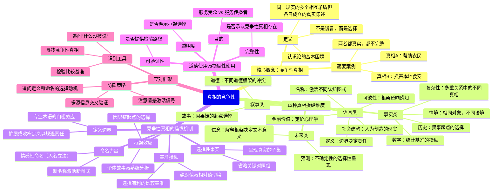
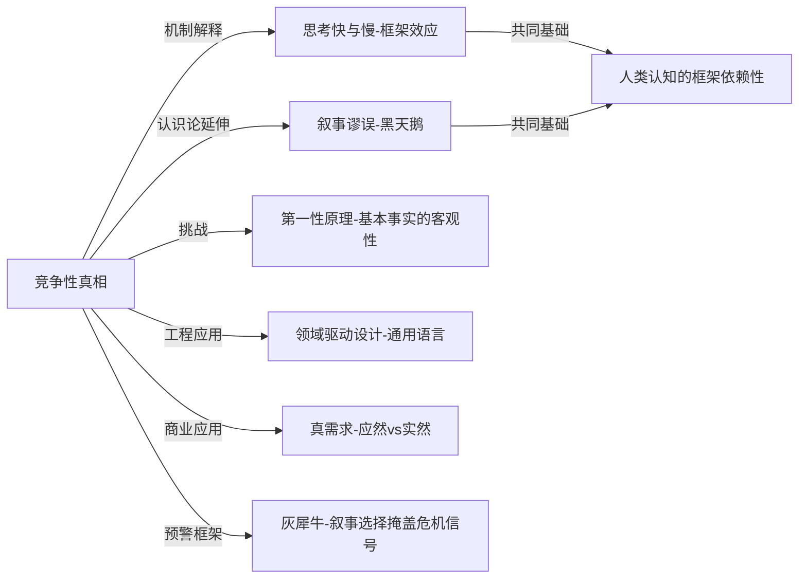

# 《真相》读书笔记

## 📚 基础信息
- **书名**: 真相：信息超载时代如何知道该相信什么
- **原书名**: Truth: How the Many Sides of Every Story Shape Our Reality
- **作者**: 赫克托·麦克唐纳（Hector Macdonald）
- **出版社**: Little, Brown（美）/ 中信出版社（中译版）
- **出版年份**: 2018年（原版）；2019年（中文版）
- **页数**: 约320页
- **阅读状态**: ☐ 正在阅读 ☐ 已完成 ☐ 暂停
- **个人评分**: ⭐⭐⭐⭐
- **标签**: 认识论、信息素养、媒介批评、叙事分析、批判性思维、传播学

---

## 📖 内容概要

### 书籍简介

麦克唐纳是英国作家、品牌传播专家，曾为多国政府和顶级企业提供战略传播咨询。《真相》是他基于二十年传播实践的认识论反思——不是一本揭露谎言的书，而是一本关于**"在没有谎言的情况下，真相仍然可以被系统性操纵"**的书。

本书的核心命题：**竞争性真相（Competing Truths）**——关于同一事物，可以同时存在多个相互矛盾但各自成立的真实陈述。理解这一点，你才能真正理解现代信息环境中的说服、误导和操纵的运作机制。

开篇案例：藜麦（Quinoa）。西方消费者购买玻利维亚藜麦——
- **真相A**：提高了当地农民收入，是公平贸易的成功案例
- **真相B**：使本地居民买不起传统主食，是新殖民主义的食品剥削

两个陈述都基于真实数据，都不是谎言，但给人完全相反的道德判断。后续研究显示净效益是正面的，但**竞争性真相框架本身已经在媒体中永久存活**。

这就是本书要处理的核心问题：当所有人都"在说真话"时，为什么我们仍然无法理解真相？

### 核心主题
1. **竞争性真相的本质**: 同一现实可以产生多个相互矛盾但各自成立的真实陈述
2. **13种真相操纵机制**: 从数字、历史到名称、信念，真相被选择和框架的方式
3. **识别操纵的工具**: 如何区分合理的"部分真相"与蓄意的"误导性真相"
4. **道德使用真相**: 在复杂现实中，什么是负责任地传达真相

### 主要章节结构

**导论：竞争性真相的概念**
- 藜麦案例导入
- 核心论题：真相不是单数，而是复数

**第一部分：事实的操纵（Empirical Truths）**
- 第1章 **复杂性（Complexity）**: Amazon 是英雄还是恶棍？同一实体在不同关系中的真相
- 第2章 **历史（History）**: 可口可乐起源、南北战争叙事——历史如何被选择性重构
- 第3章 **情境（Context）**: 艾米里·德奥利（艺术伪造案）——同一对象在不同情境中价值完全不同
- 第4章 **数字（Numbers）**: 北极开采、爱尔兰GDP、左撇子寿命——统计数字的选择性操纵

**第二部分：叙事与价值（Narrative & Values）**
- 第5章 **故事（Story）**: 卡特里娜飓风叙事——因果起点的选择决定责任归属
- 第6章 **道德（Morality）**: 毒品政策、器官捐献——同一行为在不同道德框架下的截然不同评价

**第三部分：感知与语言（Perception & Language）**
- 第7章 **可欲性（Desirability）**: 食品标签实验——同一食物因标签改变而改变感知
- 第8章 **金融价值（Financial Value）**: 钻石营销、定价心理学
- 第9章 **定义（Definitions）**: 卢旺达种族灭绝、克林顿的"is"——定义边界决定责任和义务
- 第10章 **社会建构（Social Constructs）**: 人权、中国社会信用体系——人为构建的"现实"
- 第11章 **名称（Names）**: 智利海鲈鱼更名、Frank Luntz的"死亡税"——名称激活不同认知图式

**第四部分：未来与信念（Future & Mind）**
- 第12章 **预测（Predictions）**: 气候科学的不确定性、先发制人战争的合理化
- 第13章 **信念（Beliefs）**: 吉姆·琼斯、薄伽梵歌的不同解读——信念系统如何决定同一文本的解读

---

## 🧠 知识架构



---

## ✍️ 读书笔记

### 导论：为什么所有人都"在说真话"却没有人真正了解真相

麦克唐纳用藜麦案例打开了全书的核心问题。这个案例之所以典型，是因为两个相互对立的叙事都可以引用真实的统计数据支撑，都没有说谎，但给出了截然相反的道德结论。

> "竞争性真相不是谎言，而是被选中的真实。问题不在于'对方在撒谎吗'，而在于'对方选择了哪个真相，而故意不说哪个真相'。"

这个框架的颠覆性在于：**它把"真相"从一个二元问题（真/假）变成了一个多维问题（哪些真相被选中了，哪些没有）**。传统的"事实核查"文化假设谎言是问题的根源，但麦克唐纳指出，在信息操纵最精致的形式里，撒谎是不必要的——选择性呈现真相已经足够。

---

### 第一部分：事实类操纵

#### 第一章：复杂性——Amazon是英雄还是恶棍？

Amazon 对出版商是破坏者，对读者是解放者，对作者是平台，对员工是剥削者，对社区是税收逃避者，对纳税人是基础设施搭便车者。每一个描述都是真实的，没有一个是完整的。

**核心洞见**：现代组织的复杂性使得"竞争性真相"不可避免——任何足够大的实体都必然对不同关系方是不同的东西。利用这种复杂性进行有选择性的自我呈现，是现代企业传播的基本操作。

Bell Pottinger 南非案是更极端的案例：公关公司帮助古普塔家族（与桑顿纳的腐败案主角）构建了一套完全基于真实历史的种族不平等叙事，但用来为当代腐败转移注意力。每一个历史事实都是真实的，整体叙事是为腐败服务的。

```
复杂性操纵框架：

同一实体 → [选择性关系视角] → 截然不同的真相

Amazon ──→ 出版商视角 ──→ "毁灭行业的恶棍"
Amazon ──→ 读者视角   ──→ "降低成本的英雄"
Amazon ──→ 员工视角   ──→ "高压剥削的工厂"

防御：始终追问"这个描述从谁的角度出发？其他角度的真相是什么？"
```

#### 第二章：历史——因果叙事的起点选择

可口可乐的"历史"可以从 1886 年开始（一位药剂师的发明），也可以从含可卡因的配方争议开始，也可以从品牌营造"现代圣诞老人"形象的商业史开始——每个起点都产生不同的品牌叙事。

更严肃的案例：美国南北战争。"关于州权的战争"和"关于奴隶制的战争"两种历史叙事都可以找到文献支撑，但前者在"南方荣耀"（Lost Cause）运动中被系统性地强化，服务于特定的政治目的。

**核心洞见**：历史叙事的操纵不需要篡改事实，只需要控制起点、终点和因果链的选择。当你选择从哪一刻开始讲述故事，你已经在决定谁应该承担责任、谁是受害者、什么是正义。

德高乐与欧盟的案例：戴高乐是欧盟整合的阻碍者（历史A），还是欧洲主权的捍卫者（历史B）？两个叙事都有历史文献支撑，但在当代政治中被不同力量选择性调用。

#### 第三章：情境——相同对象，不同语境，完全不同的价值

艺术伪造者艾米里·德奥利（Elmyr de Hory）的案例：他的仿画在被认定为马蒂斯真品时，艺评人赞叹其"真正的情感深度"；被认定为仿品后，同样的画被描述为"明显缺乏真实艺术家的灵魂"。

**核心洞见**：同一对象在不同情境中不只是被"看起来不同"——在某些领域（艺术、葡萄酒、奢侈品），情境本身就**构成了**价值，而不只是影响了对预先存在的价值的感知。

这里有一个深层的认识论问题：我们以为我们在评估客观属性，但我们其实在评估"这个属性 + 我对这个情境的认知"的组合。

培育肉（Cultured Meat）案例：同样的蛋白质来源，当被框架为"实验室合成肉"时引发抗拒，当被框架为"清洁肉食"时获得更高接受度。情境不只改变了感知，也改变了伦理评价。

#### 第四章：数字——统计操纵的精密机制

这是全书技术含量最高的章节，揭示了数字如何在不说谎的情况下系统性误导。

**案例1：北极野生动物保护区钻探争议**

切尼政府声称钻探面积"仅为" 2,000 英亩（约0.01%的保护区面积）。
环保团体声称影响 150 万英亩的野生动物栖息地。

两个数字都是真实的。一个描述的是实际钻探平台占地面积，另一个描述的是钻探活动影响的生态区域。选择哪个数字，决定了你得出的结论。

**案例2：爱尔兰 GDP 异常**

2015 年，爱尔兰 GDP 暴涨 26.3%，成为欧盟增长最快的经济体。

真相是：苹果、谷歌等跨国公司将知识产权资产转移到爱尔兰，使其账面上归属于爱尔兰，从而制造了 GDP 数字暴涨的幻觉，但与爱尔兰居民的实际生活水平几乎无关。

**案例3：左撇子的寿命研究**

同一组数据，因为选择不同的出生年代作为基准，可以得出"左撇子比右撇子平均少活9年"或"两者寿命无显著差异"的截然不同结论。（真正原因是老一代左撇子被强制改为右手，造成了数据的代际偏差。）

```
数字操纵的常见机制：

1. 基准选择（Baseline Manipulation）
   "失业率降至5%"  ← 选择了不包含停止找工作者的统计口径
   实际可能是：如果包含"沮丧工人"，数字是9.5%

2. 绝对值/相对值切换
   "死亡风险增加100%" ← 听起来可怕
   实际是：从0.001%增加到0.002%（绝对值仅增加0.001%）

3. 遗漏关键分母
   "94 million Americans are out of the labor force" ← 看起来很高
   实际包含了退休人员、学生、家庭照护者

4. 情境数字（Contextual Numbers）
   钻探面积2000英亩 vs. 影响面积150万英亩
   两个数字都是真实的，但描述了完全不同的"事情"

防御：始终追问比较基准是什么、分母是什么、这个数字测量的究竟是什么
```

---

### 第二部分：叙事类操纵

#### 第五章：故事——因果链起点决定责任归属

卡特里娜飓风叙事：
- **叙事A（个人失职）**：联邦紧急事务管理署局长 Michael Brown 的无能导致了救援失败
- **叙事B（系统失败）**：数十年的防洪基础设施投资不足、新奥尔良的种族隔离贫困化历史、Louisiana 州与联邦的协调机制失败

个人失职叙事更容易讲述，更符合我们对"英雄/恶棍"故事的直觉期待，也更容易转化为具体的人员问责。系统分析叙事更准确，但指向的是结构性改革，没有明确的责任人，也没有引人入胜的叙事弧线。

> "每个故事都有一个选择的起点。将起点设置在哪里，决定了谁是责任人。"

**核心洞见**：媒体和政治中对"个人故事"的偏好（Availability Heuristic）不只是叙事风格问题，而是系统性地把结构性问题转化为个人道德问题，从而规避了对结构的追责。

#### 第六章：道德——同一行为的不同道德框架

Dissoi Logoi（古希腊哲学文献）提供了全书最古老的竞争性真相案例：同一行为在不同情境下可以同时是道德的和不道德的。麦克唐纳用海特（Jonathan Haidt）的**道德基础理论（Moral Foundations Theory）**来解释：

```
海特的六大道德基础：
1. 关怀/伤害（Care/Harm）
2. 公平/欺骗（Fairness/Cheating）
3. 忠诚/背叛（Loyalty/Betrayal）
4. 权威/颠覆（Authority/Subversion）
5. 纯洁/堕落（Sanctity/Degradation）
6. 自由/压迫（Liberty/Oppression）

毒品政策的竞争性道德真相：
- 自由主义框架（基础1+6）："禁毒政策侵犯个人自主权，并不减少伤害"
- 保守主义框架（基础3+5）："毒品破坏家庭和社区的纯洁性和凝聚力"
- 两个框架都在引用真实的价值，都不是谎言
```

**核心洞见**：大多数政治和道德争议不是"真相 vs. 谎言"的对抗，而是不同道德基础框架之间的竞争性真相冲突。如果你不理解对方在激活的是哪个道德基础，你就无法真正理解他们为什么坚持那个立场。

---

### 第三部分：语言类操纵

#### 第七章：可欲性——相同内容，不同框架，完全不同的接受度

食品标签实验：同一种食物，标注"75%无脂肪"和标注"含25%脂肪"对消费者的吸引力显著不同——即使消费者都知道这两个陈述是等价的。

移民数据实验：相同的移民统计数字，在不同的情感性框架下（威胁框架 vs. 贡献框架），被受试者评估为支持完全相反的政策结论。

**核心洞见**：框架效应不只影响感知，还影响人们从相同事实中推导出的结论。这不是非理性，而是人类认知的结构性特征——我们不是在直接解读信息，而是在"情感框架 + 信息"的组合中构建意义。

#### 第九章：定义——边界决定责任和义务

这是全书最具政治深度的章节。

**案例1：卢旺达种族灭绝与"genocide"的回避**

根据 1948 年《灭绝种族罪公约》，一旦某情况被正式认定为"genocide"，签约国有干预义务。1994 年卢旺达大屠杀期间，美国国务院内部备忘录明确指示官员"不得使用 genocide 一词"，而是改用"acts of genocide may have occurred"——通过定义边界的操控，直接规避了法律义务。

10 万人因此丧命于这场被刻意不定名的"种族灭绝"。

**案例2：克林顿的"is"**

>"This depends on what the meaning of 'is' is."

——比尔·克林顿在被问及是否对助手说"与莱温斯基没有关系"时的答复

克林顿不是在撒谎，而是在进行实时定义操纵：如果"is"指的是"现在正在进行中的关系"，他的陈述是真实的（因为关系已经结束）；如果"is"指的是"曾经发生过的关系"，则是虚假的。通过激活"is"的精确语法含义，他在没有技术上撒谎的情况下制造了误导。

```
定义操纵的运作机制：

[定义边界] 决定 [责任范围]
           决定 [道德义务]
           决定 [法律责任]

卢旺达：
  "acts of genocide" ≠ "genocide"
  在法律层面意味着："我们不必出兵"

定义操纵 vs. 正当定义讨论 的区别：
  正当：在透明的框架内讨论哪个定义更准确地描述现实
  操纵：刻意选择能规避义务的定义，而不是最能描述现实的定义
```

#### 第十一章：名称——激活不同认知图式

**智利海鲈鱼（Chilean Sea Bass）**：这种鱼的原名叫"巴塔哥尼亚齿鱼"（Patagonian Toothfish），销量极差。更名为"智利海鲈鱼"后，销量暴涨，以至于成为濒危物种。同样的鱼，同样的味道，不同的名称激活了完全不同的感知图式（"牙鱼"vs."海鲈"，前者让人联想到丑陋粗糙，后者联想到精致可口）。

**Frank Luntz 的"死亡税"**：美国共和党顾问 Frank Luntz 建议将"遗产税"（estate tax）更名为"死亡税"（death tax）。测试显示，使用"遗产税"时，大多数受访者支持对高额遗产征税；使用"死亡税"时，大多数人反对——即使他们的经济利益完全相同，甚至即使他们的遗产远低于征税门槛。

名称不只是标签，而是激活了整个相关联的情感和认知网络。

---

### 第四部分：未来与信念

#### 第十二章：预测——不确定性的选择性呈现

气候科学的案例：IPCC 报告包含了一个置信区间（升温可能在 1.5°C 到 4.5°C 之间）。否认气候变化的人引用"可能只有 1.5°C"作为证据，气候活动家引用"可能高达 4.5°C"作为证据。两者都在引用 IPCC 的真实数据，但对同一个不确定性范围做出了相反的叙事选择。

**核心洞见**：不确定性不是中立的——它可以被选择性呈现，使得"最好情况"和"最坏情况"都可以被声称是"科学预测"。对抗这种操纵的关键是：要求完整的置信区间，而不是点估计。

先发制人战争（Pre-emptive War）的道德合理化：国际法允许"即将发生的威胁"下的自卫行动，但"即将发生"的定义被不断扩展，以涵盖"潜在的、将来可能的威胁"——2003年伊拉克战争的合法性辩护就是如此。

#### 第十三章：信念——同一文本的不同解读

薄伽梵歌（Bhagavad Gita）被甘地解读为非暴力抵抗的宗教依据，但刺杀甘地的 Nathuram Godse 在法庭陈述中也引用同一文本为其行为辩护——并认为自己是真正忠实于文本精神的。

同一神圣文本，支持了两种截然相反的行动，给出了两种截然相反的道德结论。

吉姆·琼斯（Jim Jones）案例：人民圣殿教成员不是因为被欺骗才追随他，而是因为他们的信念系统使得他们对不同寻常的主张有特殊的开放性——最终在圭亚那农业社区集体自杀。

**核心洞见**：信念系统不只是帮助我们解读信息，更是决定了我们认为哪些信息是相关的、哪些证据是有效的。这使得不同信念系统之间的真相争论，往往不是对同一事实的不同解读，而是对"什么算作证据"本身的根本性分歧。

---

## 💭 深度衍生思考

### 🎯 核心观点延伸

#### 延伸1：竞争性真相与《黑天鹅》的"叙事谬误"是同一枚硬币的两面

塔勒布的叙事谬误（Narrative Fallacy）描述的是：人类把随机事件压缩成有因果关系的故事，从而产生虚假的确定感。

麦克唐纳的竞争性真相描述的是：从同一组真实事件中，可以构建出多个相互竞争的有意义叙事。

两者的深层联系：**我们对"一个故事"的需求，使我们特别容易被竞争性真相中的"获胜叙事"操纵。** 一旦一个故事被接受，它会自动过滤掉与它竞争的真相——不是因为竞争性真相消失了，而是因为我们的叙事化认知不再去寻找它们。

这意味着：对叙事谬误的应对（塔勒布的建议：记日记、重视直接经验）和对竞争性真相的应对（麦克唐纳的建议：主动寻找对立叙事）在认知操作上是同一件事——都是在对抗大脑的单叙事化倾向。

#### 延伸2：这本书直接挑战了《第一性原理》的一个核心假设

第一性原理思维的核心是：回归基本事实（first principles），打破中间假设，重新推导。

麦克唐纳的框架提出了一个深刻的问题：**"基本事实"本身就是竞争性的**。"哪些事实是基础的"这个问题，已经预先嵌入了一个选择框架。

藜麦案例：如果你的第一性原理是"消费者福祉"，北欧消费者的健康饮食需求是基本事实；如果你的第一性原理是"粮食主权"，玻利维亚农民获得传统主食的权利是基本事实。两组事实都是真实的，但你选择哪组作为"基础"，决定了你的整个推导。

**这是一个重要的认识论修正**：第一性原理不只是要"问更深的问题"，还要问"我在这个层面的事实选择本身是基于什么框架"——即对第一性原理本身进行元级别的竞争性真相审视。

#### 延伸3：定义章节对领域驱动设计（DDD）的启发

《真相》第九章关于定义操纵的分析，与《领域驱动设计》中"通用语言（Ubiquitous Language）"的重要性高度同构。

在软件工程中，定义不一致不只是沟通问题，而是**系统性的业务逻辑错误来源**：
- "用户"在销售系统里是账户持有人，在客服系统里是任何联系客服的人，在数据分析里是过去30天有操作记录的账户——同一个词，三个相互矛盾的定义
- 当这三个系统的代码都假设自己的定义是"正确的"时，跨系统的行为就会产生难以调试的错误

麦克唐纳的卢旺达案例和克林顿案例，揭示了一个更深的原理：**定义不只是语义问题，而是责任和义务的边界划定**。软件系统中的定义不一致，最终也会导致"责任边界"的模糊——这个功能是你的系统负责还是我的系统负责？

**落地建议**：在微服务边界设计中，每个服务对核心业务概念的定义必须明确且有意识地选择，而不是默认继承调用方的定义。对定义的选择应该被视为"责任范围声明"，而不只是技术实现细节。

#### 延伸4：名称章节与产品命名的竞争性真相

"智利海鲈鱼"更名案例，是产品命名最有力的实证研究之一。麦克唐纳提供了一个超越营销直觉的认识论解释：**名称不只是标签，而是激活了整个相关联的认知-情感网络**。

对游戏设计的直接启发：
- 游戏机制名称激活的认知图式会影响玩家的行为策略选择。例如同样的"冷却时间"，如果叫做"充能时间"，玩家会更愿意等待（期待感），如果叫"惩罚时间"，玩家会感到被限制。
- 游戏类型命名（"Roguelike"、"Soulslike"）激活了完整的玩家期望体系——既是营销工具，也是设计承诺

#### 延伸5：这本书与《思考快与慢》的竞争性真相

卡尼曼的系统1/系统2框架隐含了一个价值判断：系统2（理性分析）比系统1（直觉）更可靠，至少在复杂决策中是如此。

麦克唐纳的竞争性真相框架提出了一个更复杂的图景：**即使是系统2的理性分析，也无法摆脱竞争性真相的困境**，因为：
1. 你选择分析哪些事实（而不是所有可能的事实）已经是框架的选择
2. 你使用的比较基准本身就是选择的产物
3. 你对"证据"的定义，已经预先排除了某些竞争性真相

这意味着：激活系统2不足以克服竞争性真相的影响——你还需要**元认知层面的竞争性真相意识**，即主动追问"我在这个分析中选择了哪个框架，而没有考虑哪个框架"。

### 🔍 多角度分析

**反向思考**：如果麦克唐纳是对的会怎样？ 如果所有重要叙事都是竞争性真相的选择性组合，那么追求"客观真相"是否是一个不可能实现的目标？麦克唐纳的回答是中间立场：不是说没有客观真相，而是说"人类可以直接传达的"永远只是竞争性真相中被选中的子集。认识到这一点，我们的目标不是"发现唯一真相"，而是"收集足够多的竞争性真相，以形成更接近完整现实的理解"。

**历史视角**：麦克唐纳引用的 Dissoi Logoi（《两面论》）是公元前 400 年的古希腊文献，说明人类对"竞争性真相"的觉察几乎和有记录的哲学史一样古老。但直到信息时代，竞争性真相的生产和传播速度才超过了人类的认知处理能力，使得这个古老问题变成了现代危机。

---

## 🎯 实践应用

### 信息消费层面

**1. "竞争性真相"审查清单**

在接受任何重要叙事之前，用以下问题审查：
- 这个陈述选择了哪个比较基准？其他合理的基准会给出什么结果？
- 这个叙事的因果链从哪里开始？如果从更早或更晚的节点开始，责任归属会改变吗？
- 使用了什么定义？这个定义的边界选择在规避什么责任？
- 这个命名/标签激活了什么样的情感图式？如果换个名字，我的直觉反应会变吗？

**2. 主动寻找竞争性叙事**

不是要找"对立面"，而是找"同样基于真实数据的不同框架"：
- Amazon 的故事不只有"消费者福音"版本，也有"出版业毁灭者"版本
- 同一个统计数字，不只有呈现出的那个基准，还有其他同样合理的基准

### 工程/产品层面

**3. API 和系统设计中的定义明确性**

受第九章启发，每当在技术文档中定义核心业务概念时：
- 明确写出"这个定义的边界包括什么，不包括什么"
- 明确写出"在我们的系统中，'用户'的定义是X，与其他系统可能不同"
- 对重要概念进行显式的版本管理，当定义变更时明确记录

**4. 产品文案的竞争性框架测试**

在最终确定重要的产品命名、功能名称、营销文案之前：
- 测试这个名称激活了哪些认知图式
- 检验在不同用户群体中，这个名称是否激活了不同的（可能相互矛盾的）关联网络
- 问自己：这个命名是在帮助用户更准确地理解产品，还是在引导他们向有利于我们的方向解读？

---

## 🔗 知识关联网络

### 与已读书籍的关联

**《思考快与慢》（卡尼曼）**：关联强度 ⭐⭐⭐⭐⭐
- 框架效应（Framing Effect）是卡尼曼研究的核心发现之一；麦克唐纳的书可以看作是框架效应在现实信息操纵中的系统性应用手册
- 可得性启发（Availability Heuristic）解释了为什么"个人故事"叙事（卡特里娜章节）比系统分析叙事更有说服力
- 两本书的深层张力：卡尼曼认为激活系统2可以克服系统1的偏差；麦克唐纳隐含地指出，即使在系统2层面，框架的选择也是预先存在的

**《黑天鹅》（塔勒布）**：关联强度 ⭐⭐⭐⭐
- 叙事谬误（Narrative Fallacy）与竞争性真相是同一认知问题的两个维度：塔勒布关注"我们如何把随机性压缩成因果故事"，麦克唐纳关注"我们如何从多个竞争性真相中选出一个来叙事"
- 两者都揭示了"我们以为我们理解的远多于实际上理解的"这一认识论困境

**《第一性原理》**：关联强度 ⭐⭐⭐⭐
- 第一性原理要求"打破中间假设，回归基本事实"；竞争性真相揭示"基本事实本身就是选择的产物"
- 互补关系：第一性原理提供了"向下挖掘假设"的工具；竞争性真相理论提供了"在同一层次检查框架选择"的工具

**《灰犀牛》（渥克）**：关联强度 ⭐⭐⭐
- 灰犀牛理论解释了为什么我们对已知危机不行动（激励结构失败）；竞争性真相理论解释了为什么"已知危机"的认知本身是被操纵的（叙事选择失败）
- 关联点：灰犀牛的"集体沉默"（每个人都知道但没人说）可以用竞争性真相来解释——在有利于当前行动方的叙事框架下，危机信号被框架为"正常噪声"

**《领域驱动设计》（Eric Evans）**：关联强度 ⭐⭐⭐⭐
- 通用语言（Ubiquitous Language）是对定义不一致问题的工程解决方案；麦克唐纳的定义章节解释了为什么定义不一致是系统性问题而非沟通细节
- 限界上下文（Bounded Context）本质上是在软件架构层面承认"同一个概念在不同语境中有合理的不同定义"——这正是竞争性真相框架在工程中的制度化实现

**《真需求》（梁宁）**：关联强度 ⭐⭐⭐⭐
- 梁宁的"应然 vs 实然"框架与竞争性真相高度同构：产品经理构建的用户行为叙事（应然）和用户的实际行为（实然），本质上是同一现实的两种竞争性真相
- 认知战（梁宁的概念）的核心机制，正是麦克唐纳描述的竞争性真相的战略性使用

### 概念映射



### 知识依赖关系
- **前置建议**：读过《思考快与慢》效果最佳，麦克唐纳的很多案例可以用卡尼曼的框架来解释机制
- **配合阅读**：与《黑天鹅》同读，形成对"叙事操纵"问题的完整图景
- **后续延伸**：《后真相》（Lee McIntyre）——从哲学角度更深入探讨真相在政治中的地位

---

## 📚 后续阅读路径规划

### 直接延伸
1. **《后真相》（Post-Truth, Lee McIntyre）**——关联度 ⭐⭐⭐⭐⭐，优先级：高
   - 哲学层面对"后真相时代"的系统性分析
   - 预期收获：从认识论到政治现实的完整连接

2. **《正义之心》（The Righteous Mind, Jonathan Haidt）**——关联度 ⭐⭐⭐⭐⭐，优先级：高
   - 麦克唐纳多次引用的道德基础理论原著
   - 预期收获：理解为什么不同道德框架的人无法理解彼此的竞争性真相

3. **《如何不被统计数字愚弄》（How to Lie with Statistics, Darrell Huff）**——关联度 ⭐⭐⭐⭐，优先级：中
   - 第四章"数字"的经典参考文献
   - 预期收获：统计操纵的完整工具箱

### 交叉验证
1. **《公众舆论》（Public Opinion, Walter Lippmann）**——关联度 ⭐⭐⭐⭐，优先级：中
   - 麦克唐纳引用的经典文献，1922年出版，但关于"刻板印象如何过滤现实"的分析至今仍然准确
   - 预期收获：竞争性真相问题的历史深度

---

## 📊 学习总结

### 最大的收获

**《真相》提供了一个新的信息分析起点**：不要从"这是真的还是假的"开始，而要从"这是哪个竞争性真相的哪种选择性呈现"开始。这个转变使得信息分析从二元的真/假判断，变成了多维的"什么被说了、什么没被说、选择的框架是什么"的结构性审查。

### 改变的观念

1. **之前**：事实核查可以解决信息操纵问题——如果一个陈述是真实的，它就不构成操纵
   **之后**：最精致的信息操纵恰恰完全依赖真实事实，只是通过选择性的竞争性真相来达成。事实核查是必要但不充分的

2. **之前**：不同政治立场之间的争议，主要是关于事实的分歧
   **之后**：大多数政治争议是关于使用哪个道德基础框架（海特）来解释同一组事实的分歧——是竞争性道德真相，而不是竞争性事实真相

3. **之前**：第一性原理思维可以帮助我穿越表面叙事，到达"基本事实"层面
   **之后**：即使是"基本事实"的选择，也是一个框架选择。第一性原理需要同时配合"对第一性原理层面的框架选择进行元审查"

### 未来行动

- **信息消费**：养成"主动寻找竞争性叙事"的习惯——每当接受一个重要叙事时，主动问"存在哪些同样基于真实数据的替代叙事"
- **技术文档**：在核心业务概念的定义中，明确写出"这个定义的边界"和"这个定义在哪些系统/语境中不适用"
- **产品命名**：在最终确定命名之前，测试它激活的认知图式是否服务于用户的理解，而不只是服务于我们的营销目标

---

## 🔗 来源

- Hector Macdonald Official Site: hectormacdonald.com/truth-references
- Shortform Summary of Truth by Hector Macdonald
- Strategy+Umwelt Book Review: Truth by Hector Macdonald

---

**笔记创建时间**: 2026-06-22
**最后更新**: 2026-06-22
**笔记版本**: v1.0
