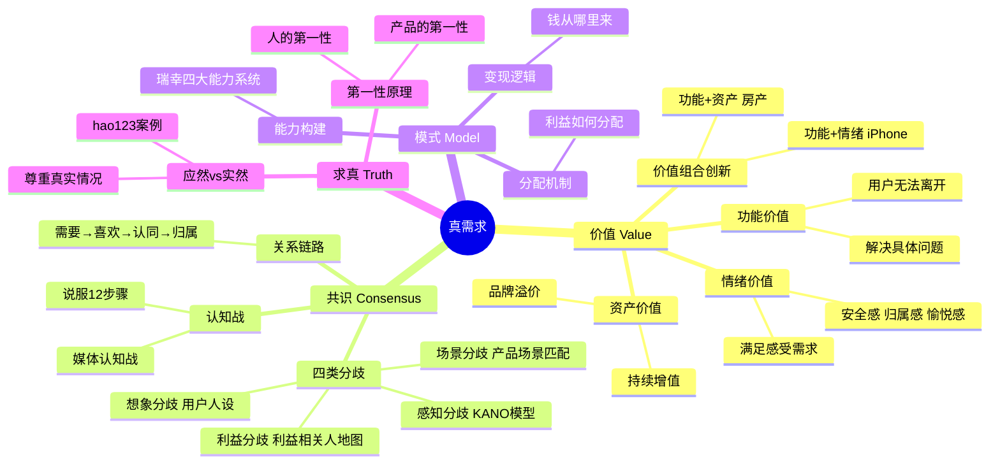
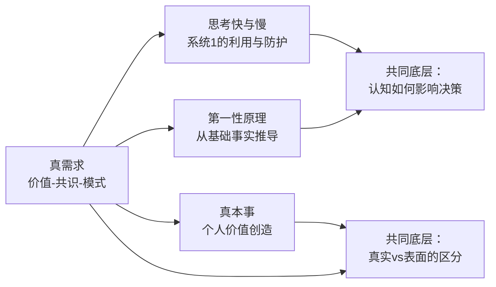

# 📚 真需求

## 📖 基本信息

- **书名**: 真需求
- **作者**: 梁宁
- **出版社**: 新星出版社（得到图书出品）
- **出版年份**: 2024年11月
- **页数**: 472页
- **ISBN**: 9787513357685
- **定价**: 99元
- **阅读状态**: ☐ 正在阅读 ☑ 已完成 ☐ 暂停
- **个人评分**: ⭐⭐⭐⭐ (待填写)
- **豆瓣评分**: 8.3分（约2971人评价）
- **标签**: 商业思维, 产品思维, 需求分析, 第一性原理, 商业模式, 品牌, 创业

---

## 📝 内容概要

### 书籍简介

《真需求》是梁宁（得到App《产品思维30讲》《增长思维30讲》作者）历时多年的商业思考集大成之作。全书提出一个极简框架：**价值—共识—模式**，并以此解构99%商业失败的根源——对"真需求"的误判。

书中案例横跨百年：从丝绸之路到SHEIN，从中国手机三十年到脑白金的认知战，从瑞幸的能力系统到Web1.0门户→Web2.0→今日头条的演化。梁宁试图回答的核心问题是：**在你努力工作之前，你是否真的理解你在为谁创造什么价值？**

### 核心主题

1. **价值** — 你真正能提供什么？功能价值、情绪价值、资产价值如何组合创新
2. **共识** — 如何让用户真正理解并认同你的价值？四类分歧的识别与化解
3. **模式** — 能力怎么构建？钱从哪来？利益如何分配？
4. **求真** — 区分"应然"与"实然"，从第一性原理出发重新定义问题

### 主要章节结构

| 部分 | 核心问题 | 关键案例 |
|------|---------|---------|
| PART ONE 价值 | 你的产品究竟在解决什么？ | 中国手机三十年、苹果产品线 |
| PART TWO 共识 | 为什么用户不理解你的好？ | 脑白金认知战、OICQ场景匹配 |
| PART THREE 模式 | 你有没有一套可持续运转的体系？ | 瑞幸四大能力系统、互联网媒体演化 |
| PART FOUR 求真 | 你在解决真实存在的问题吗？ | hao123案例、第一性原理 |

---

## 🧠 知识架构



---

## 🔍 核心概念深度解析

### PART ONE 价值——你真正在卖什么？

**产品三类价值的本质区分：**

```
价值类型对比
══════════════════════════════════════════════════════
              功能价值          情绪价值          资产价值
──────────────────────────────────────────────────────
本质          解决具体问题      满足感受需求      提供未来升值预期
用户购买理由  "它能帮我做X"    "它让我感到Y"    "它会变得更值钱"
典型产品      菜刀、Excel       奢侈品、宠物      房产、教育
失去后感受    不便（找替代）    失落（情感缺口）  损失（财务损失）
竞争护城河    功能优越性        情感连接深度      稀缺性+信任
══════════════════════════════════════════════════════
```

**梁宁最反直觉的观点**：大多数人认为"功能越强大越好"，但书中的核心洞察是——**功能价值是竞争的起点，不是终点**。山寨手机的功能价值完全够用，但失败了；iPhone 的功能并不总是最强，但赢了。情绪价值和资产价值才是防止被替代的护城河。

**品牌价值的本质**：品牌不是靠"新鲜感"，而是靠"唤起感"。白牌每次都要重新建立信任；品牌是已经存储在用户记忆中的稳定联想。这解释了为什么白牌在单品爆火之后，往往无法建立持续的定价权。

---

### PART TWO 共识——用户为什么不买单？

**四类分歧的识别框架：**

```
分歧类型 → 根本原因 → 化解策略
──────────────────────────────────────────────────
感知分歧  用户没有感受到你的价值   体验设计，让价值可感知
想象分歧  用户的期待和你给的不一致  用户人设，精准匹配目标用户的想象
场景分歧  你的产品在用户的场景中不自然  场景嵌入，让产品成为用户场景的一部分
利益分歧  各方利益未得到满足       利益相关人地图，兼顾所有关键方
──────────────────────────────────────────────────
```

**OICQ（QQ）的场景匹配案例**：ICQ 是最早的即时通讯软件，但 OICQ（腾讯QQ）赢了。不只是因为功能，而是因为 OICQ 把"好友在线状态"做成了主动展示——这匹配了中国用户当时"想被看见、想保持连接"的社交场景，而不只是"发消息给特定人"的工具场景。场景决定了谁是真正的用户。

**脑白金的认知战**：脑白金的真正战场不是"保健品是否有效"，而是"过年送什么礼"的场景认知战。"今年过节不收礼，收礼只收脑白金"——这句话不是在讲产品功效，而是在植入一个送礼场景的默认选项。梁宁的洞察：**认知战的目标不是说服，而是让你的产品成为某个场景的第一联想**。

**关系链路：需要→喜欢→认同→归属**

这四个层次的递进是建立深度用户关系的路径：
- 停在"需要"层：用户一旦有替代品就离开
- 停在"喜欢"层：用户会在竞品打折时动摇
- 达到"认同"层：用户会主动为你辩护
- 达到"归属"层：用户的身份认同与你绑定（Apple 用户、特斯拉用户）

---

### PART THREE 模式——能力体系与变现逻辑

**瑞幸四大能力系统（梁宁最具体的商业分析案例）：**

```
瑞幸的能力系统
┌─────────────────────────────────────────────────┐
│  1. 产品能力：低价高频的标准化饮品              │
│     → 爆品逻辑，不靠体验靠供应链               │
├─────────────────────────────────────────────────┤
│  2. 运营能力：数字化驱动的精准运营              │
│     → App下单、私域流量、联名营销               │
├─────────────────────────────────────────────────┤
│  3. 渠道能力：快速开店+外卖双模式              │
│     → 店小密集，覆盖写字楼半径               │
├─────────────────────────────────────────────────┤
│  4. 资本能力：融资→烧钱→规模效应               │
│     → 用资本换时间，快速建立网络效应            │
└─────────────────────────────────────────────────┘
核心洞察：瑞幸的成功不是"咖啡更好喝"，
而是四个能力系统形成了别人难以复制的整体
```

**互联网媒体演化的底层逻辑**：
- Web1.0门户（新浪/搜狐）：人工编辑决定用户看什么
- Web2.0微博：用户关注决定信息流（社交图谱）
- 今日头条：算法根据行为决定用户看什么（兴趣图谱）

每一代升级本质上是**"谁来决定信息分发"的控制权转移**——从编辑到社交关系到算法。今日头条的革命性在于：它发现了用户"真正想看的"（行为数据）和"以为自己想看的"（关注列表）之间的巨大分歧。

---

### PART FOUR 求真——应然与实然

**hao123案例（梁宁最喜欢的反直觉案例）**：

hao123是一个只有导航链接的极简网页，被百度以5000万收购。那时"专业人士"都认为这种粗糙的产品毫无价值——"应然"是用户应该学会搜索和输入网址。但hao123解决的是"实然"——大量用户不会打网址，不会用搜索引擎，需要一个入口。

梁宁的核心论点：**商业洞察必须从"实然"出发，而不是从"应然"出发**。你认为用户应该怎么做，和用户实际怎么做，之间可能隔着一个巨大的鸿沟。

**第一性原理**：不是"我们行业的惯例是什么"，而是"回到最基础的事实，重新思考这件事"。梁宁给出的两个第一性原理追问：
- 人的第一性：这个用户/群体最根本的需求和动机是什么？
- 产品的第一性：这个产品最核心的价值交换是什么？

---

## ⚡ 批判性审视——我不完全同意的地方

### 1. "无法离开才是真需求"这个标准有循环论证的风险

书中强调"用户愿意承受不便利才能证明需求真实存在"。但这个标准是在用结果（用户留下来了）来验证需求的真实性——这是事后归因，而非事前判断工具。

真正的问题是：**在用户还没有使用你的产品之前，你怎么判断这是"真需求"？** 书中的案例大多是已经验证成功的产品，用成功来反推需求是真的，但这无法指导判断一个尚未存在的产品的需求真实性。

**反例**：新冠疫情期间，人们对"不出门"的依赖被创造出来（外卖、视频会议），这算"真需求"吗？还是被情境逼出来的"情境需求"？梁宁的框架在这个边界上的解释力有限。

### 2. "价值—共识—模式"框架过于干净，忽视了执行的混乱性

三要素框架在回顾时很清晰，但在预测时很模糊。几乎所有商业失败都能被事后装入这个框架（"他们的共识出了问题"、"模式不对"），但框架本身无法告诉你在具体情境下做什么。

**批评意见与书的辩护**：书中给出了大量方法工具（KANO模型、利益相关人地图、关系链路），这在一定程度上缓解了这个问题。但这些工具的应用场景非常依赖判断力，而不是机械执行——这让书对"希望学习具体操作"的读者帮助有限。

### 3. 案例选择有选择性偏差

书中所有案例都是"成功的选手"（脑白金赢了、瑞幸活下来了、今日头条成功了）。同样用"认知战"策略的产品失败了多少？同样建立了"四大能力系统"的公司倒了多少？书中没有讨论。**成功案例的共同特征不等于成功的充分条件**。

### 真正无可争议的洞察

抛开以上批评，以下几点我认为是这本书的核心价值：
- **"情绪价值"的系统化阐述**：这是过去十年中国消费市场演变的最准确概括之一
- **"应然vs实然"的区分**：是一个极具实用价值的思维工具，尤其对产品经理
- **关系链路（需要→喜欢→认同→归属）**：这个模型简洁有力，对品牌建设有直接指导意义

---

## 💭 深度衍生思考

### 与《思考快与慢》的深层对话

梁宁的"共识"理论和卡尼曼的"系统1"有深度的暗合：

用户的"感知分歧"来自系统1对产品的第一印象；"想象分歧"来自系统1根据已有经验构建的期待；而"认知战"的本质是**在用户的系统1中植入特定联想**（脑白金 = 送礼），绕过系统2的理性判断。

但两本书也有**张力**：卡尼曼教我们认识并警惕系统1的偏见；梁宁的书教我们如何利用系统1的偏见达成商业目标。读完两本书的综合认知是：**理解认知偏见有两种用途——一是保护自己不受操控，二是设计产品和传播触发他人的系统1**。

### "真需求"本身的哲学困境

谁来定义什么是"真"需求？
- 用户说出来的需求？（往往是症状而非根因）
- 用户行为显示的需求？（可能是短期行为，不代表长期价值）
- 产品设计者认为的需求？（可能是一厢情愿的"应然"）

梁宁的回答隐含在书中：**需求的"真"不是绝对的，而是在特定时间、特定用户群体、特定场景下的真**。这说明"真需求"不是一个可以永久确认的状态，而是一个需要持续验证的动态过程。

### 对游戏开发的跨领域启发

书中的框架对游戏设计有意想不到的直接适用性：

| 书中概念 | 游戏设计对应 |
|---------|-------------|
| 功能价值 | 核心玩法机制（解决"无聊"这个问题） |
| 情绪价值 | 游戏带来的情绪体验（爽、恐惧、惊喜） |
| 资产价值 | 玩家在游戏中积累的内容（角色、成就、社交关系） |
| 感知分歧 | 玩家没有感受到游戏的深度（新手引导失败） |
| 场景分歧 | 游戏的玩法不适合玩家的实际游玩场景（手游做成主机体验） |
| 应然vs实然 | 开发者认为玩家"应该"喜欢复杂系统，但玩家实际上想要上手即爽 |

---

## 🔗 知识关联网络

### 与已读书籍的关联——以及张力

- **思考快与慢**: 梁宁的"共识建立"理论是认知心理学在商业中的应用——但**书里有个值得注意的张力**：卡尼曼研究的是如何避免被系统1偏见误导，梁宁研究的是如何利用系统1偏见赢得用户。两本书同时读，会产生一种"我该保护自己不受操控，还是学会操控他人"的不适感，但这种不适感本身是有价值的 | 关联强度: ⭐⭐⭐⭐⭐

- **第一性原理**: 两本书共享"从基础事实重新推导"的方法论，但侧重不同——第一性原理更关注"如何正确推理"，真需求更关注"如何找到正确的问题" | 关联强度: ⭐⭐⭐⭐⭐

- **真本事 从会工作到会赚钱**: 两本书都关注"真实价值"的识别，但角度不同——真本事关注个人层面的价值创造，真需求关注产品/商业层面的价值创造。个人的"真本事"和产品的"真需求"是同一逻辑在不同层级的应用 | 关联强度: ⭐⭐⭐⭐

- **人月神话**: 《人月神话》揭示了软件项目估算中的"应然vs实然"——管理者认为增加人手"应该"加快进度，但实然是沟通成本使进度更慢。这是梁宁"应然vs实然"框架在软件工程领域的经典案例 | 关联强度: ⭐⭐⭐



### 知识依赖关系

- **前置知识**: 有一定的产品/商业工作经验；了解基本的用户研究概念；读过至少一本消费心理学或行为经济学书籍效果更佳
- **后续延伸**: 《助推》（行为经济学实践）→《定位》（认知战的经典理论）→《创新者的窘境》（破坏性创新视角）

---

## 📚 后续阅读路径规划

### 直接延伸

1. **《定位》— 艾·里斯 & 杰克·特劳特**
   - 关联度: ⭐⭐⭐⭐⭐
   - 阅读优先级: **高**
   - 预期收获: 梁宁的"认知战"理论的源头。定位理论系统论述了如何在用户心智中占据特定位置，是"共识"章节的理论基础

2. **《增长黑客》— 肖恩·埃利斯**
   - 关联度: ⭐⭐⭐⭐
   - 阅读优先级: **中**
   - 预期收获: "模式"章节的方法论补充——如何用数据驱动的方式验证和扩大商业模式

### 交叉验证

1. **《创新者的窘境》— 克莱顿·克里斯坦森**
   - 对比点: 梁宁的"功能价值→情绪价值"升维路径 vs 克里斯坦森的"低端破坏性创新"理论。两者对"谁是真正的用户"有不同的答案
   - 价值: 理解为什么做好产品不等于赢得市场

2. **《助推》— 理查德·泰勒**
   - 对比点: 梁宁的"认知战"是主动设计用户的认知；助推理论探讨如何通过设计环境帮助用户做出更好的选择——两者的伦理立场不同
   - 价值: 在"利用认知偏见"和"保护用户"之间找到平衡点

---

## 🎯 实践应用

### 对游戏项目（slayDemo）的直接应用

**用"真需求"框架审视 slayDemo 的当前定位：**

1. **功能价值**：提供 Roguelike 战斗和随机成长体验（"解决无聊"的功能）
2. **情绪价值**：玩家感受到什么情绪？是"爽感"、"探索刺激"、还是"掌控感"？这三者需要明确选一个主打
3. **资产价值**：玩家在游戏中积累的什么？（目前：成就解锁、Build 认知、游玩时长）

**感知分歧检查**：玩家第一次打开游戏，能否在5分钟内感受到情绪价值？如果玩家无法在第一局感受到"爽"，功能价值再好也没用。

**场景分歧检查**：slayDemo 的目标玩家在什么场景下游玩？是在电脑前的30分钟专注游玩，还是碎片化的手机游玩？这决定了关卡长度设计。

### 行动计划

1. **明确 slayDemo 的"一句话情绪价值"**
   - 具体步骤: 列出5个候选情绪词（爽/紧张/惊喜/掌控/探索），用现有游戏测试看哪个最常被玩家提到
   - 预期效果: 所有后续设计决策有了明确的情绪锚点
   - 时间安排: 下次完整游玩测试时记录

2. **做一次"应然vs实然"的自我审查**
   - 具体步骤: 列出我认为玩家"应该"喜欢的5个设计点，然后通过实际观察确认玩家"实际上"对哪些有反应
   - 预期效果: 找到设计预期和玩家实际体验之间的差距
   - 时间安排: 下一次让别人试玩时进行

---

## 📊 学习总结

### 最大的收获

**"应然vs实然"是我读完这本书后立刻能用的思维工具**。在设计游戏时，我经常陷入"玩家应该喜欢这个复杂系统"的应然思维，而实际玩家可能完全不在乎这个系统。梁宁给了这个直觉一个准确的词——这是方法论的清晰化，而不是新知识。

### 改变的观念

1. **原来认为**：好产品自然会被发现
   **现在认为**：好产品必须完成"认知战"——让目标用户在特定场景下想到你

2. **原来认为**：功能越强越有竞争力
   **现在认为**：功能价值是参赛门票，情绪价值和资产价值才是赢得长期用户的护城河

3. **原来认为**：先把产品做好，再想商业化
   **现在认为**：商业模式（"模式"）必须和价值、共识同步思考——因为模式的约束会反过来决定什么样的价值是可持续提供的

### 认知转变（第五层洞察）

读前：我认为"真需求"是一种可以被确认的事实状态——"这是真实的需求，那是伪需求"。

读后：**"真需求"不是事实，而是一个动态的、需要持续验证的假设**。今天的真需求可能因为场景变化（疫情）、技术变化（AI）、竞品出现而变成伪需求。梁宁框架最有价值的部分不是给出了"什么是真需求的答案"，而是给出了"如何持续追问真需求"的方法论。

这个认知转变的实际影响：我不再试图"找到"真需求然后停下来，而是把"持续验证需求假设"作为产品开发的常态，而不是阶段性任务。

---

**笔记创建时间**: 2026-06-17
**最后更新**: 2026-06-17
**笔记版本**: v1.0

---

## Sources

- 梁宁《真需求》，新星出版社，2024年11月
- 豆瓣读书《真需求》评分及评论
- 微信读书《真需求》页面（推荐值81.8%）
