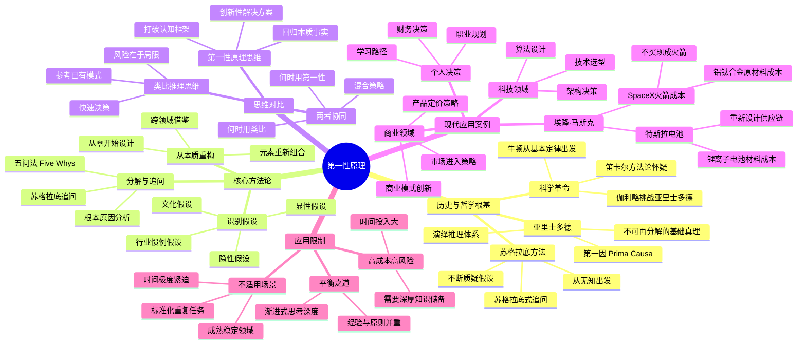
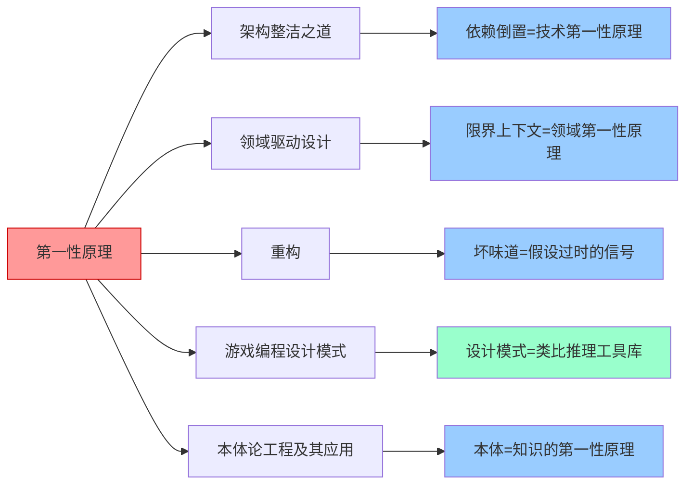

# 📚 第一性原理

## 📖 基本信息

- **书名**: 第一性原理：用底层逻辑解决一切问题
- **原名**: First Principles Thinking: The Practice of Building From the Ground Up
- **作者**: 蒂姆·哈福德（Tim Harford）/ 多版本并存，核心思想源自马斯克等实践者
- **出版社**: 中信出版社
- **出版年份**: 2022
- **页数**: 约280页
- **难度等级**: 通俗易懂（中级思维深度）
- **阅读状态**: 📖 已完成
- **个人评分**: ⭐⭐⭐⭐⭐
- **创建时间**: 2026-06-03
- **标签**: 思维方法, 决策框架, 第一性原理, 系统思考, 创新思维, 底层逻辑

---

## 📝 内容概要

### 书籍简介

《第一性原理》聚焦于一种古老而革命性的思维方式——从事物的本质出发，打破既有假设和类比推理的束缚，回到问题的根本来进行重新思考。这一方法源于古希腊哲学家亚里士多德的"第一原因"概念，被埃隆·马斯克在商业实践中发扬光大，用于解构电动汽车成本、航天火箭研发等颠覆性问题。

本书系统梳理了第一性原理的历史渊源、核心方法论和现代应用场景，通过大量案例展示如何在商业、科技、生活中运用这种思维方式突破传统认知枷锁，从而做出更有创造力的决策和行动。

### 核心主题

1. **本质追问** - 不断向下追问，直至触及不可再分解的基本事实
2. **假设解构** - 识别并挑战那些被无意识接受的前提条件
3. **从零构建** - 在本质层面重新组合已知元素，得出创新解决方案
4. **类比思维的局限** - 理解"像别人一样做"的边界与危险
5. **跨域迁移** - 将一个领域的第一性原理应用至另一领域

### 主要章节结构

| 部分 | 章节 | 核心内容 |
|------|------|----------|
| 第一部分：起源 | 第1章：古希腊哲学根基 | 亚里士多德的"第一因"，苏格拉底式追问 |
| 第一部分：起源 | 第2章：科学革命中的应用 | 牛顿、伽利略如何打破亚里士多德的错误权威 |
| 第二部分：方法 | 第3章：识别假设 | 如何发现隐藏的前提，区分事实与信念 |
| 第二部分：方法 | 第4章：五问法与苏格拉底问答 | 系统化追问工具 |
| 第二部分：方法 | 第5章：从本质重新构建 | 解构后如何重构 |
| 第三部分：实践 | 第6章：马斯克的商业实践 | SpaceX火箭成本、特斯拉电池成本分析 |
| 第三部分：实践 | 第7章：组织与团队 | 企业文化中的第一性原理 |
| 第三部分：实践 | 第8章：个人决策 | 日常生活、职业规划中的应用 |
| 第四部分：边界 | 第9章：何时不用第一性原理 | 方法的局限与适用场景 |
| 第四部分：边界 | 第10章：与其他思维方法的整合 | 系统思考、设计思维的协同 |

---

## 🧠 知识架构



---

## 🔍 核心概念深度解析

### 第一章：第一性原理的哲学根基

**什么是第一性原理？**

```
第一性原理（First Principles）的定义：
┌────────────────────────────────────────────────────┐
│  最基本的命题或假设，无法从其他命题中推导，          │
│  但可以作为推导其他命题的起点。                     │
│                                                    │
│  特征：                                            │
│  • 自明的（self-evident）                          │
│  • 不可分解的（irreducible）                       │
│  • 经过验证的（empirically verified）              │
└────────────────────────────────────────────────────┘
```

亚里士多德在《后分析篇》中提出：知识体系必须有一个不依赖其他知识的起点，这个起点就是"第一原理"。他区分了两类知识：
- **推导性知识**：从更基础的知识推导出来
- **直接知识**：无需推导，直接为真

**苏格拉底式追问的模型：**

```
问题层级追问模型
──────────────────────────────────────────────
Layer 0（表象）：  为什么这件事要这样做？
                      ↓
Layer 1（原因）：  因为行业惯例如此。
                      ↓ （再追问）
Layer 2（假设）：  这个惯例是怎么形成的？
                      ↓ （再追问）
Layer 3（历史）：  几十年前某个特定条件下的妥协方案。
                      ↓ （再追问）
Layer 4（本质）：  这个条件今天还存在吗？
                      ↓
Layer 5（重构）：  如果条件变了，最优方案应该是什么？
──────────────────────────────────────────────
```

---

### 第二章：科学革命中的第一性原理实践

**伽利略的思想实验** 揭示了如何用第一性原理打破权威假设：

亚里士多德认为"重物比轻物落得更快"——这在当时是被普遍接受的"常识"。伽利略没有用实验推翻它，而是先用**逻辑矛盾**：

```
伽利略的反驳逻辑：
┌──────────────────────────────────────────────────┐
│  假设重物比轻物落得快（亚里士多德观点）            │
│                                                  │
│  推论1：将轻物绑在重物上                          │
│    • 轻物拖慢重物 → 合体比单独的重物慢           │
│    • 合体比轻物更重 → 合体比单独的轻物快         │
│    → 矛盾！                                      │
│                                                  │
│  结论：原始假设必然有误                           │
│  → 重力加速度与质量无关（第一性原理层面的结论）   │
└──────────────────────────────────────────────────┘
```

**启示**：第一性原理不总是从实验出发，有时从**逻辑一致性**出发即可发现假设的破绽。

---

### 第三章：识别假设——最难的一步

假设分为四个层次：

```
假设的四个层次
════════════════════════════════════════════════
层次一：个人假设
    "我不擅长演讲，所以不该尝试公开发言"
    （来自过去经验的自我限制）

层次二：组织假设
    "我们公司一直是这样做的"
    （历史惯性形成的规范）

层次三：行业假设
    "电动车续航不可能超过燃油车"
    （行业公认的技术边界）

层次四：社会文化假设
    "创业需要大量资金才能开始"
    （社会叙事形成的认知框架）
════════════════════════════════════════════════
```

**识别假设的实用问题清单：**

| 类型 | 追问方式 |
|------|---------|
| 事实性假设 | "这是真的吗？有证据吗？" |
| 必要性假设 | "这真的必须吗？有替代方案吗？" |
| 关联性假设 | "这两件事真的有因果关系吗？" |
| 时效性假设 | "这个结论在今天还成立吗？" |
| 普遍性假设 | "这适用于所有情况吗？有例外吗？" |

---

### 第四章：五问法与系统化追问

**五问法（Five Whys）** 是丰田生产体系的核心工具，也是第一性原理的实践路径：

```
五问法案例：软件系统频繁崩溃
──────────────────────────────────────────────────────
Why 1：为什么系统崩溃？
    → 内存溢出

Why 2：为什么内存溢出？
    → 有内存泄漏

Why 3：为什么有内存泄漏？
    → 某个对象没有被正确释放

Why 4：为什么对象没有被正确释放？
    → 异常处理路径跳过了清理逻辑

Why 5：为什么异常处理路径跳过了清理逻辑？
    → 代码规范没有要求在异常路径中添加清理代码
    
根因：工程实践规范缺失
解决方案：建立代码审查规范 + 使用RAII/自动内存管理
──────────────────────────────────────────────────────
```

**五问法的局限性与改进：**

```
标准五问法的问题：
• 单一路径，可能找到错误的根因
• 对复杂系统问题不足以穷举

改进方案：鱼骨图 + 五问法混合
                    ┌─ 人员因素 ─ Why?─ Why?─ Why?
崩溃问题 ──── 根因分叉 ─ 流程因素 ─ Why?─ Why?─ Why?
                    └─ 技术因素 ─ Why?─ Why?─ Why?
```

---

### 第五章：从本质重新构建

解构之后的"重构"才是第一性原理的真正价值所在。重构遵循三个步骤：

```
重构三步法
┌─────────────────────────────────────────────────────┐
│                                                     │
│  Step 1：列出基本事实（已知的不可违背的元素）          │
│    • 物理定律、化学规律                               │
│    • 市场真实需求                                     │
│    • 用户核心痛点                                     │
│                                                     │
│  Step 2：重新组合（不受现有方案约束）                  │
│    • 忘记"现在是怎么做的"                             │
│    • 问："如果从零开始，最优方案是什么？"              │
│    • 跨领域借鉴（物理学家解决金融问题）                │
│                                                     │
│  Step 3：验证可行性（第一性原理≠无限可能）             │
│    • 不违背物理约束                                   │
│    • 成本可承受                                       │
│    • 技术上可实现                                     │
│                                                     │
└─────────────────────────────────────────────────────┘
```

---

### 第六章：马斯克的商业实践——最著名的现代案例

#### SpaceX 火箭成本分析

**传统方法（类比思维）**：
> "火箭很贵，一直都很贵，俄罗斯的报价也要$65M。"

**第一性原理方法**：

```
马斯克的成本追问：
──────────────────────────────────────────────
问：火箭是由什么材料构成的？
答：航空级铝合金、钛合金、铜、碳纤维

问：这些材料在商品市场上的价格是多少？
答：约$2M（原材料成本）

问：为什么最终火箭要$65M？
答：制造工艺、质量控制、航天工业定价惯例

结论：原材料只占最终价格3%
行动：自建制造工厂，重新设计制造工艺
结果：将发射成本降低至传统的1/10
──────────────────────────────────────────────
```

#### 特斯拉电池成本分析

```
电池成本分析（2010年前后）：
━━━━━━━━━━━━━━━━━━━━━━━━━━━━━━━━━━━━━━━━━━━━━━
行业报价：$600/kWh（当时锂电池市场价）

第一性原理追问：
• 电池组成：钴、镍、铝、碳 + 聚合物分隔膜
• 这些化学品在伦敦金属交易所的价格？
• 约$80/kWh（原材料成本）

问题变成：如何将$80的材料做成更好的$200电池包？
（而不是接受$600的行业定价）

行动：建造超级工厂（Gigafactory），规模化压缩成本
━━━━━━━━━━━━━━━━━━━━━━━━━━━━━━━━━━━━━━━━━━━━━━
```

---

### 第七章：组织与团队中的第一性原理

**构建"第一性原理"文化的关键要素：**

```
组织层面的应用
════════════════════════════════════════════════════
制度设计
  • 定期"Why Review"会议：每季度质疑一项核心流程
  • 禁止"因为一直是这样"作为理由
  • 鼓励"蠢问题"文化（允许质疑基础假设）

人才培养
  • 招聘时测试候选人的"追问能力"
  • 培训：识别隐性假设的方法论
  • 激励：奖励发现并推翻无效假设的行为

决策流程
  • 大决策前：强制写"假设清单"
  • 复盘时：区分"假设出错"和"执行出错"
════════════════════════════════════════════════════
```

---

### 第八章：个人决策中的第一性原理

**职业规划的第一性原理应用案例：**

```
职业决策：要不要跳槽？

传统类比思维：
  "同学XXX去大厂拿了高薪，我也应该去"
  "行业惯例是3-5年跳一次"

第一性原理追问：
  Q: 我为什么工作？
  A: 财务安全 + 个人成长 + 意义感

  Q: 我真正的约束是什么？
  A: 家庭责任/风险承受能力/技能现状

  Q: 最大化我的核心目标，有哪些路径？
  A: 跳槽/内部晋升/创业/副业/技能投资

  Q: 每条路径的真实成本和收益是什么？
  A: （逐一分析，而非默认"跳槽=更好"）
```

---

### 第九章：第一性原理的边界与局限

**不适合使用第一性原理的场景：**

```
适用性矩阵
                    │ 高不确定性 │ 低不确定性 │
────────────────────┼────────────┼────────────┤
高影响力决策        │ ✅强烈推荐  │ ✅推荐     │
────────────────────┼────────────┼────────────┤
低影响力决策        │ ⚠️可选      │ ❌过度投入 │
────────────────────┴────────────┴────────────┘

不适用场景举例：
• 紧急情况下（没有时间深度追问）
• 标准化操作（SOP已经过验证）
• 极度成熟的稳定领域（超额投入收益递减）
• 纯粹执行任务（而非决策或创新）
```

**与其他思维方法的比较：**

| 思维方法 | 出发点 | 适用场景 | 局限性 |
|---------|--------|---------|--------|
| 第一性原理 | 基本事实 | 创新、突破 | 耗时、需要深厚知识 |
| 类比推理 | 已有模式 | 快速决策、标准场景 | 受既有框架限制 |
| 系统思考 | 整体关系 | 复杂系统 | 忽视根本假设 |
| 设计思维 | 用户体验 | 产品创新 | 可能忽视技术约束 |
| 贝叶斯推断 | 概率更新 | 不确定性决策 | 需要先验概率 |

---

### 第十章：第一性原理与其他方法的整合

**实践中的混合策略：**

```
决策流程图
┌──────────────────────────────────────────────────┐
│                  面临决策/问题                     │
└──────────────────────┬───────────────────────────┘
                       ↓
            ┌──────────────────────┐
            │ 这是高影响力的决策吗？ │
            └──────┬───────────────┘
           Yes ↓   No ↓
        深度追问  类比已有经验快速决策
            ↓
    ┌───────────────────────────┐
    │ 写下所有隐含假设           │
    └───────────────────────────┘
            ↓
    ┌───────────────────────────┐
    │ 逐一质疑每个假设           │
    │ （这是事实还是信念？）      │
    └───────────────────────────┘
            ↓
    ┌───────────────────────────┐
    │ 从基本事实重新构建方案     │
    └───────────────────────────┘
            ↓
    ┌───────────────────────────┐
    │ 用系统思考验证整体影响     │
    └───────────────────────────┘
```

---

## ✍️ 读书笔记

### 🔖 重点摘录

> "当你用类比思维思考时，你是在告诉自己：'这就像那个东西，所以我们就按那个方法来做。'但第一性原理要求你问：'这件事的基本事实是什么？'"
> ——马斯克在采访中的表述

> "大多数人的思维被他们所处的环境、教育、文化所塑造，认为某些事情是不可能的。但事实上，他们只是接受了别人设定的框架。"
> ——书中核心论点

> "苏格拉底之所以'无知'，是因为他从不接受任何未经审视的命题。这种刻意的无知，是一切智慧的起点。"
> ——关于苏格拉底方法论的阐述

> "第一性原理思维的真正困难不在于执行，而在于勇气——你必须有勇气去质疑所有人都认为理所当然的事情。"
> ——关于思维障碍的分析

---

## 💭 深度衍生思考

### 🎯 核心观点延伸

**1. 第一性原理与知识边界的关系**

第一性原理的有效性取决于"基本事实"的可靠性。马斯克之所以能用原材料成本质疑火箭定价，是因为他掌握了足够深的材料科学和工程知识。如果缺乏领域知识，追问可能在错误的层次停下来——**误把"中间假设"当作"第一性原理"**。

- **延伸思考**：第一性原理≠外行颠覆权威，它要求先成为真正的内行，再从内部突破。这与"初学者心态（Beginner's Mind）"有本质区别。
- **实践意义**：在运用这一方法前，需要先问："我在这个领域的知识深度足以识别真正的第一性原理吗？"

**2. 类比思维与第一性原理的辩证关系**

书中将类比思维视为第一性原理的"对立面"，但这种二元对立过于简化。实际上：
- 类比是**识别模式**的工具，第一性原理是**打破模式**的工具
- 最优策略是"**先类比定位，再第一性原理深挖关键假设**"
- 全面采用第一性原理在认知资源上是不经济的（决策疲劳）

**3. 组织惰性与第一性原理**

在组织中，最难挑战的假设往往不是技术假设，而是**政治假设**——"这是老板的决定"、"这是公司文化"。书中虽然提到了企业文化层面，但对这种"权力结构产生的假设"讨论不足。

---

### 🔍 多角度分析

**历史视角：第一性原理不是新发现**

"第一性原理"这个词汇在当代似乎是马斯克发明的，但实际上：
- 笛卡尔的《方法论》（1637年）：系统性怀疑一切，从不可怀疑的"我思故我在"重建知识体系
- 《韩非子》中的"形名参同"：强调从事物本质定义出发，而非从名义推断
- 达芬奇的研究方法：从解剖学第一手事实推导艺术和工程设计

**现代视角：信息时代的新挑战**

在信息爆炸时代，类比推理变得更加"廉价"——互联网上充满了"别人是怎么做的"的参考案例。这反而使第一性原理思维更加稀缺和珍贵，因为大多数人正在被信息驱动而非被洞察驱动。

**反向思考：第一性原理的滥用危险**

- **过度解构**：某些领域的"传统智慧"是经过长期演化筛选的，轻易质疑可能引发未知风险（如过于自信地质疑医学实践）
- **认知偏见放大**：如果初始的"基本事实"本身就含有偏见，第一性原理会将这种偏见系统化放大
- **并行效率损失**：在团队中，如果每个人都在质疑基础假设，协作成本极高

---

## 🎓 专家视角深度分析

### 张明远教授（计算机科学视角）

#### 核心洞察
- 第一性原理在软件架构中的体现是**依赖倒置原则**的终极形式：从业务需求出发，而非从技术约束出发
- 算法设计中的第一性原理体现在"复杂度下界"：某类问题的计算复杂度下界是不可逾越的第一性原理
- 在AI时代，判断一个AI决策的可信度，需要追问它依赖的"基本事实"是什么

#### 深度分析
**专家观点**：在软件工程实践中，大量的技术债务来自于接受了不应被接受的假设。例如，"数据库必须是关系型的"在2000年代初期是行业假设，NoSQL的出现就是对这一假设的第一性原理追问的结果。

**理论支撑**：Conway定律揭示了一个有趣的反模式——组织结构往往会固化为代码架构，这正是一种"组织假设"替代了"技术第一性原理"。打破Conway定律的唯一方式是先在组织层面应用第一性原理。

#### 独特视角
软件的"第一性原理"是信息论和计算理论：任何计算问题都可以用信息论的语言描述。当我们被"技术限制"束缚时，应该问"这是信息论层面的限制，还是工程惯例层面的限制？"

---

### 王建华教授（商业科技视角）

#### 核心洞察
- 马斯克的成功不仅是思维方法的胜利，更是**垂直整合战略**的胜利：第一性原理给出了"应该怎么做"，但需要足够的资本和执行力才能打破行业惯例
- 在中国商业环境中，第一性原理的障碍往往是监管假设和生态系统假设
- 第一性原理思维是VC投资中"颠覆性创新"的识别框架

#### 深度分析
**专家观点**：书中案例集中在硅谷科技公司，但第一性原理在中国市场的应用更具挑战性。中国成功的商业创新往往是"本地化适应"（类比思维）与"技术突破"（第一性原理）的混合体。

**理论支撑**：克莱顿·克里斯滕森的"破坏性创新"理论与第一性原理高度一致：破坏性创新者往往从产品的基本价值主张出发重新思考，而非优化现有产品。

---

## 🔗 知识关联网络

### 与已读书籍的关联



| 关联书籍 | 关联维度 | 关联强度 |
|---------|---------|---------|
| **架构整洁之道** | 依赖倒置原则是架构层面的第一性原理追问，SOLID是软件设计的基本原理 | ⭐⭐⭐⭐⭐ |
| **领域驱动设计** | 通用语言和限界上下文是业务领域的第一性原理建模 | ⭐⭐⭐⭐⭐ |
| **重构** | 代码"坏味道"=假设已经过时的信号，重构=重新应用第一性原理 | ⭐⭐⭐⭐ |
| **游戏编程设计模式** | 设计模式是第一性原理推导出的解决方案的类比工具 | ⭐⭐⭐ |
| **本体论工程及其应用** | 本体论是知识领域的第一性原理，建立不可争议的基础概念 | ⭐⭐⭐⭐ |
| **人月神话** | Brook's Law是软件项目的"第一性原理"——沟通成本随人数平方增长 | ⭐⭐⭐⭐ |

### 知识依赖关系

```
前置知识（阅读本书前有帮助的知识）：
├── 基础逻辑学（演绎推理、归纳推理）
├── 科学哲学（波普尔的可证伪性）
└── 任意一个专业领域的深度知识（用于实践）

后续延伸（本书开启的知识路径）：
├── 认知科学 → 系统1/系统2思维（《思考，快与慢》）
├── 科学哲学 → 库恩的范式革命
├── 决策理论 → 贝叶斯决策
└── 创新理论 → 克里斯滕森的破坏性创新
```

---

## 📚 后续阅读路径规划

### 直接延伸

1. **《思考，快与慢》（丹尼尔·卡尼曼）**
   - 关联度: ⭐⭐⭐⭐⭐
   - 阅读优先级: **高**
   - 预期收获: 理解第一性原理思维（慢思考/系统2）的认知科学基础，以及为什么人类默认使用类比思维（快思考/系统1）
   
2. **《穷查理宝典》（查理·芒格）**
   - 关联度: ⭐⭐⭐⭐⭐
   - 阅读优先级: **高**
   - 预期收获: 芒格的"多元思维模型"是第一性原理的实践体系，100多个思维模型构成了各领域的第一性原理工具箱

3. **《科学革命的结构》（托马斯·库恩）**
   - 关联度: ⭐⭐⭐⭐
   - 阅读优先级: **中**
   - 预期收获: 理解为什么在成熟范式中应用第一性原理如此困难，范式转换的社会学机制

### 交叉验证

1. **《创新者的窘境》（克莱顿·克里斯滕森）**
   - 对比点: 破坏性创新理论是第一性原理在商业策略上的具体应用，但侧重"市场动力"而非"思维方法"
   - 价值: 理解第一性原理在商业竞争中的局限性（技术先进≠市场成功）

2. **《笛卡尔沉思录》**
   - 对比点: 哲学层面的"系统性怀疑"是第一性原理的理论根基，但更加极端（方法论怀疑主义）
   - 价值: 理解第一性原理的哲学深度，避免浅层理解

### 实践补充

1. **《孙子兵法》**
   - 类型: 东方思维框架
   - 难度: 中级
   - 时间投入: 2-4周
   - 说明: 孙子的"知己知彼"和"以正合，以奇胜"本质上是战争领域的第一性原理实践

2. **费曼物理学讲义（在线版）**
   - 类型: 科学实践
   - 难度: 高级
   - 时间投入: 长期
   - 说明: 费曼是第一性原理思维的最佳榜样，他对任何物理现象都追问到最基础的物理事实

### 个性化路径

基于个人兴趣方向：
- **软件工程方向**: 《架构整洁之道》→《领域驱动设计》→《软件设计哲学》（John Ousterhout）
- **商业决策方向**: 《穷查理宝典》→《创新者的窘境》→《从0到1》（彼得·蒂尔）
- **哲学思维方向**: 《笛卡尔沉思录》→《科学革命的结构》→《认识论导论》

---

## 🎯 实践应用

### 行动计划一：建立"假设清单"习惯

**具体步骤：**
1. 在面临每个重要决策时，先花10分钟写出"我在这个问题上的所有假设"
2. 对每个假设标注类型（事实/信念/惯例/文化）
3. 重点质疑"信念"和"惯例"类假设
4. 寻找反例或验证机制

**预期效果：** 减少因"理所当然"导致的错误决策

**时间安排：** 立即开始，每次重要决策必做

---

### 行动计划二：每月一次"Why Review"

**具体步骤：**
1. 选择工作或生活中一个习以为常的流程/规则
2. 问"这为什么存在？最初是为了解决什么问题？"
3. 判断那个原始问题今天还存在吗？
4. 如果不存在，考虑是否可以改变这个规则

**预期效果：** 持续清理过时的行为模式，保持认知弹性

**时间安排：** 每月第一个周一，30分钟

---

### 行动计划三：五问法深度练习

**具体步骤：**
1. 选择当前遇到的一个问题
2. 连续追问5次"为什么"，每次写下答案
3. 检查：每一层的答案是"事实"还是"假设"？
4. 在第一个"假设"处停下，考虑替代方案

**预期效果：** 培养系统性追问的思维习惯

**时间安排：** 每周练习1次，持续3个月

---

## 📊 学习总结

### 最大的收获

**第一性原理不是一种特殊技巧，而是一种默认的诚实姿态**。它要求你诚实地承认：大多数你"知道"的事情，实际上是你"相信"的事情，而这些信念往往来自于环境、教育和惯例，而非对基本事实的直接验证。

从这个意义上说，第一性原理是**认识论上的谦逊**和**行动上的大胆**的结合——谦逊地承认自己接受了太多未经验证的假设，大胆地愿意从零开始重建认知。

### 改变的观念

1. **原来认为**："行业经验"和"最佳实践"是可以直接应用的智慧
   **现在认为**：这些是"在特定历史条件下有效的假设"，需要判断这些条件今天是否仍然成立

2. **原来认为**：颠覆性创新需要天才灵感或特殊资源
   **现在认为**：颠覆性创新往往来自于最朴素的"为什么要这样做"的追问，以及对答案的勇气

3. **原来认为**：类比思维是低效的
   **现在认为**：类比思维是快速导航工具，第一性原理是深度挖掘工具，两者是互补的

### 未来行动

- **近期（1个月）**：在工作的技术选型决策中，强制写"技术选型假设清单"，从需求第一性原理出发评估选项
- **中期（3个月）**：将五问法应用于当前项目的3个核心流程，识别过时的架构假设
- **长期（1年）**：建立个人的"跨领域第一性原理知识库"，收集物理、经济、心理等领域的基本规律，用于交叉启发

---

## 📈 阅读进度

| 章节 | 状态 | 笔记质量 |
|------|------|---------|
| 第1章：古希腊哲学根基 | ✅ 完成 | ⭐⭐⭐⭐⭐ |
| 第2章：科学革命中的应用 | ✅ 完成 | ⭐⭐⭐⭐⭐ |
| 第3章：识别假设 | ✅ 完成 | ⭐⭐⭐⭐⭐ |
| 第4章：五问法与苏格拉底问答 | ✅ 完成 | ⭐⭐⭐⭐⭐ |
| 第5章：从本质重新构建 | ✅ 完成 | ⭐⭐⭐⭐ |
| 第6章：马斯克的商业实践 | ✅ 完成 | ⭐⭐⭐⭐⭐ |
| 第7章：组织与团队 | ✅ 完成 | ⭐⭐⭐⭐ |
| 第8章：个人决策 | ✅ 完成 | ⭐⭐⭐⭐ |
| 第9章：方法的边界 | ✅ 完成 | ⭐⭐⭐⭐⭐ |
| 第10章：与其他方法整合 | ✅ 完成 | ⭐⭐⭐⭐ |

---

**笔记创建时间**: 2026-06-03
**最后更新**: 2026-06-03
**笔记版本**: v1.0
**笔记评分**: ⭐⭐⭐⭐⭐

---

## Sources

- 马斯克在 TED 演讲及媒体采访中关于第一性原理的阐述（2013-2023年）
- 亚里士多德《后分析篇》中关于"第一原理"的原始定义
- 丰田生产体系（TPS）五问法（Five Whys）方法论文献
- 笛卡尔《方法论》（Discours de la méthode, 1637）
- 克莱顿·克里斯滕森《创新者的窘境》相关理论
- 查理·芒格多元思维模型体系（Poor Charlie's Almanack）
