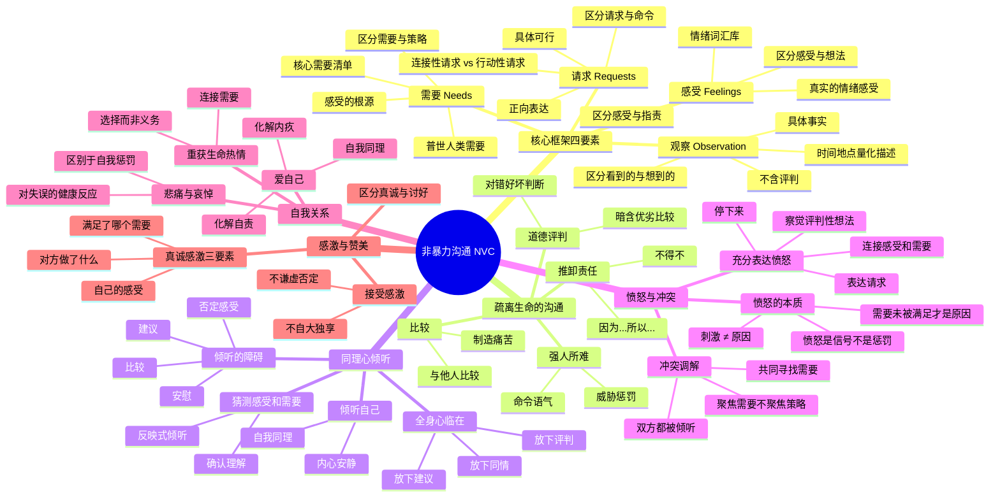
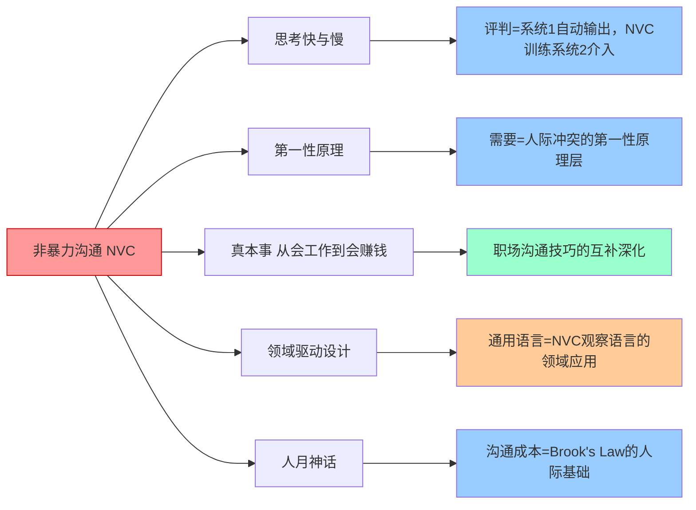

# 📚 非暴力沟通

## 📖 基本信息

- **书名**: 非暴力沟通
- **原名**: Nonviolent Communication: A Language of Life
- **作者**: 马歇尔·卢森堡（Marshall B. Rosenberg）
- **出版社**: PuddleDancer Press（英文原版）/ 华夏出版社（中译本）
- **出版年份**: 1999（原版第1版）/ 2003（第2版）/ 2015（第3版）/ 2009（中译本）
- **页数**: 约220页
- **译者**: 阮胤华
- **难度等级**: 通俗易懂（实践深度中等）
- **阅读状态**: ✅ 已完成
- **个人评分**: ⭐⭐⭐⭐⭐
- **创建时间**: 2026-06-03
- **标签**: 沟通, 人际关系, 心理学, 同理心, 情绪管理, 冲突化解, 自我认知, 非暴力

---

## 📝 内容概要

### 书籍简介

《非暴力沟通》是美国临床心理学家马歇尔·卢森堡博士的代表作，也是全球和平组织、教育机构和心理咨询领域广泛采用的沟通训练教材。本书提出了一套系统性的沟通框架——**非暴力沟通（NVC，Nonviolent Communication）**，核心是通过四个要素（观察、感受、需要、请求）来建立真实的连接，化解冲突，实现深层次的相互理解。

卢森堡将"暴力"定义为极为宽泛：不仅指身体暴力，更包括日常语言中的批判、指责、比较、命令、威胁——这些"语言暴力"虽无形，却每天都在切断人与人之间的真实连接。NVC的目标不是"赢得争论"，而是**看见彼此的人性，满足双方的需要**。

本书的理论根基来自人本主义心理学（马斯洛、罗杰斯），并深受甘地非暴力思想影响。卢森堡将这套方法在全球60多个国家的学校、监狱、企业、战区推广实践，被联合国誉为"解决冲突的最佳实践"。

### 核心主题

1. **语言的暴力性** — 日常语言如何在无意间制造距离和痛苦
2. **四要素框架** — 观察、感受、需要、请求的完整应用
3. **同理心倾听** — 听见他人语言背后的感受和需要
4. **愤怒的本质** — 愤怒来自未被满足的需要，而非他人的行为
5. **自我同理** — 用NVC对待自己，化解内疚与羞耻
6. **感激的表达** — 区分真诚感激与讨好式赞美

### 主要章节结构

| 章节 | 标题 | 核心内容 |
|------|------|---------|
| 第1章 | 由衷的给予 | NVC的起源与核心假设：人天性善良，语言影响连接 |
| 第2章 | 疏离生命的沟通方式 | 道德评判、比较、强迫、推卸责任的危害 |
| 第3章 | 区分观察和评论 | 如何做到不带评判地描述事实 |
| 第4章 | 体会和表达感受 | 识别真实感受，区分感受与想法 |
| 第5章 | 感受的根源 | 需要是感受的根源，而非他人的行为 |
| 第6章 | 提出请求，丰富生活 | 如何提出具体、可行、非强制的请求 |
| 第7章 | 用全身心倾听 | 同理心倾听的方法与障碍 |
| 第8章 | 倾听的力量 | 同理心如何化解愤怒和冲突 |
| 第9章 | 爱自己 | 对自己使用NVC，化解自我批评 |
| 第10章 | 充分表达愤怒 | 愤怒的本质是未被满足的需要 |
| 第11章 | 化解冲突，调和纷争 | NVC在冲突调解中的应用 |
| 第12章 | 保护性强制力的运用 | 当对话无效时，如何使用强制力而不带惩罚意图 |
| 第13章 | 重获生活的热情 | 用NVC化解抑郁，重建与生命的连接 |
| 第14章 | 表达感激 | 如何真诚地表达和接受感激 |

---

## 🧠 知识架构



---

## 🔍 核心概念深度解析

### 第一章：由衷的给予——NVC的哲学基础

**NVC 的核心假设：**

```
人类的本性
┌─────────────────────────────────────────────────────┐
│  卢森堡的信念：                                      │
│  人天生喜欢为他人的福祉做贡献，                     │
│  当我们的给予出于恐惧、内疚或羞耻时，              │
│  双方都不会真正感到愉悦。                           │
│                                                     │
│  NVC 的目标：                                       │
│  建立一种关系，使"由衷给予"成为可能——              │
│  给予来自心甘情愿，而非强迫或交换。                 │
└─────────────────────────────────────────────────────┘
```

**什么是"暴力"语言？**

卢森堡将"暴力"重新定义，使其超越身体层面：

```
暴力语言谱系
════════════════════════════════════════════════════
明显的暴力                隐性的语言暴力
─────────────────────────────────────────────────
身体暴力         →  批评、指责、侮辱
威胁             →  道德评判（"你真自私"）
强迫             →  比较（"你看别人家的孩子"）
                   推卸责任（"我不得不..."）
                   命令（"你必须..."）
                   诊断/分析（"你的问题是..."）
                   否定感受（"别这么敏感"）
════════════════════════════════════════════════════
共同点：切断真实连接，将对方视为工具或障碍，而非有感受和需要的人
```

---

### 第二章：疏离生命的沟通方式

**四种常见的"语言暴力"模式：**

```
模式一：道德评判
──────────────────────────────────────────────────
原话：  "你太不负责任了。"
NVC：  "这周有三次你答应7点到，但实际上8点才到，
        我感到担心，因为我需要提前规划家里的安排。"

关键差异：
  评判 → 对方的品格/动机
  观察 → 具体的、可观察的事实
──────────────────────────────────────────────────

模式二：比较
──────────────────────────────────────────────────
"你应该像你哥哥一样努力。"
  → 制造嫉妒和怨恨，切断被比较者与比较者的连接

更好的做法：
  直接说出自己的感受和需要，不需要比较来证明
──────────────────────────────────────────────────

模式三：强人所难（命令与威胁）
──────────────────────────────────────────────────
命令：  "你给我做完这份报告！"
威胁：  "再不改进，就别怪我换人。"
内疚：  "你这样做让我很伤心。"（暗示对方应该改变）

区别：
  • 命令/威胁：不服从就有惩罚
  • NVC请求：不服从也会被尊重，继续探讨双方需要
──────────────────────────────────────────────────

模式四：推卸责任
──────────────────────────────────────────────────
常见表达：
  "我不得不去参加那个会议"
  "公司规定我必须这样做"
  "因为你迟到了，所以我才发火"

危害：
  让我们忘记自己是有选择的，
  将生活的控制权外包给外部规则和他人行为
──────────────────────────────────────────────────
```

---

### 第三章：区分观察与评论

**观察 vs 评论——NVC 最基础的训练：**

```
区分观察与评论
══════════════════════════════════════════════════════
评论（含评判）              观察（纯事实）
──────────────────────────────────────────────────────
"他来得很晚"              "他说8点到，9点才到"
"她工作效率低"            "她今天完成了2份报告，昨天完成了5份"
"这孩子太懒了"            "这周他没有做作业"
"你总是打断我"            "这次谈话中你打断了我3次"
"老板不信任我"            "老板没有征求我的意见就做了这个决定"
──────────────────────────────────────────────────────
规律：
  • 评论往往含"总是"、"从不"、"太"等绝对化词
  • 观察含具体时间、次数、可观测的行为描述
  • 判断标准：任何两个人看到同样场景，描述是否一致？
══════════════════════════════════════════════════════
```

**当观察中混入评论，会发生什么？**

```
听到评论时的典型反应链：
"你太不体贴了"
      ↓
对方听到：攻击/指责
      ↓
本能反应：防御或反击
      ↓
结果：争论谁对谁错，原始需要没有被讨论

听到观察时的典型反应链：
"今天我发烧说难受，你没有问我感觉怎么样"
      ↓
对方听到：一个具体事实
      ↓
反应空间：可以解释、道歉、或询问你需要什么
      ↓
结果：有可能真正讨论双方的感受和需要
```

---

### 第四章 & 第五章：感受与需要——NVC 的情感核心

**感受词汇库（区分感受与想法）：**

```
常见混淆：这些不是"感受"，而是"想法"（含隐性评判）
──────────────────────────────────────────────────────
"我感觉被忽视了"  →  想法（隐含"你忽视了我"的评判）
"我感觉被抛弃了"  →  想法（隐含"你抛弃了我"的评判）
"我感觉被操控了"  →  想法（隐含"你在操控我"的评判）
"我感觉不被尊重"  →  想法（隐含"你不尊重我"的评判）

真实的感受词汇：
需要被满足时：喜悦、快乐、感激、兴奋、温暖、平静、满足、
             好奇、感动、充实、踏实、轻松...

需要未被满足时：失落、担忧、愤怒、难过、害怕、无聊、
               疲惫、孤独、困惑、沮丧、羞耻、内疚...
──────────────────────────────────────────────────────
```

**需要层次与普世需要清单：**

```
人类的普世需要（不完全列表）
════════════════════════════════════════════════════
生理需要        安全需要         连接需要
────────────    ────────────     ────────────
食物            身体安全          爱与被爱
睡眠            情感安全          归属感
住所            稳定              接纳
空气            秩序              亲密
                                  社群

自主需要        表达需要         意义需要
────────────    ────────────     ────────────
选择自由         创造力           贡献
自我决定         真实表达         目的感
独立             诚实             成长
空间             清晰             能力感
                                  庆祝

游戏与娱乐       灵性需要
────────────     ────────────
乐趣             美
快乐             和谐
恢复活力         平和
                 灵感
════════════════════════════════════════════════════
关键认知：需要是普世的，满足需要的方式（策略）才是个人的
```

**"感受来自需要，而非他人行为"——最重要的认知转变：**

```
传统思维（刺激-反应模型）：
  你说了那句话 ──→ 我很愤怒
  （你是我愤怒的原因）

NVC思维（刺激-需要-感受模型）：
  你说了那句话
        ↓
  我的"被尊重"需要没有被满足
        ↓
  我感到愤怒

意义：
  我的感受来自我自己的需要，
  你的行为只是"刺激"（触发器），不是"原因"。
  这意味着：
  1. 我对自己的感受负责（而非归咎他人）
  2. 同样的行为，不同的人有不同反应（需要不同）
  3. 改变感受的途径是满足需要，而不是改变对方
```

---

### 第六章：提出请求——让改变成为可能

**请求 vs 命令的根本区别：**

```
判断标准：如果对方说"不"，你会怎么做？
─────────────────────────────────────────────────
命令：对方说"不"→ 施压、惩罚、指责、批评
请求：对方说"不"→ 好奇他的感受和需要，继续探讨

实践中的挑战：
  表达上是"请求"，内心预期却是"命令"
  → "你可以帮我吗？"（表面请求，实则命令）
  → 对方说"不"时暗自愤怒
  
这说明不是真正的请求，而是包装成请求的命令
─────────────────────────────────────────────────
```

**有效请求的四个标准：**

```
标准一：具体（不模糊）
  ✗  "我希望你对我好一点"
  ✓  "我希望这周你能陪我吃两次晚饭"

标准二：可行（在对方能力范围内）
  ✗  "我希望你不要再担心这件事了"（情绪不可强制）
  ✓  "我希望你能告诉我，什么让你感到担心"

标准三：正向表达（说想要什么，不说不要什么）
  ✗  "我希望你别打断我"
  ✓  "我希望你在我说完一个完整的想法后再回应"

标准四：当下（而非遥远的未来）
  ✗  "我希望你以后能更体贴"
  ✓  "今晚你能帮我做晚饭吗？"
```

**两种请求类型：**

```
连接性请求（先于行动请求）
  目的：确认双方是否相互理解
  示例：
    "我说的这些，你能告诉我你听到了什么吗？"
    "你现在的感受是什么？"
  
  为什么重要：
    在提出行动请求前，先确保连接，
    否则行动请求可能被当成命令

行动性请求
  目的：请求具体的行动来满足需要
  示例：
    "你能今晚帮我照看孩子两个小时吗？"
    "我们能把这个项目的截止日期推迟一周吗？"
```

---

### 第七章 & 第八章：同理心倾听——听见语言背后的生命

**同理心 ≠ 同情，≠ 赞同，≠ 建议：**

```
常见的"倾听障碍"（看起来是关心，实际上切断连接）
══════════════════════════════════════════════════
对方："我最近压力好大，感觉快撑不住了。"

❌ 建议：  "你应该去运动，运动能减压。"
❌ 比较：  "我以前比你还难，照样挺过来了。"
❌ 解释：  "你压力大是因为你太在意别人的看法。"
❌ 安慰：  "没事的，会好起来的！"
❌ 否定：  "你已经很好了，不要这么悲观。"
❌ 哲学：  "这就是生活，每个人都一样。"
❌ 同情：  "哎，真可怜，你真的很不容易。"

✓ 同理心倾听：
  "你感到很疲惫，是因为你需要喘息的空间，
   但最近一直没有？"（猜测感受和需要，等待确认）
══════════════════════════════════════════════════
```

**同理心倾听的实践步骤：**

```
同理心倾听四步法
┌─────────────────────────────────────────────────────┐
│                                                     │
│  Step 1：放下评判，全身心临在                        │
│    → 不思考如何回应，只是接收                        │
│                                                     │
│  Step 2：猜测感受（用疑问句，不是陈述句）            │
│    → "你是不是感到…？"而非"你肯定很…"               │
│                                                     │
│  Step 3：猜测需要（聚焦需要，不聚焦事件）            │
│    → "你需要的是…？"                                │
│                                                     │
│  Step 4：确认理解，继续深入                          │
│    → "我的理解对吗？"                               │
│    → 对方确认后，再问"还有什么吗？"                  │
│                                                     │
└─────────────────────────────────────────────────────┘
```

**"满足感"——如何知道对方被充分倾听？**

倾听不是要解决问题，而是让对方感到被真正理解。当一个人被充分倾听时，通常会出现：
- 语气从紧张变得平缓
- 从重复描述事件转为谈论感受
- 主动说"好多了，谢谢你听我说"
- 或者沉默——一种满足的沉默，而非不舒服的沉默

---

### 第九章：爱自己——对自己使用 NVC

**自我评判的语言暴力：**

大多数人对自己比对他人更苛刻。NVC 认为，内心的自我批评是一种对自己的暴力，会制造内疚、羞耻和抑郁。

```
传统自我批评模式：
  犯了错误
     ↓
  自我评判（"我怎么这么蠢/懒/不负责任"）
     ↓
  内疚、羞耻、自我惩罚
     ↓
  精力用于自我攻击，而非改变行为

NVC 的自我同理模式：
  犯了错误
     ↓
  悲痛/哀悼（"我希望自己当时做得不一样"）
     ↓
  连接未被满足的需要（"我需要…"）
     ↓
  精力用于未来如何满足需要
```

**"我选择"而非"我不得不"——重建个人自主感：**

```
语言的力量：选择 vs 义务
──────────────────────────────────────────────
原话：  "我不得不去参加那个无聊的会议"
转化：  "我选择去参加那个会议，
        因为我需要这份工作的收入来支付房租"

原话：  "我不得不每天做家务"
转化：  "我选择每天做家务，
        因为我需要一个整洁的环境来让自己平静"

影响：
  • 即使行为相同，"选择"带来自主感，
    "不得不"带来怨恨和无力感
  • 当你承认"你在选择"，你也承认"你可以选择不"
  • 这促使你审视：这个选择是否真的符合你的需要？
──────────────────────────────────────────────
```

---

### 第十章：充分表达愤怒——愤怒是一个信号

**愤怒的 NVC 解读：**

```
传统观点：                 NVC 观点：
"是你让我愤怒的"          "我的愤怒来自我自己的评判和需要"
  ↓                          ↓
发泄或压抑愤怒             使用愤怒作为探索信号

愤怒四步骤：
┌─────────────────────────────────────────────────────┐
│                                                     │
│  Step 1：停下来，什么都不做                          │
│    → 不说话，深呼吸，避免立即反应                    │
│                                                     │
│  Step 2：找到内心的评判性想法                        │
│    → "我在想什么？我在评判什么？"                    │
│    → "他太不负责任了！他不尊重我！"                  │
│                                                     │
│  Step 3：将评判转化为感受和需要                      │
│    → "当他迟到，我感到焦虑，因为我需要可靠性"        │
│                                                     │
│  Step 4：表达（用NVC）或先进行自我同理               │
│    → 决定现在是否适合表达                            │
│                                                     │
└─────────────────────────────────────────────────────┘
```

---

### 第十一章：化解冲突——需要层面的对话

**NVC 冲突调解的核心原则：**

```
传统冲突处理：               NVC冲突调解：
聚焦立场和策略               聚焦感受和需要
"我要X"                      "我感到Y，因为我需要Z"
  ↓                              ↓
双方立场对立                 双方需要通常可以共存
输赢思维                     寻找满足双方需要的方案

冲突调解流程：
┌──────────────────────────────────────────────────────┐
│  1. 先确保双方都感到被倾听（各自表达感受和需要）      │
│  2. 确认双方需要已被充分理解                          │
│  3. 共同头脑风暴策略（而非坚守原有立场）              │
│  4. 寻找能同时满足双方核心需要的方案                  │
└──────────────────────────────────────────────────────┘

关键洞察：
  人们在立场层面往往不可调和，
  但在需要层面往往可以找到共同点。
  
  例："你必须让我用车" vs "我也要用车"
  ↓ 探索需要
  A的需要：今晚约会的交通工具（安全感、约定）
  B的需要：今晚加班回家（疲劳感、安全）
  → 可探索：A打车去，B用车回；或拼车方案等
```

---

### 第十四章：表达感激——真诚与讨好的分野

**真诚感激的三要素：**

```
讨好式赞美（评价式）：
  "你今天表现得很好！"
  "你真的是个很有责任心的人！"
  
  问题：
  • 含有评判（暗示你有资格评判对方）
  • 对方不知道具体什么行为得到了认可
  • 让人担心"下次不这样会被否定"

真诚感激（NVC式）三要素：
┌─────────────────────────────────────────────────────┐
│  ① 对方做了什么（具体观察）                          │
│  ② 你因此有什么感受                                  │
│  ③ 这满足了你的哪个需要                              │
└─────────────────────────────────────────────────────┘

示例：
  "你今天在会议上主动分担了我的汇报任务（①），
   我感到非常轻松和感激（②），
   因为我最近压力很大，很需要支持（③）。"
```

---

## ✍️ 读书笔记

### 🔖 重点摘录

> "也许我们并不认为自己的谈话方式是'暴力'的，但我们的语言确实常常引发自己和他人的痛苦。"

> "非暴力沟通的目的不是为了改变他人来迎合我们，而是建立一种关系——基于坦诚和倾听，双方的需要都能被满足。"

> "批评、指责、诊断和评判都是些悲剧性的表达方式。当我们评判他人时，我们贡献于暴力。"

> "不论别人说什么，我们只是将其看作是在说：'谢谢你满足了我的需要'，或者'请帮我满足我的需要'。"

> "我相信，所谓的道德评判，是在评判那些用来满足需要的策略，而不是在评判需要本身。"

> "愤怒驱使我们去惩罚他人，而倾听使我们与他人相连。"

> "任何人在任何时候都只是在尽力满足自己的需要。"

> "感激的NVC表达：做了什么，我们有什么感受，满足了什么需要。"

---

## 💭 深度衍生思考

### 🎯 核心观点延伸

**1. NVC 与"思考快与慢"的交汇——评判是系统1的自动输出**

人们对他人做出道德评判（"他很懒"、"她不负责任"）是系统1的默认运作：快速、自动、不需要努力。NVC 要求的"区分观察与评论"，本质上是训练系统2介入系统1的自动评判流程——这极其困难，需要大量刻意练习。

这解释了为什么大多数人即使读完 NVC，在情绪激动时仍会滑回评判性语言：系统2在压力下会"掉线"，将控制权交回给系统1的评判习惯。

**实践推论**：在关系中预先约定"NVC暂停信号"——双方都可以喊暂停，等情绪冷静后再用 NVC 语言重新表达，是让系统2能够参与的实用设计。

**2. NVC 的"需要"框架与第一性原理的关系**

在人际冲突中，人们往往争执的是"策略"（我要用车/你不能用车），而忽视了策略背后的"需要"（我要用车的需要是什么？）。把"需要"视为冲突的第一性原理——追问到需要层面后，双方往往会发现更多的解决空间。

这与商业谈判中的"利益式谈判"（Interest-based Negotiation）高度一致：永远在"立场"背后找"利益"，在"利益"背后找"共同利益"。

**3. 语言对认知的塑造——"我不得不"vs"我选择"**

卢森堡关于"我不得不"转化为"我选择"的训练，揭示了语言对认知的深层影响。当我们持续使用"我不得不"这样的表达，我们在神经层面强化了"自己没有选择"的信念，进而真的感到无力和受害。

这与积极心理学中的"自我效能感（self-efficacy）"和"控制点（locus of control）"研究高度一致：内控型的人（相信自己可以影响结果）心理健康程度更高，而语言习惯是强化内控或外控信念的重要机制。

**4. NVC 的局限性：权力不对等关系中的困境**

NVC 假设双方都愿意真诚沟通且具备基本的安全感。但在以下场景中，NVC 存在明显局限：

- **权力严重不对等**：员工与高压型上司，家暴受害者与施暴者，NVC 可能被单方面利用
- **对方不熟悉 NVC**：当一方说"我感到担忧，因为我需要…"，不熟悉 NVC 的对方可能觉得奇怪甚至嘲弄
- **文化适配性**：直接表达感受和需要在某些文化（如东亚高语境文化）中被视为"软弱"或"不成熟"

**实践推论**：NVC 在亲密关系和朋友圈中效果最佳；在职场关系中需要适度调整表达方式；在高压权力关系中需要先建立安全感。

---

### 🔍 多角度分析

**历史视角：NVC 的思想谱系**

NVC 不是凭空产生的，它汇聚了多条思想河流：
- **甘地的非暴力理论（Ahimsa）**：暴力源于认为某些需要比另一些更重要
- **马斯洛的需要层次理论**：普世需要是人类行为的根本驱动力
- **卡尔·罗杰斯的人本主义心理学**：无条件积极关注（Unconditional Positive Regard）是同理心倾听的理论基础
- **阿尔弗雷德·科尔济布斯基的一般语义学**：语言塑造感知，"地图不是领土"

**跨领域视角：NVC 在软件工程中的意外应用**

代码审查（Code Review）是软件工程中最容易产生"语言暴力"的场景：
- 评判式反馈："这段代码写得很烂"（道德评判）
- 命令式反馈："你必须重构这个函数"（强人所难）
- NVC 式反馈："这个函数有三个入参，我在阅读时感到困惑，因为我需要快速理解业务意图——你能考虑将这三个参数封装成一个配置对象吗？"

后者更可能得到建设性的回应，而不是防御。

**反向思考：不表达感受，是否也是一种选择？**

NVC 强调直接表达感受和需要，但在许多情境下，选择不表达也是一种有效策略。高语境文化中，许多信息通过语境和隐喻传达，直白地说"我需要被尊重"反而可能造成尴尬。NVC 不是唯一有效的沟通方式，它是在直白表达情感空间存在的关系中最有效的工具。

---

## 🎓 专家视角深度分析

### 王建华教授（商业科技视角）

#### 核心洞察
- NVC 在企业管理中的核心价值：将"绩效谈话"从评判型转为需要探索型，大幅提升员工留存意愿
- 损失厌恶（思考快与慢）在 NVC 中的体现：人们对批评的敏感度远高于表扬，与损失厌恶系数一致
- 谈判领域的经典工具"哈佛谈判法"（Getting to Yes）与 NVC 在"从立场到利益"上高度一致

#### 深度分析
**专家观点**：在企业中，管理者往往被训练成"结果导向"的语言：命令、评判、分析。NVC 提供了一套补充工具，让管理者在维持权威的同时，不破坏人际连接。关键在于：管理者不需要完全使用 NVC 语言，只需要具备"同理心倾听"的能力，就能显著改善团队氛围。

**实践案例**：谷歌的"Project Aristotle"研究发现，高绩效团队的第一要素是"心理安全感"——团队成员感到可以安全地表达想法而不被评判。这正是 NVC 试图在沟通层面创造的氛围。

---

### 李思源博士（人工智能视角）

#### 核心洞察
- NVC 的"感受词汇库"和"需要清单"为情感计算提供了结构化框架
- 对话系统（Conversational AI）中的同理心回复生成是当前 AI 研究的难点，NVC 框架可作为训练数据的标注标准
- 大语言模型（LLM）天然倾向于评判性语言（因为训练数据中评判语言占主导），NVC 风格的对话系统需要专门的对齐训练

#### 深度分析
**专家观点**：ChatGPT 等模型在情感支持对话中的主要失败模式正是卢森堡列举的"倾听障碍"：给建议、分析原因、安慰、否定感受。当用户说"我感到很孤独"，模型常回应"你可以尝试加入社群活动（建议）"，而不是"你是不是感到很渴望与人真正连接？"（同理心倾听）。

---

## 🔗 知识关联网络



| 关联书籍 | 关联维度 | 关联强度 |
|---------|---------|---------|
| **思考快与慢** | 道德评判是系统1的自动输出；NVC是训练系统2介入评判流程的方法 | ⭐⭐⭐⭐⭐ |
| **第一性原理** | "需要"是人际冲突的第一性原理层；策略是满足需要的方式，不应混淆 | ⭐⭐⭐⭐⭐ |
| **真本事** | 职场沟通技巧的互补：真本事讲职场策略，NVC讲沟通的心理基础 | ⭐⭐⭐⭐ |
| **领域驱动设计** | 通用语言（Ubiquitous Language）是团队沟通的领域版NVC——精确定义词汇，避免歧义评判 | ⭐⭐⭐ |
| **人月神话** | Brook's Law的人际根源：沟通成本高是因为大多数团队沟通充满评判和防御，而非真实连接 | ⭐⭐⭐ |

### 知识依赖关系

```
前置知识（阅读本书前有帮助的知识）：
├── 基础心理学（马斯洛需要层次）
├── 任意关系中的冲突经历（用于对照）
└── 情绪词汇量（读前可先做情绪词汇扩充练习）

后续延伸（本书开启的知识路径）：
├── 深化 NVC → 卢森堡其他著作《爱的语言》
├── 谈判应用 → 《哈佛谈判术》（Getting to Yes）
├── 情绪管理 → 《情商》（Daniel Goleman）
└── 家庭关系 → 《如何说孩子才会听》
```

---

## 📚 后续阅读路径规划

### 直接延伸

1. **《哈佛谈判术》（Getting to Yes）— 罗杰·费舍尔**
   - 关联度: ⭐⭐⭐⭐⭐
   - 阅读优先级: **高**
   - 预期收获: "原则式谈判"与 NVC 在"从立场到需要"上完全一致，但提供了更多职业谈判场景的实操框架

2. **《情商》— 丹尼尔·戈尔曼**
   - 关联度: ⭐⭐⭐⭐
   - 阅读优先级: **高**
   - 预期收获: NVC 实践需要高情商作为基础——情绪识别、情绪调节、同理心。戈尔曼的研究提供了科学支撑

3. **《如何说孩子才会听，怎么听孩子才肯说》— 法伯 & 马兹丽施**
   - 关联度: ⭐⭐⭐⭐
   - 阅读优先级: **中**
   - 预期收获: NVC 在亲子关系中的具体应用，提供大量实际对话示例

### 交叉验证

1. **《被讨厌的勇气》— 岸见一郎（阿德勒心理学）**
   - 对比点: 阿德勒认为"所有烦恼都是人际关系的烦恼"，与 NVC 的人际连接核心一致；但阿德勒更强调"课题分离"（不过度卷入他人情绪），而 NVC 强调深度同理心——两种方法在不同场景各有优势
   - 价值: 建立更完整的人际关系哲学

2. **《道德经》（老子）**
   - 对比点: "上善若水"、"不争"的哲学与 NVC 的非暴力精神高度共鸣；但道家偏向无为，NVC 强调主动表达
   - 价值: 从东方哲学视角理解非暴力的深层文化根基

### 实践补充

1. **NVC 练习卡片（自制）**
   - 类型: 实践工具
   - 内容: 将"观察/感受/需要/请求"四步骤打印成卡片，贴在常用场景（书桌、冰箱）
   - 时间投入: 持续练习，3个月建立习惯

2. **情绪日记（每日5分钟）**
   - 类型: 自我练习
   - 内容: 记录当日一件令自己不舒服的事情，用 NVC 框架重新表述（观察/感受/需要）
   - 时间投入: 每天5分钟，坚持30天

### 个性化路径

- **职场关系方向**: 《哈佛谈判术》→《关键对话》→《FBI教你读心术》
- **亲密关系方向**: 《如何说孩子才会听》→《五种爱的语言》→《依恋》
- **自我成长方向**: 《被讨厌的勇气》→《自我关怀》→《正念冥想》

---

## 🎯 实践应用

### 行动计划一：每日 NVC 翻译练习（建立观察肌肉）

**具体步骤：**
1. 每天记录 1-2 句今天说过或想过的评判性语言
2. 将其翻译为 NVC 的观察语言（只写事实，不写评判）
3. 再写出背后的感受和需要

**示例：**
> 原话：「他太不负责任了」  
> 翻译：「他今天说9点到，实际上10点才到（观察）。我感到担忧（感受），因为我需要可靠性来规划工作（需要）。」

**时间安排：** 每晚 5 分钟，连续 30 天

---

### 行动计划二：同理心倾听练习（下周开始）

**具体步骤：**
1. 选择一位你希望改善关系的人
2. 下次对话时，当他/她表达负面情绪，暂停自己的"建议"冲动
3. 只做猜测感受和需要：「你是不是感到…因为你需要…？」
4. 等待对方确认，不急于继续

**注意事项：**
- 开始时对方可能觉得奇怪，坚持即可
- 如果猜错了也没关系，继续猜：「那你的感受是什么？」

---

### 行动计划三：将"我不得不"替换为"我选择"（即刻开始）

**具体步骤：**
1. 留意一周内所有"我不得不"的表达
2. 每次替换为"我选择…，因为我需要…"
3. 如果真的不愿意做这件事，允许自己探索是否有其他选择

---

### NVC 四要素快速检查卡

```
使用 NVC 表达前的自查：
═══════════════════════════════════════════════════
□ 观察：我说的是具体、可观测的事实吗？
        （有没有夹杂评判或解释？）

□ 感受：我说的是真实情绪吗？
        （是感受，还是"感觉被X了"这样的想法？）

□ 需要：我说的是普世需要吗？
        （是需要，还是某个具体的解决策略？）

□ 请求：我的请求是具体、正向、可行的吗？
        （如果对方说"不"，我会怎样？是请求还是命令？）
═══════════════════════════════════════════════════
```

---

## 📊 学习总结

### 最大的收获

**沟通的目标不是"赢"，而是"连接"**。这听起来简单，却与大多数人从小接受的沟通训练完全相反——学校教我们如何辩论和说服，而不是如何理解和被理解。

NVC 给了我一个新的"沟通坐标系"：**当对话让双方都感到被真正理解时，不需要任何人"让步"，问题就自然可以得到解决**。这种转变从根本上改变了我对"冲突"的看法——冲突不是需要消灭的东西，而是探索彼此深层需要的机会。

### 改变的观念

1. **原来认为**：表达感受是软弱的表现，尤其在职场中
   **现在认为**：准确表达感受和需要是高度自我认知的体现，比指责和评判需要更大的勇气和能力

2. **原来认为**：我的愤怒是因为对方做了什么
   **现在认为**：我的愤怒是一个信号，指向我自己某个未被满足的需要——这将我从受害者位置带回到自主者位置

3. **原来认为**：道德评判（"他太懒了"）是对情况的客观描述
   **现在认为**：道德评判是我将自己的解释和期望叠加在对方行为上，不是事实，而是我的故事

4. **原来认为**：倾听就是听完对方说的话
   **现在认为**：真正的倾听是放下建议、评判和解释的冲动，只是临在，猜测感受和需要，让对方感到被真正理解

### 未来行动

- **立即**：将"我不得不"替换为"我选择"，建立自主感
- **1周内**：开始每日 NVC 翻译练习
- **1个月内**：在亲密关系中至少完成5次完整的同理心倾听练习
- **3个月内**：在职场代码审查中尝试 NVC 式反馈，并观察对方反应的变化

---

## 📈 阅读进度

| 章节 | 标题 | 状态 | 核心概念 |
|------|------|------|---------|
| 第1章 | 由衷的给予 | ✅ 完成 | NVC哲学基础、暴力语言定义 |
| 第2章 | 疏离生命的沟通方式 | ✅ 完成 | 四种语言暴力模式 |
| 第3章 | 区分观察和评论 | ✅ 完成 | 观察vs评论、具体化训练 |
| 第4章 | 体会和表达感受 | ✅ 完成 | 感受词汇库、感受vs想法 |
| 第5章 | 感受的根源 | ✅ 完成 | 需要是感受的根源 |
| 第6章 | 提出请求，丰富生活 | ✅ 完成 | 有效请求的四标准、请求vs命令 |
| 第7章 | 用全身心倾听 | ✅ 完成 | 同理心倾听、倾听障碍 |
| 第8章 | 倾听的力量 | ✅ 完成 | 化解愤怒、满足感信号 |
| 第9章 | 爱自己 | ✅ 完成 | 自我同理、"我选择"vs"我不得不" |
| 第10章 | 充分表达愤怒 | ✅ 完成 | 愤怒四步骤、刺激vs原因 |
| 第11章 | 化解冲突，调和纷争 | ✅ 完成 | 需要层面的冲突调解 |
| 第12章 | 保护性强制力的运用 | ✅ 完成 | 保护性强制力vs惩罚性强制力 |
| 第13章 | 重获生活的热情 | ✅ 完成 | 连接需要、化解抑郁 |
| 第14章 | 表达感激 | ✅ 完成 | 真诚感激三要素 |

---

**笔记创建时间**: 2026-06-03
**最后更新**: 2026-06-03
**笔记版本**: v1.0
**笔记评分**: ⭐⭐⭐⭐⭐

---

## Sources

- Rosenberg, M. B. (2015). *Nonviolent Communication: A Language of Life* (3rd ed.). PuddleDancer Press.
- 马歇尔·卢森堡（著），阮胤华（译）. (2009). 《非暴力沟通》. 华夏出版社.
- Rogers, C. R. (1961). *On Becoming a Person: A Therapist's View of Psychotherapy*. Houghton Mifflin.（人本主义心理学基础）
- Maslow, A. H. (1943). A theory of human motivation. *Psychological Review*, 50(4), 370-396.
- Fisher, R., & Ury, W. (1981). *Getting to Yes: Negotiating Agreement Without Giving In*. Houghton Mifflin.
- Google Project Aristotle Research (2016). re:Work — Understanding team effectiveness.
- The Center for Nonviolent Communication (CNVC): cnvc.org — 官方培训资源和感受/需要词汇清单
