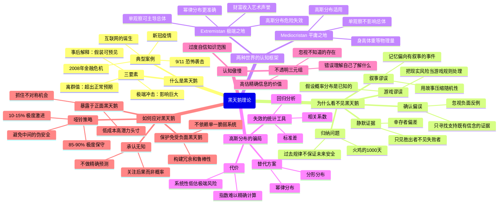
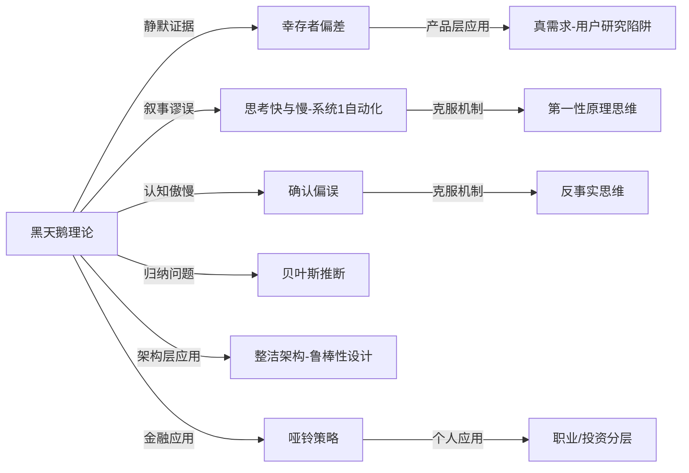

# 《黑天鹅》读书笔记

## 📚 基础信息
- **书名**: 黑天鹅：如何应对不可知的未来
- **原书名**: The Black Swan: The Impact of the Highly Improbable
- **作者**: 纳西姆·尼古拉斯·塔勒布（Nassim Nicholas Taleb）
- **出版社**: Random House（美）/ 中信出版社（中译版）
- **出版年份**: 2007年（原版）；2011年（中文版）
- **页数**: 约400页
- **所属系列**: Incerto 五卷系列（第2卷，共5卷）
- **阅读状态**: ☐ 正在阅读 ☐ 已完成 ☐ 暂停
- **个人评分**: ⭐⭐⭐⭐⭐
- **标签**: 认知科学、风险管理、概率论、哲学、行为经济学、不确定性

---

## 📖 内容概要

### 书籍简介

《黑天鹅》是塔勒布"Incerto"系列的核心之作，也是过去20年影响力最大的非虚构作品之一。它登上《纽约时报》畅销榜36周，被译成32种语言，诺贝尔奖得主丹尼尔·卡尼曼称其"改变了我对世界运作方式的看法"。

本书的核心命题只有一句话：**极端的、罕见的、不可预测的事件（黑天鹅）才是历史真正的驱动力，而我们的整个认知系统却系统性地无视它们。**

塔勒布以前期权交易员的亲身经历和哲学家的深度思辨，揭示了为什么人类——无论是普通人、学者还是所谓"专家"——在面对不确定性时都会犯同一类错误：我们把"没有发生过"误认为"不会发生"，把低概率事件的影响极度低估，然后在事后假装一切"本来可以预见"。

### 核心主题
1. **黑天鹅的本质**: 高影响力的极端事件被我们系统性地忽视和低估
2. **认知系统的根本缺陷**: 人类大脑不擅长理解"不可能发生的事情"
3. **高斯分布的骗局**: 现代统计工具对极端事件完全失效，却被金融、经济领域广泛错误使用
4. **如何在不确定性中生存**: 既然无法预测黑天鹅，就要建立对它"鲁棒"的系统

### 主要章节结构

**第一部分：不可预测性的哲学基础**
- 第1章：一个经验主义者的遭遇（作者黎凡特童年经历引入）
- 第2-4章：叙事谬误、归纳问题（火鸡的故事）、认知傲慢
- 第5-8章：确认偏误、静默证据、高斯偏差的认知根源

**第二部分：Extremistan 与分布的真相**
- 第9-11章：钟形曲线的骗局、Mediocristan vs Extremistan
- 第12-13章：高斯分布的智识历史、分形分布与幂律

**第三部分：如何行动**
- 第14-19章：哑铃策略、在不确定性下的决策框架、正面黑天鹅与负面黑天鹅的不对称性

---

## 🧠 知识架构



---

## ✍️ 读书笔记

### 第一部分：我们如何被蒙蔽

#### 第一章：黎凡特的经验主义者

塔勒布在黎巴嫩长大，在1975年黎巴嫩内战爆发前，所有预测都指向"不会有大规模冲突"——直到战争真的来临。这段童年经历成为他整个思想体系的原点：**极端事件在发生前总是"不可能的"，在发生后总是"本来可预见的"**。

这个起点决定了本书的基本立场：不是要帮你更好地预测黑天鹅，而是要让你意识到**预测本身是一种傲慢的幻觉**。

#### 第二章：叙事谬误（Narrative Fallacy）

> "我们的大脑机器不停地运转，把世界解释成一个比实际上更简单的地方。"

**叙事谬误**是人类认知最根深蒂固的缺陷之一。我们有一种强烈的冲动，要把随机发生的事件编织成连贯的因果故事。

问题在于：
1. **故事减少了随机性的感知**：当你用"A导致B，B导致C"来解释历史，你就在消灭真正的偶然性
2. **有故事的事件更容易被记住**：大脑倾向于存储有意义的叙事，而非"纯粹随机发生了X"
3. **叙事让我们过度自信**：一旦有了解释框架，我们就以为自己"理解了"

```
叙事谬误的运作机制：

现实：随机事件 A → 随机事件 B → 随机事件 C（彼此关联很弱）
                    ↓ 大脑的叙事化处理
我们认为：A（原因）→ B（中间）→ C（必然结果）

结果：我们以为自己理解了，其实我们只是编了一个故事
```

**关键洞见**：你无法用讲故事来驱逐故事，只能用另一个故事替代它（"you need a story to displace a story"）。对抗叙事谬误的方法是**记日记**——事前记录预期，事后对比，你会发现自己多么频繁地"后见之明"地改写了自己的原始判断。

#### 第三章：火鸡的问题——归纳的极限

这是全书最精彩的思想实验之一。

```
火鸡被喂养了1000天：
  第1天：被喂食
  第2天：被喂食
  ...
  第999天：被喂食
    ↓ 
  基于1000天数据，火鸡"推断"：主人是友善的，明天也会被喂食
    ↓
  第1000天（感恩节前一天）：被宰杀
```

这个比喻直指哲学史上休谟（Hume）的**归纳问题**：**过去的规律性无法逻辑上保证未来的安全。"没有证据"不等于"证据不存在"**（absence of evidence ≠ evidence of absence）。

对塔勒布而言，更关键的洞察是：**你的脆弱性在过去经验最稳固的时候往往最大**。金融机构、国家政策、个人生涯——越是依赖历史数据来预测未来，就越容易在黑天鹅面前一败涂地。

#### 第四章：确认偏误与静默证据

**确认偏误（Confirmation Bias）**：我们天生倾向于寻找支持既有信念的证据，而对反例视而不见。

> "正面实例只是暂时支持了假设，负面实例才能明确告诉你某事为假。"

更深刻的问题是**静默证据（Silent Evidence）**，也称幸存者偏差：

```
我们看见的：
  ✅ 成功创业者的故事
  ✅ 投资回报丰厚的案例
  ✅ 经历极端风险后存活的人

我们看不见的（静默的证据）：
  ❌ 同期创业失败的数百人
  ❌ 做出相同投资决策但亏损的人
  ❌ 经历同样极端风险但死亡的人
```

**历史的诡计**：历史书记录的是留下记录的事件，也就是说历史本身就是一本幸存者日记。我们从历史中学到的"规律"，大多是从幸存者那里提炼出来的——这让我们对未来系统性地过于乐观。

---

### 第二部分：两个世界

#### 第九章：Mediocristan vs Extremistan

这是塔勒布贡献给我们最实用的认知框架之一。

| 维度 | Mediocristan（平庸之地） | Extremistan（极端之地） |
|------|------------------------|----------------------|
| **典型变量** | 身高、体重、血压、寿命 | 财富、收入、书籍销量、城市规模 |
| **分布形状** | 高斯（钟形曲线） | 幂律 / 帕累托 |
| **单次极端观察的影响** | 几乎不影响总体 | 可以主导整个总体 |
| **直觉解释** | 把10亿人放进同一个房间，加入最高的人，平均身高几乎不变 | 把10亿人放进同一个房间，加入比尔·盖茨，他的财富秒杀其他所有人财富总和 |
| **高斯分布适用性** | ✅ 安全 | ❌ 危险失效 |
| **预测可靠性** | 相对可靠 | 极度不可靠 |

**最重要的应用**：金融系统、经济预测、社会科学大量使用高斯分布——但这些领域属于 Extremistan，高斯分布在这里会系统性低估极端风险。

2008年金融危机正是如此：量化模型用高斯分布建模，认为"百年一遇"的损失只有X，结果实际损失是X的50倍。

#### 第十二章：高斯分布的智识史——伟大的骗局

塔勒布对高斯分布的抨击是本书最有争议的部分，也是最深刻的部分。

高斯曲线（钟形曲线）在统计学、社会科学、金融学中的地位如同神明，但塔勒布指出，它的核心假设（偏差随距均值越远而急剧降低）在现实的 Extremistan 世界里根本不成立。

失效的统计工具：
- **标准差**：假设了高斯分布，在幂律分布下无意义
- **相关系数**：在极端事件中失效，两个看似不相关的变量会在危机时同时崩溃
- **回归分析**：依赖历史数据的线性假设，对结构性断裂完全盲目

> 替代方案并不完美：分形分布/幂律分布的指数极难精确计算，且对微小误差极度敏感——这意味着无论用什么模型，在 Extremistan 里我们都永远处于深刻的不确定性中。这才是塔勒布真正想传达的信息：**不是换个模型，而是接受我们对极端事件本质上无知。**

---

### 第三部分：如何在 Extremistan 里生存

#### 第十四章：认知傲慢与不透明三元组

**认知傲慢（Epistemic Arrogance）**：人们以为自己了解的，远比实际了解的多。

实验证据：让人们给一个问题提供"98%置信度"的上下界（你有98%的把握真实答案落在此区间）。结果大多数人的真实命中率只有60%左右——他们的置信区间比应该的窄得多。**我们系统性地过度自信。**

**不透明三元组（Triplet of Opacity）**：
1. **错误理解自己了解什么**：把熟悉感当作理解
2. **忽视不知道的存在**：看不见自己知识的边界（unknown unknowns，即不知道自己不知道什么）
3. **高估精确信息的价值**：精确的错误比模糊的正确更危险

#### 第十五章：哑铃策略（Barbell Strategy）

这是塔勒布给出的核心实践建议，也是对"中庸"的一次深刻颠覆。

```
传统"稳健"投资策略：
  ──────────────────────── 中等风险/中等回报
  （实际是：既无保护，又无上行空间）

哑铃策略：
  极度保守 ←───────────────→ 极度激进
  [85-90% 在最安全资产]    [10-15% 在高风险高回报头寸]
  （保护免受负面黑天鹅）    （暴露于正面黑天鹅机会）
```

**核心逻辑**：
- **负面黑天鹅**：你绝对不能被一次极端事件摧毁，所以保守部分要真的保守
- **正面黑天鹅**：机会是不对称的——你的最大损失是全部投入，但潜在收益是无限的，所以激进部分要真的激进
- **中等风险是陷阱**：中等风险资产给你一种"安全"的错觉，但它既不能保护你免受极端损失，又限制了你的上行空间

**延伸到非金融领域**：
- **职业策略**：极度稳定的本职工作（保底）+ 极度投机的副业/创业尝试（上行）
- **学习策略**：深度掌握少数核心基础（保守）+ 广泛探索新奇边缘领域（激进）
- **项目决策**：严格保护核心系统的稳定性 + 对小实验/原型持极度开放态度

#### 第十九章：接受不确定性、享受生活

> "抓住机会，让自己暴露于正面黑天鹅的可能性，同时保护自己免受负面黑天鹅的伤害。"

塔勒布的最终建议不是"更好地预测"，而是：

1. **改变关注焦点**：不要问"这件事发生的概率是多少"，而要问"如果它发生，后果是什么"——关注后果的不对称性，而非概率本身
2. **别依赖专家预测**：经济学家、气象学家、战略分析师对极端事件的预测几乎没有比随机猜测好多少
3. **建立冗余系统**：自然界中冗余是对抗不确定性的基本策略——额外的肾脏、额外的存款、额外的技能
4. **寻找正面不对称**：找那些"最大损失有限，但可能性是非线性的"机会

---

## 💭 深度衍生思考

### 🎯 核心观点延伸

#### 延伸1：黑天鹅理论与软件工程的"已知未知"问题

塔勒布的"不透明三元组"与软件工程中的需求不确定性高度同构。

```
塔勒布的三类无知              软件工程的对应
────────────────────────────────────────────────
已知的已知（Known Knowns）  →  明确的功能需求
已知的未知（Known Unknowns）→  风险登记册上的条目
未知的未知（Unknown Unknowns）→ 真正让项目失败的东西
```

软件工程中处理"Unknown Unknowns"的机制：
- **敏捷迭代**本质上是减小黑天鹅的影响半径——每个 Sprint 是一个"局部实验"，失败代价可控
- **过度规范的前期设计**恰恰是最脆弱的——它假设你能在事前枚举所有可能，这正是塔勒布批判的那类思维
- **架构整洁之道**的依赖倒置原则也有防黑天鹅的意味：通过抽象隔离，当底层技术选型需要颠覆性变更（一个技术黑天鹅）时，高层业务逻辑不受波及

**落地建议**：在架构评审时，不要问"这个方案有多少概率失败"，而要问"如果发生我们没预料到的需求变化，这个方案有多少柔性来吸收它"。

#### 延伸2：叙事谬误与"复盘文化"的陷阱

国内互联网公司盛行"复盘"文化，但塔勒布的叙事谬误给这个实践提了一个很刺耳的警告：**我们在复盘中构建的因果故事，很可能是一种事后合理化，而不是对真实因果的发现。**

```
复盘的典型叙事：
  A（决策错误）→ B（执行偏差）→ C（失败结果）

实际可能的结构：
  A（决策）→ 随机噪声 → 随机噪声 → C（失败结果）
  + 我们看不见的 D、E、F（静默证据：做了同样决策但成功的项目）
```

对复盘的改进建议：
1. **拆分"可归因事件"和"随机噪声"**：问自己"这个结果是否在同等条件下可以复现？"
2. **做"反事实"分析**：如果改变某个决策，结果一定会不同吗？
3. **收集静默证据**：找出做了类似决策但结果不同的对照组

#### 延伸3：这本书挑战了《思考快与慢》中一个隐含假设

卡尼曼的双系统理论告诉我们：系统1（直觉）在"规律性环境中训练充分"的情况下是可靠的。但塔勒布的黑天鹅理论提出了一个更深的挑战：**如果环境本身就是 Extremistan，那么"规律性训练"可能反而会制造更大的盲点。**

一个在牛市中被充分"训练"的基金经理，他的系统1积累的直觉可能不是技能，而是对规律性假设的过度依赖——正是火鸡在第999天拥有的那种"成熟经验"。

这意味着：**卡尼曼的"系统1在规律环境中可靠"这个结论，需要一个前提：这个环境确实是 Mediocristan，而不是 Extremistan。**

### 🔍 多角度分析

**历史视角**：塔勒布所有案例——1987年股灾、苏联解体、2001年网络泡沫、2008年金融危机——事后看都有"迹象"，但这些迹象之所以被忽视，不是因为人们愚蠢，而是因为人类认知系统的结构性缺陷。这不是历史中的少数人犯的错，而是所有人都会犯的错。

**反向思考**：如果塔勒布是错的会怎样？批评者指出：如果黑天鹅真的完全不可预测，那么"哑铃策略"也只是另一种叙事——一种在已知某类极端事件存在的情况下制定的策略，但它并不能告诉你具体哪个极端事件会发生、何时发生、规模多大。从某种意义上说，塔勒布本人也陷入了他批判的那种"有故事感"的叙事中。

**跨领域视角**：黑天鹅理论在生物演化中有完美对应——**间断平衡理论（Punctuated Equilibrium）**，物种不是匀速演化的，而是在长期稳定（平庸之地）后被短暂的爆发性变化（极端之地）打断。

---

## 🎯 实践应用

### 个人认知层面

**1. 建立"事前日记"（Pre-mortem Journal）**
- 在任何重要决策之前，写下你的预期和推理链
- 6个月后回头对比实际发生了什么
- 这会把叙事谬误变得可见，让你直接看到自己多么频繁地重写了自己的原始判断

**2. 区分你生活在哪个世界**
- 工资收入 → Mediocristan（被稳定限制）
- 投资回报 → Extremistan（少数极端事件主导）
- 职业声誉 → Extremistan（一本畅销书/一次演讲可以改变一切）
- 健康 → 大部分 Mediocristan，但心脏病/意外事故是 Extremistan 事件

**3. 改变问问题的方式**
- 不问："这件事发生的概率是多少？"
- 改问："如果这件事发生，对我的影响是什么级别？我能承受吗？"

### 职业/项目决策层面

**4. 实施个人版哑铃策略**
```
极度保守部分（保底）：
  - 有稳定收入的工作/freelance 合同
  - 6-12 个月的现金储备
  - 深度技能（被裁员也能快速找到下一份工作）

极度激进部分（上行）：
  - 副业/创业尝试（小额投入，大可能性）
  - 个人品牌建设（内容创作、开源项目）
  - 高风险高回报的技能投资（AI、新兴领域）
```

**5. 在软件架构中避免"单点脆弱"**
- 识别系统中的脆弱节点：哪个组件挂掉会导致整个系统崩溃？
- 对高影响的黑天鹅场景做压力测试，而不只是对"已知故障模式"测试
- 优先考虑"柔性"而非"效率"：在不确定性高的场景，浪费一些资源换取冗余是值得的

---

## 🔗 知识关联网络

### 与已读书籍的关联

**《思考快与慢》（卡尼曼）**：关联强度 ⭐⭐⭐⭐⭐
- 卡尼曼是塔勒布最重要的"同盟"——卡尼曼提供了认知偏差的心理学机制（系统1/系统2），塔勒布提供了这些偏差在极端事件中的毁灭性后果
- 两者都研究"为什么人类不擅长处理不确定性"，但视角不同：卡尼曼关注日常决策的系统性偏差，塔勒布关注极端事件（低概率高影响）的认知盲点
- **张力点**：卡尼曼认为"充分训练+规律环境"下系统1是可靠的；塔勒布会反驳：在 Extremistan 里不存在真正"规律的环境"，所有规律性都可能被下一个黑天鹅打破
- 这两本书合在一起，构成了对人类在不确定性面前的完整批判

**《第一性原理》**：关联强度 ⭐⭐⭐⭐
- 第一性原理思维是主动对抗塔勒布所说"认知傲慢"的方法——不断拷问"这个假设真的成立吗"，正是在识别和测试我们的 known unknowns
- 塔勒布指出：大多数"专家知识"是建立在 Mediocristan 的假设上，但被错误地应用到 Extremistan——第一性原理可以帮助识别这种跨域滥用
- 区别：第一性原理是关于"如何构建更扎实的知识"，黑天鹅理论是关于"即使你有更扎实的知识，也存在根本无法认知的边界"

**《真需求》（梁宁）**：关联强度 ⭐⭐⭐⭐
- 梁宁讲"应然 vs 实然"——产品经理的最大错误是把"用户应该这样想"当成"用户确实这样想"
- 这是塔勒布叙事谬误的产品层应用：我们构建了一个关于用户行为的叙事，然后把这个叙事当成了现实
- 静默证据在产品设计中：我们看到的是使用了产品的用户，看不到因为某个障碍而从未注册的用户

**《架构整洁之道》（Bob Martin）**：关联强度 ⭐⭐⭐
- 整洁架构的依赖倒置是一种"抗黑天鹅"设计：通过抽象隔离变化，使系统对底层技术的极端变化有更强的鲁棒性
- 技术债务是一种"慢速负面黑天鹅"积累：每次因为赶时间做了不干净的方案，都是在增加系统的脆弱性
- 关联的深层逻辑：塔勒布的"鲁棒性"与整洁架构的"可维护性"都是在为不确定的未来做准备

### 概念映射



### 知识依赖关系
- **前置建议**：读过《思考快与慢》再读本书效果最佳，卡尼曼提供了心理学基础，塔勒布将其推向极端结论
- **后续延伸**：可继续读塔勒布的《反脆弱》（Antifragile）——如果《黑天鹅》是诊断，《反脆弱》是更完整的处方

---

## 📚 后续阅读路径规划

### 直接延伸（塔勒布 Incerto 系列）
1. **《反脆弱》（Antifragile）**——关联度 ⭐⭐⭐⭐⭐，优先级：高
   - 《黑天鹅》说"我们无法预测极端事件"，《反脆弱》说"有些系统不只能抵抗极端事件，还能从中受益"
   - 预期收获：从被动防御到主动利用不确定性的完整框架

2. **《随机漫步的傻瓜》（Fooled by Randomness）**——关联度 ⭐⭐⭐⭐，优先级：中
   - 本书的前传，更聚焦于金融市场和"偶然性被误认为能力"的案例
   - 预期收获：对金融市场随机性的更深理解

3. **《皮肤在游戏中》（Skin in the Game）**——关联度 ⭐⭐⭐⭐，优先级：中
   - 风险共担原则：那些承担风险后果的人比那些只出建议的人更可信
   - 预期收获：辨别真正有效的建议的原则

### 交叉验证（不同观点的碰撞）
1. **《信号与噪声》（Nate Silver）**——关联度 ⭐⭐⭐⭐，优先级：中
   - 塔勒布和 Nate Silver 有著名的公开争论——Silver 认为预测是有价值的，塔勒布认为对极端事件的预测几乎没价值
   - 通过阅读双方观点，形成更平衡的不确定性认知

2. **《为什么专家建议经常是错的》**——关联度 ⭐⭐⭐，优先级：低
   - 从更实证的角度验证塔勒布关于"专家预测不如随机"的论点

### 实践补充（从认知到行动）
1. **《决策的本质》（Philip Tetlock）**——关联度 ⭐⭐⭐⭐，优先级：高
   - Tetlock 研究了数千名专家的预测，量化了哪些人的预测比随机好（"超级预测者"）
   - 补充了塔勒布"专家预测无价值"论断中的细化：不是所有预测都无价值，而是区分类型

---

## 📊 学习总结

### 最大的收获

**黑天鹅理论给了我一个重新看待"风险"的框架**：风险不是"发生概率 × 损失"的期望值计算——在 Extremistan 里，概率本身是不可知的，期望值计算是一场自欺欺人的游戏。真正的风险管理是**识别哪些事情的后果是不可承受的，然后避免把自己暴露在这些不可承受的后果上**，而不是计算它们的概率。

### 改变的观念

1. **之前**：复盘失败项目，找到"根本原因"，改进流程，避免下次重蹈覆辙
   **之后**：复盘需要区分"可归因的失败"和"随机噪声产生的失败"，很多时候我们找到的"根本原因"只是一个事后叙事，而不是真正的因果关系

2. **之前**：依赖历史数据和专家预测来做重要决策
   **之后**：历史数据对 Extremistan 的预测几乎没有价值；关注后果的不对称性，而不是概率精度

3. **之前**："中等风险 = 稳健"
   **之后**：中等风险是认知陷阱——哑铃策略（极度保守 + 极度激进）才是在不确定世界中的真正稳健

4. **之前**：相信标准差、相关系数等统计工具能描述风险
   **之后**：这些工具在 Extremistan 里根本失效，用它们来描述金融/社会风险是系统性的误导

### 未来行动

- **立即行动**：开始写决策日记，记录每次重要决策的预期和推理链，6个月后复盘
- **架构设计**：在评估技术方案时，增加"不确定性柔性"维度：如果出现未预料的需求变化，这个方案有多少应对空间？
- **个人哑铃策略**：明确区分"保底"和"上行"两类资源投入，不要把所有资源都放在中等回报/中等风险的事情上

---

## 🔗 来源

- Wikipedia: The Black Swan: The Impact of the Highly Improbable
- Graham Mann Book Notes: The Black Swan Summary
- Four Minute Books: The Black Swan Summary and Key Lessons
- Kahneman, D. (2011). *Thinking, Fast and Slow* — 卡尼曼在书中对塔勒布的评价

---

**笔记创建时间**: 2026-06-18
**最后更新**: 2026-06-18
**笔记版本**: v1.0
