# 📚 人月神话

## 📖 基本信息

- **原名**: The Mythical Man-Month: Essays on Software Engineering
- **作者**: Frederick P. Brooks Jr. (弗雷德里克·布鲁克斯)
- **出版社**: Addison-Wesley Professional
- **出版年份**: 1975年(首版) / 1995年(再版，添加《没有银弹》等章节)
- **中译本**: 清华大学出版社
- **创建时间**: 2026年3月2日
- **难度等级**: 中级
- **阅读状态**: 📖 正在阅读
- **个人评分**: ⭐⭐⭐⭐⭐
- **标签**: #软件工程 #项目管理 #布鲁克斯定律 #没有银弹 #经典著作

## 📝 内容概要

### 书籍简介

《人月神话》是软件工程领域最具影响力的经典著作之一。作者弗雷德里克·布鲁克斯基于他在IBM担任System/360项目及其操作系统OS/360开发经理的亲身经历，深刻洞察了软件工程的本质困难。本书的书名来自核心论点：**用人月作为衡量工作量的单位是一个危险且具有欺骗性的神话**——因为人与月不可互换。

本书的核心思想在数十年后的今天依然具有极强的现实意义，被广泛认为是每位软件工程师和项目管理者的必读书目。1995年再版时，作者新增了《没有银弹》等著名文章，进一步探讨了软件工程中"本质复杂性"的问题。

### 核心主题

1. **布鲁克斯定律** - 向进度落后的软件项目增加人手，只会让进度更加落后
2. **人月神话** - 人与月不能互换，软件项目估算的陷阱
3. **没有银弹** - 软件工程没有银弹，本质复杂性无法消除
4. **概念完整性** - 系统设计中最重要的考虑因素
5. **外科手术式团队** - 高效软件团队的组织模式
6. **第二次系统效应** - 设计第二个系统时的过度设计陷阱

### 主要章节结构

#### 第一部分：人月神话
- 第1-7章：讨论软件项目管理的核心问题，包括人月、外科手术式团队、贵族专制、系统设计等

#### 第二部分：设计系统
- 第8-14章：讨论系统设计中的概念完整性、ESH、文档、原型等

#### 第三部分：人的因素
- 第15章：讨论程序员的乐趣与挫折

#### 第四部分：没有银弹
- 第16-19章：1995年再版新增内容，包括《没有银弹》及其后续讨论

## 🧠 知识架构

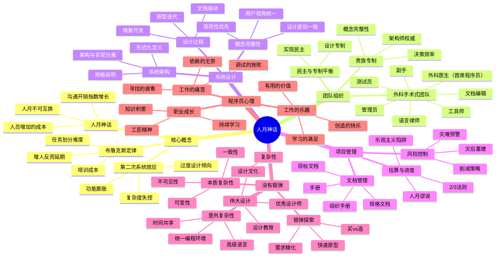

## ✍️ 读书笔记

### 第1章：焦油坑

**本章要点**：通过比喻描述大型软件项目开发团队所面临的困境。

#### 重点摘录
> "一个大型编程项目就像一个巨大的焦油坑，许多巨兽在其中猛烈挣扎，想要从中挣脱出来。"

> "看起来似乎只有强壮的巨兽才能逃脱，但实际上它们都深陷其中。"

#### 焦油坑的特征

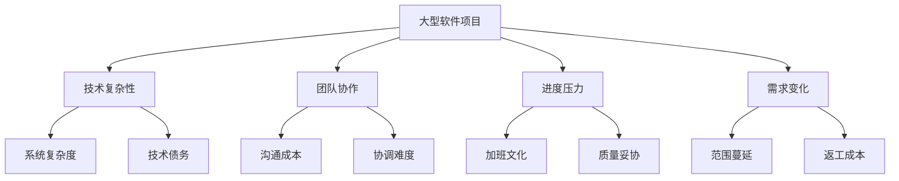

#### 不同规模的编程项目

| 项目类型 | 人数 | 代码量 | 主要挑战 |
|---------|------|--------|---------|
| 个人程序 | 1 | 数千行 | 完成功能 |
| 小型团队 | 2-5 | 数万行 | 接口定义 |
| 大型项目 | 10+ | 数十万行 | 概念完整性 |
| 系统工程 | 100+ | 百万行 | 组织协调 |

---

### 第2章：人月神话

**本章要点**：揭示"人月"作为工作量单位的谬误，这是全书的核心论点。

#### 重点摘录
> "用人月来衡量工作进度是一个危险且具有欺骗性的神话。因为人月意味着人可以与月互换。"

> "当一项任务因为延误而落后于进度时，只有增加更多的人才有可能追上进度，但增加人手往往会造成更多的延误。"

#### 人月谬误的本质

```
传统思维（错误）：
工作总量 = 人数 × 月数
10人月的工作 = 10人 × 1月 = 1人 × 10月

现实情况：
┌────────────────────────────────────────────┐
│  增加人手的实际成本：                        │
│                                            │
│  1. 培训成本 - 新人需要时间学习              │
│  2. 沟通成本 - 人数增加，沟通路径指数增长     │
│  3. 划分成本 - 任务难以完美分割              │
│  4. 协调成本 - 需要更多同步和协调             │
└────────────────────────────────────────────┘
```

#### 沟通成本的计算

```mermaid
graph LR
    A[2人团队] -->|"1条沟通路径"| B[n(n-1)/2]
    C[5人团队] -->|"10条沟通路径"| B
    D[10人团队] -->|"45条沟通路径"| B
    E[20人团队] -->|"190条沟通路径"| B
```

#### 布鲁克斯定律

> **布鲁克斯定律**：向进度落后的软件项目增加人手，只会让进度更加落后。

**原因分析**：

| 因素 | 描述 | 影响程度 |
|------|------|---------|
| **重新划分任务** | 需要重新分配工作 | 中等 |
| **培训新人** | 老员工需要指导新员工 | 高 |
| **额外沟通** | 团队规模增加导致沟通成本上升 | 很高 |
| **工作中断** | 现有工作被打断 | 中等 |

---

### 第3章：外科手术式团队

**本章要点**：提出一种高效的小型团队组织模式——外科手术式团队。

#### 重点摘录
> "整个程序应该由一个人来完成，但这对于大型系统是不可能的。解决方案是让一个人做所有关键的设计决策，而由其他人提供支持。"

#### 外科手术式团队结构

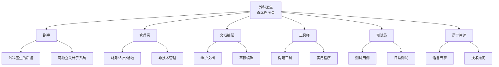

#### 外科手术式团队 vs 传统团队

| 特性 | 外科手术式团队 | 传统团队 |
|------|---------------|---------|
| **决策方式** | 一人主导 | 集体决策 |
| **概念完整性** | 高 | 低 |
| **沟通成本** | 低 | 高 |
| **风险** | 核心人员依赖 | 分散 |
| **适用规模** | 中小型项目 | 大型项目 |
| **灵活性** | 低 | 高 |

---

### 第4章：贵族专制、民主和系统设计

**本章要点**：讨论如何在保持概念完整性的同时，平衡设计的专制与实现的民主。

#### 重点摘录
> "概念完整性是系统设计中最重要的考虑因素。"

> "系统的简洁和直率来自于概念完整性：每个部分使用相同的术语和相同的技术，每一个部分都反映同样的设计哲学。"

#### 概念完整性的重要性

```
概念完整性的好处：

1. 易用性
   └─ 用户只需理解一套概念

2. 易学性
   └─ 学习一个部分，其他部分触类旁通

3. 易维护性
   └─ 修改符合统一的设计原则

4. 经济性
   └─ 避免冗余和不一致性
```

#### 架构师的角色

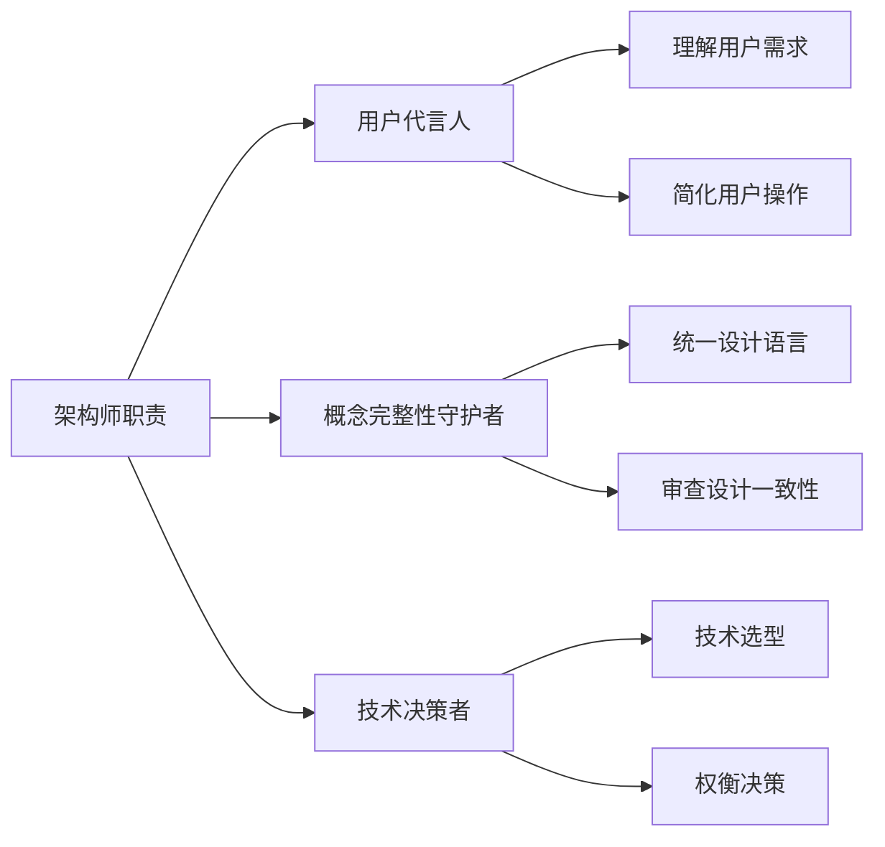

#### 贵族专制 vs 民主

| 方面 | 贵族专制（设计） | 民主（实现） |
|------|-----------------|-------------|
| **决策权** | 架构师 | 程序员 |
| **范围** | 外部接口、功能定义 | 内部实现细节 |
| **目标** | 概念完整性 | 效率、创造性 |
| **好处** | 统一的用户体验 | 灵活的解决方案 |

---

### 第5章：画蛇添足

**本章要点**：讨论第二次系统效应——设计第二个系统时的过度设计倾向。

#### 重点摘录
> "第二次系统效应是设计师过度设计第二个系统的一种倾向，因为他们把第一个系统中所有小心翼翼地省去的功能都加到了第二个系统中。"

#### 第二次系统效应的表现

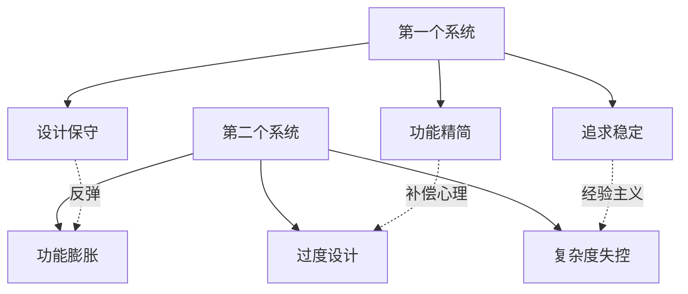

#### 第二次系统效应案例

| 领域 | 第一个系统 | 第二个系统 | 问题 |
|------|-----------|-----------|------|
| **操作系统** | 简单、功能有限 | 功能全面、复杂 | OS/360过度设计 |
| **编程语言** | 核心特性 | 特性膨胀 | PL/I语言臃肿 |
| **软件架构** | 单体架构 | 微服务过度拆分 | 运维复杂度上升 |

#### 如何避免第二次系统效应

```
防范措施：

1. 自我意识
   └─ 认识到这种倾向的存在

2. 严格约束
   └─ 为每个功能设定明确的优先级

3. 用户导向
   └─ 始终从用户需求出发

4. 定期审查
   └─ 定期质疑每个功能的必要性

5. 延迟决策
   └─ 不要过早添加"可能有用"的功能
```

---

### 第6章：贯彻执行

**本章要点**：讨论如何确保系统的概念完整性得以贯彻执行。

#### 重点摘录
> "即使有了好的架构设计，如果没有有效的贯彻执行，概念完整性也会在实现过程中被破坏。"

#### 执行机制

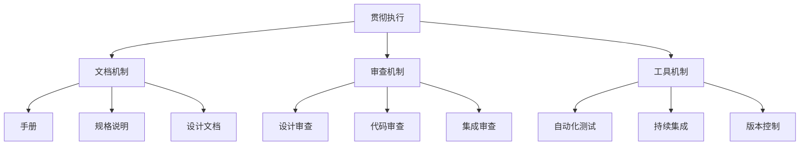

#### 手册的作用

| 手册类型 | 目的 | 读者 |
|---------|------|------|
| **系统手册** | 定义系统外部功能 | 架构师、用户 |
| **实现手册** | 描述内部结构 | 程序员 |
| **用户手册** | 指导使用 | 最终用户 |

---

### 第7章：为什么巴别塔会失败

**本章要点**：通过巴别塔的故事，讨论大型项目中沟通失败的原因。

#### 重点摘录
> "巴别塔失败的原因是：沟通失败导致组织失败，组织失败导致项目失败。"

> "因为项目的工作是相互关联的，无法独立完成，所以沟通问题会成为项目的主要障碍。"

#### 沟通失败的层次

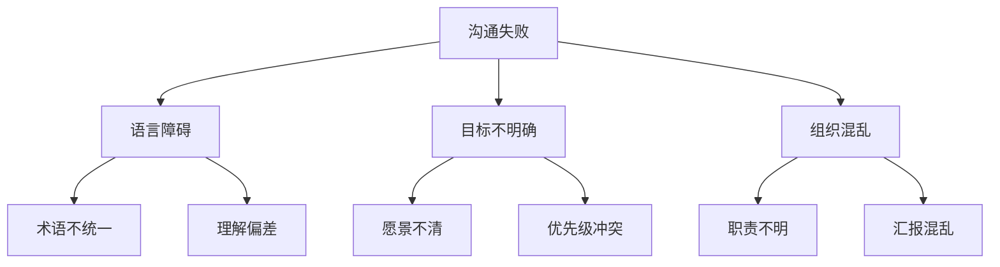

#### 沟通解决方案

```
减少沟通失败的方法：

1. 正式文档
   ┌────────────────────────────────┐
   │ • 统一的术语定义               │
   │ • 明确的接口规范               │
   │ • 清晰的职责划分               │
   └────────────────────────────────┘

2. 会议机制
   ┌────────────────────────────────┐
   │ • 定期状态会议                 │
   │ • 技术评审会议                 │
   │ • 问题升级会议                 │
   └────────────────────────────────┘

3. 工具支持
   ┌────────────────────────────────┐
   │ • 版本控制系统                 │
   │ • 问题追踪系统                 │
   │ • 文档管理系统                 │
   └────────────────────────────────┘

4. 组织设计
   ┌────────────────────────────────┐
   │ • 减少依赖关系                 │
   │ • 清晰的接口边界               │
   │ • 小型自治团队                 │
   └────────────────────────────────┘
```

---

### 第8-14章：设计系统

**本章要点**：深入讨论系统设计的各个方面，包括概念完整性、ESH（Elegant Solution Handler）、文档等。

#### 系统设计原则

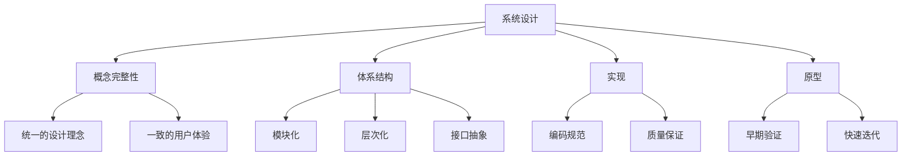

#### 设计阶段的划分

| 阶段 | 主要活动 | 输出物 |
|------|---------|--------|
| **需求分析** | 理解用户需求 | 需求文档 |
| **架构设计** | 确定系统结构 | 架构文档 |
| **详细设计** | 设计模块细节 | 设计文档 |
| **实现** | 编写代码 | 源代码 |
| **集成** | 组装系统 | 可执行系统 |
| **测试** | 验证功能 | 测试报告 |

---

### 第15章：再论《人月神话》

**本章要点**：回顾前文观点，讨论《人月神话》发表后的反响和进一步思考。

#### 核心观点回顾

```
《人月神话》的核心观点：

1. 人月不可互换
   └─ 增加人手不等于增加生产力

2. 概念完整性至关重要
   └─ 好的系统由一个人设计，多人实现

3. 第二次系统效应
   └─ 警惕第二个系统的过度设计

4. 文档是项目成功的关键
   └─ 没有文档就没有管理

5. 增量开发是唯一可行的方法
   └─ 一次性完成大型系统几乎不可能
```

---

### 第16章：没有银弹

**本章要点**：讨论软件工程中"本质复杂性"的问题，断言在十年内不会有任何单一的突破能够大幅提高软件生产力。

#### 重点摘录
> "我认为没有任何单一的技术或管理改进，能够使软件生产率在十年内提高一个数量级。"

> "软件工程的困难分为两类：本质困难和意外困难。我们无法消除本质困难，只能想办法减轻。"

#### 本质复杂性的四个方面

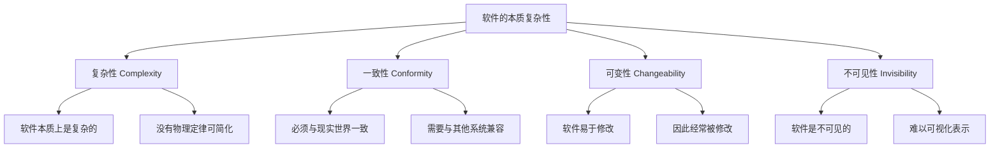

#### 本质困难 vs 意外困难

| 类型 | 描述 | 解决方向 |
|------|------|---------|
| **本质困难** | 软件固有的复杂性 | 只能缓解，无法消除 |
| **意外困难** | 人为造成的困难 | 可以通过工具、方法改进 |

#### 可能的银弹方向

```
可能的改进方向：

1. 买，不造（Buy vs Build）
   ┌────────────────────────────────┐
   │ • 使用现成的软件包             │
   │ • 复用成熟的组件               │
   │ • 利用开源软件                 │
   └────────────────────────────────┘

2. 需求精化和快速原型
   ┌────────────────────────────────┐
   │ • 尽早暴露需求问题             │
   │ • 通过原型验证需求             │
   │ • 迭代细化需求                 │
   └────────────────────────────────┘

3. 增量开发
   ┌────────────────────────────────┐
   │ • 小步快跑                     │
   │ • 持续交付                     │
   │ • 及早获得反馈                 │
   └────────────────────────────────┘

4. 伟大设计者
   ┌────────────────────────────────┐
   │ • 培养优秀的设计师             │
   │ • 建立设计文化                 │
   │ • 崇尚卓越设计                 │
   └────────────────────────────────┘
```

---

### 第17-19章：再论《没有银弹》

**本章要点**：对《没有银弹》一文发表后的讨论进行回应，进一步阐述观点。

#### 关于银弹的进一步思考

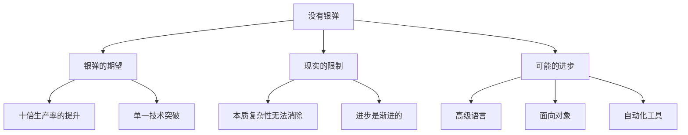

#### 软件工程进步的历史视角

| 时期 | 主要进步 | 效果 |
|------|---------|------|
| **1950s** | 汇编语言 | 小幅提升 |
| **1960s** | 高级语言(FORTRAN, COBOL) | 5倍提升 |
| **1970s** | 结构化编程 | 质量提升 |
| **1980s** | 面向对象 | 可维护性提升 |
| **1990s** | 组件化、框架 | 复用性提升 |
| **2000s** | 敏捷开发 | 响应性提升 |
| **2010s** | DevOps、云原生 | 交付效率提升 |

---

## 💡 个人思考

### 1. 关于人月神话的现代解读

布鲁克斯定律在当今敏捷开发时代仍然适用，但有了新的理解：

**传统解读**：增加人手只会让项目更晚。

**现代解读**：
- 在项目**后期**增加人手确实会使项目延期
- 但在项目**早期**适当增加人手是有效的
- 关键在于**如何**增加人手，而不是要不要增加

```
有效增加人手的策略：

1. 提前规划
   └─ 在需要之前就开始招聘和培训

2. 分层引入
   └─ 不要一次性大量增加

3. 明确分工
   └─ 每个人有清晰的职责边界

4. 减少依赖
   └─ 设计可独立开发的模块

5. 加强文档
   └─ 让新人能快速上手
```

### 2. 关于概念完整性的思考

概念完整性是软件质量的基石，但在现实中常常被忽视：

| 问题 | 表现 | 解决方案 |
|------|------|---------|
| **多人设计** | 接口风格不统一 | 指定单一架构师 |
| **需求蔓延** | 功能越来越多 | 严格控制范围 |
| **技术债务** | 妥协越来越多 | 定期重构 |
| **历史包袱** | 新旧代码混杂 | 渐进式迁移 |

### 3. 关于没有银弹的思考

布鲁克斯断言没有银弹已经过去了近40年，软件工程确实没有出现"十倍提升"的单一突破，但整体的进步是显著的：

```
没有银弹，但有组合拳：

┌─────────────────────────────────────────────┐
│  工具进步                                    │
│  ├── IDE智能辅助                            │
│  ├── 自动化测试                             │
│  ├── 持续集成/持续部署                      │
│  └── AI辅助编程                             │
├─────────────────────────────────────────────┤
│  方法进步                                    │
│  ├── 敏捷开发                               │
│  ├── 测试驱动开发                           │
│  ├── 领域驱动设计                           │
│  └── 微服务架构                             │
├─────────────────────────────────────────────┤
│  复用进步                                    │
│  ├── 开源生态                               │
│  ├── 云服务                                 │
│  ├── 低代码平台                             │
│  └── 组件库                                 │
└─────────────────────────────────────────────┘
```

### 4. 关于外科手术式团队的现代应用

外科手术式团队的理念在现代软件开发中有了新的体现：

| 原始角色 | 现代对应 | 职责 |
|---------|---------|------|
| 外科医生 | 技术负责人/Tech Lead | 技术决策、架构设计 |
| 副手 | 高级工程师 | 技术支持、方案评审 |
| 管理员 | 项目经理/Scrum Master | 项目管理、资源协调 |
| 文档编辑 | 技术文档工程师 | 文档维护 |
| 工具师 | DevOps工程师 | 工具链建设 |
| 测试员 | QA工程师 | 质量保证 |
| 语言律师 | 技术专家 | 深度技术咨询 |

### 5. 关于第二次系统效应的警惕

在当今技术快速迭代的时代，第二次系统效应尤为常见：

```
警惕信号：

1. "这次我们要把上次没做的都加上"
2. "用户可能需要这个功能"
3. "技术上很有挑战性，值得实现"
4. "为了将来扩展性，需要抽象"

应对策略：

1. 每个功能必须证明其必要性
2. 用数据说话，而非猜测
3. 遵循YAGNI原则（You Aren't Gonna Need It）
4. 定期审视和删减功能
```

---

## 🎯 实践应用

### 项目管理检查清单

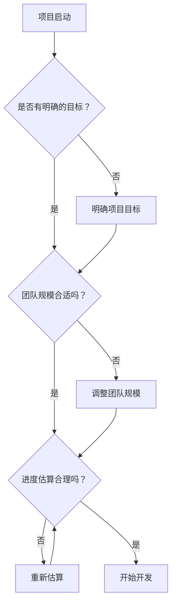

### 布鲁克斯定律应用指南

| 场景 | 建议 | 原因 |
|------|------|------|
| **项目初期** | 可以适当增加人手 | 有足够时间培训和整合 |
| **项目中期** | 谨慎增加人手 | 需要权衡培训成本和产出 |
| **项目后期** | 不建议增加人手 | 培训成本大于收益 |
| **紧急情况** | 考虑削减功能 | 比增加人手更有效 |

### 团队协作改进计划

```
行动计划1：建立清晰的文档体系
┌────────────────────────────────────────────┐
│ 具体步骤：                                  │
│ 1. 建立术语词典，统一团队语言               │
│ 2. 编写架构文档，明确系统边界               │
│ 3. 维护API文档，确保接口一致               │
│ 4. 定期审查文档，保持更新                   │
│                                            │
│ 预期效果：                                  │
│ • 新人上手时间减少50%                       │
│ • 沟通误解减少                              │
│ • 概念完整性提升                            │
└────────────────────────────────────────────┘

行动计划2：控制团队规模
┌────────────────────────────────────────────┐
│ 具体步骤：                                  │
│ 1. 每个子团队不超过7人                      │
│ 2. 明确团队间的接口和依赖                   │
│ 3. 定期举行跨团队协调会议                   │
│ 4. 减少不必要的跨团队依赖                   │
│                                            │
│ 预期效果：                                  │
│ • 沟通效率提升                              │
│ • 决策速度加快                              │
│ • 责任更加清晰                              │
└────────────────────────────────────────────┘

行动计划3：增量开发实践
┌────────────────────────────────────────────┐
│ 具体步骤：                                  │
│ 1. 将大项目拆分为小迭代                     │
│ 2. 每个迭代交付可用的功能                   │
│ 3. 及时收集反馈并调整                       │
│ 4. 保持向后兼容                             │
│                                            │
│ 预期效果：                                  │
│ • 风险降低                                  │
│ • 反馈加快                                  │
│ • 质量提升                                  │
└────────────────────────────────────────────┘
```

### 风险管理策略

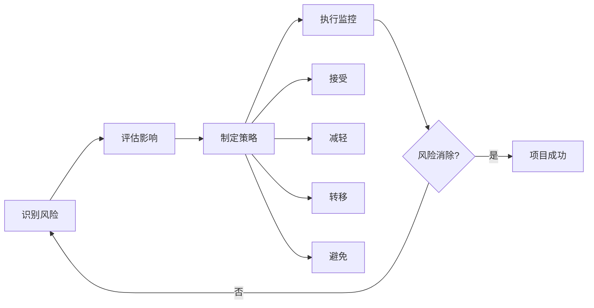

---

## 🔗 相关扩展

### 相关书籍推荐

| 书名 | 作者 | 推荐理由 |
|------|------|---------|
| **《人件》** | Tom DeMarco, Timothy Lister | 从人的角度讨论软件项目，与《人月神话》互补 |
| **《梦断代码》** | Scott Rosenberg | 现代软件项目失败的案例分析 |
| **《程序员的职业素养》** | Robert C. Martin | 软件工程师的职业发展指南 |
| **《敏捷软件开发》** | Robert C. Martin | 敏捷方法的实践指南 |
| **《设计模式》** | GoF | 软件设计的经典模式 |
| **《领域驱动设计》** | Eric Evans | 复杂软件系统的设计方法 |

### 在线资源

- **[Brooks的个人主页](https://www.cs.unc.edu/~brooks/)** - 北卡罗来纳大学教堂山分校
- **[The Mythical Man-Month Wiki](https://en.wikipedia.org/wiki/The_Mythical_Man-Month)** - 维基百科条目
- **[No Silver Bullet Wiki](https://en.wikipedia.org/wiki/No_Silver_Bullet)** - 没有银弹的维基百科条目
- **[IEEE Software Engineering](https://www.computer.org/csdl/magazine/so)** - 软件工程领域的权威期刊

### 经典论文

1. **"No Silver Bullet: Essence and Accidents of Software Engineering"** (1986)
2. **"'No Silver Bullet' Refired"** (1995)
3. **"The Computer Scientist as Toolsmith"** (1996)

### 延伸阅读主题

- **敏捷项目管理** - 现代软件开发方法论
- **DevOps文化** - 开发与运维的协作
- **系统思维** - 理解复杂系统的方法
- **认知负荷理论** - 理解软件开发中的认知限制

---

## 📊 学习总结

### 最大的收获

1. **人月不可互换**是一个简单但深刻的道理。在项目管理中，要时刻警惕"加人就能加快进度"的思维陷阱。

2. **概念完整性**是优秀系统的核心特征。一个系统的成功不在于功能的多少，而在于概念的一致性。

3. **没有银弹**让我认识到软件工程的本质困难，但也看到了通过组合多种方法持续改进的可能性。

4. **第二次系统效应**提醒我要警惕过度设计的倾向，保持克制和聚焦。

### 改变的观念

| 旧观念 | 新观念 |
|--------|--------|
| 加人可以加快进度 | 加人往往会使进度更慢 |
| 功能越多越好 | 概念完整性比功能数量更重要 |
| 重写可以解决所有问题 | 渐进式改进更有效 |
| 技术决定一切 | 人和组织因素同样重要 |
| 期待银弹的出现 | 持续积累小改进 |

### 未来行动

- [ ] 在实际项目中应用布鲁克斯定律
- [ ] 建立项目的概念完整性标准
- [ ] 实践增量开发方法
- [ ] 减少团队沟通开销
- [ ] 阅读《人件》等相关书籍
- [ ] 分享所学给团队成员

## 💭 深度衍生思考

### 🎯 核心观点延伸

**从"人月神话"到现代敏捷的演进**

布鲁克斯定律诞生于1975年的大型机时代，但在敏捷开发的今天依然有重要启示。

*延伸逻辑*：
- 布鲁克斯定律揭示了大规模团队协作的固有问题
- 敏捷开发通过小团队、迭代开发规避了这些问题
- 现代DevOps实践进一步验证了布鲁克斯的洞察

*支撑证据*：
- 敏捷宣言强调"个体和互动高于流程和工具"
- Scrum框架建议团队规模为7±2人
- Amazon的"两个披萨团队"原则
- Facebook的"快速行动，打破常规"需要小团队

*实践意义*：
- 现代项目管理需要平衡规模和效率
- 小团队+自动化工具可以突破布鲁克斯定律的限制
- 微服务架构与组织架构的对齐

### 🔍 多角度分析

**历史视角**：软件工程管理思想的演进
```
1950s-60s: 编程被视为艺术创作
1975: 人月神话出版，系统化管理理论建立
1990s: CMM等过程改进模型
2000s: 敏捷运动兴起，强调人和响应性
2010s: DevOps运动，开发和运维融合
2020s: 远程协作和异步沟通
```

**现代视角**：布鲁克斯定律在云原生时代的应用
- 容器化技术降低环境配置的沟通成本
- 基础设施即代码减少运维团队间的沟通需求
- 微服务架构：小团队对应小服务，降低沟通开销
- CI/CD流水线：自动化减少人工协调

**反向思考**：如果布鲁克斯定律不存在会怎样？
- 项目经理会盲目增加人手
- 大型项目的失败率会更高
- 软件工程的科学性会受到质疑

### 🚀 创新思考

**潜在改进**：布鲁克斯定律的现代局限
1. **AI辅助编程**降低培训成本
2. **协作工具**减少沟通开销
3. **自动化测试**减少协调需求

**新方向探索**：
1. **AI时代的团队协作**
2. **分布式团队管理**
3. **量化项目管理**

## 🔗 知识关联网络

### 与已读书籍的关联

- **架构整洁之道** - 关联强度: ⭐⭐⭐⭐⭐
  - 关联点：系统设计和架构原则的关联
  - 实践价值：好的架构需要团队的协同设计

- **设计模式** - 关联强度: ⭐⭐⭐⭐
  - 关联点：设计模式支持概念完整性
  - 实践价值：模式化的设计降低沟通成本

- **重构** - 关联强度: ⭐⭐⭐⭐
  - 关联点：重构是渐进式改进，而非重新开始
  - 实践价值：避免"第二次系统效应"的陷阱

### 概念映射

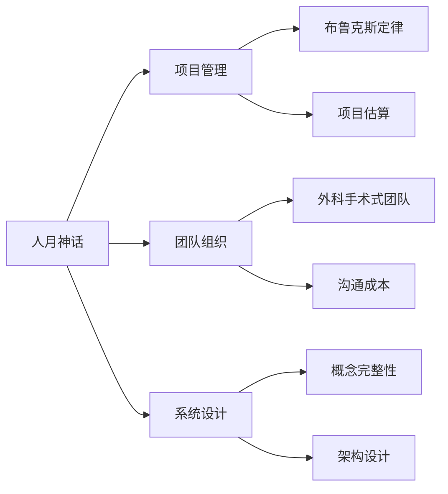

### 知识依赖关系

**前置知识**：
- 软件开发基础经验
- 项目管理基本概念

**后续延伸**：
- 敏捷项目管理（Scrum、Kanban）
- DevOps实践
- 产品管理
- 组织设计

## 📚 后续阅读路径规划

### 直接延伸

1. **《人件》** - Tom DeMarco, Timothy Lister
   - 关联度: ⭐⭐⭐⭐⭐
   - 阅读优先级: 高
   - 预期收获: 从人的角度深入理解软件项目

2. **《敏捷软件开发》** - Robert C. Martin
   - 关联度: ⭐⭐⭐⭐⭐
   - 阅读优先级: 高
   - 预期收获: 学习现代敏捷方法

### 交叉验证

1. **《梦断代码》** - Scott Rosenberg
   - 对比点：现代软件项目失败的案例
   - 价值：验证布鲁克斯定律的有效性

### 实践补充

1. **敏捷实践项目**
   - 在实际项目中应用Scrum或Kanban
   - 观察不同团队规模的沟通成本

## 🎓 专家视角深度分析

### 王建华教授（商业科技）

**核心洞察**：
1. 人月神话揭示了规模经济的临界点
2. 概念完整性是产品成功的关键要素
3. 布鲁克斯定律适用于各种知识工作

**深度分析**：
- **项目管理的经济学原理**：知识工作的规模不经济
- **概念完整性的商业价值**：一致体验建立品牌认知
- **现代企业的组织创新**：Amazon两个披萨团队、Spotify小组模式

**综合结论**：
《人月神话》的核心洞察在今天依然有效：
- 布鲁克斯定律揭示知识工作的特殊性
- 概念完整性是产品的基本原则
- 项目管理的科学基础

---

## 📈 阅读进度

- [x] 第1章：焦油坑
- [x] 第2章：人月神话
- [x] 第3章：外科手术式团队
- [x] 第4章：贵族专制、民主和系统设计
- [x] 第5章：画蛇添足
- [x] 第6章：贯彻执行
- [x] 第7章：为什么巴别塔会失败
- [x] 第8-14章：设计系统
- [x] 第15章：再论《人月神话》
- [x] 第16章：没有银弹
- [x] 第17-19章：再论《没有银弹》

**阅读完成度**: 100%（概要学习完成，后续将结合实践深入研读）

**下一步**：
1. 在实际项目中应用所学原则
2. 定期回顾本书，加深理解
3. 阅读相关书籍如《人件》
4. 与团队分享核心观点

---

**创建日期**: 2026年3月2日
**最后更新**: 2026年4月17日
**阅读状态**: 📖 持续学习，持续实践中...
**笔记版本**: v2.0
**升级说明**: 添加深度衍生思考、知识关联网络、后续阅读路径规划和专家视角分析

---

**Sources**:
- [The Mythical Man-Month - Wikipedia](https://en.wikipedia.org/wiki/The_Mythical_Man-Month)
- [No Silver Bullet - Wikipedia](https://en.wikipedia.org/wiki/No_Silver_Bullet)
- [Frederick Brooks - UNC](https://www.cs.unc.edu/~brooks/)
