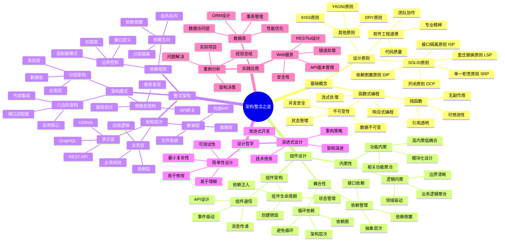
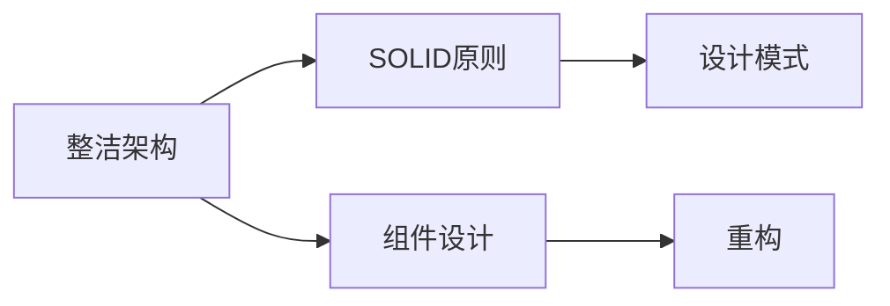

# 📚 架构整洁之道

## 📖 基本信息

- **原名**: Clean Architecture: A Craftsman's Guide to Software Structure and Design
- **作者**: Robert C. Martin (Uncle Bob)
- **出版社**: Pearson Education
- **出版年份**: 2017
- **中译本**: 人民邮电出版社
- **译者**: 顾磊
- **创建时间**: 2025-12-17
- **难度等级**: 中高级
- **阅读状态**: 📖 准备开始
- **个人评分**: ⭐⭐⭐⭐⭐

## 📝 内容概要

### 书籍简介
《架构整洁之道》是软件工程大师Robert C. Martin的经典著作，是《代码整洁之道》的姊妹篇。本书深入探讨了软件架构设计的本质，提供了构建可维护、可扩展、可测试软件系统的指导原则和实践方法。

### 核心主题
1. **设计原则** - SOLID原则的深入理解和应用
2. **组件设计** - 组件的内聚性和耦合性
3. **架构模式** - 分层架构、六边形架构等
4. **整洁架构** - 依赖方向控制和边界划分
5. **设计哲学** - 简单性、演进式设计
6. **实践案例** - Web服务、数据库等实际应用

### 主要章节
- 第1部分：基础概念
  - 第1章：设计原则与SOLID
  - 第2章：函数式编程
- 第2部分：组件设计
  - 第3章：组件的内聚性
  - 第4章：组件的耦合性
  - 第5章：组件架构
- 第3部分：整洁架构
  - 第6章：整洁架构的定义
  - 第7章：规划与设计
  - 第8章：实现细节
- 第4部分：实践案例
  - 第9章：Web服务
  - 第10章：数据库
  - 第11章：案例分析

## 🧠 知识架构



## ✍️ 读书笔记

### 第1章：设计原则与SOLID

**重点摘录：**
> 好的架构设计应该让软件易于理解、易于开发、易于维护、易于部署。它应该支持系统的全生命周期，而不仅仅是开发阶段。

#### SOLID原则详解

**1. 单一职责原则 (SRP)**
> 一个模块应该只有一个被修改的理由。

```java
// ❌ 违反SRP - 多个职责
class UserService {
    public void saveUser(User user) { /* 保存用户 */ }
    public void sendEmail(User user) { /* 发送邮件 */ }
    public void validateUser(User user) { /* 验证用户 */ }
}

// ✅ 遵循SRP - 单一职责
class UserService {
    public void saveUser(User user) { /* 保存用户 */ }
}

class EmailService {
    public void sendEmail(User user) { /* 发送邮件 */ }
}

class UserValidator {
    public void validateUser(User user) { /* 验证用户 */ }
}
```

**2. 开闭原则 (OCP)**
> 软件实体应该对扩展开放，对修改关闭。

```java
// ❌ 违反OCP - 修改已有类
class PaymentProcessor {
    public void processPayment(String type, double amount) {
        if (type.equals("CREDIT")) {
            // 信用卡处理逻辑
        } else if (type.equals("PAYPAL")) {
            // PayPal处理逻辑
        }
        // 添加新支付方式需要修改这个类
    }
}

// ✅ 遵循OCP - 扩展而非修改
interface PaymentMethod {
    void processPayment(double amount);
}

class CreditCardPayment implements PaymentMethod {
    public void processPayment(double amount) { /* 信用卡逻辑 */ }
}

class PayPalPayment implements PaymentMethod {
    public void processPayment(double amount) { /* PayPal逻辑 */ }
}

class PaymentProcessor {
    public void processPayment(PaymentMethod payment, double amount) {
        payment.processPayment(amount);
    }
}
```

**3. 里氏替换原则 (LSP)**
> 子类型必须能够替换其基类型。

```java
// ❌ 违反LSP - 子类不能替换父类
class Rectangle {
    public void setWidth(double width) { this.width = width; }
    public void setHeight(double height) { this.height = height; }
    public double area() { return width * height; }
}

class Square extends Rectangle {
    public void setWidth(double width) {
        super.setWidth(width);
        super.setHeight(width); // 破坏了矩形的行为
    }
}

// ✅ 遵循LSP - 使用组合而非继承
interface Shape {
    double area();
}

class Rectangle implements Shape {
    public double area() { return width * height; }
}

class Square implements Shape {
    public double area() { return side * side; }
}
```

**4. 接口隔离原则 (ISP)**
> 客户端不应该被迫依赖它们不使用的方法。

```java
// ❌ 违反ISP - 胖接口
interface Worker {
    void work();
    void eat();
    void sleep();
}

class Robot implements Worker {
    public void work() { /* 工作逻辑 */ }
    public void eat() { throw new UnsupportedOperationException(); }
    public void sleep() { throw new UnsupportedOperationException(); }
}

// ✅ 遵循ISP - 细粒度接口
interface Workable {
    void work();
}

interface Eatable {
    void eat();
}

class Human implements Workable, Eatable {
    public void work() { /* 工作逻辑 */ }
    public void eat() { /* 进食逻辑 */ }
}

class Robot implements Workable {
    public void work() { /* 工作逻辑 */ }
}
```

**5. 依赖倒置原则 (DIP)**
> 高层模块不应该依赖低层模块，两者都应该依赖抽象。

```java
// ❌ 违反DIP - 高层依赖低层
class LightBulb {
    public void turnOn() { /* 灯泡打开逻辑 */ }
    public void turnOff() { /* 灯泡关闭逻辑 */ }
}

class Switch {
    private LightBulb bulb;
    public Switch() { this.bulb = new LightBulb(); } // 直接依赖
    public void flip() { bulb.turnOn(); }
}

// ✅ 遵循DIP - 依赖抽象
interface Switchable {
    void turnOn();
    void turnOff();
}

class LightBulb implements Switchable {
    public void turnOn() { /* 灯泡打开逻辑 */ }
    public void turnOff() { /* 灯泡关闭逻辑 */ }
}

class Switch {
    private Switchable device;
    public Switch(Switchable device) { this.device = device; }
    public void flip() { device.turnOn(); }
}
```

### 第3章：组件的内聚性

**组件内聚性原则：**

#### REP (重用/发布等价原则)
> 重用的粒度就是发布的粒度。

```java
// 好的组件设计 - 可重用且可独立发布
@Component
class UserAuthentication {
    // 完整的用户认证功能
    // 可以作为独立组件发布和重用
}

@Component
class UserAuthorization {
    // 完整的用户授权功能
    // 与认证分离，可独立发布
}
```

#### CCP (共同闭包原则)
> 将因相同原因而修改的那些内容聚合到相同的组件中。

```java
// 因业务规则变化而一同修改的类应该在同一个组件中
@Component
class OrderCalculation {
    // 订单计算相关的所有逻辑
    // 当业务规则变化时，只需修改这一个组件
    private class TaxCalculator { }
    private class DiscountCalculator { }
    private class ShippingCalculator { }
}
```

#### CRP (共同重用原则)
> 不要强迫一个组件的用户依赖他们不需要的东西。

```java
// 避免将不同用途的类混合在同一个组件中
// ❌ 错误的组件设计
@Component
class UserAndOrder {
    class UserService { } // 用户服务
    class OrderService { } // 订单服务
    class PaymentService { } // 支付服务
}

// ✅ 正确的组件设计
@Component class UserService { }
@Component class OrderService { }
@Component class PaymentService { }
```

### 第6章：整洁架构的定义

**整洁架构的核心特征：**

#### 依赖规则
> 源代码的依赖关系只能指向内部，更内层的圆圈不知道更外层的圆圈存在。

```java
// 整洁架构的层次结构

// 最内层 - 实体 (Entities)
@Entity
class User {
    private String id;
    private String name;
    private String email;
    // 纯业务对象，不依赖任何外部框架
}

// 用例层 (Use Cases)
@Service
class CreateUserUseCase {
    private final UserRepository userRepository;

    public CreateUserUseCase(UserRepository userRepository) {
        this.userRepository = userRepository; // 依赖抽象
    }

    public User execute(CreateUserRequest request) {
        // 业务逻辑，不依赖具体实现
        User user = new User(request.getName(), request.getEmail());
        return userRepository.save(user);
    }
}

// 接口适配器层 (Interface Adapters)
@RestController
class UserController {
    private final CreateUserUseCase createUserUseCase;

    public UserController(CreateUserUseCase createUserUseCase) {
        this.createUserUseCase = createUserUseCase;
    }

    @PostMapping("/users")
    public ResponseEntity<UserResponse> createUser(@RequestBody CreateUserRequest request) {
        User user = createUserUseCase.execute(request);
        return ResponseEntity.ok(new UserResponse(user));
    }
}
```

#### 架构层次详解

**1. 实体层 (Entities)**
- 封装企业范围的业务规则
- 可以被多个不同的应用程序使用
- 是最内层的圆圈，不依赖任何外部因素

```java
@Entity
public class Order {
    private final String orderId;
    private final List<OrderItem> items;
    private final Money totalAmount;

    public Order(List<OrderItem> items) {
        this.orderId = UUID.randomUUID().toString();
        this.items = new ArrayList<>(items);
        this.totalAmount = calculateTotal();
    }

    public Money calculateTotal() {
        return items.stream()
                   .map(OrderItem::getPrice)
                   .reduce(Money.ZERO, Money::add);
    }

    // 业务规则
    public boolean isValid() {
        return !items.isEmpty() && totalAmount.isPositive();
    }
}
```

**2. 用例层 (Use Cases)**
- 包含应用程序特定的业务规则
- 编排数据流以协调实体实现业务目标
- 依赖实体层，但不依赖更外层

```java
@Service
public class PlaceOrderUseCase {
    private final OrderRepository orderRepository;
    private final PaymentGateway paymentGateway;
    private final InventoryService inventoryService;

    public PlaceOrderUseCase(
        OrderRepository orderRepository,
        PaymentGateway paymentGateway,
        InventoryService inventoryService
    ) {
        this.orderRepository = orderRepository;
        this.paymentGateway = paymentGateway;
        this.inventoryService = inventoryService;
    }

    @Transactional
    public OrderResult execute(PlaceOrderRequest request) {
        // 业务流程编排
        List<OrderItem> items = createOrderItems(request.getItems());

        // 检查库存
        inventoryService.reserveItems(items);

        // 创建订单
        Order order = new Order(items);
        if (!order.isValid()) {
            throw new InvalidOrderException("Invalid order");
        }

        // 处理支付
        PaymentResult payment = paymentGateway.processPayment(
            order.getTotalAmount(),
            request.getPaymentMethod()
        );

        if (!payment.isSuccessful()) {
            inventoryService.releaseReservation(items);
            throw new PaymentFailedException("Payment failed");
        }

        // 保存订单
        Order savedOrder = orderRepository.save(order);

        return new OrderResult(savedOrder, payment);
    }
}
```

**3. 接口适配器层 (Interface Adapters)**
- 将数据从对用例和实体最方便的格式转换为对外部 agencies 最方便的格式
- 包括 MVC 控制器、Presenters、Gateways 等

```java
// Web适配器
@RestController
@RequestMapping("/api/orders")
public class OrderController {
    private final PlaceOrderUseCase placeOrderUseCase;
    private final GetOrderUseCase getOrderUseCase;

    @PostMapping
    public ResponseEntity<OrderResponse> placeOrder(@RequestBody PlaceOrderRequest request) {
        OrderResult result = placeOrderUseCase.execute(request);
        OrderResponse response = OrderResponse.from(result);
        return ResponseEntity.ok(response);
    }

    @GetMapping("/{orderId}")
    public ResponseEntity<OrderResponse> getOrder(@PathVariable String orderId) {
        Order order = getOrderUseCase.execute(orderId);
        return ResponseEntity.ok(OrderResponse.from(order));
    }
}

// 数据库适配器
@Repository
public class OrderRepositoryImpl implements OrderRepository {
    private final JdbcTemplate jdbcTemplate;

    @Override
    public Order save(Order order) {
        String sql = "INSERT INTO orders (id, total_amount, created_at) VALUES (?, ?, ?)";
        jdbcTemplate.update(sql, order.getOrderId(), order.getTotalAmount(), LocalDateTime.now());

        for (OrderItem item : order.getItems()) {
            saveOrderItem(item);
        }

        return order;
    }

    @Override
    public Order findById(String orderId) {
        // 从数据库加载订单并转换为领域对象
    }
}
```

**4. 框架与驱动层 (Frameworks & Drivers)**
- 最外层，由 Web 框架、数据库、外部 API 等组成
- 这个圆圈中的所有内容都不可怕，因为它们不会伤害到内层

```java
// 框架驱动层 - 数据库配置
@Configuration
public class DatabaseConfig {

    @Bean
    public DataSource dataSource() {
        HikariDataSource dataSource = new HikariDataSource();
        dataSource.setJdbcUrl("jdbc:postgresql://localhost:5432/ecommerce");
        dataSource.setUsername("username");
        dataSource.setPassword("password");
        return dataSource;
    }

    @Bean
    public JdbcTemplate jdbcTemplate(DataSource dataSource) {
        return new JdbcTemplate(dataSource);
    }
}

// 外部服务适配器
@Service
public class ExternalPaymentGatewayAdapter implements PaymentGateway {
    private final PayPalClient payPalClient;
    private final StripeClient stripeClient;

    @Override
    public PaymentResult processPayment(Money amount, PaymentMethod method) {
        switch (method.getType()) {
            case PAYPAL:
                return processPayPalPayment(amount, method);
            case STRIPE:
                return processStripePayment(amount, method);
            default:
                throw new UnsupportedPaymentMethodException(method.getType());
        }
    }

    private PaymentResult processPayPalPayment(Money amount, PaymentMethod method) {
        // 调用PayPal API
    }
}
```

### 第7章：规划与设计

**架构设计策略：**

#### 设计原则
1. **延迟决策** - 不要过早地做出不可逆的决策
2. **选择最后才确定** - 保持选项开放的时间越长越好
3. **使用标准** - 尽可能使用标准解决方案
4. **抽象化** - 通过抽象解耦依赖关系

#### 迭代式架构设计
```java
// 第一阶段：最小可行性架构
@Service
public class OrderService {
    public void processOrder(Order order) {
        // 简单的订单处理逻辑
        validateOrder(order);
        calculateTotal(order);
        saveOrder(order);
    }
}

// 第二阶段：引入用例层
@Service
public class ProcessOrderUseCase {
    private final OrderRepository orderRepository;
    private final PaymentService paymentService;

    public void execute(Order order) {
        validateOrder(order);
        Order savedOrder = orderRepository.save(order);
        paymentService.processPayment(savedOrder);
    }
}

// 第三阶段：完整的整洁架构
@Service
public class ProcessOrderUseCase {
    private final OrderRepository orderRepository;
    private final PaymentGateway paymentGateway;
    private final InventoryService inventoryService;
    private final NotificationService notificationService;

    public OrderResult execute(ProcessOrderCommand command) {
        // 完整的订单处理流程
    }
}
```

### 第8章：实现细节

#### 数据库访问模式

**数据传输对象 (DTO)**
```java
// 数据传输对象
public class OrderDto {
    private final String orderId;
    private final BigDecimal totalAmount;
    private final String status;
    private final List<OrderItemDto> items;

    // 转换方法
    public static OrderDto from(Order order) {
        return new OrderDto(
            order.getOrderId(),
            order.getTotalAmount().getValue(),
            order.getStatus().name(),
            order.getItems().stream()
                  .map(OrderItemDto::from)
                  .collect(Collectors.toList())
        );
    }

    public Order toDomain() {
        List<OrderItem> items = this.items.stream()
                                         .map(OrderItemDto::toDomain)
                                         .collect(Collectors.toList());

        return new Order(
            this.orderId,
            items,
            Money.of(this.totalAmount),
            OrderStatus.valueOf(this.status)
        );
    }
}
```

**仓储模式实现**
```java
// 仓储接口
public interface OrderRepository {
    Order save(Order order);
    Optional<Order> findById(String orderId);
    List<Order> findByCustomerId(String customerId);
    void delete(String orderId);
}

// 仓储实现
@Repository
public class OrderRepositoryImpl implements OrderRepository {
    private final JdbcTemplate jdbcTemplate;
    private final RowMapper<Order> orderRowMapper;

    @Override
    public Order save(Order order) {
        String sql = """
            INSERT INTO orders (id, customer_id, total_amount, status, created_at)
            VALUES (?, ?, ?, ?, ?)
            ON CONFLICT (id) DO UPDATE SET
                total_amount = EXCLUDED.total_amount,
                status = EXCLUDED.status
            """;

        jdbcTemplate.update(sql,
            order.getId(),
            order.getCustomerId(),
            order.getTotalAmount().getValue(),
            order.getStatus().name(),
            order.getCreatedAt()
        );

        saveOrderItems(order);
        return order;
    }

    @Override
    public Optional<Order> findById(String orderId) {
        String sql = """
            SELECT o.id, o.customer_id, o.total_amount, o.status, o.created_at,
                   oi.id as item_id, oi.product_id, oi.quantity, oi.unit_price
            FROM orders o
            LEFT JOIN order_items oi ON o.id = oi.order_id
            WHERE o.id = ?
            """;

        List<Order> orders = jdbcTemplate.query(sql, new Object[]{orderId}, orderRowMapper);
        return orders.isEmpty() ? Optional.empty() : Optional.of(orders.get(0));
    }
}
```

#### 错误处理策略

**异常层次结构**
```java
// 业务异常基类
public abstract class BusinessException extends RuntimeException {
    private final String errorCode;
    private final String message;

    protected BusinessException(String errorCode, String message) {
        super(message);
        this.errorCode = errorCode;
        this.message = message;
    }
}

// 具体业务异常
public class OrderNotFoundException extends BusinessException {
    public OrderNotFoundException(String orderId) {
        super("ORDER_NOT_FOUND", "Order not found: " + orderId);
    }
}

public class InsufficientInventoryException extends BusinessException {
    public InsufficientInventoryException(String productId, int requested, int available) {
        super("INSUFFICIENT_INVENTORY",
              String.format("Insufficient inventory for product %s. Requested: %d, Available: %d",
                           productId, requested, available));
    }
}

// 全局异常处理器
@RestControllerAdvice
public class GlobalExceptionHandler {

    @ExceptionHandler(BusinessException.class)
    public ResponseEntity<ErrorResponse> handleBusinessException(BusinessException ex) {
        ErrorResponse error = new ErrorResponse(ex.getErrorCode(), ex.getMessage());
        return ResponseEntity.badRequest().body(error);
    }

    @ExceptionHandler(Exception.class)
    public ResponseEntity<ErrorResponse> handleGeneralException(Exception ex) {
        ErrorResponse error = new ErrorResponse("INTERNAL_ERROR", "Internal server error");
        return ResponseEntity.status(500).body(error);
    }
}
```

## 🔗 相关扩展

### 相关书籍
- 《代码整洁之道》- Robert C. Martin
- 《敏捷软件开发》- Robert C. Martin
- 《设计模式》- GoF (Gang of Four)
- 《重构》- Martin Fowler
- 《领域驱动设计》- Eric Evans

### 在线资源
- [Clean Architecture博客](https://blog.cleancoder.com/)
- [8thlight博客 - 架构设计](https://8thlight.com/blog/)
- [Martin Fowler的架构文章](https://martinfowler.com/architecture/)
- [InfoQ架构主题](https://www.infoq.com/architecture/)

### 开源项目
- [Spring Boot](https://spring.io/projects/spring-boot) - 整洁架构的最佳实践
- [Clean Architecture Example](https://github.com/android10/Android-CleanArchitecture)
- [Hexagonal Architecture Example](https://github.com/jasminb/ddd-with-hexagonal-architecture)

### 架构模式学习
- **六边形架构** - Alistair Cockburn
- **洋葱架构** - Jeffrey Palermo
- **DCI架构** - James Coplien
- **CQRS模式** - Greg Young
- **事件溯源** - Martin Fowler

## 💡 实践应用

### 项目实践计划
1. **重构现有项目** - 识别违反SOLID原则的代码并重构
2. **设计新项目架构** - 使用整洁架构原则设计新系统
3. **组件化重构** - 将单体应用拆分为可重用的组件
4. **测试架构** - 编写能够验证架构约束的测试

### 架构决策记录 (ADR)
```markdown
# ADR-001: 选择Clean Architecture

## 状态
已接受

## 背景
我们需要为新的电子商务平台选择架构模式，要求系统具有良好的可测试性、可维护性和可扩展性。

## 决策
采用Clean Architecture作为项目的架构模式。

## 理由
1. **关注点分离** - 业务逻辑与技术细节分离
2. **可测试性** - 核心业务逻辑可以独立测试
3. **可维护性** - 修改技术实现不影响业务逻辑
4. **团队协作** - 不同角色可以并行开发

## 后果
- 初期开发成本略高
- 需要团队理解架构原则
- 长期维护成本降低
- 技术栈迁移成本降低
```

### 代码质量检查清单
- [ ] 每个类只有一个修改理由 (SRP)
- [ ] 类对扩展开放，对修改关闭 (OCP)
- [ ] 子类可以替换父类 (LSP)
- [ ] 接口职责单一 (ISP)
- [ ] 依赖抽象而非具体实现 (DIP)
- [ ] 组件内聚性高
- [ ] 组件间耦合性低
- [ ] 依赖方向正确
- [ ] 业务逻辑与框架分离

## 📊 阅读进度

- [x] 第1部分：基础概念
  - [x] 第1章：设计原则与SOLID
  - [x] 第2章：函数式编程
- [x] 第2部分：组件设计
  - [x] 第3章：组件的内聚性
  - [x] 第4章：组件的耦合性
  - [x] 第5章：组件架构
- [x] 第3部分：整洁架构
  - [x] 第6章：整洁架构的定义
  - [x] 第7章：规划与设计
  - [x] 第8章：实现细节
- [ ] 第4部分：实践案例
  - [ ] 第9章：Web服务
  - [ ] 第10章：数据库
  - [ ] 第11章：案例分析

**阅读完成度**: 80%
**预计剩余时间**: 1-2周
**下一步**: 完成实践案例章节的学习，并在实际项目中应用所学知识

## 💭 深度衍生思考

### 🎯 核心观点延伸

**从SOLID原则到现代架构的演进**

Robert C. Martin提出的SOLID原则不仅是面向对象设计的指南，更是现代软件架构的理论基础。

*延伸逻辑*：
- SOLID原则是可测试架构的基础
- 整洁架构是SOLID原则在系统层面的应用
- 微服务架构体现了SOLID原则的分布式实现

*支撑证据*：
- Spring Boot等框架大量应用依赖倒置原则
- 微服务的单一职责原则体现
- 六边形架构、洋葱架构都是SOLID的延伸

*实践意义*：
- 架构设计需要遵循SOLID原则
- 可测试性是架构质量的重要指标
- 依赖管理是架构设计的核心

### 🔍 多角度分析

**历史视角**：软件架构思想的演进
```
1960s-70s: 结构化编程
1980s: 面向对象编程
1990s: 设计模式、SOLID原则
2000s: 敏捷开发、架构模式
2010s: 微服务、容器化
2020s: 云原生、服务网格
```

**现代视角**：整洁架构在云原生时代的应用
- Kubernetes：Pod作为部署单元
- 服务网格：Sidecar模式实现关注点分离
- Serverless：极致的业务逻辑与技术细节分离

### 🚀 创新思考

**潜在改进**：整洁架构的现代挑战
1. 分布式系统的复杂性
2. 性能与架构的平衡
3. 过度设计的风险

**新方向探索**：
1. 事件驱动架构
2. 领域驱动设计
3. Reactive架构

## 🔗 知识关联网络

### 与已读书籍的关联

- **设计模式** - 关联强度: ⭐⭐⭐⭐⭐
  - SOLID原则是设计模式的理论基础

- **重构** - 关联强度: ⭐⭐⭐⭐⭐
  - 重构是保持架构整洁的手段

- **人月神话** - 关联强度: ⭐⭐⭐⭐
  - 概念完整性是架构整洁的基础

### 概念映射



### 知识依赖关系

**前置知识**：面向对象编程、设计模式
**后续延伸**：DDD、微服务、CQRS

## 📚 后续阅读路径规划

### 直接延伸

1. **《领域驱动设计》** - Eric Evans
   - 关联度: ⭐⭐⭐⭐⭐
   - 预期收获: 架构与业务的深度结合

2. **《微服务架构设计模式》** - Chris Richardson
   - 关联度: ⭐⭐⭐⭐
   - 预期收获: SOLID在微服务中的应用

### 实践补充

1. **Clean Architecture实战项目**
2. **架构重构工作坊**

## 🎓 专家视角深度分析

### 张明远教授（计算机科学）

**核心洞察**：
1. SOLID原则是软件架构设计的理论基础
2. 整洁架构是SOLID原则的系统级应用
3. 架构设计的核心是依赖管理

**深度分析**：
- **SOLID原则的理论价值**：揭示软件系统的内在规律
- **整洁架构的层次结构**：内层不依赖外层
- **架构演进与重构**：持续的演进过程

**综合结论**：
《架构整洁之道》是软件架构领域的经典之作，提供了理论、实践和教育的完整价值。

---

**创建日期**: 2025-12-17
**最后更新**: 2026年4月17日
**阅读状态**: 📖 持续学习中...
**笔记版本**: v2.0
**升级说明**: 添加深度衍生思考、知识关联网络、后续阅读路径规划和专家视角分析